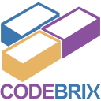
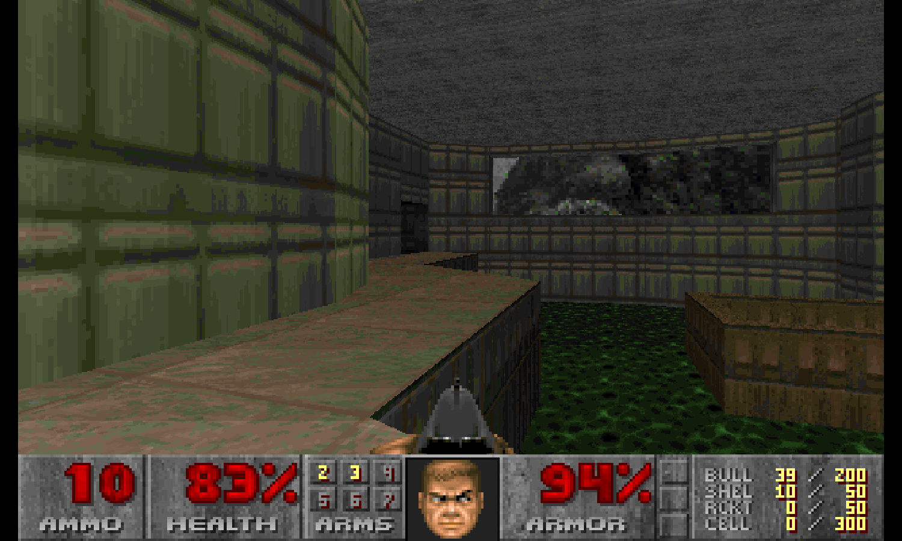
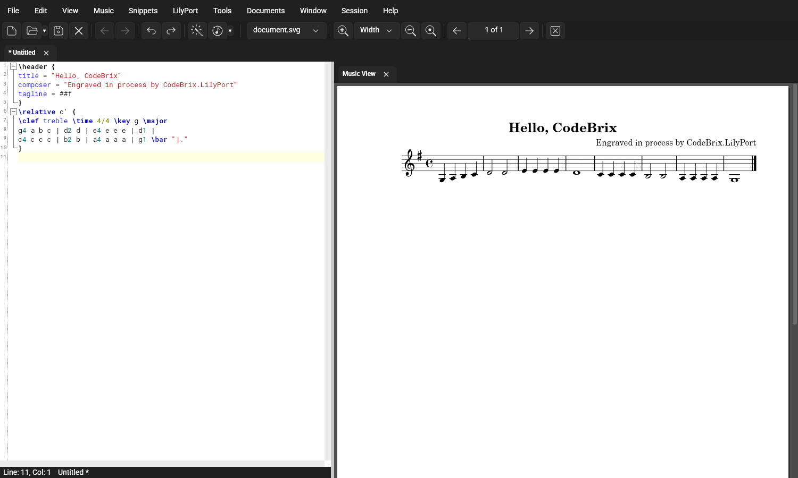
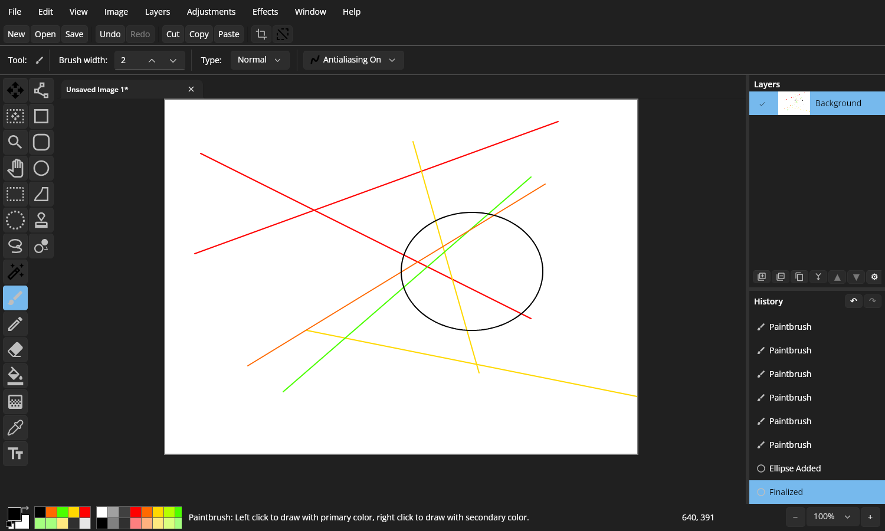
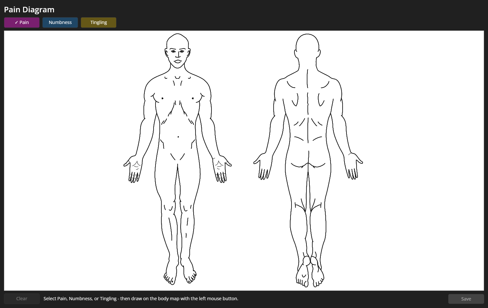
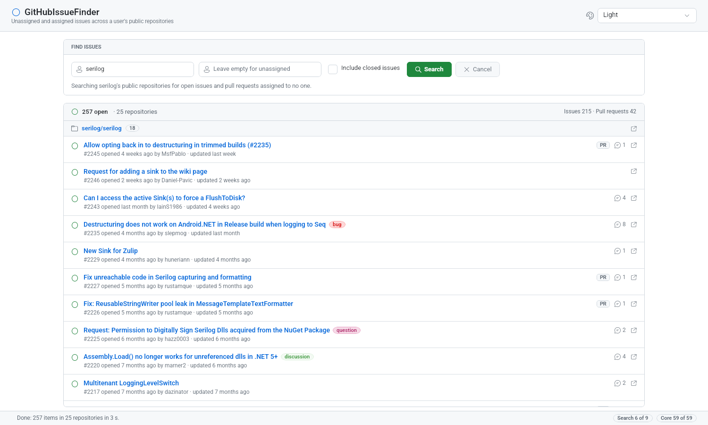
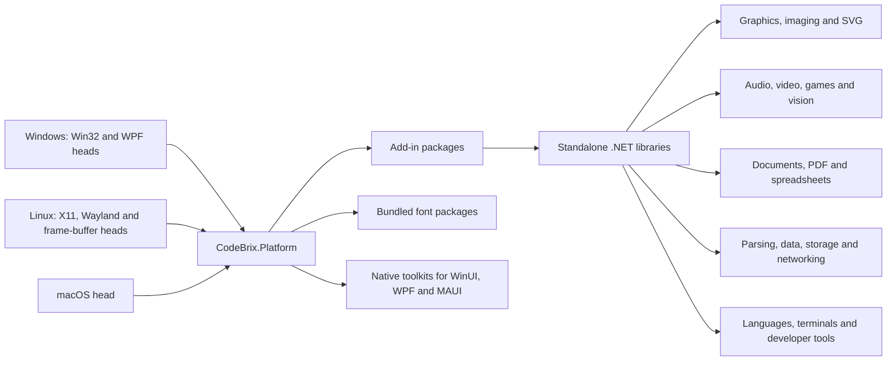

#  CodeBrix

**CodeBrix is a family of open source .NET libraries built around CodeBrix.Platform, an application framework whose desktop applications run natively on Windows, Linux and macOS from a single codebase.** You write the application once against the WinUI XAML API surface - the same `Microsoft.UI.Xaml.*` controls, XAML, code-behind and data binding you would use in a Windows App SDK application - and CodeBrix.Platform renders it through a Skia-based engine on six platform heads. Around the framework sits a catalog of general-purpose libraries - PDF documents and spreadsheets, audio and video, imaging and SVG, cryptography, SQLite, Redis, SSH, Docker, parsing, charts, testing - that are equally usable from a console application, a background service or a native WinUI application. Everything in the family requires .NET 10 or later.

This repository is the documentation for all of it: a curriculum that takes you from an empty folder to a shipped application, one full page for every library, the reference applications you can open and read, and an entry point written for AI coding agents. Nothing here builds - the code lives in the repositories each page links to, and every package comes from nuget.org.

## What CodeBrix.Platform applications look like

A few of the reference applications, captured on the Linux X11 head. The same applications run unchanged on the other five heads.

| | |
| --- | --- |
|  |  |
| **Doom.Brix** - the classic shareware episode, rendered through the game engine add-in ([CodeBrix.Samples.Gpl2](docs/samples/README.md#codebrixsamplesgpl2)) | **Fresco.Brix** - a music-notation editor that engraves the score in process ([CodeBrix.Samples.Gpl3](docs/samples/README.md#codebrixsamplesgpl3)) |
|  |  |
| **Pinta.Brix** - a layered raster paint and image editor ([CodeBrix.Samples](docs/samples/README.md#codebrixsamples)) | **PainDiagram** - symptom mapping over a medical body map ([CodeBrix.Samples](docs/samples/README.md#codebrixsamples)) |
|  | |
| **GitHubIssueFinder** - unclaimed issues across an owner's public repositories ([CodeBrix.Samples](docs/samples/README.md#codebrixsamples)) | |

## Runs on every laptop

One `.Core` library and one `.UI` shared project of XAML drive every platform. A head is a thin executable project that supplies only its platform plumbing: a `Program.cs` and exactly one runtime package. Windows is served by a Win32 head and a WPF-hosted head, Linux by an X11 head, a native Wayland head and a frame-buffer head for kiosk and embedded devices with no desktop at all, and macOS by a head that runs on Apple Silicon and Intel. Adding a platform means adding one more head folder; nothing else in the application changes.

| Head | Head package | Bootstrap call |
| --- | --- | --- |
| Windows (Win32) | [`CodeBrix.Platform.Runtime.Skia.Win32.ApacheLicenseForever`](https://www.nuget.org/packages/CodeBrix.Platform.Runtime.Skia.Win32.ApacheLicenseForever) | `.UseWindowsWin32()` |
| Windows (WPF) | [`CodeBrix.Platform.Runtime.Skia.Wpf.ApacheLicenseForever`](https://www.nuget.org/packages/CodeBrix.Platform.Runtime.Skia.Wpf.ApacheLicenseForever) | `.UseWindowsWpf()` |
| Linux (X11) | [`CodeBrix.Platform.Runtime.Skia.X11.ApacheLicenseForever`](https://www.nuget.org/packages/CodeBrix.Platform.Runtime.Skia.X11.ApacheLicenseForever) | `.UseLinuxX11()` |
| Linux (native Wayland) | [`CodeBrix.Platform.Runtime.Skia.Wayland.ApacheLicenseForever`](https://www.nuget.org/packages/CodeBrix.Platform.Runtime.Skia.Wayland.ApacheLicenseForever) | `.UseLinuxWayland()` |
| Linux (frame buffer) | [`CodeBrix.Platform.Runtime.Skia.FrameBuffer.ApacheLicenseForever`](https://www.nuget.org/packages/CodeBrix.Platform.Runtime.Skia.FrameBuffer.ApacheLicenseForever) | `.UseLinuxFrameBuffer()` |
| macOS | [`CodeBrix.Platform.Runtime.Skia.MacOS.ApacheLicenseForever`](https://www.nuget.org/packages/CodeBrix.Platform.Runtime.Skia.MacOS.ApacheLicenseForever) | `.UseMacOS()` |

Each head draws with the GPU where the machine offers one and with software Skia otherwise: OpenGL on Win32 and X11, Vulkan on Wayland, OpenGL ES over DRM and GBM on the frame buffer, and Metal on macOS. [02 - Runs on every laptop](docs/platform/02-runs-on-every-laptop.md) gives each head's operating-system requirements, render-path options and known limits.

## Five-minute quick start

Every file below is verbatim from the framework's own guide. Replace `MyApp` with your application name.

**1. Create the solution and the `.Core` library, and add the one required package.**

```bash
dotnet new sln -n MyApp
dotnet new classlib -n MyApp.Core --framework net10.0
cd MyApp.Core
dotnet add package CodeBrix.Platform.ApacheLicenseForever
# add optional add-in packages here as needed (see their AGENT-READMEs)
cd ..
```

[`CodeBrix.Platform.ApacheLicenseForever`](https://www.nuget.org/packages/CodeBrix.Platform.ApacheLicenseForever) is self-contained: one reference delivers the whole framework. Reference it with no version attribute and let NuGet resolve it.

**2. Create one head project and add its single head package.**

```bash
dotnet new console -n MyApp.Win32Skia --framework net10.0
cd MyApp.Win32Skia
dotnet add package CodeBrix.Platform.Runtime.Skia.Win32.ApacheLicenseForever
dotnet add reference ../MyApp.Core/MyApp.Core.csproj
cd ..
```

That is the whole starting position: the framework package in `.Core`, and one head package in each head. To target a different platform, change only the head package and the `.Use...()` call in the table above.

**3. Write the head's `Program.cs`: build a host, run it.**

```csharp
using CodeBrix.Platform.UI.Hosting;
using System;

namespace MyApp;

internal class Program
{
    [STAThread]
    public static void Main(string[] args)
    {
        App.InitializeLogging();

        var host = CodeBrixPlatformHostBuilder.Create()
            .App(() => new App())
            .UseWindowsWin32()
            .Build();

        host.Run();
    }
}
```

**4. Write a page. This is ordinary WinUI XAML, with the standard namespace URIs.**

```xml
<Page
    x:Class="MyApp.Views.MainPage"
    xmlns="http://schemas.microsoft.com/winfx/2006/xaml/presentation"
    xmlns:x="http://schemas.microsoft.com/winfx/2006/xaml">
    <StackPanel HorizontalAlignment="Center" VerticalAlignment="Center">
        <TextBlock Text="Hello from CodeBrix.Platform" />
        <Button Content="Click me" Click="OnClick" />
    </StackPanel>
</Page>
```

```csharp
using Microsoft.UI.Xaml.Controls;

namespace MyApp.Views;

public sealed partial class MainPage : Page
{
    public MainPage() => InitializeComponent();
    void OnClick(object sender, Microsoft.UI.Xaml.RoutedEventArgs e) { /* ... */ }
}
```

**5. Build and run.**

```bash
dotnet build MyApp.Win32Skia/MyApp.Win32Skia.csproj
dotnet run --project MyApp.Win32Skia/MyApp.Win32Skia.csproj
```

What completes the application is the shared XAML the quick start does not show - `App.xaml` and `App.xaml.cs`, in the `.UI` shared project that carries them into every head. [03 - Your first application](docs/platform/03-your-first-application.md) gives every file in full, in order, and then adds an add-in package to the result.

> [!TIP]
> The rule that keeps a solution correct as it grows: the `.Core` library holds the framework package and every add-in package and never a head package, and each head project holds exactly one head package. One head project equals one head package.

## Start here

| If you want to | Go to |
| --- | --- |
| Learn the framework in order, from what it is to shipping it | [Build a CodeBrix.Platform application](docs/platform/README.md) |
| Have a running window today | [03 - Your first application](docs/platform/03-your-first-application.md) |
| Find a library that does one specific thing | [The library catalog](docs/libraries/README.md) |
| Add a capability to a page: 3D, video, a browser, a terminal, charts | [Add-ins](docs/platform/08-add-ins.md) |
| Read complete applications that use all of this for real | [Reference applications](docs/samples/README.md) |
| Copy a recipe for the task in front of you | [Blueprints](docs/samples/blueprints.md) |
| Know what you may ship and on what terms | [Licensing](docs/licensing.md) |
| Jump to a repository, its tests or its API guide | [Repository directory](docs/repo-directory.md) |

## The CodeBrix universe at a glance



The add-ins are the packages that make the framework do more. Many of them are a XAML element wrapped around a standalone library, and that library is equally usable on its own from any .NET application: the [Svg add-in](docs/platform/add-ins/Svg.md) over [CodeBrix.SkiaSvg](docs/libraries/CodeBrix.SkiaSvg.md), the [TerminalView add-in](docs/platform/add-ins/TerminalView.md) over [CodeBrix.Terminal](docs/libraries/CodeBrix.Terminal.md), the [PlotterView add-in](docs/platform/add-ins/PlotterView.md) over [CodeBrix.Plotter](docs/libraries/CodeBrix.Plotter.md). Use the add-in when the capability belongs on a page, and the library directly when it does not.

| Topic | Libraries |
| --- | --- |
| Platform companions | [CodeBrix.Platform](docs/libraries/CodeBrix.Platform.md) · [CodeBrix.Platform.Extensions](docs/libraries/CodeBrix.Platform.Extensions.md) · [CodeBrix.ServiceLocator](docs/libraries/CodeBrix.ServiceLocator.md) · [CodeBrix.Platform.Unicode](docs/libraries/CodeBrix.Platform.Unicode.md) · [CodeBrix.Platform.LinuxDBus](docs/libraries/CodeBrix.Platform.LinuxDBus.md) |
| Fonts | [Fluent](docs/libraries/CodeBrix.Platform.Fonts.Fluent.md) · [Merriweather](docs/libraries/CodeBrix.Platform.Fonts.Merriweather.md) · [NotoMusic](docs/libraries/CodeBrix.Platform.Fonts.NotoMusic.md) · [OpenSans](docs/libraries/CodeBrix.Platform.Fonts.OpenSans.md) · [Roboto](docs/libraries/CodeBrix.Platform.Fonts.Roboto.md) · [RobotoMono](docs/libraries/CodeBrix.Platform.Fonts.RobotoMono.md) |
| SVG, imaging and drawing | [CodeBrix.Imaging](docs/libraries/CodeBrix.Imaging.md) · [CodeBrix.Imaging.Drawing](docs/libraries/CodeBrix.Imaging.Drawing.md) · [CodeBrix.SkiaSvg](docs/libraries/CodeBrix.SkiaSvg.md) · [CodeBrix.SvgParse](docs/libraries/CodeBrix.SvgParse.md) · [CodeBrix.PolygonTools](docs/libraries/CodeBrix.PolygonTools.md) |
| Audio, media core, graphics and games | [CodeBrix.Audio](docs/libraries/CodeBrix.Audio.md) · [CodeBrix.Audio.ModestSynth](docs/libraries/CodeBrix.Audio.ModestSynth.md) · [CodeBrix.Audio.Opus](docs/libraries/CodeBrix.Audio.Opus.md) · [CodeBrix.Platform.MediaPlayerCore](docs/libraries/CodeBrix.Platform.MediaPlayerCore.md) · [CodeBrix.Platform.OpenGL](docs/libraries/CodeBrix.Platform.OpenGL.md) · [CodeBrix.Platform.GameEngine](docs/libraries/CodeBrix.Platform.GameEngine.md) |
| Video playback, processing and vision | [CodeBrix.VideoPlayback](docs/libraries/CodeBrix.VideoPlayback.md) · [CodeBrix.VideoPlayback.Dav1d](docs/libraries/CodeBrix.VideoPlayback.Dav1d.md) · [CodeBrix.VideoProcessing](docs/libraries/CodeBrix.VideoProcessing.md) · [CodeBrix.VideoProcessing.OpenCV5](docs/libraries/CodeBrix.VideoProcessing.OpenCV5.md) |
| Documents, PDF and spreadsheets | [CodeBrix.PdfDocuments](docs/libraries/CodeBrix.PdfDocuments.md) · [CodeBrix.Texinfo](docs/libraries/CodeBrix.Texinfo.md) · [CodeBrix.Templating](docs/libraries/CodeBrix.Templating.md) · [FreePPlus](docs/libraries/FreePPlus.md) · [CodeBrix.NotionApi](docs/libraries/CodeBrix.NotionApi.md) |
| Parsing and compression | [CodeBrix.MarkupParse](docs/libraries/CodeBrix.MarkupParse.md) · [CodeBrix.StyleSheetParse](docs/libraries/CodeBrix.StyleSheetParse.md) · [CodeBrix.YamlParse](docs/libraries/CodeBrix.YamlParse.md) · [CodeBrix.Json.Extensions](docs/libraries/CodeBrix.Json.Extensions.md) · [CodeBrix.Compression](docs/libraries/CodeBrix.Compression.md) |
| Data, storage, networking and services | [CodeBrix.Sqlite](docs/libraries/CodeBrix.Sqlite.md) · [CodeBrix.Redis](docs/libraries/CodeBrix.Redis.md) · [CodeBrix.Docker](docs/libraries/CodeBrix.Docker.md) · [CodeBrix.SSH](docs/libraries/CodeBrix.SSH.md) · [CodeBrix.Cryptography](docs/libraries/CodeBrix.Cryptography.md) |
| Music notation, Scheme, scripting and terminals | [CodeBrix.LilyPort](docs/libraries/CodeBrix.LilyPort.md) · [CodeBrix.LilyScheme](docs/libraries/CodeBrix.LilyScheme.md) · [CodeBrix.Platform.TclTk](docs/libraries/CodeBrix.Platform.TclTk.md) · [CodeBrix.Python](docs/libraries/CodeBrix.Python.md) · [CodeBrix.Terminal](docs/libraries/CodeBrix.Terminal.md) |
| Testing, command line, assemblies and charts | [SilverAssertions](docs/libraries/SilverAssertions.md) · [CodeBrix.TestMocks](docs/libraries/CodeBrix.TestMocks.md) · [CodeBrix.ArgumentParser](docs/libraries/CodeBrix.ArgumentParser.md) · [CodeBrix.AssemblyTools](docs/libraries/CodeBrix.AssemblyTools.md) · [CodeBrix.Plotter](docs/libraries/CodeBrix.Plotter.md) |

[The library catalog](docs/libraries/README.md) gives every row above a one-line description, its package IDs and its license, and names the add-in that hosts it where one exists.

## How the repositories are organized

Every library lives in its own repository on GitHub, and every one of them is laid out the same way. That predictability is the point: once you have read one repository you can navigate all of them.

| At the root of every library repository | What it is |
| --- | --- |
| `README.md` | The human-facing overview, shown on GitHub and on nuget.org |
| `AGENT-README.txt` | The complete API reference and usage guide, written for AI coding agents - one per package, and it ships inside the package as well |
| `README-INDEX.txt` | The map of every document in the repository |
| `THIRD-PARTY-NOTICES.txt` | The provenance and licensing record for the open source code the packages include |

Underneath those, the library's source lives in `src/`, its tests in `tests/`, and - where a repository has them - runnable samples and utilities in `samples/` and `tools/`. The test project is worth knowing about: each `AGENT-README.txt` names the test file that demonstrates each feature area, so "how do I do X" is answered by opening the test file named for X.

Package IDs carry their license in the name. Every one ends in a `.{license}LicenseForever` suffix - `CodeBrix.Audio.MitLicenseForever`, `CodeBrix.Sqlite.ApacheLicenseForever`, `FreePPlus.LgplLicenseForever` - and that suffix is a permanent guarantee: a package with that exact ID will never have its license change. The suffix appears in package IDs only. Namespaces do not carry it: you reference `CodeBrix.Audio.MitLicenseForever` and you write `using CodeBrix.Audio;`.

[The repository directory](docs/repo-directory.md) lists every repository with its packages, its documents, its tests and its samples, each one a direct link.

## For AI agents

[AGENT-README.md](AGENT-README.md) is the entry point for an AI coding agent working in this universe. It gives the reading order for building a CodeBrix.Platform application, the rules an agent must follow when writing that code, how to find the authoritative API guide for any library, the raw-URL pattern for fetching a file straight from GitHub, the package-ID rules, and a table of every library page with its purpose.

Two facts make agent work here reliable. Every package ships an `AGENT-README.txt` in its root - a complete API reference written for machine readers, present both in the repository and inside the package - so the authoritative answer for any library is one fetch away. And every package ID names its own license, so an agent can read a project file and know the licensing position of the whole application without opening a single license file.

## License

This documentation repository is licensed under the Apache License, Version 2.0; the `LICENSE` file at its root carries the text.

The libraries it documents are licensed individually, and each package ID names its own license: MIT, Apache 2.0, BSD, Ms-PL, zlib and the SIL Open Font License across most of the family, with a small number of LGPL and GPL packages that carry obligations worth understanding before you reference one. [Licensing](docs/licensing.md) states the guarantee behind the package-ID suffix, lists every library and its license, and sets out exactly what the copyleft packages ask of you.
