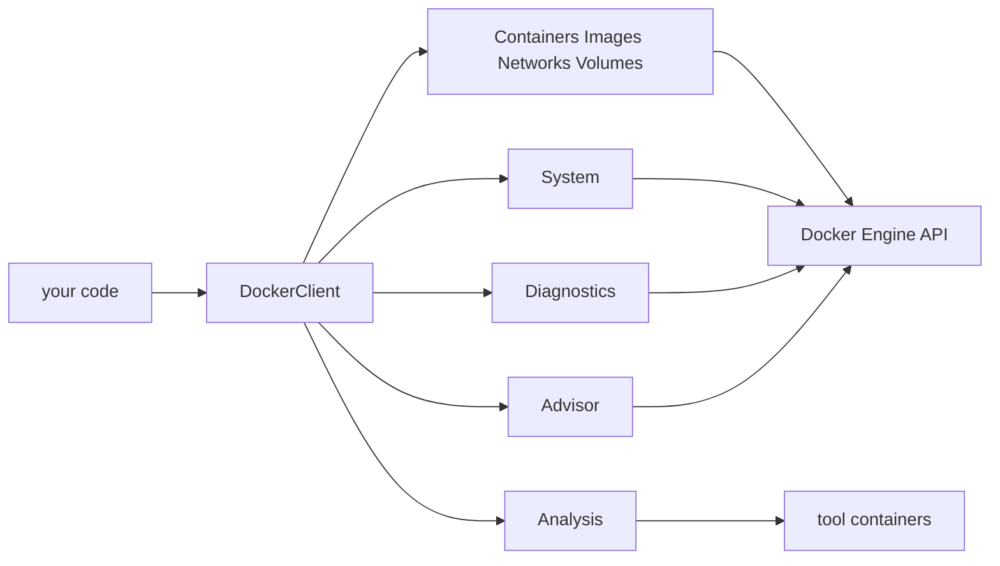

<sub>[CodeBrix](../../README.md) › [Libraries](README.md) › CodeBrix.Docker</sub>

# CodeBrix.Docker

**CodeBrix.Docker is a cross-platform, zero-dependency .NET library for managing, diagnosing and
optimizing Docker containers and images.** It speaks the Docker Engine API directly over the daemon's
own transport - a Unix domain socket, a Windows named pipe, a TCP endpoint, or an SSH tunnel to a
remote host - and gives you a typed, async-only object model over the whole thing. Use it from any
.NET 10 application, or from a CodeBrix.Platform application that stands containers up, watches them
and tears them down again.

| | |
| --- | --- |
| **Repository** | [ellisnet/CodeBrix.Docker](https://github.com/ellisnet/CodeBrix.Docker) |
| **Packages** | [`CodeBrix.Docker.MitLicenseForever`](https://www.nuget.org/packages/CodeBrix.Docker.MitLicenseForever) |
| **License** | MIT; see [License](#license) |
| **Requires** | .NET 10 or later, and a reachable Docker daemon in Linux-container mode. The `docker` command-line tool must be on PATH for image builds, an authenticated pull, and two of the analysis operations; an SSH client must be on PATH for `ssh://` endpoints |
| **Use it from** | Any .NET 10 application, or a CodeBrix.Platform application |
| **Platforms** | Anywhere Docker runs: Linux, Windows and macOS are all supported as client platforms |

## What it does

- Runs the whole container lifecycle - create, run, start, stop, restart, kill, remove, wait, list and
  inspect - plus networks, volumes, daemon information, disk usage and the daemon's event stream.
- Sets typed resource limits - CPUs, cpuset, CPU shares, memory, memory reservation, swap and PID
  limits - at creation, and retunes them while the container is still running.
- Executes commands inside a running container: one-shot, or as a live interactive session with
  standard input, a pseudo-terminal and resize.
- Retrieves logs with Docker's stream framing already decoded, and live statistics as a single sample
  or as a stream.
- Pulls images with progress, builds them, tags, inspects, lists history, removes and prunes.
- Reaches local and remote daemons alike: `unix://`, `npipe://`, `tcp://`/`http://` and `ssh://`
  endpoints, with `DOCKER_HOST` honored.
- Answers the questions you actually ask when a container misbehaves. Is the CPU limit throttling it,
  and by how much? Was it killed by the kernel OOM killer? Is that alarming memory number real
  application memory or reclaimable page cache? Is the health check passing?
- Carries a plain-English `Interpretation` sentence on every diagnostics report, beside the raw
  counters the report is computed from.
- Runs an optimization advisor: a rules engine encoding container best practices - missing memory and
  PID limits, swap not disabled, throttling too high, running as root, missing health checks,
  unbounded log growth, unpinned image references, privileged mode, and more.
- Analyzes images by running the analysis tools *as containers*: vulnerability scanning, layer
  efficiency, Dockerfile linting and an experimental image optimizer. Nothing is installed on the host
  machine; the tool images are pulled on demand.
- Is async-only. Every public operation returns `Task`, `Task<T>` or `IAsyncEnumerable<T>` and takes a
  `CancellationToken` as its last parameter with a default. There are no synchronous wrappers.
- Brings no NuGet dependencies at all. JSON goes through the in-box `System.Text.Json`, and the SSH
  transport runs the operating system's own SSH client.

## When to use it

Reach for CodeBrix.Docker when a .NET program needs to drive containers: an integration-test harness
that stands real servers up, a developer tool that manages a machine's containers, a service that
diagnoses a misbehaving workload, or a build step that scans an image before it ships. It is single-
daemon container management with a typed API, and it is deliberately narrow.

What it does not do:

- It does not talk to a Windows-container daemon. The library targets Linux containers, and
  `EnsureLinuxDaemonAsync` exists to tell you when the daemon is in the wrong mode. Windows and macOS
  are fine as client platforms.
- It does not connect over TLS. An `https://` endpoint throws `NotSupportedException`; reach a remote
  daemon over `ssh://` instead, which needs no certificate authority and no certificate pair.
- It does not implement SSH. The `ssh://` transport runs the operating system's SSH client; it does
  not speak the protocol, manage keys, prompt for passwords, accept host keys, or read the SSH
  client's own configuration file. For an SSH client in managed code, that is
  [CodeBrix.SSH](CodeBrix.SSH.md).
- It does not orchestrate a cluster. There are no Swarm services, stacks, nodes, secrets, configs or
  tasks.
- It does not read or write Compose files, and there is no `docker compose` integration.
- It does not manage a registry. There is no login, no push, no registry search and no credential
  storage; `PullAsync` falls back to the `docker` CLI precisely so that the machine's existing
  credential helpers do that job.
- It does not copy files into or out of containers as a public API, and it does not attach to a
  container's main process - exec is the way in, and it starts a *new* process in the container.
- It does not emulate a terminal. It hands you the daemon's raw byte stream, escape sequences and all;
  rendering that is a terminal emulator's job, and [CodeBrix.Terminal](CodeBrix.Terminal.md) is what
  this stream was shaped to feed.
- It provides no UI. There are no controls, no rendering and no progress widgets; `IProgress<string>`
  callbacks are as far as it goes.
- It does not work offline. Every operation goes to a daemon; there is no mock, no replay and no
  in-memory mode.



Only the first arrow is yours to construct. The operation objects are created with the client and have
no public constructors; the analysis tier is the one branch that reaches the daemon by running other
people's tools as containers.

## Getting started

```bash
dotnet add package CodeBrix.Docker.MitLicenseForever
```

The package ID carries the license suffix; the namespace does not. You install
`CodeBrix.Docker.MitLicenseForever` and you write one using directive:

```csharp
using CodeBrix.Docker;   // EVERY public type in the package
```

That is the whole namespace story. The repository's folders - `Containers/`, `Images/`,
`Diagnostics/`, `Advisor/`, `Analysis/`, `Transport/` and the rest - are file organization only, and
`using CodeBrix.Docker.Containers;` is a CS0246 compile error. Alongside it you need only the ordinary
framework usings:

```csharp
using System;                        // TimeSpan, IProgress<T>, exceptions
using System.Collections.Generic;    // IDictionary<,>, IReadOnlyList<>
using System.Threading;              // CancellationToken(Source)
using System.Threading.Tasks;        // Task, await
using System.Linq;                   // when filtering result collections
using System.Text;                   // Encoding, for exec stream bytes
```

There is no registration call, no codec registration and no feature flag. Connect to the daemon and
ask it what it is:

```csharp
using CodeBrix.Docker;

using var client = DockerClient.Create();

if (!await client.System.PingAsync())
{
    Console.WriteLine("The Docker daemon is not reachable.");
    return;
}

var version = await client.System.GetVersionAsync();
var info = await client.System.GetInfoAsync();

Console.WriteLine($"Docker {version.Version} (API {version.ApiVersion}) on {version.Os}/{version.Arch}");
Console.WriteLine($"Host {info.Name}: {info.NCpu} CPUs, {info.MemTotal / (1024 * 1024)} MB");
Console.WriteLine($"Containers: {info.ContainersRunning} running of {info.Containers}; images: {info.Images}");
```

Notice that `PingAsync` returns a bool rather than throwing: a daemon that is down, an unreachable
host and an untrusted SSH host key all come back as `false`. When you need the reason, call
`GetVersionAsync` and read the exception.

<details>
<summary>The minimum viable project: a complete csproj and Program.cs</summary>

```xml
<Project Sdk="Microsoft.NET.Sdk">

  <PropertyGroup>
    <OutputType>Exe</OutputType>
    <TargetFramework>net10.0</TargetFramework>
    <Nullable>disable</Nullable>
    <ImplicitUsings>disable</ImplicitUsings>
  </PropertyGroup>

  <ItemGroup>
    <PackageReference Include="CodeBrix.Docker.MitLicenseForever" />
  </ItemGroup>

</Project>
```

```csharp
using System;
using System.Threading.Tasks;
using CodeBrix.Docker;

namespace MyDockerTool;

internal static class Program
{
    private static async Task<int> Main()
    {
        using var client = DockerClient.Create();

        if (!await client.System.PingAsync())
        {
            Console.Error.WriteLine("No Docker daemon at " + client.Endpoint);
            return 1;
        }

        await client.Images.PullAsync("alpine:latest");

        var id = await client.Containers.RunAsync(new ContainerSpec
        {
            Image = "alpine:latest",
            Command = ["sh", "-c", "echo hello from CodeBrix.Docker"],
            Labels = { ["my-tool"] = "true" },
            Limits = new ResourceLimits
            {
                Cpus = 0.5,
                MemoryBytes = ResourceLimits.Megabytes(128),
            },
        });

        try
        {
            var exitCode = await client.Containers.WaitForExitAsync(id);
            var logs = await client.Containers.GetLogsAsync(id);
            Console.WriteLine(logs.Stdout.TrimEnd());
            return (int)exitCode;
        }
        finally
        {
            await client.Containers.RemoveAsync(id, force: true);
        }
    }
}
```

`Nullable` and `ImplicitUsings` are disabled here only to match the library's own conventions; the
package works perfectly well from a project that enables either. The library's reference types are not
annotated, so treat anything documented as "may be null" as genuinely nullable.

</details>

## Key concepts

### The entry point: DockerClient

`DockerClient` is the only way in, and its operation properties are the whole API surface.

```csharp
public sealed class DockerClient : IDisposable
{
    public static DockerClient Create(DockerClientOptions options = null);

    public string               Endpoint     { get; }   // as resolved
    public ContainerOperations  Containers   { get; }
    public ImageOperations      Images       { get; }
    public NetworkOperations    Networks     { get; }
    public VolumeOperations     Volumes      { get; }
    public SystemOperations     System       { get; }
    public DiagnosticsOperations Diagnostics { get; }
    public AdvisorEngine        Advisor      { get; }
    public AnalysisOperations   Analysis     { get; }

    public void Dispose();
}
```

Create one and keep it. The client owns a pooled `HttpClient`, is safe to use concurrently, and pools
connections with a two-minute idle timeout. A client per call is wasteful over a local socket and
genuinely expensive over `ssh://`, where every new HTTP connection pays a full SSH handshake.

`client.System` is the library's own `SystemOperations`. Inside a file that also has `using System;`
the expression `client.System.PingAsync()` is a member access, not a type name, so it is unambiguous
and needs no alias.

### Choosing the daemon

```csharp
public sealed class DockerClientOptions
{
    public string        Endpoint          { get; set; }            // null => resolve
    public string        DockerCliPath     { get; set; } = "docker";
    public string        SshExecutablePath { get; set; } = "ssh";
    public IList<string> SshArguments      { get; set; } = [];
    public TimeSpan      DefaultTimeout    { get; set; } = TimeSpan.FromSeconds(100);
}
```

The endpoint is resolved once, when the client is created: `DockerClientOptions.Endpoint` first, then
the `DOCKER_HOST` environment variable, then the platform default - `npipe://./pipe/docker_engine` on
Windows and `unix:///var/run/docker.sock` everywhere else. `DockerClient.Endpoint` reports what was
resolved, exactly as written, and reading it back is the cheapest way to confirm which daemon a client
is talking to. When `Endpoint` is set it is also handed to the CLI-backed operations as `DOCKER_HOST`,
so an image build acts on the same daemon as the rest of the client.

| Scheme | What it reaches |
| --- | --- |
| `unix://<path>` | A Unix domain socket - the default on Linux and macOS, and the validated primary path |
| `npipe://./pipe/<name>` | A Windows named pipe, the Windows default |
| `tcp://host:port`, `http://host:port` | Plain HTTP to a daemon listening on TCP |
| `ssh://[user@]host[:port]` | A remote daemon through the system SSH client; the port defaults to 22 |
| `https://` | Not supported; `DockerClient.Create` throws `NotSupportedException` |

An unrecognized scheme also throws `NotSupportedException`, naming the scheme.

### The ssh:// transport

Given an `ssh://` endpoint, the library spawns the system SSH client running `docker system dial-stdio`
on the remote host, which proxies its standard input and output to the remote socket; ordinary HTTP
then flows over that pipe. Keys, agents, the SSH client's configuration file, jump hosts and known
hosts all belong to OpenSSH and are deliberately left there - which is why the zero-dependency
guarantee survives.

Accepted forms are `ssh://build-01`, `ssh://deploy@build-01`, `ssh://deploy@build-01:2222` and
`ssh://deploy@[fe80::1]:2222` for an IPv6 literal. A path is rejected, because the socket on the far
end is always whatever `dial-stdio` opens there.

Two options tune it, and `SshArguments` is inserted after the library's own options and before the
destination:

```csharp
public string        SshExecutablePath { get; set; } = "ssh";
public IList<string> SshArguments      { get; set; } = [];
```

For `ssh://deploy@build-01:2222` with `SshArguments` of `["-i", "/keys/deploy"]`, the command line the
library builds is:

```bash
ssh -o BatchMode=yes -o ConnectTimeout=<DefaultTimeout in seconds> -T \
    -l deploy -p 2222 -i /keys/deploy -- build-01 docker system dial-stdio
```

The port is passed only when it is not 22, and the user only when the endpoint names one. Four rules
are enforced and cannot be argued with:

- **Non-interactive only.** `-o BatchMode=yes` is passed first and is not optional. OpenSSH honors the
  first value it is given for an option, so nothing added through `SshArguments` can reintroduce a
  password prompt. Key-based authentication - an agent, or an `-i` key - is the only route.
- **Host keys are never accepted automatically.** `StrictHostKeyChecking` is never set, so OpenSSH's
  own policy applies and an unknown or changed key fails under `BatchMode`. The `DockerException` tells
  you the fix rather than the symptom: connect once by hand to check and record the key, then try
  again.
- **The remote host needs the Docker CLI**, because `dial-stdio` is a subcommand of the remote `docker`
  binary. A remote without it is reported as such.
- **The local SSH client must exist.** If it cannot be started, the failure names the executable, the
  endpoint, and `SshExecutablePath` as the setting to change.

> [!WARNING]
> Setting `StrictHostKeyChecking=no` through `SshArguments` to get past an unknown host is a real
> security downgrade, not a convenience. Connect to the host once by hand so OpenSSH records the key,
> or point `UserKnownHostsFile` at a file you manage.

### Timeouts and cancellation

`DefaultTimeout` applies to each non-streaming Engine API call. Streaming calls - `GetLogsAsync`,
`StreamStatsAsync`, `StreamEventsAsync` and the interactive exec stream - are never timed out, because
their whole point is to stay open. Neither are the non-streaming calls that are open-ended by nature:
`Containers.StopAsync` and `RestartAsync` (which honor their own `timeoutSeconds`),
`Containers.WaitForExitAsync`, `Containers.PruneAsync`, `Images.PruneAsync`, `Networks.PruneAsync` and
both `Volumes.PruneAsync` overloads. Bound all of those with a `CancellationToken` instead. For an
`ssh://` endpoint, `DefaultTimeout` also supplies the SSH client's `ConnectTimeout`, and it bounds the
HTTP upgrade handshake of an exec session but never the hijacked stream that follows.

### Describing a container

`ContainerSpec` is an object-initializer type. `Image` is the only required member, and the collection
properties are pre-initialized, so collection-initializer syntax works for `Labels`, `Mounts` and the
rest.

```csharp
public sealed class ContainerSpec
{
    public string                      Image        { get; set; } = string.Empty;  // REQUIRED
    public string                      Name         { get; set; }
    public IReadOnlyList<string>       Command      { get; set; }   // overrides CMD
    public IReadOnlyList<string>       Entrypoint   { get; set; }   // overrides ENTRYPOINT
    public IList<string>               Env          { get; set; } = [];   // "KEY=VALUE"
    public IDictionary<string, string> Labels       { get; set; }
    public string                      User         { get; set; }
    public string                      WorkingDir   { get; set; }
    public string                      HostName     { get; set; }
    public IList<PortBinding>          PortBindings { get; set; } = [];  // publish
    public IList<PortBinding>          ExposedPorts { get; set; } = [];  // expose only
    public IList<MountSpec>            Mounts       { get; set; } = [];
    public string                      NetworkName  { get; set; }
    public IList<string>               NetworkAliases { get; set; } = [];
    public RestartPolicy               RestartPolicy { get; set; }
    public bool                        AutoRemove   { get; set; }
    public bool                        Privileged   { get; set; }
    public HealthcheckSpec             Healthcheck  { get; set; }
    public string                      LogDriver    { get; set; }
    public IDictionary<string, string> LogOptions   { get; set; }
    public ResourceLimits              Limits       { get; set; }
}
```

Mounts are built through factory methods - `MountSpec.Volume`, `MountSpec.Bind` and `MountSpec.Tmpfs` -
because `MountSpec` has no public constructor. A `PortBinding` with `HostPort` set is published; one
without is merely exposed, which is the same as listing it in `ExposedPorts`. `RestartPolicy` offers
`No`, `Always`, `UnlessStopped` and `OnFailure(maxRetries)`, and `HealthcheckSpec` carries the `Test`
command with its interval, timeout, start period and retry count.

`CreateAsync` and `RunAsync` never pull. A missing image is a `DockerImageNotFoundException`, so call
`Images.PullAsync` first.

### Resource limits

```csharp
public sealed class ResourceLimits
{
    public double? Cpus                   { get; set; }  // 0.5 = half a CPU
    public string  CpusetCpus             { get; set; }  // "0", "0,1", "0-3"
    public long?   CpuShares              { get; set; }  // relative weight, default 1024
    public long?   MemoryBytes            { get; set; }
    public long?   MemoryReservationBytes { get; set; }  // soft limit
    public long?   MemorySwapBytes        { get; set; }  // == MemoryBytes disables swap
    public long?   PidsLimit              { get; set; }

    public static long Megabytes(int mb);
    public static long Gigabytes(int gb);

    public long? ToNanoCpus();   // Cpus * 1e9, or null
    public bool  IsEmpty { get; }
}
```

The same type is used at creation and for live retuning through `UpdateResourcesAsync`, which sends
only the properties you set and leaves the rest alone. `Cpus` is the friendly form of the daemon's
`NanoCpus`, enforced by the CFS quota. Setting `MemorySwapBytes` equal to `MemoryBytes` disables swap,
which is what makes an out-of-memory kill deterministic rather than a slow slide into swap.

Reading limits back is a different type: `ContainerInspectResult.HostConfig` reports the daemon's raw
fields plus four computed conveniences - `HasCpuLimit`, `HasMemoryLimit`, `IsSwapDisabled` and `Cpus` -
and documents the daemon's sentinels, where `NanoCpus` of 0 means no CPU limit, `Memory` of 0 means
unlimited, `MemorySwap` of -1 means unlimited swap and a null `PidsLimit` means not configured.

### Logs, statistics and events

`GetLogsAsync` returns the two streams already demultiplexed out of Docker's stdcopy framing, as a
`ContainerLogs` record with `Stdout`, `Stderr` and a `Combined` convenience; `tail = null` means the
whole log, which for a long-running container means the whole history in memory.

`GetStatsAsync` takes one sample and `StreamStatsAsync` yields a sample roughly every second until the
token is canceled or the container stops. Every numeric member of the stats tree is nullable, and that
is not defensive padding: a stopped container really does come back with an empty memory object and
all-zero CPU counters. `ContainerStats.HasLiveData` is the correct liveness test - "a field is
non-null" is not.

```csharp
public bool    HasLiveData             { get; }
public double? CpuPercent();            // of one CPU x online CPUs
public double? MemoryPercent();         // of the cgroup limit
public double? EffectiveMemoryPercent();// anon memory only
public double? ThrottleRatio();         // 0..1
```

`MemoryStats` exposes the cgroup-v2 counters by key, plus computed `AnonBytes`, `FileBytes`,
`KernelBytes`, `SlabBytes` and `ShmemBytes`, and a `Lookup` for any other counter by name.
`SystemOperations.StreamEventsAsync` gives you the daemon's own event stream, optionally filtered by
type and container.

### A terminal inside the container

`ExecAsync` is the one-shot form: it runs the command, buffers both streams to the end and returns an
`ExecResult` with `Stdout`, `Stderr` and `ExitCode`. `ExecStreamAsync` is the interactive counterpart.
The daemon upgrades the HTTP connection away from HTTP and the two ends then speak the container's
standard streams over it; with `Tty` set, the daemon allocates a pseudo-terminal *inside the
container*, so no host pty is involved and the behavior is identical on every platform.

```csharp
public sealed class ContainerExecStream : IAsyncDisposable, IDisposable
{
    public string ExecId                 { get; }  // feeds Resize/InspectExecAsync
    public bool   IsTty                  { get; }  // what was asked for
    public bool   UsesRawFraming         { get; }  // what the daemon answered with
    public bool   CanCloseStandardInput  { get; }  // transport capability

    public Task<ExecStreamReadResult> ReadAsync(
        Memory<byte> buffer, CancellationToken cancellationToken = default);
    public Task<ContainerLogs> ReadToEndAsync(
        CancellationToken cancellationToken = default);

    public Task WriteAsync(ReadOnlyMemory<byte> buffer,
                           CancellationToken cancellationToken = default);
    public Task WriteAsync(string text,
                           CancellationToken cancellationToken = default);  // UTF-8
    public Task WriteLineAsync(string text,
                               CancellationToken cancellationToken = default); // UTF-8 + "\n"
    public Task CloseStandardInputAsync(
        CancellationToken cancellationToken = default);   // half-close

    public Task ResizeAsync(int height, int width,
                            CancellationToken cancellationToken = default);
    public Task<ExecInspectResult> InspectAsync(
        CancellationToken cancellationToken = default);
    public Task<long> WaitForExitAsync(
        CancellationToken cancellationToken = default);

    public void Dispose();
    public ValueTask DisposeAsync();
}
```

The two framings differ in more than layout:

| | `Tty = true` | `Tty = false` |
| --- | --- | --- |
| Framing | raw, verbatim pty bytes | stdcopy frames |
| Line endings | CRLF | LF |
| Input echo | yes, the pty echoes | no |
| Escape sequences | yes | no |
| stdout and stderr | merged into one stream | kept apart |
| Resize | honored inside the box | not applicable |

The library decides which framing to decode from the daemon's `Content-Type` header, not from the
`Tty` flag it asked for, and `UsesRawFraming` reports what actually came back.

> [!IMPORTANT]
> The order of operations that works: open the stream, start reading and keep reading, write input,
> resize as the terminal changes size, read to end of stream, and only then call `WaitForExitAsync` or
> `InspectExecAsync`. A hijacked connection carries bytes and nothing else - the exit code is not on
> it - and a command whose output nobody drains blocks once the daemon's buffer fills.

`CloseStandardInputAsync` shuts down the writing half of the connection, which is how a command like
`cat` sees end of file. Every transport a stock daemon answers on supports it, but it remains a
per-connection capability: check `CanCloseStandardInput` first, because a pipe that cannot carry the
signal throws `NotSupportedException` and the session must be disposed instead.

### Diagnostics

```csharp
Task<CpuThrottlingReport> GetCpuThrottlingAsync(string idOrName, CancellationToken cancellationToken = default);
Task<MemoryBreakdownReport> GetMemoryBreakdownAsync(string idOrName, CancellationToken cancellationToken = default);
Task<OomReport> CheckOomAsync(string idOrName, CancellationToken cancellationToken = default);
Task<HealthReport> GetHealthAsync(string idOrName, CancellationToken cancellationToken = default);
Task WaitForHealthyAsync(string idOrName, TimeSpan timeout, CancellationToken cancellationToken = default);
Task<ContainerDiagnosticsReport> DiagnoseAsync(string idOrName, CancellationToken cancellationToken = default);
```

Every report carries the raw counters *and* an `Interpretation` sentence written for a human. Show the
interpretation; branch on the counters. `DiagnoseAsync` returns all four reports from one inspect and
one stats sample, plus a `Summary` that leads with the worst finding, so it beats four separate calls.

Throttling is reported as the throttled-periods ratio with a severity band:

```csharp
public enum ThrottleSeverity { None, Moderate, High, Critical }
// None < 5%, Moderate 5-25%, High 25-75%, Critical > 75%
```

The memory breakdown separates `AnonBytes` - the application memory that actually matters - from
`FileBytes`, the reclaimable page cache, and flags `IsPageCacheDominated` for the case where the
headline figure lies. `LimitBytes` is the container's *configured* limit and is null when none is set,
which is why the percentages are null for an unlimited container rather than a meaningless percentage
of host memory.

`WaitForHealthyAsync` fails fast as well as slow: besides a `TimeoutException` on expiry, it throws
`DockerException` on the first poll when the container defines no health check at all, and as soon as
the container is neither running nor restarting, because in both cases it can never become healthy.

### The optimization advisor

```csharp
public sealed class AdvisorEngine
{
    public static IReadOnlyList<string> RuleIds { get; }   // CB001 .. CB014

    public Task<IReadOnlyList<AdvisorFinding>> AnalyzeContainerAsync(
        string idOrName, CancellationToken cancellationToken = default);

    public Task<IReadOnlyList<AdvisorFinding>> AnalyzeAllContainersAsync(
        CancellationToken cancellationToken = default);
}

public sealed record AdvisorFinding(
    string          RuleId,          // "CB007"
    AdvisorSeverity Severity,
    string          ContainerName,   // friendly name, no leading slash
    string          Title,           // "No healthcheck defined"
    string          Detail,          // what was observed, with numbers
    string          Recommendation); // the exact property or flag to change

public enum AdvisorSeverity { Info = 0, Warning = 1, Critical = 2 }
```

A rule that does not fire contributes nothing, so an empty list is a clean bill of health. The rules
are internal and the set is fixed; you cannot register your own.

| Id | Severity | Fires when |
| --- | --- | --- |
| `CB001` | Warning | No memory limit set |
| `CB002` | Warning | Memory limit set but swap is not disabled |
| `CB003` | Warning | No PID limit set - fork-bomb exposure |
| `CB004` | Info | No CPU limit set |
| `CB005` | Warning or Critical | The CPU limit is throttling the workload; running containers only |
| `CB006` | Warning | Application memory is close to the limit; running containers only |
| `CB007` | Warning | No health check defined, on image or container |
| `CB008` | Warning | Container runs as root |
| `CB009` | Info | Memory limit set without a reservation |
| `CB010` | Critical | Container runs privileged |
| `CB011` | Warning | Log driver has no size limit |
| `CB012` | Warning | Container was OOM-killed |
| `CB013` | Info | Memory usage is dominated by page cache; running containers only |
| `CB014` | Info | Image reference is not pinned |

The three rules that need live counters are skipped - not failed - for a container that is not
running. `AnalyzeAllContainersAsync` inspects and samples every container it finds, so on a busy host
it is proportionally expensive: run it on demand, not on a timer.

### Image analysis, run as containers

Four industry tools - a vulnerability scanner, a layer-efficiency analyzer, a Dockerfile linter and an
image optimizer - are each run *as a container* by the library itself. Nothing is installed on the
host; the tool image is pulled on demand, the container is labeled, and it is always removed in a
`finally` block.

```csharp
public sealed class AnalysisOperations
{
    public const string ToolLabelName  = "codebrix.docker.tool";
    public const string ToolLabelValue = "true";
    public const string ContainerNamePrefix = "codebrix-tool-";
    public const string DefaultTrivyCacheVolumeName = "codebrix-docker-trivy-cache";

    public string TrivyImage    { get; set; } = "aquasec/trivy:latest";
    public string DiveImage     { get; set; } = "wagoodman/dive:latest";
    public string HadolintImage { get; set; } = "hadolint/hadolint:latest";
    public string SlimImage     { get; set; } = "mintoolkit/mint:latest";

    public Task<TrivyScanResult> ScanImageAsync(
        string imageReference, TrivyScanOptions options = null,
        CancellationToken cancellationToken = default);

    public Task<DiveAnalysisResult> AnalyzeImageEfficiencyAsync(
        string imageReference, CancellationToken cancellationToken = default);

    public Task<HadolintResult> LintDockerfileAsync(
        string dockerfilePath, CancellationToken cancellationToken = default);

    public Task<SlimResult> OptimizeImageAsync(
        string imageReference, SlimOptions options = null,
        CancellationToken cancellationToken = default);   // EXPERIMENTAL
}
```

Scanning an image for the findings that matter:

```csharp
using System.Linq;
using CodeBrix.Docker;

using var client = DockerClient.Create();

var scan = await client.Analysis.ScanImageAsync("nginx:alpine", new TrivyScanOptions
{
    Severities = { "HIGH", "CRITICAL" },
    IgnoreUnfixed = false,
});

Console.WriteLine($"{scan.ImageReference}: {scan.Total} vulnerabilit(ies), " +
                  $"{scan.CountOf("CRITICAL")} critical, {scan.CountOf("HIGH")} high");

foreach (var v in scan.Vulnerabilities.Take(3))
{
    Console.WriteLine($"  {v.Severity,-8} {v.Id} in {v.PkgName} {v.InstalledVersion}" +
                      (v.HasFix ? $" -> fixed in {v.FixedVersion}" : " (no fix yet)"));
}
```

`CountBySeverity` omits severities with no findings, which is why `CountOf` exists and is
case-insensitive. The scanner's database lives in a shared named volume named by
`TrivyScanOptions.CacheVolumeName`, so the first scan downloads it and every scan afterwards reuses it.
Layer efficiency reports an `EfficiencyScore` between 0 and 1 with the wasted bytes behind it - a score
well below 1 usually means files are written and then overwritten or deleted in a later layer, so both
copies stay in the image - and the analyzer's own continuous-integration exit code arrives in
`ExitCode` as a finding rather than as an exception. Dockerfile linting returns findings keyed by the
linter's own lowercase level names.

`OptimizeImageAsync` is genuinely experimental, and the reason is in how it works: it runs the
container for `ContinueAfterSeconds`, watches which files are actually touched, and rebuilds the image
from those. Give a service long enough to start, set `HttpProbePaths` for an HTTP server so the
optimizer exercises its routes, and verify the result before shipping it.

### Labels are how you clean up

Label everything you create, and prune by label. The label-filtered `PruneAsync` overloads never touch
anything you did not label, which is what makes a teardown both total and scoped.

```csharp
// Tear down exactly what this code created, and nothing else.
foreach (var c in await client.Containers.ListAsync(all: true, labelFilters: labels))
{
    await client.Containers.RemoveAsync(c.Id, force: true);
}
await client.Volumes.PruneAsync(labels);
await client.Networks.PruneAsync(labels);
```

Every `ListAsync` and `PruneAsync` that accepts `labelFilters` sends the filter to the daemon, so it
never materializes objects you are about to discard.

### The error model

Everything thrown for a Docker-side problem derives from `DockerException`, so one catch clause covers
the lot.

```text
DockerException : Exception
  |
  +-- DockerApiException : DockerException
  |     HttpStatusCode StatusCode { get; }
  |     string         ResponseBody { get; }
  |     |
  |     +-- DockerContainerNotFoundException : DockerApiException
  |     +-- DockerImageNotFoundException : DockerApiException
  |
  +-- DockerCliException : DockerException
        int    ExitCode { get; }
        string StdErr   { get; }
        string Command  { get; }
```

`DockerApiException` is raised for any non-2xx response; when the daemon's body is the usual JSON
message that text becomes the exception's `Message`, and the untouched body is always in
`ResponseBody`. A 404 on a container route is a `DockerContainerNotFoundException` and on an image
route a `DockerImageNotFoundException`, but network and volume routes surface a plain
`DockerApiException` - there are no not-found subclasses for those two. `DockerCliException` carries
the full command line, everything written to standard error, and the exit code.

A bare `DockerException` covers transport failures and conditions that can never work: an unreachable
daemon, an untrusted SSH host key, a remote without the Docker CLI, a container that can never become
healthy. Those messages are written to tell you what to do about it, so surface them rather than
replacing them. Argument validation - an empty `ContainerSpec.Image`, an `ExecSpec` with no command, a
resize with a non-positive dimension - throws before any request is sent.

## Examples

Running a container with typed limits and retuning them while it runs.

```csharp
using CodeBrix.Docker;

using var client = DockerClient.Create();

// CreateAsync and RunAsync do not pull a missing image; pull it first.
await client.Images.PullAsync("nginx:alpine");

var id = await client.Containers.RunAsync(new ContainerSpec
{
    Image = "nginx:alpine",
    Name = "web",
    Limits = new ResourceLimits
    {
        Cpus = 0.5,
        MemoryBytes = ResourceLimits.Megabytes(256),
        MemorySwapBytes = ResourceLimits.Megabytes(256), // == MemoryBytes disables swap
        PidsLimit = 200,
    },
});

// Retune the limits while it runs.
await client.Containers.UpdateResourcesAsync(id, new ResourceLimits { Cpus = 1.0 });
```

Diagnosing that container - all four reports from one call - and then asking the advisor what to
change.

```csharp
using System.Linq;
using CodeBrix.Docker;

using var client = DockerClient.Create();

// 'id' is a container id or name - for example the one RunAsync returned above.
var report = await client.Diagnostics.DiagnoseAsync(id);

Console.WriteLine(report.Summary);
Console.WriteLine(report.CpuThrottling.Interpretation);
Console.WriteLine(report.Memory.Interpretation);
Console.WriteLine(report.Oom.Interpretation);
Console.WriteLine(report.Health.Interpretation);

var findings = await client.Advisor.AnalyzeContainerAsync(id);

foreach (var f in findings.OrderByDescending(x => x.Severity))
{
    Console.WriteLine($"[{f.Severity}] {f.RuleId} {f.Title}");
    Console.WriteLine("        " + f.Recommendation);
}

Console.WriteLine("rules shipped: " + string.Join(", ", AdvisorEngine.RuleIds));
```

Reaching a remote daemon over `ssh://`, with the SSH client's own options supplied explicitly.

```csharp
using CodeBrix.Docker;

using var remote = DockerClient.Create(new DockerClientOptions
{
    Endpoint = "ssh://root@build-01:2222",
    SshArguments =
    {
        "-i", "/keys/deploy",
        "-o", "IdentitiesOnly=yes",
        "-o", "UserKnownHostsFile=/etc/docker/known_hosts",
    },
});

Console.WriteLine("ping: " + await remote.System.PingAsync());

var containers = await remote.Containers.ListAsync();
Console.WriteLine($"running: {containers.Count} container(s) on the remote daemon");
```

<details>
<summary>A live terminal session: a read pump, typed input and a resize</summary>

```csharp
using var client = DockerClient.Create();

var id = await client.Containers.RunAsync(new ContainerSpec
{
    Image = "alpine:latest",
    Command = ["sh", "-c", "sleep 120"],
    Labels = { ["codebrix.docker.readme"] = "true" },
});

var shellPath = await PickShellAsync(client, id);
Console.WriteLine("shell picked: " + (shellPath ?? "(none -- this image has no shell)"));

await using var session = await client.Containers.ExecStreamAsync(id, new ExecSpec
{
    Command = [shellPath],
    AttachStdin = true,
    Tty = true,
    ConsoleHeight = 24,
    ConsoleWidth = 80,
    Env = { "PS1=box$ " },
});

var screen = new StringBuilder();
var pump = Task.Run(async () =>
{
    var buffer = new byte[4096];
    while (true)
    {
        var read = await session.ReadAsync(buffer);
        if (read.EndOfStream)
        {
            break;
        }

        // read.Target is StandardOutput for every chunk of a TTY session.
        screen.Append(Encoding.UTF8.GetString(buffer, 0, read.Count));
    }
});

await session.WriteLineAsync("stty size");
await Task.Delay(300);
await client.Containers.ResizeExecAsync(session.ExecId, height: 40, width: 120);
await Task.Delay(300);
await session.WriteLineAsync("stty size");
await Task.Delay(300);
await session.WriteLineAsync("exit 7");

await pump;
var exitCode = await session.WaitForExitAsync();

Console.WriteLine("exit " + exitCode);
foreach (var line in screen.ToString().Replace("\u001b", "\\e").Split("\r\n"))
{
    Console.WriteLine("  | " + line);
}

await client.Containers.RemoveAsync(id, force: true);
```

Finding a shell in an arbitrary image means running one and looking at the exit code, rather than
trusting the image's reputation:

```csharp
// Probe for a usable shell: run it and look for exit code 127.
private static async Task<string> PickShellAsync(DockerClient client, string containerId)
{
    foreach (var candidate in new[] { "/bin/bash", "/bin/sh", "/bin/ash", "/busybox/sh" })
    {
        var probe = await client.Containers.ExecAsync(containerId, [candidate, "-c", "exit 0"]);
        if (probe.ExitCode != 127)
        {
            return candidate;
        }
    }

    return null;
}
```

</details>

## Using it in a CodeBrix.Platform application

CodeBrix.Docker has no UI and no dependency on CodeBrix.Platform, so it goes into a CodeBrix.Platform
application the way any other library does: a package reference and a `DockerClient` with an
application lifetime. The repository's own sample, RedisSetupTool, is a CodeBrix.Platform desktop
application that builds and runs on all six platform heads, and it is worth copying the shape of.

Confine the Docker reference to one library project. In the sample, that project owns every Docker
operation - the generic container, image, network and volume surface, the topology definitions and
their orchestration, the port allocator, the label schema, instance discovery and teardown, and the
exec-stream plumbing - and has no view models, no XAML and no CodeBrix.Platform reference. It exposes
its own types at the seam and maps from CodeBrix.Docker types internally, so it stays peelable and
reusable for a different container project.

The sample makes that boundary structural rather than a convention: it references CodeBrix.Docker
with `<PrivateAssets>all</PrivateAssets>`, so a downstream project that names a CodeBrix.Docker type
fails to compile. `PrivateAssets` also stops the runtime asset flowing, so the same project carries an
MSBuild target that republishes the assembly as a copy-to-output item and an `AssemblyLoadContext`
resolver that finds it at load time. Both live in the one project that owns the reference; no head,
view model or test project needs anything of its own.

Two more things the sample settles:

- An exec stream is bytes, so rendering it needs a terminal control. The sample has a small library
  whose only job is to bridge a CodeBrix.Docker exec stream into the
  [TerminalView](../platform/add-ins/TerminalView.md) control.
- Container logs are polled, not followed: the daemon offers no follow API on this path, so a Logs view
  refreshes on a timer and says so.

Head-specific notes from the sample: the frame-buffer head runs without a window manager, so it enables
the platform software keyboard and file-open picker, which the other heads do not need; the WPF-Skia
head is a Windows-targeted project and renders in software.

## Pitfalls

- Do not create a `DockerClient` per operation. It owns a pooled `HttpClient`, and over `ssh://` every
  new HTTP connection pays a whole SSH handshake - a per-call client there is dramatically slower, not
  micro-slower.
- Do not confuse the package ID with the namespace, and do not write `using CodeBrix.Docker.Containers;`
  or any other folder name. There is one namespace, `CodeBrix.Docker`, and it holds every public type.
- Do not expect `CreateAsync` or `RunAsync` to pull a missing image. Call `Images.PullAsync` first. It
  is cheap when the image is already local, but it is not an offline no-op: it still contacts the
  registry, so with no reachable registry it fails rather than returning quietly.
- Do not treat a missing shell as an exception. Asking for `/bin/bash` in an image that has none still
  gets a successful stream upgrade; the daemon writes the container runtime's complaint on *standard
  output* and closes, and `InspectExecAsync` then reports exit code 127. Probe by running a candidate
  and checking for 127.
- Do not look for the exec exit code on the stream, and do not expect stderr from a TTY session. With
  `Tty = true` the terminal merges both streams - that is the terminal, not a library shortcut. Set
  `Tty = false` when the two must stay apart.
- Do not call `CloseStandardInputAsync` without checking `CanCloseStandardInput` first; where the
  transport cannot carry the half-close, it throws and the session must be disposed instead.
- Do not read `PidsStats.Limit` to decide whether a container is capped. What it reports depends on the
  daemon's cgroup driver: under the systemd driver an uncapped container inherits the scope's
  `TasksMax`, a large but perfectly real number. `ContainerHostConfig.PidsLimit` - the *configured*
  limit - answers "is this capped?", and `DockerSystemInfo.CgroupDriver` tells you which world you are
  in.
- Do not expect `ThrottleRatio()` to be null when nothing was throttled. It returns 0 for "measured, no
  throttling" and is null only when the counters themselves are missing; use `HasLiveData` to detect
  "not running, nothing measured".
- Do not read a big memory number as pressure without the breakdown. Page cache is charged to the
  container and is reclaimable; `AnonBytes` is the memory that matters and `IsPageCacheDominated` flags
  the case where the headline figure lies.
- Do not parse `Interpretation` strings. Every report gives you the raw counters beside the sentence;
  branch on those. The wording is for display and is not a contract.
- Do not call `Volumes.PruneAsync()` with no filters and expect named volumes to go. The daemon
  requires an explicit opt-in before it will consider named volumes, so the unfiltered overload prunes
  anonymous volumes only - deliberately, because an unfiltered sweep over named volumes destroys user
  data. The label-filtered overload does reclaim named volumes, but only ones carrying your labels.
- Do not compare `ImageBuildResult.ImageId` against a registry manifest digest. With a modern builder
  and the containerd image store, the id resolved from the built tag is the index digest; it is correct
  and usable as a local reference, but it will not equal a digest obtained from a registry manifest.
  Compare by tag, or index digest to index digest.
- Do not assume the analysis tier is free of the CLI. Scanning needs none, but layer analysis and
  Dockerfile linting move files in and out of their tool container with `docker cp`, so they need the
  `docker` executable on PATH - as do image builds and an authenticated pull.
- Do not rely on `SshArguments` reaching the CLI-backed operations. Over an `ssh://` endpoint, a build
  and a credentialed pull run the Docker CLI, which makes its own SSH invocation: it does not see
  `SshArguments`, and it reads the invoking user's own SSH configuration and known-hosts file.
  Everything on the Engine API path has no such requirement.
- Do not let an open-ended call run without a `CancellationToken`. `DefaultTimeout` deliberately does
  not apply to logs, stats streams, events, exec sessions, or the stop, restart, wait and prune calls.
- Do not set `MemoryBytes` without `MemorySwapBytes` when you want a deterministic OOM kill - with swap
  still available the container slides rather than dies - and check `DockerSystemInfo.SwapLimit`,
  because on a host without swap accounting the daemon cannot enforce it at all.
- Do not hold a container id after `RemoveAsync`. Later calls with it raise
  `DockerContainerNotFoundException`, which is correct but reads like a transport problem.
- Prefer `ListAsync` over `InspectAsync` when a summary will do, filter server-side with `labelFilters`,
  and stream stats rather than polling them. The first streamed sample has no previous sample to
  compute a delta from, so `CpuPercent()` is null on it - skip it rather than treating it as zero.

## Samples and tools in the repository

| Name | What it demonstrates | Where |
| --- | --- | --- |
| RedisSetupTool | A CodeBrix.Platform desktop application that stands up, manages and tears down Redis databases across a catalog of topologies, manages any container on the daemon, and opens a real shell inside one - exercising very nearly the whole CodeBrix.Docker surface | [`samples/RedisSetupTool`](https://github.com/ellisnet/CodeBrix.Docker/tree/main/samples/RedisSetupTool) |
| Docker management library | The only project in the sample that references CodeBrix.Docker: topologies, orchestration, port allocation, the label schema and teardown | [`samples/RedisSetupTool/src/libs/RedisSetupTool.DockerManagement`](https://github.com/ellisnet/CodeBrix.Docker/tree/main/samples/RedisSetupTool/src/libs/RedisSetupTool.DockerManagement) |
| Terminal bridge library | Bridges a CodeBrix.Docker exec stream into the TerminalView control | [`samples/RedisSetupTool/src/libs/RedisSetupTool.TerminalView`](https://github.com/ellisnet/CodeBrix.Docker/tree/main/samples/RedisSetupTool/src/libs/RedisSetupTool.TerminalView) |
| Library test suite | An integration suite against a real daemon: it builds images, provokes genuine OOM kills and CPU throttling, runs the containerized analysis tools, and stands up its own sshd container to exercise the `ssh://` transport | [`tests/CodeBrix.Docker.Tests`](https://github.com/ellisnet/CodeBrix.Docker/tree/main/tests/CodeBrix.Docker.Tests) |

The reference application in [CodeBrix.Samples](https://github.com/ellisnet/CodeBrix.Samples) is
[RedisSetupTool](https://github.com/ellisnet/CodeBrix.Samples/tree/main/RedisSetupTool), a standalone six-head control panel built
against the published packages.

The unit the sample's user manages is an *instance*, not a topology, so two instances of the same
topology coexist. A host port allocator hands out free ports, and instance identity lives in Docker
labels - `codebrix.redissetup.instance`, `.topology`, `.role`, `.node` and friends - so the tool can be
closed and reopened and still find, manage and completely tear down what it created, with no side-car
state file to drift. Pick the head that matches the machine and run it:

```bash
dotnet run --project samples/RedisSetupTool/src/RedisSetupTool.LinuxX11
dotnet run --project samples/RedisSetupTool/src/RedisSetupTool.LinuxWayland
dotnet run --project samples/RedisSetupTool/src/RedisSetupTool.LinuxFrameBuffer
dotnet run --project samples/RedisSetupTool/src/RedisSetupTool.MacOS
dotnet run --project samples/RedisSetupTool/src/RedisSetupTool.Win32Skia
dotnet run --project samples/RedisSetupTool/src/RedisSetupTool.WinWpfSkia
```

The sample can also drive itself, which is how it is exercised unattended: `REDISSETUP_AUTOMATION`
runs one scripted pass through the application's own commands after the first refresh, and
`REDISSETUP_AUTOMATION_LOG` names a step-by-step log file.

```bash
REDISSETUP_AUTOMATION=a1-roundtrip \
REDISSETUP_AUTOMATION_LOG=/tmp/run.log \
    dotnet run --project samples/RedisSetupTool/src/RedisSetupTool.LinuxX11
```

The library's own test suite is the largest body of working usage of the package anywhere, mapped
feature by feature in AGENT-README.txt: `ContainerLifecycleTests.cs`, `ResourceLimitTests.cs`,
`StatsTests.cs`, `DiagnosticsTests.cs`, `AdvisorTests.cs`, `ImageTests.cs`, `ExecStreamTests.cs`,
`SshTransportTests.cs`, `AnalysisTests.cs` and `ResourceLeakGuardTests.cs`, with
`Infrastructure/DockerTestFixture.cs` showing a label-scoped cleanup worth copying.

## Documentation and source

| Document | Where |
| --- | --- |
| Overview (README) | [README.md](https://github.com/ellisnet/CodeBrix.Docker/blob/main/README.md) |
| Complete API guide (ships inside the package too) | [AGENT-README.txt](https://github.com/ellisnet/CodeBrix.Docker/blob/main/AGENT-README.txt) |
| Non-package content in the repository | [EXTRAS-README.txt](https://github.com/ellisnet/CodeBrix.Docker/blob/main/EXTRAS-README.txt) |
| Map of every document in the repository | [README-INDEX.txt](https://github.com/ellisnet/CodeBrix.Docker/blob/main/README-INDEX.txt) |
| Tests (worked examples of every API) | [tests/CodeBrix.Docker.Tests](https://github.com/ellisnet/CodeBrix.Docker/tree/main/tests/CodeBrix.Docker.Tests) |
| Samples | [samples/RedisSetupTool](https://github.com/ellisnet/CodeBrix.Docker/tree/main/samples/RedisSetupTool) |

XML documentation ships alongside the assembly, so every type and member described here is available
to IntelliSense.

## License

CodeBrix.Docker is licensed under the MIT License, and the license is also named in the package ID
(`CodeBrix.Docker.MitLicenseForever`). The analysis tools it runs are third-party projects executed as
containers under their own licenses; the library parses their output but does not bundle or
reimplement them, and their findings are theirs. For the provenance and licensing of open source code
included in this library, see
[THIRD-PARTY-NOTICES.txt](https://github.com/ellisnet/CodeBrix.Docker/blob/main/THIRD-PARTY-NOTICES.txt)
in the repository.

---

**Where to go next**

- [CodeBrix.Redis](CodeBrix.Redis.md) - the client for the Redis servers you stand up in containers
- [CodeBrix.SSH](CodeBrix.SSH.md) - an SSH client in managed code, for the work this library hands to the system SSH binary
- [Library catalog](README.md) - every CodeBrix library by topic
- [ellisnet/CodeBrix.Docker on GitHub](https://github.com/ellisnet/CodeBrix.Docker) - source, tests and the RedisSetupTool sample
