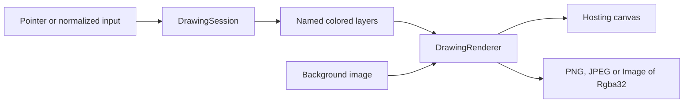

<sub>[CodeBrix](../../README.md) › [Libraries](README.md) › CodeBrix.Imaging.Drawing</sub>

# CodeBrix.Imaging.Drawing

**CodeBrix.Imaging.Drawing captures pointer input - mouse, pen or touch - as resolution-independent
calibrated strokes on named, colored layers, renders them with translucent "highlighter"
compositing over a background image or over live content, and exports the finished drawing as
PNG/JPEG bytes or as a CodeBrix.Imaging image.** It also draws lines, arrows, circles, ellipses,
rectangles and polylines from plain coordinates, which is what makes it a natural annotation layer
for a camera feed or a computer-vision pipeline. The repository produces two packages that are
either/or alternatives: one backed by SkiaSharp for on-screen, interactive drawing, and one that is
fully managed, needs no native library at all, and adds a managed 2D drawing engine and a managed
SVG renderer.

| | |
| --- | --- |
| **Repository** | [ellisnet/CodeBrix.Imaging.Drawing](https://github.com/ellisnet/CodeBrix.Imaging.Drawing) |
| **Packages** | [`CodeBrix.Imaging.Drawing.ApacheLicenseForever`](https://www.nuget.org/packages/CodeBrix.Imaging.Drawing.ApacheLicenseForever)<br>[`CodeBrix.Imaging.Drawing.NoSkia.ApacheLicenseForever`](https://www.nuget.org/packages/CodeBrix.Imaging.Drawing.NoSkia.ApacheLicenseForever) |
| **License** | Apache 2.0 (both packages); see [License](#license) |
| **Requires** | .NET 10 or later. The SkiaSharp-backed package needs the application to supply SkiaSharp native assets; the managed package needs no native libraries of any kind |
| **Use it from** | Any .NET 10 application, or a CodeBrix.Platform application hosting a Skia view from the [SkiaSharp views add-in](../platform/add-ins/SkiaSharpViews.md) |
| **Platforms** | The SkiaSharp-backed package works with any UI framework that can host a Skia drawing surface, including CodeBrix.Platform (all Skia heads), native WinUI 3, WPF and .NET MAUI. The managed package renders off-screen anywhere .NET 10 runs |

> [!IMPORTANT]
> The two packages declare the same types in the same namespaces. An application references one or
> the other, never both; referencing both makes every shared type ambiguous.

## What it does

- Captures interactive freehand drawing: pointer input arrives as calibrated strokes on named,
  colored layers, and the session tells the hosting view when to repaint.
- Draws programmatic primitives - lines, arrows, circles, ellipses, rectangles, and
  polylines/polygons - with plain coordinates and CodeBrix.Imaging colors, which is what makes
  vision-driven annotation of a live video feed straightforward.
- Renders translucent "highlighter" ink over a background image, over a solid fill, or over a fully
  transparent canvas above live content such as a webcam video feed - the telestrator scenario.
- Exports as PNG or JPEG bytes, as a SkiaSharp `SKImage`, or as a CodeBrix.Imaging `Image<Rgba32>`,
  at any size, independent of the on-screen canvas size.
- Accepts normalized (0..1) programmatic stroke input that needs no view size and no prior render
  call, so a detection result maps straight into the drawing.
- Opens a session over a photo of any aspect ratio through the nine `CreateForImage` factories,
  including raw 32-bit BGRA buffers straight from a capture library.
- Keeps named colored layers with an active layer, and a single undo history that covers strokes
  and shapes alike.
- Lines overlays up with the drawing through `GetDrawingRect` and `ScaleToView`, so cursors,
  markers and hit regions land where the ink does.
- Exposes a standalone `DrawingRenderer` for applications that manage their own layer collections,
  and a static `CanvasCalibration` class of pure coordinate math.
- Adds, in the managed package, a full 2D raster drawing engine: `DrawingCanvas`, `DrawingBitmap`,
  `DrawingPaint`, `DrawingPath`, gradients, blend modes, clipping and save-layers.
- Adds, in the managed package, a managed SVG renderer: `DrawingSvg` turns SVG into a bitmap or PNG
  at any scale with explicit font registration, so output never depends on system fonts, and hands
  back the document's display list and scene tree for anything other than rasterizing.

## When to use it

Use this library when a person, or a vision pipeline, marks up an image: a clinical body map, an
insurance photograph, a coaching telestrator over video, a screenshot annotator. The drawing model
is append, undo-last and clear, and every mark is stored in a fixed logical space rather than in
screen pixels, so a drawing survives window resizing, DPI changes and orientation flips and exports
at any resolution.

Choose the package by what the application needs:

| Need | Package |
| --- | --- |
| On-screen, interactive drawing hosted in a Skia view | `CodeBrix.Imaging.Drawing.ApacheLicenseForever` |
| Off-screen rendering with no native dependency, or SVG rasterizing | `CodeBrix.Imaging.Drawing.NoSkia.ApacheLicenseForever` |

Neither package ships UI controls; they never reference a UI framework. You host a Skia view and
forward its events, or you render off-screen and display the result yourself. Neither applies EXIF
orientation when decoding photos, and neither offers text elements, image stamps or bitmap brushes:
elements are freehand strokes and the six geometric shapes, plus custom shapes you write. There is
no selection, move, resize or per-element editing of committed elements, and no serialization
format - persist strokes yourself from `DrawingLayer.GetElements()` and `Stroke.GetPoints()` if you
need replay or storage, for which `StrokePoint.TimeOffsetMs` is there.

The managed package additionally has no GPU and no on-screen hosting, and its SVG renderer degrades
gracefully on exotic filter primitives, text-on-path and glyph-id-positioned runs rather than
failing - every degradation is reported in `Warnings`.

For loading, resizing, filtering and encoding raster images, use
[CodeBrix.Imaging](CodeBrix.Imaging.md), which both packages depend on. For SVG rendered onto a
SkiaSharp canvas with hit testing, animation and a retained scene graph, use
[CodeBrix.SkiaSvg](CodeBrix.SkiaSvg.md).

## Getting started

Add exactly one of the two packages:

```bash
dotnet add package CodeBrix.Imaging.Drawing.ApacheLicenseForever
```

```bash
dotnet add package CodeBrix.Imaging.Drawing.NoSkia.ApacheLicenseForever
```

The SkiaSharp-backed package leaves the native assets to the application. A desktop application
built on CodeBrix.Platform gets them from its platform head package; a plain .NET application adds
the matching native-asset package itself:

```bash
dotnet add package SkiaSharp.NativeAssets.Linux
```

Use the [`SkiaSharp.NativeAssets.macOS`](https://www.nuget.org/packages/SkiaSharp.NativeAssets.macOS)
or [`SkiaSharp.NativeAssets.Win32`](https://www.nuget.org/packages/SkiaSharp.NativeAssets.Win32)
variant per platform.

> [!WARNING]
> Without the matching native-asset package the project still compiles, and then fails at run time
> on the first drawing call with a native-library load error.

The namespaces, with what each one carries:

```csharp
using CodeBrix.Imaging.Drawing;             // DrawingSession, DrawingSessionOptions, CalibrationSizing
using CodeBrix.Imaging.Drawing.Models;      // DrawingLayer, DrawingElement, Stroke, StrokePoint
using CodeBrix.Imaging.Drawing.Shapes;      // DrawingShape + Line/Arrow/Circle/Ellipse/Rectangle/Polyline shapes
using CodeBrix.Imaging.Drawing.Rendering;   // DrawingRenderer, CanvasCalibration
using CodeBrix.Imaging.Drawing.Extensions;  // CodeBrix.Imaging image + color + geometry bridge extensions
```

The managed package adds two more:

```csharp
using CodeBrix.Imaging.Drawing.NoSkia;
using CodeBrix.Imaging.Drawing.NoSkia.Svg;  // DrawingSvg (managed SVG renderer)
```

The first of those carries the managed drawing engine - `DrawingCanvas`, `DrawingBitmap`,
`DrawingPaint`, `DrawingPath`, `DrawingColor(s)` and the rest - and the second carries `DrawingSvg`.

Because `CodeBrix.Imaging.Drawing` nests under the `CodeBrix.Imaging` namespace, the
CodeBrix.Imaging `Color` type resolves as `Color` inside consuming code that uses these
namespaces. Add an explicit `using CodeBrix.Imaging;` when your own code lives in an unrelated
namespace, so that `Color`, `Size`, `SizeF`, `Point`, `PointF` and `RectangleF` resolve.

There is nothing to register at start-up. A session is constructed with defaults, or with options:

```csharp
var session = new DrawingSession();                    // defaults
var session = new DrawingSession(new DrawingSessionOptions
{
    CalibrationSize = new Size(1000, 1000),    // logical stroke space - ANY
                                               //   width x height; match it to the
                                               //   background's aspect ratio
    LayerOpacity = 100,                        // highlighter alpha (255 = opaque)
    ActiveStrokeOpacity = 200,                 // in-progress stroke alpha
    BackgroundFillColor = Color.White,         // behind the image
    SurfaceClearColor = Color.Transparent,     // whole-canvas clear
    StrokeWidth = 15f,                         // calibrated units
});
```

Every option has a default, so an options instance is only needed to override specific values, and
the calibration size is fixed once the session is constructed.

## Key concepts

### The highlighter effect

Each layer's elements - strokes and shapes - are drawn fully opaque onto a private transparent cache
bitmap, and the whole cache is then composited over the background at the layer opacity (default
alpha 100 of 255). Overlapping elements within one layer therefore never darken each other, which is
what makes translucent ink read as highlighter rather than marker scribble. Set `LayerOpacity = 255`
for opaque whiteboard-marker ink.

### The calibrated drawing space

All strokes and shapes are stored in a fixed logical space - `CalibrationSize`, 1000 x 1000 by
default, any width by height allowed - never in screen pixels. The renderer maps that space to the
centered aspect-fit rectangle of whatever canvas it is given, so a drawing survives window resizing,
DPI changes and orientation flips, and exports at any resolution. The drawing rectangle has the
calibration space's aspect ratio, so match `CalibrationSize` to the background image's aspect ratio
for edge-to-edge alignment.



### DrawingSession

The interactive drawing surface model: one session is one drawing. It is sealed and `IDisposable`,
and it reports state through `HasStrokes` (any completed element), `StrokeCount` (total elements
across all layers) and `IsDisposed`. Two events drive a host: `RedrawRequested` says invalidate the
hosting canvas, and `DrawingChanged` says elements were committed, cleared or undone. `Clear()`
empties every layer while keeping the layers themselves, and `UndoLastStroke()` removes the most
recent element - stroke or shape - on any layer.

### CreateForImage and CalibrationSizing

Nine `CreateForImage` factories open a session over a background: encoded bytes, an `SKBitmap`, or a
tightly packed 32-bit BGRA buffer with its width and height, each combined with a `Size`, an
`SKSizeI` or a `CalibrationSizing` value. The raw-pixel form is exactly what webcam and
video-capture libraries produce, so "annotate a captured photo" needs no PNG round-trip; the pixels
are copied, so you can reuse your buffer immediately, and the session owns the resulting bitmap. The
raw-pixel factories also take `mirrorHorizontally`, which flips the image left-to-right for stills
that must read like a mirror because the user watched a mirrored preview when capturing.

The calibration size is always an explicit caller choice:

```csharp
FromOptions               = 0   // use options.CalibrationSize exactly as given
                                //   (or the 1000 x 1000 default with no options);
                                //   an image with a different aspect ratio is
                                //   STRETCHED to fill the drawing rectangle
DeriveFromBackgroundImage = 1   // compute from the image's aspect ratio with the
                                //   longest side = DrawingSession.CalibrationLongSide;
                                //   never distorted; options.CalibrationSize ignored
```

Ownership follows the input: the `byte[]` overloads' decoded bitmap is owned by the session, while
the `SKBitmap` overloads leave ownership with the caller.

### Layers

`AddLayer(string name, Color color)` creates a layer and the first one added becomes `ActiveLayer`,
where strokes and shapes commit. `GetLayer`, `RemoveLayer`, the `Layers` list and the settable
`ActiveLayer` complete the surface. A `DrawingLayer` is a named, colored, ordered collection of
elements - freehand strokes and geometric shapes interleaved in the order added - with `Name`
(unique, case-sensitive, trimmed), `Color` (changing it forces a full layer re-render),
`ElementCount`, `AddStroke`, `AddShape`, `RemoveLastElement()`, `Clear()`, `GetElements()` in render
order and `GetStrokes()` for the freehand ones alone.

`AddStroke` and `AddShape` called directly on a layer do not raise the session's events. Use the
session's `Draw*` methods, or invalidate the hosting canvas yourself, when the UI must react.

### Elements: strokes and shapes

`DrawingElement` is the abstract base of everything on a layer, and its two families are `Stroke`
(freehand) and `DrawingShape` (geometric). It exposes no public members, so use it as the element
type when enumerating `DrawingLayer.GetElements()` and pattern-match (`element is Stroke s` /
`element is DrawingShape shape`). A stroke carries `Width`, `StartedAtUtc`, `PointCount`,
`LastPoint`, `AddPoint` and `GetPoints()`; points are calibrated-space integers and `TimeOffsetMs`
enables replay. A stroke renders as a round-capped, round-joined polyline, and a single-point stroke
renders as a dot.

All shape coordinates, radii and thicknesses are calibrated drawing units. Every shape has
`StrokeThickness` and an optional `Color` - null means the owning layer's color. The six shapes are
`LineShape`, `ArrowShape` (V-head at the end point), `CircleShape`, `EllipseShape`,
`RectangleShape` (with a corner radius) and `PolylineShape` (two or more points; filled implies
closed). Their geometry properties are read-only and each overrides the draw method.

A custom element kind derives from `DrawingShape`. The canvas arrives pre-transformed to the
calibrated drawing space, so draw in calibrated coordinates and use calibrated stroke widths; the
transform scales everything, paint stroke widths included, to the output size:

```csharp
using CodeBrix.Imaging.Drawing.Shapes;
using SkiaSharp;

public sealed class CrossShape : DrawingShape
{
    private readonly float _cx, _cy, _half;
    public CrossShape(float cx, float cy, float size, float thickness = 15f, Color? color = null)
        : base(thickness, color) { _cx = cx; _cy = cy; _half = size / 2f; }

    public override void Draw(SKCanvas canvas, SKColor color)
    {
        using SKPaint paint = CreateOutlinePaint(color);
        canvas.DrawLine(_cx - _half, _cy, _cx + _half, _cy, paint);
        canvas.DrawLine(_cx, _cy - _half, _cx, _cy + _half, paint);
    }
}
// session.DrawShape(new CrossShape(500, 500, 80));
```

### Pointer input and normalized input

View-coordinate input is `PointerPressed`, `PointerMoved`, `PointerReleased` and `PointerCanceled`,
with `IsPointerActive` reporting whether a stroke is in progress. The view point and view size are
in the control's logical coordinates and the session handles DPI scaling. A press outside the
drawing area returns false and starts no stroke; moves are clamped to the drawing area; a press and
release without movement commits a single-point dot; and a stroke commits to the layer that was
active when it started, even if `ActiveLayer` changes mid-stroke. `PointerPressed` requires one
prior `Render` call, because it needs the canvas size to calibrate coordinates.

`PointerPressedNormalized(float normX, float normY)` and `PointerMovedNormalized` take positions in
the range 0..1 across the calibrated drawing space rather than view coordinates. They work in the
calibrated space directly, so they need no view size and no prior render call; a press outside 0..1
is ignored, moves clamp to the edge, and NaN is rejected. Normalized and view-driven input mix
freely, even within one stroke. When the calibration size was derived from a background photo,
normalized drawing-space coordinates are normalized photo coordinates, so a vision result maps
straight in.

### Rendering and live-video overlay

`Render` takes an `SKSurface` or an `SKCanvas` plus an `SKImageInfo`, and a `clearCanvas` flag.
Passing `clearCanvas: false` renders the drawing over whatever the caller already drew on the
canvas - a live video frame painted immediately before the call - instead of clearing to
`SurfaceClearColor` first. That gives two telestrator patterns: put the video view underneath and a
Skia canvas view on top, leaving the background image null and both clear colors transparent so the
video shows through wherever no ink was laid; or draw the current video frame first in the paint
handler and then call `session.Render(canvas, info, clearCanvas: false)` on the same canvas.

For overlays, `GetDrawingRect` returns the centered aspect-fit rectangle the drawing occupies in a
view of a given size - the same mapping the renderer uses - so a normalized position `(nx, ny)`
lands at `(rect.X + nx * rect.Width, rect.Y + ny * rect.Height)`, and `ScaleToView` converts a
calibrated length such as a stroke width or brush radius into view units.

### Export

`DefaultExportSize` is the background image's pixel size when one is set, so a photo exports at its
original resolution, and the calibration size otherwise; both match the drawing aspect and are never
distorted. `ExportImage`, `ExportPng` and `ExportJpeg` each have a default-size form and `Size`- and
`SKSizeI`-sized twins, and `ExportPng` can write straight to a `Stream`. Exports are complete
from-scratch renders with no display caches, so export quality is independent of the on-screen
canvas size. JPEG has no alpha channel, so set an opaque `BackgroundFillColor` before exporting one.
`ExportImage` returns a SkiaSharp `SKImage`; for a CodeBrix.Imaging `Image<Rgba32>` instead, use the
`ExportImagingImage` extension.

### Bridge extensions and the value types

The library's own API speaks CodeBrix.Imaging value types, and every example in its documentation
uses them:

```text
CodeBrix.Imaging     SkiaSharp        used for
------------------   --------------   ------------------------------
Color                SKColor          layer/shape/fill/clear colors
Size                 SKSizeI          calibration + export sizes
SizeF                SKSize           view sizes (pointer input)
Point                SKPointI         calibrated integer points
PointF               SKPoint          view points (pointer input)
RectangleF           SKRect           drawing rectangles
```

Properties cannot be overloaded by type, so each property that is a CodeBrix.Imaging type also has a
`Set…(SKColor/SKSizeI)` helper - or a fluent one on `DrawingSessionOptions` - for writing, and a
`Get…AsSkia()` method for reading. `CodeBrix.Imaging.Drawing.Extensions` adds the bridges:
`ToImagingImage` on an `SKImage` or `SKBitmap` and `ExportImagingImage` on a session (returned
images are caller-disposed), `ToSKColor` / `ToImagingColor`, and the geometry pairs `ToSKSizeI` /
`ToImagingSize`, `ToSKSize` / `ToImagingSizeF`, `ToSKPointI` / `ToImagingPoint`, `ToSKPoint` /
`ToImagingPointF` and `ToSKRect` / `ToImagingRectangleF`.

### DrawingRenderer and its cache model

`DrawingRenderer` is the standalone renderer the session drives, and it is usable directly when an
application manages its own layer collections. Its caching is automatic: the background image is
rescaled once per canvas size with high-quality Mitchell resampling; each layer has an incremental
cache bitmap, so only elements added since the previous render are rasterized; and the composited
static scene - background plus all layers - is kept in one bitmap. Caches invalidate on canvas
resize, background change, opacity/fill/clear-color change, layer membership change, and
`DrawingLayer.ResetVersion` bumps (element removal, layer clear, color change). Element appends
never force a full redraw.

Beneath it, `CanvasCalibration` is pure coordinate math - `GetDrawingRect`,
`ViewPointToCalibrated`, `CalibratedToCanvas` and `ScaleStrokeWidth`, each with a
CodeBrix.Imaging-typed and a SkiaSharp-typed form - useful for custom hit testing or overlays. Most
callers use the session-level `GetDrawingRect` and `ScaleToView` sugar instead, which binds those
statics to the session's own calibration size.

### The managed package: the same session API

Everything in the core API reference exists identically in the managed package, compiled from the
same source files. Where the SkiaSharp-backed package surfaces SkiaSharp types, the managed package
surfaces its own: the type-name change is `SK` to `Drawing`, and member names follow the types, so
`GetColorAsSkia()`, `ToSKColor()` and `GetPointsAsSkia()` become `GetColorAsDrawing()`,
`ToDrawingColor()` and `GetPointsAsDrawing()` - same members, same order, same behavior. A custom
shape overrides `Draw(DrawingCanvas, DrawingColor)` instead of `Draw(SKCanvas, SKColor)`, and the
drawing code inside is otherwise unchanged. There is no GPU and no on-screen hosting: render
off-screen and export with `ExportPng`, `ExportJpeg` or `ExportImagingImage`, or drive rendering
yourself by passing a `DrawingSurface` or `DrawingCanvas` plus a `DrawingImageInfo` to
`session.Render(...)`.

One opt-in build switch gives every managed type a second, SkiaSharp-shaped name. It is off by
default, and it is set in the consuming project:

```xml
<PropertyGroup>
  <CodeBrixUseSkiaTypeNames>true</CodeBrixUseSkiaTypeNames>
</PropertyGroup>
```

The package ships a `build/*.props` file that NuGet imports automatically, and the property gates a
set of C# global using aliases inside it. It adds names only: the types, the assembly, the
namespaces and the documentation are unchanged, and there is no behavioral difference of any kind.
It is per-project, and it is a global using. Never turn it on in a project that also references
SkiaSharp, because both would define the same names and every use becomes ambiguous.
`DrawingCommand` and its command records, `DrawingTextStyle`, `IDrawingCommandVisitor`,
`IDrawingTextOutliner`, `DrawingShaderKind`, `DrawingColorFilterKind`, `DrawingPathSegment` and
`DrawingBlendModeExtensions` keep their names either way; `DrawingPicture` is the one display-list
type that is aliased.

### The managed drawing engine

`DrawingBitmap` is a mutable 32-bit pixel buffer (Rgba8888/Bgra8888, straight alpha internally) that
pins for raw interop through `GetPixels()`, decodes with the CodeBrix.Imaging codecs and rescales
with the CodeBrix.Imaging resamplers. `DrawingImage` is the immutable snapshot, encoding to PNG,
JPEG, BMP, GIF and WebP and reading pixels back with BGRA/RGBA and premultiplication conversion.
Around them sit `DrawingSurface`, `DrawingCanvas`, `DrawingPaint`, `DrawingPath` with
`DrawingPathBuilder`, `DrawingShader`, `DrawingColorFilter`, `DrawingBlendMode`, and the value types
`DrawingColor(s)`, `DrawingPoint(I)`, `DrawingSize(I)`, `DrawingRect` and `DrawingImageInfo`.

`DrawingCanvas` offers `Clear`, `Save`/`SaveLayer(paint)`/`Restore`/`RestoreToCount`,
`Scale`/`Translate`/`RotateDegrees`/`Concat`/`SetMatrix` (`System.Numerics.Matrix3x2`, row-vector
convention), `ClipRect`/`ClipPath` (intersect or difference, with antialiased coverage-mask
clipping), `DrawLine`/`Rect`/`RoundRect`/`Oval`/`Circle`/`Path`, and `DrawBitmap`/`DrawImage` with
source-rect overloads and nearest or bilinear sampling.

Four behaviors are worth knowing before you rely on them. Stroke outlines are built as consistently
wound polygons and filled with a single non-zero fill, so where a stroke's caps, joins and segments
overlap they composite once and a translucent stroke has an even alpha along its whole length.
`DrawingBlendMode` carries all 12 Porter-Duff operators and the W3C separable and non-separable
blend modes, with `Plus` and `Modulate` being neither, and `DrawingBlendModeExtensions.IsPorterDuff()`
/ `IsSeparableBlend()` / `IsNonSeparableBlend()` classify them. Gradients interpolate in straight
(unpremultiplied) sRGB and clamp, repeat, mirror or decal outside their range on the same rules,
because the engine always works in sRGB. Sampling is straight-alpha in and straight-alpha out, but
bilinear interpolation happens in premultiplied space, so a transparent texel never bleeds a dark
fringe into its neighbors.

### DrawingSvg, the managed SVG renderer

```csharp
public sealed class DrawingSvg : IDisposable
DrawingSvg()
NoSkiaFontRegistry Fonts { get; }                 // register fonts here BEFORE Load
DrawingSvgTextEmission TextEmission { get; set; } // set BEFORE Load; default Runs
bool Load(Stream stream)                          // true when the document loaded
bool Load(string path)
bool FromSvg(string svgMarkup)
bool IsLoaded { get; }
DrawingPicture Picture { get; }                   // the display list; null before a load
DrawingSvgScene Scene { get; }                    // the scene tree; null before a load
DrawingRect Bounds { get; }                       // CSS px at 96 DPI; empty before load;
                                                  //   origin may be non-zero
SvgUnit DeclaredWidth { get; }                    // what the document ASKED for, in its
SvgUnit DeclaredHeight { get; }                   //   own unit (e.g. 80 Millimeter)
IReadOnlyList<DrawingSvgWarning> Warnings { get; } // typed reasons, deduplicated
void Render(DrawingCanvas canvas)                 // onto your own canvas, at its transform
DrawingBitmap RasterizeToBitmap(float scale = 1f, DrawingColor? backgroundColor = null)
byte[] RasterizeToPng(float scale = 1f, DrawingColor? backgroundColor = null)
void Dispose()
```

`Load` and `FromSvg` return a bool, and a failed load leaves the instance empty - `Picture` and
`Scene` null, `IsLoaded` false - rather than throwing. Loading a second document replaces
everything, warnings included. `Dispose()` is a documented no-op, and `Picture` and `Scene` stay
valid after it for as long as you hold them.

Shapes, paths including arcs, transforms, groups, opacity, `viewBox`, `use`/`defs`/`symbol`,
`clipPath`, luminance masks, linear/radial/focal gradients, `<pattern>` fills tiled for real in both
`userSpaceOnUse` and `objectBoundingBox` units with `patternTransform`, dashes, and text through
CodeBrix.Imaging glyph outlines all render for real. Filters are tiered: `feGaussianBlur`,
`feOffset`, `feMerge`, `feFlood`, `feColorMatrix`, `feComponentTransfer`, `feBlend`, `feComposite`
including arithmetic, and `feImage` evaluate fully, while exotic primitives - lighting,
displacement, morphology, convolution, turbulence, `feTile` - degrade gracefully, so the element
still renders minus that effect and reports through `Warnings`. Text-on-path and
glyph-id-positioned runs degrade the same way. The warning kinds are
`UnsupportedFilterPrimitive`, `TurbulenceDropped`, `GlyphIdTextRunUnsupported`,
`TextOnPathUnsupported` and `NoFontsRegistered`.

System fonts are never consulted. Register every font file the document's text needs through
`DrawingSvg.Fonts` before `Load`, because text is measured at load time; unregistered families fall
back to the first registered font, and with no fonts registered text renders as nothing, safely.
`NoSkiaFontRegistry` takes a path, bytes or a stream, each with an optional family-name override,
and `RegisterFont` returns the family name the font was registered under. `TryGetFontData` hands
back the exact bytes that were registered for a family, together with the family the request
actually resolved to, which is what lets a consumer embed the very same font file it rendered with
into a PDF instead of guessing at a file on disk.

`DrawingSvgTextEmission` chooses how text is recorded: `Runs`, the default, emits one
`DrawTextCommand` per run positioned at its origin, which is compact; `PositionedGlyphs` emits a
`DrawPositionedTextCommand` with one position per code point, measured through the registry with
prefix measurement so kerning survives, and renders within the SVG tolerance of `Runs` rather than
bit-identically.

### The display list and the scene tree

`DrawingPicture` is an immutable display list: the commands the document compiled down to, plus the
`CullRect` they were recorded against. Replay it with `canvas.DrawPicture(picture)`, or walk it -
that is the point of it being public - to re-emit the document as something other than pixels: PDF
operators, a plotter path, a text index. The commands are `SaveCommand`, `RestoreCommand`,
`SaveLayerCommand`, `SetMatrixCommand`, `ClipRectCommand`, `ClipPathCommand`, `DrawPathCommand`,
`DrawImageCommand`, `DrawPictureCommand`, `DrawTextCommand`, `DrawPositionedTextCommand` and
`DrawTextOnPathCommand`. Every method on `IDrawingCommandVisitor` is a default interface method that
does nothing, so a visitor may implement one `Visit` overload and ignore the rest and keep compiling
when a later release adds a command kind, and `Accept()` never throws. `Accept()` walks the top
level only, so a visitor must recurse into `DrawPictureCommand`; sub-pictures are converted once and
shared by identity, so key any per-picture work off reference identity.

The picture's own space is CSS pixels at 96 DPI, and a document's `viewBox` transform arrives as the
first `SetMatrixCommand` rather than being baked into the geometry, carrying both a delta and a
total. Text commands carry the family the compiler resolved the run to, and each exposes
`GetOutline()`, and `GetOutlines()` - one path per code point - for positioned text.
`DrawTextOnPathCommand` is recorded but never drawn: replay skips it without throwing, and the load
raises `TextOnPathUnsupported`.

`DrawingSvgScene` is the read-only counterpart that answers "what element is here" - hit testing, id
lookup, anchors - beside the display list's "what is drawn here". It offers `Root`, `Traverse()`,
`TryGetNodeById`, `HitTest` by point or rectangle, and `HitTestTopmost`. A `DrawingSvgNode` carries
its `Kind`, `Id`, `ElementName`, the parsed `Element`, `Href`/`Target`/`Title`, `Parent` and
`Children`, `GeometryBounds` (before this node's transform) and `DocumentBounds` (after it, in the
same space as `Picture.CullRect`), `Transform`/`TotalTransform`, and `IsVisible`/`IsRenderable`.
`DocumentBounds` is an axis-aligned box and it over-covers a rotated child; it never under-covers,
which is what makes it safe for hit testing and for sizing a clickable region, but do not read it as
a tight outline. Node wrappers are cached per scene node, so the same element traversed twice comes
back as the same instance and can be compared by reference.

## Examples

Highlighter layers over a line diagram, exported to PNG at an explicit size:

```csharp
using System.IO;
using CodeBrix.Imaging;          // Color, Size
using CodeBrix.Imaging.Drawing;  // DrawingSession, DrawingSessionOptions
using CodeBrix.Imaging.Drawing.Models;

var session = new DrawingSession(new DrawingSessionOptions
{
    BackgroundFillColor = Color.White,
    SurfaceClearColor = Color.White,
});
session.SetBackgroundImage(File.ReadAllBytes("body_map.png"));   // square image, 1000x1000 space

DrawingLayer pain = session.AddLayer("Pain", Color.FromRgb(255, 30, 230));      // becomes ActiveLayer
DrawingLayer numbness = session.AddLayer("Numbness", Color.FromRgb(30, 128, 204));
session.ActiveLayer = numbness;

// Wire the hosting canvas (paint + pointer events) as in "Typical hosting pattern".
session.RedrawRequested += (s, e) => canvasControl.Invalidate();

// Save: a from-scratch render at an explicit size
byte[] png = session.ExportPng(new Size(1000, 1000));
File.WriteAllBytes("highlighted_body_map.png", png);
```

Annotating a photo of any aspect ratio, where deriving the calibration from the image is what keeps
the ink aligned edge to edge:

```csharp
using CodeBrix.Imaging;
using CodeBrix.Imaging.Drawing;

var session = DrawingSession.CreateForImage(
    File.ReadAllBytes("car_photo.jpg"),
    CalibrationSizing.DeriveFromBackgroundImage,      // drawing space = photo aspect
    new DrawingSessionOptions { BackgroundFillColor = Color.White });
session.AddLayer("Damage", Color.Red);

// ...pointer events + Render as usual; the user draws on the photo...

File.WriteAllBytes("car_photo_annotated.png", session.ExportPng());   // original resolution
File.WriteAllBytes("car_photo_annotated.jpg", session.ExportJpeg(quality: 85));
```

Programmatic, vision-driven annotation of a video frame, straight from the frame's BGRA pixels and a
normalized detection box:

```csharp
// session created over the current frame's raw BGRA pixels:
var session = DrawingSession.CreateForImage(frame.PixelsBgra32, frame.Width, frame.Height,
    CalibrationSizing.DeriveFromBackgroundImage);
session.AddLayer("Detections", Color.FromRgb(255, 255, 255));

// detection reported as normalized (0..1) box -> calibrated units
Size cal = session.CalibrationSize;
float x = box.Left * cal.Width, y = box.Top * cal.Height;
float w = box.Width * cal.Width, h = box.Height * cal.Height;
session.DrawRectangle(x, y, w, h, thickness: 12, cornerRadius: 20);
session.DrawArrow(x + w / 2, y + h + 200, x + w / 2, y + h + 20);
session.DrawCircle(x + w / 2, y + h / 2, 30, filled: true, color: Color.Red);

using var annotated = session.ExportImagingImage(session.DefaultExportSize);   // Image<Rgba32>
```

An off-screen session with no native library at all, mixing shapes with a programmatic freehand
stroke, using the managed package:

```csharp
using System.IO;
using CodeBrix.Imaging;
using CodeBrix.Imaging.Drawing;

var session = DrawingSession.CreateForImage(
    File.ReadAllBytes("photo.jpg"),
    CalibrationSizing.DeriveFromBackgroundImage,
    new DrawingSessionOptions { BackgroundFillColor = Color.White });
session.AddLayer("Notes", Color.FromRgb(255, 30, 230));
session.DrawCircle(500, 400, 120, thickness: 20);
session.DrawArrow(200, 800, 480, 520);
session.PointerPressedNormalized(0.1f, 0.1f);      // programmatic freehand stroke
session.PointerMovedNormalized(0.4f, 0.3f);
session.PointerReleased();
File.WriteAllBytes("photo_annotated.png", session.ExportPng());   // original resolution
```

Rasterizing an SVG to PNG with the managed package, registering the font first:

```csharp
using System.IO;
using CodeBrix.Imaging.Drawing.NoSkia;        // DrawingBitmap, DrawingColors
using CodeBrix.Imaging.Drawing.NoSkia.Svg;    // DrawingSvg

using var svg = new DrawingSvg();
svg.Fonts.RegisterFont(@"path\to\OpenSans-Regular.ttf");   // BEFORE Load
if (!svg.Load(stream)) { /* not loadable as SVG */ }  // or Load(path) / FromSvg(markup)
var bounds = svg.Bounds;             // CSS px at 96 DPI; origin may be non-zero
byte[] png = svg.RasterizeToPng(scale: 2.0f);                       // transparent bg
using DrawingBitmap bmp = svg.RasterizeToBitmap(2.0f, DrawingColors.White);
foreach (DrawingSvgWarning w in svg.Warnings) { /* w.Kind, w.Message */ }
File.WriteAllBytes("out.png", png);
```

Walking the display list instead of rasterizing it, and asking the scene tree what is under a point:

```csharp
using CodeBrix.Imaging.Drawing.NoSkia;        // DrawingPicture + the commands
using CodeBrix.Imaging.Drawing.NoSkia.Svg;    // DrawingSvg

// Implements ONE Visit overload; every other command is ignored, and stays
// ignored when a later release adds a command kind.
internal sealed class PathCollector : IDrawingCommandVisitor
{
    public List<DrawingPath> Paths { get; } = new List<DrawingPath>();

    public void Visit(DrawPathCommand command) => Paths.Add(command.Path);

    public void Visit(DrawPictureCommand command)
        => command.Picture?.Accept(this);      // Accept() walks the top level only
}

using var svg = new DrawingSvg();
svg.Fonts.RegisterFont(fontPath);
if (!svg.Load(svgPath)) { return; }

var collector = new PathCollector();
svg.Picture.Accept(collector);                 // Picture stays valid after Dispose()

// ... and the scene tree answers "what element is at this point"
DrawingSvgNode hit = svg.Scene.HitTestTopmost(new DrawingPoint(120f, 80f));
string link = hit?.Href;
```

## Using it in a CodeBrix.Platform application

The library never references a UI framework. A hosting view - the CodeBrix.Platform `SKXamlCanvas`
from [`CodeBrix.Platform.SkiaSharp.Views.MitLicenseForever`](https://www.nuget.org/packages/CodeBrix.Platform.SkiaSharp.Views.MitLicenseForever),
a native WinUI 3 `SKXamlCanvas`, a WPF `SKElement`, a MAUI `SKCanvasView` - forwards its pointer
events and paint callbacks to a `DrawingSession`, and the session raises `RedrawRequested` whenever
the view should invalidate:

```csharp
// paint:      session.Render(e.Surface, e.Info);
// invalidate: session.RedrawRequested += (s, e) => canvas.Invalidate();
//   (marshal to the UI thread if the framework requires it)
// mouse:      on left-button down    -> session.PointerPressed(pt, viewSize)
//             on move                -> session.PointerMoved(pt, viewSize)
//             on up                  -> session.PointerReleased()
//             on capture lost        -> session.PointerCanceled()
// The view should capture the pointer while a stroke is active so
// strokes continue when the pointer leaves the control.
```

### One control name in every head's XAML

A XAML host normally names a Skia view control in its markup, and the control type differs per
framework, so each head's XAML would carry its own namespace and control name. One linked source
file plus conditional compilation gives every head the same `<drawing:DrawingCanvas/>` element, and
a small helper keeps `using SkiaSharp;` out of the code-behind entirely:

```csharp
namespace CodeBrix.Imaging.Drawing;

/// <summary>
/// SkiaSharp-based drawing surface, abstracted so a single control name -
/// <c>&lt;drawing:DrawingCanvas /&gt;</c> - can be used in the XAML of every head. This one
/// linked source file is compiled into each head's assembly and resolves to the correct
/// base control for that head via conditional compilation:
/// <list type="bullet">
///   <item>CodeBrix.Platform Skia heads (which should have HAS_CODEBRIXPLATFORM defined on
///   their shared assembly); and native WinUI 3 (which should have HAS_WINUI defined):
///   SkiaSharp.Views.Windows.SKXamlCanvas.</item>
///   <item>native WPF (neither symbol): SkiaSharp.Views.WPF.SKElement.</item>
/// </list>
/// It is a plain subclass that carries no extra behavior - the hosting page's code-behind
/// wires PaintSurface and the pointer/mouse events to the DrawingSession exactly as before.
/// </summary>
#if (HAS_CODEBRIXPLATFORM || HAS_WINUI)
public class DrawingCanvas : SkiaSharp.Views.Windows.SKXamlCanvas { }
#else
public class DrawingCanvas : SkiaSharp.Views.WPF.SKElement { }
#endif

public static class DrawCanvasHelper
{
    public static SkiaSharp.SKSize GetViewSize(this DrawingCanvas canvas) =>
        (canvas == null)
        ? default
        : new SkiaSharp.SKSize((float)canvas.ActualWidth, (float)canvas.ActualHeight);

#if (HAS_CODEBRIXPLATFORM || HAS_WINUI)
    public static SkiaSharp.SKPoint GetPointFromPosition(Windows.Foundation.Point point) =>
        new ((float)point.X, (float)point.Y);
#else
    public static SkiaSharp.SKPoint GetPointFromPosition(System.Windows.Point point) =>
        new ((float)point.X, (float)point.Y);
#endif
}
```

Define `HAS_CODEBRIXPLATFORM` once, on the one shared library that compiles that linked file and
references the SkiaSharp views package; define `HAS_WINUI` on a native WinUI 3 head; define neither
on a native WPF head. The XAML then reads the same everywhere:

```xml
xmlns:drawing="using:CodeBrix.Imaging.Drawing"
...
<drawing:DrawingCanvas x:Name="DrawCanvas" />
```

### The shared library and the heads

The shared class library carries the common package references, the linked files and the embedded
assets:

```xml
<PropertyGroup>
  <TargetFramework>net10.0</TargetFramework>
  <!-- HAS_CODEBRIX/HAS_CODEBRIX_WINUI: CodeBrix.Platform's own conditionals.
       HAS_CODEBRIXPLATFORM: selects SKXamlCanvas for the shared DrawingCanvas -->
  <DefineConstants>$(DefineConstants);HAS_CODEBRIX;HAS_CODEBRIX_WINUI;HAS_CODEBRIXPLATFORM</DefineConstants>
</PropertyGroup>
<ItemGroup>
  <Compile Include="..\..\Shared\Drawing\DrawingCanvas.cs" Link="Drawing\DrawingCanvas.cs" />
  <Compile Include="..\..\Shared\ViewModels\MainViewModel.cs" Link="ViewModels\MainViewModel.cs" />
</ItemGroup>
<ItemGroup>
  <EmbeddedResource Include="..\..\Shared\Assets\body_map_master.png" Link="Assets\body_map_master.png">
    <LogicalName>MyApp.Assets.body_map_master.png</LogicalName>
  </EmbeddedResource>
</ItemGroup>
<ItemGroup>
  <PackageReference Include="CodeBrix.Platform.ApacheLicenseForever" />
  <PackageReference Include="CodeBrix.Platform.SkiaSharp.Views.MitLicenseForever" />   <!-- SKXamlCanvas -->
  <PackageReference Include="CodeBrix.Platform.Fonts.OpenSans.ApacheLicenseForever" />
  <PackageReference Include="CodeBrix.Imaging.Drawing.ApacheLicenseForever" />
</ItemGroup>
```

Each Skia head executable then takes exactly one platform runtime package and a few lines of
`Program.cs`:

```csharp
using System;
using CodeBrix.Platform.UI.Hosting;

internal class Program
{
    [STAThread]
    public static void Main(string[] args)
    {
        var host = CodeBrixPlatformHostBuilder.Create()
            .App(() => new App())
            .UseLinuxX11()          // per head: .UseWindowsWin32() / .UseWindowsWpf() /
                                    //   .UseLinuxWayland() / .UseLinuxFrameBuffer() / .UseMacOS()
            .Build();
        host.Run();
    }
}
```

### Wiring order in the page

The page's code-behind must subscribe before `InitializeComponent()`, because the XAML itself sets
`Page.DataContext` during that call:

```csharp
public MainPage()
{
    // Subscribe BEFORE InitializeComponent(): the XAML itself sets
    // Page.DataContext (<Page.DataContext><vm:MainViewModel/></Page.DataContext>)
    // during InitializeComponent, so a later subscription never fires and the
    // bridges are never wired (symptom: input is captured but nothing repaints).
    DataContextChanged += (_, _) =>
    {
        if (DataContext is IFileSaveBridge fileSave)
        {
            fileSave.PickSavePngPathAsync = PickSavePngPathAsync;   // this head's save dialog
        }
        if (DataContext is ICanvasInvalidator invalidator)
        {
            invalidator.InvalidateCanvas = () => DrawCanvas?.Invalidate();
        }
    };
    InitializeComponent();
    // then the DrawCanvas.PaintSurface / Pointer* lambdas from the DrawingCanvas section
}
```

The two small bridge interfaces keep UI types out of the view model:
`IFileSaveBridge { Func<string, Task<string>> PickSavePngPathAsync }` and
`ICanvasInvalidator { Action InvalidateCanvas }`, with `RedrawRequested` forwarded through
`InvalidateCanvas`. The view model owns the `DrawingSession`: in its constructor, guarded so it does
not run in design mode, it creates the session, adds the layers, and loads the background through
`GetManifestResourceStream`. Because the view model is compiled into several assemblies, every
embedding project uses the same explicit `<LogicalName>` so one line of code finds the image
everywhere.

Head-specific notes: the WPF-hosted Skia head sets the WPF host's
`RenderSurfaceType = RenderSurfaceType.Software`, must not set `<UseWPF>`, and targets
`net10.0-windows` with `<EnableWindowsTargeting>true</EnableWindowsTargeting>` so it still compiles
inside the cross-platform solution on Linux and macOS; a native WPF head must target
`net10.0-windows10.0.19041.0`; and the Linux frame-buffer head has no dialogs, so it saves to a
default Pictures-folder path instead.

## Pitfalls

- Referencing both packages in one application: identical types in identical namespaces collide.
  Pick one.
- Subscribing `DataContextChanged` after `InitializeComponent()` in a page whose XAML sets
  `Page.DataContext`: the handler never fires, the bridges never get wired, and drawing input is
  captured but nothing ever repaints. Subscribe before `InitializeComponent()`.
- Calling `PointerPressed` before the first `Render`: it returns false, because the session needs a
  canvas size to calibrate. `PointerPressedNormalized` has no such requirement.
- Mismatched aspect ratio between `CalibrationSize` and the background image: the image is
  letterboxed - or, with `CalibrationSizing.FromOptions` in a factory, stretched - and strokes drift
  off-target. Use `CalibrationSizing.DeriveFromBackgroundImage` or match the sizes yourself.
- EXIF orientation is not applied by the decoders used here. Auto-orient photos first, with
  CodeBrix.Imaging's `image.Mutate(x => x.AutoOrient())`.
- JPEG export with a transparent `BackgroundFillColor`: JPEG has no alpha channel; set an opaque
  fill first.
- Mirrored still plus unmirrored vision coordinates: when the session was created with
  `mirrorHorizontally: true`, mirror the tracked x too (`nx = 1 - nx`) or strokes land on the wrong
  side.
- Feeding `Pointer*` calls from more than one thread (UI plus a vision worker): marshal everything
  to one thread.
- `AddStroke` / `AddShape` directly on a `DrawingLayer` does not raise the session's
  `RedrawRequested` / `DrawingChanged`; use the session's `Draw*` methods or invalidate yourself.
- `SetBackgroundImage(bgraPixels, ...)` does not change `CalibrationSize`; to derive the drawing
  space from a frame, use a raw-pixels `CreateForImage` factory instead.
- Defining `HAS_CODEBRIXPLATFORM` on every Skia head executable as well as on the shared library:
  define it once, on the assembly that compiles the linked `DrawingCanvas` file.
- A native WPF head targeting bare `net10.0-windows`: the WPF Skia views package has no assets for
  it and silently restores its .NET Framework assembly (NU1701). Target
  `net10.0-windows10.0.19041.0`.
- Missing SkiaSharp native assets in a plain .NET application: the first drawing call fails to load
  the native library. Add the `SkiaSharp.NativeAssets.*` package for the operating system;
  CodeBrix.Platform heads already carry it.
- Layer names are unique, case-sensitive and trimmed; `AddLayer` with a duplicate name throws
  `ArgumentException`.
- The `SKBitmap` passed to the `CreateForImage(SKBitmap, ...)` factories and to the
  `BackgroundImage` property stays caller-owned - do not dispose it while the session is alive. The
  `byte[]` overloads hand ownership to the session.
- Committed elements are persistent marks. For shapes that move every frame, such as a tracked
  object, draw them directly on the canvas after `session.Render` instead of committing them.
- Element appends are incremental, but removals, layer clears and layer color changes each cost one
  full layer re-render, and canvas resize, background change and opacity/fill/clear-color changes
  each cost a full re-render. Batch such changes rather than animating them.

With the managed package, additionally:

- Registering fonts after `Load`: text is measured at load time, so fonts registered later are
  ignored for that document. Register first. The same is true of `TextEmission`, which applies to
  the next load.
- Expecting system fonts: they are never consulted. An unregistered family silently falls back to
  the first registered font, and with no fonts registered at all every text element renders as
  nothing.
- Expecting on-screen hosting or a GPU: there is none. Use the session's export methods, or
  `RasterizeToBitmap` / `RasterizeToPng`, and display the result yourself.
- Porting a custom `DrawingShape` across packages: the override is
  `Draw(DrawingCanvas canvas, DrawingColor color)`; the body is unchanged.
- Assuming every SVG filter renders: exotic primitives, text-on-path and glyph-id runs degrade -
  check `DrawingSvg.Warnings`.
- Treating `Accept()` as a deep walk: it visits the top level only. A visitor that does not call
  `command.Picture?.Accept(this)` from `Visit(DrawPictureCommand)` silently misses everything inside
  a group or a `<use>`.
- Reading `DrawingSvgNode.DocumentBounds` as a tight outline: it is an axis-aligned box and
  over-covers a rotated child.
- Turning on `CodeBrixUseSkiaTypeNames` in a project that also references SkiaSharp: every aliased
  name becomes ambiguous.

The error model is the same in both packages: standard .NET exceptions only -
`ArgumentNullException`, `ArgumentException`, `ArgumentOutOfRangeException`,
`ObjectDisposedException` after disposal, and `InvalidOperationException` for invalid states such as
drawing a shape with no active layer or unreadable pixel data. There are no custom exception types.

## Samples and tools in the repository

| Name | What it demonstrates | Where |
| --- | --- | --- |
| PainDiagram | A complete reference application: a clinical "draw your pain, numbness and tingling on a body map" workflow with three highlighter layers over a body-map PNG, a Clear button that confirms once there is enough to lose, and a Save flow that exports a PNG through each head's file dialog | [`samples/PainDiagram`](https://github.com/ellisnet/CodeBrix.Imaging.Drawing/tree/main/samples/PainDiagram) |

PainDiagram exists to be copied: it is the template for building a new application on
CodeBrix.Imaging.Drawing. `PainDiagram.slnx` is cross-platform and carries all six CodeBrix.Platform
Skia heads, referencing the library by project path rather than by package;
`PainDiagram.Windows.slnx` is a superset that adds the native WinUI 3 and native WPF heads, which
need Windows-only build tooling. Its layout shows the pattern the guidance above describes:

- `Shared/ViewModels/MainViewModel.cs` - the application logic, compiled into three different
  assemblies
- `Shared/Drawing/DrawingCanvas.cs` - the single-control-name file
- `Shared/Helpers/HostHelper.cs` and `Shared/Helpers/FileDialogHelper.cs` - the host builder
  provider and the save-flow helper
- `CodeBrixPlatform/PainDiagram.Core` - the class library with every common package reference, the
  linked shared files and the embedded body map
- `CodeBrixPlatform/PainDiagram.UI` - the shared project holding `App.xaml` and
  `Views/MainPage.xaml`, compiled into every Skia head
- `CodeBrixPlatform/PainDiagram.<Head>` - six thin executables, each about thirty lines
- `PainDiagram.WinUI` and `PainDiagram.Wpf` - the two native heads, each with its own XAML copy

Run a head from the sample folder:

```bash
dotnet run --project CodeBrixPlatform/PainDiagram.LinuxX11
```

Substitute `PainDiagram.LinuxWayland`, `PainDiagram.LinuxFrameBuffer`, `PainDiagram.MacOS`,
`PainDiagram.Win32Skia` or `PainDiagram.WinWpfSkia` for the other Skia heads, each on its own
operating system. The two native heads build only on a Windows host, from `PainDiagram.Windows.slnx`.

WebcamPainter, in the [CodeBrix.Samples](https://github.com/ellisnet/CodeBrix.Samples) repository,
paints on a captured webcam still with an open-palm hand gesture tracked through the camera; it is
the reference for driving this library from a computer-vision pipeline instead of a mouse.

## Documentation and source

| Document | Where |
| --- | --- |
| Overview (README) | [README.md](https://github.com/ellisnet/CodeBrix.Imaging.Drawing/blob/main/README.md) |
| Complete API guide for the SkiaSharp-backed package (ships inside that package as AGENT-README.txt) | [AGENT-README-SKIA.txt](https://github.com/ellisnet/CodeBrix.Imaging.Drawing/blob/main/AGENT-README-SKIA.txt) |
| Complete API guide for the managed package | [AGENT-README-NOSKIA.txt](https://github.com/ellisnet/CodeBrix.Imaging.Drawing/blob/main/AGENT-README-NOSKIA.txt) |
| Map of every document in the repository | [README-INDEX.txt](https://github.com/ellisnet/CodeBrix.Imaging.Drawing/blob/main/README-INDEX.txt) |
| Tests (worked examples of every API) | [tests](https://github.com/ellisnet/CodeBrix.Imaging.Drawing/tree/main/tests) |
| Samples | [samples/PainDiagram](https://github.com/ellisnet/CodeBrix.Imaging.Drawing/tree/main/samples/PainDiagram) |

The test tree is worth reading as documentation: `DrawingSessionTests.cs` covers layers, pointer
input, undo, clear and export sizes; `DrawingSessionImageFactoryTests.cs` covers the nine
`CreateForImage` overloads and `CalibrationSizing`; `DrawingSessionRawPixelsTests.cs` covers the
BGRA factories, mirroring and ownership; `Rendering/DrawingRendererTests.cs` asserts the highlighter
guarantee at the pixel level; and the parity suite compiles the same session tests against both
packages.

## License

Both packages are licensed under the Apache License 2.0; the license is also named in the package
IDs (`CodeBrix.Imaging.Drawing.ApacheLicenseForever` and
`CodeBrix.Imaging.Drawing.NoSkia.ApacheLicenseForever`). For the provenance and licensing of open
source code included in this library, see
[THIRD-PARTY-NOTICES.txt](https://github.com/ellisnet/CodeBrix.Imaging.Drawing/blob/main/THIRD-PARTY-NOTICES.txt)
in the repository.

---

**Where to go next**

- [CodeBrix.Imaging](CodeBrix.Imaging.md) - the raster library both packages build on, and the home
  of `Image<Rgba32>`, `Color` and `AutoOrient()`
- [SkiaSharp views add-in](../platform/add-ins/SkiaSharpViews.md) - the Skia canvas control that
  hosts a drawing session on the CodeBrix.Platform heads
- [CodeBrix.SvgParse](CodeBrix.SvgParse.md) - the SVG document object model the managed SVG renderer
  parses with
- [ellisnet/CodeBrix.Imaging.Drawing on GitHub](https://github.com/ellisnet/CodeBrix.Imaging.Drawing) - source, tests and samples
