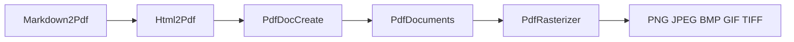

<sub>[CodeBrix](../../README.md) › [Libraries](README.md) › CodeBrix.PdfDocuments</sub>

# CodeBrix.PdfDocuments

**CodeBrix.PdfDocuments is a PDF stack for .NET that runs the whole way from drawing a glyph at an
exact coordinate to turning a finished page back into a PNG.** The repository produces five packages
that stack on one another: a low-level PDF library, a document object model that paginates for you,
an HTML-and-CSS renderer, a zero-configuration Markdown renderer, and a page rasterizer. Four of the
five are pure managed code with no native dependency of any kind, and you use them from any .NET 10
application or from a CodeBrix.Platform application.

| | |
| --- | --- |
| **Repository** | [ellisnet/CodeBrix.PdfDocuments](https://github.com/ellisnet/CodeBrix.PdfDocuments) |
| **Packages** | [`CodeBrix.PdfDocuments.MitLicenseForever`](https://www.nuget.org/packages/CodeBrix.PdfDocuments.MitLicenseForever)<br>[`CodeBrix.PdfDocCreate.MitLicenseForever`](https://www.nuget.org/packages/CodeBrix.PdfDocCreate.MitLicenseForever)<br>[`CodeBrix.PdfDocCreate.Html2Pdf.MitLicenseForever`](https://www.nuget.org/packages/CodeBrix.PdfDocCreate.Html2Pdf.MitLicenseForever)<br>[`CodeBrix.PdfDocCreate.Markdown2Pdf.MitLicenseForever`](https://www.nuget.org/packages/CodeBrix.PdfDocCreate.Markdown2Pdf.MitLicenseForever)<br>[`CodeBrix.PdfRasterizer.MitLicenseForever`](https://www.nuget.org/packages/CodeBrix.PdfRasterizer.MitLicenseForever) |
| **License** | MIT; see [License](#license) |
| **Requires** | .NET 10 or later. `CodeBrix.PdfRasterizer.MitLicenseForever` is the only package with a native component; it bundles the PDFium binaries and needs no separate native-asset package |
| **Use it from** | Any .NET 10 application, or a CodeBrix.Platform application |
| **Platforms** | The four managed packages run wherever .NET 10 runs, in containers and on web servers. The rasterizer ships natives for win-x64, win-x86, win-arm64, osx-x64, osx-arm64, linux-x64, linux-arm64, linux-arm, linux-riscv64 and android-arm64; iOS and WebAssembly are not supported |

## What it does

The five packages are complementary rather than alternatives, and each one brings in the ones below
it. Reference the highest-level package that does what you need.

| Package | Its role | Brings in |
| --- | --- | --- |
| `CodeBrix.PdfDocuments.MitLicenseForever` | Drawing at exact coordinates, reading, merging, encrypting | CodeBrix.Imaging, CodeBrix.Compression |
| `CodeBrix.PdfDocCreate.MitLicenseForever` | Sections, styles, tables, automatic pagination | PdfDocuments |
| `CodeBrix.PdfDocCreate.Html2Pdf.MitLicenseForever` | Rendering author-written HTML and CSS | PdfDocCreate, MarkupParse, StyleSheetParse, the font packages, the managed drawing engine |
| `CodeBrix.PdfDocCreate.Markdown2Pdf.MitLicenseForever` | Rendering Markdown with zero configuration | Html2Pdf |
| `CodeBrix.PdfRasterizer.MitLicenseForever` | Turning finished PDF pages back into images | PdfDocuments, CodeBrix.Imaging, the bundled natives |



**CodeBrix.PdfDocuments** creates new PDFs and draws text, images, shapes, paths, other PDF pages,
charts and bar codes at exact coordinates through `XGraphics`. It also opens existing PDFs (including
encrypted ones), copies pages between documents, adds bookmarks, links and annotations, fills form
fields, applies passwords and permissions, and exposes the raw PDF object model for anything the typed
API does not cover. Multi-stop linear and radial gradients become PDF shading patterns, transparency
groups carry a constant opacity and a PDF blend mode, and `ConsolidateImages()` dedupes identical
image XObjects by content hash. There is no automatic pagination or text flow at this level: you
decide where every page break goes.

**CodeBrix.PdfDocCreate** builds PDF documents from a structured document object model instead of from
drawing commands. You create a `Document`, add `Section`s, and fill them with paragraphs, tables,
images, text frames and charts. A renderer then performs all layout: line breaking, pagination,
repeating headers and footers, table row splitting across pages, footnote placement and PDF outline
generation. You never compute a page break yourself. The whole model serializes to and from a readable
DDL text format, so a document shell can live on disk as a template.

**CodeBrix.PdfDocCreate.Html2Pdf** renders author-created HTML pages with CSS styling into PDF
documents, with real selector matching, cascade, specificity and inheritance. All text renders with the
packaged fonts and never with operating-system fonts, so output is byte-comparable on every operating
system. SVG - files, `data:` URIs and inline `<svg>` - is placed as PDF vector content by default, so
it stays sharp at any zoom and adds no image XObject to the file. Unsupported CSS never fails a render:
it is ignored and reported in the result's warnings under a stable machine-readable code.

**CodeBrix.PdfDocCreate.Markdown2Pdf** turns any Markdown file into a nice-looking, pre-formatted,
printable PDF with zero configuration. Point it at a file, get a PDF. It is a three-stage pipeline -
Markdown to HTML, HTML plus a built-in print stylesheet, then the Html2Pdf renderer - and all three
stages are reachable, so you can also take the generated HTML and CSS and restyle them yourself.

**CodeBrix.PdfRasterizer** renders PDF pages to raster images (PNG, JPEG, BMP, GIF, TIFF), generates
aspect-preserving thumbnails, and reports page counts and page dimensions. It accepts a file path, a
byte array, a `Stream` or a `PdfDocument` object, so a document built in memory can be rasterized
without being saved first.

## When to use it

Pick the layer that matches how much of the layout you want to own.

Reach for [`CodeBrix.PdfDocuments.MitLicenseForever`](https://www.nuget.org/packages/CodeBrix.PdfDocuments.MitLicenseForever)
when the page is a canvas: a label, a ticket, a certificate, a stamp on someone else's PDF, an
imposition job, a merge, a permissions pass. Reach for
[`CodeBrix.PdfDocCreate.MitLicenseForever`](https://www.nuget.org/packages/CodeBrix.PdfDocCreate.MitLicenseForever)
when the document is prose and tables that must flow - a report, a manual, an invoice run - and you
want repeating table headers, widow control and bookmarks for free. Reach for
[`CodeBrix.PdfDocCreate.Html2Pdf.MitLicenseForever`](https://www.nuget.org/packages/CodeBrix.PdfDocCreate.Html2Pdf.MitLicenseForever)
when the content already exists as markup you control, and for
[`CodeBrix.PdfDocCreate.Markdown2Pdf.MitLicenseForever`](https://www.nuget.org/packages/CodeBrix.PdfDocCreate.Markdown2Pdf.MitLicenseForever)
when it exists as `.md` files. Add
[`CodeBrix.PdfRasterizer.MitLicenseForever`](https://www.nuget.org/packages/CodeBrix.PdfRasterizer.MitLicenseForever)
for previews, thumbnails, and visual regression testing - generate the PDF, rasterize it at a fixed
DPI, and compare the images against approved baselines.

What the stack deliberately does not do:

- No text extraction and no OCR. A content stream parses into operators, but text operands are
  font-encoded bytes, not strings. That is a statement about *reading* PDFs: text you write with
  `DrawString`, `XTextFormatter` or the document model is real, searchable text.
- No digital signatures, and no PDF/A or PDF/X compliance generation or validation.
- No creating new AcroForm fields. Existing fields can be read, filled and flattened.
- No editing existing page content in place. You may draw over or under it, replace the whole content
  stream, or rebuild it from parsed operators, but not change a word in place.
- Writing produces RC4 40-bit or 128-bit encryption. AES files can be read but not written.
- No Word or Excel files, no PDF portfolios, no JavaScript actions, no multimedia annotations.
- Html2Pdf is not a browser: no floats, absolute or relative positioning, flexbox, grid, JavaScript,
  media queries, CSS variables, `calc()`, or remote stylesheets. It does not convert live websites.
- Markdown2Pdf has no styling API. Six options, then the HTML and CSS hand-off. That is deliberate.
- The rasterizer only reads and renders: it does not create, merge, edit, encrypt or sign PDFs, and it
  does not render pages in parallel.

For spreadsheets rather than PDFs, see [FreePPlus](FreePPlus.md). To convert Texinfo manuals to PDF,
see [CodeBrix.Texinfo](CodeBrix.Texinfo.md), which drives Html2Pdf for you.

## Getting started

Install the highest-level package you need; it brings the ones below it with it.

```bash
dotnet add package CodeBrix.PdfDocuments.MitLicenseForever
dotnet add package CodeBrix.PdfDocCreate.MitLicenseForever
dotnet add package CodeBrix.PdfDocCreate.Html2Pdf.MitLicenseForever
dotnet add package CodeBrix.PdfDocCreate.Markdown2Pdf.MitLicenseForever
dotnet add package CodeBrix.PdfRasterizer.MitLicenseForever
```

The package IDs carry a `.MitLicenseForever` suffix that the assemblies and namespaces do not. There
is no package named plain `CodeBrix.PdfDocuments`, and the suffix never appears in a namespace, a
`using` directive or a type name.

Most low-level files need only the first three or four of these namespaces:

```csharp
using CodeBrix.PdfDocuments;                 // PageSize, PageOrientation enums
using CodeBrix.PdfDocuments.Pdf;             // PdfDocument, PdfPage, PdfPages,
using CodeBrix.PdfDocuments.Pdf.IO;          // PdfReader, PdfDocumentOpenMode,
using CodeBrix.PdfDocuments.Drawing;         // XGraphics, XFont, XBrush(es),
using CodeBrix.PdfDocuments.Drawing.Layout;  // XTextFormatter,
using CodeBrix.PdfDocuments.Drawing.BarCodes;// Code3of9Standard,
using CodeBrix.PdfDocuments.Charting;        // Chart, ChartFrame, Series,
using CodeBrix.PdfDocuments.Fonts;           // IFontResolver, FontResolverInfo,
using CodeBrix.PdfDocuments.Utils;           // ImagingImageSource<TPixel>
```

The document model, the two markup renderers and the rasterizer each have their own namespaces:

```csharp
using CodeBrix.PdfDocCreate.DocumentObjectModel;
using CodeBrix.PdfDocCreate.DocumentObjectModel.Tables;
using CodeBrix.PdfDocCreate.DocumentObjectModel.Shapes;
using CodeBrix.PdfDocCreate.DocumentObjectModel.Shapes.Charts;
using CodeBrix.PdfDocCreate.DocumentObjectModel.Fields;
using CodeBrix.PdfDocCreate.DocumentObjectModel.IO;
using CodeBrix.PdfDocCreate.Rendering;

using CodeBrix.PdfDocCreate.Html2Pdf;        // HtmlPdfRenderer, HtmlRenderOptions,
using CodeBrix.PdfDocCreate.Html2Pdf.Fonts;  // Html2PdfFonts (font discovery and
using CodeBrix.PdfDocCreate.Markdown2Pdf;

using CodeBrix.PdfRasterizer;          // PageRasterizer, PdfPageDimensions,
using CodeBrix.Imaging;                // Image (return type of rasterization
using CodeBrix.Imaging.Formats.Png;    // PngFormat.Instance  (default)
```

A complete PDF is four statements - a document, a page, an `XGraphics` in a `using` block, and a save.

```csharp
using CodeBrix.PdfDocuments.Drawing;
using CodeBrix.PdfDocuments.Pdf;

var document = new PdfDocument();
document.Info.Title = "My Document";

var page = document.AddPage();
using (var gfx = XGraphics.FromPdfPage(page))
{
    gfx.DrawString("PDF with Image", new XFont("Arial", 16), XBrushes.Black,
        new XPoint(12, 24));
    gfx.DrawImage(XImage.FromFile("photo.png"), new XPoint(12, 50));
}

document.Save("ImageDocument.pdf");
```

Disposing the `XGraphics` finishes the content stream, which is why the `using` matters. On Windows,
macOS and Linux no font resolver has to be registered first: the installed system fonts are discovered
automatically the first time a font is needed.

## Key concepts

### The three objects you always use

`PdfDocument` owns pages, metadata, options, security settings, outlines, the AcroForm and viewer
preferences. `PdfPage` carries the size, orientation, rotation, trim margins, the five boxes, the
content stream, resources, annotations and the three `Add*Link` helpers. `XGraphics` is the drawing
surface, created with `FromPdfPage`, `FromForm`, `FromPdfForm`, `FromImage` or `CreateMeasureContext`.
Create one `XGraphics` per page, draw, and dispose it.

### Coordinates and units

`XGraphics` coordinates are in points by default (72 per inch), origin top-left, y growing downwards.
`XGraphicsUnit` also offers Inch, Millimeter, Centimeter and Presentation (1/96 inch), and
`XPageDirection` is Downwards by default or Upwards. The value types are `XUnit`, `XPoint`, `XSize`,
`XRect`, `XVector` and `XMatrix`, with implicit conversions between `XUnit` and `double` in points.
Annotation and link rectangles are the exception: they live in PDF default page space, with y measured
from the bottom, so convert with `new PdfRectangle(gfx.Transformer.WorldToDefaultPage(rect))`.

### Fonts, embedding and CFF subsetting

Every font used is embedded in the PDF. TrueType-outline fonts embed as a subset of the glyphs used;
PostScript-outline (CFF) fonts embed whole unless the document opts in with
`document.Options.CffSubsetMode`. `PdfCffSubsetMode.Sparse` keeps only the used charstrings and
declares the program as PDF 32000-1 section 9.9 asks; `Compact` also empties unused subroutines and
strings, and falls back to `Sparse` when it cannot be done safely. Glyph indices are never renumbered,
in any mode. `XPdfFontOptions` controls only the encoding, `PdfFontEncoding.WinAnsi` or `Unicode`.

> [!WARNING]
> An unavailable font family never throws - it is silently substituted with the first installed font.
> Monospace families are the common casualty on Linux. Check `font.FontFamily.Name` after constructing
> an `XFont`, and in containers and CI register an `EmbeddedFontResolver` per face name before the
> first `XFont` is created.

### Transparency groups and blend modes

Drawing several overlapping shapes translucently darkens the overlap where they cross. To give
overlapping content a single opacity, call `XForm.MakeTransparencyGroup()` before drawing anything on
the form, then place it with `XGraphics.DrawTransparencyGroup(form, rect, opacity, blendMode)`.
`XBlendMode` carries the PDF `/BM` names.

### Reading, merging and editing existing PDFs

`PdfReader.TestPdfFile` returns the PDF version as an int, or 0 when the file is not a PDF, and the
`PdfReader.Open` family takes paths or streams with an open mode, an optional password or
`PdfPasswordProvider`, and an optional `PdfReadAccuracy` (`Strict` by default, or `Moderate`, which
tolerates broken references). `PdfDocumentOpenMode` is `Modify`, `Import`, `ReadOnly` or
`InformationOnly`. Pages copied into another document must come from a document opened in `Import`
mode, and `XGraphicsPdfPageOptions` decides where new drawing goes on an existing page: `Append` over
the existing content, `Prepend` under it, or `Replace` to discard it.

### The document model's four objects

`Document` holds styles, sections and metadata; a `Section` is a run of pages sharing one `PageSetup`
and one set of headers and footers; content objects fill the sections; `PdfDocumentRenderer` lays it
all out. Nothing is laid out until `RenderDocument()` runs, and property values read before that point
are the values you assigned, not the effective values. The rendered document stays reachable through
`PdfDocumentRenderer.PdfDocument`, which is the seam for security, extra annotations, merging and
`Options.CffSubsetMode`.

```csharp
var doc = new Document();
var section = doc.AddSection();
section.AddParagraph("Hello, PDF!");

var renderer = new PdfDocumentRenderer { Document = doc };
renderer.RenderDocument();
renderer.PdfDocument.Save("output.pdf");
```

### Styles and outline levels

Every `Document` starts with `Normal`, `Heading1` through `Heading9`, `DefaultParagraphFont`,
`Footnote`, `Header`, `Footer`, `Hyperlink` and `InvalidStyleName`, all constants on `StyleNames`. The
heading styles are pre-wired twice: each carries a `ParagraphFormat.OutlineLevel`, which is what drives
PDF outline generation automatically with no extra call, and they form an inheritance chain in which
`Heading2`'s base style is `Heading1`. Use `doc.AddStyle(name, baseStyleName)` only for names that are
not in that list, and fetch a built-in style with `doc.Styles["Heading1"]`.

### Page flow control

`PageBreakBefore`, `KeepTogether`, `KeepWithNext` and `WidowControl` are how you stop the renderer from
breaking a page in an ugly place - and they are the reason to use the document model rather than
drawing. A heading style should almost always set `KeepWithNext`. Across page breaks in a table, the
four members that matter are `Row.HeadingFormat`, `Row.KeepWith`, `Table.KeepTogether` and
`Rows.LeftIndent`.

### Units and colors in the document model

Every measurement in the document model is a `Unit`, and a bare number means points. `Unit.Parse`
recognizes the suffixes `cm`, `in`, `mm`, `pc`, `pt` and none; anything else throws. Colors come from
`Color` and the named `Colors` constants, and the two hex spellings do not mean the same thing:
`Color.Parse("#c0c0c0")` is opaque light gray while `Color.Parse("0xc0c0c0")` is fully transparent,
because the `0x` form puts alpha first. An eight-digit `#` value is rejected rather than guessed at.

### The Html2Pdf render call and its options

`HtmlPdfRenderer` has three synchronous methods: `RenderFile(htmlFilePath, outputPdfPath)`,
`RenderHtml(html, outputPdfPath, baseDirectory)` and `RenderHtmlToBytes(html, baseDirectory)`. Options
are copied at the start of each render, so one renderer instance serves many documents.
`HtmlRenderOptions` carries the page geometry (`SetPageSize` accepts letter, legal, ledger, a3, a4, a5,
b4 and b5), the four margins, `HeaderText` and `FooterText` with the tokens `{page}`, `{pages}` and
`{title}`, `AllowRemoteImages`, `GenerateOutline`, `SvgPlacement`, `SvgRasterScale`,
`KeepUncoveredCharacters`, `DocumentTitle`, `DocumentAuthor` and `CffSubsetMode`. An `@page` rule in
the document's CSS overrides the configured size and margins.

### SVG as vector content

`SvgPlacementMode.Vector` is the default. It writes the picture's drawing commands into the page as PDF
operators - paths, fills, strokes, dashes, clips, transforms, nested pictures, gradients as PDF shading
patterns, group opacity as a PDF transparency group, and text as real PDF text with a `ToUnicode` map -
so the picture stays sharp at any zoom, its text stays selectable and searchable, and no image XObject
is added. `Raster` rasterizes the whole picture to a transparent PNG in managed code instead. A part
that PDF cannot express - an image filter, Porter-Duff compositing other than source-over, a difference
clip, a cropped image, image opacity, a repeating or reflecting gradient, a gradient whose stops differ
in alpha, or a pattern fill - is rasterized on its own and reported as `image.svg.rasterized`.

### The warning model

`RenderWarnings` never throws over content. It exposes `Messages` (distinct display text in
first-occurrence order), `Count` and `Items` (one `RenderWarning` per distinct code, with `Category`,
`Code`, `Message`, `Occurrences` and a nullable `CodePoint`). `RenderWarningCategory` is `Css`,
`Image`, `Font` or `Html`. Codes are part of the library's compatibility surface and display prose is
not: assert on `Code` in tests, never on `Message`. The vocabulary runs
`css.stylesheet.unparseable`, `css.stylesheet.remote`, `css.stylesheet.missing`,
`css.selector.unsupported`, `css.property.unsupported`, `css.value.invalid`,
`css.inline-style.unparseable`, `css.background.partial`, `css.page-rule.unsupported`,
`css.page-margin.invalid`, `image.src.missing`, `image.remote.disabled`, `image.load.failed`,
`image.format.unsupported`, `image.svg.empty`, `image.svg.failed`, `image.svg.rasterized`,
`image.svg.filter-unsupported`, `image.svg.text-unsupported`, `image.svg.fonts-missing`,
`image.svg.degraded`, `font.family.unresolved`, `font.uncovered.removed`, `font.uncovered.kept`,
`font.svg-text.notdef`, `html.element.ignored` and `html.table.nested`.

### Fonts in Html2Pdf, and the per-glyph fallback chain

Generic families map to the packaged fonts: `sans-serif` and unknown families to Roboto, `serif` to
Merriweather, `monospace` to RobotoMono, exposed as `Html2PdfFonts.DefaultSansFamily`,
`DefaultSerifFamily` and `DefaultMonoFamily`. `Html2PdfFonts.AddFontDirectory`, `AddFontFile`,
`AddFontFiles`, `AddFontFilesFromDirectory` and `AddFallbackFamily` register more; loose `.ttf` and
`.otf` files need no manifest, because the family name, weight and style are read from the font's own
name and OS/2 tables. All registration methods are idempotent and thread-safe and may be called after
renders have happened; the first registration of a family name wins. Glyph coverage is decided per
character against the actual cmap table of the font each run resolved to, and a character the styled
font lacks renders with the first fallback family that covers it - only that character switches font.
Each font package ships companion families that join the fallback chain automatically at discovery,
which is what makes polytonic Greek, Armenian, Georgian and music notation render with no code.

### Markdown2Pdf's two workflows

The zero-configuration workflow is `RenderFile`, `RenderMarkdown` or `RenderMarkdownToBytes`. The
restyle workflow is `GenerateHtmlFromFile` or `GenerateHtml`, which hand back a `MarkdownHtmlResult`
with `BodyHtml`, the default `Css`, the inferred `Title` and the `BaseDirectory`; you edit or replace
the stylesheet, rebuild the document with `ToHtmlDocument(myCss)` and render it with your own
`HtmlPdfRenderer`. Because you drive the HTML renderer yourself in that second workflow, every Html2Pdf
option becomes available - custom page sizes, all four margins, header text, outline on or off, and
document metadata. `MarkdownRenderOptions` itself has six properties: `PageSize`, `AllowRemoteImages`,
`FooterText`, `SvgPlacement`, `SvgRasterScale` and `KeepUncoveredCharacters`.

### The Markdown feature set and its parser

CommonMark, verified against the specification's example corpus, plus GFM tables with column alignment,
strikethrough, footnotes (`[^label]` and inline `^[note text]`), task lists rendered as styleable spans,
YAML front matter consumed for title and author, reference links and images, autolinks, embedded HTML,
and fenced code with automatic syntax highlighting. The parser is public as `MarkdownParser`, with
`MarkdownPreset.Default`, `CommonMark` and `Zero`, a full rule-chain API (`Inline`, `Block`, `Core`,
`Renderer`, `Enable`, `Disable`, `Use`), a token stream you can walk, and the three bundled plugins
`FootnotePlugin`, `TaskListPlugin` and `FrontMatterPlugin`. A parser you create yourself has none of
the plugins installed; the PDF pipeline installs all three internally.

### Rasterizing pages

`PageRasterizer` is sealed and `IDisposable`; its constructor is where the native engine is loaded and
initialized, once per process. `Dpi` defaults to 300, `RasterizedImageFormat` to `PngFormat.Instance`,
`FileNameGenerator` to `pageNumber => $"Rasterized_Page_{pageNumber}"`, `AllowOverwriteFiles` to false,
`BackgroundColor` to opaque white, and the thumbnail bounding box to 200 by 260 pixels. The four method
families are `RasterizeToImageFiles` / `RasterizeToImageFile`, `RasterizeToImages` /
`RasterizeToImage`, `RasterizeToThumbnails` / `RasterizeToThumbnail` and `RasterizeToThumbnailFiles` /
`RasterizeToThumbnailFile`, plus `GetPageCount` and `GetPageDimensions`. Every one has overloads for a
path, a byte array, a `Stream` and a `PdfDocument`, and page numbers are 1-based everywhere.

> [!IMPORTANT]
> The native engine is not thread-safe. Every call into it is serialized through a single process-wide
> lock, so you can share one `PageRasterizer` across threads but native work always executes one call
> at a time, and a call that waits more than ten seconds for the lock throws `TimeoutException`. Do not
> expect parallel speed-up from multiple rasterizers.

## Examples

Merging a folder of PDFs and deduplicating the letterhead each of them repeats.

```csharp
using CodeBrix.PdfDocuments.Pdf;
using CodeBrix.PdfDocuments.Pdf.IO;

var output = new PdfDocument();

foreach (var path in Directory.GetFiles("pdfs/", "*.pdf"))
{
    using var fs = File.OpenRead(path);
    var input = PdfReader.Open(fs, PdfDocumentOpenMode.Import);
    for (var i = 0; i < input.PageCount; i++)
        output.AddPage(input.Pages[i]);
}

output.ConsolidateImages();       // dedupe repeated logos/letterheads
output.Save("merged.pdf");
```

Stamping every page of an existing contract with a rotated, translucent watermark.

```csharp
using CodeBrix.PdfDocuments.Drawing;
using CodeBrix.PdfDocuments.Pdf;
using CodeBrix.PdfDocuments.Pdf.IO;

var document = PdfReader.Open("contract.pdf", PdfDocumentOpenMode.Modify);
var font = new XFont("Arial", 72, XFontStyle.Bold);
var brush = new XSolidBrush(XColor.FromArgb(48, 200, 0, 0));   // translucent red

foreach (PdfPage page in document.Pages)
{
    using var gfx = XGraphics.FromPdfPage(page, XGraphicsPdfPageOptions.Append);
    var state = gfx.Save();
    gfx.RotateAtTransform(-40, new XPoint(page.Width / 2, page.Height / 2));
    gfx.DrawString("CONFIDENTIAL", font, brush,
        new XRect(0, 0, page.Width, page.Height), XStringFormats.Center);
    gfx.Restore(state);
}

document.Save("contract-watermarked.pdf");
```

To overlay a PDF page instead of text - a letterhead or a stamp designed in another tool - load it with
`XPdfForm.FromFile("stamp.pdf")` and draw it with `gfx.DrawImage(form, rect)` inside the same loop.

A styled report through the document model, with a table header that repeats on every page and a
"Page N of M" footer built from fields.

```csharp
using CodeBrix.PdfDocCreate.DocumentObjectModel;
using CodeBrix.PdfDocCreate.DocumentObjectModel.Tables;
using CodeBrix.PdfDocCreate.Rendering;

var doc = new Document();
doc.Info.Title = "Sales Report";
doc.Info.Author = "Accounts Department";

// Styles first - everything inherits from them
doc.Styles["Normal"].Font.Name = "Arial";
doc.Styles["Normal"].Font.Size = 10;
doc.Styles["Normal"].ParagraphFormat.SpaceAfter = 4;

var titleStyle = doc.AddStyle("Title", StyleNames.Normal);
titleStyle.Font.Size = 24;
titleStyle.Font.Bold = true;
titleStyle.ParagraphFormat.Alignment = ParagraphAlignment.Center;
titleStyle.ParagraphFormat.SpaceAfter = 12;

var h1 = doc.Styles[StyleNames.Heading1];
h1.Font.Size = 16;
h1.Font.Bold = true;
h1.ParagraphFormat.SpaceBefore = 12;
h1.ParagraphFormat.KeepWithNext = true;

// Section: US Letter, 1 inch margins
var section = doc.AddSection();
section.PageSetup.PageFormat = PageFormat.Letter;
section.PageSetup.TopMargin = Unit.FromInch(1);
section.PageSetup.BottomMargin = Unit.FromInch(1);
section.PageSetup.LeftMargin = Unit.FromInch(1);
section.PageSetup.RightMargin = Unit.FromInch(1);

section.AddParagraph("Quarterly Sales Report", "Title");
section.AddParagraph("Regional breakdown", StyleNames.Heading1);

var salesRows = new[]
{
    ("Widgets", 45000m, 52000m),
    ("Gadgets", 31000m, 29500m),
};

var table = section.AddTable();
table.Borders.Visible = true;
table.Borders.Width = 0.5;
table.Borders.Color = Colors.Silver;
table.AddColumn(Unit.FromCentimeter(6));
table.AddColumn(Unit.FromCentimeter(4));
table.AddColumn(Unit.FromCentimeter(4));

var header = table.AddRow();
header.HeadingFormat = true;              // repeats on every page
header.Shading.Color = Colors.LightGray;
header.Format.Font.Bold = true;
header.Cells[0].AddParagraph("Product");
header.Cells[1].AddParagraph("Q1 Sales");
header.Cells[2].AddParagraph("Q2 Sales");

foreach (var (product, q1, q2) in salesRows)
{
    var row = table.AddRow();
    row.Cells[0].AddParagraph(product);
    row.Cells[1].AddParagraph(q1.ToString("C0"));
    row.Cells[1].Format.Alignment = ParagraphAlignment.Right;
    row.Cells[2].AddParagraph(q2.ToString("C0"));
    row.Cells[2].Format.Alignment = ParagraphAlignment.Right;
}

// Footer with "Page N of M"
var footer = section.Footers.Primary;
var fp = footer.AddParagraph();
fp.AddText("Page ");
fp.AddPageField();
fp.AddText(" of ");
fp.AddNumPagesField();
fp.Format.Alignment = ParagraphAlignment.Center;

var renderer = new PdfDocumentRenderer { Document = doc };
renderer.RenderDocument();
renderer.Save("SalesReport.pdf");
```

Rendering an HTML file, then reading the structured warnings back.

```csharp
using CodeBrix.PdfDocCreate.Html2Pdf;

var renderer = new HtmlPdfRenderer();
renderer.Options.SetPageSize("a4");
renderer.Options.FooterText = "Page {page} of {pages}";

// Relative stylesheet/image references resolve against report.html's folder
HtmlRenderResult result = renderer.RenderFile("report.html", "out/report.pdf");

Console.WriteLine($"Wrote {result.OutputFilePath}: {result.PageCount} pages");
foreach (var message in result.Warnings.Messages)
{
    Console.WriteLine(message);          // "[css] ...", "[image] ...", ...
}
```

Restyling a Markdown document before it becomes a PDF: take the generated HTML and CSS, append your own
rules, and drive the HTML renderer yourself.

```csharp
using CodeBrix.PdfDocCreate.Html2Pdf;
using CodeBrix.PdfDocCreate.Markdown2Pdf;

var mdRenderer = new MarkdownPdfRenderer();
var generated = mdRenderer.GenerateHtmlFromFile("docs/report.md");

var css = generated.Css
    + "\nh1 { color: #7a1020; border-bottom: 1pt solid #7a1020; }"
    + "\nbody { font-size: 12pt; }";

var html = generated.ToHtmlDocument(css);

var htmlRenderer = new HtmlPdfRenderer();
htmlRenderer.Options.SetPageSize("a4");
htmlRenderer.Options.MarginTopPoints = 90;
htmlRenderer.Options.MarginBottomPoints = 90;
htmlRenderer.Options.HeaderText = "{title}";
htmlRenderer.Options.DocumentAuthor = "Documentation Team";

var result = htmlRenderer.RenderHtml(html, "out/report.pdf",
    generated.BaseDirectory);
```

Rasterizing a document that was never saved to disk - the rasterizer takes the `PdfDocument` object
directly.

```csharp
using CodeBrix.Imaging;
using CodeBrix.PdfDocuments.Drawing;
using CodeBrix.PdfDocuments.Pdf;
using CodeBrix.PdfRasterizer;

// Create a PDF in memory (CodeBrix.PdfDocuments)
var document = new PdfDocument();
var page = document.AddPage();
var gfx = XGraphics.FromPdfPage(page);
gfx.DrawString("Hello!", new XFont("Arial", 24),
    XBrushes.Black, new XPoint(50, 50));

// Rasterize directly from the PdfDocument - no Save() needed
using var rasterizer = new PageRasterizer();
using var image = await rasterizer.RasterizeToImage(document, pageNumber: 1);
image.Save("rendered.png");
```

## Using it in a CodeBrix.Platform application

None of the five packages is a CodeBrix.Platform add-in. They are ordinary libraries with no XAML
types, no head-specific behavior and no registration call, so a CodeBrix.Platform application adds them
to its `.Core` library exactly as any other .NET project would.

There is one Platform-facing detail. Html2Pdf depends on the `CodeBrix.Platform.Fonts.*` packages -
[`CodeBrix.Platform.Fonts.Roboto.OflLicenseForever`](https://www.nuget.org/packages/CodeBrix.Platform.Fonts.Roboto.OflLicenseForever),
[`CodeBrix.Platform.Fonts.Merriweather.OflLicenseForever`](https://www.nuget.org/packages/CodeBrix.Platform.Fonts.Merriweather.OflLicenseForever),
[`CodeBrix.Platform.Fonts.RobotoMono.OflLicenseForever`](https://www.nuget.org/packages/CodeBrix.Platform.Fonts.RobotoMono.OflLicenseForever)
and
[`CodeBrix.Platform.Fonts.NotoMusic.OflLicenseForever`](https://www.nuget.org/packages/CodeBrix.Platform.Fonts.NotoMusic.OflLicenseForever) -
and its build targets copy their fonts into the consuming application's output under
`CodeBrix.Platform.Fonts.<Name>/Fonts/`, the same layout a CodeBrix.Platform application uses. No font
installation or registration is required; the renderer discovers them there automatically. An
application that already delivers those fonts through its own asset pipeline can opt out with
`<CodeBrixHtml2PdfDisableFontCopy>true</CodeBrixHtml2PdfDisableFontCopy>` and then owns delivering
them, or points the renderer at them with `Html2PdfFonts.AddFontDirectory`.

The document model states the platform reach an application can count on: pure managed code, no native
libraries, no platform restrictions, no font installation step; it runs on Windows, macOS, Linux,
Android and iOS, in containers and on web servers. An application that adds the rasterizer inherits its
runtime-identifier list instead, and must keep the `runtimes/` folder the build produces beside its
assemblies.

The reference application in [CodeBrix.Samples](https://github.com/ellisnet/CodeBrix.Samples) is
[InannaRosette](https://github.com/ellisnet/CodeBrix.Samples/tree/main/InannaRosette), which composes a
hand-placed, multi-page report with `XGraphics` rather than through the document model: it grows its own page
cursor for margins and breaks, draws as `XGraphicsPath` geometry the same vector art its pages draw on screen,
and registers an `EmbeddedFontResolver` per face name from fonts embedded in its own library, so the finished
file carries a subset of every glyph it used.

## Pitfalls

- Do not confuse a package ID with a namespace. The `.MitLicenseForever` suffix belongs to the package
  ID only and never appears in code.
- Do not open a PDF for `Import` and then modify or save it - saving an imported document throws
  `InvalidOperationException`. Use `Modify` for editing.
- Do not assume the font you asked for is the font you got. An unavailable family is silently
  substituted rather than raising an error.
- Do not set `GlobalFontSettings.FontResolver` after any font has been used; the setter throws. And
  register an `EmbeddedFontResolver` once per *face* name it serves, not under the family name - an
  unregistered face falls through to the system-font resolver.
- Do not pass an `XStringFormat` to `XTextFormatter.DrawString`; there is no such overload. Its
  `AllowVerticalOverflow` also defaults to false, so text past the bottom of the rectangle is cut, and
  there is no automatic page breaking - measure with `GetLayout` and start a new page yourself.
- Do not pass a CodeBrix.Imaging `Image` to `XImage.FromImageSource`, which takes an `IImageSource`;
  bridge with `ImagingImageSource<TPixel>.FromImagingImage(image, format)`. Note also that
  `XImage.FromStream` takes a `Func<Stream>`, not a `Stream`.
- Do not expect `Save(Stream)` to close the stream: the one-argument form leaves it open with
  `Position` reset to 0, and the two-argument form disposes it.
- Do not set a `DocumentSecurityLevel` without a password - saving throws. Setting either password
  raises the level from `None` to `Encrypted128Bit`, and that is the intended way to turn encryption on.
- Do not expect a gradient brush's `Transform` to do anything unless the brush is an `XShadingBrush`,
  and note that `XGradientStop`'s alpha is ignored.
- Do not rely on `PdfStream.UnfilteredValue` for every filter: only Flate, LZW, ASCIIHex and ASCII85
  are decoded. DCTDecode, CCITTFaxDecode, JBIG2Decode, JPXDecode and RunLengthDecode are recognized by
  name and come back still encoded.
- Do not mix up the two `DocumentObject` families. `CodeBrix.PdfDocuments.Charting` has its own
  `Chart`, `Font`, `Point`, `LineFormat` and `DocumentObject` types; alias one namespace when a file
  uses both.
- Do not forget `RenderDocument()` before saving - `PdfDocumentRenderer.PdfDocument` is null until it
  runs, and `PageCount` throws on a fresh renderer.
- Do not call `doc.AddStyle(...)` with a built-in style name. It does not throw on a duplicate: it
  replaces the existing style with a fresh one and hands you back an object that is not the one stored
  in the document, so every property you set afterwards is written to an orphan. Worse, the replacement
  discards the built-in style's `OutlineLevel` and breaks the heading inheritance chain.
- Do not assume the document model's default page size is US Letter. It is A4, with 2.5 / 2 / 2.5 /
  2.5 cm margins, and `PageFormat` only supplies a dimension you did not assign yourself.
- Do not expect `Headers.FirstPage` or `Headers.EvenPage` to appear on their own: they are inert until
  `DifferentFirstPageHeaderFooter` or `OddAndEvenPagesHeaderFooter` is turned on. A section that
  defines neither headers nor page setup inherits both from the previous section.
- Do not create a `Chart` or a `TextFrame` without setting `Width` and `Height`. A chart has no default
  size at all and renders as nothing; a text frame defaults to one inch in each dimension.
- Do not call `section.AddImage("photo.png")` - there is no string overload - and install the image
  source once per process with `ImageSource.ImageSourceImpl ??= new ImagingImageSource<Rgba32>();`
  before the first `ImageSource.FromFile`, or the call throws `NullReferenceException`.
- Do not fake bullets with `* ` prefixes or borderless tables; use `ParagraphFormat.ListInfo` so the
  renderer handles numbering, continuation across page breaks and hanging indents.
- Do not render the same `Document` twice. The layout pass mutates the document with the flattened
  values, so the second render starts from a mutated model - build a new `Document`, or `Clone()`
  before the first render.
- Do not expect non-Windows-1252 text to survive the default encoding: use
  `new PdfDocumentRenderer(unicode: true)`.
- Do not add a `Barcode` shape to the document model and expect to see it. The type exists but no
  renderer handles it; draw bar codes with the low-level bar-code API onto the rendered `PdfDocument`.
- Do not feed Html2Pdf arbitrary web pages. Unsupported features are ignored with
  `css.property.unsupported` or `html.element.ignored` warnings, not emulated. Nested tables are
  skipped with `html.table.nested`, remote stylesheets are never loaded, and `AllowRemoteImages` is
  false by default.
- Do not read `PdfBytes` after `RenderFile` or `RenderHtml`, or `OutputFilePath` after
  `RenderHtmlToBytes` - each is null in the other mode. The Markdown renderer mirrors this, and
  `RenderMarkdownToBytes` returns a result object, not a `byte[]`.
- Do not delete or relocate the `CodeBrix.Platform.Fonts.<Name>/Fonts/` folders the build places in the
  output; without them the first render throws `InvalidOperationException`.
- Do not write a color in SVG as `rgba(r%, g%, b%, a%)`. The percentage form is mis-parsed as opaque
  black, in raster placement as well as vector; rewrite those colors in numeric or hex form.
- Do not assume every SVG text run is selectable. A stroked run, a gradient-filled run, and a run in a
  family no registered face provides all stay glyph outlines; raster placement has no text at all, and
  text on a path is not drawn.
- Do not expect a Markdown plugin to affect `RenderFile` or `RenderMarkdown` - those build their own
  parser internally - and do not pass `FrontMatterPlugin.Apply` to `Use()`, whose signature it does not
  match.
- Do not forget to dispose a `PageRasterizer` or the `Image` objects its methods return; the caller
  owns the returned images. `AllowOverwriteFiles` defaults to false, so a second run into the same
  directory throws `IOException` on the first existing file.
- Do not pass `renderFlags` to the rasterizer without `RenderAnnotations` if you still want form fields
  and annotations drawn - the parameter replaces the default, it does not add to it.

## Documentation and source

The repository ships no samples folder and no tools; the three test projects are the worked examples,
and every AGENT-README links to the test files that demonstrate each API.

| Document | Where |
| --- | --- |
| Overview (README) | [README.md](https://github.com/ellisnet/CodeBrix.PdfDocuments/blob/main/README.md) |
| Low-level PDF API guide (ships inside the package too) | [AGENT-README.txt](https://github.com/ellisnet/CodeBrix.PdfDocuments/blob/main/AGENT-README.txt) |
| Document object model API guide | [src/CodeBrix.PdfDocCreate/AGENT-README.txt](https://github.com/ellisnet/CodeBrix.PdfDocuments/blob/main/src/CodeBrix.PdfDocCreate/AGENT-README.txt) |
| HTML and CSS renderer API guide | [src/CodeBrix.PdfDocCreate.Html2Pdf/AGENT-README.txt](https://github.com/ellisnet/CodeBrix.PdfDocuments/blob/main/src/CodeBrix.PdfDocCreate.Html2Pdf/AGENT-README.txt) |
| Markdown renderer API guide | [src/CodeBrix.PdfDocCreate.Markdown2Pdf/AGENT-README.txt](https://github.com/ellisnet/CodeBrix.PdfDocuments/blob/main/src/CodeBrix.PdfDocCreate.Markdown2Pdf/AGENT-README.txt) |
| Rasterizer API guide | [src/CodeBrix.PdfRasterizer/AGENT-README.txt](https://github.com/ellisnet/CodeBrix.PdfDocuments/blob/main/src/CodeBrix.PdfRasterizer/AGENT-README.txt) |
| Map of every document in the repository | [README-INDEX.txt](https://github.com/ellisnet/CodeBrix.PdfDocuments/blob/main/README-INDEX.txt) |
| Non-package content in the repository | [EXTRAS-README.txt](https://github.com/ellisnet/CodeBrix.PdfDocuments/blob/main/EXTRAS-README.txt) |
| Tests (worked examples of every API) | [tests](https://github.com/ellisnet/CodeBrix.PdfDocuments/tree/main/tests) |

Every one of the five NuGet packages includes its own `AGENT-README.txt` - a complete API reference and
usage guide - so an AI coding agent can be pointed at the file inside the package it is writing code
against.

## License

CodeBrix.PdfDocuments is licensed under the MIT License, and the license is also named in every package
ID: `CodeBrix.PdfDocuments.MitLicenseForever`, `CodeBrix.PdfDocCreate.MitLicenseForever`,
`CodeBrix.PdfDocCreate.Html2Pdf.MitLicenseForever`,
`CodeBrix.PdfDocCreate.Markdown2Pdf.MitLicenseForever` and `CodeBrix.PdfRasterizer.MitLicenseForever`
all carry the same terms. The native binaries bundled in the rasterizer package are BSD-licensed, and
their license file ships beside each binary; the font packages the two markup renderers bring in are
OFL-licensed. For the provenance and licensing of open source code included in this library, see
[THIRD-PARTY-NOTICES.txt](https://github.com/ellisnet/CodeBrix.PdfDocuments/blob/main/THIRD-PARTY-NOTICES.txt)
in the repository.

---

**Where to go next**

- [CodeBrix.Texinfo](CodeBrix.Texinfo.md) - turns Texinfo manuals into PDFs by driving the HTML renderer for you
- [CodeBrix.MarkupParse](CodeBrix.MarkupParse.md) and [CodeBrix.StyleSheetParse](CodeBrix.StyleSheetParse.md) - the HTML and CSS engines behind Html2Pdf
- [CodeBrix.Imaging.Drawing](CodeBrix.Imaging.Drawing.md) - the managed drawing engine that places SVG as vector content
- [ellisnet/CodeBrix.PdfDocuments on GitHub](https://github.com/ellisnet/CodeBrix.PdfDocuments) - source and tests
