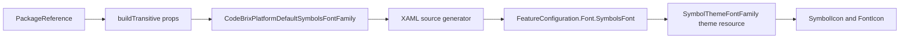

<sub>[CodeBrix](../../README.md) › [Libraries](README.md) › CodeBrix.Platform.Fonts.Fluent</sub>

# CodeBrix.Platform.Fonts.Fluent

**CodeBrix.Platform.Fonts.Fluent is an asset package: it ships one icon font and the MSBuild glue
that makes that font the default symbols font of a CodeBrix.Platform application.** Add the package
reference and `<SymbolIcon Symbol="Setting" />` draws a gear - there is no code to write, no service
to register and no managed API to call. What you actually consume is a string (the font content URI)
and, at most, one MSBuild property.

| | |
| --- | --- |
| **Repository** | [ellisnet/CodeBrix.Platform.Fonts.Fluent](https://github.com/ellisnet/CodeBrix.Platform.Fonts.Fluent) |
| **Packages** | [`CodeBrix.Platform.Fonts.Fluent.ApacheLicenseForever`](https://www.nuget.org/packages/CodeBrix.Platform.Fonts.Fluent.ApacheLicenseForever) |
| **License** | Apache-2.0; see [License](#license) |
| **Requires** | .NET 10 or later; the package has no NuGet dependencies of its own |
| **Use it from** | CodeBrix.Platform applications; a plain .NET 10 application can read the font file out of the restored package folder |
| **Platforms** | Platform-neutral - no native libraries, no OS restriction |

## What it does

- Makes itself the application's default symbols font automatically. With the package referenced and
  nothing else done, `<SymbolIcon Symbol="Setting" />` and a bare `<FontIcon Glyph="&#xE713;" />`
  both resolve to this font.
- Sets the MSBuild property `CodeBrixPlatformDefaultSymbolsFontFamily` to the font content URI from a
  `buildTransitive` `.props` file that NuGet auto-imports because its filename matches the package ID.
- Ships the `.uprimarker` asset-marker file next to the assembly, which is how the build-time asset
  step collects the font into the application's assets and makes it reachable through `ms-appx:///`.
- Offers an opt-out MSBuild property, `CodeBrixFontsFluentDisableImport`, that suppresses the
  automatic default registration while still shipping the font.
- Supplies Fluent iconography for ordinary text - `TextBlock` content, `Button` content, a `Run`
  inside a paragraph - when the font is named explicitly.
- Carries the arrow and lock glyphs CodeBrix.Platform paints by raw codepoint in its own on-screen
  keyboard and file picker, which makes them known-good where plain Unicode arrows are absent from
  the text fonts an application ships.

## When to use it

Reference it from any CodeBrix.Platform application that renders `SymbolIcon`, `FontIcon`, or any
built-in control whose template draws an icon - those templates resolve the `SymbolThemeFontFamily`
theme resource, and this package is what fills it. Reference it, too, when you want Fluent
iconography inside ordinary text by naming the font explicitly. Applications generated from the
CodeBrix.Platform application template already reference it; referencing it a second time is harmless
but unnecessary.

It is not a text face. There are no letters, digits or punctuation in it beyond a space, it cannot be
an application's `DefaultTextFontFamily`, and it is not a fallback for text. For text, reach for one
of the sibling font packages: [CodeBrix.Platform.Fonts.OpenSans](CodeBrix.Platform.Fonts.OpenSans.md),
[CodeBrix.Platform.Fonts.Roboto](CodeBrix.Platform.Fonts.Roboto.md),
[CodeBrix.Platform.Fonts.RobotoMono](CodeBrix.Platform.Fonts.RobotoMono.md) or
[CodeBrix.Platform.Fonts.Merriweather](CodeBrix.Platform.Fonts.Merriweather.md).

Four more things are deliberately out of scope:

- **It exposes no managed API.** Zero public types. There is no helper that returns the font stream,
  the font path, or a glyph by name.
- **`ms-appx:///` does not resolve outside CodeBrix.Platform.** Console applications, ASP.NET, test
  hosts and non-CodeBrix.Platform UI frameworks get nothing from the URI.
- **No glyph names, no glyph index.** The font's `post` table is format 3.0, so nothing in the
  package can turn "printer icon" into a codepoint. The `Symbol` enum is the only name-based path,
  and it belongs to CodeBrix.Platform, not to this package.
- **No subsetting.** An application that uses six glyphs still carries the whole font. If that
  matters, the answer is a smaller font of your own plus the opt-out property, not a setting on this
  package.

## Getting started

```bash
dotnet add package CodeBrix.Platform.Fonts.Fluent.ApacheLicenseForever
```

There is nothing to `using` from this package. The types in the examples below come from
CodeBrix.Platform itself:

```csharp
using Microsoft.UI.Xaml.Controls;   // FontIcon, SymbolIcon, Symbol
using Microsoft.UI.Xaml.Media;      // FontFamily
using CodeBrix.Platform.UI;         // FeatureConfiguration
```

The one identifier the package really contributes is a string - the font content URI:

```text
ms-appx:///CodeBrix.Platform.Fonts.Fluent/Fonts/uno-fluentui-assets.ttf
```

No registration call is required. Referencing the package is normally the only thing a consumer does,
and these two lines then draw a Fluent icon in the correct font:

```xml
<SymbolIcon Symbol="Setting" />
<FontIcon Glyph="&#xE713;" />
```

Notice that neither line names a font. In a normal CodeBrix.Platform application you do not need to
write the URI anywhere; you write it explicitly only when you are overriding something or rendering
glyphs in ordinary text.

## Key concepts

### How the package registers itself

Five steps run between the `PackageReference` and the icon on screen.

1. NuGet auto-imports `buildTransitive/net10.0/CodeBrix.Platform.Fonts.Fluent.ApacheLicenseForever.props`
   into the consuming project; the `.props` filename matches the package ID, which is what makes
   NuGet's auto-import convention apply.
2. That `.props` sets the MSBuild property `CodeBrixPlatformDefaultSymbolsFontFamily` to the font
   content URI, guarded by `Condition="'$(CodeBrixFontsFluentDisableImport)'==''"`.
3. CodeBrix.Platform's source-generator package marks `CodeBrixPlatformDefaultSymbolsFontFamily` as a
   compiler-visible property, so the XAML source generator can read it.
4. When the property is non-empty, the XAML generator appends one line to the end of the generated
   `App.xaml` constructor.
5. Assigning `FeatureConfiguration.Font.SymbolsFont` pushes a new `FontFamily` into the
   `SymbolThemeFontFamily` key of the Default, Light and HighContrast theme dictionaries. `SymbolIcon`
   and `FontIcon` both default their `FontFamily` to `FeatureConfiguration.Font.SymbolsFont`.



This is the line step 4 generates:

```csharp
global::CodeBrix.Platform.UI.FeatureConfiguration.Font.SymbolsFont
    = "<the URI from step 2>";
```

Separately, the head project's asset step looks beside each referenced assembly for a file named
`<AssemblyName>.uprimarker`. This package ships `lib/net10.0/CodeBrix.Platform.Fonts.Fluent.uprimarker`
next to `CodeBrix.Platform.Fonts.Fluent.dll`, which is how the font under
`lib/net10.0/CodeBrix.Platform.Fonts.Fluent/Fonts/` is collected into the application's assets.

### The font content URI

The URI is usable anywhere a `FontFamily` is accepted: a XAML attribute, the `FontFamily(string)`
constructor, or `FeatureConfiguration.Font.SymbolsFont`.

```text
ms-appx:///CodeBrix.Platform.Fonts.Fluent/Fonts/uno-fluentui-assets.ttf
```

The `CodeBrix.Platform.Fonts.Fluent/Fonts/` segment is the package's content folder inside the nupkg
and is load-bearing - it is not the assembly name being echoed, it is a real directory. The
AGENT-README calls this URI the package's real public API, and it is the reason the assembly name and
the content folder always match.

The assembly and content-folder name is `CodeBrix.Platform.Fonts.Fluent`, without the
`.ApacheLicenseForever` suffix. That suffix exists only on the NuGet package ID, to disambiguate
license variants across the CodeBrix family; there is no package named plain
`CodeBrix.Platform.Fonts.Fluent`. Use the un-suffixed name in the URI and the suffixed name in
`dotnet add package`.

### The build property `CodeBrixPlatformDefaultSymbolsFontFamily`

This is the property the CodeBrix.Platform XAML source generator reads, and the shipped `.props`
sets it. Set it yourself to point the default symbols font somewhere else:

```xml
<PropertyGroup>
  <CodeBrixPlatformDefaultSymbolsFontFamily>ms-appx:///MyApp/Assets/Fonts/my-icons.ttf</CodeBrixPlatformDefaultSymbolsFontFamily>
</PropertyGroup>
```

MSBuild evaluation order decides the winner. Put your own value in a `Directory.Build.targets`, or in
a `<PropertyGroup>` that is evaluated after NuGet's imported `.props`, if you find it is being
overwritten.

### The opt-out property `CodeBrixFontsFluentDisableImport`

Set it to any non-empty value before the package's `.props` is evaluated - a `Directory.Build.props`,
or the top of the project file - and the package stops registering itself as the default symbols
font. The font file still ships and is still reachable by URI; only the automatic default is
suppressed. If you opt out, you own supplying a symbols font, or `SymbolIcon` renders with whatever
the runtime default is.

### The runtime property `FeatureConfiguration.Font.SymbolsFont`

```csharp
public static string SymbolsFont { get; set; }
```

It is a `string` (a font URI), not a `FontFamily`, and its stock default in CodeBrix.Platform is
already this package's URI. Assigning it rewrites the `SymbolThemeFontFamily` theme resource in all
three theme dictionaries. Per its own documentation it must be assigned after
`App.InitializeComponent()` to take effect - which is exactly where the generated assignment lands.

### The theme resource `SymbolThemeFontFamily`

A `FontFamily` resource present in the Default, Light and HighContrast theme dictionaries. Built-in
control templates resolve icons through it, so overriding it in application resources changes every
templated icon at once.

### One face, no manifest

The package ships exactly one font file and no manifest. Read from the file's own tables, the family
name is `Symbols`, the subfamily is `Regular`, and there are no glyph names at all because `post` is
format 3.0 - you address glyphs by codepoint, never by name.

There is no bold, no italic, no weight axis and no variable font. Setting `FontWeight` or `FontStyle`
on a `FontIcon` changes nothing about which outline is drawn; use `FontSize` and `Foreground` for
visual variation. No `.ttf.manifest` ships with this package, because there is no weight/style/stretch
family to resolve. The sibling text-font packages do ship manifests; this one does not, and none of
their manifest rules apply here.

### Glyph coverage

Three of the mapped codepoints are not icons: the control slots U+0000 and U+0001, and U+0020 space.
Everything else lives in the Private Use Area, spread from U+E001 to U+F8AE. Because they are PUA,
these codepoints mean nothing in any other font: text carrying them renders as missing-glyph boxes,
or as unrelated icons, unless the run is drawn in this font.

Coverage is dense but not contiguous - the mapped codepoints form many separate runs, so a codepoint
inside a covered block is not guaranteed to exist. Do not compute a glyph by adding an offset to a
known one.

Two ranges matter in practice:

| Range | What lives there |
| --- | --- |
| `U+E100`-`U+E1FF` | The legacy range, where the values of the `Symbol` enum live |
| `U+E700` upward | The modern range, where `SymbolIcon` actually draws from |

Nothing is mapped in `U+E300`-`U+E5FF` or `U+F600`-`U+F6FF`.

### The `Symbol` enum and the glyph it actually draws

Every member of CodeBrix.Platform's `Microsoft.UI.Xaml.Controls.Symbol` enum has a codepoint that
exists in this font - verified member by member against the shipped `cmap`. But `SymbolIcon` does not
draw the enum's own value. Before drawing, it runs the value through a translation table that moves
the legacy U+E1xx codepoints to modern equivalents, so the icon matches current Fluent iconography.
Almost every member is remapped; a few map to themselves, one has no table entry, and any value the
table does not recognize falls through and is drawn as-is.

```xml
<SymbolIcon Symbol="Setting" />                  <!-- draws U+E713 -->
<FontIcon Glyph="&#xE115;" />                    <!-- draws U+E115 -->
```

`Symbol.Setting` is 57621 = U+E115, but `SymbolIcon` draws U+E713. That is the single most useful
fact on this page: mixing `SymbolIcon` and hand-written `FontIcon` glyphs in one toolbar is the usual
way to end up with one odd-looking icon.

> [!TIP]
> If a `Symbol` member names what you want, use `SymbolIcon` - that is the only name-based path that
> is guaranteed correct. Otherwise take the published icon codepoint you want and check that it
> renders; the modern `U+E7xx`-`U+F8xx` ranges are what this font covers. Never invent a codepoint by
> arithmetic; coverage is not contiguous.

### Glyphs the framework paints by codepoint

These have no `Symbol` member. CodeBrix.Platform paints them in its own on-screen keyboard and file
picker, and they are useful precisely because they are known-good: plain Unicode arrows (U+2191 and
friends) are absent from the text fonts a CodeBrix.Platform application usually ships, whereas these
are in this font, which the framework always has.

```text
ArrowUp        U+E110        ArrowLeft      U+E112
ArrowDown      U+E74B        ArrowRight     U+E111
LockLocked     U+E72E        LockUnlocked   U+E785
```

### The `#Symbols` fragment

Both the bare path and the path with `#Symbols` appended work, and both are in use inside
CodeBrix.Platform. The fragment after `#` names a font family inside the file; this file declares
exactly one family, and its name - read from the font's own `name` table - is literally `Symbols`. So
`#Symbols` selects the same and only face that the bare path selects. It is redundant, not wrong.

The shipped `.props` sets the bare path with no fragment, and a test asserts that. In
CodeBrix.Platform's own generic theme dictionary the `SymbolThemeFontFamily` entry for the Skia heads
is written with `#Symbols`, so both forms coexist in a running application and resolve to the same
face.

The sibling text-font packages tell you never to append a fragment. That rule is about fonts whose
weight and style variants are resolved through a `.ttf.manifest` keyed on the bare `.ttf` path. This
package ships no manifest and one face, so there is nothing here for a fragment to interfere with.
The rule of thumb is still to write the bare path.

## Examples

A page that draws the same gear three ways - by enum, by codepoint on the default font, and by
codepoint with the font named explicitly.

```xml
<Page x:Class="MyApp.MainPage"
      xmlns="http://schemas.microsoft.com/winfx/2006/xaml/presentation"
      xmlns:x="http://schemas.microsoft.com/winfx/2006/xaml">
  <StackPanel Spacing="12" Padding="24">

    <!-- 1. the enum, translated to the modern glyph by the framework -->
    <SymbolIcon Symbol="Setting" />

    <!-- 2. the same glyph, by codepoint, on the default font -->
    <FontIcon Glyph="&#xE713;" />

    <!-- 3. the same glyph, with the font named explicitly -->
    <FontIcon
        FontFamily="ms-appx:///CodeBrix.Platform.Fonts.Fluent/Fonts/uno-fluentui-assets.ttf"
        Glyph="&#xE713;" />

  </StackPanel>
</Page>
```

All three should render an identical gear. If 1 and 2 render and 3 does not, the URI is wrong. If 3
renders and 1 and 2 do not, the default registration did not happen - check
`CodeBrixFontsFluentDisableImport` and that the reference reaches the head project.

An icon inside a button, first with a `SymbolIcon` and then glyph-only with no icon element at all.

```xml
<Button>
    <StackPanel Orientation="Horizontal" Spacing="6">
        <SymbolIcon Symbol="Save" />
        <TextBlock Text="Save" />
    </StackPanel>
</Button>

<!-- or, glyph-only, with no icon element at all -->
<Button
    FontFamily="ms-appx:///CodeBrix.Platform.Fonts.Fluent/Fonts/uno-fluentui-assets.ttf"
    Content="&#xE74E;" />
```

A glyph inside a sentence. Put the icon in its own `Run` and give that run the symbols font, because
the surrounding prose keeps the application's text font.

```xml
<TextBlock>
    <Run Text="Press " />
    <Run FontFamily="ms-appx:///CodeBrix.Platform.Fonts.Fluent/Fonts/uno-fluentui-assets.ttf"
         Text="&#xE713;" />
    <Run Text=" to open settings." />
</TextBlock>
```

The same things in C#. Note that `Glyph` is a `string`, not a `char`.

```csharp
using Microsoft.UI.Xaml.Controls;
using Microsoft.UI.Xaml.Media;
using CodeBrix.Platform.UI;

private const string FluentSymbols =
    "ms-appx:///CodeBrix.Platform.Fonts.Fluent/Fonts/uno-fluentui-assets.ttf";

// FontIcon with an explicit family and a glyph by codepoint
var gear = new FontIcon
{
    FontFamily = new FontFamily(FluentSymbols),
    Glyph = "\uE713",
    FontSize = 20
};

// FontIcon relying on the registered default
var gearDefault = new FontIcon { Glyph = "\uE713" };

// SymbolIcon by enum member (the framework picks the modern glyph)
var saveIcon = new SymbolIcon(Symbol.Save);

// ...or via the property, which is what XAML sets
var deleteIcon = new SymbolIcon { Symbol = Symbol.Delete };

// A glyph in ordinary text
var line = new TextBlock
{
    FontFamily = new FontFamily(FluentSymbols),
    Text = "\uE713"
};

// Change the application-wide symbols font (after InitializeComponent)
FeatureConfiguration.Font.SymbolsFont = FluentSymbols;
```

The minimum project file that consumes the package.

```xml
<Project Sdk="Microsoft.NET.Sdk">
  <PropertyGroup>
    <TargetFramework>net10.0</TargetFramework>
  </PropertyGroup>
  <ItemGroup>
    <PackageReference Include="CodeBrix.Platform.Fonts.Fluent.ApacheLicenseForever" />
  </ItemGroup>
</Project>
```

## Using it in a CodeBrix.Platform application

Referencing the package is normally the only thing you do: the `.props` import, the source generator
and the asset marker do the rest. Write the URI explicitly only when you are overriding something or
rendering glyphs in ordinary text.

There are three ways to point the application at a different symbols font, in increasing order of how
much the framework helps:

| Where | How | Notes |
| --- | --- | --- |
| Build time | Set `CodeBrixPlatformDefaultSymbolsFontFamily` in the project file | Flows through the same generator path the package uses |
| Run time | Assign `FeatureConfiguration.Font.SymbolsFont` after `App.InitializeComponent()` | What the framework itself does |
| Declaratively | Override `SymbolThemeFontFamily` in application resources | Must mirror all three theme dictionaries |

Prefer the first two. Assigning `FeatureConfiguration.Font.SymbolsFont` is what the framework itself
does, and it also becomes the default for newly created `FontIcon` and `SymbolIcon` instances, which
a resource override does not.

```csharp
public App()
{
    this.InitializeComponent();
    CodeBrix.Platform.UI.FeatureConfiguration.Font.SymbolsFont =
        "ms-appx:///MyApp/Assets/Fonts/my-icons.ttf";
}
```

The declarative form has to mirror all three theme dictionaries or a theme switch will lose your
value:

```xml
<Application.Resources>
    <ResourceDictionary>
        <ResourceDictionary.ThemeDictionaries>
            <ResourceDictionary x:Key="Default">
                <FontFamily x:Key="SymbolThemeFontFamily">ms-appx:///MyApp/Assets/Fonts/my-icons.ttf</FontFamily>
            </ResourceDictionary>
            <ResourceDictionary x:Key="Light">
                <FontFamily x:Key="SymbolThemeFontFamily">ms-appx:///MyApp/Assets/Fonts/my-icons.ttf</FontFamily>
            </ResourceDictionary>
            <ResourceDictionary x:Key="HighContrast">
                <FontFamily x:Key="SymbolThemeFontFamily">ms-appx:///MyApp/Assets/Fonts/my-icons.ttf</FontFamily>
            </ResourceDictionary>
        </ResourceDictionary.ThemeDictionaries>
    </ResourceDictionary>
</Application.Resources>
```

> [!WARNING]
> An application that overrides `SymbolThemeFontFamily`, or the default symbols font family, by hand
> and still wants the bundled font must point that override at the same
> `ms-appx:///CodeBrix.Platform.Fonts.Fluent/Fonts/uno-fluentui-assets.ttf` path. Otherwise the
> hand-written value wins and the bundled font is never used.

Opting out is one property, set before the package's `.props` is evaluated:

```xml
<PropertyGroup>
  <CodeBrixFontsFluentDisableImport>true</CodeBrixFontsFluentDisableImport>
</PropertyGroup>
```

Outside a CodeBrix.Platform host, a program that only wants the `.ttf` bytes can read the font out of
the `lib/net10.0/CodeBrix.Platform.Fonts.Fluent/Fonts/` folder of the restored package. You do that
lookup yourself; the package offers no helper.

## Pitfalls

- **Do not assume `Symbol.X` and codepoint `X` are the same picture.** `SymbolIcon` remaps almost
  every `Symbol` member from its legacy U+E1xx value to a modern one. `Symbol.Setting` is U+E115 but
  draws U+E713.
- **The property name is `CodeBrixPlatformDefaultSymbolsFontFamily`.** A `.props` or project file
  that sets some other property name silently does nothing - there is no warning, the icons fall
  back to whatever the runtime default is.
- **The opt-out must be set early.** `CodeBrixFontsFluentDisableImport` is read as a condition on the
  package's imported `.props`. Setting it inside a target, or after that import has been evaluated,
  is too late.
- **PUA codepoints are meaningless in a text font.** A raw PUA codepoint in a `TextBlock` that uses
  the application's text font gives you a missing-glyph box, not an icon. The run carrying the glyph
  must carry the symbols font too.
- **`Glyph` is a string.** `new FontIcon { Glyph = "\uE713" }` compiles; a `char` does not.
- **Weight and style do nothing.** The file has one face. `FontWeight="Bold"` or `FontStyle="Italic"`
  on a `FontIcon` will not produce a bold or slanted icon; the same outline is drawn.
- **Coverage is not contiguous.** The icon codepoints are spread over many separate runs between
  U+E001 and U+F8AE. A codepoint that "should" exist between two that do may not. Verify by rendering.
- **Changing the symbols font late only partly takes.** Assigning `FeatureConfiguration.Font.SymbolsFont`
  rewrites the `SymbolThemeFontFamily` theme resource, but `FontIcon` captures its default
  `FontFamily` in dependency-property metadata and `SymbolIcon` caches its font family in a static
  field - both are established the first time those types are used. Set the font during application
  startup, or better through the build property, not after icons are already on screen.
- **Do not rename the content folder.** The `ms-appx:///` URI resolves against the package's
  `lib/net10.0/CodeBrix.Platform.Fonts.Fluent/Fonts/` directory. It is a real path, not a decorative
  namespace.
- **The asset marker must sit beside the assembly.** Asset discovery looks for
  `<AssemblyName>.uprimarker` next to each referenced assembly. This matters if you ever vendor the
  font by hand instead of referencing the package - copying only the `.ttf` will not make it
  reachable by URI.
- **Never set `FontFamily` on a `SymbolIcon`.** It has no such property, and it resolves its font
  itself.
- **Reuse one `FontFamily` instance.** A `static readonly` field or a XAML resource, rather than
  `new FontFamily(uri)` per icon.

The XAML character-entity form is `&#x` plus the hex codepoint plus `;`. All codepoints in this font
are in the BMP, so one entity is one glyph - no surrogate pairs are ever needed.

## Samples and tools in the repository

The repository contains no samples, no tools and no demo applications. It builds exactly one NuGet
package, and every file in it is either part of that package, documentation, or the test project.
There is deliberately no sample application: this package registers a font for CodeBrix.Platform
applications, so a meaningful sample would be a whole CodeBrix.Platform application head, which
belongs in the CodeBrix.Platform samples.

| Name | What it demonstrates | Where |
| --- | --- | --- |
| Test project | Asserts that the font, the asset marker and the `buildTransitive` `.props` are present, correctly shaped and correctly named | [`tests/CodeBrix.Platform.Fonts.Fluent.Tests`](https://github.com/ellisnet/CodeBrix.Platform.Fonts.Fluent/tree/main/tests/CodeBrix.Platform.Fonts.Fluent.Tests) |

Four test classes are worth reading as executable documentation:

- `PropsFileTests.cs` - the `.props` exists, sets `CodeBrixPlatformDefaultSymbolsFontFamily`, points
  at the font URI, and offers the `$(CodeBrixFontsFluentDisableImport)` opt-out. Read this one first
  if you are unsure what the package registers.
- `ContentFilePresenceTests.cs` - the font is present, is the only `.ttf` in the package, and the
  `.uprimarker` asset marker exists and is empty.
- `AssemblyMetadataTests.cs` - the assembly is named `CodeBrix.Platform.Fonts.Fluent`, targets
  .NET 10, loads by name, and exports no public types.
- `TestAssetPaths.cs` - where the three shipped files land relative to a build output, which is
  useful if you are writing your own asset-presence check.

Run them from the repository root:

```bash
dotnet test CodeBrix.Platform.Fonts.Fluent.slnx
```

No opt-in environment variables, no test data to download, no device or display required.

## Documentation and source

| Document | Where |
| --- | --- |
| Overview (README) | [README.md](https://github.com/ellisnet/CodeBrix.Platform.Fonts.Fluent/blob/main/README.md) |
| Complete API guide (ships inside the package too) | [AGENT-README.txt](https://github.com/ellisnet/CodeBrix.Platform.Fonts.Fluent/blob/main/AGENT-README.txt) |
| Map of every document in the repository | [README-INDEX.txt](https://github.com/ellisnet/CodeBrix.Platform.Fonts.Fluent/blob/main/README-INDEX.txt) |
| Non-package content in the repository | [EXTRAS-README.txt](https://github.com/ellisnet/CodeBrix.Platform.Fonts.Fluent/blob/main/EXTRAS-README.txt) |
| Tests (worked examples of the package contract) | [tests/CodeBrix.Platform.Fonts.Fluent.Tests](https://github.com/ellisnet/CodeBrix.Platform.Fonts.Fluent/tree/main/tests/CodeBrix.Platform.Fonts.Fluent.Tests) |

## License

CodeBrix.Platform.Fonts.Fluent is licensed under the Apache License 2.0; the license is also named in
the package ID (`CodeBrix.Platform.Fonts.Fluent.ApacheLicenseForever`). The library code, the `.props`
file, the package wrapper and the bundled font are all Apache-2.0, so the package declares the single
SPDX expression `Apache-2.0` rather than a dual expression. The package sets
`PackageRequireLicenseAcceptance`, so a restore in an interactive tool asks you to accept the license.
For the provenance and licensing of open source code included in this library, see
[THIRD-PARTY-NOTICES.txt](https://github.com/ellisnet/CodeBrix.Platform.Fonts.Fluent/blob/main/THIRD-PARTY-NOTICES.txt)
in the repository.

---

**Where to go next**

- [Views and styling](../platform/06-views-and-styling.md) - where fonts, icons and theme resources
  fit into a CodeBrix.Platform page
- [CodeBrix.Platform.Fonts.OpenSans](CodeBrix.Platform.Fonts.OpenSans.md) - the text face to pair with
  these icons
- [Library catalog](README.md) - every CodeBrix library by topic
- [ellisnet/CodeBrix.Platform.Fonts.Fluent on GitHub](https://github.com/ellisnet/CodeBrix.Platform.Fonts.Fluent) - source and tests
