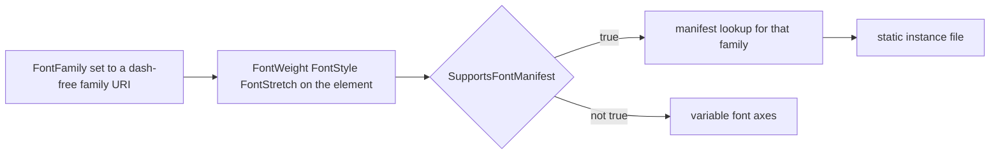

<sub>[CodeBrix](../../README.md) › [Libraries](README.md) › CodeBrix.Platform.Fonts.Merriweather</sub>

# CodeBrix.Platform.Fonts.Merriweather

**CodeBrix.Platform.Fonts.Merriweather ships the Merriweather serif family as build-time content
assets - the variable font, a curated set of static instances, and three Noto Serif companion
families that carry Greek, Armenian and Georgian.** Merriweather itself covers Latin and Cyrillic;
the companions are files in this same package, so there is nothing extra to reference. Use it from a
CodeBrix.Platform application, or as a plain content-files NuGet in any .NET 10 project that wants
the font binaries.

| | |
| --- | --- |
| **Repository** | [ellisnet/CodeBrix.Platform.Fonts.Merriweather](https://github.com/ellisnet/CodeBrix.Platform.Fonts.Merriweather) |
| **Packages** | [`CodeBrix.Platform.Fonts.Merriweather.OflLicenseForever`](https://www.nuget.org/packages/CodeBrix.Platform.Fonts.Merriweather.OflLicenseForever) |
| **License** | `OFL-1.1`; see [License](#license) |
| **Requires** | .NET 10 or later; the package has no NuGet dependencies of its own |
| **Use it from** | Any .NET 10 application, or a CodeBrix.Platform application |
| **Platforms** | Platform-neutral - no native libraries, no OS-specific components |

## What it does

- Ships the Merriweather variable font and its static instances as build-time content assets under
  `lib/net10.0/CodeBrix.Platform.Fonts.Merriweather/Fonts/`, each addressable by `ms-appx:///` URI.
- Bundles three companion families - **Noto Serif** for Greek, **Noto Serif Armenian** and **Noto
  Serif Georgian** - so those scripts render in a matching serif design.
- Ships four `.ttf.manifest` JSON files, one per family, mapping `font_style` / `font_weight` /
  `font_stretch` triples to the matching static font file.
- Ships an MSBuild `.targets` file that prunes the redundant static fonts at consumer-build time on
  platforms without font-manifest support.
- Ships a `.uprimarker` file that CodeBrix.Platform build pipelines use to discover font asset
  packages.

## When to use it

Reach for Merriweather when you want a serif face for reading: long-form body copy, documents,
anything where a sans face would feel like chrome. It is the family's serif, and the companion
arrangement means Greek, Armenian and Georgian arrive with it rather than as separate references.
That companion arrangement is the one structural difference from the sibling
[CodeBrix.Platform.Fonts.OpenSans](CodeBrix.Platform.Fonts.OpenSans.md) package, and it is the thing
to understand before writing code against this package.

It does not cover Hebrew, Arabic, Indic scripts, CJK, emoji or musical-notation symbols. For musical
notation, see the sibling
[CodeBrix.Platform.Fonts.NotoMusic](CodeBrix.Platform.Fonts.NotoMusic.md); for Hebrew, see
[CodeBrix.Platform.Fonts.OpenSans](CodeBrix.Platform.Fonts.OpenSans.md).

Four more limits shape what you can ask for:

- **No Black (900), Thin or ExtraLight static instances, and no Condensed stretch** - Merriweather
  publishes none. Black remains reachable through the variable font.
- **No italics for Armenian or Georgian**, so italic text in those scripts renders upright.
- **One optical size ships as statics.** See [Optical size](#optical-size).
- **It exposes no public managed types**, no font-loading helper, no typeface API and no
  glyph-metrics API. Referencing it gives you files, not objects.

It also does not install fonts into the operating system, does not register fonts with any OS font
service, does not implement font-fallback resolution itself, and has no runtime dependency on
CodeBrix.Platform.

## Getting started

```bash
dotnet add package CodeBrix.Platform.Fonts.Merriweather.OflLicenseForever
```

There is nothing to `using`. The package exposes no public managed types, so no namespace import is
ever required to consume it. The identifier that matters is the content root of the URI space, which
is the assembly name:

```text
ms-appx:///CodeBrix.Platform.Fonts.Merriweather/Fonts/<file>.ttf
```

```text
ms-appx:///CodeBrix.Platform.Fonts.Merriweather/Fonts/Merriweather.ttf
ms-appx:///CodeBrix.Platform.Fonts.Merriweather/Fonts/Merriweather-Bold.ttf
ms-appx:///CodeBrix.Platform.Fonts.Merriweather/Fonts/NotoSerif.ttf
```

One element in the family's variable font:

```xml
<TextBlock Text="Hello, world."
           FontFamily="ms-appx:///CodeBrix.Platform.Fonts.Merriweather/Fonts/Merriweather.ttf" />
```

> [!IMPORTANT]
> The variable font's default instance is weight 300 (Light), not Regular. Set `FontWeight`
> explicitly when you want Regular (400) - the line above renders Light.

## Key concepts

### The URI space is the public API

The assembly and `ms-appx:///` content root is `CodeBrix.Platform.Fonts.Merriweather`, with no
suffix; the `.OflLicenseForever` suffix exists only on the NuGet package ID, for license
disambiguation across the CodeBrix family. There is no package named plain
`CodeBrix.Platform.Fonts.Merriweather`.

The `lib/net10.0/CodeBrix.Platform.Fonts.Merriweather/Fonts/` folder name is load-bearing: the
`ms-appx:///CodeBrix.Platform.Fonts.Merriweather/Fonts/...` URIs resolve relative to the assembly
name, so the folder and the assembly always carry the same name.

The only managed identifier that appears in consumer code is CodeBrix.Platform's own configuration
entry point, which belongs to the platform package rather than to this one:
`global::CodeBrix.Platform.UI.FeatureConfiguration.Font.DefaultTextFontFamily`.

### Four families in one package

| Family | Dash-free file | Supplies | Faces |
| --- | --- | --- | --- |
| Merriweather | `Merriweather.ttf` | Latin, Cyrillic | Six weights, upright and italic, Normal and SemiCondensed |
| Noto Serif | `NotoSerif.ttf` | Greek, including polytonic | Six weights, Normal stretch, upright and italic |
| Noto Serif Armenian | `NotoSerifArmenian.ttf` | Armenian | Six weights, Normal stretch, upright only |
| Noto Serif Georgian | `NotoSerifGeorgian.ttf` | Georgian | Six weights, Normal stretch, upright only |

The Merriweather statics are `Merriweather-<Weight>[Italic].ttf` at Normal stretch and
`Merriweather_SemiCondensed-<Weight>[Italic].ttf` at SemiCondensed, across Light (300), Regular
(400), Medium (500), SemiBold (600), Bold (700) and ExtraBold (800). The upright Regular file is
`Merriweather-Regular.ttf`; the italic of a weight drops the weight word only for Regular, giving
`Merriweather-Italic.ttf`.

`Merriweather.ttf` carries three axes: `wght` 300-900 with a default of 300, `wdth` 87-112 with a
default of 100, and `opsz` 18-144 with a default of 18. All three companion variable fonts carry a
`wght` axis of 100-900, default 400, and a `wdth` axis of 62.5-100, default 100, so the variable file
reaches weights and widths the six static instances per family do not. Neither Noto Serif Armenian
nor Noto Serif Georgian has an italic face, so italic text in those scripts renders upright.

### Optical size

The manifest schema addresses fonts by style, weight and stretch only - there is no optical-size
dimension - so exactly one optical size ships as static instances: 24pt, the closest static to the
variable font's own `opsz` default of 18. The filenames carry no optical-size token, so they match
the family convention. The bundled variable font retains the full optical-size axis.

### The four manifests

Each family has a manifest beside its dash-free font, discovered by name - the font file path plus
`.manifest`.

```json
{
  "font_style":   "Normal",
  "font_weight":  600,
  "font_stretch": "SemiCondensed",
  "family_name":  "ms-appx:///CodeBrix.Platform.Fonts.Merriweather/Fonts/Merriweather_SemiCondensed-SemiBold.ttf"
}
```

The value sets are `"Normal" | "Italic"`, `300 | 400 | 500 | 600 | 700 | 800`, and
`"Normal" | "SemiCondensed"`, with a `family_name` URI. `family_name` holds the URI of the static
file, not a typographic family name - do not be misled by the member name.

The primary manifest satisfies the complete cross product of the six weights, two styles and two
stretches. The companion manifests carry Normal stretch only, and the Armenian and Georgian manifests
carry upright only. Combinations that are not in a manifest - Thin, ExtraLight, Black, Condensed, or
italic Armenian and Georgian - have no static instance to resolve to; do not assume a specific file
will be picked for them.

### Selecting a weight, style or stretch

Set `FontFamily` to the dash-free family URI - the variable font - then express the face you want
with the ordinary XAML text properties: `FontWeight` from Light, Normal, Medium, SemiBold, Bold and
ExtraBold; `FontStyle` Normal or Italic; `FontStretch` Normal or SemiCondensed. The same three
properties work on a `<Run>` inside a `TextBlock`.



Those three properties are exactly the triple the `.ttf.manifest` files are keyed on. On a platform
that resolves fonts through the manifest, the requested triple selects the matching static file
listed in the manifest. Where the manifest is not used, the same properties drive the variable font's
own weight and width axes, and the statics are not in the payload at all because the build prunes
them.

### The prune and `SupportsFontManifest`

The package injects one MSBuild target from `buildTransitive/net10.0/`; its file name matches the
NuGet package ID, so NuGet's auto-import convention picks it up.

```xml
<Target Name="CodeBrixRemoveUnusedMerriweather"
        AfterTargets="_CodeBrixAddLibraryAssets">
```

When `$(SupportsFontManifest)` is not `'true'`, it removes the dash-bearing static font files from
the application's asset items, leaving the four variable fonts. Set `SupportsFontManifest` to `true`
in a head project to keep the statics. The prune runs after the `_CodeBrixAddLibraryAssets` target,
so it fires in a CodeBrix.Platform application build; a build that never runs that target keeps every
font.

### Script and glyph coverage

Coverage is read from each bundled variable font's `cmap`, and the static instances carry the same
set.

| Family | Covers |
| --- | --- |
| Merriweather | Latin including Vietnamese, Cyrillic and Cyrillic Supplement, punctuation, currency, letterlike symbols, number forms, arrows and mathematical operators |
| Noto Serif | Greek and Coptic plus the whole Greek Extended block - polytonic Greek - with Latin and Cyrillic of its own |
| Noto Serif Armenian | Armenian, plus a Latin subset for mixed-script runs |
| Noto Serif Georgian | Georgian, Georgian Supplement and Georgian Extended (Mtavruli) |

Merriweather's handful of Greek-and-Coptic codepoints are isolated symbol characters, the kind that
appear inside Latin text - not the Greek script. Treat Merriweather as Latin plus Cyrillic only, and
reach for the Noto Serif companion for Greek.

### Missing glyphs are visible here

Nothing in the package covers Hebrew, Arabic, Indic scripts, CJK, emoji or musical notation. The
CodeBrix family never falls back to a system font, so a codepoint outside the coverage above renders
as `.notdef` - and all four bundled families draw a `.notdef` box, so missing text shows as tofu
boxes rather than disappearing.

> [!WARNING]
> Uncovered codepoints do not silently borrow a font from the OS. Check coverage before assuming a
> rendering bug.

## Examples

Weight, style and stretch through the manifest, with the resolved file named in each comment.

```xml
<StackPanel>

  <!-- SemiBold upright, Normal stretch  ->  Merriweather-SemiBold.ttf -->
  <TextBlock Text="Section heading"
             FontFamily="ms-appx:///CodeBrix.Platform.Fonts.Merriweather/Fonts/Merriweather.ttf"
             FontWeight="SemiBold" />

  <!-- Bold italic, Normal stretch  ->  Merriweather-BoldItalic.ttf -->
  <TextBlock Text="Emphatic sentence"
             FontFamily="ms-appx:///CodeBrix.Platform.Fonts.Merriweather/Fonts/Merriweather.ttf"
             FontWeight="Bold"
             FontStyle="Italic" />

  <!-- Light upright, SemiCondensed  ->
       Merriweather_SemiCondensed-Light.ttf -->
  <TextBlock Text="Narrow caption text"
             FontFamily="ms-appx:///CodeBrix.Platform.Fonts.Merriweather/Fonts/Merriweather.ttf"
             FontWeight="Light"
             FontStretch="SemiCondensed" />

</StackPanel>
```

Every element names the same family URI, and only the text properties change. That is the form to
prefer, because it is the only one that behaves the same on every head.

Mixed weights inside one paragraph, with `<Run>`:

```xml
<TextBlock FontFamily="ms-appx:///CodeBrix.Platform.Fonts.Merriweather/Fonts/Merriweather.ttf">
  <Run Text="Normal body text, " />
  <Run Text="bold words, " FontWeight="Bold" />
  <Run Text="and an italic aside." FontStyle="Italic" />
</TextBlock>
```

Declaring the family once in `App.xaml`, under the family's conventional resource key, and using it
directly or through a style:

```xml
<Application x:Class="MyApp.App"
             xmlns="http://schemas.microsoft.com/winfx/2006/xaml/presentation"
             xmlns:x="http://schemas.microsoft.com/winfx/2006/xaml">
  <Application.Resources>
    <ResourceDictionary>

      <FontFamily x:Key="MerriweatherFont">ms-appx:///CodeBrix.Platform.Fonts.Merriweather/Fonts/Merriweather.ttf</FontFamily>

      <Style x:Key="BodyTextStyle" TargetType="TextBlock">
        <Setter Property="FontFamily" Value="{StaticResource MerriweatherFont}" />
        <Setter Property="FontSize" Value="15" />
      </Style>

    </ResourceDictionary>
  </Application.Resources>
</Application>
```

```xml
<TextBlock Text="Body copy"
           FontFamily="{StaticResource MerriweatherFont}" />
<TextBlock Text="Styled body copy"
           Style="{StaticResource BodyTextStyle}" />
```

Making Merriweather the application-wide default text font:

```csharp
// Run this before the first UI element is created — typically at the
// top of the App constructor, before InitializeComponent().
global::CodeBrix.Platform.UI.FeatureConfiguration.Font.DefaultTextFontFamily =
    "ms-appx:///CodeBrix.Platform.Fonts.Merriweather/Fonts/Merriweather.ttf";
```

Greek, Armenian or Georgian text: either rely on the platform's fallback chain, or address the
companion font directly on the run that needs it. The second form is the deterministic one.

```xml
<TextBlock FontFamily="ms-appx:///CodeBrix.Platform.Fonts.Merriweather/Fonts/Merriweather.ttf">
  <Run Text="Greek follows: " />
  <Run Text="&#x03B1;&#x03B2;&#x03B3;"
       FontFamily="ms-appx:///CodeBrix.Platform.Fonts.Merriweather/Fonts/NotoSerif.ttf" />
</TextBlock>

<!-- Armenian, weight-matched to the surrounding text -->
<TextBlock Text="&#x0531;&#x0532;&#x0533;"
           FontFamily="ms-appx:///CodeBrix.Platform.Fonts.Merriweather/Fonts/NotoSerifArmenian.ttf"
           FontWeight="SemiBold" />
```

The minimum project file, keeping the static instances in the payload:

```xml
<Project Sdk="Microsoft.NET.Sdk">

  <PropertyGroup>
    <TargetFramework>net10.0</TargetFramework>
    <!-- Keep the static instances in the app payload. When this is
         not 'true', the package's .targets prunes them and only the
         four variable fonts ship. The prune runs after the
         _CodeBrixAddLibraryAssets target, so it only fires in a
         build that runs that target. -->
    <SupportsFontManifest>true</SupportsFontManifest>
  </PropertyGroup>

  <ItemGroup>
    <PackageReference Include="CodeBrix.Platform.Fonts.Merriweather.OflLicenseForever" />
  </ItemGroup>

</Project>
```

A minimum page, using the resource declared above:

```xml
<Page x:Class="MyApp.MainPage"
      xmlns="http://schemas.microsoft.com/winfx/2006/xaml/presentation"
      xmlns:x="http://schemas.microsoft.com/winfx/2006/xaml">
  <StackPanel Padding="24" Spacing="8">
    <TextBlock Text="Merriweather"
               FontFamily="{StaticResource MerriweatherFont}"
               FontWeight="Bold"
               FontSize="28" />
    <TextBlock Text="A serif face with Latin and Cyrillic coverage."
               FontFamily="{StaticResource MerriweatherFont}"
               FontSize="15" />
  </StackPanel>
</Page>
```

Pinning one exact static file is possible, and is what to avoid in portable code:

```xml
<TextBlock Text="Bold sample"
           FontFamily="ms-appx:///CodeBrix.Platform.Fonts.Merriweather/Fonts/Merriweather-Bold.ttf" />
```

Dash-bearing files are exactly what the `.targets` prunes when `SupportsFontManifest` is not
`'true'`, so that URI resolves on some heads and not on others. Use the dash-free URI plus
`FontWeight="Bold"` instead unless you control the head.

## Using it in a CodeBrix.Platform application

Adding the `PackageReference` contributes the fonts and manifests to the application's asset set;
nothing else is required to make the font files available. To keep the static instances in the
payload, the head project sets `<SupportsFontManifest>true</SupportsFontManifest>`; otherwise the
package's `.targets` prunes them and only the four variable fonts ship. Because the prune runs
`AfterTargets="_CodeBrixAddLibraryAssets"`, it fires in a CodeBrix.Platform application build, and a
build that never runs that target keeps every font.

The application then chooses the font in one of three ways: assign `DefaultTextFontFamily`, declare
the `MerriweatherFont` resource and bind with `{StaticResource}`, or name the URI per element.

The package does not implement font fallback - the companions are files, and consulting them for a
codepoint the primary font lacks is CodeBrix.Platform's job. When you want a guarantee rather than a
per-codepoint lookup, name the companion URI on the run that carries Greek, Armenian or Georgian.

Outside a CodeBrix.Platform host there is no `ms-appx:///` resolver; a plain .NET 10 program must
find the file itself in the restored package folder, under
`lib/net10.0/CodeBrix.Platform.Fonts.Merriweather/Fonts/`.

## Pitfalls

- **Never add a `#FamilyName` fragment to a font URI.** CodeBrix.Platform strips it during font
  resolution, and on `DefaultTextFontFamily` it silently disables the startup manifest preload - the
  appended `.manifest` lands inside the fragment and is dropped by `Uri.PathAndQuery`.
- **Do not hard-code a dash-bearing static URI in code or XAML that must work everywhere.** Those
  files are what the `.targets` prunes when `SupportsFontManifest` is not `'true'`. Use the dash-free
  URI plus `FontWeight="Bold"` instead. The four variable fonts are never pruned, which is why the
  companion families are named without a dash.
- **The variable font's default instance is Light (300), not Regular.** Set `FontWeight` explicitly
  when you want Regular (400).
- **Do not expect Greek, Armenian or Georgian from Merriweather itself** - it has no glyphs for them.
  That is what the three companion families are for.
- **Italic Armenian and Georgian render upright.** There is no italic face for either family.
- **There is no system-font fallback anywhere in the CodeBrix family.** Uncovered codepoints render
  as `.notdef`, and every font in this package draws a box for it, so unsupported text shows as tofu
  boxes.
- **Merriweather declares the Reserved Font Name `Merriweather`,** so SIL OFL 1.1 condition 3
  applies: do not alter the font bytes or the internal name tables, and do not redistribute a
  modified font under that name. The three Noto Serif families declare no Reserved Font Name.
- **Only one optical size ships as static instances.** The manifest has no optical-size dimension, so
  additional optical sizes could not be addressed even if they were added.
- **Requesting Thin, ExtraLight, Black or a Condensed stretch has no matching static instance** in
  this package.
- **`ms-appx:///` is a CodeBrix.Platform concept, not a .NET one.** In a console application or a
  unit test the URI will not resolve; locate the file on disk instead.

Two habits keep the font cost down: reference one family URI - the dash-free variable font - and vary
`FontWeight`, `FontStyle` and `FontStretch`, rather than naming many static files directly, which
keeps the referenced-font set small and lets the platform load only the faces actually used; and
prefer the primary font for body text, reaching for a companion only on the runs that need Greek,
Armenian or Georgian, since each additional directly-referenced family is another font file to load.

## Samples and tools in the repository

The repository contains no sample applications, demo apps, tools, scripts or optional test-data
downloads. It is a single font asset package plus the test project that guards it.

The reference application in [CodeBrix.Samples](https://github.com/ellisnet/CodeBrix.Samples) is
[InannaRosette](https://github.com/ellisnet/CodeBrix.Samples/tree/main/InannaRosette), which names this
package's URI as its application-wide default text font and exposes the regular and bold faces as `FontFamily`
resources that every text style uses, then embeds its own copies of the same faces in the PDF report it
composes through [CodeBrix.PdfDocuments](CodeBrix.PdfDocuments.md), so the report reads the same on a machine
with no fonts installed.

| Name | What it demonstrates | Where |
| --- | --- | --- |
| Test project | xUnit v3 and SilverAssertions suite that pins the package's contents - font file set, manifest entries, `.targets` behavior and assembly metadata | [`tests/CodeBrix.Platform.Fonts.Merriweather.Tests`](https://github.com/ellisnet/CodeBrix.Platform.Fonts.Merriweather/tree/main/tests/CodeBrix.Platform.Fonts.Merriweather.Tests) |

The classes worth reading:

- `ContentManifestTests.cs` - the four manifests: the six weights, Normal and Italic plus Normal and
  SemiCondensed on the primary family, upright-only companions, and that every `family_name` URI is
  rooted at `ms-appx:///CodeBrix.Platform.Fonts.Merriweather/Fonts/` and names a file that exists.
- `ContentFilePresenceTests.cs` - that every `.ttf` file ships, and that no optical-size token
  survives in any filename.
- `TargetsFileTests.cs` - that the `.targets` declares `CodeBrixRemoveUnusedMerriweather`, hooks
  `AfterTargets="_CodeBrixAddLibraryAssets"`, carries the `SupportsFontManifest` condition, and never
  removes a variable font.
- `AssemblyMetadataTests.cs` - that the assembly is named `CodeBrix.Platform.Fonts.Merriweather`,
  targets .NET 10 and exports no public types.

Run them from the repository root:

```bash
dotnet test CodeBrix.Platform.Fonts.Merriweather.slnx
```

No opt-in environment variables, no downloads, no special preparation.

## Documentation and source

| Document | Where |
| --- | --- |
| Overview (README) | [README.md](https://github.com/ellisnet/CodeBrix.Platform.Fonts.Merriweather/blob/main/README.md) |
| Complete API guide (ships inside the package too) | [AGENT-README.txt](https://github.com/ellisnet/CodeBrix.Platform.Fonts.Merriweather/blob/main/AGENT-README.txt) |
| Map of every document in the repository | [README-INDEX.txt](https://github.com/ellisnet/CodeBrix.Platform.Fonts.Merriweather/blob/main/README-INDEX.txt) |
| Non-package content in the repository | [EXTRAS-README.txt](https://github.com/ellisnet/CodeBrix.Platform.Fonts.Merriweather/blob/main/EXTRAS-README.txt) |
| Tests (worked examples of the manifests and the asset contract) | [tests/CodeBrix.Platform.Fonts.Merriweather.Tests](https://github.com/ellisnet/CodeBrix.Platform.Fonts.Merriweather/tree/main/tests/CodeBrix.Platform.Fonts.Merriweather.Tests) |

## License

CodeBrix.Platform.Fonts.Merriweather is licensed under `OFL-1.1`, the SIL Open Font License 1.1, and
the license is also named in the package ID
(`CodeBrix.Platform.Fonts.Merriweather.OflLicenseForever`). That one SPDX expression covers the
entire package: the library code, the `.targets` file, the packaging wrapper, and the bundled
Merriweather and Noto Serif `.ttf` font files alike. `OFL.txt` is packed at the root of the nupkg,
and the package sets `PackageRequireLicenseAcceptance`, so a restore in an interactive tool asks you
to accept the license.

Merriweather declares the Reserved Font Name `Merriweather`, so SIL OFL 1.1 condition 3 applies: do
not alter the font bytes or the internal name tables, and do not redistribute a modified font under
that name. The three Noto Serif families declare no Reserved Font Name. For the provenance and
licensing of open source code included in this library, see
[THIRD-PARTY-NOTICES.txt](https://github.com/ellisnet/CodeBrix.Platform.Fonts.Merriweather/blob/main/THIRD-PARTY-NOTICES.txt)
in the repository.

---

**Where to go next**

- [Views and styling](../platform/06-views-and-styling.md) - where fonts and text properties fit into
  a CodeBrix.Platform page
- [CodeBrix.Platform.Fonts.NotoMusic](CodeBrix.Platform.Fonts.NotoMusic.md) - the notation symbols
  font to pair with this serif face
- [CodeBrix.Platform.Fonts.Roboto](CodeBrix.Platform.Fonts.Roboto.md) - the sans family with the same
  companion arrangement
- [ellisnet/CodeBrix.Platform.Fonts.Merriweather on GitHub](https://github.com/ellisnet/CodeBrix.Platform.Fonts.Merriweather) - source and tests
