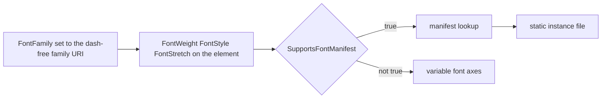

<sub>[CodeBrix](../../README.md) › [Libraries](README.md) › CodeBrix.Platform.Fonts.OpenSans</sub>

# CodeBrix.Platform.Fonts.OpenSans

**CodeBrix.Platform.Fonts.OpenSans ships the Open Sans font family as build-time content assets: the
variable font, a curated set of static instances, and a manifest that turns a weight, style and
stretch request into the right static file.** The package has effectively no managed code - its
assembly is metadata-only, and everything you consume is data addressed by URI. Use it from a
CodeBrix.Platform application, or as a plain content-files NuGet in any .NET 10 project that wants
the Open Sans font set.

| | |
| --- | --- |
| **Repository** | [ellisnet/CodeBrix.Platform.Fonts.OpenSans](https://github.com/ellisnet/CodeBrix.Platform.Fonts.OpenSans) |
| **Packages** | [`CodeBrix.Platform.Fonts.OpenSans.ApacheLicenseForever`](https://www.nuget.org/packages/CodeBrix.Platform.Fonts.OpenSans.ApacheLicenseForever) |
| **License** | `Apache-2.0 AND OFL-1.1`; see [License](#license) |
| **Requires** | .NET 10 or later; the package has no NuGet dependencies of its own |
| **Use it from** | Any .NET 10 application, or a CodeBrix.Platform application |
| **Platforms** | Platform-neutral - no native libraries, no OS restriction; the payload is font data |

## What it does

- Ships the Open Sans variable font and its static instances under
  `lib/net10.0/CodeBrix.Platform.Fonts.OpenSans/Fonts/`, each addressable as an `ms-appx:///` URI.
- Ships `OpenSans.ttf.manifest`, a JSON document that maps `font_style` / `font_weight` /
  `font_stretch` triples to the matching static font file, so a platform that cannot render variable
  fonts can still honor a weight, style and stretch request.
- Ships an MSBuild `.targets` file under `buildTransitive/net10.0/` that prunes the redundant static
  fonts at consumer-build time.
- Ships a `.uprimarker` marker file that CodeBrix.Platform build pipelines use to discover font asset
  packages.
- Covers Latin including Vietnamese, modern monotonic Greek, essentially the whole base Cyrillic
  block, and Hebrew - consonants, final forms and vowel points.

## When to use it

Reach for Open Sans when you want a humanist sans face for body text and headings across Western,
Central and Eastern European orthographies, Russian, Ukrainian, Belarusian, Bulgarian, Serbian,
Macedonian, and Hebrew. Among the family's text faces it is the one that carries Hebrew.

It ships no Armenian, Georgian, Arabic, Devanagari, Thai, CJK or emoji glyphs, and no companion font
families to supply them. If your application needs Armenian or Georgian, use
[CodeBrix.Platform.Fonts.Roboto](CodeBrix.Platform.Fonts.Roboto.md) or
[CodeBrix.Platform.Fonts.Merriweather](CodeBrix.Platform.Fonts.Merriweather.md) instead of, or in
addition to, this package - both bundle companion families for those scripts. It ships no polytonic
Greek either: the Greek Extended block is essentially empty here.

Four more limits are worth knowing before you plan a type scale:

- **No italic variable font.** Italic Open Sans is available only from the static instances.
- **No Thin (100), ExtraLight (200) or Black (900) static instances** - the variable font's weight
  axis starts at 300 and stops at 800.
- **TrueType only.** No `.otf`, `.woff` or `.woff2` files.
- **It does not make itself the default font.** You set `DefaultTextFontFamily` or a `FontFamily`
  yourself; nothing here turns itself on.

It also exposes no managed API - no types, no methods, no font loader, no stream accessors - and it
does not resolve `ms-appx:///` URIs. That is CodeBrix.Platform's job.

## Getting started

```bash
dotnet add package CodeBrix.Platform.Fonts.OpenSans.ApacheLicenseForever
```

There are no namespaces to import and no `using` directives to add. The "namespace" a consumer
actually works in is the `ms-appx:///` URI space rooted at the assembly content-folder name:

```text
ms-appx:///CodeBrix.Platform.Fonts.OpenSans/Fonts/<FileName>.ttf
```

```text
ms-appx:///CodeBrix.Platform.Fonts.OpenSans/Fonts/OpenSans.ttf
ms-appx:///CodeBrix.Platform.Fonts.OpenSans/Fonts/OpenSans-Bold.ttf
ms-appx:///CodeBrix.Platform.Fonts.OpenSans/Fonts/OpenSans-Italic.ttf
ms-appx:///CodeBrix.Platform.Fonts.OpenSans/Fonts/OpenSans_Condensed-Regular.ttf
```

One element in Open Sans, using the dash-free family URI:

```xml
<TextBlock Text="Hello, world."
           FontFamily="ms-appx:///CodeBrix.Platform.Fonts.OpenSans/Fonts/OpenSans.ttf" />
```

That URI is the family, not a face. Everything else on this page is about how a face gets chosen from
it.

## Key concepts

### The URI space is the public API

Every `.ttf` in the package is addressable as
`ms-appx:///CodeBrix.Platform.Fonts.OpenSans/Fonts/<FileName>.ttf`, and the URI is valid anywhere
CodeBrix.Platform accepts a `FontFamily` value: the `FontFamily` property of `TextBlock`, `Run`,
`TextBox`, `Button` and other text-bearing controls; a `FontFamily` resource in a
`ResourceDictionary`; and `FeatureConfiguration.Font.DefaultTextFontFamily`.

The assembly and content-folder name is `CodeBrix.Platform.Fonts.OpenSans`, without the
`.ApacheLicenseForever` suffix. That suffix exists only on the NuGet package ID, to disambiguate
license variants across the CodeBrix family; there is no package named plain
`CodeBrix.Platform.Fonts.OpenSans`. Use the un-suffixed name in every URI; use the suffixed name only
in `dotnet add package` and in the `.targets` filename.

### The static-instance manifest

`OpenSans.ttf.manifest` sits beside `OpenSans.ttf` in the same `Fonts` folder and is discovered by
name - the font file path plus `.manifest`. It is a JSON **object** with a single `fonts` property
holding an array; it is not a bare JSON array. Each entry has exactly four properties:

```json
{
  "font_style":   "Normal",
  "font_weight":  600,
  "font_stretch": "SemiCondensed",
  "family_name":  "ms-appx:///CodeBrix.Platform.Fonts.OpenSans/Fonts/OpenSans_SemiCondensed-SemiBold.ttf"
}
```

The value sets are `"Normal" | "Italic"`, `300 | 400 | 500 | 600 | 700 | 800`, and
`"Normal" | "Condensed" | "SemiCondensed"`. Despite its name, `family_name` holds a URI, not a
typographic family name.

### How a face gets chosen

The three manifest keys are exactly the XAML text properties `FontStyle`, `FontWeight` and
`FontStretch`, using the same value names and the same numeric weight scale. That is the whole
selection mechanism: you set those properties on the element, CodeBrix.Platform looks the triple up in
the manifest of the font family you named, and renders the static instance the matching entry points
at. You never name a static file yourself unless you want to pin one exactly.



Weight words map to the manifest's numeric weights as Light 300, Normal 400, Medium 500, SemiBold
600, Bold 700, ExtraBold 800. Only those six numeric weights exist in the manifest; a request for a
weight outside that set has no exact entry and is resolved by the platform's nearest-match rule
rather than by this package. Coverage of the triple space is complete and rectangular - every
combination of the two styles, six weights and three stretches has an entry, one per static `.ttf`.

### The filename grammar

Two rules and one exception, and every URI in the package follows them.

| Rule | Example |
| --- | --- |
| The family URI is the dash-free file | `OpenSans.ttf` |
| Stretch takes an underscore before it, weight a dash | `OpenSans_SemiCondensed-Bold.ttf` |
| The Regular italic drops the weight word | `OpenSans-Italic.ttf` |

Every other weight carries its weight word in the italic filename - `OpenSans-BoldItalic.ttf`, and so
on. Do not construct `OpenSans-RegularItalic.ttf`; it does not exist. The same drop applies to
`OpenSans_Condensed-Italic.ttf` and `OpenSans_SemiCondensed-Italic.ttf`.

### The build-time prune and `SupportsFontManifest`

`buildTransitive/net10.0/CodeBrix.Platform.Fonts.OpenSans.ApacheLicenseForever.targets` is
auto-imported into consumer builds by NuGet convention - its on-disk filename matches the package ID,
per NU5129. It declares one target:

```xml
<Target Name="CodeBrixRemoveUnusedOpenSans"
        AfterTargets="_CodeBrixAddLibraryAssets">
```

When the MSBuild property `SupportsFontManifest` is not `'true'`, the target removes every
dash-bearing font filename - that is, all of the static instances - from the asset item list, leaving
only the variable `OpenSans.ttf` in the application output. When `SupportsFontManifest` is `'true'`,
nothing is removed and every file ships.

The variable `OpenSans.ttf` is never removed on any platform, so a direct
`ms-appx:///CodeBrix.Platform.Fonts.OpenSans/Fonts/OpenSans.ttf` reference always resolves. The prune
keys off the dash in the filename; that is why the variable font is named without one.

> [!IMPORTANT]
> Consumers do not set `SupportsFontManifest` themselves - the CodeBrix.Platform head being built
> sets it. Treat it as an input you read, not one you write.

### What ships

| Kind | Files | Pruned |
| --- | --- | --- |
| Variable font | `OpenSans.ttf` | Never |
| Static instances, Normal stretch | `OpenSans-<Weight>[Italic].ttf` | When `SupportsFontManifest` is not `'true'` |
| Static instances, Condensed | `OpenSans_Condensed-<Weight>[Italic].ttf` | When `SupportsFontManifest` is not `'true'` |
| Static instances, SemiCondensed | `OpenSans_SemiCondensed-<Weight>[Italic].ttf` | When `SupportsFontManifest` is not `'true'` |
| Manifest | `OpenSans.ttf.manifest` | Never |

The variable font carries two variation axes, read from the font's own `fvar` table: `wght` 300..800,
default 400, and `wdth` 75..100, default 100, where 100 is Normal and 75 is Condensed. There is no
italic or slant axis. Named instances exist for Light, Regular, SemiBold, Bold and ExtraBold in both
Normal and Condensed; Medium (500) and the SemiCondensed width are reachable as continuous axis
positions rather than named instances.

The static set is six weights - Light 300, Regular 400, Medium 500, SemiBold 600, Bold 700,
ExtraBold 800 - in two styles and three stretches. This package has exactly one manifest; the
companion-family manifests that sibling packages ship do not exist here.

### Script and codepoint coverage

Coverage is derived by parsing the `cmap` table of the shipped font files, and the variable font and
the static instances carry the same character set.

| Script | What is covered |
| --- | --- |
| Latin | Complete for Western, Central and Eastern European orthographies, plus Vietnamese |
| Greek | Modern monotonic Greek |
| Cyrillic | Essentially the whole base block - Russian, Ukrainian, Belarusian, Bulgarian, Serbian, Macedonian |
| Hebrew | Consonants, final forms and vowel points |

These blocks are deliberately absent, and text in them will not render from this package at all:
Armenian (`U+0530`-`U+058F`), Georgian (`U+10A0`-`U+10FF`, plus Georgian Supplement at `U+2D00` and
Georgian Extended at `U+1C90`), Arabic, Devanagari, Thai, Arrows (`U+2190`-`U+21FF`), and emoji and
pictographs from `U+1F300` upward.

### Missing glyphs are invisible here

The `.notdef` glyph - glyph 0 - of these fonts is empty, zero-length in the `glyf` table. An
unsupported codepoint therefore renders as a blank gap, not as a tofu box.

> [!WARNING]
> Plan for silent gaps rather than visible boxes when you audit coverage, and never rely on a system
> font to fill them in: CodeBrix.Platform does not fall back to system fonts.

## Examples

Weight, style and stretch chosen through the manifest. The comment on each element names the file the
triple resolves to.

```xml
<StackPanel>

    <!-- Regular 400, upright, Normal stretch: the manifest entry for
         {Normal, 400, Normal} resolves to OpenSans-Regular.ttf -->
    <TextBlock Text="Hello, world."
               FontFamily="ms-appx:///CodeBrix.Platform.Fonts.OpenSans/Fonts/OpenSans.ttf" />

    <!-- Bold italic: {Italic, 700, Normal} -> OpenSans-BoldItalic.ttf -->
    <TextBlock Text="Bold italic sample"
               FontFamily="ms-appx:///CodeBrix.Platform.Fonts.OpenSans/Fonts/OpenSans.ttf"
               FontWeight="Bold"
               FontStyle="Italic" />

    <!-- SemiCondensed SemiBold: {Normal, 600, SemiCondensed}
         -> OpenSans_SemiCondensed-SemiBold.ttf -->
    <TextBlock Text="Narrow heading"
               FontFamily="ms-appx:///CodeBrix.Platform.Fonts.OpenSans/Fonts/OpenSans.ttf"
               FontWeight="SemiBold"
               FontStretch="SemiCondensed" />

    <!-- Mixed runs inside one paragraph -->
    <TextBlock FontFamily="ms-appx:///CodeBrix.Platform.Fonts.OpenSans/Fonts/OpenSans.ttf">
        <Run Text="Light " FontWeight="Light" />
        <Run Text="Medium " FontWeight="Medium" />
        <Run Text="ExtraBold " FontWeight="ExtraBold" />
        <Run Text="Condensed italic"
             FontStyle="Italic"
             FontStretch="Condensed" />
    </TextBlock>

</StackPanel>
```

Every element above names the same family URI. That is the form to prefer, because it is the only one
that behaves the same on every head.

Pinning one exact static file, when you want a specific face and nothing else:

```xml
<TextBlock Text="Pinned face"
           FontFamily="ms-appx:///CodeBrix.Platform.Fonts.OpenSans/Fonts/OpenSans_Condensed-ExtraBoldItalic.ttf" />
```

This is the only form that survives on a head where the statics are not pruned; on a head that prunes
them, a pinned static file is not deployed. Prefer the property-driven form unless you know the head
keeps statics.

Declaring the family once in `App.xaml`, under the family's conventional resource key:

```xml
<Application
    x:Class="MyApp.App"
    xmlns="http://schemas.microsoft.com/winfx/2006/xaml/presentation"
    xmlns:x="http://schemas.microsoft.com/winfx/2006/xaml">
    <Application.Resources>
        <ResourceDictionary>

            <FontFamily x:Key="OpenSansFont">ms-appx:///CodeBrix.Platform.Fonts.OpenSans/Fonts/OpenSans.ttf</FontFamily>

        </ResourceDictionary>
    </Application.Resources>
</Application>
```

```xml
<TextBlock Text="Hello, world."
           FontFamily="{StaticResource OpenSansFont}"
           FontWeight="SemiBold" />
```

Binding with `{StaticResource}` at the use sites keeps a later font swap to one line, and avoids
repeated string-to-`FontFamily` conversions.

Making Open Sans the application-wide default text font. Set this before the first UI element is
created, in the application entry point, ahead of building the host:

```csharp
global::CodeBrix.Platform.UI.FeatureConfiguration.Font.DefaultTextFontFamily =
    "ms-appx:///CodeBrix.Platform.Fonts.OpenSans/Fonts/OpenSans.ttf";
```

The minimum project file that consumes the package:

```xml
<Project Sdk="Microsoft.NET.Sdk">

  <PropertyGroup>
    <TargetFramework>net10.0</TargetFramework>
  </PropertyGroup>

  <ItemGroup>
    <PackageReference Include="CodeBrix.Platform.Fonts.OpenSans.ApacheLicenseForever" />
  </ItemGroup>

</Project>
```

## Using it in a CodeBrix.Platform application

There is no code to write: adding the `PackageReference` is the whole integration. With that
reference in place, the `.ttf` files and the `.ttf.manifest` are contributed to the application's
asset set, the `buildTransitive` `.targets` file is auto-imported and prunes the static fonts on
heads that do not support the manifest, and every
`ms-appx:///CodeBrix.Platform.Fonts.OpenSans/Fonts/...` URI in your XAML resolves.

Then either set `DefaultTextFontFamily`, or declare the `OpenSansFont` resource and use
`{StaticResource OpenSansFont}` at the use sites.

Head-specific behavior comes down to one property. The head sets `SupportsFontManifest`; on a head
where it is not `'true'` the static files are removed from the output, which is a deliberate size win
of roughly the whole static set. Do not defeat it by hard-referencing static files in code that also
has to run on those heads.

> [!IMPORTANT]
> Do not add any `<Content>`, `<None>` or `<EmbeddedResource>` item for the fonts yourself, and do
> not copy the `.ttf` files into your project. The package contributes them; a hand-rolled copy will
> duplicate assets and can shadow the manifest lookup.

Outside a CodeBrix.Platform host the URIs resolve to nothing, and the application must read the
`.ttf` files out of the restored package folder itself. The package ID is lower-cased in that path,
and the fonts sit under `lib/net10.0/CodeBrix.Platform.Fonts.OpenSans/Fonts/`.

## Pitfalls

- **Never append `#FamilyName` to a font URI.** CodeBrix.Platform strips the fragment during
  resolution, so it never helps - and on the value assigned to
  `FeatureConfiguration.Font.DefaultTextFontFamily` it silently disables the startup manifest
  preload, because the `.manifest` suffix the preload appends lands inside the fragment and is
  dropped by `Uri.PathAndQuery`. The symptom is subtle: text still renders, but weight, style and
  stretch requests stop resolving to the right static instance.
- **There is no italic axis in the variable font.** On a head where the statics are pruned,
  `FontStyle="Italic"` has no italic face to resolve to and the platform will synthesize or ignore
  it. If real italics matter on such a head, this package cannot supply them.
- **`OpenSans-RegularItalic.ttf` does not exist.** The Regular italic is `OpenSans-Italic.ttf`, and
  likewise `OpenSans_Condensed-Italic.ttf` and `OpenSans_SemiCondensed-Italic.ttf`. Constructing
  filenames by concatenating weight and `Italic` breaks for exactly this one weight.
- **Stretch and weight use different separators.** An underscore before the stretch, a dash before
  the weight: `OpenSans_SemiCondensed-Bold.ttf`. Both `OpenSans-SemiCondensed-Bold.ttf` and
  `OpenSans_SemiCondensed_Bold.ttf` are wrong.
- **The manifest is a JSON object with a `fonts` array, not a bare JSON array.** Code that calls
  `JsonDocument.Parse(json).RootElement.EnumerateArray()` on it throws; you must read the `fonts`
  property first.
- **`family_name` holds a URI**, not a typographic family name. Do not feed it to an API that expects
  `Open Sans`.
- **Armenian and Georgian will not render from this package**, and it ships no companions to supply
  them. Because `.notdef` is an empty glyph, the failure is invisible - blank space, not boxes.
- **`ms-appx:///` URIs are resolved by the CodeBrix.Platform runtime, not by .NET.** In a plain
  .NET 10 console or test application that merely references this package, those URIs resolve to
  nothing.
- **Do not rename the `.ttf` files.** Open Sans carries the Reserved Font Name `Open Sans` under SIL
  OFL 1.1 condition 3: a modified version may not be distributed under that name. Renaming files in a
  way that implies a derivative work bearing the same display name is a license problem, not only a
  broken URI.
- **Only the `ms-appx:///CodeBrix.Platform.Fonts.OpenSans/Fonts/` root resolves.** No other content
  folder name reaches these files.

Four habits keep the font cost down: prefer one family URI plus `FontWeight` / `FontStyle` /
`FontStretch` over a different file URI per face, because every distinct font URI is a separate font
resource to load and cache; declare the family URI once as an `App.xaml` resource; set
`DefaultTextFontFamily` rather than `FontFamily` on every element, which also lets the startup
font-manifest preload warm the manifest once; and let the head prune. On a manifest-capable head the
variable font covers weights 300-800 continuously, so intermediate weights cost no extra files.

## Samples and tools in the repository

The repository contains no samples, demo applications, tools, scripts or optional test-data sets.
Everything in it is either packaged content, packaging metadata, documentation, or the test project.
To see the font in use, reference the package from a CodeBrix.Platform application and follow the
examples above.

| Name | What it demonstrates | Where |
| --- | --- | --- |
| Test project | Asset- and metadata-inspection suite; doubles as the worked example of how to read `OpenSans.ttf.manifest` correctly | [`tests/CodeBrix.Platform.Fonts.OpenSans.Tests`](https://github.com/ellisnet/CodeBrix.Platform.Fonts.OpenSans/tree/main/tests/CodeBrix.Platform.Fonts.OpenSans.Tests) |

It links the packaged font files, the manifest, the `.uprimarker` and the `buildTransitive`
`.targets` file into its own output under `TestAssets/`, then asserts the file inventory, the
manifest shape and the `.targets` contract. Four classes are worth reading:

- `ContentManifestTests.cs` - how to read the manifest correctly: parse the document, take the
  `fonts` property, enumerate the array, and project each entry's `font_style` / `font_weight` /
  `font_stretch` / `family_name`. Copy this reader if you need to consume the manifest yourself.
- `ContentFilePresenceTests.cs` - the file inventory and the exact static filename grammar,
  including the Regular-italic naming quirk.
- `TargetsFileTests.cs` - the `.targets` contract: target name, the `_CodeBrixAddLibraryAssets` hook,
  the `SupportsFontManifest` condition, and the assertion that the variable font is never removed.
- `AssemblyMetadataTests.cs` - that the assembly is named `CodeBrix.Platform.Fonts.OpenSans`, targets
  .NET 10, and exports no public types.

Run them from the repository root:

```bash
dotnet test CodeBrix.Platform.Fonts.OpenSans.slnx
```

There are no opt-in environment variables and no special preparation; the suite needs no network and
no display.

## Documentation and source

| Document | Where |
| --- | --- |
| Overview (README) | [README.md](https://github.com/ellisnet/CodeBrix.Platform.Fonts.OpenSans/blob/main/README.md) |
| Complete API guide (ships inside the package too) | [AGENT-README.txt](https://github.com/ellisnet/CodeBrix.Platform.Fonts.OpenSans/blob/main/AGENT-README.txt) |
| Map of every document in the repository | [README-INDEX.txt](https://github.com/ellisnet/CodeBrix.Platform.Fonts.OpenSans/blob/main/README-INDEX.txt) |
| Non-package content in the repository | [EXTRAS-README.txt](https://github.com/ellisnet/CodeBrix.Platform.Fonts.OpenSans/blob/main/EXTRAS-README.txt) |
| Tests (worked examples of the manifest and the asset contract) | [tests/CodeBrix.Platform.Fonts.OpenSans.Tests](https://github.com/ellisnet/CodeBrix.Platform.Fonts.OpenSans/tree/main/tests/CodeBrix.Platform.Fonts.OpenSans.Tests) |

## License

CodeBrix.Platform.Fonts.OpenSans declares the SPDX expression `Apache-2.0 AND OFL-1.1`, and the
Apache half is also named in the package ID
(`CodeBrix.Platform.Fonts.OpenSans.ApacheLicenseForever`). The wrapper assembly, the MSBuild
`.targets` file and the packaging metadata are Apache-2.0; the bundled Open Sans `.ttf` files are SIL
Open Font License 1.1. Both license texts ship inside the nupkg - the Apache terms through the SPDX
expression, and `OFL.txt` as a packaged file. The package sets `PackageRequireLicenseAcceptance`, so
a restore in an interactive tool asks you to accept the license.

Open Sans carries the Reserved Font Name `Open Sans` under SIL OFL 1.1 condition 3: a modified
version may not be distributed under that name. For the provenance and licensing of open source code
included in this library, see
[THIRD-PARTY-NOTICES.txt](https://github.com/ellisnet/CodeBrix.Platform.Fonts.OpenSans/blob/main/THIRD-PARTY-NOTICES.txt)
in the repository.

---

**Where to go next**

- [Views and styling](../platform/06-views-and-styling.md) - where fonts and text properties fit into
  a CodeBrix.Platform page
- [CodeBrix.Platform.Fonts.Roboto](CodeBrix.Platform.Fonts.Roboto.md) - the sans face that bundles
  Armenian and Georgian companions this one does not carry
- [CodeBrix.Platform.Fonts.Fluent](CodeBrix.Platform.Fonts.Fluent.md) - the icon font that supplies
  `SymbolIcon` and `FontIcon`
- [ellisnet/CodeBrix.Platform.Fonts.OpenSans on GitHub](https://github.com/ellisnet/CodeBrix.Platform.Fonts.OpenSans) - source and tests
