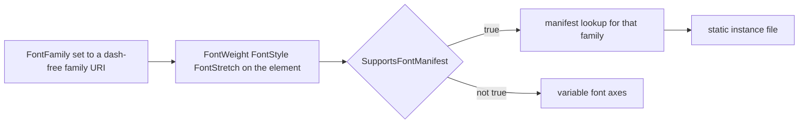

<sub>[CodeBrix](../../README.md) › [Libraries](README.md) › CodeBrix.Platform.Fonts.Roboto</sub>

# CodeBrix.Platform.Fonts.Roboto

**CodeBrix.Platform.Fonts.Roboto ships the Roboto font family as build-time content assets - the
variable font, a curated set of static instances, and three companion families that carry the scripts
Roboto itself does not.** Roboto covers Latin, Cyrillic and modern monotonic Greek; the bundled Noto
Sans, Noto Sans Armenian and Noto Sans Georgian families add polytonic Greek, Armenian and Georgian
in a matching sans design. Use it from a CodeBrix.Platform application, or as a plain content-files
NuGet in any .NET 10 project that wants the Roboto font set.

| | |
| --- | --- |
| **Repository** | [ellisnet/CodeBrix.Platform.Fonts.Roboto](https://github.com/ellisnet/CodeBrix.Platform.Fonts.Roboto) |
| **Packages** | [`CodeBrix.Platform.Fonts.Roboto.OflLicenseForever`](https://www.nuget.org/packages/CodeBrix.Platform.Fonts.Roboto.OflLicenseForever) |
| **License** | `OFL-1.1`; see [License](#license) |
| **Requires** | .NET 10 or later; the package has no NuGet dependencies of its own |
| **Use it from** | Any .NET 10 application, or a CodeBrix.Platform application |
| **Platforms** | Platform-neutral - no native libraries, no OS restriction; the payload is font data |

## What it does

- Ships the Roboto variable font and its static instances under
  `lib/net10.0/CodeBrix.Platform.Fonts.Roboto/Fonts/`, each addressable as an `ms-appx:///` URI.
- Bundles three companion families that extend script coverage beyond what Roboto itself carries:
  Noto Sans for polytonic Greek plus a second Latin, Greek and Cyrillic set; Noto Sans Armenian; and
  Noto Sans Georgian. They ship **inside** this package - there is no companion package to reference.
- Ships four `.ttf.manifest` JSON documents, one per family, mapping `font_style` / `font_weight` /
  `font_stretch` triples to the matching static font file, so a platform that cannot render variable
  fonts can still honor a weight, style and stretch request.
- Ships an MSBuild `.targets` file under `buildTransitive/net10.0/` that prunes the redundant static
  fonts at consumer-build time, and is written so the four dash-free fonts always survive.
- Ships a `.uprimarker` marker file that CodeBrix.Platform build pipelines use to discover font asset
  packages.

## When to use it

Reach for Roboto when you want a neutral sans face for a UI and you need any of polytonic Greek,
Armenian or Georgian alongside the usual Latin and Cyrillic. It is the family's broadest sans in
script terms, and the companions arrive with it rather than as extra references.

It ships no Hebrew: Roboto has no Hebrew block and neither companion supplies one. The sibling
[CodeBrix.Platform.Fonts.OpenSans](CodeBrix.Platform.Fonts.OpenSans.md) does carry Hebrew. It ships
no monospace face either - that is
[CodeBrix.Platform.Fonts.RobotoMono](CodeBrix.Platform.Fonts.RobotoMono.md) - and no serif face; for
a serif with the same companion arrangement see
[CodeBrix.Platform.Fonts.Merriweather](CodeBrix.Platform.Fonts.Merriweather.md).

Also out of scope:

- **No Arabic, Devanagari, Thai, CJK, emoji or arrow glyphs.**
- **No condensed companion faces, and no italic Armenian or Georgian.** Those two are upright,
  Normal-stretch, six weights. Noto Sans does ship italics, so polytonic Greek is not subject to
  this.
- **No italic variable font for any family**, and no Thin, ExtraLight or Black static instances of
  Roboto.
- **TrueType only.** No `.otf`, `.woff` or `.woff2` files.
- **It does not make itself the default font.** You set `DefaultTextFontFamily` or a `FontFamily`
  yourself.

It exposes no managed API - no types, no methods, no font loader, no stream accessors - and it does
not resolve `ms-appx:///` URIs. That is CodeBrix.Platform's job.

## Getting started

```bash
dotnet add package CodeBrix.Platform.Fonts.Roboto.OflLicenseForever
```

There are no namespaces to import and no `using` directives to add. The URI space rooted at the
assembly content-folder name is what you work in:

```text
ms-appx:///CodeBrix.Platform.Fonts.Roboto/Fonts/<FileName>.ttf
```

```text
ms-appx:///CodeBrix.Platform.Fonts.Roboto/Fonts/Roboto.ttf
ms-appx:///CodeBrix.Platform.Fonts.Roboto/Fonts/Roboto-Bold.ttf
ms-appx:///CodeBrix.Platform.Fonts.Roboto/Fonts/Roboto_Condensed-Regular.ttf
ms-appx:///CodeBrix.Platform.Fonts.Roboto/Fonts/NotoSans.ttf
ms-appx:///CodeBrix.Platform.Fonts.Roboto/Fonts/NotoSansArmenian.ttf
ms-appx:///CodeBrix.Platform.Fonts.Roboto/Fonts/NotoSansGeorgian.ttf
```

One element in Roboto, using the dash-free family URI:

```xml
<TextBlock Text="Hello, world."
           FontFamily="ms-appx:///CodeBrix.Platform.Fonts.Roboto/Fonts/Roboto.ttf" />
```

That URI names the family, not a face. The rest of this page is about how a face - and, for the other
three scripts, a family - gets chosen.

## Key concepts

### The URI space is the public API

Every `.ttf` in the package is addressable as
`ms-appx:///CodeBrix.Platform.Fonts.Roboto/Fonts/<FileName>.ttf`, and the URI is valid anywhere
CodeBrix.Platform accepts a `FontFamily` value: the `FontFamily` property of `TextBlock`, `Run`,
`TextBox`, `Button` and other text-bearing controls; a `FontFamily` resource in a
`ResourceDictionary`; and `FeatureConfiguration.Font.DefaultTextFontFamily`.

The assembly and content-folder name is `CodeBrix.Platform.Fonts.Roboto`, without the
`.OflLicenseForever` suffix. The suffix is a CodeBrix family convention that records the license the
package will always be published under, and it exists only on the NuGet package ID; there is no
package named plain `CodeBrix.Platform.Fonts.Roboto`. Use the un-suffixed name in every URI; use the
suffixed name only in `dotnet add package` and in the `.targets` filename.

### Four families, four manifests

Each family has its own manifest, discovered by name - the font file path plus `.manifest` - sitting
beside its dash-free font in the same `Fonts` folder.

| Manifest | Covers | Styles | Stretches |
| --- | --- | --- | --- |
| `Roboto.ttf.manifest` | Latin, Cyrillic, monotonic Greek | Normal, Italic | Normal, Condensed, SemiCondensed |
| `NotoSans.ttf.manifest` | Polytonic Greek | Normal, Italic | Normal |
| `NotoSansArmenian.ttf.manifest` | Armenian | Normal | Normal |
| `NotoSansGeorgian.ttf.manifest` | Georgian | Normal | Normal |

Each file is a JSON **object** with a single `fonts` property holding an array; it is not a bare JSON
array. Each entry has exactly four properties:

```json
{
  "font_style":   "Italic",
  "font_weight":  700,
  "font_stretch": "Condensed",
  "family_name":  "ms-appx:///CodeBrix.Platform.Fonts.Roboto/Fonts/Roboto_Condensed-BoldItalic.ttf"
}
```

The value sets are `"Normal" | "Italic"`, `300 | 400 | 500 | 600 | 700 | 800`, and
`"Normal" | "Condensed" | "SemiCondensed"`. Despite its name, `family_name` holds a URI, not a
typographic family name.

Roboto's manifest is complete and rectangular - every combination of the two styles, six weights and
three stretches has an entry, one per static `.ttf`. The Noto Sans manifest carries six weights in
both styles at Normal stretch, so polytonic Greek honors `FontStyle="Italic"` with a real italic
face. The Armenian and Georgian manifests carry six weights, upright only, Normal stretch only: there
is no italic and no condensed face for either, so `FontStyle="Italic"` on Armenian or Georgian text
has no italic entry to resolve to.

### How a face gets chosen

The three manifest keys are exactly the XAML text properties `FontStyle`, `FontWeight` and
`FontStretch`, using the same value names and the same numeric weight scale. Set them on the element,
name the dash-free family URI, and CodeBrix.Platform does the lookup.



Weight words map to the manifest's numeric weights as Light 300, Normal 400, Medium 500, SemiBold
600, Bold 700, ExtraBold 800. Only those six numeric weights exist in the manifests. Thin (100),
ExtraLight (200) and Black (900) have no manifest entry and no static file; they exist only as
positions on the variable font's axis.

### The filename grammar

| Rule | Example |
| --- | --- |
| The family URI is the dash-free file | `Roboto.ttf`, `NotoSansGeorgian.ttf` |
| Stretch takes an underscore before it, weight a dash | `Roboto_SemiCondensed-Bold.ttf` |
| The Regular italic drops the weight word | `Roboto-Italic.ttf` |

Every other weight carries its weight word in the italic filename - `Roboto-BoldItalic.ttf`, and so
on. Do not construct `Roboto-RegularItalic.ttf`; it does not exist. The companions use only the dash
form - `NotoSansGeorgian-Bold.ttf`, `NotoSans-BoldItalic.ttf` - because they have no stretch
variants.

### The build-time prune and `SupportsFontManifest`

`buildTransitive/net10.0/CodeBrix.Platform.Fonts.Roboto.OflLicenseForever.targets` is auto-imported
into consumer builds by NuGet convention - its on-disk filename matches the package ID, per NU5129.
It declares one target:

```xml
<Target Name="CodeBrixRemoveUnusedRoboto"
        AfterTargets="_CodeBrixAddLibraryAssets">
```

When the MSBuild property `SupportsFontManifest` is not `'true'`, the target removes every
dash-bearing font filename - all of the static instances across the four families - from the asset
item list, leaving only `Roboto.ttf`, `NotoSans.ttf`, `NotoSansArmenian.ttf` and
`NotoSansGeorgian.ttf` in the application output. When `SupportsFontManifest` is `'true'`, nothing is
removed and every file ships.

Those four variable fonts are never removed on any platform. The prune keys off the dash in the
filename; that is why all four are named without one. For the companions this matters more than for
Roboto: they are the only source of polytonic Greek, Armenian and Georgian in the package, so pruning
them would silently drop three scripts rather than merely degrade weights.

> [!IMPORTANT]
> Consumers do not set `SupportsFontManifest` themselves - the CodeBrix.Platform head being built
> sets it. Treat it as an input you read, not one you write.

### What ships

| Family | Dash-free file | Static instances |
| --- | --- | --- |
| Roboto | `Roboto.ttf` | `Roboto-<Weight>[Italic].ttf`, `Roboto_Condensed-<Weight>[Italic].ttf`, `Roboto_SemiCondensed-<Weight>[Italic].ttf` |
| Noto Sans | `NotoSans.ttf` | `NotoSans-<Weight>[Italic].ttf` |
| Noto Sans Armenian | `NotoSansArmenian.ttf` | `NotoSansArmenian-<Weight>.ttf` |
| Noto Sans Georgian | `NotoSansGeorgian.ttf` | `NotoSansGeorgian-<Weight>.ttf` |

`Roboto.ttf` carries two variation axes, read from the font's own `fvar` table: `wght` 100..900,
default 400, and `wdth` 75..100, default 100, where 100 is Normal and 75 is Condensed. There is no
italic or slant axis, so italic Roboto is available only from the static instances. Thin, ExtraLight
and Black static instances are not bundled, which keeps the static set aligned with the sibling font
packages; those weights remain reachable through the variable font's 100..900 axis on a head that
renders variable fonts.

All three companion variable fonts declare `wght` 100..900, default 400, and `wdth` 62.5..100,
default 100. None has an italic or slant axis. Noto Sans ships six weights upright and italic, so
italic polytonic Greek is a real italic rather than a synthesized slant. The Armenian and Georgian
static sets are six weights, Normal stretch, upright only, because no italic face exists for either
family - italic text in those two scripts renders upright.

### Script coverage, and which family supplies it

| Script | Where it comes from |
| --- | --- |
| Latin, including Vietnamese | Roboto, complete for Western, Central and Eastern European orthographies |
| Cyrillic | Roboto, essentially the whole base block |
| Greek, monotonic | Roboto |
| Greek, polytonic | The Noto Sans companion - the whole Greek Extended block |
| Armenian | The Noto Sans Armenian companion |
| Georgian | The Noto Sans Georgian companion, including the Mkhedruli, Asomtavruli, Nuskhuri and Mtavruli forms |

The Noto Sans companion is complete for polytonic Greek, and it also carries all four polytonic
combining marks Roboto lacks - `U+0313` psili, `U+0314` dasia, `U+0342` perispomeni and `U+0345`
ypogegrammeni - so decomposed as well as precomposed polytonic text renders. It carries no Armenian
and only one Georgian codepoint (`U+10FB`), so it never shadows the two script companions. The
Armenian and Georgian companions each carry a Latin subset for mixed-script runs, and no Cyrillic and
no Greek.

Absent from the whole package: Hebrew (`U+0590`-`U+05FF`), Arabic, Devanagari, Thai, Arrows, emoji
and pictographs.

### Missing glyphs are visible here

The `.notdef` glyph - glyph 0 - of Roboto and of all three companions is a drawn glyph, not an empty
one. An unsupported codepoint therefore renders as a visible box, "tofu", which makes coverage gaps
obvious on screen.

> [!WARNING]
> Never rely on a system font to fill a gap: CodeBrix.Platform does not fall back to system fonts.

## Examples

Weight, style and stretch chosen through the manifest. The comment on each element names the file the
triple resolves to.

```xml
<StackPanel>

    <!-- Regular 400, upright, Normal stretch: the manifest entry for
         {Normal, 400, Normal} resolves to Roboto-Regular.ttf -->
    <TextBlock Text="Hello, world."
               FontFamily="ms-appx:///CodeBrix.Platform.Fonts.Roboto/Fonts/Roboto.ttf" />

    <!-- Bold italic: {Italic, 700, Normal} -> Roboto-BoldItalic.ttf -->
    <TextBlock Text="Bold italic sample"
               FontFamily="ms-appx:///CodeBrix.Platform.Fonts.Roboto/Fonts/Roboto.ttf"
               FontWeight="Bold"
               FontStyle="Italic" />

    <!-- Condensed SemiBold: {Normal, 600, Condensed}
         -> Roboto_Condensed-SemiBold.ttf -->
    <TextBlock Text="Narrow heading"
               FontFamily="ms-appx:///CodeBrix.Platform.Fonts.Roboto/Fonts/Roboto.ttf"
               FontWeight="SemiBold"
               FontStretch="Condensed" />

    <!-- Mixed runs inside one paragraph -->
    <TextBlock FontFamily="ms-appx:///CodeBrix.Platform.Fonts.Roboto/Fonts/Roboto.ttf">
        <Run Text="Light " FontWeight="Light" />
        <Run Text="Medium " FontWeight="Medium" />
        <Run Text="ExtraBold " FontWeight="ExtraBold" />
        <Run Text="SemiCondensed italic"
             FontStyle="Italic"
             FontStretch="SemiCondensed" />
    </TextBlock>

</StackPanel>
```

Every element names the same family URI. That is the form to prefer, because it is the only one that
behaves the same on every head.

Polytonic Greek, Armenian and Georgian, naming the companion family directly. Naming the companion is
not a tuning detail here - Roboto has no glyph for any polytonic Greek codepoint, so this is the
difference between text and a row of tofu boxes.

```xml
<StackPanel>

    <TextBlock Text="μῆνιν ἄειδε θεὰ Πηληϊάδεω Ἀχιλῆος"
               FontFamily="ms-appx:///CodeBrix.Platform.Fonts.Roboto/Fonts/NotoSans.ttf" />

    <!-- Noto Sans is the one companion with real italics:
         {Italic, 400, Normal} -> NotoSans-Italic.ttf -->
    <TextBlock Text="ἔπεα πτερόεντα"
               FontFamily="ms-appx:///CodeBrix.Platform.Fonts.Roboto/Fonts/NotoSans.ttf"
               FontStyle="Italic" />

    <!-- Armenian, SemiBold: the companion manifest entry
         {Normal, 600, Normal} -> NotoSansArmenian-SemiBold.ttf -->
    <TextBlock Text="Armenian heading"
               FontFamily="ms-appx:///CodeBrix.Platform.Fonts.Roboto/Fonts/NotoSansArmenian.ttf"
               FontWeight="SemiBold" />

    <!-- Georgian, Regular -->
    <TextBlock Text="Georgian body text"
               FontFamily="ms-appx:///CodeBrix.Platform.Fonts.Roboto/Fonts/NotoSansGeorgian.ttf" />

</StackPanel>
```

Do not set `FontStyle="Italic"`, or a `FontStretch` other than `Normal`, on the Armenian and Georgian
elements: those two manifests have six upright Normal-stretch entries each and nothing else. Noto
Sans is the exception - it has a real italic for every weight, but still no stretch other than
`Normal`.

Declaring the families once in `App.xaml`. The primary key follows the family convention; the three
companion key names are your choice.

```xml
<Application
    x:Class="MyApp.App"
    xmlns="http://schemas.microsoft.com/winfx/2006/xaml/presentation"
    xmlns:x="http://schemas.microsoft.com/winfx/2006/xaml">
    <Application.Resources>
        <ResourceDictionary>

            <FontFamily x:Key="RobotoFont">ms-appx:///CodeBrix.Platform.Fonts.Roboto/Fonts/Roboto.ttf</FontFamily>

            <FontFamily x:Key="RobotoGreekFont">ms-appx:///CodeBrix.Platform.Fonts.Roboto/Fonts/NotoSans.ttf</FontFamily>
            <FontFamily x:Key="RobotoArmenianFont">ms-appx:///CodeBrix.Platform.Fonts.Roboto/Fonts/NotoSansArmenian.ttf</FontFamily>
            <FontFamily x:Key="RobotoGeorgianFont">ms-appx:///CodeBrix.Platform.Fonts.Roboto/Fonts/NotoSansGeorgian.ttf</FontFamily>

        </ResourceDictionary>
    </Application.Resources>
</Application>
```

```xml
<TextBlock Text="Hello, world."
           FontFamily="{StaticResource RobotoFont}"
           FontWeight="SemiBold" />
```

Making Roboto the application-wide default text font. Set this before the first UI element is
created, in the application entry point, ahead of building the host:

```csharp
global::CodeBrix.Platform.UI.FeatureConfiguration.Font.DefaultTextFontFamily =
    "ms-appx:///CodeBrix.Platform.Fonts.Roboto/Fonts/Roboto.ttf";
```

The minimum project file that consumes the package:

```xml
<Project Sdk="Microsoft.NET.Sdk">

  <PropertyGroup>
    <TargetFramework>net10.0</TargetFramework>
  </PropertyGroup>

  <ItemGroup>
    <PackageReference Include="CodeBrix.Platform.Fonts.Roboto.OflLicenseForever" />
  </ItemGroup>

</Project>
```

## Using it in a CodeBrix.Platform application

There is no code to write: adding the `PackageReference` is the whole integration. With that
reference in place, the `.ttf` files and the four `.ttf.manifest` files are contributed to the
application's asset set, the `buildTransitive` `.targets` file is auto-imported and prunes the static
fonts on heads that do not support the manifest, and every
`ms-appx:///CodeBrix.Platform.Fonts.Roboto/Fonts/...` URI in your XAML resolves, companions included.

Then either set `DefaultTextFontFamily`, or declare the `RobotoFont` resource and use
`{StaticResource RobotoFont}` at the use sites.

**What you must do about the companions: nothing.** There is no extra package to reference, no
MSBuild property to set and no registration call. The three companion fonts are files in this same
package; referencing the package deploys them, and the prune is written specifically so they survive
on every head. If you want a guarantee that a specific block of polytonic Greek, Armenian or Georgian
text renders - rather than relying on per-codepoint fallback - set `FontFamily` explicitly to the
companion URI on that element, as in the second example above.

Head-specific behavior comes down to one property. The head sets `SupportsFontManifest`; on a head
where it is not `'true'` the static files are removed from the output, a deliberate size win of
roughly the whole static set. Do not defeat it by hard-referencing static files in code that also has
to run on those heads.

> [!IMPORTANT]
> Do not add any `<Content>`, `<None>` or `<EmbeddedResource>` item for the fonts yourself, and do
> not copy the `.ttf` files into your project. The package contributes them; a hand-rolled copy will
> duplicate assets and can shadow the manifest lookup.

Outside a CodeBrix.Platform host, read the `.ttf` files from the restored package folder. The package
ID is lower-cased in that path, and the fonts sit under
`lib/net10.0/CodeBrix.Platform.Fonts.Roboto/Fonts/`.

## Pitfalls

- **Never append `#FamilyName` to a font URI.** CodeBrix.Platform strips the fragment during
  resolution, so it never helps - and on the value assigned to
  `FeatureConfiguration.Font.DefaultTextFontFamily` it silently disables the startup manifest
  preload, because the `.manifest` suffix the preload appends lands inside the fragment and is
  dropped by `Uri.PathAndQuery`. The symptom is subtle: text still renders, but weight, style and
  stretch requests stop resolving to the right static instance.
- **There is no italic axis in any of the four variable fonts.** On a head where the statics are
  pruned, `FontStyle="Italic"` has no italic face to resolve to and the platform will synthesize or
  ignore it.
- **The Armenian and Georgian companions have no italic and no condensed faces at all, on any head.**
  Six upright weights in Normal stretch is their entire surface. Noto Sans is the exception: it has
  all six weights in both styles, so italic polytonic Greek is real. No companion has a condensed
  face.
- **`FontWeight="Thin"`, `"ExtraLight"` and `"Black"` have no static file and no manifest entry.**
  They work only where the variable font is rendered with its axis applied; on a static-manifest head
  they fall back to the platform's nearest-match rule, not to a matching face.
- **`Roboto-RegularItalic.ttf` does not exist.** The Regular italic is `Roboto-Italic.ttf`, and
  likewise `Roboto_Condensed-Italic.ttf` and `Roboto_SemiCondensed-Italic.ttf`.
- **Stretch and weight use different separators.** An underscore before the stretch, a dash before
  the weight: `Roboto_SemiCondensed-Bold.ttf`. Both `Roboto-SemiCondensed-Bold.ttf` and
  `Roboto_SemiCondensed_Bold.ttf` are wrong.
- **Each manifest is a JSON object with a `fonts` array, not a bare JSON array.** Code that calls
  `JsonDocument.Parse(json).RootElement.EnumerateArray()` on one throws; you must read the `fonts`
  property first. And there are four manifests here, one per family - code written against a sibling
  package that has one will miss three.
- **`family_name` holds a URI**, not a typographic family name. Do not feed it to an API that expects
  `Roboto`.
- **Hebrew is not covered by this package.** Roboto has no Hebrew block and neither companion
  supplies one; the sibling
  [CodeBrix.Platform.Fonts.OpenSans](CodeBrix.Platform.Fonts.OpenSans.md) does carry Hebrew.
- **`ms-appx:///` URIs are resolved by the CodeBrix.Platform runtime, not by .NET.** In a plain
  .NET 10 console or test application that merely references this package, those URIs resolve to
  nothing.
- **Do not alter the font bytes.** Roboto's copyright statement declares no Reserved Font Name, so
  SIL OFL 1.1 condition 3 does not restrict the display name - but the binaries ship unmodified and
  must stay that way. The same is true of all three companions.

Five habits keep the font cost down: prefer one family URI plus `FontWeight` / `FontStyle` /
`FontStretch` over a different file URI per face; declare the family URI once as an `App.xaml`
resource and bind with `{StaticResource}`; set `DefaultTextFontFamily` rather than `FontFamily` on
every element, which also lets the startup font-manifest preload warm the manifest once; name a
companion family directly on Armenian and Georgian text, which avoids per-codepoint fallback work at
layout time on top of being more predictable; and remember that the variable font covers weights
100-900 continuously, so on a manifest-capable head you can request Thin, ExtraLight, Black and every
intermediate weight without shipping more files.

## Samples and tools in the repository

The repository contains no samples, demo applications, tools, scripts or optional test-data sets.
Everything in it is either packaged content, packaging metadata, documentation, or the test project.
To see the fonts in use, reference the package from a CodeBrix.Platform application and follow the
examples above, including the companion families.

| Name | What it demonstrates | Where |
| --- | --- | --- |
| Test project | Asset, JSON and metadata inspection; doubles as the worked example of how to read a `.ttf.manifest` correctly | [`tests/CodeBrix.Platform.Fonts.Roboto.Tests`](https://github.com/ellisnet/CodeBrix.Platform.Fonts.Roboto/tree/main/tests/CodeBrix.Platform.Fonts.Roboto.Tests) |

It links the packaged font files, the four manifests, the `.uprimarker` and the `buildTransitive`
`.targets` file into its own output under `TestAssets/`, then asserts the file inventory, the
manifest shapes and the `.targets` contract. The classes worth reading:

- `ContentManifestTests.cs` - how to read a manifest correctly: parse the document, take the `fonts`
  property, enumerate the array, and project each entry's `font_style` / `font_weight` /
  `font_stretch` / `family_name`. Also asserts the six weights, that the Noto Sans manifest carries
  both styles, and that the Armenian and Georgian manifests are upright-only.
- `ContentFilePresenceTests.cs` - the file inventory and the exact static filename grammar.
- `TargetsFileTests.cs` - the `.targets` contract: target name, the `_CodeBrixAddLibraryAssets` hook,
  the `SupportsFontManifest` condition, and the assertion that none of the four variable fonts can
  ever be removed.
- `AssemblyMetadataTests.cs` - that the assembly is named `CodeBrix.Platform.Fonts.Roboto`, targets
  .NET 10, and exports no public types.

Run them from the repository root:

```bash
dotnet test CodeBrix.Platform.Fonts.Roboto.slnx
```

There are no opt-in environment variables and no special preparation; the suite needs no network and
no display.

## Documentation and source

| Document | Where |
| --- | --- |
| Overview (README) | [README.md](https://github.com/ellisnet/CodeBrix.Platform.Fonts.Roboto/blob/main/README.md) |
| Complete API guide (ships inside the package too) | [AGENT-README.txt](https://github.com/ellisnet/CodeBrix.Platform.Fonts.Roboto/blob/main/AGENT-README.txt) |
| Map of every document in the repository | [README-INDEX.txt](https://github.com/ellisnet/CodeBrix.Platform.Fonts.Roboto/blob/main/README-INDEX.txt) |
| Non-package content in the repository | [EXTRAS-README.txt](https://github.com/ellisnet/CodeBrix.Platform.Fonts.Roboto/blob/main/EXTRAS-README.txt) |
| Tests (worked examples of the manifests and the asset contract) | [tests/CodeBrix.Platform.Fonts.Roboto.Tests](https://github.com/ellisnet/CodeBrix.Platform.Fonts.Roboto/tree/main/tests/CodeBrix.Platform.Fonts.Roboto.Tests) |

## License

CodeBrix.Platform.Fonts.Roboto declares the SPDX expression `OFL-1.1`, the SIL Open Font License 1.1,
and the license is also named in the package ID (`CodeBrix.Platform.Fonts.Roboto.OflLicenseForever`).
The whole package is under it - the wrapper assembly, the MSBuild `.targets` file and the packaging
metadata as well as the bundled Roboto and Noto Sans font files. `OFL.txt`, the full license text,
and `THIRD-PARTY-NOTICES.txt` ship inside the nupkg. The package sets
`PackageRequireLicenseAcceptance`, so a restore in an interactive tool asks you to accept the
license.

Roboto's copyright statement declares no Reserved Font Name, so SIL OFL 1.1 condition 3 does not
restrict the display name; the same is true of all three companion families. The font binaries ship
unmodified and must stay that way. For the provenance and licensing of open source code included in
this library, see
[THIRD-PARTY-NOTICES.txt](https://github.com/ellisnet/CodeBrix.Platform.Fonts.Roboto/blob/main/THIRD-PARTY-NOTICES.txt)
in the repository.

---

**Where to go next**

- [Views and styling](../platform/06-views-and-styling.md) - where fonts and text properties fit into
  a CodeBrix.Platform page
- [CodeBrix.Platform.Fonts.RobotoMono](CodeBrix.Platform.Fonts.RobotoMono.md) - the monospace
  counterpart, with its own companion families
- [CodeBrix.Platform.Fonts.OpenSans](CodeBrix.Platform.Fonts.OpenSans.md) - the sibling sans that
  carries Hebrew
- [ellisnet/CodeBrix.Platform.Fonts.Roboto on GitHub](https://github.com/ellisnet/CodeBrix.Platform.Fonts.Roboto) - source and tests
