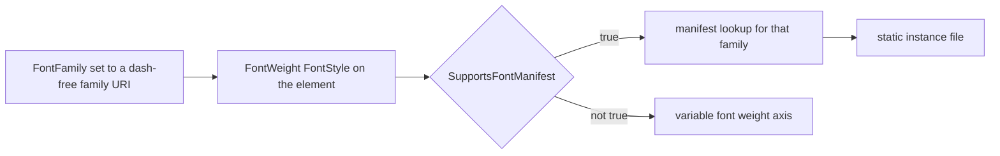

<sub>[CodeBrix](../../README.md) › [Libraries](README.md) › CodeBrix.Platform.Fonts.RobotoMono</sub>

# CodeBrix.Platform.Fonts.RobotoMono

**CodeBrix.Platform.Fonts.RobotoMono is a font asset package: the Roboto Mono monospace family plus
three companion families, packaged as build-time content for CodeBrix.Platform applications.** Roboto
Mono covers Latin, modern Greek and Cyrillic; the bundled Noto Sans Mono, Iosevka and Noto Sans
Georgian families add polytonic Greek, Armenian and Georgian. Consumers reference the fonts by URI,
never by C# type, and the package is equally usable as a plain content-files NuGet in any .NET 10
project that wants the font bytes.

| | |
| --- | --- |
| **Repository** | [ellisnet/CodeBrix.Platform.Fonts.RobotoMono](https://github.com/ellisnet/CodeBrix.Platform.Fonts.RobotoMono) |
| **Packages** | [`CodeBrix.Platform.Fonts.RobotoMono.OflLicenseForever`](https://www.nuget.org/packages/CodeBrix.Platform.Fonts.RobotoMono.OflLicenseForever) |
| **License** | `OFL-1.1`; see [License](#license) |
| **Requires** | .NET 10 or later; the package has no NuGet dependencies of its own |
| **Use it from** | Any .NET 10 application, or a CodeBrix.Platform application |
| **Platforms** | Platform-neutral - no native libraries, no OS restriction; the payload is font data |

## What it does

- Ships the Roboto Mono variable font and its static instances under
  `lib/net10.0/CodeBrix.Platform.Fonts.RobotoMono/Fonts/`, referenced through
  `ms-appx:///CodeBrix.Platform.Fonts.RobotoMono/Fonts/<file>.ttf`.
- Bundles three companion families for the scripts Roboto Mono lacks: **Noto Sans Mono** for
  polytonic Greek, plus a second full Latin, Greek and Cyrillic monospace set, at the same 0.6 em
  advance; **Iosevka** for the Armenian script in a monospace design, shipped in the Extended width
  grade so its advance matches; and **Noto Sans Georgian** for Georgian, which is proportional,
  because no monospace Georgian face exists under a suitable license.
- Ships four `.ttf.manifest` JSON files, one per family, mapping `{font_style, font_weight,
  font_stretch}` triples to the matching static font file's URI.
- Ships a `buildTransitive` MSBuild `.targets` file that prunes the redundant static fonts at
  consumer-build time on platforms that cannot use the manifest, while always keeping the four
  dash-free fonts.
- Ships a `.uprimarker` file that CodeBrix.Platform build pipelines use to discover font asset
  packages.

## When to use it

Reach for Roboto Mono when text has to sit on a character grid: code views, logs, terminals, tabular
figures, anything aligned by column. It is the monospace counterpart to
[CodeBrix.Platform.Fonts.Roboto](CodeBrix.Platform.Fonts.Roboto.md), and it carries its own
companions so that Greek, Armenian and Georgian have somewhere to come from.

Two shapes of limit matter before you commit to it.

- **Weights stop at Bold.** Roboto Mono publishes no ExtraBold (800) and no Black (900), so its
  weight axis ends at Bold (700). Do not plan a visual hierarchy that needs a heavier monospace
  weight from this package.
- **Georgian is proportional.** Any layout that assumes a fixed character advance breaks where
  Georgian text appears, even though the rest of the text is monospaced.

Also out of scope: no italic companion faces and no italic variable font for Roboto Mono; no Iosevka
variable font, and no `Iosevka-Regular.ttf`, because the dash-free file **is** that instance; no
width grades beyond the single Normal-stretch set - no Condensed, no Expanded, and no way to reach
Iosevka's other width grades; no CJK, Hebrew, Arabic, Indic or Thai coverage and no emoji; no
subsetting, instancing or font-manipulation tooling, and no way to strip a family you do not use; and
no .NET-generic font-loading helper - reading the `.ttf` bytes outside a CodeBrix.Platform host is
your code.

The package has no managed API. No types, no methods, no MSBuild properties for you to set; nothing
to call, subclass or configure in C#. It does not resolve `ms-appx:///` URIs - CodeBrix.Platform
does - it does not install fonts into the operating system, and it never becomes the application's
font without an explicit `FontFamily`, an `App.xaml` resource or a `DefaultTextFontFamily`
assignment.

## Getting started

```bash
dotnet add package CodeBrix.Platform.Fonts.RobotoMono.OflLicenseForever
```

The package declares no public managed types, so no `using` directive refers to it, and nothing in it
can be `new`ed, called or subclassed. Its namespace, from a consumer's point of view, is the content
URI root:

```text
ms-appx:///CodeBrix.Platform.Fonts.RobotoMono/Fonts/
```

One element in Roboto Mono:

```xml
<TextBlock Text="Hello, world."
           FontFamily="ms-appx:///CodeBrix.Platform.Fonts.RobotoMono/Fonts/RobotoMono.ttf" />
```

The one C# API that appears in the examples below - `CodeBrix.Platform.UI.FeatureConfiguration.Font` -
belongs to CodeBrix.Platform, not to this package. It is shown fully qualified, exactly as
CodeBrix.Platform applications write it, so no `using` is needed for it either.

## Key concepts

### The URI space is the public API

The assembly and content-folder name is `CodeBrix.Platform.Fonts.RobotoMono` - no
`.OflLicenseForever` suffix, which exists only on the package ID for license disambiguation across
the CodeBrix family. There is no package named plain `CodeBrix.Platform.Fonts.RobotoMono`. The URIs
are rooted at that assembly name, so it appears verbatim in every font URI.

### Why four families

Roboto Mono covers the Latin, modern Greek and Cyrillic scripts, but not polytonic Greek - the Greek
Extended block - nor Armenian or Georgian. Three companion families supply that coverage, and they
ship inside this same package.

| Family | Dash-free file | Supplies | Faces |
| --- | --- | --- | --- |
| Roboto Mono | `RobotoMono.ttf` | Latin, modern Greek, Cyrillic | Light 300 through Bold 700, upright and italic |
| Noto Sans Mono | `NotoSansMono.ttf` | Polytonic Greek, plus a second monospace Latin, Greek and Cyrillic set | Light 300 through ExtraBold 800, upright only |
| Iosevka | `Iosevka.ttf` | Armenian | Light 300 through ExtraBold 800, upright only |
| Noto Sans Georgian | `NotoSansGeorgian.ttf` | Georgian, proportional | Light 300 through ExtraBold 800, upright only |

The Roboto Mono static instances are `RobotoMono-{Light,Regular,Medium,SemiBold,Bold}.ttf` and their
`Italic` counterparts, all at Normal stretch. Thin (100) and ExtraLight (200) statics are not bundled;
those weights come from the variable font. There is no italic variable font in the package either -
italics come from the static instances. None of the three companions ships an italic face, so italic
text in the scripts they serve renders upright.

### The four manifests

Each family has a manifest beside its dash-free font, discovered by name - the font file path plus
`.manifest`. Consumers do not read these files themselves; the platform does, when it supports
manifest-based resolution. Their content is the contract for which weight and style combinations
exist.

```json
{
  "font_style":   "Normal",
  "font_weight":  600,
  "font_stretch": "Normal",
  "family_name":  "ms-appx:///CodeBrix.Platform.Fonts.RobotoMono/Fonts/RobotoMono-SemiBold.ttf"
}
```

Every entry in every manifest declares `font_stretch` `"Normal"`. What each manifest can and cannot
give:

- **Roboto Mono** - weights 300, 400, 500, 600, 700 in Normal and Italic. Nothing above 700 exists: a
  request for ExtraBold (800) or Black (900) cannot select a heavier face, so it resolves to Bold
  (700), the top of both the manifest and the variable font's weight axis. Weights below 300 have no
  static entry; they come from the variable font.
- **Noto Sans Mono** - weights 300-800, Normal style only. An italic request finds no `Italic` entry
  and renders upright.
- **Iosevka** - weights 300-800, Normal style only, and only when the manifest is available.
- **Noto Sans Georgian** - weights 300-800, Normal style only.
- **All four** - a Condensed or Expanded request has nothing to match.

### How weight and style select a file

There are two ways, and they behave differently.

1. **Reference the dash-free family URI** - `.../Fonts/RobotoMono.ttf` - and let the element's
   `FontWeight`, `FontStyle` and `FontStretch` drive the choice. On a platform that supports the font
   manifest, those three properties are matched against the triples in `RobotoMono.ttf.manifest` and
   the matching static file is used. On a platform without manifest support, the variable font itself
   covers the weight axis. This is the recommended form: it is the only one that works identically on
   every head.
2. **Reference a specific static file directly** - `.../Fonts/RobotoMono-Bold.ttf`. Simple, but the
   dash-bearing statics are pruned on platforms that do not support the manifest, so a direct static
   reference is not portable across heads.



### Why Iosevka has no variable font

Iosevka publishes static TrueType and webfont formats only; there is no variable-font `.ttf`. The
dash-free `Iosevka.ttf` - the slot the other three families fill with a variable font - is the static
Extended-Regular instance, and the manifest's weight-400 entry points at it.

The consequence is concrete: on a platform without manifest support, where the dash-bearing statics
are pruned from the application, Armenian text renders at Regular weight only, and Bold and Light
requests get whatever synthesis the platform applies. That is a documented degradation, not a defect
to route around.

### Monospace metrics

Roboto Mono and Noto Sans Mono both use a 0.6 em character advance. Iosevka's default width grade is
0.5 em, which would break column alignment wherever Armenian lands in a character grid, so the
package ships the Extended width grade - exactly 0.6 em - under plain `Iosevka` and
`Iosevka-{Weight}` names. The manifest declares those faces as the Normal stretch; they are the only
width grade in the package, so the Normal-stretch slot is theirs, and a request for a non-Normal
`FontStretch` finds no manifest entry.

The bundled Iosevka files are the unhinted builds. CodeBrix.Platform renders text through Skia, which
does not execute TrueType hinting instructions, so the hinted builds would change nothing in
rendering.

No monospace font with Georgian letter coverage is available under a suitable license, so the
Georgian companion is proportional. Georgian text does not keep the character grid, even though
everything around it does.

> [!WARNING]
> Do not align columns by character count across Georgian text, and do not assume a fixed advance in
> code-style gutters or ASCII art that may contain it.

### The build-time prune and `SupportsFontManifest`

`buildTransitive/net10.0/CodeBrix.Platform.Fonts.RobotoMono.OflLicenseForever.targets` is imported
automatically into a consuming build - its file name matches the package ID, which is what NuGet's
auto-import convention requires. It defines:

```xml
<Target Name="CodeBrixRemoveUnusedRobotoMono"
        AfterTargets="_CodeBrixAddLibraryAssets">
```

When the MSBuild property `SupportsFontManifest` is not `true`, the target removes the dash-bearing
static font files from the application's assets; the four dash-free fonts are never removed. Nothing
else in the package reacts to MSBuild properties, and consumers normally set nothing -
`SupportsFontManifest` is set by the CodeBrix.Platform head being built.

### Fallback coverage is something you wire up

Referencing this package does **not** by itself make polytonic Greek, Armenian or Georgian text
render: it makes the companion font files available. Something has to tell the platform to consult
them for codepoints the primary font lacks. There are two ways, and an application usually wants the
first.

1. Register them as fallback families at startup, metric-compatible monospace families first and the
   proportional Georgian face last.
2. Set `FontFamily` explicitly on the elements that carry that script. Use this when only a known
   part of the UI is in the companion's script.

Whichever you choose, use the dash-free companion URIs: those four files are never pruned, so they
resolve on every platform.

## Examples

Weight and style, chosen through the manifest. On a manifest-capable head these resolve to
`RobotoMono-Bold.ttf`, `RobotoMono-Italic.ttf` and `RobotoMono-SemiBoldItalic.ttf` respectively; on
other heads the variable font covers the weight axis.

```xml
<StackPanel>
  <TextBlock Text="Bold"
             FontFamily="ms-appx:///CodeBrix.Platform.Fonts.RobotoMono/Fonts/RobotoMono.ttf"
             FontWeight="Bold" />

  <TextBlock Text="Italic"
             FontFamily="ms-appx:///CodeBrix.Platform.Fonts.RobotoMono/Fonts/RobotoMono.ttf"
             FontStyle="Italic" />

  <TextBlock Text="SemiBold italic"
             FontFamily="ms-appx:///CodeBrix.Platform.Fonts.RobotoMono/Fonts/RobotoMono.ttf"
             FontWeight="SemiBold"
             FontStyle="Italic" />
</StackPanel>
```

A request the package cannot satisfy degrades rather than failing: `FontWeight="ExtraBold"` on Roboto
Mono has no entry above 700, so it renders as Bold.

The `App.xaml` resource under the family's conventional key, and a page that inherits it for every
element. Note the `clr-namespace:` declarations and the `m:` prefix on the resource element: `m:` is
`Microsoft.UI.Xaml.Media` from `CodeBrix.Platform.UI`.

```xml
<Application x:Class="MyApp.App"
     xmlns="clr-namespace:Microsoft.UI.Xaml;assembly=CodeBrix.Platform.UI"
     xmlns:m="clr-namespace:Microsoft.UI.Xaml.Media;assembly=CodeBrix.Platform.UI"
     xmlns:c="clr-namespace:Microsoft.UI.Xaml.Controls;assembly=CodeBrix.Platform.UI.FluentTheme"
     xmlns:x="http://schemas.microsoft.com/winfx/2006/xaml">

  <Application.Resources>
    <ResourceDictionary>
      <ResourceDictionary.MergedDictionaries>
        <c:XamlControlsResources xmlns="using:Microsoft.UI.Xaml.Controls" />
      </ResourceDictionary.MergedDictionaries>

      <!-- Reference the .ttf file directly; no #FamilyName fragment. -->
      <m:FontFamily x:Key="RobotoMonoFont">ms-appx:///CodeBrix.Platform.Fonts.RobotoMono/Fonts/RobotoMono.ttf</m:FontFamily>
    </ResourceDictionary>
  </Application.Resources>

</Application>
```

```xml
<Page x:Class="MyApp.Views.MainPage"
      xmlns="clr-namespace:Microsoft.UI.Xaml.Controls;assembly=CodeBrix.Platform.UI"
      xmlns:x="http://schemas.microsoft.com/winfx/2006/xaml"
      FontFamily="{StaticResource RobotoMonoFont}">

  <StackPanel>
    <TextBlock Text="Inherits Roboto Mono" />
    <TextBlock Text="Inherits it in bold" FontWeight="Bold" />
  </StackPanel>

</Page>
```

The application-wide default plus the fallback chain, in `App.xaml.cs` before `InitializeComponent()`.
This is the form to use when the application shows polytonic Greek, Armenian or Georgian anywhere.

```csharp
public App()
{
    //Roboto Mono becomes the default font for all text in the application.
    global::CodeBrix.Platform.UI.FeatureConfiguration.Font.DefaultTextFontFamily =
        "ms-appx:///CodeBrix.Platform.Fonts.RobotoMono/Fonts/RobotoMono.ttf";

    //Consulted for codepoints the default font has no glyph for:
    //polytonic Greek, then Armenian, then Georgian.
    global::CodeBrix.Platform.UI.FeatureConfiguration.Font.FallbackFontFamilies =
    [
        "ms-appx:///CodeBrix.Platform.Fonts.RobotoMono/Fonts/NotoSansMono.ttf",
        "ms-appx:///CodeBrix.Platform.Fonts.RobotoMono/Fonts/Iosevka.ttf",
        "ms-appx:///CodeBrix.Platform.Fonts.RobotoMono/Fonts/NotoSansGeorgian.ttf",
    ];

    InitializeComponent();
}
```

The URI assigned to `DefaultTextFontFamily` must carry no `#FamilyName` fragment - that one is not
merely useless, it breaks the startup manifest preload.

A specific script on a specific element, which is the deterministic alternative to the fallback
chain:

```xml
<TextBlock Text="Հայերեն"
           FontFamily="ms-appx:///CodeBrix.Platform.Fonts.RobotoMono/Fonts/Iosevka.ttf" />

<TextBlock Text="ქართული"
           FontFamily="ms-appx:///CodeBrix.Platform.Fonts.RobotoMono/Fonts/NotoSansGeorgian.ttf" />
```

Reading the font bytes from plain .NET 10, outside a CodeBrix.Platform host, by locating the restored
package in the NuGet cache:

```csharp
using System;
using System.IO;

string cache = Environment.GetEnvironmentVariable("NUGET_PACKAGES")
               ?? Path.Combine(
                      Environment.GetFolderPath(
                          Environment.SpecialFolder.UserProfile),
                      ".nuget", "packages");

string fontPath = Path.Combine(cache,
    "codebrix.platform.fonts.robotomono.ofllicenseforever",
    packageVersion,          // whatever version you referenced
    "lib", "net10.0",
    "CodeBrix.Platform.Fonts.RobotoMono", "Fonts", "RobotoMono.ttf");

byte[] ttf = File.ReadAllBytes(fontPath);
```

Copying the `.ttf` files into your own project as content is the simpler option if you need them at a
predictable path.

The minimum project file that consumes the package:

```xml
<Project Sdk="Microsoft.NET.Sdk">
  <PropertyGroup>
    <TargetFramework>net10.0</TargetFramework>
  </PropertyGroup>
  <ItemGroup>
    <!-- plus the CodeBrix.Platform packages the head needs -->
    <PackageReference Include="CodeBrix.Platform.Fonts.RobotoMono.OflLicenseForever" />
  </ItemGroup>
</Project>
```

## Using it in a CodeBrix.Platform application

A CodeBrix.Platform application head references this package like any other. Then two edits and
nothing else:

1. `App.xaml` - add the `m:FontFamily` resource under the key `RobotoMonoFont`.
2. `App.xaml.cs` - set `DefaultTextFontFamily` and, if the application shows polytonic Greek,
   Armenian or Georgian, `FallbackFontFamilies`.

Pages then either inherit the default font or opt in with
`FontFamily="{StaticResource RobotoMonoFont}"`. No build-time configuration, no MSBuild properties
and no code generation are required: the package's own `.targets` file does the platform-dependent
pruning on its own.

Two head-specific behaviors are worth planning for. On heads that do not support the font manifest
the `.targets` removes the dash-bearing statics, leaving the four dash-free fonts; you get that for
free by referencing the package, and you should not try to prune the assets yourself. And on those
same heads Armenian is Regular-only, because `Iosevka.ttf` is the static Regular instance rather than
a variable font.

The package supplies fallback fonts and states their preferred order; it does not implement fallback.
The platform performs the lookup, and only when the application has registered them.

## Pitfalls

- **Never append a `#FamilyName` fragment to a font URI from this package.** CodeBrix.Platform strips
  the fragment before resolving the font, so it buys nothing - and on the value assigned to
  `FeatureConfiguration.Font.DefaultTextFontFamily` it actively breaks the startup font-manifest
  preload, because the `.manifest` suffix the preload appends lands inside the URI fragment and is
  dropped.
- **Do not reference a dash-bearing static file from code or XAML that must work on every head.**
  Those files are pruned at build time on platforms without manifest support; the reference then
  points at a file that is not there. Reference the dash-free family URI and set `FontWeight` and
  `FontStyle` instead.
- **Referencing the package does not switch any font on.** Nothing renders in Roboto Mono until an
  element's `FontFamily`, an `App.xaml` resource, or `DefaultTextFontFamily` names one of its URIs.
- **Companion coverage is not automatic either.** Polytonic Greek, Armenian and Georgian only appear
  if you wire `FallbackFontFamilies`, or set `FontFamily` directly on the elements carrying those
  scripts.
- **Roboto Mono has no ExtraBold or Black.** Weight requests above 700 resolve to Bold.
- **The companions have no italic faces.** Italic Armenian, italic polytonic Greek and italic
  Georgian render upright.
- **`Iosevka.ttf` is not a variable font.** It is the static Extended-Regular instance, and there is
  deliberately no `Iosevka-Regular.ttf`. Do not assume weight-axis behavior from it; on non-manifest
  heads Armenian is Regular weight only.
- **Georgian is proportional.** Any layout that assumes a fixed character advance breaks where
  Georgian text appears.
- **`FontStretch` has exactly one value in this package.** Every manifest entry declares `Normal`;
  Condensed and Expanded requests match nothing.
- **`ms-appx:///` URIs resolve only inside a CodeBrix.Platform host.** In a console application or a
  unit test they are only strings - read the file from the package folder instead.
- **Use the file names exactly as listed.** The URIs are matched against real file names, and the
  four dash-free names in particular are load-bearing: the build-time prune keys on the presence of a
  dash.
- **Do not modify the `.ttf` bytes.** OFL-1.1 permits renaming and redistribution, and this package
  already ships the fonts unmodified; editing the binaries changes the licensing story.

On cost: the Armenian companion dominates the payload, and there is no per-family opt-out switch - an
application that will never show Armenian text still carries those bytes. Prefer one font URI per
family across the application, the dash-free one, and let `FontWeight` and `FontStyle` select faces;
naming many different `.ttf` files directly means many separate typefaces to load instead of one
family. Keep `FallbackFontFamilies` to the fonts the application actually needs, in the order above,
rather than listing all three when only one script appears - fallback lookups cost something per
missing glyph. Nothing in this package executes at run time, so there is no startup cost attributable
to it beyond loading the font files the application actually references.

## Samples and tools in the repository

The repository contains no samples, demo applications, tools or scripts. It holds two projects: the
asset library that becomes the package, and its test project.

| Name | What it demonstrates | Where |
| --- | --- | --- |
| Test project | Copies the fonts, manifests, `.uprimarker` and `buildTransitive` `.targets` next to the test assembly and inspects them as files | [`tests/CodeBrix.Platform.Fonts.RobotoMono.Tests`](https://github.com/ellisnet/CodeBrix.Platform.Fonts.RobotoMono/tree/main/tests/CodeBrix.Platform.Fonts.RobotoMono.Tests) |

Each test file pins one part of the contract:

- [`ContentFilePresenceTests.cs`](https://github.com/ellisnet/CodeBrix.Platform.Fonts.RobotoMono/blob/main/tests/CodeBrix.Platform.Fonts.RobotoMono.Tests/ContentFilePresenceTests.cs) -
  every `.ttf` file is present, and there is no `Iosevka-Regular.ttf`.
- [`ContentManifestTests.cs`](https://github.com/ellisnet/CodeBrix.Platform.Fonts.RobotoMono/blob/main/tests/CodeBrix.Platform.Fonts.RobotoMono.Tests/ContentManifestTests.cs) -
  all four manifests deserialize; weights 300-700 for the primary and 300-800 for the companions;
  Normal stretch only; companions upright-only; every `family_name` URI is rooted at
  `ms-appx:///CodeBrix.Platform.Fonts.RobotoMono/Fonts/` and points at a file that exists; the
  Iosevka weight-400 entry points at `Iosevka.ttf`.
- [`TargetsFileTests.cs`](https://github.com/ellisnet/CodeBrix.Platform.Fonts.RobotoMono/blob/main/tests/CodeBrix.Platform.Fonts.RobotoMono.Tests/TargetsFileTests.cs) -
  the `buildTransitive` `.targets` declares `CodeBrixRemoveUnusedRobotoMono`, hooks
  `AfterTargets="_CodeBrixAddLibraryAssets"`, carries the `SupportsFontManifest` condition, uses
  net10 lib paths, and never removes a dash-free font.
- [`AssemblyMetadataTests.cs`](https://github.com/ellisnet/CodeBrix.Platform.Fonts.RobotoMono/blob/main/tests/CodeBrix.Platform.Fonts.RobotoMono.Tests/AssemblyMetadataTests.cs) -
  the shipped assembly is named `CodeBrix.Platform.Fonts.RobotoMono`, targets net10, exports no
  public types, and has its `.uprimarker` sibling.

Run them from the repository root:

```bash
dotnet test CodeBrix.Platform.Fonts.RobotoMono.slnx
```

It needs no preparation, no environment variables and no external services.

## Documentation and source

| Document | Where |
| --- | --- |
| Overview (README) | [README.md](https://github.com/ellisnet/CodeBrix.Platform.Fonts.RobotoMono/blob/main/README.md) |
| Complete API guide (ships inside the package too) | [AGENT-README.txt](https://github.com/ellisnet/CodeBrix.Platform.Fonts.RobotoMono/blob/main/AGENT-README.txt) |
| Map of every document in the repository | [README-INDEX.txt](https://github.com/ellisnet/CodeBrix.Platform.Fonts.RobotoMono/blob/main/README-INDEX.txt) |
| Non-package content in the repository | [EXTRAS-README.txt](https://github.com/ellisnet/CodeBrix.Platform.Fonts.RobotoMono/blob/main/EXTRAS-README.txt) |
| Tests (worked examples of the manifests and the asset contract) | [tests/CodeBrix.Platform.Fonts.RobotoMono.Tests](https://github.com/ellisnet/CodeBrix.Platform.Fonts.RobotoMono/tree/main/tests/CodeBrix.Platform.Fonts.RobotoMono.Tests) |

## License

CodeBrix.Platform.Fonts.RobotoMono is licensed under `OFL-1.1`, the SIL Open Font License 1.1, and
the license is also named in the package ID
(`CodeBrix.Platform.Fonts.RobotoMono.OflLicenseForever`). The whole package is under it - the wrapper
assembly, the `.targets` file and all four bundled font families alike. The license text ships three
times in the nupkg root, once per bundled font project: `OFL-Roboto.txt`, `OFL-Noto.txt` and
`OFL-Iosevka.txt`, with an identical license body and different copyright headers. The package sets
`PackageRequireLicenseAcceptance`, so a restore in an interactive tool asks you to accept the
license.

None of the four families declares a Reserved Font Name, so OFL-1.1 condition 3 restricts no name
used here; renaming files is fine, but the `.ttf` bytes must not be altered. For the provenance and
licensing of open source code included in this library, see
[THIRD-PARTY-NOTICES.txt](https://github.com/ellisnet/CodeBrix.Platform.Fonts.RobotoMono/blob/main/THIRD-PARTY-NOTICES.txt)
in the repository.

---

**Where to go next**

- [Views and styling](../platform/06-views-and-styling.md) - where fonts and text properties fit into
  a CodeBrix.Platform page
- [CodeBrix.Platform.Fonts.Roboto](CodeBrix.Platform.Fonts.Roboto.md) - the proportional counterpart
- [TerminalView add-in](../platform/add-ins/TerminalView.md) - the element most likely to want a
  monospace face
- [ellisnet/CodeBrix.Platform.Fonts.RobotoMono on GitHub](https://github.com/ellisnet/CodeBrix.Platform.Fonts.RobotoMono) - source and tests
