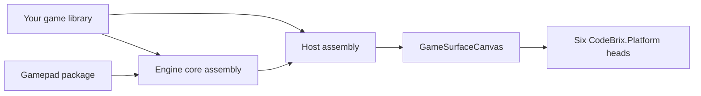

<sub>[CodeBrix](../../README.md) › [Libraries](README.md) › CodeBrix.Platform.GameEngine</sub>

# CodeBrix.Platform.GameEngine

**CodeBrix.Platform.GameEngine is a fully managed, cross-platform 2D and 2.5D game engine for .NET:
tile maps, tilesheets, sprites, layered scenes, cameras and views, animation, physics and collision,
input, audio, a music system, save and load, and a global pause that parks the whole engine at
near-zero CPU.** The repository publishes two packages with distinct jobs. The engine package is the
game engine itself, and one reference brings both of its assemblies: the platform-agnostic engine core
and the host layer that runs it on CodeBrix.Platform across all six heads. The gamepad package is an
optional game controller add-on, kept separate precisely so that games which do not want a native SDL2
dependency do not inherit one.

| | |
| --- | --- |
| **Repository** | [ellisnet/CodeBrix.Platform.GameEngine](https://github.com/ellisnet/CodeBrix.Platform.GameEngine) |
| **Packages** | [`CodeBrix.Platform.GameEngine.MitLicenseForever`](https://www.nuget.org/packages/CodeBrix.Platform.GameEngine.MitLicenseForever) - the engine<br>[`CodeBrix.Platform.GameEngine.Sdl2.ZlibLicenseForever`](https://www.nuget.org/packages/CodeBrix.Platform.GameEngine.Sdl2.ZlibLicenseForever) - optional gamepad support |
| **License** | MIT for the engine package; `MIT AND Zlib` for the gamepad package; see [License](#license) |
| **Requires** | .NET 10 or later, and a CodeBrix.Platform application with exactly one head package per executable project. Gamepads on Linux need the system SDL2 runtime |
| **Use it from** | A CodeBrix.Platform application. The engine core has no UI-framework dependency, so it also runs headless in tests |
| **Platforms** | All six CodeBrix.Platform heads: Windows Win32-Skia, Windows WPF-Skia, Linux X11, Linux Wayland, Linux frame buffer and macOS |

## What it does

### The engine package

- Tile maps, tilesheets and layered scenes with camera and view systems, over seven tile geometries:
  orthogonal, two isometric, two hex, oblique-right and oblique-left.
- Sprites, composite sprites, sprite rotation, and frame-based animation cycles.
- Direct drawing primitives that bypass the tile grid: images, rectangles with pattern and image fills,
  SVG, text, particles and image-instance layers.
- Radial lights, plus darkness and fog overlays that lights carve holes in.
- Display effects over a whole view or a whole layer: fades, wipes, slides, zooms and an earthquake
  shake.
- Ready-made components: a self-disposing splash overlay and a sprite-tracking health bar.
- Physics: movement, easing, scripted motion and collision detection, with named collision profiles and
  per-tile and per-animation-frame collision shapes and types, all authorable in a `.gts` tilesheet
  definition.
- Input: keyboard, mouse and touch with tap, swipe and pinch gestures, in an edge-triggered event form
  and a lock-free polled form.
- Audio playback and mixing through [CodeBrix.Audio](CodeBrix.Audio.md): master, music and
  sound-effect volume buses, a preload-to-PCM sound-effect voice pool, and WAV, MP3, Ogg Vorbis and
  FLAC out of the box.
- MIDI music rendered live through a sampled instrument - SoundFont, SFZ or Decent Sampler - with
  per-channel layering, a tempo control that does not change pitch, and MIDI Polyphonic Expression.
- A music system: fades and equal-power crossfades, reference-counted ducking, stingers, playlists,
  layered adaptive stems including the stems of a downloaded arrangement loaded straight from the zip
  or the folder, and transitions quantized to the next beat or bar - exactly, through the source's own
  tempo map, even where the music changes tempo.
- Save and load of engine state as JSON, shared-reference object graphs included.
- A global pause that parks the whole engine at near-zero CPU and shifts every time baseline on resume,
  so nothing bursts or teleports.
- Two mutually exclusive hosting modes per canvas: an engine-owned scene pipeline, and a game-owned
  fixed-rate software-rendered loop.
- Two render paths for the scene pipeline: CPU rasterization by default, and opt-in GPU rasterization
  (OpenGL or OpenGL ES on the Windows, X11, Wayland and frame-buffer heads, Metal on macOS).
- A UI-agnostic core with a render-surface-adapter seam, so a scene can be exercised headless.

### The gamepad package

- Buttons, sticks, triggers, device identity and hotplug, from one implementation that covers all six
  heads.
- One call attaches it - `Engine.Instance.InitializeSdlGamepadManager()` - and from then on the engine
  refreshes controller state every cycle or every tic and raises its own gamepad events. A game never
  calls `Update()` itself.
- SDL2 is initialized with the game controller subsystem only, which starts no video subsystem: it
  never creates a window, never opens an X11 or Wayland display, and never touches Win32 or AppKit. It
  is a headless joystick backend, which is why the frame-buffer head gets controllers on the same terms
  as the desktop heads.
- Nothing in it throws when SDL2 or a controller is missing. Absence is reported through inspectable
  properties and one log line, because gamepad support is an enhancement to a game that is already
  playable with keyboard and mouse.
- The package carries SDL2 native binaries for Windows and macOS. On Linux it uses the system SDL2.



Both the engine core and the host assembly ship in the engine package; there is no separate host
package. The gamepad package plugs into a seam the core defines, and takes the engine package as its
only automatic dependency.

## When to use it

Reach for CodeBrix.Platform.GameEngine when the application is a game, or is game-shaped: it wants a
loop of its own, a world larger than the window, sprites that move and collide, and a frame budget.
The engine owns the loop, the scene graph and the presentation; you write content and rules. It is
equally the right answer for a software-rendered application that renders whole frames itself and needs
a fixed-rate loop, letterboxed presentation, input and audio around them.

It is not the right answer for ordinary custom drawing. A chart, a gauge, a diagram or a custom control
wants a paint handler, not an engine: the [Graphics2DSK add-in](../platform/add-ins/Graphics2DSK.md)
gives you a Skia canvas with no intermediate bitmap, the
[SkiaSharpViews add-in](../platform/add-ins/SkiaSharpViews.md) gives you a plain paint-handler canvas,
and the [Graphics3DGL add-in](../platform/add-ins/Graphics3DGL.md) gives you a GPU-backed Skia surface
or raw OpenGL. [09 - Graphics, media and vision](../platform/09-graphics-media-and-vision.md) compares
all of them side by side.

What the engine package deliberately does not do:

- No gamepad backend. It defines `IGamepadManager<T>`, `IGamepadAdapter` and the `GamepadEventPoller`;
  the SDL2 implementation is the separate gamepad package.
- No 3D rendering. GPU rendering rasterizes the same 2D and 2.5D scene on the GPU and reads it back; it
  is not a 3D pipeline.
- The software-rendered mode is CPU-only. There is no GPU presentation path for it.
- The engine singleton is not restartable after `Engine.Dispose()`: one game host per process lifetime.
  `Stop()`, not `Dispose()`, is the restartable halt.
- It does not un-pause itself. Engine input pollers are parked while paused, so the resume trigger must
  come from the hosting application's UI layer.
- Save files do not persist value bags, in-flight movement, jiggle or pulse state, animation playback
  position, audio playback position, or the music system's state. Custom `Sprite` and `Tile` subclasses
  are not round-trip aware. Save files written against an older schema are rejected, not migrated.
- Collision overlap events are engine-internal: response is automatic (a solid push-out, or a trigger
  report), and game logic queries `ColliderRegistry.QueryAabb` itself.
- No beat or tempo detection for decoded audio. The game supplies the `MusicTimeline`; a MIDI file
  supplies its own, and a stems download supplies one from the MIDI beside its recordings.
- `.opus` is not built in, for license separation. Reference
  [CodeBrix.Audio.Opus](CodeBrix.Audio.Opus.md) and register it yourself.
- It ships no SkiaSharp Linux native assets of its own. The head application provides them, and a
  headless Linux consumer adds
  [`SkiaSharp.NativeAssets.Linux`](https://www.nuget.org/packages/SkiaSharp.NativeAssets.Linux).
- No Windows OpenGL driver. GPU rendering on a machine without one falls back to CPU rendering and logs
  a warning.

What the gamepad package deliberately does not do: no rumble, haptics, LED, gyro, touchpad, battery
level or audio routing - the bound surface is buttons, sticks, triggers, identity and hotplug. No raw
joystick mode, so devices SDL2 does not recognize as game controllers are not surfaced and there is no
API for custom mapping strings. No rebinding or profile UI; button identity is reported, and mapping a
game action to a button is the game's job. No windowing, rendering, audio, keyboard or mouse, because
CodeBrix.Platform owns all of that. It does not pump the SDL2 event queue, so no second event loop runs
alongside the CodeBrix.Platform one. And it neither drives itself nor disposes itself with the engine.

## Getting started

The engine package goes in the shared game library, once:

```bash
dotnet add package CodeBrix.Platform.GameEngine.MitLicenseForever
```

Add the gamepad package to the same library only when the game wants controllers:

```bash
dotnet add package CodeBrix.Platform.GameEngine.Sdl2.ZlibLicenseForever
```

On Linux, gamepads have exactly one prerequisite, and it is the runtime package rather than the
development one:

```bash
sudo apt install libsdl2-2.0-0
```

The shared library that holds the game looks like this. Every executable head project references it and
adds exactly one head package of its own.

```xml
<Project Sdk="Microsoft.NET.Sdk">
  <PropertyGroup>
    <TargetFramework>net10.0</TargetFramework>
    <RootNamespace>MyGame</RootNamespace>
    <Nullable>enable</Nullable>
  </PropertyGroup>
  <ItemGroup>
    <PackageReference Include="CodeBrix.Platform.ApacheLicenseForever" />
    <PackageReference Include="CodeBrix.Platform.Fonts.OpenSans.ApacheLicenseForever" />
    <PackageReference Include="CodeBrix.Platform.GameEngine.MitLicenseForever" />
  </ItemGroup>
  <ItemGroup>
    <Content Include="assets\**\*" CopyToOutputDirectory="PreserveNewest" />
  </ItemGroup>
</Project>
```

<details>
<summary>What the engine package pulls in automatically</summary>

No version pinning is needed in the consuming project for any of these.

- [`CodeBrix.Platform.ApacheLicenseForever`](https://www.nuget.org/packages/CodeBrix.Platform.ApacheLicenseForever) - the UI platform
- [`CodeBrix.Platform.SkiaSharp.Views.MitLicenseForever`](https://www.nuget.org/packages/CodeBrix.Platform.SkiaSharp.Views.MitLicenseForever) - the XAML canvas the engine renders into
- [`CodeBrix.Platform.Graphics3DGL.ApacheLicenseForever`](https://www.nuget.org/packages/CodeBrix.Platform.Graphics3DGL.ApacheLicenseForever) - the GPU render path
- [`CodeBrix.Platform.Svg.ApacheLicenseForever`](https://www.nuget.org/packages/CodeBrix.Platform.Svg.ApacheLicenseForever) and [`CodeBrix.SkiaSvg.MitLicenseForever`](https://www.nuget.org/packages/CodeBrix.SkiaSvg.MitLicenseForever) - SVG drawing
- [`SkiaSharp`](https://www.nuget.org/packages/SkiaSharp) - the rendering engine
- [`CodeBrix.Audio.MitLicenseForever`](https://www.nuget.org/packages/CodeBrix.Audio.MitLicenseForever) - device audio I/O
- [`CodeBrix.Compression.MitLicenseForever`](https://www.nuget.org/packages/CodeBrix.Compression.MitLicenseForever) and [`CodeBrix.Json.Extensions.MitLicenseForever`](https://www.nuget.org/packages/CodeBrix.Json.Extensions.MitLicenseForever) - save and load
- `Microsoft.Extensions.Configuration` (plus `.Binder` and `.Json`), and
  `Microsoft.Extensions.Logging.Console` and `.Debug`

The gamepad package's only automatic dependency is the engine package.

</details>

The namespaces carry no license suffix. These are the ones a game reaches for:

```csharp
using CodeBrix.Platform.GameEngine;                 // Engine, EngineState, dispatchers,
                                                    //   TypedValueBag, ValueKey<T>
using CodeBrix.Platform.GameEngine.Assets;          // AssetsFile
using CodeBrix.Platform.GameEngine.Audio;           // AudioSystem, SoundChannel, streams,
                                                    //   MusicManager, SfxVoicePool
using CodeBrix.Platform.GameEngine.Configuration;   // EngineConfiguration[File]
using CodeBrix.Platform.GameEngine.Drawing;         // Tile, ImageFilterQuality, SvgResource
using CodeBrix.Platform.GameEngine.Drawing.Sprites; // Sprite, CompositeSprite, SpriteManager
using CodeBrix.Platform.GameEngine.Drawing.Direct;  // DirectImage, TextBlock, particles,
                                                    //   lighting, SplashOverlay, HealthBar
using CodeBrix.Platform.GameEngine.Drawing.Tilesheets;     // Tilesheet, TilesheetRegistry
using CodeBrix.Platform.GameEngine.Drawing.Tilesheets.GTS; // TilesheetDefinition (.gts)
using CodeBrix.Platform.GameEngine.Drawing.Animation;      // Cycle, FrameSequence, Animator
using CodeBrix.Platform.GameEngine.Drawing.Collisions;     // TileCollider
using CodeBrix.Platform.GameEngine.Rendering;       // render-surface hosts, backbuffers,
                                                    //   PixelFramePresenter
using CodeBrix.Platform.GameEngine.Rendering.Views; // ViewManager, View, Camera, Viewport
using CodeBrix.Platform.GameEngine.Rendering.Text;  // FontManager
using CodeBrix.Platform.GameEngine.Scenes;          // Scene, SceneLayer, SceneLayerTile
using CodeBrix.Platform.GameEngine.Physics.Movement;       // MovementController, easing
using CodeBrix.Platform.GameEngine.Physics.Movement.Easing; // EasingFunctions, EasingKind
using CodeBrix.Platform.GameEngine.Physics.Collisions;     // ICollider, Aabb, registries,
                                                    //   CollisionAdjust, TileCollisionType,
                                                    //   CollisionProfile[Names|Registry]
using CodeBrix.Platform.GameEngine.Effects;         // EffectsManager, DisplayEffect, fades,
                                                    //   wipes, slides, zooms, earthquake
using CodeBrix.Platform.GameEngine.Input;           // InputPump, InputEventConfigurationBase
using CodeBrix.Platform.GameEngine.Input.Keyboard;  // KeyboardEventPoller, KeyAction
using CodeBrix.Platform.GameEngine.Input.Mouse;     // MouseEventPoller, MouseButton
using CodeBrix.Platform.GameEngine.Input.Touch;     // TouchEventPoller, TouchPoint
using CodeBrix.Platform.GameEngine.Input.Touch.Gestures;   // Tap/Swipe/Pinch recognizers
using CodeBrix.Platform.GameEngine.Input.Gamepad;   // IGamepadAdapter, GamepadStickState
using CodeBrix.Platform.GameEngine.Timers;          // Timer, HighResTimer, FixedRateGameLoop
using CodeBrix.Platform.GameEngine.Extensibility;   // IEnginePlugin, EnginePluginRegistry
using CodeBrix.Platform.GameEngine.Logging;         // EngineLogger, EngineLoggingMode
using CodeBrix.Platform.GameEngine.Serialization;   // EngineSaveContractResolver
using CodeBrix.Platform.GameEngine.Host;            // EngineExtensions (adapter wiring)
using CodeBrix.Platform.GameEngine.Host.Hosting;    // CodeBrixGameHost,
                                                    //   SoftwareRenderedGameHostBase
using CodeBrix.Platform.GameEngine.Host.Rendering;  // GameSurfaceCanvas
using CodeBrix.Platform.GameEngine.Host.Input.Keyboard; // CodeBrixKeyboardAdapter
using CodeBrix.Platform.GameEngine.Host.Input.Mouse;    // CodeBrixMouseAdapter,
                                                        //   RelativeMouseSession
using CodeBrix.Platform.GameEngine.Host.Input.Touch;    // CodeBrixTouchInputAdapter
using CodeBrix.Platform.GameEngine.Host.Threading;      // CodeBrixPlatformUiDispatcher
```

The gamepad package adds three, of which application code uses one:

```csharp
using CodeBrix.Platform.GameEngine.Sdl2;           // the ONE entry point:
                                                   // InitializeSdlGamepadManager
using CodeBrix.Platform.GameEngine.Sdl2.Gamepad;   // SdlGamepadManager,
                                                   // SdlGamepadAdapter,
                                                   // SdlGamepadButtons,
                                                   // SdlGamepadUnavailableCause
using CodeBrix.Platform.GameEngine.Sdl2.Native;    // raw SDL2 P/Invoke;
                                                   // NOT for app code
```

The one control a game renders into is `GameSurfaceCanvas`, placed in a XAML page:

```xml
<Page
    x:Class="MyGame.Views.MainPage"
    xmlns="http://schemas.microsoft.com/winfx/2006/xaml/presentation"
    xmlns:x="http://schemas.microsoft.com/winfx/2006/xaml"
    xmlns:game="using:CodeBrix.Platform.GameEngine.Host.Rendering"
    FontFamily="{StaticResource OpenSansFont}">
    <Grid Background="#FF222222">
        <game:GameSurfaceCanvas x:Name="GameCanvas" />
    </Grid>
</Page>
```

The code-behind is the same in every game: build the host when the canvas first has a real size, and
dispose it when the page goes away.

```csharp
public sealed partial class MainPage : Page
{
    private TinyGameHost? _host;

    public MainPage()
    {
        InitializeComponent();
        GameCanvas.FirstStarted += (_, _) =>
        {
            GameCanvas.SetRenderResolution(640, 384);     // 20x12 tiles of 32 px
            _host = new TinyGameHost(GameCanvas);
            _host.Initialize(logLevel: LogLevel.Warning);
        };
        Unloaded += (_, _) => { _host?.Dispose(); _host = null; };
    }
}
```

> [!TIP]
> `FirstStarted` fires once, and `e.NewSize` is the first non-zero layout size. Start the game from
> that event: before it, the surface has no real size, and `SetRenderResolution` and `UseGpuRendering`
> must both be set before the first access to `Host`.

`TinyGameHost` is the class that holds the game, and the [Examples](#examples) section builds a complete
one.

## Key concepts

### The two packages and the two assemblies

The engine package ships two assemblies. `CodeBrix.Platform.GameEngine.dll` is the engine core: it has
no UI-framework dependency, its rendering seam is a SkiaSharp `SKImage` plus the
`RenderSurfaceAdapterBase` abstraction, and it is usable headless. `CodeBrix.Platform.GameEngine.Host.dll`
is the host layer: it supplies the CPU and GPU render-surface adapters, the keyboard, mouse and touch
input adapters, the UI dispatcher, and the game-host base classes, and it runs the engine on
CodeBrix.Platform across all six heads. One `PackageReference` brings both; there is no separate host
package.

The gamepad package is an ordinary reference on the engine package, not a lock-step pairing: it uses
only public engine API, and the two are versioned and published independently. As a consumer you take
the latest of each; there is no matching-versions rule to observe.

### The two hosting modes

Every game runs in exactly one of two modes, per `GameSurfaceCanvas`.

In the **engine-cycle (scene pipeline) mode**, which the documentation and the samples call Mode A, the
engine owns the loop. `Engine.Start()` spins a dedicated background thread that repeatedly runs one
cycle: input polling, timers, animation, sprite movement, collision resolution, camera updates, then -
throttled to `TargetFPS` - rendering every registered render surface and presenting it. Choose it for
tile and sprite games.

In the **software-rendered (framebuffer polling) mode**, Mode B, the game owns the loop. A `FixedRateGameLoop`
thread ticks at a fixed rate; each tic the game polls input with `InputPump.PollNow`, advances its own
state, renders a whole CPU frame into a byte buffer, and hands it to a `PixelFramePresenter`, which
presents latest-frame-wins. The engine cycle never runs and the scene and sprite pipeline is never
created. Choose it for retro-style games that render whole frames themselves.

> [!IMPORTANT]
> The mode split is enforced per canvas. `GameSurfaceCanvas.Host` (the scene pipeline) and
> `GameSurfaceCanvas.UsePixelFramePresenter()` are mutually exclusive, and touching one after the other
> throws. Likewise `InputPump.PollNow()` throws while the engine loop is running, because
> double-pumping would corrupt poller state.

### The engine singleton and its lifecycle

`Engine` is a thread-safe singleton reached through `Engine.Instance`.

```csharp
Engine.Instance.Initialize(...);   // optional; Start() calls it if needed
Engine.Instance.Start(syncContext); // spins the cycle thread
Engine.Instance.Pause();            // global pause (see PAUSE section)
Engine.Instance.Resume();
Engine.Instance.Stop();             // halts the loop; engine reusable
Engine.Instance.Dispose();          // full teardown; engine NOT reusable
```

`Start()` must receive the UI thread's `SynchronizationContext`; the parameterless overload captures
`SynchronizationContext.Current`, so call it on the UI thread. For a single-threaded runtime,
`StartTimerDriven(uiContext)` plus a platform timer calling `Engine.Instance.Tick()` replaces the
background thread. `Initialize` also accepts the keyboard, mouse, touch and gamepad adapters directly.

The instance exposes `IsInitialized`, `IsRunning`, `IsPaused`, `IsDisposed`, `CyclesPerSecond`,
`FramesPerSecond`, `TotalTicksEngineRunning`, `TotalSecondsEngineRunning`, `Configuration`, `State`,
`Managers`, `Input`, `UiDispatcher`, `EngineDispatcher` and `LastFrameBeforePause`, plus the static
`Engine.Logger`. Its events are `PreInitialization`, `PostInitialization`, `InitializationComplete`,
`BeforeBackgroundTasksExecute`, `AfterBackgroundTasksExecute`, `BeforeFrameRender`, `AfterFrameRender`,
`CPSCalculated`, `Paused`, `Resumed`, `Disposing` and `Disposed`.

### The cycle, and what runs how often

One cycle runs sixteen ordered steps: drain the engine dispatcher, raise
`BeforeBackgroundTasksExecute`, run pre-cycle timers, refresh gamepads and run the input pollers,
advance animator frames, move sprites, resolve collisions, update cameras, raise
`AfterBackgroundTasksExecute`, check the `TargetFPS` throttle, raise `BeforeFrameRender`, update direct
drawings, render and present each non-GPU surface, raise `AfterFrameRender`, run post-cycle timers, and
sample the cycles-per-second and frames-per-second counters.

Everything up to the throttle check runs every cycle, unthrottled. Rendering and the frame events run
at most `TargetFPS` times per second, and `TargetFPS <= 0` renders unbounded. That split is why input
stays responsive at low frame rates - and why per-cycle event handlers must be cheap, because they run
thousands of times per second.

### The threading model

A game in the scene-pipeline mode touches exactly three thread contexts.

The **engine thread** runs every cycle step, which means all engine events, timer ticks, input poller
events, sprite and collision callbacks and the `Paused` event. Game-state mutation belongs here. Get
onto it with `Engine.Instance.EngineDispatcher.Post(() => { ... });`, which executes at the top of the
next cycle, or inline when you are already on that thread. `PostAsync(Func<Task>)` is the awaitable
form, but only the start is marshaled: continuations after the first `await` resume on whatever context
that `await` captured, so engine state is not automatically safe to touch afterward. Never await it from
the engine thread - that blocks the very cycle that has to drain the queue.

The **UI thread** runs XAML layout and input, `GameSurfaceCanvas` painting, `CPSCalculated`, the three
initialization events and the disposal events. Reach it with
`Engine.Instance.UiDispatcher?.Post(() => { ... });` and never touch XAML elements from the engine
thread. `IUiDispatcher` exposes `IsOnUIThread`, the asynchronous `Post(Action)` and the synchronous
`Send(Action)`; the host implementation is `CodeBrixPlatformUiDispatcher`.

The **audio callback thread** runs `StreamingAudioSource` fill callbacks. It must be fast,
allocation-free and non-blocking; do not touch game state or UI from it, and hand it data through
lock-free fields.

The software-rendered mode is simpler: the game-loop thread replaces the engine thread.
`IKeyboardAdapter.IsDown(keyCode)` is the one deliberate exception to all of this - it is lock-free and
valid from any thread at any time.

### The global pause

One call pauses everything, in both modes, and a matching call resumes:
`Engine.Instance.Pause()` is idempotent and thread-safe, `Resume()` reverses it, and `IsPaused`, the
`Paused` event and the `Resumed` event report the transition.

The cycle or tic in progress completes; at most one further frame is rendered, and in the scene-pipeline
mode that final frame is rendered after the `Paused` event and ignores the `TargetFPS` throttle. The
loop then parks at near-zero CPU: no input polling, timers, movement, collisions or rendering. `Pause()`
blocks until quiescent, except when called from the engine or game-loop thread itself.

Playing audio is suspended, under `Configuration.PauseSuspendsAudio` (default true), except short
fire-and-forget sound effects no longer than `Configuration.PauseShortSoundEffectSeconds` (default
1.0 second). Endless and looping material always suspends. `SuspendOnEnginePause` on a `SoundChannel`,
`StreamingAudioSource` or `AudioResource` overrides that per voice: true always suspends, false never
does, and null is automatic. Voices the game paused itself stay paused across `Resume()`.

On resume, every time baseline - repeating timers, sprite movement, animators, direct drawings,
particles, display effects, radial-light flicker and the cycle clocks - is shifted past the paused
interval before the loops wake, so the pause is invisible to game time.
`TotalTicksEngineRunning` and `TotalSecondsEngineRunning` exclude paused time.

> [!WARNING]
> Engine input pollers do not run while paused, so a game cannot un-pause itself through engine input.
> Wire the resume trigger at the hosting application's UI layer - `canvas.KeyDown` or
> `canvas.PointerPressed` at the XAML layer keep flowing while the engine is parked.

### The paused frame

`Engine.Instance.LastFrameBeforePause` is the global `SKImage` snapshot;
`RenderSurfaceHostBase.LastFrameBeforePause` is the per-surface one and
`PixelFramePresenter.LastFrameBeforePause` the per-presenter one. GPU surfaces are captured too. The
image is owned by the engine or the surface and stays valid through the resume until the next `Pause()`
replaces it, so copy it to keep it longer.

All three also offer `LastFrameBeforePauseAsRgba(out int width, out int height)`, which returns a raw
RGBA8888 `byte[]` - four bytes per pixel in R, G, B, A memory order, row-major, unpremultiplied - or
null when nothing was captured. Each call converts and copies afresh, so hold the result rather than
re-calling per frame. With [CodeBrix.Imaging](CodeBrix.Imaging.md) that is a PNG with no translation
code:

```csharp
var rgba = Engine.Instance.LastFrameBeforePauseAsRgba(out var w, out var h);
if (rgba is not null)
    Image.LoadPixelData<Rgba32>(rgba, w, h).SaveAsPng("pause.png");
```

The `Paused` event is raised once per pause episode, after game execution is quiescent and after the
snapshot and the audio suspend, which makes it the safe place for a save-game routine: nothing races
you. Both host base classes surface it as the `OnEnginePaused()` and `OnEngineResumed()` overrides.

### `GameSurfaceCanvas`

`GameSurfaceCanvas` is the `SKXamlCanvas` subclass in the host assembly that both modes render into.
`FirstStarted` fires once, when the surface first has a real size. `SetRenderResolution(width, height)`
pins the engine render resolution and letterboxes frames aspect-fit into the control; non-positive
values track the control size instead. `UseGpuRendering` opts into the GPU path. Both must be set before
the first access to `Host`.

`Host` is the `RenderSurfaceHost<BackbufferBase>` the engine renders into, and
`Host.Bind(Scene newScene, bool limitCameraToWorldBoundPx = true)` connects a scene to it. The canvas
also carries `RenderSurfaceAdapter`, `UsePixelFramePresenter()`, `EnsureFocus()`,
`WindowToBuffer(Point)` and `BufferToWindow(Point)` for letterbox-aware pointer mapping, and
`SetPointerCursorHidden(bool hidden)`.

During a live window resize the canvas suppresses engine presents and re-blits the last frame at the new
size. Do not fight that by forcing refreshes from resize handlers.

### CPU rendering and GPU rendering

CPU rendering is the default. The engine rasterizes the scene into a `BitmapBackbuffer` on the engine
thread and the adapter blits it to the canvas, with the dirty-rectangle present optimization applied.
That is right for most 2D tile games.

GPU rendering is opt-in through `canvas.UseGpuRendering`. The scene is rasterized by the GPU into a
`GpuBackbuffer` through a backend-neutral off-screen Skia GPU context that lives in the
[Graphics3DGL add-in](../platform/add-ins/Graphics3DGL.md) package - OpenGL or OpenGL ES on the Windows,
X11, Wayland and frame-buffer heads, Metal on macOS. The frame is read back to CPU pixels once and
presented through the same canvas path, so letterboxing, resize behavior, `SetRenderResolution` and
input mapping are identical either way. It pays off when GPU raster beats CPU raster for the scene:
heavy blending, scaling and rotation, or full-surface shader effects, since SkSL runs on the GPU. A
plain tile blit may not benefit.

Under GPU rendering the full surface is re-rendered every frame - there is no dirty-rectangle path, and
`DirectDrawing.ForceRefresh()` is a no-op. `Scene.UsesDirtyRegionRendering` reports which regime a scene
is in. `EngineConfiguration.MsaaSampleCount` applies, and `CPSCalculated` reports the rendered GPU frame
rate through `GpuFps`. `RenderBackbufferPostScene` and a custom `DirectDrawingBase.OnDraw` run on the UI
thread with the `GRContext` current, so never marshal that canvas elsewhere and keep `OnDraw` a pure
function of engine time and game state.

When no GPU context is available, the adapter logs one warning and falls back to CPU-rendering the
`GpuBackbuffer`'s fallback surface, so the game still runs; `IsGpuInitialized` on the adapter is a
`bool?` that is null until the first attempt and then reports the outcome, and the initialization log
records the chosen backend. On Windows, GPU rendering needs a real OpenGL driver; many Windows-on-ARM
devices get OpenGL only from the OpenCL and OpenGL Compatibility Pack in the Microsoft Store, and
installing it is a one-time, per-device end-user step. The mode is fixed once `Host` is created, and the
software-rendered mode is CPU-only.

### Scenes, layers and tiles

The scene graph is `Scene` to `SceneLayer` - a 2D tile grid - to `SceneLayerTile`.

```csharp
var scene = new Scene();
var layer = scene.AddLayer(columnCount: 8, rowCount: 8,
                           width: 64, height: 64,          // tile size px
                           zOrder: 0, parallax: 1f,
                           coordinateSystem: CoordinateSystemTypes.Orthogonal);
layer[0, 0].CurrentFrame = tilesheet[4, 4];   // place a graphic on a cell
```

A layer carries `ZOrder` (lower renders behind), `Parallax` (1 moves with the camera, below 1 is
background, above 1 is foreground), `Visible`, `WrapHorizontally` and `WrapVertically`, `OriginPx`, and
the `ShowGridLines` and `ShowCollisionBoxes` debug overlays. `CoordinateSystemTypes` selects the
geometry: `Orthogonal`, `IsometricRhombic`, `IsometricAxial`, `HexAxialFlatTop`, `HexAxialPointedTop`,
`ObliqueRight` and `ObliqueLeft`. The two oblique systems are sheared square lattices - columns stay
horizontal while rows advance down and to the right or down and to the left - giving a parallelogram
footprint rather than an isometric diamond. Hex layers map fractional grid positions to interpolated
pixel anchors, including the half stagger, so a sprite tweening across a hex layer moves smoothly.

`layer.GridToWorldPx`, `WorldPxToGrid` and `GetAdjacentTile(tile, CardinalDirections)` do the
conversions; tile indexers return null out of bounds, with no auto-wrap, so call `WrapGrid` first when
wrapping. Cells are created with the layer, and assigning `CurrentFrame` places a tilesheet frame. Set
`EnableAnimator = true` only on tiles that animate, because it allocates an `Animator` per tile.

Scenes self-register globally, reachable through `Scene.GetSceneByID` and `GetAllScenes`, and must be
disposed - or cleared with `Scene.ClearAllScenes()` - or they linger there. `Scene`, `SceneLayer` and
every tile also carry a `TypedValueBag` for the game's own per-object data.

### Views, cameras and picking

Each render surface has a `ViewManager`, and each `View` pairs a `Viewport` - a screen rectangle plus a
zoom - with a `Camera`, a world position.

```csharp
host.ViewManager.ConfigureSingleFullView();          // the usual case
host.ViewManager.ConfigureVerticalSplit(1f, 1f);     // split screen
host.ViewManager.AddView(targetRectPx, zoom, zOrder); // custom
```

Camera moves clamp to `WorldBoundsPx` unless it is empty. `SnapTo`, `CenterOn`, `CenterOnGrid` and
`PanBy` are instant; `PanTo`, `PanCenterTo`, `PanToOverDuration`, `PanCenterToOverDuration` and
`PanToGridOverDuration` are smooth; `FollowCentered`, `FollowCenteredX`, `FollowCenteredY`, `Follow` and
`ClearFollow` do following, with `FollowLerpPerSecond` (default 8) for snappiness and `DeadZonePx` for
target wiggle room. `Camera.PositionPx` is read-only - move through the methods.

`Zoom > 1` magnifies: the world rectangle a view shows is `TargetRectPx / Zoom`. `SnapZoom`, `ZoomTo`
and `ZoomToOverDuration` drive it, and the last is a true fixed-duration eased tween that lands exactly
on the target. `View.ZoomAroundScreenPoint(layer, screenPoint, targetZoom, durationSeconds)` gives
map-style wheel zoom: the view owns the anchor and re-derives the camera every update, so the world
point under the cursor stays under the cursor for the whole animation. `MinZoom` is 0.1 and `MaxZoom` is
8 per view.

`view.ScreenPxToGrid(layer, screenPoint)` turns a pointer position into a grid cell, alongside
`ScreenPxToWorldPx`, `WorldPxToScreenPx`, `WorldRectToScreenRect` and `ScreenRectToWorldRect`, all
parallax-aware. Called from inside a render pass for that view, they read the pass's snapshot of camera
position, viewport rectangle, screen offset and zoom, so one frame is never drawn with two different
transforms.

One render-surface host per scene: `Bind` throws `InvalidOperationException` if the scene is already
bound to a different host, and a failed bind leaves both hosts on the scenes they already had. For
several camera perspectives into one scene, add views to the one host rather than a second host.
`host.RedrawDirtyRectangleOnly` (default true) presents only dirty regions,
`host.Backbuffer.ClearColor` sets the letterbox and background color, and the
`host.RenderBackbufferPostScene` event is a post-scene overlay hook taking an `SKCanvas`.

### Tilesheets and the `.gts` definition

`TilesheetRegistry.Instance` is the named store, with `LoadFromImageFile`, `LoadFromBitmap`,
`LoadFromStream`, `LoadFromAssetsFile`, `LoadFromDefinitionFile`, `LoadFromDefinition`,
`LoadFromDefinitionAsset`, `TryGet`, `GetOrNull`, an indexer, `Remove`, `Names`, `GetAll` and `Clear`.

```csharp
var sheet = TilesheetRegistry.Instance.LoadFromImageFile("spots", path);
sheet.DefaultRegion.TileSize = new Size(93, 96);
sheet.ApplyMask(Color.Black.ToSKColor());   // optional color-key transparency
Frame frame = sheet[0, 0];                  // or sheet[regionName, x, y]
```

A sheet can carry multiple named regions, each with its own area, tile size, padding, margin, overhang
and collision defaults, and `Frame` is the sheet-plus-cell handle everything else consumes. A region's
`CollisionAdjust`, `CollisionType` and `CollisionArea` are inherited by every tile drawn from it, and any
individual cell may override them; assigning a frame value always records an override, even when it
equals the region default, so changing a region default re-applies only to frames that have none and
hand-tuned cells survive a region-wide edit.

A `.gts` file is a JSON `TilesheetDefinition`, carrying the image source, the regions and the mask, with
relative image paths resolved against the `.gts` directory. The model types are `TilesheetDefinition`,
`TilesheetImageDefinition`, `TilesheetRegionDefinition`, `TilesheetFrameDefinition`,
`TilesheetMaskDefinition` and `TilesheetDefinitionSource`, and the static
`TilesheetDefinitionSerializer` offers `Load`, `Save`, `FromJson`, `ToJson` and `FromTilesheet`.
`TileCollisionType` is written as the string `None`, `Blocking` or `Trigger` in both `.gts` files and
engine save files.

### Sprites and animation

Sprites are created only through the manager; the constructor is not public.

```csharp
var sprite = SpriteManager.Instance.CreateSprite(sceneLayer, new Frame(sheet, 0, 0), "hero");
sprite.Visible = true;
sprite.SetPosition(new Vector2(5, 0));      // GRID cells, not pixels
```

Sprite positions are grid coordinates on their scene layer, while `RenderSize`, `NudgeX`, `NudgeY` and
`CollisionArea` are pixels. `Sprite.Rotation` is degrees clockwise about the center of the render
rectangle, normalized to `0 <= r < 360`, and a non-finite value throws `ArgumentOutOfRangeException`. It
is a rendering property: the collision rectangle stays axis-aligned, and `Sprite.VisualBoundsWorld` and
`Sprite.GetVisualBoundsScreen(View)` are the axis-aligned bounds that enclose the rotated sprite, used
by dirty-region invalidation, the hit tests and the layer sprite query.

`ResizeTo`, `ScaleBy`, `PulseTo`, `PulseBy`, `StopPulse` and `CancelResize` handle size, and
`StartJiggle`, `JiggleOnce` and `StopJiggle` add a visual-only shake that never affects collision or
`RenderSize`. `CompositeSprite` groups sprites under a `CompositeAnchorMode` and is itself movable.
`Sprite.Dispose()` is deferred to the next cycle, so it is safe mid-frame.

```csharp
var seq = new FrameSequence();
seq.AddFrame(sheet, 0, 0); seq.AddFrame(sheet, 1, 0);
seq.AddFrame(sheet, 2, 0); seq.AddFrame(sheet, 3, 0);
seq.SequenceCycleType = CycleType.PingPong;    // Simple | Repeating | PingPong
sprite.TileAnimator.CurrentCycle = new Cycle(seq, 0.5, "walk"); // 0.5 s/frame
sprite.TileAnimator.StartAnimation();
```

Cycle keys live in a global registry: constructing a `Cycle` with an existing key replaces it, and
`SetCurrentCycle` and `StartAnimation(key)` fetch a clone. Cycles chain through `NextCycle` and can hide
the tile at cycle end, a throttle of 0 auto-stops the animation, and the animator raises `Started`,
`Stopped` and `Cycled`. Never call `Animator.Dispose` directly - the owning tile does.

### Movement and easing

Every sprite, and every movable direct drawing, has a `.Movement` `MovementController`. Units are the
mover's own space - grid cells for sprites, pixels for direct drawings - and all durations are seconds.
Per frame the priority is follow, then scripted, then integrated physics.

Scripted moves are `MoveTo(target, seconds, easing)`, `MoveBy(delta, seconds, easing)`,
`MoveToward(target, speedPerSec)`, `CancelScript()` and `StopAllMovement()`. Each `Move*` method returns
the controller, so per-move callbacks chain:
`.OnBeginning(() => PlayASound()).OnComplete(() => ArrivedAt(target));`. `OnComplete` fires when that
move ends; `OnBeginning` fires synchronously as it is chained, and throws if no scripted move is active.
Prefer those over the `ScriptedMovementStarted` and `ScriptedMovementStopped` events, which fire for
every move on the controller.

Integrated physics is `SetVelocity`, `SetAcceleration`, `SetMaxSpeed` and `SetLinearDamping`. Setting
velocity or acceleration cancels a script, and starting a script zeroes velocity and acceleration.
Following is `FollowPixelSoft`, `FollowPixelHard`, `FollowTileSoft`, `FollowTileHard` and `Unfollow`, and
`WrapX` and `WrapY` wrap the mover at the world edge. Easing comes from `EasingFunctions` - `Linear`,
the quad, cubic, quart and quint ease-in, ease-out and ease-in-out family, `SmoothStep` and
`SmootherStep` - or from the `EasingKind` enum.

Direct-drawing movement runs in real time: it advances once per engine update by the real elapsed delta,
with no fixed-step accumulator and no per-update cap. A non-pause stall, such as a debugger break,
therefore advances movement by the real elapsed time rather than slowing it down. `Engine.Pause()` is
unaffected.

### Collisions and collision profiles

A tile collides when its `Tile.CollisionType` is not `None`. `CollisionsEnabled` is a projection of that
type: enabling collisions on a `None` tile promotes it to `Blocking`, or to `Trigger` if its collider
already responds as one, and disabling resets the type to `None`.

Collision profiles name a group-and-mask pair so games do not hand-assemble bitmasks.
`Scene.CollisionProfiles` is a `CollisionProfileRegistry` carrying four standard profiles - `World`,
`Actor`, `Projectile` and `Sensor` - and `Define(name, collisionGroup, collidesWith, collidesWithAll)`,
`Get`, `TryGet` and `GetProfileNames` extend it. The registry is persisted with the scene. New sprites
take `SpriteManager.Instance.DefaultCollisionProfile` (`Actor`) and a layer's fixed tiles take
`SceneLayer.DefaultTileCollisionProfile` (`World`); override per object with
`Tile.SetCollisionProfile(name)`, or per creation with the `collisionProfileName` parameter on
`CreateSprite`. Groups are still bitmasks underneath, allocated through the scene's `CollisionGroups`
registry, with `CollisionMasks.None` and `CollisionMasks.All` as the two constants.

Resolution is automatic, once per cycle, per layer: solid against solid gets a minimum-axis push-out
with velocity canceled on the hit axis, which reads as a slide, and a trigger reports without push-out.

`Tile.AdjustCollisionArea` is a `CollisionAdjust` with `Top`, `Bottom`, `Left` and `Right` in pixels, and
`Tile.CollisionArea` is exactly `AdjustCollisionArea.ApplyTo(DrawLocationWorld)`. The convention is an
inset on every edge - a positive value on any of the four edges moves that edge inward and shrinks the
box, a negative value moves it outward and grows it.

```csharp
var feet = new CollisionAdjust(top: 40, bottom: 0, left: 6, right: 6);
hero.AdjustCollisionArea = feet;   // only the boots collide
```

The first frame assigned to a tile seeds its collision adjustment and collision type from that frame's
tilesheet metadata, unless the tile set them explicitly first. Later frame changes move them only when
the matching by-frame flag is on: `Tile.AdjustCollisionAreaByFrame` and `Tile.CollisionTypeByFrame`, both
default false and both persisted.

For game logic, query the layer's `ColliderRegistry` yourself:
`QueryAabb(in Aabb area, int layerMask, int collidesWithMask, List<ICollider> results, ICollider? ignore = null)`.
Build an `Aabb` around the player, pass `CollisionMasks.All` for both masks and a reusable list, then
inspect each result's `Owner` and `ResponseType`.

### Direct drawings, particles and lighting

Direct drawings bypass the tile grid. Construct one with the render host and either a `SceneLayer`, for
world space that scrolls with the camera, or a `View`, for a screen-fixed HUD, then chain fluent `Set*`
calls. They need no scene cell and self-register with `DirectDrawingManager`, so disposing one removes
it.

The catalog is `DirectImage`, `DirectSvg`, `DirectRectangle` (fill, corner radius, border, stroke,
alpha, blend mode, pulse, pattern fill and image fill), `TextBlock` (font, colors, alignment, wrapping,
max lines, shadow, outline, color pulse, typewriter and word-reveal, and a `SetText` cheap enough for a
score or frame-rate readout every frame), `DirectComposite` (a group with its own pixel-space movement
and opacity), `ImageInstanceLayer` (many instances of one image, in view mode or scene-layer mode) and
`ParticleSurface(host, layerOrView, bounds, nickname, maxParticles)` with `Emitters`,
`Burst(emitter, count)`, `ActiveParticleCount`, `GlobalEmitScale` and `CullingMarginX`. Custom drawables
derive from `DirectDrawingBase`, or `DirectDrawingMovableBase` for one with `.Movement`, and override
`OnDraw`.

Lighting has two independent halves that work together or alone: lights that add glow, and darkness
overlays that subtract it and are punched through by reveal sources. Both draw through the backbuffer
canvas, so both work on the CPU and the GPU path. `DirectRadialLight` carries `CenterWorldPx`,
`RadiusWorldPx`, `LightColor`, `Intensity`, `BlendMode`, the hotspot and midpoint ratios, and the
flicker settings; `DirectLightLayer` owns a group of lights on one layer and adds them with
`AddTorchLight`. `DirectDarknessOverlay` is a view-mode darkness quad over the whole viewport, for
player vision or fog of war, and `DirectSceneLayerDarknessOverlay` is the world-bounded sibling that
scrolls with its layer. Both share `DarknessColor`, `DarknessOpacity`, the radius and strength ratios,
and `AddRevealSource`, `TrackLight`, `TrackLightLayer`, `UntrackLight` and `ClearRevealSources`. Lights
default to `ZOrder` 10,000 and overlays to 20,000, so darkness composites over the lights, and flicker
is pause-safe: a flickering torch does not jump phase across a pause and resume.

### Display effects

Display effects are presentation-level transitions over a whole `View` or a whole `SceneLayer`, driven
by the render surface host. They change presentation only: they never move world objects, alter
collision geometry or change a layer's origin.

`host.Effects` is an `EffectsManager` with `Run<TEffect>(View target, TEffect effect)`,
`Run<TEffect>(SceneLayer target, TEffect effect)`, `Cancel(DisplayEffect effect)`, `CancelAll()` and
`ActiveEffects`. The types are `FadeInEffect`, `FadeOutEffect`, `SlideInEffect`, `SlideOutEffect`,
`FillEffect` and `EraseEffect` on a view or a layer, and `ZoomInEffect`, `ZoomOutEffect` and
`EarthquakeEffect` on a view only, with `EffectDirection` naming the eight directions. Every effect
carries `Id`, `DurationSeconds`, `Easing`, `Status`, `Progress`, the `Completed` and `Cancelled` events,
and `Cancel()`.

There is one effect per target per channel, and the channels are transform (slides and earthquake),
opacity (fades), reveal (fill and erase) and zoom. Running a second effect on the same target and
channel replaces the first without restoring its state, whereas canceling or disposing the host does
restore it. An effect instance runs once. Every constructor in the hierarchy is `private protected`, so
the set of effect types is closed: use the `FadeEffect`, `SlideEffect`, `WipeEffect` and `ZoomEffect`
bases for type tests and pattern matching, not for subclassing.

```csharp
// fade the HUD view in over 400 ms, then wipe the map layer away
host.Effects.Run(hudView, new FadeInEffect(0.4f));
host.Effects.Run(mapLayer, new EraseEffect(EffectDirection.FromLeftToRight, 0.8f));
```

### Splash and health-bar components

Two ready-made `DirectComposite` subclasses save rebuilding common game furniture.
`SplashOverlay.TryCreate(...)` makes a view-sized splash that fades in, holds, fades out and disposes
itself; it returns null and logs a warning when the file is missing, the stream does not decode or the
host has no views, so a game can start without a splash instead of throwing, while a negative duration
throws `ArgumentOutOfRangeException`. `onHolding` and `onHoldingAsync` run on the engine thread when the
hold phase starts, and the hold ends when the hold timer and that work are both finished, whichever is
later. `onSplashCompleted` is raised on the engine thread after the fade-out and after the overlay has
disposed itself - the place to start music and show the title screen.

`HealthBar` is a world-space bar that tracks a sprite: a scene-layer composite of two rectangles, track
and fill, centered above its target by `OffsetPx` and following the sprite's `SpriteMoved` event. It
carries `Value`, `MaxValue`, `Fraction`, `BarSize`, the fill, warning and critical colors with their
opt-in thresholds, and the fluent `SetValue`, `SetFillColor`, `SetThresholds`, `Show`, `Hide` and
`RefreshPosition`. It disposes itself with its target sprite.

### Timers

Timers fire on the engine thread, inside the cycle.

```csharp
var t = Timer.Add("spawner", TimerType.PreCycle, TimerCycles.Repeating, 2.5);
t.Tick += () => SpawnWave();          // every 2.5 s of engine time
Timer.Remove("spawner");              // or t.Dispose()
```

`TimerType.PreCycle` fires before input and movement; `PostCycle` fires after rendering.
`TimerCycles.Once` auto-removes after firing, and fires exactly once even when the engine stalled long
enough for several of its intervals to elapse. Repeating timers are schedule-preserving: a late cycle
does not shift the next due time, and a missed interval fires as soon as possible. `length` is validated
- both `Timer.Add` overloads throw `ArgumentOutOfRangeException` when it is not finite, is zero or
negative, is shorter than one high-resolution tick, or is too large to fit a positive `Int64` of ticks.

Per-timer `Paused` and the static `Timer.PausedAll` stop timer events while the engine keeps running,
which is distinct from the global engine pause. `HighResTimer` wraps the underlying clock with
`GetCurrentTick()`, `GetDuration(start, stop)` in seconds, and `TicksPerSecond`.

Choosing a hook: `BeforeBackgroundTasksExecute` and `AfterBackgroundTasksExecute` are per-cycle and must
be cheap; `BeforeFrameRender` and `AfterFrameRender` are per-frame and throttled to `TargetFPS`;
`CPSCalculated` is a periodic metrics snapshot on the UI thread; `Timer.Tick` covers anything on a
schedule.

### Input: events and polling

Input has two complementary paths. Events are edge-triggered: pollers raise `KeyDown`, `MouseEvent`,
the touch events and `ButtonDown` on the engine thread, or on the game-loop thread when
`InputPump.PollNow` drives them. Keys must be registered first, through
`StartMonitoringKey(keyCode, displayName, timeBetweenEvents, isPaused)`, `StartMonitoringKeys` or
`StartMonitoringAllKeys`. Key codes are Windows `VirtualKey` values cast to `int`, and
`KeyDownEventArgs` carries `KeyConfig`, `KeyCode`, `KeyAction` (`Pressed`, `Released` or `Repeated`),
`Modifiers` and the `IsShift`, `IsCtrl` and `IsAlt` helpers. `MouseEventPoller` adds
`StartMonitoringMouse`, the `MouseEvent` action, and the polled `CurrentPosition`, `ButtonStates`,
`ScrollDelta` and `CurrentKeyboardModifiers`; a scroll event is raised only when the delta is non-zero
and differs from the previous poll's.

Polling is the per-tic gameplay path for held keys. `IKeyboardAdapter.IsDown(int keyCode)`, reached
through `KeyboardEventPoller.Adapter`, is lock-free and valid from any thread at any time.
`IMouseAdapter` exposes `CurrentPosition`, `PressedButtons`, `CurrentKeyboardModifiers` and
`ScrollDelta`, and gamepads are read straight off
`Engine.Instance.Input.GamepadManager.ConnectedAdapters`.

Event delivery is paced by `Configuration.TimeBetweenKeyboardEvents` and its mouse, touch and gamepad
siblings, all in seconds and all defaulting to 0.03; a per-key or per-device override goes in the
`timeBetweenEvents` parameter, and 0 means an event every cycle. With the default, at most one mouse
event per 30 ms reaches the game, and a press and release that both fall inside one window are
collapsed - which is why synthetic clicks in UI automation must hold the button for roughly 300 ms or
more. Registrations from the `StartMonitoring*` and `StopMonitoring*` calls are queued and applied at the
next poll, not instantly.

Keyboard input reaches the canvas only while the canvas has focus: call `canvas.EnsureFocus()`, and
remember that clicking any other control steals focus and that `KeyDown` bubbles from the focused
element. For mouse look, `RelativeMouseSession(GameSurfaceCanvas renderSurface)` offers `Begin()` to
hide, confine and accumulate, a per-tic `ConsumeDelta()` returning `(int DeltaX, int DeltaY)`, `End()`
and `IsActive`.

The host wires the adapters through extension methods on `Engine`:
`InitializeCodeBrixKeyboardAdapter(UIElement element)`,
`InitializeCodeBrixMouseAdapter(UIElement element, MouseEventConfiguration? mouseEventConfiguration = null)`
and `InitializeCodeBrixTouchAdapter(UIElement element, bool emulateMouse = false)`.

### Touch and gestures

`Engine.Instance.Input.TouchEventPoller` exposes `ActiveTouches` as an `IReadOnlyList<TouchPoint>`, the
`TouchBegan`, `TouchMoved` and `TouchEnded` events, a combined `TouchEvent` carrying
`GestureEventArgs`, and `StartMonitoringTouch` and `StopMonitoringTouch`. `TouchPoint` is a readonly
record struct of `Id`, `Position` and `Phase`, where `TouchPhase` is `Began`, `Moved`, `Stationary`,
`Ended` or `Cancelled`.

Three recognizers are built in and always wired. `TapGestureRecognizer` uses `MaxTapDurationSeconds`
(0.3) and `MaxTapMovementPixels` (20). `SwipeGestureRecognizer` requires both
`MinimumSwipeSpeedPixelsPerSecond` (200) and `MinimumSwipeDistancePixels` (30), and reports a
`SwipeDirection` with the start and end positions and the speed. `PinchGestureRecognizer` raises
`PinchStarted`, `PinchUpdated` and `PinchEnded`, with the touch ids, the center, the starting, previous
and current distances, and the scale delta and total. All timing is engine-tick based, so paused time
never counts toward a gesture, and a second contact cancels a pending tap or swipe candidate.

Touch lifecycle events are never throttled: `TimeBetweenTouchEvents` paces `TouchMoved` only, and
`Began`, `Ended` and `Cancelled` always get through. Pausing or stopping the poller clears contact and
recognizer state, so a finger held across a pause cannot complete into a phantom tap or swipe.

Desktop mouse input does not arrive as touch contact 0 by default. Opt in by passing
`emulateMouse: true` to `CodeBrixTouchInputAdapter` or to `Engine.InitializeCodeBrixTouchAdapter`, or by
overriding `EmulateMouseAsTouch` on either host base class.

### Audio

Both paths live in `CodeBrix.Platform.GameEngine.Audio`, with device I/O through
[CodeBrix.Audio](CodeBrix.Audio.md). Every voice mixes into one shared native output device, so
overlapping sounds are cheap.

The resource path is typical for the scene-pipeline mode. `AudioResourceManager.Instance` loads clips
with `LoadFromFile`, `LoadFromStream`, `LoadFromPcm` and `LoadFromEngineAssetsFile`, and each
`AudioResource` owns a voice with `Play`, `Pause`, `Resume`, `Stop`, `Seek`, `IsLooping`, `Volume`,
`Pan`, `Duration` and `PlaybackCompleted`. `Clone()` gives an independent voice of the same clip.
Container-format sounds no longer than `AudioResourceManager.PreloadShortSoundEffectMaxSeconds`
(default 10 seconds; 0 disables) are decoded once to raw float PCM at load time, and every play, clone,
channel clip and pool voice over that resource shares the single decoded buffer, so no decode or file
work ever happens on the real-time audio thread. Longer material keeps its streaming reader.

Route sound-effect triggers - impacts, pickups - through the voice pool rather than playing the
`AudioResource` itself per trigger:

```csharp
AudioResourceManager.Instance.TryPlaySfx("laser", volume, pan, priority);
```

That plays the preloaded clip on the shared `SfxPool`, whose cull policy is `CullOldest` by default,
with `CullLowestPriority` and `RejectNew` as alternatives. The pool refuses non-preloaded resources
rather than decode on trigger.

The pinned-device path is typical for the software-rendered mode and is opt-in.
`AudioSystem.Initialize(44100, 2);` pins the device rate and is required before any `SoundChannel` or
callback stream. `SoundChannel` is a fixed classic game-audio channel - `SetClip(key)` to swap
constantly, `Play(volume, pan, pitch)`, live `Volume`, `Pan` and `Pitch` (a multiplier from 0.05 to 20),
and `State` - and odd-rate raw-PCM clips are rate-converted automatically. `StreamingAudioSource` is an
endless pull-model stream for synthesized music and emulated sound chips, filled through
`FillAudioBuffer(Span<float>)` or an `ISampleProvider` on the audio callback thread.
`AudioResourceManager.LoadFromPcm(key, data, rate, bits, channels)` takes headerless raw-PCM lumps with
no container.

WAV, MP3, Ogg Vorbis and FLAC are built in and fully managed, so assets never need converting for a
particular target. Any other format registered with CodeBrix.Audio works with no engine change, because
`PlatformAudioFactory` resolves an extension against its own table first and then that library's reader
registry; `PlatformAudioFactory.Register(ext, factory, requiresFile)` adds an engine-only reader or
overrides a built-in one.

`AudioMixer` is the static mixer, and `MasterVolume`, `MusicVolume` and `SfxVolume` are the three
sliders a settings screen expects. A voice's audible gain is its own `Volume` times its bus times
`MasterVolume`, and changing a bus reaches everything already playing on it. Resources, channels and
pool voices default to the sound-effect bus; streaming sources and everything `MusicManager` plays
default to the music bus, and each exposes a `Bus` property to override.

### Music

`MusicManager.Instance` is to music what the voice pool is to sound effects: the place the policy lives.
Everything it plays is on the music bus. Its fades ride on one background ticker thread rather than
engine timers, because fades must behave identically in both hosting modes and the software-rendered
mode never runs the engine cycle; the thread is not started until the first fade, parks on a wait handle
when idle, allocates nothing per tick, and freezes with the global engine pause.

A track is a handle, not a transport: read its state and set its `Volume`, but play, stop, crossfade and
seek through the manager, which owns the fades. `FileMusicTrack` wraps an `AudioResource` and streams;
`MidiMusicTrack` renders a MIDI sequence live through a SoundFont (`.sf2`), an SFZ instrument (`.sfz`)
or a Decent Sampler instrument (`.dspreset`, `.dslibrary`, `.dsbundle`, or a folder holding a preset),
shared through `SoundFontCache`, `SfzInstrumentCache` and `DecentSamplerInstrumentCache`. The
transport is `Play(track, fadeIn)`, `CrossfadeTo(track, duration)`, `Stop(fadeOut)`, `Pause()`,
`Resume()`, `Seek()`, plus `NowPlaying`, `IsPlaying` and `ActiveFadeCount`. A crossfade uses one fade for both sides, and
`CrossfadeCurve` is `EqualPower` by default; choose `Linear` for correlated material such as a stem swap
or a loop splice.

The `(key, instrumentPath, midiFilePath)` constructor resolves a Decent Sampler path through the
process-wide `MidiMusicPlayer.SharedDecentSamplerCache`, so two tracks naming one library decode it
once and share its knobs, while a SoundFont or an SFZ named there is loaded fresh. Pass the instrument
in instead for a part that must move its own knobs. `track.Problems` lists what the instrument and the
MIDI file objected to, logged once at load and empty for a clean pair; the path form reports the file's
problems only, because the player keeps the instrument it built and does not hand it back. A file that
breaks a rule still loads, because the MIDI reader is lenient: what it had to work around is reported
there rather than thrown, and what it can ignore outright is not reported at all. MPE settings live on
`track.Player`.

`PushDuck(depth, attack, release)` returns a handle you dispose to release; overlapping ducks are
reference-counted and the deepest wins, `Duck(depth, attack, hold, release)` is the fire-and-forget
form, and `ClearDucks()` rescues a leaked handle. Ducking is a separate multiplier from `MusicVolume`.
`PlayStinger(key, volume, duckMusic)` plays a one-shot musical hit on its own voice on the music bus.
`MusicPlaylist` adds `MusicRepeatMode` of `None`, `One` or `All`, seeded shuffle, and the usual
add, remove, reset and move operations, and `MusicManager.Play(playlist, crossfade)` advances on each
track's `Ended`.

Adaptive layers come three ways. For MIDI, `track.SetLayerVolume(channel, 0f)` and
`track.FadeLayerTo(channel, 1f, TimeSpan.FromSeconds(2))` address channels 0 to 15, alongside
`SetLayerPan` and a `Speed` tempo multiplier that does not change pitch; layer volume is sent as MIDI
control change 7, so a track that automates its own volume overwrites the game's value the next time it
does. For recorded stems, a `MusicStemSet` is itself a `MusicTrack`, summing its layers into one voice
with one clock, so they lock by construction. Every stem must share a sample rate and channel count - a
mismatch throws and names the stem and both formats - stems should share a length, or the set loops at
the longest and logs the mismatch once, stems are decoded to memory, and only the first stem starts
audible. Gain changes ramp across an audio block rather than stepping, because a step change in gain is
a click; summing is not limited.

The third way is a stems download.
`MusicStemSet.FromSunoStems(key, stemsZipOrFolder, params stemNames)` reads one - a set of files named
for the song and the stem, with the arrangement's MIDI beside them, as a zip or as a folder - and
builds an ordinary `MusicStemSet` from the layers you name. Passing no names takes every stem that
carries audio, and a name the export does not have throws `ArgumentException` listing the ones it does.
"Suno" is Suno, Inc.'s name, and appears here only to say what the files are.

```csharp
var stems = MusicStemSet.FromSunoStems("battle", zipOrFolder, "Drums", "Bass", "Guitar");
MusicManager.Instance.Play(stems);
```

The set's `Timeline` is already filled in from the MIDI that ships beside the recordings, so bar-locked
layer changes and quantized transitions work with nothing else set up, and they follow the tempo
exactly. `MusicStemSet.Problems` carries whatever the export could not account for, one line each,
logged once and never thrown, and is empty for a set built any other way. Every stem is decoded to
memory, about `23 MB` per stereo minute at 48 kHz, so name the three or four layers the game will
actually cross-fade rather than taking a whole export. Call `AudioSystem.Initialize` first, so the
decode converts to the device rate once. A zip is unpacked on demand into a cache folder keyed by the
download and reused after that - `SunoLoadOptions.CacheFolder` chooses where, and a game that ships a
download should point it at its own writable folder - while a folder is read where it lies. A full mix,
when the download carries one, is not a stem: it is a long linear piece, so load it with
`AudioResourceManager` and play it as a `FileMusicTrack`, which streams. Alignment measurement is
forced off, because lining a recording up with its MIDI is a MIDI concern that costs a decode of every
stem, and the recordings are already locked to each other.
[Multi-track songs and stems](audio/multi-track-and-suno.md) covers what such a download contains and
how to ask for one that lines up.

`Play`, `CrossfadeTo` and `Stop` all take a `MusicTransitionQuantize` of `Immediate`, `Beat` or `Bar`,
and the wait rides on the fade ticker, so it freezes with the global pause.
`HasPendingTransition` reports one in flight and `CancelPendingTransition()` drops it. The grid comes
from `MusicTrack.Timeline`, and where it comes from decides how complete it is.

| The track | What fills `Timeline` |
| --- | --- |
| MIDI loaded from a path | `MusicTimeline.FromMidiFile`: the tempo map, the time signature and the markers |
| MIDI loaded from a `MidiSequence` | `MusicTimeline.FromMidiSequence`: the sequence's own tempo map, four beats to the bar assumed, and no markers, because a sequence keeps its tempo map and not the timing of its meta events |
| A stems download | The MIDI in the export: four beats to the bar, no markers |
| Decoded audio | Nothing. The game supplies it: `track.Timeline = new MusicTimeline(beatsPerMinute: 128, beatsPerBar: 4);` |

There is no inference from a decoded stream, and a `Beat` or `Bar` request with no timeline happens
immediately and says so in the log rather than being dropped.

The grid follows the tempo. A timeline given a tempo in its constructor is a constant grid; one built
from MIDI carries the source's whole tempo map - `MusicTimeline.TempoMap`, a
`CodeBrix.Audio.Synth.MidiTempoMap` - and quantizes through it, so a beat or bar boundary lands exactly
where the file puts it however often the tempo moves. That matters because a generated arrangement
routinely carries one tempo event per beat, and quantizing such a file against its first tempo alone
would be off the beat within a few bars. `HasTempoChanges` says whether the source's tempo varies at
all; `SecondsPerBeat` and `SecondsPerBar` describe the tempo the piece starts at, so ask
`TimeToNextBoundary` rather than doing that arithmetic yourself. Markers come through the same map, so
a jump point and the bar line it sits on agree, and a game can build the same thing itself with
`new MusicTimeline(tempoMap, beatsPerBar)`.

A MIDI file's markers and cue points become `MusicTimeline.Markers`, and
`MusicManager.JumpToMarker("chorus")` seeks the current track to one, case-insensitively, returning
false rather than seeking somewhere arbitrary when there is no such marker.

Every `MusicManager` method is safe to call from any thread, but track `Ended` events and playlist
advances arrive on a background or audio thread: marshal to the engine thread with
`Engine.Instance.EngineDispatcher.Post` before touching game state.

### Save and load with `EngineState`

`EngineState`, reached as `Engine.Instance.State`, is a serializable snapshot of the engine's live
registries: `AssetsFiles`, `Tilesheets`, `Cycles`, `Scenes`, `Sprites` and `SoundResources`.

```csharp
Engine.Instance.State.SaveToFile("save1.json", compress: true);
EngineState.LoadFromFile("save1.json", compressed: true);
EngineState.MergeFromFile("patch.json", overwriteExisting: true,
    parts: EngineStateParts.Scenes | EngineStateParts.Sprites);
```

What round-trips is the full populated object graph: scenes with their layers - tile grids, per-tile
frames, visibility and flags, wrap flags, origin, parallax, z-order, tile size and collision groups -
sprites with position, layer reference, frame, alignment, nudge, render size and collision flag,
animation cycles with their sequences, throttle and chained references, audio specs, asset-pack
references, and tilesheets re-registered by definition. Shared references are preserved as identities
through the `$id` and `$ref` reference handling in
[CodeBrix.Json.Extensions](CodeBrix.Json.Extensions.md), and loaded content is fully rehydrated.

Save writes a versioned envelope, `{ "schema": 1, "state": {...} }`, and `compress` selects GZip. The
compress and compressed flags must agree between save and load, because the loader does not sniff.
`LoadFromFile` clears the selected parts first, giving overwrite semantics, while `MergeFromFile`
merges, matching scenes by ID, sprites by `Nickname`, and cycles and audio by key. Loading is staged
internally: asset packs and tilesheets are registered first, then the object graph deserializes, and
tile and sprite frames resolve tilesheets by name against the live registry during that read - which is
why a save file's tilesheets must load with it. `EngineStateParts` is a flags enum, and Tilesheets and
Audio automatically pull in the asset files they depend on; `separateGtsFiles: true` writes tilesheets
as sidecar `.gts` files next to the save. A save file mounts automatically at engine initialization
through `Configuration.StateFiles`.

The proper hook for save-on-pause is the `Paused` event, or `OnEnginePaused`, where game state is
quiescent by contract. Load and merge likewise belong at quiescent moments - before `Start`, or while
paused - never mid-cycle from another thread.

`EngineState.SerializerOptions` is the public, settable options template. It carries the
`EngineSaveContractResolver`, the piece that makes the engine's model types round-trip under
`System.Text.Json`, plus leaf converters for `Frame`, `FrameSequence`, the `SceneLayerTile[,]` grid and
`CollisionGroupRegistry`. If a game replaces `SerializerOptions`, it must keep the resolver and those
converters, and must not add the polymorphism fallback converter factory, which would take precedence
over reference handling.

### Assets

`AssetsFile` is a zip-backed asset container, optionally AES-256 encrypted. Contents are fully buffered
into memory at load and the file handle closes immediately.

```csharp
var pack = AssetsFile.LoadOrCreate("assets.pack");
using Stream? img = pack.Get(AssetTypes.Image, "hero.png");
// or pack[AssetTypes.Image, "hero"] — extension optional, case-insensitive
pack.Add(AssetTypes.Font, "/path/SomeFont.ttf");
pack.Save();                                    // rewrites the zip
```

`AssetTypes` covers `Image`, `Audio`, `Video`, `Cursor`, `Font`, `Misc`, `Svg` and
`TilesheetDefinition`. `Get` returns a fresh read-only `MemoryStream` per call, matching the exact name
first and then the base name ignoring extension. `AssetsFileIdentifier(pack, type, name)` is a
serializable pointer to one entry, with `IsValid` guarding a missing one.
`AudioResourceManager.LoadFromEngineAssetsFile(pack)` bulk-loads every audio entry,
`SvgResourceManager.Instance.LoadFromEngineAssetsFile(pack)` does the same for SVGs, and
`TilesheetRegistry.LoadFromAssetsFile` and `LoadFromDefinitionAsset` pull images and `.gts` definitions.

### Configuration

`Engine.Instance.Configuration` is loaded by `Initialize`, from `gameengine.json` by default; a missing
file yields defaults. The settings are `TargetFPS` (60; 0 uncapped), `VSync`, `MsaaSampleCount`,
`SamplingTimeForCPS` (1.5 seconds between `CPSCalculated` events), the four `TimeBetween*Events`
throttle floors (0.03 seconds each), `TimeBetweenGamepadStateUpdates` (0.008 seconds; 0 re-reads device
state every poll), `LoggingMode`, `LoggingQueueCapacity` (8192), `FlushAsyncLogsOnShutdown`,
`PauseSuspendsAudio`, `PauseShortSoundEffectSeconds` (1.0), `StateFiles`, and `ConfigurationSections` -
free-form string sections for the game's own settings, with `Get`, `Set`, `Has` and `Remove` helpers and
`config[section, key]` indexers.

The JSON root key is `EngineConfig`. A `gameengine.json` whose settings sit under any other root object
is read as an empty configuration - no error, only defaults.

```json
{
  "EngineConfig": {
    "TargetFPS": 60,
    "SamplingTimeForCPS": 1.5,
    "TimeBetweenKeyboardEvents": 0.03,
    "TimeBetweenGamepadEvents": 0.03,
    "TimeBetweenMouseEvents": 0.03
  }
}
```

The default path is relative to the process working directory, which is not necessarily where the
executable lives, so pass an absolute path for a predictable location:

```csharp
var configPath = Path.Combine(AppContext.BaseDirectory, "gameengine.json");
host.Initialize(configPath: configPath, autoSaveConfig: true);
```

With auto-save on, the configuration - including anything the game put in `ConfigurationSections` - is
written back when the file object is disposed, and `Engine.Dispose()` disposes it before the logging
system shuts down. The file is read once: `Load` materializes the settings and releases the
configuration root immediately, leaving no reload-on-change watcher behind, so call `Load` again to pick
up an external edit.

### Plugins, logging and value bags

`IEnginePlugin` hooks the cycle without subscribing to events. It carries `Name`, `Version`,
`OnInitialize`, `OnPreCycle`, `OnPreFrameRender`, `OnPostFrameRender`, `OnPostCycle`, a default-no-op
`OnPostRenderCanvas(Engine, RenderSurfaceHostBase, SKCanvas)` overlay hook, and `OnShutdown`;
`EnginePluginRegistry` registers and unregisters them. The same thread rules as the matching events
apply.

The engine logs through `Microsoft.Extensions.Logging`. `EngineLogger` is the static entry point, with
`Mode`, `StartAsyncLogging`, `StopAsyncLogging`, `SwitchToSyncAndFlush`, `SwitchToAsync`,
`EngineLoggerFactory`, `GetLogger<T>()`, `SetLogLevel` and the `LoggingError` event. `Engine.Logger` is
the engine's own logger, and a game logs through `EngineLogger.GetLogger<MyGame>()`. One call makes the
application and the engine share a single pipeline:

```csharp
services.AddLogging(b => b.AddConsole());
services.AddEngineLogging();          // engine logs now go through it too
var provider = services.BuildServiceProvider();
```

If the collection already registers an `ILoggerFactory`, that factory becomes the engine's: an
implementation instance is adopted directly, and a factory or type registration is re-registered at the
same lifetime around the original one. Once an application-supplied factory is in use,
`EngineLogger.SetLogLevel` is a no-op, because the application's own filters own the level.

`TypedValueBag` is a typed, key-safe property bag carried by `EngineState`, `Scene`, `SceneLayer` and
every tile and sprite, for the game's own per-object data.

```csharp
public static readonly ValueKey<int> Hp = new("hp");
tile.ValueBag.Set(Hp, 10);
int hp = tile.ValueBag.Get(Hp, defaultValue: 0);
```

It offers `Set<T>`, `TryGet<T>`, `Get<T>`, `Remove<T>`, `Contains`, `Clear()`, `MergeFrom`, `Clone()`
and `ToDictionary()`. Value bags are not part of the save file, so persist their contents yourself if
they matter.

Two more keyed stores round the set out. `FontManager.Instance` caches `SKTypeface` instances for
`TextBlock` fonts, loading from a file or an assembly resource. `SvgResourceManager.Instance` is the
keyed store for the vector art `DirectSvg` draws, and `SvgResource` adds `IntrinsicSize` and the two
`Rasterize` overloads.

### Gamepads: the seam and its SDL2 implementation

The engine core defines the seam - `IGamepadManager<T>`, `IGamepadAdapter`, `GamepadStickState` and
`GamepadEventPoller` - and the gamepad package fills it. One extension method is the whole entry point:

```csharp
public static class EngineGamepadExtensions
{
    public static SdlGamepadManager InitializeSdlGamepadManager(
        this Engine engine, bool logStatus = true);
}
```

It starts SDL2 gamepad support and assigns the resulting manager to `engine.Input.GamepadManager`;
nothing else has to be plumbed. Call it once, after the engine has been started. It always returns a
usable manager and never returns null, including when SDL2 or a controller is missing - in that case
`IsAvailable` is false and `UnavailableReason` explains why. With `logStatus` left at true it writes the
outcome to the engine log once: a warning carrying `UnavailableCause` and `UnavailableReason` when
support is unavailable, an information line carrying `GetNoControllersHint()` when support is available
with nothing connected, or one line per connected pad carrying its `Name`, `GamepadId` and mapping
string.

```csharp
public sealed class SdlGamepadManager
    : IGamepadManager<SdlGamepadAdapter>, IDisposable
{
    public static bool TryStart(out SdlGamepadManager manager);

    public bool IsAvailable { get; }
    public string? UnavailableReason { get; }
    public SdlGamepadUnavailableCause UnavailableCause { get; }
    public IReadOnlyCollection<SdlGamepadAdapter> ConnectedAdapters { get; }

    public void Update();
    public string? GetNoControllersHint();
    public void Dispose();
}
```

There is no public constructor. `IsAvailable` says gamepad support is functional, not that a controller
is plugged in - check `ConnectedAdapters.Count` for that. `ConnectedAdapters` is a live view: the same
collection instance every time, with contents changing as controllers come and go, which is what lets
the engine's `GamepadEventPoller` see controllers that appear later. Do not copy it and expect the copy
to track hotplug. `Update()` refreshes the device list and every connected controller's state, and the
engine calls it; calling it yourself defeats the engine's `TimeBetweenGamepadStateUpdates` throttle.
`SdlGamepadUnavailableCause` is the machine-readable counterpart to `UnavailableReason`, with
`NativeLibraryMissing` and `SubsystemInitializationFailed` alongside `None`; on Linux the first normally
means the SDL2 runtime package is not installed, something the player can fix, while on Windows and
macOS - where SDL2 ships inside the application - it indicates a packaging problem worth reporting.

```csharp
public sealed class SdlGamepadAdapter : IGamepadAdapter, IDisposable
{
    public string GamepadId { get; }                       // "sdl:<instanceId>"
    public int InstanceId { get; }
    public string Name { get; }            // e.g. "Xbox One S Controller"
    public IReadOnlyCollection<string> PressedButtons { get; }
    public GamepadStickState? LeftStick { get; }
    public GamepadStickState? RightStick { get; }
    public float LeftTrigger { get; }                      // 0.0 .. 1.0
    public float RightTrigger { get; }                     // 0.0 .. 1.0
    public bool IsConnected { get; }
    public string GetMappingString();
    public void Dispose();
}
```

Every property is a snapshot of the most recent refresh rather than a live native query, so reading
several within one frame gives a consistent view of the controller. `PressedButtons` holds values from
`SdlGamepadButtons` and is a live view refreshed in place each frame, so read it within the frame and
never cache the collection. `GetMappingString()` returns the mapping string for the device, or an empty
string when unavailable; the mapping reconciles the device's raw button and axis numbering with the
standard layout and differs by transport, so it is the first thing to log when a controller behaves
oddly.

`SdlGamepadButtons` is a set of `public const string` names - `A`, `B`, `X`, `Y`, `Back`, `Guide`,
`Start`, `LeftStick`, `RightStick`, `LeftShoulder`, `RightShoulder`, `DPadUp`, `DPadDown`, `DPadLeft`
and `DPadRight` - plus `All`. Use the constants rather than string literals: the seam identifies buttons
by string, so a misspelled name registers happily with the event poller and then never fires. The names
follow the standard layout, and physical positions map through the controller database, so `A` is always
the bottom face button whatever is printed on it.

`GamepadStickState` is a readonly struct with `X` (-1 full left, +1 full right), `Y` (-1 full down, +1
full up), `RawX`, `RawY`, `Magnitude`, `Angle` in radians, `IsEngaged(float threshold = 0.15f)`,
`Direction(float threshold = 0.15f)` and `WithDeadzone(float threshold = 0.15f)`. `WithDeadzone` returns
the state unchanged when engaged and a zeroed state - raw values preserved - otherwise. `Direction`
returns `StickDirection.None` below the threshold and otherwise ORs together every axis past it, so a
diagonal reads as `Up | Right`.

For edge-triggered button events, `Engine.Instance.Input.GamepadEventPoller` is nullable - use `?.` -
and assigning a manager to `Engine.Instance.Input.GamepadManager`, which
`InitializeSdlGamepadManager` does, calls `GamepadEventPoller.Initialize` for you. Its surface is
`StartMonitoringButton(gamepadId, button, timeBetweenEvents, isPaused)`, `StopMonitoringButton`,
`StopMonitoringAllButtons`, `AllButtonConfigsByGamepadId`, `PauseAllInput` and the `ButtonDown` event,
whose args carry the `Config` and the `Adapter`.

The `CodeBrix.Platform.GameEngine.Sdl2.Native` namespace - `Sdl2Library`, `Sdl2Native`,
`SDL_GameController`, `SDL_Joystick` and the enums - is public for interop, not for application code. It
is raw P/Invoke, mostly unsafe, it returns sentinel values instead of throwing when SDL2 is absent, and
calling it behind the manager's back can desynchronize the device list or shut the subsystem down under
it. Use `SdlGamepadManager`.

## Examples

A complete game host for the scene-pipeline mode: it draws a tile grid, places a sprite, moves it with
the keyboard and tweens it on a key press. `CodeBrixGameHost` wires the canvas, the input adapters, the
scene binding and the engine start, and the game fills in the content hooks.

```csharp
using System.Drawing;
using System.Numerics;
using CodeBrix.Platform.GameEngine;
using CodeBrix.Platform.GameEngine.Drawing;
using CodeBrix.Platform.GameEngine.Drawing.Sprites;
using CodeBrix.Platform.GameEngine.Drawing.Tilesheets;
using CodeBrix.Platform.GameEngine.Host.Hosting;
using CodeBrix.Platform.GameEngine.Host.Rendering;
using CodeBrix.Platform.GameEngine.Input.Keyboard;
using CodeBrix.Platform.GameEngine.Physics.Movement.Easing;
using CodeBrix.Platform.GameEngine.Scenes;
using Windows.System;

public sealed class TinyGameHost : CodeBrixGameHost
{
    private Tilesheet _sheet = null!;
    private SceneLayer _layer = null!;
    private Sprite _hero = null!;

    public TinyGameHost(GameSurfaceCanvas canvas) : base(canvas) { }

    protected override void LoadTilesheets()
    {
        _sheet = TilesheetRegistry.Instance.LoadFromImageFile("tiles", "assets/tiles.png");
        _sheet.DefaultRegion.TileSize = new Size(32, 32);
    }

    protected override Scene CreateInitialScene()
    {
        var scene = new Scene();
        _layer = scene.AddLayer(columnCount: 20, rowCount: 12, width: 32, height: 32);
        for (int y = 0; y < 12; y++)
            for (int x = 0; x < 20; x++)
                _layer[x, y].CurrentFrame = _sheet[0, 0];     // grass everywhere
        return scene;
    }

    protected override void CreateInitialViews()
        => RenderSurface.Host.ViewManager.ConfigureSingleFullView();

    protected override void CreateSprites()
    {
        _hero = SpriteManager.Instance.CreateSprite(_layer, _sheet[1, 0], "hero");
        _hero.SetPosition(new Vector2(3, 3));       // grid cells
        _hero.Visible = true;
    }

    protected override void OnKeyboardAdapterInitialized()
    {
        var kb = Engine.Input.KeyboardEventPoller!;
        kb.KeyDown += OnKeyDown;
        kb.StartMonitoringKeys(new[] { (int)VirtualKey.Left, (int)VirtualKey.Right,
                                       (int)VirtualKey.Up,   (int)VirtualKey.Down });
    }

    private void OnKeyDown(KeyDownEventArgs e)          // engine thread
    {
        if (e.KeyAction != KeyAction.Pressed) return;
        Vector2 delta = e.KeyCode switch
        {
            (int)VirtualKey.Left  => new Vector2(-1, 0),
            (int)VirtualKey.Right => new Vector2( 1, 0),
            (int)VirtualKey.Up    => new Vector2(0, -1),
            (int)VirtualKey.Down  => new Vector2(0,  1),
            _ => Vector2.Zero
        };
        if (delta != Vector2.Zero)
            _hero.Movement.MoveBy(delta, 0.2f, EasingKind.SmootherStep)
                          .OnComplete(() => Engine.Logger.LogInformation("arrived"));
    }

    protected override void OnEngineStarted() => Engine.Configuration.TargetFPS = 60;

    protected override void OnDisposing()
    {
        if (Engine.Input.KeyboardEventPoller is { } kb) kb.KeyDown -= OnKeyDown;
        base.OnDisposing();
    }
}
```

Notice that every hook fires exactly once per host, so the object graph can be built there with no
re-entry guard, and that the keyboard handler runs on the engine thread, which is where game-state
mutation belongs.

`Initialize` runs those hooks in a fixed order, which is worth reading once:

```csharp
OnInitializing
ConfigurePlatform  -> OnConfigurePlatform
ConfigureInput     -> keyboard/mouse/touch adapters wired to the canvas,
                      OnKeyboardAdapterInitialized / OnMouseAdapterInitialized /
                      OnConfigureGamepads / OnTouchAdapterInitialized
LoadAssets                       } "load content"
LoadTilesheets                   }
LoadAnimationCycles              }
CreateInitialScene (return your Scene)
CreateInitialViews
OnSceneGraphCreated
BindScene (canvas.Host.Bind(Scene)) -> OnSceneBound
CreateSprites
CreateDirectDrawings
InitializeEngine   -> OnEngineInitialized   (engine initialized, not started)
StartEngine        -> OnEngineStarted       (cycle thread now running)
OnInitialized
```

For demos and tools it is equally valid to skip the host base and drive `Engine` directly. The essential
order, on the UI thread, from `FirstStarted`:

```csharp
var host = canvas.Host;                          // creates the render host
host.ViewManager.ConfigureSingleFullView();      // views BEFORE Start
Engine.Instance.Start(SynchronizationContext.Current);
Engine.Instance.Configuration.TargetFPS = 90;

// input adapters are opt-in on this path:
Engine.Instance.InitializeCodeBrixMouseAdapter(canvas);
Engine.Instance.Input.MouseEventPoller.MouseEvent += OnMouseEvent;
Engine.Instance.Input.MouseEventPoller.StartMonitoringMouse();

// then build scene content (or DirectDrawings, which need no scene)
```

Content built after the engine is already cycling goes through the dispatcher -
`Engine.Instance.EngineDispatcher.Post(() => RebuildPuzzle(...));` - so the mutation lands on the engine
thread at the top of the next cycle.

The software-rendered mode has its own base class. Derive from it, implement the abstract members,
construct with the canvas and a tic rate, and call `Initialize` from `FirstStarted`.

```csharp
public sealed class MyRetroHost : SoftwareRenderedGameHostBase
{
    public MyRetroHost(GameSurfaceCanvas canvas)
        : base(canvas, ticsPerSecond: 70) { }

    protected override void OnLoadContent()
    {
        // REQUIRED: configure the presenter or Initialize() throws
        Presenter.Configure(320, 200, PixelBufferFormat.Rgba8888,
            FrameOrientation.Identity, PixelFrameScaleMode.Fit,
            ImageFilterQuality.None);
    }

    protected override void ConfigureAudio()      // opt-in
        => AudioSystem.Initialize(44100, 2);

    protected override void ConfigureGamepads()   // opt-in; needs the
        => _gamepads = Engine.Instance.InitializeSdlGamepadManager(); // Sdl2 package

    protected override void OnTic() { /* one tic of game logic */ }

    protected override void OnRenderFrame(Span<byte> frame)
        { /* fill 320*200*4 bytes; presented when this returns */ }

    protected override void OnShutdown() { /* teardown */ }
    protected override void OnEnginePaused() { /* pause frame / save */ }
    protected override void OnEngineResumed() { }
}
```

Per tic, on the dedicated game-loop thread, the base runs `InputPump.PollNow()`, then `OnTic()`, then
`OnRenderFrame(buffer)`, then the present. `PollNow` refreshes gamepad state and then runs every poller,
so this mode gets the same gamepad behavior - hotplug included - as the scene-pipeline mode. The loop
itself is a `FixedRateGameLoop`: a non-drifting fixed timestep with bounded catch-up at `MaxCatchUpTics`
(default 5), where a longer stall re-baselines and counts `DroppedTics` instead of bursting, and a
callback exception stops the loop, lands in `LastException` and raises `UnhandledException`. The
presenter is reconfigurable at any time from the game thread, takes exactly `width * height * 4` bytes
per `PresentFrame`, does one full-frame copy with no per-frame managed allocations, and offers a
`Rotate90` orientation that displays column-major buffers with no CPU transpose.

Gamepads are one override in either mode, and reading them is a loop over the live adapter collection.

```csharp
// Mode A
public sealed class MyGameHost : CodeBrixGameHost
{
    private SdlGamepadManager? _gamepads;

    public MyGameHost(GameSurfaceCanvas renderSurface) : base(renderSurface) { }

    protected override void OnConfigureGamepads()
        => _gamepads = Engine.Instance.InitializeSdlGamepadManager();
}

// Mode B
protected override void ConfigureGamepads()
    => _gamepads = Engine.Instance.InitializeSdlGamepadManager();
```

```csharp
private void ReadGamepads(SdlGamepadManager gamepads)
{
    foreach (SdlGamepadAdapter pad in gamepads.ConnectedAdapters)
    {
        GamepadStickState move = pad.LeftStick?.WithDeadzone() ?? default;

        // Clamp before using Magnitude as a speed scalar -- see PITFALLS.
        float speed = MathF.Min(move.Magnitude, 1f) * MaxSpeed;
        _playerX += move.X * speed * deltaSeconds;
        _playerY += move.Y * speed * deltaSeconds;   // +Y is UP

        bool firing = pad.PressedButtons.Contains(SdlGamepadButtons.A)
                      || pad.RightTrigger > 0.5f;

        if (move.Direction().HasFlag(StickDirection.Up)) { AimUp(); }
    }
}
```

The clamp on the first line of arithmetic is not decoration: `Magnitude` can exceed 1 on a diagonal, and
using it unclamped as a speed scalar is the classic diagonal-speed-boost bug.

A torchlit room is a light layer plus a darkness overlay that tracks it, so glow and reveal move
together.

```csharp
var lights = new DirectLightLayer(host, dungeonLayer);
var torch  = lights.AddTorchLight(new PointF(520, 320), 110f, nickname: "torch-01");
torch.FlickerEnabled = true;

var darkness = new DirectDarknessOverlay(host, mainView, dungeonLayer, "dungeon-darkness")
                  .SetDarknessColor(Color.Black)
                  .SetDarknessOpacity(190);
darkness.TrackLightLayer(lights);       // every present and future light carves a hole
torch.MoveTo(playerWorldCenterPx);      // glow and reveal move together
```

Tracking a light layer rather than individual lights means every light added later carves its hole
without further wiring.

## Using it in a CodeBrix.Platform application

A CodeBrix.Platform game is one shared library that holds the game, plus one thin executable per head.
[04 - Project architecture](../platform/04-project-architecture.md) covers the shape in general; what
follows is the game-specific part of it.

The engine reference belongs in the shared library, shown under [Getting started](#getting-started).
Each head project references that library, imports the shared XAML project, and adds exactly one head
package:

```xml
<Project Sdk="Microsoft.NET.Sdk">
  <PropertyGroup>
    <TargetFramework>net10.0</TargetFramework>
    <OutputType>Exe</OutputType>
  </PropertyGroup>
  <ItemGroup>
    <Page Include="**\*.xaml" Exclude="bin\**\*.xaml;obj\**\*.xaml" />
    <None Remove="**\*.xaml" />
  </ItemGroup>
  <Import Project="..\MyGame.UI\MyGame.UI.projitems" Label="Shared" />
  <ItemGroup>
    <ProjectReference Include="..\MyGame.Core\MyGame.Core.csproj" />
  </ItemGroup>
  <ItemGroup>
    <PackageReference Include="CodeBrix.Platform.Runtime.Skia.X11.ApacheLicenseForever" />
  </ItemGroup>
</Project>
```

Swap that single head package for
[`CodeBrix.Platform.Runtime.Skia.Win32.ApacheLicenseForever`](https://www.nuget.org/packages/CodeBrix.Platform.Runtime.Skia.Win32.ApacheLicenseForever)
or
[`CodeBrix.Platform.Runtime.Skia.MacOS.ApacheLicenseForever`](https://www.nuget.org/packages/CodeBrix.Platform.Runtime.Skia.MacOS.ApacheLicenseForever)
for the other heads. The head supplies the SkiaSharp native libraries, so the game library does not.

The head's `Program.cs` is the standard host builder, with one line changing per head:

```csharp
using CodeBrix.Platform.UI.Hosting;
using System;

namespace MyGame;

internal class Program
{
    [STAThread]
    public static void Main(string[] args)
    {
        var host = CodeBrixPlatformHostBuilder.Create()
            .App(() => new App())
            .UseLinuxX11()          // .UseWin32Skia() / .UseMacOS() on the other heads
            .Build();
        host.Run();
    }
}
```

Run it with `dotnet run --project MyGame.LinuxX11`. The page hosts the canvas, the canvas raises
`FirstStarted` once it has a size, and the host builds the scene and starts the engine.

Head-specific notes are short. GPU rendering maps to OpenGL or OpenGL ES on the Windows, X11, Wayland
and frame-buffer heads and to Metal on macOS; on Windows it needs a real OpenGL driver, and
Windows-on-ARM devices commonly need the OpenCL and OpenGL Compatibility Pack from the Microsoft Store.
Gamepads work on all six heads, frame buffer included, with the system SDL2 runtime as the one Linux
prerequisite. And the resume trigger for the global pause belongs at the XAML layer of the head's page -
minimize maps to `Pause()`, restore maps to `Resume()`.

## Pitfalls

### Threads

- Mutate game state on the engine thread, or on the game-loop thread in the software-rendered mode, and
  use `EngineDispatcher.Post` to get there.
- Never touch XAML or UI from the engine or game-loop thread; use `UiDispatcher.Post`.
- Never await `EngineDispatcher.PostAsync` from the engine thread, and remember that after the first
  `await` inside the posted action you are no longer on it.
- `MusicManager` `Ended` and playlist events arrive on a background or audio thread. Marshal before
  touching game state.
- Audio fill callbacks must be fast and allocation-free, must never block, and must never touch game
  state.
- Do not call blocking waits - `Task.Wait`, lock convoys, I/O - inside cycle events, timer handlers or
  `OnTic`. One slow handler stalls the whole game.

### Mutual exclusivity, each of which throws when violated

- One mode per canvas: `Host` or `UsePixelFramePresenter()`, never both.
- `InputPump.PollNow()` only when the engine loop is not running.
- `AudioSystem.Initialize` before any `SoundChannel` or callback stream.
- `Presenter.Configure` before the software-rendered loop starts, in `OnLoadContent`.
- `SetRenderResolution` and `UseGpuRendering` before the first access to `Host`.
- `ConfigureSingleFullView` and `Bind` only from `FirstStarted` onward, on the UI thread.

### Pause correctness

- Wire the hosting application: minimize to `Pause()`, restore to `Resume()`.
- Register save-game and pause-screen logic on `Paused`, or `OnEnginePaused`, and tear it down on
  `Resumed`. Never poll `IsPaused` from game logic to stop yourself - the engine already stopped you.
- Put un-pause input at the UI layer, never on engine input, because the pollers are parked.
- For long-running voices the game manages specially, set `SuspendOnEnginePause` explicitly instead of
  fighting the automatic rule.

### Resources and shutdown

- Dispose the game host when the page closes. `CodeBrixGameHost` stops the loop, unhooks events and
  tears the engine down in the right order; after `Engine.Dispose()` the singleton is finished for the
  process.
- `SoftwareRenderedGameHostBase.Dispose` does not dispose the engine, so call `AudioSystem.Shutdown()`
  and `MusicManager.Instance.Dispose()` yourself in that mode.
- Unsubscribe any engine events you subscribed outside the host base classes; the bases unhook their
  own.
- Scenes self-register globally: dispose them, or call `Scene.ClearAllScenes()`, or they linger. Never
  call `Animator.Dispose` directly.
- `Engine.Dispose()` does not dispose the gamepad manager. A game whose process ends with the engine can
  let the process exit; a game that tears the engine down and keeps running must call
  `gamepads.Dispose()` itself, after `Engine.Dispose()`, and must call `InitializeSdlGamepadManager`
  again on the next engine.

```csharp
public void ShutDown()
{
    Engine.Instance.Dispose();
    _gamepads?.Dispose();
    _gamepads = null;
}
```

### API traps

- `MoveBy(delta, float)` means two different things: with an easing argument the float is a duration and
  the move is a tween; without one it is a speed. Pass the `EasingKind` explicitly for a tween.
- `OnBeginning(...)` throws if no scripted move is active, which includes a move that snapped instantly.
  `OnComplete` is always safe.
- `Configuration.TimeBetween*Events` are seconds, and the mouse throttle is enforced. Set
  `TimeBetweenMouseEvents = 0` for an event every cycle, and make synthetic clicks in UI automation hold
  the button for roughly 300 ms or more.
- `StartMonitoring*` and `StopMonitoring*` registrations apply at the next poll, not instantly, and keys
  must be registered before `KeyDown` fires for them.
- Desktop mouse input does not arrive as touch contact 0. Pass `emulateMouse: true`, or override
  `EmulateMouseAsTouch`, for a game that reads only the touch stream.
- `CollisionAdjust` insets on every edge: positive shrinks the box on that edge, negative grows it.
- One render-surface host per scene. `Bind` throws if the scene is already bound elsewhere; use several
  views on the one host instead.
- `Viewport.Zoom > 1` zooms in.
- `Timer.Add` validates its length: zero, negative, NaN, infinite and sub-tick lengths throw.
- `TilesheetDefinitionSerializer.Save(path, tilesheet)` mutates a bitmap-only tilesheet: it writes a
  sibling `.png` and re-points the sheet at it. `FromTilesheet` writes one record per frame coordinate,
  so a large region produces a large `.gts`.
- The root key in `gameengine.json` is `EngineConfig`, and the default path is relative to the process
  working directory. Pass an absolute path.
- An effects instance runs once, and a second effect on the same target and channel replaces the first
  without restoring its state.
- Keyboard focus: a toolbar click steals focus from the canvas and the engine poller then sees nothing.
  Call `EnsureFocus()` and hand focus back after toolbar interactions.
- Sprite positions are grid cells, while `RenderSize`, the nudges and `CollisionArea` are pixels.
  `SizeNewSpritesToSceneLayer` (default true) sizes new sprites to the layer's tile size rather than the
  frame's native size.
- Cycle keys are global: constructing a `Cycle` with an existing key replaces it, and
  `StartAnimation(key)` fetches a clone.
- Adding a layer to a scene - which also happens during a load - re-applies that layer's
  `DefaultTileCollisionProfile` to every fixed tile, so a per-tile `SetCollisionProfile` on a layer tile
  does not survive a save and load or a re-add. Sprites are unaffected.
- `ResizeComplete` fires at the end of every pulse leg and on cancel, so unhook one-shot handlers inside
  the handler.
- To change a tracked light's radius scale, intensity scale or intensity tracking, `UntrackLight` first,
  then `TrackLight` again.
- `SplashOverlay.TryCreate` returns null and logs a warning on a missing file, an undecodable stream or a
  host with no views; a negative duration throws. `HealthBar` throws when `maxValue` is not greater than
  zero or the bar is too small to draw.
- Save and load: the compress flags must agree, tilesheets must load with the scenes that use them, keep
  `EngineSaveContractResolver` if you replace `SerializerOptions`, and value bags and custom subclasses
  do not round-trip.
- `MusicDuckMultiplier` is owned by `MusicManager`: duck through `PushDuck` or `Duck`, never by writing
  `AudioMixer.MusicVolume`. `ClearDucks()` rescues a leaked duck handle.
- An instrument from an asset pack must reach the disk, except a `.sf2`. A `.sfz` and a `.dspreset`
  reference sample files beside them; a `.dslibrary` or `.dsbundle` is one file, but it is read in
  place by path and nothing is unpacked. Only a `.sf2` loads from a `Stream`. Extract the rest from an
  `AssetsFile` before loading.
- Decent Sampler knob positions and modulated parameters are instrument state, not synthesizer state,
  so two tracks over one instrument share them - right for two players of the same sound, wrong when
  each part must move its own. The `(key, instrumentPath, midiFilePath)` constructor shares by design,
  through the process-wide `MidiMusicPlayer.SharedDecentSamplerCache`; hand a part its own instrument
  when it needs its own knobs.
- `MusicStemSet.FromSunoStems` decodes every stem it is given to memory. Name the layers the game will
  actually cross-fade rather than taking the whole export.

### Performance

- Per-cycle handlers run thousands of times per second and are the easiest place to destroy performance.
  Prefer timers and the frame events.
- No per-frame allocations in hot paths: `OnRenderFrame`, audio fill callbacks and per-cycle handlers.
- Batch `SceneLayer` property changes, because nearly every setter forces a full scene refresh, and use
  `SetTileSize(w, h)` rather than setting `TileWidth` and `TileHeight` separately.
- Enable `tile.EnableAnimator` only on tiles that animate; it allocates an `Animator` each.
- Load content in the host's load hooks, before the loop starts, rather than mid-game on the hot path.
- Route rapid sound effects through `AudioResourceManager.TryPlaySfx`, or your own `SfxVoicePool`, never
  a fresh decode or player per trigger. Short effects preload automatically; check `IsPreloaded` if a
  pool play returns false.
- Keep music and ambience on streaming readers, one long-lived voice each, rather than raising
  `PreloadShortSoundEffectMaxSeconds` to cover them.
- Do not force refreshes during window resizes; the canvas already suppresses and resumes presenting
  around one.
- `SoundChannel` stopped-state detection lags slightly behind the clip actually ending, because the
  shared output sweeps on a timer.

### Gamepads

- A controller that reconnects gets a new `GamepadId`, because it derives from the joystick instance ID.
  Anything registered against the old id - button monitoring in particular - must be registered again.
  Bluetooth controllers sleep aggressively, so this happens in normal use.
- `GamepadStickState.Magnitude` can exceed 1, up to the square root of 2 on a diagonal, because `X` and
  `Y` are each clamped to the range -1 to 1 independently. Clamp the magnitude, or normalize the vector,
  before using it as a speed scalar.
- A resting stick does not read zero. Use `WithDeadzone()` or `IsEngaged()` rather than testing against
  `!= 0`.
- Stick `Y` is inverted relative to the native API: the native side reports up as negative, while
  `GamepadStickState` defines +1 as up. The adapter handles it; raw values read through the native layer
  do not.
- The first poll after a controller connects is discarded on purpose, because a freshly connected
  Bluetooth pad can report full deflection on every axis until its first report arrives. Sticks and
  triggers read neutral for one frame after connect; buttons are trustworthy immediately.
- Do not call `Math.Abs()` on a raw axis value as a `short`. -32768 is a real reading and negating it
  overflows a signed 16-bit type; widen to `int` first.
- Button and axis numbering is device- and transport-specific - the same pad reports a different raw
  layout over Bluetooth than over USB - so always go through `SdlGamepadButtons` and the adapter, never
  raw joystick indices.
- Use the `SdlGamepadButtons` constants rather than string literals, because the seam is string-keyed and
  a misspelled name registers happily and then never fires.
- Do not cache `ConnectedAdapters` or `PressedButtons`; both are live views reused across refreshes, and
  a copy stops tracking hotplug. Enumerate them rather than materializing a list each frame.
- Never call `IGamepadManager.Update()` yourself, and do not add throttling of your own: the engine
  refreshes gamepad state in both modes and the throttle is part of the seam's contract.
- A kiosk or frame-buffer deployment has a second failure mode: the evdev backend needs read access to
  `/dev/input/event*`, which a desktop login session grants through a per-device ACL but a bare service
  account may not have. That looks identical to "no controller plugged in", and
  `GetNoControllersHint()` tests for it specifically and says to add the account to the `input` group.
- `Engine.Instance.Input.GamepadEventPoller` is nullable; use `?.` rather than assuming it exists.
- Verify any gamepad change in both hosting modes. A check that supplies its own driver cannot detect a
  missing driver.

## Samples and tools in the repository

Nothing in this section ships in either NuGet package, and nothing here builds as part of the library
build, the test run or the packaging build. Each sample carries its own `.slnx` and Linux X11, Windows
Win32-Skia and macOS heads, and is built and run on its own.

| Name | What it demonstrates | Where |
| --- | --- | --- |
| Spot.Brix | The recommended hosting shape end to end: a splash title card, a XAML dialog driving the engine through `EngineDispatcher.Post`, option persistence in `gameengine.json`, and save-on-game-over | [`samples/Spot.Brix`](https://github.com/ellisnet/CodeBrix.Platform.GameEngine/tree/main/samples/Spot.Brix) |
| Platformer.Brix | The reference consumer for fixed layer-tile colliders: collision profiles, `CollisionAdjust` insets, a foot probe through `ColliderRegistry.QueryAabb`, gravity, camera follow with a dead zone, and a procedural tilesheet painted in code | [`samples/Platformer.Brix`](https://github.com/ellisnet/CodeBrix.Platform.GameEngine/tree/main/samples/Platformer.Brix) |
| SpaceDuel.Brix | The GPU tier: `Sprite.Rotation`, a wrap-around world, parallax star layers, particle explosions, health bars, and a HUD fed by `CPSCalculated` | [`samples/SpaceDuel.Brix`](https://github.com/ellisnet/CodeBrix.Platform.GameEngine/tree/main/samples/SpaceDuel.Brix) |
| Slider | Driving `Engine` directly with no host base: sprites built on the engine thread, and rebuilding the board while the engine keeps running | [`samples/Slider`](https://github.com/ellisnet/CodeBrix.Platform.GameEngine/tree/main/samples/Slider) |
| CoordinateTest | Coordinate systems - orthogonal, isometric and hex - plus cameras and views | [`samples/CoordinateTest`](https://github.com/ellisnet/CodeBrix.Platform.GameEngine/tree/main/samples/CoordinateTest) |
| ParticleTest | `ParticleSurface` and emitters, composites and text, movement easing, and a click that toggles the global pause through UI-level pointer input with letterbox mapping | [`samples/ParticleTest`](https://github.com/ellisnet/CodeBrix.Platform.GameEngine/tree/main/samples/ParticleTest) |
| SoftRender | The software-rendered mode end to end: a plasma and starfield, the pixel-frame presenter, `InputPump`, raw-PCM audio, a streamed drone, and loop-health statistics | [`samples/SoftRender`](https://github.com/ellisnet/CodeBrix.Platform.GameEngine/tree/main/samples/SoftRender) |
| GpuRender | The GPU-rendering showcase: an SkSL plasma drawn by a custom `DirectDrawingBase`, live GPU frame rate, click-anywhere pause with a pause overlay, and window-tracking resolution | [`samples/GpuRender`](https://github.com/ellisnet/CodeBrix.Platform.GameEngine/tree/main/samples/GpuRender) |
| MusicDemo | The music system reference: buses, fades and crossfades, both ducking forms, stingers, playlists, stem sets, the MIDI per-channel route, MIDI rendered through both an SFZ and a Decent Sampler instrument, a bar-quantized crossfade across a tempo change, a stems export loaded with `MusicStemSet.FromSunoStems`, and marker jumps - generating every asset it plays on first run, down to the instruments, the MIDI files and the whole export | [`samples/MusicDemo`](https://github.com/ellisnet/CodeBrix.Platform.GameEngine/tree/main/samples/MusicDemo) |
| padcheck | An interactive hardware check for gamepads that drives the real `SdlGamepadManager`, so what it prints is what a game would see | [`tools/padcheck`](https://github.com/ellisnet/CodeBrix.Platform.GameEngine/tree/main/tools/padcheck) |
| sdl2_library_building | The hand-run script that builds the Windows-on-ARM64 SDL2 binary the gamepad package ships, verifying the source against a pinned hash and writing a provenance file beside the output | [`tools/sdl2_library_building`](https://github.com/ellisnet/CodeBrix.Platform.GameEngine/tree/main/tools/sdl2_library_building) |

The reference application in [CodeBrix.Samples](https://github.com/ellisnet/CodeBrix.Samples) for the music system is
[GameEngineMusicDemo](https://github.com/ellisnet/CodeBrix.Samples/tree/main/GameEngineMusicDemo), a standalone six-head
application built against the published packages that puts the music control surface in an ordinary
XAML page and generates every asset it plays on first run.

Run any sample from the repository root, swapping the head project for `<Name>.Win32Skia` or
`<Name>.MacOS`:

```bash
dotnet run --project samples/<Name>/src/<Name>.LinuxX11/<Name>.LinuxX11.csproj
```

No sample wires up gamepads, because the thing that has to be checked is physical hardware rather than
an on-screen result. `padcheck` covers what unit tests cannot: whether each physical button reports
under the correct name, whether pushing a stick up reports `Up`, whether the left trigger reports as
left, and whether a controller that sleeps and wakes is picked back up. Run both of its drive modes
every time - the direct one and the `InputPump` path that the software-rendered mode uses.

```bash
cd tools/padcheck
dotnet run -- 45           # direct mode; seconds to poll, default 30
dotnet run -- 45 --pump    # the InputPump path
```

## Documentation and source

| Document | Where |
| --- | --- |
| Overview (README) | [README.md](https://github.com/ellisnet/CodeBrix.Platform.GameEngine/blob/main/README.md) |
| Complete API guide for the engine package (ships inside the package too) | [AGENT-README.txt](https://github.com/ellisnet/CodeBrix.Platform.GameEngine/blob/main/AGENT-README.txt) |
| Complete API guide for the gamepad package (ships inside that package too) | [src/CodeBrix.Platform.GameEngine.Sdl2/AGENT-README.txt](https://github.com/ellisnet/CodeBrix.Platform.GameEngine/blob/main/src/CodeBrix.Platform.GameEngine.Sdl2/AGENT-README.txt) |
| Samples, tools and other non-package content | [EXTRAS-README.txt](https://github.com/ellisnet/CodeBrix.Platform.GameEngine/blob/main/EXTRAS-README.txt) |
| Map of every document in the repository | [README-INDEX.txt](https://github.com/ellisnet/CodeBrix.Platform.GameEngine/blob/main/README-INDEX.txt) |
| Engine tests (headless worked examples) | [tests/CodeBrix.Platform.GameEngine.Tests](https://github.com/ellisnet/CodeBrix.Platform.GameEngine/tree/main/tests/CodeBrix.Platform.GameEngine.Tests) |
| Host tests | [tests/CodeBrix.Platform.GameEngine.Host.Tests](https://github.com/ellisnet/CodeBrix.Platform.GameEngine/tree/main/tests/CodeBrix.Platform.GameEngine.Host.Tests) |
| Gamepad tests | [tests/CodeBrix.Platform.GameEngine.Sdl2.Tests](https://github.com/ellisnet/CodeBrix.Platform.GameEngine/tree/main/tests/CodeBrix.Platform.GameEngine.Sdl2.Tests) |
| Samples | [samples](https://github.com/ellisnet/CodeBrix.Platform.GameEngine/tree/main/samples) |

XML documentation ships alongside both assemblies, and each package carries the `AGENT-README.txt` that
covers it - point an AI coding agent at the one for the package it is writing against.

## License

CodeBrix.Platform.GameEngine is licensed under the MIT License, and the license is also named in the
package ID (`CodeBrix.Platform.GameEngine.MitLicenseForever`). The optional gamepad package
(`CodeBrix.Platform.GameEngine.Sdl2.ZlibLicenseForever`) is licensed `MIT AND Zlib`, because it
redistributes the SDL2 native libraries: the managed binding code is MIT and the SDL2 native binaries
are zlib, and the suffix names the more notice-demanding of the two. For the provenance and licensing of
open source code included in this library, see
[THIRD-PARTY-NOTICES.txt](https://github.com/ellisnet/CodeBrix.Platform.GameEngine/blob/main/THIRD-PARTY-NOTICES.txt)
in the repository.

---

**Where to go next**

- [09 - Graphics, media and vision](../platform/09-graphics-media-and-vision.md) - where the game surface fits among the other drawing surfaces
- [CodeBrix.Audio](CodeBrix.Audio.md) - the sibling library every engine voice mixes through
- [Library catalog](README.md) - every CodeBrix library by topic
- [ellisnet/CodeBrix.Platform.GameEngine on GitHub](https://github.com/ellisnet/CodeBrix.Platform.GameEngine) - source, tests and samples
