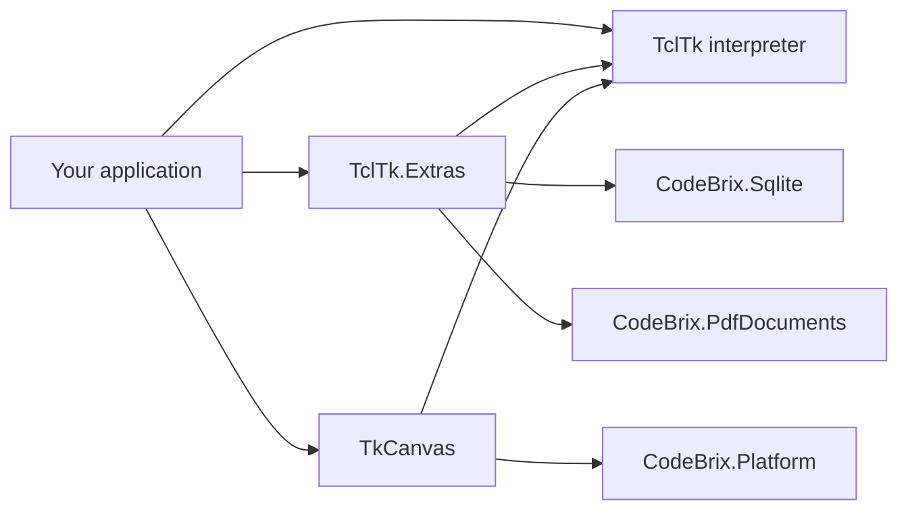

<sub>[CodeBrix](../../README.md) › [Libraries](README.md) › CodeBrix.Platform.TclTk</sub>

# CodeBrix.Platform.TclTk

**A fully managed, cross-platform implementation of the Tcl scripting language - and of the classic Tk widget toolkit - for .NET.** It embeds a complete Tcl interpreter (variables, expressions, commands, procedures, namespaces, and a rich two-way .NET object-interop bridge) directly into your application with no native dependencies, and it can present an unmodified Tcl/Tk program's user interface inside a CodeBrix.Platform window. It is delivered as three libraries and three packages: the interpreter, the interpreter-side `sqlite3` and `pdf4tcl` command extensions, and the Tk widget toolkit drawn on SkiaSharp.

| | |
| --- | --- |
| **Repository** | [ellisnet/CodeBrix.Platform.TclTk](https://github.com/ellisnet/CodeBrix.Platform.TclTk) |
| **Packages** | [`CodeBrix.Platform.TclTk.BsdLicenseForever`](https://www.nuget.org/packages/CodeBrix.Platform.TclTk.BsdLicenseForever)<br>[`CodeBrix.Platform.TclTk.Extras.BsdLicenseForever`](https://www.nuget.org/packages/CodeBrix.Platform.TclTk.Extras.BsdLicenseForever)<br>[`CodeBrix.Platform.TkCanvas.BsdLicenseForever`](https://www.nuget.org/packages/CodeBrix.Platform.TkCanvas.BsdLicenseForever) |
| **License** | BSD-2-Clause for all three, and all three require license acceptance; see [License](#license) |
| **Requires** | .NET 10 or later; displaying a `TkHostView` needs a CodeBrix.Platform application with exactly one platform head package |
| **Use it from** | Any .NET 10 application; the Tk toolkit hosts inside a CodeBrix.Platform application, and also runs fully headless |
| **Platforms** | Windows, Linux and macOS, with no native dependencies |

## What it does

The interpreter package, `CodeBrix.Platform.TclTk.BsdLicenseForever`:

- Creates one or more independent, embeddable `Interpreter` instances in process; the core script library is embedded in the assembly, so there are no files to deploy.
- Evaluates scripts and expressions from C# and hands results and errors back through `ref Result`.
- Reads and writes Tcl variables, scalars and arrays, from managed code.
- Registers custom Tcl commands written in C#, and `[expr]` math functions.
- Exposes .NET objects to scripts and calls back into .NET, in both directions.
- Runs scripts on dedicated script threads, cancels running scripts, hosts the interpreter behind a custom `IHost`, and creates restricted ("safe") child interpreters for untrusted script text.
- Implements the language including namespaces, `upvar`/`uplevel`, arrays, glob/file/open channels, `regexp`/`regsub`, `dict`, `binary` (format and scan, plus base64, hex and uuencode), `tailcall` with stack elimination, `trace`, `[interp]`, `[after]`/`[vwait]`/`[update]`, and `{*}` argument expansion.
- Provides a complete shell entry point, `Interpreter.ShellMain`, so an application can be its own script shell.

The extras package, `CodeBrix.Platform.TclTk.Extras.BsdLicenseForever`:

- Adds a `sqlite3` database command backed by [CodeBrix.Sqlite](CodeBrix.Sqlite.md) and a `pdf4tcl` drawing command set backed by [CodeBrix.PdfDocuments](CodeBrix.PdfDocuments.md), so existing scripts run unmodified.
- Runs the matching `package provide` as part of each registration, so a script that opens with `package require sqlite3` or `package require pdf4tcl` needs no change.
- Writes database files that are interchangeable with files written by stock Tcl applications: the open is neutral, write-ahead logging stays off, foreign-key enforcement is off, and no sidecar files are created.

The toolkit package, `CodeBrix.Platform.TkCanvas.BsdLicenseForever`:

- Reimplements the classic Tk widget toolkit in retained mode, drawn entirely onto a SkiaSharp surface, for CodeBrix.Platform applications and for headless use.
- Provides the Tk window tree and both geometry managers, `pack` and `grid`.
- Provides the classic widget set - frame, labelframe, label, button, entry, text, listbox, treeview, combobox, checkbutton, radiobutton, panedwindow, scrollbar, separator, menus - as typed C# classes.
- Provides the canvas widget with its scene-graph item model (arc, bitmap, image, line, oval, polygon, rectangle, text, window) and the full search and geometry surface: find, bbox, coords, tags, scroll, scan and item bindings.
- Provides the event, `bind`, focus and grab system, `after`/`update` scheduling, photo images, fonts, clipboard, overlay toplevels with a small window manager, message dialogs, color theming, the option database and `ttk::style`.
- Ships `TkHostView`, a ready-made CodeBrix.Platform control hosting a whole Tk tree, plus XAML declaration elements for every widget.
- Ships `TkTclBridge`, which registers the classic Tk command surface on an interpreter so an unmodified Tcl/Tk program presents its UI through this toolkit.
- Renders and measures identically on every platform, because it draws with the font packages it brings with it and never with an operating-system font.
- Runs headless: build a window tree, lay it out and render it to an image with no display.

## When to use it

Use the interpreter alone when you want a scripting language inside a .NET application and nothing native on the machine - a macro language for users, a rules file, a test harness, or an existing body of Tcl that has to keep working. Add the extras package when those scripts expect the `sqlite3` or `pdf4tcl` commands. Add the toolkit package when scripts or C# build a user interface: it brings the interpreter package with it, so there is no need to reference the interpreter separately. The extras and toolkit packages are independent of each other; reference both if you want both.

The interpreter has no Tk, no GUI and no canvas: on its own there is no `button`, `pack`, `wm` or `tk_messageBox`. It does not bundle a native shared library and the managed engine never needs one, and it does not carry tcllib or tklib, so `package require snit` (and friends) fail unless your application supplies the packages. It does not sandbox by default: a default interpreter can read and write files, open sockets and run processes with `[exec]` - see the safe-interpreter concept below.

The extras package does not provide a C# database or PDF API. Its whole C# surface is three registration methods; when you want a database or a PDF from C#, use [CodeBrix.Sqlite](CodeBrix.Sqlite.md) or [CodeBrix.PdfDocuments](CodeBrix.PdfDocuments.md) directly. The database command implements `eval`, `onecolumn`, `changes` and `close` and no open options; the PDF object command implements twelve drawing verbs and no images, curves, circles, text boxes, bookmarks or metadata.

The toolkit has no accessibility bridge, because a fully Skia-drawn UI has no native control tree, and no native operating-system windows: toplevels are Skia overlays inside the host control with their own small window manager. Native file pickers arrive only through `ITkFileDialogProvider`. Its font scope is European scripts - Latin, Latin Extended, Cyrillic, Greek (modern and polytonic), Armenian and Georgian all render, while Hebrew, Arabic, CJK and other non-European scripts are deliberately out of scope and render as tofu; there is no bidirectional text and no complex shaping anywhere in the toolkit. There is no two-way data binding between widgets and view models.

## Getting started

```bash
dotnet add package CodeBrix.Platform.TclTk.BsdLicenseForever
dotnet add package CodeBrix.Platform.TclTk.Extras.BsdLicenseForever
dotnet add package CodeBrix.Platform.TkCanvas.BsdLicenseForever
```

The license suffix is part of the package ID only; there is no package named plain `CodeBrix.Platform.TclTk`. The assemblies and primary namespaces are `CodeBrix.Platform.TclTk` (public API in `_Components.Public`), `CodeBrix.Platform.TclTk.Extras` and `CodeBrix.Platform.TkCanvas`.

```csharp
using CodeBrix.Platform.TclTk._Components.Public;   // Interpreter, Result,
                                                    // ReturnCode, all flag
                                                    // enums, CommandData,
                                                    // Engine, ScriptThread,
                                                    // InterpreterSettings
using CodeBrix.Platform.TclTk._Interfaces.Public;   // ICommand, IExecute,
                                                    // IClientData, IHost,
                                                    // IPlugin, IScriptThread
using CodeBrix.Platform.TclTk._Containers.Public;   // ArgumentList,
                                                    // StringList, TraceList
using CodeBrix.Platform.TclTk._Commands;            // Default (command base)
using CodeBrix.Platform.TclTk._Components.Public.Delegates;
                                                    // ExecuteCallback,
                                                    // EventCallback,
                                                    // TraceCallback,
                                                    // AsynchronousCallback
```

Several folders each contain their own class named `Default` (`_Hosts`, `_Plugins`, `_Traces`, `_Objects`, `_Packages`, `_Policies`), so import only the base you derive from, or alias it: `using TclCommandBase = CodeBrix.Platform.TclTk._Commands.Default;`.

This evaluates a script, reads the result, and reads the error trace after a failure.

```csharp
using System;
using CodeBrix.Platform.TclTk._Components.Public;

Result result = null;
using (Interpreter interpreter = Interpreter.Create(ref result))
{
    if (interpreter == null)
        throw new InvalidOperationException("create failed: " + result);

    int errorLine = 0;
    ReturnCode code = interpreter.EvaluateScript(
        "proc square {x} { expr {$x * $x} }\nsquare 12", ref result, ref errorLine);

    if (code == ReturnCode.Ok)
        Console.WriteLine(result);                 // 144
    else
        Console.WriteLine("error at line {0}: {1}", errorLine, result);

    code = interpreter.EvaluateScript("error {custom failure}", ref result);
    // code == ReturnCode.Error, result == "custom failure"
    Result info = null, error = null;
    interpreter.GetVariableValue("::errorInfo", ref info, ref error);
    Console.WriteLine(info);                       // stack trace text
}
```

Script errors never throw: the `ReturnCode` is the status signal and the `Result` carries the value or the message.

## Key concepts

### Which package to reference



The interpreter's own dependency list is one Microsoft first-party package used for signature verification, `System.Security.Cryptography.Pkcs`. The extras package adds `CodeBrix.Sqlite.ApacheLicenseForever` and `CodeBrix.PdfDocuments.MitLicenseForever`; do not add a second SQLite provider package. The toolkit package adds SkiaSharp, `CodeBrix.Imaging.ApacheLicenseForever`, `CodeBrix.Platform.ApacheLicenseForever`, `CodeBrix.Platform.SkiaSharp.Views.MitLicenseForever` and the three font packages `CodeBrix.Platform.Fonts.RobotoMono.OflLicenseForever`, `CodeBrix.Platform.Fonts.Roboto.OflLicenseForever` and `CodeBrix.Platform.Fonts.Merriweather.OflLicenseForever`. Do not add a second SkiaSharp package reference: the toolkit pins the SkiaSharp line the CodeBrix.Platform Skia heads use.

### Creating and disposing an interpreter

`Interpreter` is `IDisposable` and must always be disposed; after `Dispose` every member throws and `interpreter.Disposed` is true. The everyday overload is `static Interpreter Create(ref Result result, BooleanResultMode compatMode = BooleanResultMode.EagleCompat)`, which uses `CreateFlags.Default` (`ShellUse | Initialize`) and returns null on failure with the reason in `result`. Because the default flags include `ThrowOnError`, a failure inside script-library initialization can surface as an exception instead of null - handle both.

Other overloads add the arguments that become `::argv`, explicit `CreateFlags` and `HostCreateFlags`, a `TraceList`, a library path, an initial script, a list seeding `::auto_path`, and an `IInterpreterSettings`. `InterpreterSettings` exposes the whole creation recipe as read/write properties - `Args`, `Culture`, `CreateFlags`, `HostCreateFlags`, `InitializeFlags`, `ScriptFlags`, `InterpreterFlags`, `PluginFlags`, `Host`, `Profile`, `Policies`, `Traces`, `Text`, `LibraryPath`, `AutoPathList`, `RuleSet` and four opaque objects - with `LoadFrom` and `SaveTo` for persistence.

```csharp
IInterpreterSettings settings = InterpreterSettings.CreateDefault();
settings.CreateFlags = CreateFlags.SafeEmbeddedUse;
settings.HostCreateFlags = HostCreateFlags.SafeEmbeddedUse;
Result result = null;
using Interpreter safe = Interpreter.Create(settings, false, ref result);
if (safe == null) throw new InvalidOperationException(result);
Console.WriteLine(safe.IsSafe());   // True
```

The named flag sets are `Default = ShellUse | Initialize`, `EmbeddedUse = CommonUse | Initialize | ThrowOnError`, `SafeEmbeddedUse = EmbeddedUse | SafeAndHideUnsafe`, `SingleUse = EmbeddedUse & ~ThrowOnError`, `SafeSingleUse`, `LeanAndMeanUse`, `FastSingleUse` and `FastSafeSingleUse`. The individual `No...` bits (`NoLibrary`, `NoPlugins`, `NoCommands`, `NoVariables`, `NoObjects`, `NoFunctions`, `NoOperators`, `NoCorePolicies`, `NoCoreTraces` and the rest) are for embedders who want a smaller interpreter.

### Result and ReturnCode

`ReturnCode` carries the five standard Tcl codes - `Ok = 0, Error = 1, Return = 2, Break = 3, Continue = 4` - plus `WhatIf`, `Exception`, `Invalid` and the `Convert*` codes. Treat anything other than `Ok` as failure unless you are implementing control flow.

`Result` is the boxed script value or error message. It converts implicitly *to* `Result` from `string`, `int`, `long`, `bool`, `double`, `decimal`, `byte`, `byte[]`, `char`, `DateTime`, `TimeSpan`, `Guid`, `Uri`, `Version`, `Exception`, `Enum`, `BigInteger`, `StringBuilder`, `StringList`, `StringPairList`, `StringDictionary`, `ObjectDictionary`, `ResultList`, `Argument` and `Interpreter`, and implicitly *from* `Result` to `string`. It also carries `Value`, `String`, `Length`, `ReturnCode`, `PreviousReturnCode`, `ErrorLine`, `ErrorCode`, `ErrorInfo`, `Exception`, `Flags` and `ClientData`. A null `Result` is legal - it means "no result yet" - so null-check before `ToString()`. The pattern is to declare `Result result = null;` once, pass it by `ref`, and reuse it.

### Evaluating scripts and expressions

`EvaluateScript(text, ref result)` has overloads adding `ref int errorLine`, `EngineFlags`, a file name that labels `::errorInfo`, or an `IScript` built with `Script.Create`. `EvaluateExpression("6 * 7")` evaluates an `[expr]` expression without the surrounding command. `EvaluateFile` is the equivalent of `[source]`, and `EvaluateStream(name, textReader, ref result)` reads from an embedded resource or a network stream. `SubstituteString` gives `[subst]` semantics from C#, and `Invoke(name, clientData, arguments, ref result)` invokes one command directly with no parsing, with `arguments[0]` as the command name. Asynchronous forms take an `AsynchronousCallback` and run the script on a pool thread. The same entry points exist as statics on `Engine`, which also owns the cancellation statics.

### Variables

`SetVariableValue`, `GetVariableValue`, `UnsetVariable`, `DoesVariableExist` and `AddVariable` each have a `VariableFlags` overload, and `WaitVariable` is `[vwait]` from C#. Names follow Tcl resolution: `"x"` resolves in the current frame (global when called from outside a procedure) and `"::ns::x"` is fully qualified. A value set from C# is an ordinary Tcl string, so `incr counter 5` on a variable set to `"10"` yields 15. For array elements and whole arrays the dependable route from C# is script text - `set a(k) v`, `array get a`, `array set a {...}` - through `EvaluateScript`.

### Custom Tcl commands

The command contract is `IExecute`; a full command also carries identity, flags and state through `ICommand`.

```csharp
public interface IExecute
{
    ReturnCode Execute(Interpreter interpreter, IClientData clientData,
        ArgumentList arguments, ref Result result);
}
public interface ICommand : ICommandData, IState, IDynamicExecuteCallback,
    IExecute, IEnsemble, IPolicyEnsemble, ISyntax, IUsageData { }
```

Do not implement `ICommand` by hand: derive from the shipped base class `CodeBrix.Platform.TclTk._Commands.Default`, which implements every member with sensible defaults and leaves you one virtual to override. The identity object is `CommandData(name, group, description, clientData, typeName, flags, plugin, token)`. `ArgumentList` is the word list of the invocation *including the command name at index 0*, and `Argument` converts implicitly to and from `string`, so `string x = arguments[1];` works.

Register with `AddCommand(command, clientData, ref token, ref result)` and, usually, `ProvidePackage(name, version, ref result)` so scripts can `package require` it. `AddIExecute` registers a delegate-backed command instead. To return a Tcl list, build a `StringList` and assign it to `result`; to return an error, assign the message and return `ReturnCode.Error`, and the engine fills `::errorInfo`. Nested evaluation from inside `Execute` is another `EvaluateScript` call - the engine is re-entrant.

### Safe interpreters and policies

Policies decide, per command execution, whether a command may run; they are the mechanism behind safe interpreters and custom sandboxes. `AddPolicy` takes an `ExecuteCallback` or an `IPolicy`, and `PolicyDecision` answers `None, Undecided, Denied, Approved, Continue, Pending, Stop, Success, Unknown, Failure`.

There are three routes to a restricted interpreter: create one with `CreateFlags.SafeEmbeddedUse` and `HostCreateFlags.SafeEmbeddedUse`; convert an existing one with `MakeSafe(makeFlags, safe, ref error)`, checking `IsSafe()` and `IsStandard()`; or create a child with `CreateChildInterpreter(...)` or, in script, `[interp create -safe child]` - the full `[interp]` ensemble is implemented, including `cancel`, `resetcancel` and `issafe`.

```csharp
Result r = null;
using Interpreter sandbox = Interpreter.Create(
    null, CreateFlags.SafeEmbeddedUse, HostCreateFlags.SafeEmbeddedUse, ref r);
ReturnCode c = sandbox.EvaluateScript("file delete /etc/passwd", ref r);
// c == ReturnCode.Error: the unsafe [file] subcommands are hidden
```

Commands you register yourself are absent from a safe interpreter unless their `CommandFlags` include `Safe`. Alias a trusted parent command into the child rather than flagging arbitrary commands `Safe`.

### Cancellation

From another thread while `EvaluateScript` is running, call `CancelEvaluate(result, cancelFlags, ref error)` - the `result` is the message the canceled evaluation returns, defaulting to `"eval canceled"` - or `CancelAnyEvaluate(...)`, and `ResetCancel` afterwards. `CancelFlags.Cancel` is cooperative: the running script sees an error at its next command boundary. `Unwind` unwinds the whole evaluation and `[catch]` cannot swallow it. The script-side equivalents are `[interp cancel ?-unwind? ?path? ?result?]` and `[interp resetcancel]`. Cancellation is checked at each command's readiness check, so it does not fire promptly while `ProductionMode` is on.

### Script threads and the threading rules

A `ScriptThread` is a dedicated operating-system thread that owns its own interpreter and serially processes work you send to it - the right tool for "run this Tcl in the background and marshal results back", and the pattern the toolkit's Tcl bridge uses for hosted Tcl/Tk applications.

```csharp
Result error = null;
using (IScriptThread worker = ScriptThread.Create(null, ref error))
{
    if (worker == null) throw new InvalidOperationException(error);
    Result result = null;
    worker.Send("proc fib {n} { expr {$n < 2 ? $n : [fib [expr {$n-1}]] + [fib [expr {$n-2}]]} }; fib 20", ref result);
    Console.WriteLine(result);   // 6765
}
```

`Send` is synchronous; `Queue(callback, clientData)` and `Queue(dateTime, callback, clientData)` are asynchronous. `ScriptThread` is `IDisposable`, and disposing it stops the thread and disposes its interpreter. For a plain `Interpreter` the rule is one interpreter, one thread at a time: interleaving two evaluations on one interpreter from two threads is not a supported pattern, and creating several interpreters concurrently is also discouraged, because the engine keeps process-global state.

### Events, timers and the event loop

`after`, `vwait` and `update` are implemented, and the queue behind them is `IEventManager` on `interpreter.EventManager`; from C#, `QueueScript(dateTime, text, ref error)` adds to it. Queued scripts and `[after]` callbacks run when the script calls `[vwait]` or `[update]`, or when a `ScriptThread` services its queue: there is no hidden background pump on a plain `Interpreter`. The toolkit package supplies a UI-thread dispatcher for `after` and `update` when it is hosting a Tk UI.

### Hosts and the shell

A host is the interpreter's console and I/O surface: `[puts]` to standard output, prompts, title, colors, "read line". `IHost` is the union of `IDisplayHost`, `IInteractiveHost`, `IFileSystemHost`, `IThreadHost`, `IProcessHost`, `IStreamHost` and `IDebugHost`. The shipped hosts in `CodeBrix.Platform.TclTk._Hosts` are `Console` (the real process console, which is what `Create(ref Result)` gives when a console exists), `Diagnostic`, `Null` (discards everything - headless services and tests), `Fake` and `Wrapper`, plus the abstract chain `Default -> Engine -> File -> Profile -> Shell -> Core`, of which `Core` is the usual base to derive from.

A `[puts]` with no channel goes to the host's `Write`, so redirecting script output into your application means either a custom host or a Tcl channel of your own. `Interpreter.ShellMain(args)` is a complete shell entry point, so an application can be its own script shell in three lines, and `Interpreter.InteractiveLoop` runs the read-evaluate-print loop over an interpreter you already have.

### Bridging .NET objects into scripts

`AddObject(...)` exposes a .NET object to script under a name, with reference counting through `IObject.AddReference()` and `RemoveReference()`. `ObjectFlags` covers `Locked`, `Safe`, `NoDispose`, `AutoDispose`, `AllowExisting`, `ForceNew`, `ForceDelete`, `AddReference`, `SharedObject` and `NullObject`; objects with a non-zero reference count are disposed when the last reference goes, or when the interpreter is disposed, unless `NoDispose` is set. From script, the `[object]` ensemble covers `create, invoke, invokeall, invokeraw, load, dispose, members, import, declare, get, alias, exists, isnull, isoftype, isdisposed, interfaces, list, search, assemblies, addreference, removereference, resolve, strongname, hash, foreach, lmap, fromvar, flags`.

```tcl
object load System.Text.RegularExpressions   ;# by assembly name
set sb [object create System.Text.StringBuilder]
object invoke $sb Append "hello"
object invoke $sb Length                     ;# property read
object invoke System.Math Max 3 7            ;# static call -> 7
object dispose $sb
```

Type resolution uses the assemblies already loaded plus `[object load]`, and `[object import System.IO]` shortens type names. Method arguments are converted from their Tcl strings by the engine's binder, and ambiguous overloads are resolved by argument count and convertibility. The whole `[object]` surface is removed by `CreateFlags.NoObjects`.

### Traces

The script-side `[trace]` command is complete: `trace add`, `remove` and `info` for variable (read, write, unset, array), command (rename, delete) and execution traces. From C#, a trace is a `TraceCallback` or an `ITrace`; derive from `_Traces.Default` and override `Execute(BreakpointType, Interpreter, ITraceInfo, ref Result)`. Attach traces at variable creation or set, or interpreter-wide through the `TraceList` parameter of `Interpreter.Create`.

```csharp
AddVariable(VariableFlags.None, "watched", new TraceList { trace },
    false, ref error);
SetVariableValue(VariableFlags.None, "watched", "1",
    new TraceList { trace }, ref error);
```

Returning `ReturnCode.Error` from `Execute` aborts the access with your message, and setting `traceInfo.NewValue` on a `BeforeVariableSet` rewrites the value.

### Boolean result rendering

By default the engine renders a boolean *result* as `"True"`/`"False"` rather than the canonical `"1"`/`"0"`. This applies to a boolean-valued `[expr]` and to boolean-returning commands: `string equal`, `info complete`, `interp exists`, `interp issafe`, `dict exists`, `package vsatisfies`, `eof` and `fblocked`. Boolean *contexts* are unaffected either way - `[if]`, `[while]`, the `&&`/`||` short-circuit operators and the ternary all coerce the value to an actual boolean, so conditionals always behave correctly. The divergence matters only when code treats a boolean result as a literal string: a `[switch]` on a computed flag, a string-identity comparison, or a boolean written into a data file, generated source or a UI string.

Choose the mode once, at creation; it cannot be changed afterwards, so nothing can flip it mid-run and desynchronize your scripts.

```csharp
Result r = null;
using Interpreter interp = Interpreter.Create(
    ref r, BooleanResultMode.TclshCompat);
```

`BooleanResultMode.EagleCompat` is the default that every other `Create` overload yields; `BooleanResultMode.TclshCompat` gives the canonical rendering. `Interpreter.BooleanResultMode` has a getter and no setter.

### Performance switches

`ProductionMode` (default false) sets the engine's fast mask: it skips the per-command readiness check, debugger breakpoint checks, change notifications, callback-queue processing, argument caching, usage counters and previous-result tracking, and results are byte-identical. The trade-off is that cancellation is no longer prompt. Setting it back to false clears every fast-mask bit, including any you set individually through `EngineFlags`.

`CacheParsedScripts` (default false) caches the tokenized form of any script text evaluated more than once - procedure bodies, loop, `if`, `catch` and `switch` bodies, bracketed substitutions - from its second evaluation onward, and entries live for the interpreter's lifetime. Results, error messages, error line numbers and cancellation are unchanged. It can be toggled at any time; turning it off stops lookups but keeps existing entries.

### The extras command surface

`TclTkExtras` is the whole C# surface of the extras package: `RegisterAll(interpreter, ref error)`, `RegisterSqlite3(...)` and `RegisterPdf4Tcl(...)`. All three report failure through the return code rather than by exception (a null interpreter is an `ArgumentNullException`), and anything other than `ReturnCode.Ok` means the interpreter is only partially extended - treat that as fatal for that interpreter. Registration is per interpreter instance, child interpreters included, and registering twice on one interpreter fails with `can't add sqlite3: command already exists`.

`sqlite3 HANDLE FILENAME` takes exactly two arguments, opens or creates the database (`:memory:` is accepted) and registers `HANDLE` as a new Tcl command with four verbs: `eval SQL` (a flat Tcl list of every column of every row), `eval SQL SCRIPT` (per row, one scalar variable per column in the caller's frame, then the script; `break` stops the loop, `continue` skips a row), `onecolumn SQL`, `changes` and `close`. Any other verb fails with `bad option "X": must be changes, close, eval, or onecolumn`.

The SQL text is passed through verbatim and never rewritten. Parameters of the forms `:name`, `@name` and `$name` are found by a scanner that skips string literals, quoted or bracketed identifiers and comments, and each resolves from the Tcl variable of that name in the caller's frame:

- an unset (or unreadable) variable binds SQL NULL
- a variable set to `""` binds `''` as TEXT, not NULL
- a value whose internal representation is a boxed integer, real or boolean binds INTEGER or REAL
- any string-represented value binds TEXT, even when it looks numeric: `"007"` stays `"007"` and `"1.10"` stays `"1.10"` - values are never sniffed into numbers
- a `byte[]` value binds BLOB

Reading back, NULL becomes `""`, INTEGER becomes decimal text, REAL uses Tcl-style rendering (lower-case exponent, integral reals with `.0`), and BLOB is its bytes decoded as UTF-8.

`pdf4tcl::new NAME ?option value ...?` creates a document and registers `NAME` as its object command, taking `-paper`, `-landscape`, `-margin`, `-orient`, `-unit` and `-file` (`-rotate` and `-compress` are accepted and ignored). `pdf4tcl::loadBaseTrueTypeFont` reads a `.ttf` file into a process-wide base-font store and `pdf4tcl::createFont` makes a name usable by `setFont`. The object command has twelve verbs: `startPage`, `setFillColor`, `setStrokeColor`, `setFont`, `setLineStyle`, `getStringWidth`, `text`, `line`, `rectangle`, `polygon`, `write` and `destroy`. User coordinates are relative to the margin box and scaled by `-unit`; with `-orient 1` (the default) the origin is top left and y grows down, and with `-orient 0` the origin is bottom left and y grows up.

### Building a Tk UI two ways

The first path declares the UI in XAML, which is preferred for CodeBrix.Platform applications: nest `Tk*` declaration elements inside a `TkHostView`, and the host materializes the real widget tree when it loads. Every element exposes its materialized widget (`NameEntry.EntryWidget`, `Output.TextWidget`), null until the host loads, and setting a declared property after load reconfigures the live widget.

The second path builds the UI in code, which is what generated and dynamic UIs, headless hosts and the Tcl bridge itself do: create `TkWindow`s under a root, attach a widget class to each, and lay them out with `PackLayout` or `GridLayout`. The two paths mix freely.

Either way, a widget *owns* a `TkWindow` (composition, mirroring Tk's window and widget split) and every widget class takes its `TkWindow` in the constructor. Options are Tk option names passed through `widget.Configure(dictionary)` - `"-text"`, `"-background"` and the rest - and unknown but valid options are accepted and stored rather than throwing, which is the toolkit-wide accept-and-store discipline. Geometry reads are final right after `tree.Scheduler.UpdateIdleTasks()`, or `TkLayout.Update(root)` when headless.

### TkHostView, the host control

`public sealed class TkHostView : Grid` creates the root window and tree and wires the dispatcher, clipboard and text-input bridges, the Skia surface and pointer routing. It exposes `TkWindow Root` (the Tk root window `"."`), `WindowTree Tree`, `string Theme` (a dependency property; unknown names are ignored), `TkTheme ThemePalette`, `string OptionsDatabase` (one `"pattern value ?priority?"` Tcl list per line, applied before the declared UI materializes), `Invalidate()`, `RequestUpdate()`, `GetGroupVariable(group)`, `NextAutoName()` and `FindTkElement(name)`.

The host owns rendering, pointer routing with double-click and wheel, all keyboard routing through a hidden input element (entry and text typing, and input-method composition), the operating-system clipboard bridge, the dispatcher bridge for `after` timers and the synchronous `update` flush, and the host-resize pipeline - root geometry follows the control, `pack` and `grid` re-run, and overlays re-clamp.

### Geometry, events and scheduling

`PackOptions` carries `Side`, `Anchor`, `Fill`, `Expand`, the padding members and `In`/`Before`/`After`; `GridOptions` carries `Row`, `Column`, `RowSpan`, `ColumnSpan`, `Sticky`, the padding members and `In`. `PackLayout` and `GridLayout` expose the matching statics (`Configure`, `Forget`, `Info`, `Content`, propagation, and `ColumnConfigure`/`RowConfigure`/`Size`/`Anchor` for grid). Pack is Tk's cavity model and grid is Tk's constraint solver; both honor the per-container exclusivity rule and both propagate.

Events go through `WindowTree` (`tree.DispatchEvent`, `PointerEvent`, `KeyEvent`, `VirtualEvent`, `SetFocus`, `FocusNext`, `HitTest`) and a `BindingTable` keyed by bind tag. `EventPattern.Parse` accepts Tk's forms - `<Type>`, `<Modifier-...-Type-Detail>`, `<1>` and `<Double-1>` button shorthand, and virtual `<<Name>>`. Dispatch walks the window's bind tags, the most specific matching binding fires per tag, and a handler returning `DispatchResult.Break` stops the walk.

`TkScheduler` on `tree.Scheduler` owns `After`, `AfterIdle`, `CancelAfter`, `ScheduleIdle`, `ScheduleRelayout`, `ScheduleRepaint`, `UpdateIdleTasks()` (a synchronous flush of relayout, repaint and idle work) and `Update()` (that plus due timers and the host pump). Its `Host` is an `ITkDispatcher` (null when headless) and its `TimeSource` is a swappable clock, which is how `after` becomes deterministic in tests.

### Fonts

The toolkit never resolves a font from the host machine. A toolkit that measures its own layout cannot depend on the machine's font set, because the same script must produce the same geometry on a development box and in a stripped container, so all three generic families come out of the font packages the toolkit brings with it: monospace, sans-serif and serif each map to a packaged face, with a per-glyph fallback chain behind it for Armenian and Georgian.

A missing *primary* font file throws an `InvalidOperationException` naming the file, everywhere it looked, and both ways out - it does not quietly borrow a host font. A missing *fallback* file is skipped rather than fatal. A code point no face in the chain carries maps to glyph 0 and paints the font's tofu box identically on every operating system. A family the toolkit does not ship is served by a packaged face rather than by the host, and the named families that map to a generic (`helvetica` and `arial` to sans-serif, `courier` to monospace, `times` to serif) resolve as usual.

Two escape hatches exist. `tree.Fonts.AllowSystemFontFallback = true` is the only way a system font is ever reached, and it must be set before anything renders, because resolved faces are cached and are not re-resolved. `FontManager.AddFontDirectory(directory)` points the toolkit at packaged fonts that live somewhere else, and does not enable host fonts.

> [!NOTE]
> The monospace face comes out of the `CodeBrix.Platform.Fonts.RobotoMono.OflLicenseForever` package, which bundles several monospace families, and it is deliberately not the family the package ID is named for. Do not "fix" the reference by switching packages.

### The Tcl command bridge

`TkBootstrap.Register(interpreter, ref error)` sets `::tk_version` and `::tk_patchLevel` and provides the Tk and Img packages, so `package require Tk` and version gates pass. `TkTclBridge` then registers the classic Tk command surface, in one of two modes:

- `TkTclBridge.Register(interpreter, tree)` is **direct** mode: everything runs on the calling thread, which suits headless use and tests, and `bind` and `-command` scripts run inline as in real Tk.
- `TkTclBridge.RegisterHosted(interpreter, tree)` is **hosted** mode: the interpreter moves to a dedicated Tcl worker thread, Tk command bodies marshal synchronously to the UI thread through `tree.Scheduler.Host` (which must be set - `TkHostView` sets it, and otherwise this throws), and UI callbacks post their scripts back to the Tcl thread. Modal commands park the Tcl thread while the UI stays live.

The bridge exposes `BackgroundError` (the Tcl error text of a failed callback script), `FileDialogs` (an `ITkFileDialogProvider`; null means the picker commands raise Tcl errors), `ModalAutoResponder` (an optional auto-answer for the modal dialog commands in scripted runs), `PostScript(script)` for fire-and-forget evaluation, and `Post(work)` - the only correct way to touch a hosted interpreter. The registered surface covers widget creation and the `ttk::` forms, `pack` and `grid`, `bind` and `bindtags` with Tk's `%` substitution, `wm`, `winfo`, `destroy`, `focus`, `grab`, `raise` and `lower`, `image`, `font`, `clipboard`, `option`, `ttk::style`, the palette appliers, the dialog commands as Skia overlays, and `after`, `update` and `update idletasks`.

## Examples

A custom Tcl command, from the class through registration to use.

```csharp
using System;
using CodeBrix.Platform.TclTk._Commands;
using CodeBrix.Platform.TclTk._Components.Public;
using CodeBrix.Platform.TclTk._Containers.Public;
using CodeBrix.Platform.TclTk._Interfaces.Public;

internal sealed class GreetCommand : Default
{
    public GreetCommand(ICommandData commandData)
        : base(commandData)
    {
    }

    public override ReturnCode Execute(
        Interpreter interpreter, IClientData clientData,
        ArgumentList arguments, ref Result result)
    {
        if (interpreter == null)
        {
            result = "invalid interpreter";
            return ReturnCode.Error;
        }
        if (arguments == null || arguments.Count < 1 || arguments.Count > 2)
        {
            result = "wrong # args: should be \"greet ?name?\"";
            return ReturnCode.Error;
        }

        string name = (arguments.Count == 2) ? arguments[1] : "world";
        result = "hello, " + name;      // string -> Result
        return ReturnCode.Ok;
    }
}

internal static class GreetRegistration
{
    public static ReturnCode Register(Interpreter interpreter, ref Result error)
    {
        var command = new GreetCommand(
            new CommandData(
                "greet", "demo", "Says hello.", null,
                typeof(GreetCommand).FullName, CommandFlags.None, null, 0));

        long token = 0;
        ReturnCode code = interpreter.AddCommand(command, null, ref token, ref error);
        if (code != ReturnCode.Ok) { return code; }

        return interpreter.ProvidePackage("greet", new Version(1, 0), ref error);
    }
}

// Usage
Result result = null;
using (Interpreter interpreter = Interpreter.Create(ref result))
{
    Result error = null;
    if (GreetRegistration.Register(interpreter, ref error) != ReturnCode.Ok)
        throw new InvalidOperationException(error);

    interpreter.EvaluateScript("package require greet; greet Tcl", ref result);
    Console.WriteLine(result);   // hello, Tcl
}
```

Registering the extras commands and running a database script end to end, including caller-scope parameter binding and the per-row script form of `eval`.

```csharp
using System;
using CodeBrix.Platform.TclTk._Components.Public;
using CodeBrix.Platform.TclTk.Extras;

internal static class Program
{
    private static int Main()
    {
        Result created = null;
        using (Interpreter interpreter = Interpreter.Create(ref created))
        {
            if (interpreter == null)
            {
                Console.Error.WriteLine("interpreter: " + created);
                return 1;
            }

            Result error = null;
            ReturnCode code = TclTkExtras.RegisterAll(interpreter, ref error);
            if (code != ReturnCode.Ok)
            {
                Console.Error.WriteLine("extras: " + code + " " + error);
                return 1;
            }

            const string script = @"
                package require sqlite3
                sqlite3 db :memory:
                db eval {create table people (id integer primary key,
                                              name text, code text)}
                set name Ada
                set codeText 007
                db eval {insert into people (name, code)
                         values (:name, :codeText)}
                set rows {}
                db eval {select id, name, code from people} {
                    lappend rows ""$id $name $code""
                }
                set count [db onecolumn {select count(*) from people}]
                db close
                return ""$count: $rows""
            ";

            Result result = null;
            code = interpreter.EvaluateScript(script, ref result);
            if (code != ReturnCode.Ok)
            {
                Console.Error.WriteLine("tcl error: " + result);
                return 1;
            }
            Console.WriteLine(result);   // 1: {1 Ada 007}
            return 0;
        }
    }
}
```

The C# verbatim string doubles the quotes; `007` round-trips as TEXT because the Tcl value is string-represented.

Declaring a Tk UI in XAML inside a `TkHostView`.

```xml
<Page x:Class="MyApp.Views.MainPage"
      xmlns="http://schemas.microsoft.com/winfx/2006/xaml/presentation"
      xmlns:x="http://schemas.microsoft.com/winfx/2006/xaml"
      xmlns:vm="using:MyApp.ViewModels"
      xmlns:tkhost="using:CodeBrix.Platform.TkCanvas.Hosting"
      xmlns:tk="using:CodeBrix.Platform.TkCanvas.Xaml">
  <Page.DataContext><vm:MainViewModel /></Page.DataContext>

  <tkhost:TkHostView x:Name="TkHost" Theme="DarkNew">
    <tk:TkPhoto Name="backIcon" File="Assets/tk-back.gif" />

    <tk:TkMenubar Side="Top" Fill="X">
      <tk:TkMenu Label="File" Underline="0">
        <tk:TkMenuItem Label="New" Accelerator="Ctrl+N"
                       Command="{Binding NewCommand}" />
        <tk:TkMenuSeparator />
        <tk:TkMenuItem Label="About" Command="{Binding AboutCommand}" />
      </tk:TkMenu>
    </tk:TkMenubar>

    <tk:TkFrame Side="Top" Fill="X" Relief="raised" BorderWidth="1">
      <tk:TkButton Side="Left" Image="backIcon" Relief="flat"
                   BorderWidth="0" Command="{Binding BackCommand}" />
      <tk:TkButton Side="Left" Text="Greet"
                   Command="{Binding GreetCommand}" />
    </tk:TkFrame>

    <tk:TkFrame Side="Top" Fill="X">
      <tk:TkLabel Side="Left" Text="Name:" PadX="4" />
      <tk:TkEntry x:Name="NameEntry" Side="Left" Fill="X" Expand="True" />
    </tk:TkFrame>

    <tk:TkFrame Side="Top" Fill="X" PadY="2">
      <tk:TkCheckbutton Side="Left" Text="Verbose"
                        Command="{Binding VerboseCommand}" />
      <tk:TkRadiobutton Side="Left" Text="Edit" Group="mode" Value="edit"
                        Checked="True" Command="{Binding ModeCommand}" />
      <tk:TkRadiobutton Side="Left" Text="View" Group="mode" Value="view"
                        Command="{Binding ModeCommand}" />
    </tk:TkFrame>

    <tk:TkScrollbar Side="Right" Fill="Y" Orient="vertical" For="Output" />
    <tk:TkText x:Name="Output" Fill="Both" Expand="True"
               WidthChars="60" HeightLines="12" />
  </tkhost:TkHostView>
</Page>
```

That is the whole view. Because there is deliberately no live two-way binding between widget state and view-model properties, the code-behind hands the view model the two accessors it needs and nothing more.

```csharp
public sealed partial class MainPage : Page
{
    public MainPage()
    {
        DataContextChanged += (s, e) =>
        {
            if (DataContext is ITkWidgetBridge bridge)
            {
                bridge.GetEntryText = () => NameEntry.EntryWidget?.Text ?? "";
                bridge.AppendOutputLine = line =>
                {
                    Output.TextWidget?.Insert("end - 1 chars", line + "\n");
                    TkHost.RequestUpdate();
                };
            }
        };
        InitializeComponent();
    }
}
```

Headless: build a tree, lay it out, render it to a PNG, and drive it with synthetic input - no display and no head.

```csharp
using SkiaSharp;
using CodeBrix.Platform.TkCanvas.Rendering;

TkWindow root = TkWindow.CreateRoot();
root.SetForcedSize(320, 200);
TkWindow w = root.CreateChild("b");
new ButtonWidget(w).Configure(new Dictionary<string, string> { { "-text", "Hi" } });
PackLayout.Configure(w, new PackOptions { Side = Side.Top });
TkLayout.Update(root);

using (var surface = SKSurface.Create(new SKImageInfo(320, 200)))
{
    TkRenderer.Render(root, surface.Canvas);
    using (SKImage image = surface.Snapshot())
    using (SKData png = image.Encode(SKEncodedImageFormat.Png, 100))
    {
        System.IO.File.WriteAllBytes("tk.png", png.ToArray());
    }
}

// synthetic input, same tree:
root.Tree.PointerEvent(TkEventType.ButtonPress, 20, 10, button: 1);
root.Tree.PointerEvent(TkEventType.ButtonRelease, 20, 10, button: 1);
root.Tree.KeyEvent(TkEventType.KeyPress, "Return", "\r");
```

## Using it in a CodeBrix.Platform application

A Tk-hosting application has the ordinary CodeBrix.Platform shape: a `.Core` class library holding view models and the toolkit package, a `.UI` shared project (`.shproj` with its `.projitems`) holding `App.xaml` and the views, and one head project per platform head with exactly one head package each.

```xml
<!-- MyApp.Core/MyApp.Core.csproj -->
<Project Sdk="Microsoft.NET.Sdk">
  <PropertyGroup>
    <TargetFramework>net10.0</TargetFramework>
    <RootNamespace>MyApp</RootNamespace>
    <!-- CodeBrix.Platform needs these for conditional compilation -->
    <DefineConstants>$(DefineConstants);HAS_CODEBRIX;HAS_CODEBRIX_WINUI</DefineConstants>
  </PropertyGroup>
  <ItemGroup>
    <PackageReference Include="CodeBrix.Platform.ApacheLicenseForever" Version="..." />
    <PackageReference Include="CodeBrix.Platform.Fonts.OpenSans.ApacheLicenseForever" Version="..." />
    <PackageReference Include="CodeBrix.Platform.TkCanvas.BsdLicenseForever" Version="..." />
  </ItemGroup>
</Project>
```

```xml
<!-- MyApp.LinuxX11/MyApp.LinuxX11.csproj -->
<Project Sdk="Microsoft.NET.Sdk">
  <PropertyGroup>
    <TargetFramework>net10.0</TargetFramework>
    <OutputType>Exe</OutputType>
    <DefineConstants>$(DefineConstants);HAS_CODEBRIX;HAS_CODEBRIX_WINUI</DefineConstants>
  </PropertyGroup>
  <ItemGroup>
    <Page Include="**\*.xaml" Exclude="bin\**\*.xaml;obj\**\*.xaml" />
    <None Remove="**\*.xaml" />
  </ItemGroup>
  <Import Project="..\MyApp.UI\MyApp.UI.projitems" Label="Shared" />
  <ItemGroup>
    <ProjectReference Include="..\MyApp.Core\MyApp.Core.csproj" />
  </ItemGroup>
  <ItemGroup>
    <!-- EXACTLY ONE platform head package per head project -->
    <PackageReference Include="CodeBrix.Platform.Runtime.Skia.X11.ApacheLicenseForever" Version="..." />
  </ItemGroup>
</Project>
```

```csharp
// MyApp.LinuxX11/Program.cs
using System;
using CodeBrix.Platform.UI.Hosting;

internal class Program
{
    [STAThread]
    public static void Main(string[] args)
    {
        var host = CodeBrixPlatformHostBuilder.Create()
            .App(() => new App())
            .UseLinuxX11()
            .Build();
        host.Run();
    }
}
```

Other heads swap only the head package and the `UseXxx()` call: `UseLinuxWayland`, `UseLinuxFrameBuffer`, `UseMacOS`, `UseWin32Skia`, `UseWpfSkia`. For a Tcl-driven UI, the page is an empty `TkHostView` and the boot sequence below.

```csharp
using System;
using System.Threading.Tasks;
using CodeBrix.Platform.TclTk._Components.Public;
using CodeBrix.Platform.TkCanvas;
using CodeBrix.Platform.TkCanvas.Hosting;
using CodeBrix.Platform.TkCanvas.Tcl;

// In the page: Loaded += (s, e) => StartTcl(TkHost);  Unloaded => Dispose
private Interpreter _interpreter;
private TkTclBridge _bridge;

private void StartTcl(TkHostView host)       // UI thread, host loaded
{
    var tree = host.Tree;
    Task.Run(() =>
    {
        Result r = null;
        _interpreter = Interpreter.Create(ref r);
        if (_interpreter == null) { Console.Error.WriteLine(r); return; }

        Result error = null;
        if (TkBootstrap.Register(_interpreter, ref error) != ReturnCode.Ok)
        {
            Console.Error.WriteLine("TkBootstrap: " + error); return;
        }
        // (optional) TclTkExtras.RegisterAll(_interpreter, ref error);

        _bridge = TkTclBridge.RegisterHosted(_interpreter, tree);
        _bridge.FileDialogs = new TkHostFileDialogs();
        _bridge.BackgroundError += message =>
                Console.Error.WriteLine("bgerror: " + message);

        // From here on, touch the interpreter ONLY through Post:
        _bridge.Post(interp =>
        {
            Result result = null;
            if (interp.EvaluateScript("source {app.tcl}", ref result) != ReturnCode.Ok)
            {
                Console.Error.WriteLine("app.tcl: " + result);
            }
        });
    });
}

private void StopTcl()
{
    _bridge?.Dispose();
    _interpreter?.Dispose();
}
```

Register the extras commands either before handing the interpreter to the hosted bridge, on whichever thread created it, or afterwards by posting the work onto the Tcl thread. Never call `RegisterAll` - or `EvaluateScript` - on a hosted interpreter from the UI thread.

```csharp
// (a) register BEFORE handing the interpreter to the hosted bridge —
//     on whichever thread created it (a background Task is fine):
Result error = null;
if (TclTkExtras.RegisterAll(interpreter, ref error) != ReturnCode.Ok) { ... }
TkTclBridge bridge = TkTclBridge.RegisterHosted(interpreter, host.Tree);

// (b) or AFTER, by posting the work onto the Tcl thread:
bridge.Post(interp =>
{
    Result e = null;
    if (TclTkExtras.RegisterAll(interp, ref e) != ReturnCode.Ok)
    {
        Console.Error.WriteLine("extras: " + e);
    }
});
```

The toolkit's build targets copy its font files to `<app base>/CodeBrix.Platform.Fonts.<Name>/Fonts/`, the same layout a CodeBrix.Platform application's asset pipeline uses, so the font manager finds them either way; opt out with `CodeBrixTkCanvasDisableFontCopy=true`. The XAML elements' `Command` properties bind to view-model commands the normal way.

## Pitfalls

Interpreter:

- Checking the `Result` instead of the `ReturnCode`. An error message is a perfectly valid `Result`; the return code is the only status signal. And a never-assigned `Result` is null, so `result.ToString()` throws.
- Expecting `Create` to return null on every failure. With the default flags a script-library initialization failure throws, so catch exceptions around `Create` as well as testing for null.
- Using the interpreter after `Dispose`. Every member throws; check `interpreter.Disposed` when the lifetime is shared.
- Importing two `_Xxx` namespaces that both define `Default`, which is a CS0104 ambiguity. Import only the base you derive from, or alias it.
- Forgetting that `arguments[0]` is the command name and the first real argument is `arguments[1]`. This is the most common custom-command defect.
- Expecting a command registered with `CommandFlags.None` to appear in a safe interpreter. It disappears by design, which is not a registration failure.
- Leaving `ProductionMode` on and expecting cancellation to be prompt. It waits for a readiness check that the fast mask skips. Turning `ProductionMode` off again clears every fast-mask bit, including ones you set individually.
- Driving one interpreter from two threads at once, or creating interpreters in parallel. Serialize both.
- Expecting `[after]` and `[vwait]` callbacks to fire with nothing pumping events. On a plain interpreter they run during `[vwait]` or `[update]`, or on a `ScriptThread` that services its queue.
- Reading array elements with `GetVariableValue("a(k)", ...)`. Use script text from C# instead.
- Treating a boolean result as text without choosing the mode. Pass `BooleanResultMode.TclshCompat` to `Create` when scripts store, print, switch on or string-compare boolean results.

Extras:

- Registering twice on one interpreter, which fails on the duplicate command name. Register once per instance, right after `Create`. If `RegisterAll` fails partway, discard that interpreter rather than retrying on it.
- Setting a variable to `""` when the column must hold NULL. An unset variable binds NULL; `""` binds an empty TEXT value.
- Comparing numeric-looking TEXT as a number. `"007"` stays `"007"`, so compare with `= '007'` when the column has TEXT affinity.
- Storing a boolean result in a TEXT column without `TclshCompat`. It stores `True`, not `1`.
- Calling `db close` twice. The second call is an "invalid command name" error, not a no-op.
- Reading `pdf4tcl`'s `text -x/-y` as a top-left corner. It is the baseline origin, so a glyph drawn at `-y 0` sits above the margin box.
- Forgetting that `-unit mm` makes every later number a millimeter value - coordinates, sizes, font size, rectangle extents - while `getStringWidth` returns document units and `text` returns points.
- Expecting `write` to stream to standard output. It needs a file, given to `pdf4tcl::new` or to `write` itself.
- Passing a Tk color name to `setFillColor` or `setStrokeColor`. Use `#RRGGBB` or three components in the range 0 to 1.

TkCanvas:

- Touching an element's widget property in the constructor. `NameEntry.EntryWidget` and friends are null until the `TkHostView` has loaded; wire access in `Loaded` or `DataContextChanged`, and null-check.
- Expecting two-way binding of widget state to view-model properties. There is none by design; read widget state through the typed widget property.
- Packing and gridding the same container. It is one or the other, as in Tk.
- Wondering why a theme does not recolor a widget. An explicitly configured color always wins over themes, styles and the option database.
- Adding option-database entries after the widgets exist. The option database applies at widget creation only.
- Reading geometry before a flush. `Width`, `Height`, `X` and `Y` are stale until `UpdateIdleTasks()` or `TkLayout.Update(root)`.
- Calling `RegisterHosted` on a headless tree. There is no dispatcher there, so it throws - use `Register`.
- Calling `EvaluateScript` from the UI thread in hosted mode, or blocking the UI thread waiting on the Tcl thread. Always `bridge.Post(...)`; modal commands park the Tcl thread, not the UI.
- Assuming CSS color values. Tk color names follow Tk's own values, so `green` is `#008000` and `gray` is `#808080`.
- Trusting a typo in an option name to throw. Unknown item and widget options are accepted and stored silently; check `Options.Names` when something is ignored.
- Expecting a disabled widget to stop receiving events. Bindings must check state themselves, as in Tk.
- Subclassing `WidgetBase` from outside the package. Custom widgets implement `IWidget` and register a `TkWindow` through `window.Widget`.

## Samples and tools in the repository

| Name | What it demonstrates | Where |
| --- | --- | --- |
| DRAKON.Brix | The reference consumer: a large third-party Tcl/Tk diagram-editor program, vendored unmodified, booted on the managed interpreter with the extras shims and the Tcl command bridge inside one `TkHostView`, as a CodeBrix.Platform application with six desktop heads | [`samples/DRAKON.Brix`](https://github.com/ellisnet/CodeBrix.Platform.TclTk/tree/main/samples/DRAKON.Brix) |
| TkCanvas_Testing | A small CodeBrix.Platform application whose whole UI is declared with the XAML elements, with no Tcl script at all | [`samples/TkCanvas_Testing`](https://github.com/ellisnet/CodeBrix.Platform.TclTk/tree/main/samples/TkCanvas_Testing) |
| layout-oracle | Development-only scripts that capture the behavior fixtures the toolkit's tests replay headlessly | [`tools/layout-oracle`](https://github.com/ellisnet/CodeBrix.Platform.TclTk/tree/main/tools/layout-oracle) |

The whole application-side C# of the first sample is one boot method: create the interpreter, turn on `CacheParsedScripts` and `ProductionMode`, `TkBootstrap.Register`, `TclTkExtras.RegisterAll`, `TkTclBridge.RegisterHosted`, then source the bootstrap script and the program. Run it with `dotnet run --project src/DRAKON.Brix.LinuxX11` from the sample folder, substituting the head you want; the heads reference the `src/` projects directly, so the sample always exercises the working tree. The second sample was scaffolded from the same template and keeps those project names, so it runs the same way from its own folder.

The reference application in [CodeBrix.Samples](https://github.com/ellisnet/CodeBrix.Samples) is [DRAKON.Brix](https://github.com/ellisnet/CodeBrix.Samples/tree/main/DRAKON.Brix), a standalone six-head application built against the published packages, with a test suite that boots the program headlessly and drives its real file-open path over a corpus of documents.

The oracle tool needs a host Tk shell (`wish`) and an X11 display and is run only when a scenario changes; the tests never run it, because they replay the committed fixtures.

## Documentation and source

| Document | Where |
| --- | --- |
| Overview (README) | [README.md](https://github.com/ellisnet/CodeBrix.Platform.TclTk/blob/main/README.md) |
| Interpreter API guide (ships inside the package too) | [AGENT-README.txt](https://github.com/ellisnet/CodeBrix.Platform.TclTk/blob/main/AGENT-README.txt) |
| Extras API guide | [src/CodeBrix.Platform.TclTk.Extras/AGENT-README.txt](https://github.com/ellisnet/CodeBrix.Platform.TclTk/blob/main/src/CodeBrix.Platform.TclTk.Extras/AGENT-README.txt) |
| Toolkit API guide | [src/CodeBrix.Platform.TkCanvas/AGENT-README.txt](https://github.com/ellisnet/CodeBrix.Platform.TclTk/blob/main/src/CodeBrix.Platform.TkCanvas/AGENT-README.txt) |
| Map of every document in the repository | [README-INDEX.txt](https://github.com/ellisnet/CodeBrix.Platform.TclTk/blob/main/README-INDEX.txt) |
| Samples, tools and other non-package content | [EXTRAS-README.txt](https://github.com/ellisnet/CodeBrix.Platform.TclTk/blob/main/EXTRAS-README.txt) |
| Interpreter tests | [tests/CodeBrix.Platform.TclTk.Tests](https://github.com/ellisnet/CodeBrix.Platform.TclTk/tree/main/tests/CodeBrix.Platform.TclTk.Tests) |
| Extras tests | [tests/CodeBrix.Platform.TclTk.Extras.Tests](https://github.com/ellisnet/CodeBrix.Platform.TclTk/tree/main/tests/CodeBrix.Platform.TclTk.Extras.Tests) |
| Toolkit tests | [tests/CodeBrix.Platform.TkCanvas.Tests](https://github.com/ellisnet/CodeBrix.Platform.TclTk/tree/main/tests/CodeBrix.Platform.TkCanvas.Tests) |
| Samples | [samples](https://github.com/ellisnet/CodeBrix.Platform.TclTk/tree/main/samples) |

XML documentation ships alongside the extras and toolkit assemblies; the interpreter package ships none, so IntelliSense shows its signatures without prose.

## License

All three packages are licensed under the BSD 2-Clause License, the license is also named in each package ID (`CodeBrix.Platform.TclTk.BsdLicenseForever`, `CodeBrix.Platform.TclTk.Extras.BsdLicenseForever`, `CodeBrix.Platform.TkCanvas.BsdLicenseForever`), and all three require license acceptance when they are installed. The interpreter package also contains code under a further permissive license, which `THIRD-PARTY-NOTICES.txt` reproduces verbatim; that file ships inside all three packages. The repository root carries `LICENSE` and `LICENSE-MODIFICATIONS.txt`.

For the provenance and licensing of open source code included in this library, see [THIRD-PARTY-NOTICES.txt](https://github.com/ellisnet/CodeBrix.Platform.TclTk/blob/main/THIRD-PARTY-NOTICES.txt) in the repository.

---

**Where to go next**

- [Project architecture](../platform/04-project-architecture.md) - the .Core, .UI and head shape a `TkHostView` application follows
- [CodeBrix.Sqlite](CodeBrix.Sqlite.md) and [CodeBrix.PdfDocuments](CodeBrix.PdfDocuments.md) - the engines behind the extras package's two command sets
- [Library catalog](README.md) - every CodeBrix library by topic
- [ellisnet/CodeBrix.Platform.TclTk on GitHub](https://github.com/ellisnet/CodeBrix.Platform.TclTk) - source, tests and samples
