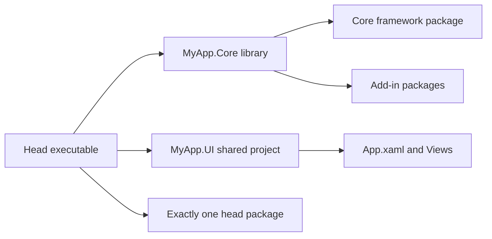

<sub>[CodeBrix](../../README.md) › [Libraries](README.md) › CodeBrix.Platform</sub>

# CodeBrix.Platform

**CodeBrix.Platform is a cross-platform desktop UI application framework for .NET: you write the
application once against the WinUI XAML API surface, and it renders natively on Windows, Linux and
macOS through a Skia-based rendering engine.** The same `Microsoft.UI.Xaml.*` controls, XAML,
code-behind and data binding you would write for a Windows App SDK application become one shared
codebase behind six thin platform executables. This page is the reference card for the framework
and its package family; the curriculum that teaches it in order is the
[CodeBrix.Platform guide](../platform/README.md).

| | |
| --- | --- |
| **Repository** | [ellisnet/CodeBrix.Platform](https://github.com/ellisnet/CodeBrix.Platform) |
| **Packages** | <details><summary>Every CodeBrix.Platform package, by group</summary><strong>Core</strong><br>[`CodeBrix.Platform.ApacheLicenseForever`](https://www.nuget.org/packages/CodeBrix.Platform.ApacheLicenseForever)<br>[`CodeBrix.Platform.Runtime.Skia.ApacheLicenseForever`](https://www.nuget.org/packages/CodeBrix.Platform.Runtime.Skia.ApacheLicenseForever)<br><br><strong>Platform heads</strong><br>[`CodeBrix.Platform.Runtime.Skia.Win32.ApacheLicenseForever`](https://www.nuget.org/packages/CodeBrix.Platform.Runtime.Skia.Win32.ApacheLicenseForever)<br>[`CodeBrix.Platform.Runtime.Skia.Wpf.ApacheLicenseForever`](https://www.nuget.org/packages/CodeBrix.Platform.Runtime.Skia.Wpf.ApacheLicenseForever)<br>[`CodeBrix.Platform.Runtime.Skia.X11.ApacheLicenseForever`](https://www.nuget.org/packages/CodeBrix.Platform.Runtime.Skia.X11.ApacheLicenseForever)<br>[`CodeBrix.Platform.Runtime.Skia.Wayland.ApacheLicenseForever`](https://www.nuget.org/packages/CodeBrix.Platform.Runtime.Skia.Wayland.ApacheLicenseForever)<br>[`CodeBrix.Platform.Runtime.Skia.FrameBuffer.ApacheLicenseForever`](https://www.nuget.org/packages/CodeBrix.Platform.Runtime.Skia.FrameBuffer.ApacheLicenseForever)<br>[`CodeBrix.Platform.Runtime.Skia.MacOS.ApacheLicenseForever`](https://www.nuget.org/packages/CodeBrix.Platform.Runtime.Skia.MacOS.ApacheLicenseForever)<br>[`CodeBrix.Platform.Runtime.Skia.FrameBuffer.Emulated.ApacheLicenseForever`](https://www.nuget.org/packages/CodeBrix.Platform.Runtime.Skia.FrameBuffer.Emulated.ApacheLicenseForever)<br><br><strong>Add-ins</strong><br>[`CodeBrix.Platform.SkiaSharp.Views.MitLicenseForever`](https://www.nuget.org/packages/CodeBrix.Platform.SkiaSharp.Views.MitLicenseForever)<br>[`CodeBrix.Platform.Graphics2DSK.ApacheLicenseForever`](https://www.nuget.org/packages/CodeBrix.Platform.Graphics2DSK.ApacheLicenseForever)<br>[`CodeBrix.Platform.Graphics3DGL.ApacheLicenseForever`](https://www.nuget.org/packages/CodeBrix.Platform.Graphics3DGL.ApacheLicenseForever)<br>[`CodeBrix.Platform.Lottie.ApacheLicenseForever`](https://www.nuget.org/packages/CodeBrix.Platform.Lottie.ApacheLicenseForever)<br>[`CodeBrix.Platform.Svg.ApacheLicenseForever`](https://www.nuget.org/packages/CodeBrix.Platform.Svg.ApacheLicenseForever)<br>[`CodeBrix.Platform.TextLayout.ApacheLicenseForever`](https://www.nuget.org/packages/CodeBrix.Platform.TextLayout.ApacheLicenseForever)<br>[`CodeBrix.Platform.AdvancedTextEdit.ApacheLicenseForever`](https://www.nuget.org/packages/CodeBrix.Platform.AdvancedTextEdit.ApacheLicenseForever)<br>[`CodeBrix.Platform.FlexPanel.ApacheLicenseForever`](https://www.nuget.org/packages/CodeBrix.Platform.FlexPanel.ApacheLicenseForever)<br>[`CodeBrix.Platform.TerminalView.ApacheLicenseForever`](https://www.nuget.org/packages/CodeBrix.Platform.TerminalView.ApacheLicenseForever)<br>[`CodeBrix.Platform.PlotterView.ApacheLicenseForever`](https://www.nuget.org/packages/CodeBrix.Platform.PlotterView.ApacheLicenseForever)<br>[`CodeBrix.Platform.AppSettings.ApacheLicenseForever`](https://www.nuget.org/packages/CodeBrix.Platform.AppSettings.ApacheLicenseForever)<br>[`CodeBrix.Platform.WebView.ApacheLicenseForever`](https://www.nuget.org/packages/CodeBrix.Platform.WebView.ApacheLicenseForever)<br>[`CodeBrix.Platform.MediaPlayer.LgplLicenseForever`](https://www.nuget.org/packages/CodeBrix.Platform.MediaPlayer.LgplLicenseForever)<br>[`CodeBrix.Platform.AudioPlayer.ApacheLicenseForever`](https://www.nuget.org/packages/CodeBrix.Platform.AudioPlayer.ApacheLicenseForever)<br>[`CodeBrix.Platform.VideoPlayer.ApacheLicenseForever`](https://www.nuget.org/packages/CodeBrix.Platform.VideoPlayer.ApacheLicenseForever)<br><br><strong>Native-framework toolkits</strong><br>[`CodeBrix.Platform.WinUI.ApacheLicenseForever`](https://www.nuget.org/packages/CodeBrix.Platform.WinUI.ApacheLicenseForever)<br>[`CodeBrix.Platform.WinUI.Skia.ApacheLicenseForever`](https://www.nuget.org/packages/CodeBrix.Platform.WinUI.Skia.ApacheLicenseForever)<br>[`CodeBrix.Platform.WinUI.Lottie.ApacheLicenseForever`](https://www.nuget.org/packages/CodeBrix.Platform.WinUI.Lottie.ApacheLicenseForever)<br>[`CodeBrix.Platform.WPF.ApacheLicenseForever`](https://www.nuget.org/packages/CodeBrix.Platform.WPF.ApacheLicenseForever)<br>[`CodeBrix.Platform.Mobile.ApacheLicenseForever`](https://www.nuget.org/packages/CodeBrix.Platform.Mobile.ApacheLicenseForever)</details> |
| **License** | Apache 2.0, with two exceptions named in the package IDs; see [License](#license) |
| **Requires** | .NET 10 or later, plus the operating-system prerequisites of the head you ship |
| **Use it from** | A CodeBrix.Platform application: the core package in the `.Core` library, exactly one head package in each head |
| **Platforms** | Windows (Win32 or WPF host), Linux (X11, native Wayland, or frame buffer), macOS (Apple Silicon and Intel) |

## What it does

- Renders the WinUI XAML API surface - controls, panels, styles, resource dictionaries, templates,
  visual states, animations and data binding - written exactly as documented for WinUI.
- Ships Skia rendering on six platform heads: Windows Win32, Windows WPF, Linux X11, native Linux
  Wayland, the Linux frame buffer (kiosk and embedded devices with no desktop), and macOS on both
  Apple Silicon and Intel.
- Offers software and GPU render paths per head - OpenGL on Win32 and X11, Vulkan on Wayland,
  OpenGL ES on the frame buffer, Metal on macOS - selected by the host builder or by
  `FeatureConfiguration`.
- Structures an application as one shared codebase: a `.Core` class library, a `.UI` shared project
  of XAML, and one thin executable head project per target platform.
- Provides application windowing (`AppWindow`, `OverlappedPresenter`), UI-thread dispatching
  (`DispatcherQueue`) and `Frame` navigation.
- Provides `Windows.Storage` files and folders, file/folder/save pickers, and the clipboard.
- Provides font loading and preloading, Unicode text handling, and shaped bidirectional text.
- Provides a diagnostics overlay and a logging bridge onto `Microsoft.Extensions.Logging`.
- Offers add-in packages for 2D and 3D drawing, SVG, Lottie animation, media, audio and MIDI, video,
  an embedded browser, a terminal view, charts, flex layout, host-free text layout, persisted
  settings, and a full code editor.
- Ships XML documentation (IntelliSense) alongside the assemblies, and an `AGENT-README.txt` inside
  every package for AI coding agents.

## When to use it

Reach for CodeBrix.Platform when one desktop application has to run on Windows, Linux and macOS from
a single codebase, written in XAML and C# rather than in a web stack. The framework is the whole UI
layer: the control set, the XAML runtime, layout, binding, dispatching and the window itself. Adding
a platform means adding one more head project - the view models and the XAML do not change.

It is desktop only. There are no mobile (iOS/Android) targets and no WebAssembly or browser target,
and none are planned. If the application is a native WinUI 3, WPF or .NET MAUI application rather
than a cross-platform one, use the native-framework toolkits instead - they carry the identical
"Simple" MVVM surface, so view models can be shared across both families. See
[Sharing code with native frameworks](../platform/14-sharing-code-with-native-frameworks.md).

The optional capabilities - 2D and 3D canvases, Lottie, SVG, media and audio playback, a web view,
a code editor, a terminal, charts, flex layout and a settings store - are not in the core package.
Each is a separate add-in package referenced once in `.Core`; see [Add-ins](../platform/08-add-ins.md).

> [!NOTE]
> Every WinUI and UWP type and member exists so that code, XAML and third-party libraries compile
> unchanged. A member with no meaningful behavior on the supported targets throws a "not implemented"
> exception that names the exact member, rather than silently doing the wrong thing. The message
> reads, for example: "The member `string SomeType.SomeMember` is not implemented." Check the message
> for the member name and look for an implemented alternative API.

## Getting started

Two package references start an application. The core framework goes in the `.Core` class library;
exactly one head package goes in each head executable.

```bash
dotnet add package CodeBrix.Platform.ApacheLicenseForever
dotnet add package CodeBrix.Platform.Runtime.Skia.X11.ApacheLicenseForever
```

Reference the packages without a version attribute and let NuGet resolve them; the family is always
published together. Package IDs carry a license suffix, namespaces do not - there is no package named
plain `CodeBrix.Platform`, and no namespace named `CodeBrix.Platform.ApacheLicenseForever`.

The `.Core` library holds application logic and every framework and add-in package reference:

```xml
<Project Sdk="Microsoft.NET.Sdk">
  <PropertyGroup>
    <TargetFramework>net10.0</TargetFramework>
    <RootNamespace>MyApp</RootNamespace>
    <DefineConstants>$(DefineConstants);HAS_CODEBRIX;HAS_CODEBRIX_WINUI</DefineConstants>
  </PropertyGroup>
  <ItemGroup>
    <PackageReference Include="Microsoft.Extensions.Logging.Console" />
    <PackageReference Include="CodeBrix.Platform.ApacheLicenseForever" />
  </ItemGroup>
</Project>
```

Each head is an executable that imports the shared `.UI` project, references `.Core`, and references
exactly one head package:

```xml
<Project Sdk="Microsoft.NET.Sdk">
  <PropertyGroup>
    <TargetFramework>net10.0</TargetFramework>
    <OutputType>Exe</OutputType>
    <RootNamespace>MyApp</RootNamespace>
    <DefineConstants>$(DefineConstants);HAS_CODEBRIX;HAS_CODEBRIX_WINUI</DefineConstants>
  </PropertyGroup>

  <!-- Treat .xaml files as CodeBrix.Platform XAML pages -->
  <ItemGroup>
    <Page Include="**\*.xaml" Exclude="bin\**\*.xaml;obj\**\*.xaml" />
    <None Remove="**\*.xaml" />
  </ItemGroup>

  <!-- Pull in the shared App.xaml + Views -->
  <Import Project="..\MyApp.UI\MyApp.UI.projitems" Label="Shared" />

  <ItemGroup>
    <ProjectReference Include="..\MyApp.Core\MyApp.Core.csproj" />
  </ItemGroup>

  <!-- EXACTLY ONE platform head package (this one = Windows/Win32): -->
  <ItemGroup>
    <PackageReference Include="CodeBrix.Platform.Runtime.Skia.Win32.ApacheLicenseForever" />
  </ItemGroup>
</Project>
```

The head's `Program.cs` is the whole bootstrap - initialize logging, build the host for this
platform, run it:

```csharp
using CodeBrix.Platform.UI.Hosting;

var host = CodeBrixPlatformHostBuilder.Create()
    .App(() => new App())
    .UseWindowsWin32()   // or UseWindowsWpf / UseLinuxX11 / UseLinuxWayland / UseLinuxFrameBuffer / UseMacOS
    .Build();

host.Run();
```

A page is standard WinUI XAML, compiled into every head from the shared `.UI` project:

```xml
<Page
    x:Class="MyApp.Views.MainPage"
    xmlns="http://schemas.microsoft.com/winfx/2006/xaml/presentation"
    xmlns:x="http://schemas.microsoft.com/winfx/2006/xaml">
    <StackPanel HorizontalAlignment="Center" VerticalAlignment="Center">
        <TextBlock Text="Hello from CodeBrix.Platform" />
        <Button Content="Click me" Click="OnClick" />
    </StackPanel>
</Page>
```

Build and run the head:

```bash
dotnet run --project MyApp.LinuxX11/MyApp.LinuxX11.csproj
```

Adding a second platform is one more head folder with the other head package and the other
`.Use...()` call. Nothing else changes. The chapter that walks the whole solution file by file is
[Your first application](../platform/03-your-first-application.md).

## Key concepts

The four ideas below are the ones that decide whether a solution is shaped correctly. Each links to
the guide chapter that treats it in full; the guide index is
[Build a CodeBrix.Platform application](../platform/README.md).

### Three kinds of projects

A solution is built from three kinds of projects, and this is the canonical structure. The `.Core`
project is a class library holding application logic, view models, services and all NuGet package
references for the framework and its add-ins; it never references a head package. The `.UI` project
is an MSBuild Shared Project (a `.shproj` plus a `.projitems`) holding `App.xaml`, `App.xaml.cs` and
the Views - it is not compiled on its own, its files are compiled into each head that imports its
`.projitems`. Each head project is a tiny executable: it imports `.UI`, references `.Core`,
references exactly one head package, and contains `Program.cs`.



The XAML source generator and build-task wiring do not flow across a `ProjectReference`, which is why
the Views live in a Shared Project and not in `.Core`. Full treatment:
[Project architecture](../platform/04-project-architecture.md).

### One head project, one head package

The single most important packaging rule. Add-in packages are referenced once, in `.Core`, and flow
to every head transitively; an add-in that only works on some heads is inert on the others and never
breaks a build. A head project adds nothing else UI-related - no add-in packages and no second head
package. Put a head package in `.Core`, or two head packages in one head, and the build is wrong.

Define `HAS_CODEBRIX` and `HAS_CODEBRIX_WINUI` in `.Core` and in every head; some public API
(`Window.AppWindow`, for one) is public only when `HAS_CODEBRIX_WINUI` is defined. The head packages
define the head-specific constants for you.

### The six heads

Each head package supplies one `.Use...()` extension method in the `CodeBrix.Platform.UI.Hosting`
namespace, and every one except `UseMacOS()` has an overload taking a configuration lambda.

| Head | Bootstrap call | Default render path | What it needs from the OS |
| --- | --- | --- | --- |
| Windows (Win32) | `.UseWindowsWin32()` | OpenGL, else software | Windows; an OpenGL driver is optional |
| Windows (WPF) | `.UseWindowsWpf()` | Set Software explicitly | Windows; do not set `UseWPF` |
| Linux (X11) | `.UseLinuxX11()` | OpenGL via GLX, else software | `DISPLAY` set; runs on Wayland through XWayland |
| Linux (Wayland) | `.UseLinuxWayland()` | Vulkan, else software | A running Wayland compositor; libdecor for client-side decorations |
| Linux (frame buffer) | `.UseLinuxFrameBuffer()` | DRM/GBM OpenGL ES, else software | Access to the frame-buffer device, DRM card and input devices |
| macOS | `.UseMacOS()` | Metal, else software | macOS; the package carries a universal native library |

`Build()` returns the concrete host for the selected head - `Win32Host`, `WpfHost`,
`X11ApplicationHost`, `WaylandApplicationHost`, `FrameBufferHost` or `MacSkiaHost`, all deriving from
`SkiaHost`. Pattern-match on it to set host properties between `Build()` and `Run()`. Full treatment:
[Runs on every laptop](../platform/02-runs-on-every-laptop.md).

### Framework-wide switches and fonts

`CodeBrix.Platform.UI.FeatureConfiguration` is a static class of nested groups - `Font`, `Rendering`,
`TextBlock`, `TextBox`, `ScrollViewer`, `Popup`, `ToolTip`, `Page`, `Frame`, `ListViewBase`,
`Control`, `UIElement` and more. Set them from the App constructor before `InitializeComponent()`, or
from `Program.Main` before `Build()`.

The default text font is the first one to set, because Linux and macOS do not have the WinUI default
installed. A bundled font package is loaded by URI:

```csharp
global::CodeBrix.Platform.UI.FeatureConfiguration.Font.DefaultTextFontFamily =
    "ms-appx:///CodeBrix.Platform.Fonts.OpenSans/Fonts/OpenSans.ttf";
```

A character no font can supply renders as the font's `.notdef` glyph - the framework never
substitutes the host system's fonts unless `FallbackFontFamilies` is empty and the application's own
fonts have no glyph. Preload a font with `FontFamilyHelper.PreloadAsync` so the first screen does not
re-layout when the font arrives. Full treatment:
[Views and styling](../platform/06-views-and-styling.md).

## Examples

`App.xaml.cs` lives in the `.UI` shared project and is compiled into every head. This is the
reference pattern: the font default and any DI registration in the constructor, a `Frame` in
`OnLaunched`, and the `InitializeLogging` method every head's `Main` calls before building the host.

```csharp
using Microsoft.Extensions.Logging;
using Microsoft.UI.Xaml;
using Microsoft.UI.Xaml.Controls;
using Microsoft.UI.Xaml.Navigation;
using System;

namespace MyApp;

public partial class App : Application
{
    public App()
    {
        // (Optional) set a default font, e.g. the bundled Open Sans package.
        // The "ms-appx:///<PackageId-without-suffix>/Fonts/<file>.ttf" form
        // loads a font shipped inside a referenced package:
        global::CodeBrix.Platform.UI.FeatureConfiguration.Font.DefaultTextFontFamily =
            "ms-appx:///CodeBrix.Platform.Fonts.OpenSans/Fonts/OpenSans.ttf";

        // (Optional) RequestedTheme = ApplicationTheme.Dark;  // ONLY here, before InitializeComponent
        // (Optional) register your DI services here, then:
        InitializeComponent();
    }

    protected Window MainWindow { get; private set; }

    protected override void OnLaunched(LaunchActivatedEventArgs args)
    {
        MainWindow = new Window { Title = "My App" };

        if (MainWindow.Content is not Frame rootFrame)
        {
            rootFrame = new Frame();
            MainWindow.Content = rootFrame;
            rootFrame.NavigationFailed += OnNavigationFailed;
        }

        if (rootFrame.Content == null)
        {
            rootFrame.Navigate(typeof(Views.MainPage), args.Arguments);
        }

        MainWindow.Activate();
    }

    void OnNavigationFailed(object sender, NavigationFailedEventArgs e) =>
        throw new InvalidOperationException(
            $"Failed to load {e.SourcePageType.FullName}: {e.Exception}");

    // Called from each head's Program.Main BEFORE building the host.
    public static void InitializeLogging()
    {
#if DEBUG
        var factory = LoggerFactory.Create(builder =>
        {
            builder.AddConsole();
            builder.SetMinimumLevel(LogLevel.Information);
            builder.AddFilter("CodeBrix.Platform", LogLevel.Warning);
            builder.AddFilter("Microsoft", LogLevel.Warning);
        });

        global::CodeBrix.Platform.Extensions.LogExtensionPoint.AmbientLoggerFactory = factory;

#if HAS_CODEBRIX
        global::CodeBrix.Platform.UI.Adapter.Microsoft.Extensions.Logging.LoggingAdapter.Initialize();
#endif
#endif
    }
}
```

Notice that logging is bridged by setting `LogExtensionPoint.AmbientLoggerFactory` and then calling
`LoggingAdapter.Initialize()`; the adapter is folded into the core package, so no extra package is
installed for it.

This page code-behind runs unchanged on every head: a file picker, the clipboard, a `ContentDialog`,
background work marshalled back to the UI thread, and per-element theme switching.

```csharp
using System;
using System.Threading.Tasks;
using Microsoft.UI.Xaml;
using Microsoft.UI.Xaml.Controls;
using MyApp.ViewModels;
using Windows.ApplicationModel.DataTransfer;
using Windows.Storage.Pickers;

namespace MyApp.Views;

public sealed partial class MainPage : Page
{
    public MainViewModel ViewModel { get; } = new();

    public MainPage() => InitializeComponent();

    async void OnOpenFile(object sender, RoutedEventArgs e)
    {
        var picker = new FileOpenPicker();
        picker.FileTypeFilter.Add("*");
        var file = await picker.PickSingleFileAsync();
        if (file is not null)
        {
            ViewModel.Files.Add(file.Path);
            ViewModel.Status = $"Opened {file.Name}";
        }
    }

    void OnCopyStatus(object sender, RoutedEventArgs e)
    {
        var package = new DataPackage();
        package.SetText(ViewModel.Status);
        Clipboard.SetContent(package);
    }

    async void OnConfirm(object sender, RoutedEventArgs e)
    {
        var dialog = new ContentDialog
        {
            Title = "Clear the list?",
            Content = $"{ViewModel.Files.Count} entries will be removed.",
            PrimaryButtonText = "Clear",
            CloseButtonText = "Keep",
            XamlRoot = XamlRoot,
        };
        if (await dialog.ShowAsync() == ContentDialogResult.Primary)
        {
            ViewModel.Files.Clear();
            ViewModel.Status = "Cleared";
        }
    }

    void OnSlowWork(object sender, RoutedEventArgs e)
    {
        ViewModel.IsBusy = true;
        var queue = DispatcherQueue;                    // UI thread's queue
        _ = Task.Run(async () =>
        {
            await Task.Delay(2000);                     // background work
            queue.TryEnqueue(() =>
            {
                ViewModel.Status = $"Finished at {DateTime.Now:T}";
                ViewModel.IsBusy = false;
            });
        });
    }

    void OnThemeToggled(object sender, RoutedEventArgs e)
    {
        // per-element theme, applied to the page's whole subtree at run time
        RequestedTheme = ((ToggleSwitch)sender).IsOn ? ElementTheme.Dark : ElementTheme.Light;
    }
}
```

`XamlRoot` on the dialog is required, and only one `ContentDialog` may be on screen at a time.

The matching markup binds the view model, a converter from the built-in converter set, and the
Toolkit's `ElevatedView` - both folded into the core package, with no extra reference.

```xml
<Page
    x:Class="MyApp.Views.MainPage"
    xmlns="http://schemas.microsoft.com/winfx/2006/xaml/presentation"
    xmlns:x="http://schemas.microsoft.com/winfx/2006/xaml"
    xmlns:conv="using:CodeBrix.Platform.UI.Converters"
    xmlns:toolkit="using:CodeBrix.Platform.UI.Toolkit">
    <Page.Resources>
        <conv:BoolToVisibilityConverter x:Key="BoolToVis" />
    </Page.Resources>
    <Grid Padding="16" RowSpacing="8">
        <Grid.RowDefinitions>
            <RowDefinition Height="Auto" />
            <RowDefinition Height="*" />
            <RowDefinition Height="Auto" />
        </Grid.RowDefinitions>

        <StackPanel Orientation="Horizontal" Spacing="8">
            <Button Content="Open file..." Click="OnOpenFile" />
            <Button Content="Copy status" Click="OnCopyStatus" />
            <Button Content="Confirm" Click="OnConfirm" />
            <Button Content="Slow work" Click="OnSlowWork" />
            <ToggleSwitch Header="Dark" Toggled="OnThemeToggled" />
            <ProgressRing IsActive="True"
                          Visibility="{x:Bind ViewModel.IsBusy, Mode=OneWay, Converter={StaticResource BoolToVis}}" />
        </StackPanel>

        <toolkit:ElevatedView Grid.Row="1" Elevation="8" Background="{ThemeResource LayerFillColorDefaultBrush}">
            <ListView ItemsSource="{x:Bind ViewModel.Files}" />
        </toolkit:ElevatedView>

        <TextBlock Grid.Row="2" Text="{x:Bind ViewModel.Status, Mode=OneWay}" />
    </Grid>
</Page>
```

A frame-buffer kiosk is the same application with a configured head. Pickers, the on-screen keyboard
and the clipboard are opt-in on this head, and orientation, scale and the mouse cursor are set here
too.

```csharp
using CodeBrix.Platform.UI.Hosting;
using CodeBrix.Platform.UI.Runtime.Skia;
using Windows.Graphics.Display;

var host = CodeBrixPlatformHostBuilder.Create()
    .App(() => new App())
    .UseLinuxFrameBuffer(fb => fb
        .Orientation(DisplayOrientations.Landscape, isPreferredOrientation: true)
        .AutoRotationEnabled(DisplayOrientations.Landscape, DisplayOrientations.LandscapeFlipped)
        .DisableMouseCursor()
        .ScaleUserInterface(UserInterfaceScale.Percent150)
        .EnableFileOpenPicker(new FilePickerOptions { RestrictToFolder = "/data", AllowMultipleFileSelect = false })
        .EnableFolderPicker()
        .EnableSoftwareKeyboard(new SoftwareKeyboardOptions { KeyHeight = SoftwareKeyHeight.PortraitFullLandscapeHalf })
        .EnableSimpleTextClipboard())
    .Build();
host.Run();
```

`ScaleUserInterface` lays out in logical units while drawing keeps every real pixel, so nothing is
upscaled.

The Linux desktop heads take a rendering backend and a frame rate the same way:

```csharp
.UseLinuxX11(x11 => x11
    .RenderingBackend(X11RenderingBackend.OpenGLES)
    .RenderFrameRate(30))
```

```csharp
.UseLinuxWayland(wayland =>
    wayland.RenderingBackend(WaylandRenderingBackend.Vulkan))
```

On Wayland the two GPU paths are peers: Vulkan and OpenGL ES each fall back directly to software,
never to each other. `WaylandRenderingBackend.VulkanForced` disables the fallback entirely - the
application prints a two-line "requires Vulkan rendering" message to stderr and exits with code 1
when the Vulkan renderer cannot be created, which is how a hardware-qualification run proves the GPU
path is really in use.

## Pitfalls

- Do not confuse package IDs with namespaces. Package IDs carry a license suffix; namespaces do not.
- Do not reference a head package in `.Core`, and do not put two head packages in one head project.
  Add-in packages belong in `.Core`, referenced once, never in a head.
- Do not omit `HAS_CODEBRIX` and `HAS_CODEBRIX_WINUI` from the `.Core` library and from every head.
- Do not set `<UseWPF>true</UseWPF>` on the WPF head. WPF is loaded by the host at run time; setting
  the property makes WPF's build targets try to treat the CodeBrix.Platform `<Page>` items as WPF XAML.
- Do not leave the WPF head on the same target framework moniker the other heads use - it needs the
  Windows-flavored one shown in its project snippet, or the WPF `FrameworkReference` fails the build
  with NETSDK1136.
- Do not omit the software-rendering line on the WPF head. Its default OpenGL renderer draws onto
  WPF's own composited window, which produces an airspace conflict and a blank window on many
  systems. Force software rendering right after `Build()`:

```csharp
if (host is WpfHost wpfHost)
{
    wpfHost.RenderSurfaceType = RenderSurfaceType.Software;
}
```

- Do not forget to declare `.xaml` as `<Page>` items in each head and to import the `.UI`
  `.projitems`. The shared XAML is compiled into the head; it is not a standalone assembly, and the
  Views do not belong in `.Core`.
- Do not call `CodeBrixPlatformHostBuilder` before `App.InitializeLogging()`.
- Do not name the Win32 head `.Windows`. That gives the project its own `MyApp.Windows` namespace,
  which shadows the global `Windows` namespace, so an inline reference such as
  `Windows.System.VirtualKey` in shared code binds to the wrong thing and fails with CS0234 - on
  that one head only. Name it `.Win32Skia`.
- Do not expect the Wayland head to run in an X11-only session. It requires a compositor and fails
  fast by design when none is present. Ship the X11 head for applications that must run everywhere
  on desktop Linux, alone or alongside a Wayland head.
- Do not rely on window positioning, forced resize, always-on-top, or minimized-state readback on
  the Wayland head. These are protocol-level differences, not bugs: the compositor owns placement and
  the final word on size, `AppWindow.Position` always reports (0,0), and a client is never told when
  its window was unminimized. Each logs a one-time warning naming the API on first use.
- Do not show a `ContentDialog` without setting `XamlRoot`, and do not keep two on screen at once -
  re-showing a dialog that is already showing throws `InvalidOperationException`.
- Do not set `Application.RequestedTheme` after `InitializeComponent()`; it throws
  `NotSupportedException`. Switch themes at run time with `FrameworkElement.RequestedTheme` on the
  root element.
- Do not touch UI objects from a background thread. Capture `DispatcherQueue` on the UI thread and
  `TryEnqueue` back; check `HasThreadAccess` when unsure.
- Do not expect pickers, an on-screen keyboard or a clipboard on the frame-buffer head unless they
  were enabled on the `FramebufferHostBuilder`; the picker APIs throw `NotSupportedException`
  otherwise.
- Do not reference `CodeBrix.Platform.Runtime.Skia.ApacheLicenseForever` directly - it arrives
  transitively beneath every head package. `CodeBrix.Platform.Runtime.Skia.FrameBuffer.Emulated.ApacheLicenseForever`
  is an off-screen variant of the frame-buffer head used by tooling; never reference it directly.
- Do not set `FeatureConfiguration.Font.DefaultTextFontFamily` after the first text has been
  measured; set it in the App constructor. `SymbolsFont` is the opposite - set it after
  `InitializeComponent()`. A bundled font must be referenced from `.Core` so every head ships it.
- Do not run a real frame-buffer head build on a desktop machine: it draws into the frame-buffer
  device and takes over the console invisibly.

> [!TIP]
> On some Linux ARM64 systems the native SkiaSharp library can fail to auto-load FreeType, throwing
> an "undefined symbol" error at startup. Preload FreeType when launching, for example
> `LD_PRELOAD=/usr/lib/aarch64-linux-gnu/libfreetype.so.6 dotnet run ...`.

## Samples and tools in the repository

Every sample under `samples/CodeBrixPlatform` is a complete application in the canonical shape -
`<Demo>.Core`, `<Demo>.UI` and the six heads - with per-OS solutions (`<Demo>.Linux.slnx`,
`<Demo>.MacOS.slnx`, `<Demo>.Windows.slnx`). The samples reference the framework through
`ProjectReference` into `src/` rather than through `PackageReference`: copy their project structure
and their XAML and C#, not their reference lines.

| Name | What it demonstrates | Where |
| --- | --- | --- |
| JustBetweenUs | The `.Core` + `.UI` + six-heads layout, DI and view-model binding, and four add-ins at once | [`samples/CodeBrixPlatform/JustBetweenUs`](https://github.com/ellisnet/CodeBrix.Platform/tree/main/samples/CodeBrixPlatform/JustBetweenUs) |
| EmulateFrameBufferDemo | The one sample that consumes the framework from NuGet packages, plus frame-buffer orientation options and `UseDirectSkiaCanvasMode()` | [`samples/CodeBrixPlatform/EmulateFrameBufferDemo`](https://github.com/ellisnet/CodeBrix.Platform/tree/main/samples/CodeBrixPlatform/EmulateFrameBufferDemo) |
| ParityDemo | An X11-versus-Wayland behavior harness for popups, clipboard, drag-and-drop and window chrome, with unattended self-test modes | [`samples/CodeBrixPlatform/ParityDemo`](https://github.com/ellisnet/CodeBrix.Platform/tree/main/samples/CodeBrixPlatform/ParityDemo) |
| FileFolderDialogDemo | `FileOpenPicker`, `FileSavePicker` and `FolderPicker` on every head | [`samples/CodeBrixPlatform/FileFolderDialogDemo`](https://github.com/ellisnet/CodeBrix.Platform/tree/main/samples/CodeBrixPlatform/FileFolderDialogDemo) |
| AdvancedTextEditDemo | A working code editor: open/save, undo, syntax highlighting, line numbers, word wrap | [`samples/CodeBrixPlatform/AdvancedTextEditDemo`](https://github.com/ellisnet/CodeBrix.Platform/tree/main/samples/CodeBrixPlatform/AdvancedTextEditDemo) |
| AudioPlayerDemo | Song playback in five formats, sound effects, and MIDI through either an SFZ instrument or a Decent Sampler preset, with that preset's own knob, the MPE setting and a beat readout | [`samples/CodeBrixPlatform/AudioPlayerDemo`](https://github.com/ellisnet/CodeBrix.Platform/tree/main/samples/CodeBrixPlatform/AudioPlayerDemo) |
| VideoPlayerDemo | The `VideoPlayer` element, render-path selection, chapters, and a smoke-capture mode | [`samples/CodeBrixPlatform/VideoPlayerDemo`](https://github.com/ellisnet/CodeBrix.Platform/tree/main/samples/CodeBrixPlatform/VideoPlayerDemo) |
| FlexPanelDemo | A live flexbox playground over `FlexPanel` and its attached properties | [`samples/CodeBrixPlatform/FlexPanelDemo`](https://github.com/ellisnet/CodeBrix.Platform/tree/main/samples/CodeBrixPlatform/FlexPanelDemo) |
| MediaPlayerDemo | `MediaPlayerElement` with a URL box, transport controls and a Stretch selector | [`samples/CodeBrixPlatform/MediaPlayerDemo`](https://github.com/ellisnet/CodeBrix.Platform/tree/main/samples/CodeBrixPlatform/MediaPlayerDemo) |
| PlotterViewDemo | A chart gallery - streaming signal, function series, bar, scatter, heat map, pie | [`samples/CodeBrixPlatform/PlotterViewDemo`](https://github.com/ellisnet/CodeBrix.Platform/tree/main/samples/CodeBrixPlatform/PlotterViewDemo) |
| TerminalViewDemo | A terminal emulator view with an ANSI/SGR showcase, color schemes and copy/paste | [`samples/CodeBrixPlatform/TerminalViewDemo`](https://github.com/ellisnet/CodeBrix.Platform/tree/main/samples/CodeBrixPlatform/TerminalViewDemo) |
| WebViewDemo | `WebView2` navigation plus download handling through `CoreWebView2.DownloadStarting` | [`samples/CodeBrixPlatform/WebViewDemo`](https://github.com/ellisnet/CodeBrix.Platform/tree/main/samples/CodeBrixPlatform/WebViewDemo) |
| JustBetweenUs (native heads) | The same application built on WinUI, WPF and .NET MAUI with the native-framework toolkits | [`samples/Platforms/JustBetweenUs`](https://github.com/ellisnet/CodeBrix.Platform/tree/main/samples/Platforms/JustBetweenUs) |
| Shared sample assets | Audio in five formats, a MIDI file with an SFZ instrument and a hand-written Decent Sampler preset to play it through, and short AV1 video clips | [`samples/assets`](https://github.com/ellisnet/CodeBrix.Platform/tree/main/samples/assets) |
| Application scaffold | A complete six-head application named TemplateApp, shipped as data | [`templates`](https://github.com/ellisnet/CodeBrix.Platform/tree/main/templates) |
| WaylandBindingsGenerator | Regenerates the committed C# Wayland protocol bindings from pinned protocol XML | [`tools/WaylandBindingsGenerator`](https://github.com/ellisnet/CodeBrix.Platform/tree/main/tools/WaylandBindingsGenerator) |
| ResourcesExtractor | Extracts the localized WinUI string resources that populate the framework's resource tables | [`tools/ResourcesExtractor`](https://github.com/ellisnet/CodeBrix.Platform/tree/main/tools/ResourcesExtractor) |

Run any sample head from the repository root:

```bash
dotnet run --project samples/CodeBrixPlatform/<Demo>/<Demo>.LinuxX11
dotnet run --project samples/CodeBrixPlatform/<Demo>/src/<Demo>.LinuxX11   # src/ layout
```

Head requirements are the platform's own: the X11 head needs `DISPLAY`, the Wayland head needs a
running compositor, the frame-buffer head needs a real frame-buffer device, the WPF and Win32 heads
need Windows, and the macOS head needs macOS.

## Documentation and source

| Document | Where |
| --- | --- |
| Overview (README) | [README.md](https://github.com/ellisnet/CodeBrix.Platform/blob/main/README.md) |
| Complete API guide (ships inside the package too) | [AGENT-README.txt](https://github.com/ellisnet/CodeBrix.Platform/blob/main/AGENT-README.txt) |
| The family-wide package catalog | [CODEBRIX-PLATFORM-README.md](https://github.com/ellisnet/CodeBrix.Platform/blob/main/CODEBRIX-PLATFORM-README.md) |
| What a "not implemented" exception means | [NOT-IMPLEMENTED.md](https://github.com/ellisnet/CodeBrix.Platform/blob/main/NOT-IMPLEMENTED.md) |
| Samples, tools and other non-package content | [EXTRAS-README.txt](https://github.com/ellisnet/CodeBrix.Platform/blob/main/EXTRAS-README.txt) |
| Map of every document in the repository | [README-INDEX.txt](https://github.com/ellisnet/CodeBrix.Platform/blob/main/README-INDEX.txt) |
| Runtime tests (controls, binding, navigation, windowing) | [src/Platform.UI.RuntimeTests](https://github.com/ellisnet/CodeBrix.Platform/tree/main/src/Platform.UI.RuntimeTests) |
| Toolkit tests (converters and helpers) | [src/Platform.UI.Toolkit.Tests](https://github.com/ellisnet/CodeBrix.Platform/tree/main/src/Platform.UI.Toolkit.Tests) |
| Samples | [samples/CodeBrixPlatform](https://github.com/ellisnet/CodeBrix.Platform/tree/main/samples/CodeBrixPlatform) |

Every add-in package carries its own `AGENT-README.txt` under `src/AddIns/`, and the
native-framework toolkits carry theirs under `src-platforms/`.

## License

The framework, the shared Skia runtime, the platform heads and most add-ins are licensed under the
Apache License 2.0, and the license is named in each package ID
(`CodeBrix.Platform.ApacheLicenseForever` and its siblings). Two packages differ, and their IDs say
so: `CodeBrix.Platform.SkiaSharp.Views.MitLicenseForever` is MIT, and
`CodeBrix.Platform.MediaPlayer.LgplLicenseForever` is LGPL. The `.{license}LicenseForever` suffix is
a permanent binding: a package with that exact ID will never have its license change. For the
provenance and licensing of open source code included in this library, see
[THIRD-PARTY-NOTICES.txt](https://github.com/ellisnet/CodeBrix.Platform/blob/main/THIRD-PARTY-NOTICES.txt)
in the repository.

---

**Where to go next**

- [Build a CodeBrix.Platform application](../platform/README.md) - the guide track, in order, from
  "what is it" to "ship it"
- [Your first application](../platform/03-your-first-application.md) - every file of a working
  solution, verbatim
- [Add-ins](../platform/08-add-ins.md) - every optional capability package and the head it works on
- [ellisnet/CodeBrix.Platform on GitHub](https://github.com/ellisnet/CodeBrix.Platform) - source,
  tests and samples
