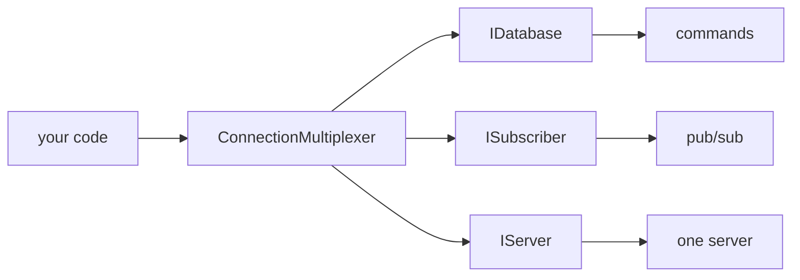

<sub>[CodeBrix](../../README.md) › [Libraries](README.md) › CodeBrix.Redis</sub>

# CodeBrix.Redis

**CodeBrix.Redis is a high-performance, fully managed Redis client for .NET, covering both synchronous
and asynchronous usage.** One assembly holds the whole stack: the RESP protocol reader and writer, the
connection multiplexer with its cluster, sentinel and replica awareness, the full command surface, and
the Redlock distributed-lock algorithm. It also ships compile-time analyzers that catch the mistakes
this kind of client invites. Use it from any .NET 10 application, or from a CodeBrix.Platform
application that talks to a Redis server.

| | |
| --- | --- |
| **Repository** | [ellisnet/CodeBrix.Redis](https://github.com/ellisnet/CodeBrix.Redis) |
| **Packages** | [`CodeBrix.Redis.MitLicenseForever`](https://www.nuget.org/packages/CodeBrix.Redis.MitLicenseForever) |
| **License** | MIT; see [License](#license) |
| **Requires** | .NET 10 or later, and a Redis server to talk to. Two Microsoft-published dependencies arrive with the package: `Microsoft.Extensions.Logging.Abstractions` and `System.IO.Hashing` |
| **Use it from** | Any .NET 10 application, or a CodeBrix.Platform application |

## What it does

- Multiplexes one connection per server behind a single `ConnectionMultiplexer` shared by the whole
  application, with automatic reconnection, a configurable backlog policy and connection events.
- Talks to every server topology: standalone, primary and replica, Redis Cluster with hash-slot
  routing and `MOVED`/`ASK` following, and sentinel-managed failover.
- Covers the full command surface - strings, hashes, lists, sets, sorted sets, bitmaps, HyperLogLog,
  geospatial indexes, streams and vector sets - each command in synchronous and asynchronous form.
- Speaks RESP2 and RESP3, negotiated with `HELLO`, including RESP3 push messages.
- Publishes and subscribes, with `ChannelMessageQueue` for ordered sequential consumption, and
  keyspace notifications.
- Runs transactions and batches: `ITransaction` with `Condition` preconditions, and `IBatch` for
  pipelined non-atomic sends.
- Runs Lua scripts through `LuaScript`, with named-parameter mapping, script caching and `EVALSHA`.
- Isolates key spaces: a prefixed `IDatabase` view lets several logical applications share one Redis
  database without colliding.
- Profiles and diagnoses: per-command profiling sessions, connection counters, storm logs and an
  `ILoggerFactory` hook for connection logging.
- Exposes the low-level RESP layer on its own, for talking RESP to something that is not Redis.
- Implements the Redlock distributed-lock algorithm across independent Redis instances, with lock
  extension and expiry.
- Installs Roslyn analyzers with the package: compile-time transaction and queued-result diagnostics,
  with code fixes in the editor. They are compile-time only and nothing about them reaches your
  output.

## When to use it

Reach for CodeBrix.Redis whenever a .NET application needs Redis: as a cache, a work queue, a pub/sub
bus, a rate limiter or a distributed lock. It is the client layer only, and it is deliberately thin
over the protocol.

What it does not do:

- It is not a Redis server. It talks to one.
- It does not manage or install Redis. Provisioning a server, a cluster or a container is somewhere
  else's job - [CodeBrix.Docker](CodeBrix.Docker.md) is one option.
- It is not an object mapper, an ORM or a caching abstraction. It exposes Redis commands;
  serialization is yours, and so is the caching policy. If you want `IDistributedCache` semantics,
  write the thin adapter.
- It does not multi-target. .NET 10 and later, only.



Only the first arrow is API. Everything under the multiplexer - the per-server connections, their
bridges and the sockets beneath - is internal machinery you do not name and do not construct, except
the RESP layer, which is public in its own right.

## Getting started

```bash
dotnet add package CodeBrix.Redis.MitLicenseForever
```

The package ID carries the license suffix; the namespaces do not. You install
`CodeBrix.Redis.MitLicenseForever` and you write `using CodeBrix.Redis;`.

```csharp
using CodeBrix.Redis;

using var multiplexer = await ConnectionMultiplexer.ConnectAsync("localhost:6379");

IDatabase db = multiplexer.GetDatabase();

await db.StringSetAsync("greeting", "hello world");
RedisValue value = await db.StringGetAsync("greeting");

Console.WriteLine(value);   // hello world
```

Notice what is *not* there: no registration call, no codec setup and no feature flag. The one thing to
get right is lifetime - the multiplexer is created once and shared, and `GetDatabase()` is called per
operation.

Most applications need only the first of these usings; the rest name the areas they cover.

```csharp
using CodeBrix.Redis;
using CodeBrix.Redis.Configuration;
using CodeBrix.Redis.Profiling;
using CodeBrix.Redis.KeyspaceIsolation;
using CodeBrix.Redis.Maintenance;
using CodeBrix.Redis.RedLock;
using CodeBrix.Redis.RedLock.Configuration;
using CodeBrix.Redis.Availability;
using CodeBrix.Redis.Respite;
```

| Namespace | What it holds |
| --- | --- |
| `CodeBrix.Redis` | The client: `ConnectionMultiplexer`, `IDatabase`, `ISubscriber`, `IServer`, `ITransaction`, `IBatch`, `RedisKey`, `RedisValue`, `RedisResult`, `ConfigurationOptions`, `RedisChannel`, `LuaScript`, `Condition` and the exception types |
| `CodeBrix.Redis.Configuration` | `DefaultOptionsProvider` and its derivatives, for centralizing connection defaults; `Tunnel` and `LoggingTunnel` live here too |
| `CodeBrix.Redis.Profiling` | `ProfilingSession` and `IProfiledCommand` - per-command timing |
| `CodeBrix.Redis.KeyspaceIsolation` | The `WithKeyPrefix` extension, returning a transparently prefixed `IDatabase` |
| `CodeBrix.Redis.Maintenance` | Server-maintenance notifications - failover, node migration - as events |
| `CodeBrix.Redis.RedLock` | The distributed lock: `RedLockFactory`, `IRedLock`, `RedLockStatus`, `IDistributedLockFactory` |
| `CodeBrix.Redis.RedLock.Configuration` | What you hand the factory: `RedLockMultiplexer`, `RedLockEndPoint`, `RedLockRetryConfiguration`, `RedLockConfiguration` |
| `CodeBrix.Redis.Availability` | Multi-group connections, health checks and circuit breakers, for an application spanning several independent Redis deployments |
| `CodeBrix.Redis.Respite` | The low-level RESP layer, for speaking RESP to something that is not Redis or writing a custom transport |

Taking a lock needs both `RedLock` usings. Everything in `Availability` and `Respite` is behind an
opt-in gate - see [The experimental API gates](#the-experimental-api-gates).

## Key concepts

### One multiplexer per application

This is the single most important thing about using the library correctly, and it is the mistake most
often made with it. `ConnectionMultiplexer` is the entry point and the expensive object: create one,
keep it, share it. It multiplexes, so thousands of concurrent operations sharing one connection per
server is the design working rather than a bottleneck.

`GetDatabase` and `GetSubscriber` are cheap - they return lightweight facades over the same
multiplexer, not new connections - so call them freely rather than caching the result in a field for
performance. `GetServer` is cheap too, but it is a different kind of object: it targets one specific
server.

### Connecting

```csharp
static ConnectionMultiplexer Connect(string configuration, TextWriter log = null)
static ConnectionMultiplexer Connect(ConfigurationOptions configuration, TextWriter log = null)
static ConnectionMultiplexer Connect(string configuration, Action<ConfigurationOptions> configure, TextWriter log = null)
static Task<ConnectionMultiplexer> ConnectAsync(...)      // same three shapes
```

A configuration string is a comma-separated list of endpoints followed by comma-separated options -
`"localhost:6379"`, `"redis0:6380,redis1:6380,allowAdmin=true"`,
`"cache.example.com:6380,password=...,ssl=true,abortConnect=false"`. The object form is
`ConfigurationOptions`; use `ConfigurationOptions.Parse` to inspect a string and `ToString()` /
`ToString(includePassword)` to render one back. The options worth knowing are `EndPoints`,
`ClientName`, `User`/`Password`, `Ssl`/`SslHost`, `AbortOnConnectFail`, `ConnectTimeout`,
`ConnectRetry`, `SyncTimeout`, `AsyncTimeout`, `DefaultDatabase`, `AllowAdmin`, `CommandMap`,
`Protocol`, `LoggerFactory`, `ReconnectRetryPolicy`, `BacklogPolicy` and `ServiceName`.

The instance surface is small:

```csharp
IDatabase GetDatabase(int db = -1, object asyncState = null)
ISubscriber GetSubscriber(object asyncState = null)
IServer GetServer(string hostAndPort, object asyncState = null)
IServer GetServer(string host, int port, object asyncState = null)
IServer GetServer(EndPoint endpoint, object asyncState = null)
IServer[] GetServers()
string GetStatus()
void Close(bool allowCommandsToComplete = true)
Task CloseAsync(bool allowCommandsToComplete = true)
void Dispose()
ValueTask DisposeAsync()
bool IsConnected { get; }
string ClientName { get; }
string Configuration { get; }
```

The events all live on the multiplexer: `ConnectionFailed` and `ConnectionRestored` (with the failure
type and endpoint), `ErrorMessage`, `InternalError`, `HashSlotMoved`, `ConfigurationChanged`,
`ConfigurationChangedBroadcast` and `ServerMaintenanceEvent`.

> [!TIP]
> Subscribe to `ConnectionFailed` and `ConnectionRestored` and log them. When something is wrong in
> production those two are the difference between a diagnosis and a guess. Set `ClientName` as well:
> it costs nothing and turns `CLIENT LIST` from a wall of anonymous sockets into something you can
> read during an incident. A connection you do not name yourself reports as
> `"<machine name>(CodeBrix.Redis-v<version>)"`, and the handshake reports `lib-name=CodeBrix.Redis`.

### The data API

`IDatabase` is the command surface. Every method exists in a synchronous form and an `Async` form
returning `Task` - `IDatabaseAsync` holds the asynchronous half - and the asynchronous form is the one
to prefer throughout. Method names follow the Redis command they issue, so `StringGetAsync` is `GET`
and `HashSetAsync` is `HSET`. The families are keys, strings, hashes, lists, sets, sorted sets,
streams, vector sets, HyperLogLog, geospatial, sorting, scripting and transport (`Execute`, `Ping`,
`IdentifyEndpoint`, `IsConnected`).

Every method takes a trailing optional `CommandFlags`: `None`, `FireAndForget`, `PreferReplica`,
`DemandReplica`, `PreferMaster`, `DemandMaster`, `NoRedirect` and `NoScriptCache`.

`RedisKey` and `RedisValue` are structs and they convert, so you rarely name them - but the direction
matters. Conversion into them is implicit; out of them, `string` and the byte-buffer forms are
implicit and every numeric and bool form is an explicit cast.

```csharp
await db.StringSetAsync("key", 42);
long n = (long)await db.StringGetAsync("key");
```

A missing value is not null: it is `RedisValue.Null`, and `value.IsNull` and `value.IsNullOrEmpty`
test it. Casting a missing value to a non-nullable numeric type throws - cast to `long?` instead, or
check `IsNull` first. `RedisResult` is what an arbitrary command or a script returns: read its shape
with `.Resp2Type` or `.Resp3Type` and cast from there.

### Publish and subscribe

```csharp
void Subscribe(RedisChannel channel, Action<RedisChannel, RedisValue> handler, CommandFlags flags = None)
Task SubscribeAsync(RedisChannel channel, Action<RedisChannel, RedisValue> handler, CommandFlags flags = None)
ChannelMessageQueue Subscribe(RedisChannel channel, CommandFlags flags = None)
Task<ChannelMessageQueue> SubscribeAsync(RedisChannel channel, CommandFlags flags = None)
long Publish(RedisChannel channel, RedisValue message, CommandFlags flags = None)
Task<long> PublishAsync(...)
void Unsubscribe(...) / UnsubscribeAll(...)
```

`RedisChannel` is explicit about pattern matching and so should you be: `RedisChannel.Literal("news")`
for exactly that channel, `RedisChannel.Pattern("news.*")` for a glob. The two `Subscribe` shapes
differ in ordering, and the difference matters: the handler overload may invoke your handler
concurrently for different messages, while `ChannelMessageQueue` delivers messages strictly in order,
one at a time. If order matters at all, use the queue.

```csharp
using CodeBrix.Redis;

ISubscriber sub = multiplexer.GetSubscriber();

ChannelMessageQueue queue = await sub.SubscribeAsync(RedisChannel.Literal("prices"));

while (!cancellationToken.IsCancellationRequested)
{
    ChannelMessage message = await queue.ReadAsync(cancellationToken);
    await Apply(message.Message);
}

await queue.UnsubscribeAsync();
```

### Transactions and batches

A batch is a pipelining device: the commands are sent together to reduce round-trips, and that is all.
They are not atomic and nothing prevents other clients interleaving.

```csharp
IBatch batch = db.CreateBatch();
Task<bool> a = batch.StringSetAsync("k1", "v1");
Task<bool> b = batch.StringSetAsync("k2", "v2");
batch.Execute();
await Task.WhenAll(a, b);
```

A transaction is `MULTI`/`EXEC` with preconditions. Conditions are checked with `WATCH` before the
transaction runs; if any fails, nothing executes and `Execute` returns false. `Condition` offers the
full family: `KeyExists`, `KeyNotExists`, `StringEqual`, `StringNotEqual`, `HashExists`,
`HashNotExists`, `HashEqual`, `ListIndexEqual`, `SetContains`, `SortedSetContains` and the length
comparisons.

> [!IMPORTANT]
> Do not await the individual command tasks before calling `Execute`. They do not complete until the
> transaction executes, so awaiting one first deadlocks. Capture them, call `Execute`, then await. The
> shipped analyzer reports this as `SER305`, and it is an error rather than a warning because the code
> it names can only ever deadlock.

### Scripting

The raw form takes numbered `KEYS` and `ARGV`:

```csharp
RedisResult result = await db.ScriptEvaluateAsync(
    "return redis.call('set', KEYS[1], ARGV[1])",
    [(RedisKey)"key"],
    [(RedisValue)"value"]);
```

The named form is safer in a cluster:

```csharp
LuaScript script = LuaScript.Prepare("return redis.call('set', @key, @value)");
RedisResult result = await script.EvaluateAsync(db, new { key = (RedisKey)"key", value = "value" });
```

`LuaScript` rewrites `@name` into the correct `KEYS` or `ARGV` slot based on the parameter type - a
`RedisKey` becomes a key, everything else an argument - which is what makes scripts cluster-safe.
Load a script once per server with `Load`/`LoadAsync` to get a `LoadedLuaScript` that evaluates by
hash; preparing a script parses it, and `EVALSHA` against a loaded script avoids sending the body at
all.

### Server operations

`IServer` targets one specific server and carries the administrative and introspective commands:
`Keys` (a cursored `SCAN`, not `KEYS`), `FlushDatabase`, `FlushAllDatabases`, `Info`, `ConfigGet`,
`ConfigSet`, `ClientList`, `ClientKill`, `DatabaseSize`, `Time`, `LastSave`, `Save`, `SlowlogGet`,
`ScriptExists`, `ScriptLoad`, `ScriptFlush`, `MemoryStats`, `Execute`, the replication commands
(`ReplicaOfAsync`, `MakePrimaryAsync`), the cluster commands (`ClusterNodes`, `ClusterConfiguration`)
and the sentinel commands (`SentinelGetMasterAddressByName`, `SentinelGetReplicaAddresses`,
`SentinelFailover` and their async forms). `IServer.Features` is the negotiated capability set for
that server, so a command the connected server cannot run reports a clear error rather than silently
misbehaving.

Call the replication members in their async form: the synchronous `ReplicaOf` and `MakeMaster` are
obsolete as errors, so naming either fails the build. Destructive members require `AllowAdmin=true` in
the configuration - a deliberate speed bump, so leave it off in application configuration and set it
only in the tool that needs it.

```csharp
using CodeBrix.Redis;

foreach (IServer server in multiplexer.GetServers())
{
    if (server.IsReplica || !server.IsConnected)
    {
        continue;
    }

    foreach (RedisKey key in server.Keys(pattern: "session:*", pageSize: 1000))
    {
        await db.KeyDeleteAsync(key);
    }
}
```

`server.Keys` issues `SCAN` under the covers and pages, so it is safe on a large keyspace. Servers are
iterated explicitly because in a cluster each server holds a different part of the keyspace.

### Key-space isolation

```csharp
using CodeBrix.Redis.KeyspaceIsolation;

IDatabase tenant = db.WithKeyPrefix("tenant:42:");
await tenant.StringSetAsync("state", "ok");   // writes tenant:42:state
```

The returned `IDatabase` is a view: every key going out is prefixed, and the prefixing is invisible to
your code. It is useful for multi-tenanting one Redis database, and for keeping test data separable.

### Distributed locks

```csharp
using CodeBrix.Redis.RedLock;
using CodeBrix.Redis.RedLock.Configuration;   // RedLockMultiplexer lives here

RedLockFactory factory = RedLockFactory.Create(
    [new RedLockMultiplexer(multiplexer)], loggerFactory);

await using IRedLock redLock = await factory.CreateLockAsync(
    resource: "order-42",
    expiryTime: TimeSpan.FromSeconds(30));

if (redLock.IsAcquired) { /* exclusive work */ }
```

The factory is created once and shared, like the multiplexer, from existing multiplexers
(`RedLockMultiplexer`) or from endpoints (`RedLockEndPoint`), optionally with a
`RedLockRetryConfiguration`. A blocking overload adds `waitTime`, `retryTime` and a cancellation
token.

Always check `IsAcquired`. A failed lock is not an exception - it is an `IRedLock` whose `IsAcquired`
is false and whose `Status` says why (`RedLockStatus.Conflicted`, `NoQuorum`, and so on). Disposing
releases the lock, the lock auto-extends while held, and `expiryTime` is the ceiling if your process
dies.

> [!WARNING]
> For real mutual exclusion the algorithm needs a quorum of independent Redis instances - not one
> instance, and not a primary with its replicas, which is the same failure domain. A single instance
> gives you a convenient lock, not a safe one.

### Profiling

```csharp
using CodeBrix.Redis.Profiling;

var session = new ProfilingSession();
multiplexer.RegisterProfiler(() => session);
// ... work ...
IEnumerable<IProfiledCommand> commands = session.FinishProfiling();
```

Each `IProfiledCommand` carries the command, the endpoint, the database, the retransmission reason if
any, and the elapsed time broken into creation, enqueue, send, response and completion. That breakdown
is exactly what tells you whether a slow call is the server, the network or your own thread pool, so
profile before guessing.

### The error model

| Exception | Means |
| --- | --- |
| `RedisConnectionException` | could not connect, or the connection died; carries a `ConnectionFailureType` |
| `RedisTimeoutException` | the command did not complete within `SyncTimeout`/`AsyncTimeout` |
| `RedisServerException` | the server returned an error reply |
| `RedisCommandException` | the command is not valid - wrong argument count, disabled in the `CommandMap`, or needing a server feature that is not present |
| `RedisException` | the base of `RedisConnectionException` and `RedisServerException`, and of those two only |

Read that last row carefully before writing a catch clause. The hierarchy is not what the names
suggest: `RedisCommandException` derives straight from `Exception` and `RedisTimeoutException` derives
from `TimeoutException`, so `catch (RedisException)` catches neither of them.

```csharp
try
{
    await db.StringSetAsync("k", "v");
}
catch (RedisTimeoutException) { /* client or server was too slow */ }
catch (RedisConnectionException) { /* no usable connection */ }
catch (RedisServerException) { /* the server replied with an error */ }
catch (RedisCommandException) { /* the command itself was not valid */ }
```

A `RedisTimeoutException` message is a diagnostic report rather than a sentence: it names the inbound
and outbound queue sizes, the busy and minimum worker and IO thread counts, and the local and server
endpoints. Log the entire message - the answer is usually in it.

### The shipped analyzers

Referencing the package installs Roslyn analyzers into your compilation. You configure nothing and
nothing reaches your output; they read your code and report `SER` diagnostics as warnings, with code
fixes in the editor.

| Rule | Reports |
| --- | --- |
| `SER300` | a transaction whose condition duplicates an argument the command already has |
| `SER301` | a transaction that a single newer atomic command subsumes |
| `SER302` | a transaction condition that is redundant |
| `SER303` | two queued operations that are one compound command |
| `SER304` | repeated queued calls that suit the variadic overload |
| `SER305` | awaiting a queued command's task before `Execute`, which never completes - an error, not a warning |
| `SER306` | awaiting the result of a fire-and-forget call, which is always the default value |
| `SER307` | blocking on a Redis call instead of awaiting it |
| `SER308` | blocking on a task through the library's `Wait` helpers |
| `SER350` | generated code needs a newer C# language version than the project is compiling with |

`SER301` and its relatives depend on the server you will run against, which an analyzer cannot see, so
they are reported by default. Declare the floor and you are only told about commands your server can
actually run:

```xml
<PropertyGroup>
  <RedisMinServerVersion>7.4</RedisMinServerVersion>
</PropertyGroup>
```

The `.editorconfig` / `.globalconfig` spelling is `redis.min_server_version`, and it takes precedence.
Major and minor are what is read.

### The experimental API gates

Some public types are marked `[Experimental]`, and C# raises an `[Experimental]` diagnostic as a
compile error - so naming one of those types stops your build until you opt in. That is the point of
the attribute, not a defect.

| Gate | What is behind it |
| --- | --- |
| `SER004` | the whole `CodeBrix.Redis.Respite` protocol layer - `RespReader`, `RespPrefix`, `RespException`, the buffers, `AsciiHash` |
| `SER005` | `TestHarness`, the unit-testing support type |
| `SER007` | the whole `CodeBrix.Redis.Availability` namespace, plus the retry and circuit-breaker members outside it |
| `SER008` | `HashImport` |
| `SER009` | the transport surface - `TlsOptions` and `CodeBrix.Redis.Respite.Transports` |

Opting in is one property:

```xml
<PropertyGroup>
  <NoWarn>$(NoWarn);SER001;SER004;SER005;SER007;SER008;SER009</NoWarn>
</PropertyGroup>
```

Ordinary client code - the multiplexer, `IDatabase`, `ISubscriber`, `IServer`, transactions, batches,
scripting, pub/sub, key prefixing and the Redlock algorithm - touches none of them and needs no opt-in
at all.

## Examples

Registering the multiplexer in a hosted application, which is where the lifetime rule turns into
code.

```csharp
using CodeBrix.Redis;
using Microsoft.Extensions.DependencyInjection;
using Microsoft.Extensions.Logging;

var builder = WebApplication.CreateBuilder(args);

builder.Services.AddSingleton<IConnectionMultiplexer>(provider =>
{
    var options = ConfigurationOptions.Parse(
        builder.Configuration.GetConnectionString("Redis"));

    options.ClientName = "orders-api";
    options.AbortOnConnectFail = false;
    options.LoggerFactory = provider.GetRequiredService<ILoggerFactory>();

    return ConnectionMultiplexer.Connect(options);
});

builder.Services.AddScoped(provider =>
    provider.GetRequiredService<IConnectionMultiplexer>().GetDatabase());
```

Singleton for the multiplexer, scoped or transient for the `IDatabase`. If your application already
uses `Microsoft.Extensions.Logging`, its existing `ILoggerFactory` is the one to hand over.

A cache-aside read, showing that serialization is yours and a missing value is `RedisValue.Null`.

```csharp
using CodeBrix.Redis;
using System.Text.Json;

public sealed class OrderCache(IDatabase db)
{
    private static readonly TimeSpan Ttl = TimeSpan.FromMinutes(10);

    public async Task<Order> GetAsync(int id, Func<Task<Order>> load)
    {
        RedisKey key = $"order:{id}";

        RedisValue cached = await db.StringGetAsync(key);
        if (!cached.IsNull)
        {
            return JsonSerializer.Deserialize<Order>((string)cached);
        }

        Order order = await load();

        await db.StringSetAsync(key, JsonSerializer.Serialize(order), Ttl);

        return order;
    }
}
```

An atomic claim with a precondition, in the only ordering that works.

```csharp
using CodeBrix.Redis;

ITransaction tran = db.CreateTransaction();

tran.AddCondition(Condition.KeyNotExists("job:42:owner"));

Task setOwner = tran.StringSetAsync("job:42:owner", workerId);
Task setState = tran.StringSetAsync("job:42:state", "running");

if (await tran.ExecuteAsync())
{
    await Task.WhenAll(setOwner, setState);   // AFTER Execute, never before
}
else
{
    // somebody else claimed it
}
```

A work queue on a stream with a consumer group: create it once at startup, produce, read and
acknowledge.

```csharp
using CodeBrix.Redis;

const string Stream = "jobs";
const string Group = "workers";

// once, at startup - createStream:true so it works on an absent key
if (!await db.KeyExistsAsync(Stream) ||
    (await db.StreamGroupInfoAsync(Stream)).All(g => g.Name != Group))
{
    await db.StreamCreateConsumerGroupAsync(Stream, Group, StreamPosition.NewMessages, createStream: true);
}

// producing
await db.StreamAddAsync(Stream, "payload", "{ \"id\": 42 }");

// consuming
StreamEntry[] entries = await db.StreamReadGroupAsync(
    Stream, Group, consumerName: Environment.MachineName, count: 10);

foreach (StreamEntry entry in entries)
{
    await Process(entry);
    await db.StreamAcknowledgeAsync(Stream, Group, entry.Id);
}
```

<details>
<summary>The quick reference card: one screen of correct usage</summary>

```csharp
// connect once, share everywhere
var mux = await ConnectionMultiplexer.ConnectAsync("localhost:6379");

IDatabase   db   = mux.GetDatabase();        // cheap - call per operation
ISubscriber sub  = mux.GetSubscriber();      // cheap
IServer     srv  = mux.GetServer("localhost:6379");   // one server only

// strings
await db.StringSetAsync("k", "v", TimeSpan.FromMinutes(5));
RedisValue v = await db.StringGetAsync("k");
if (v.IsNull) { /* missing */ }

// hashes / lists / sets / sorted sets
await db.HashSetAsync("h", "field", "value");
await db.ListRightPushAsync("l", "item");
await db.SetAddAsync("s", "member");
await db.SortedSetAddAsync("z", "member", score: 1.0);

// expiry
await db.KeyExpireAsync("k", TimeSpan.FromHours(1));
TimeSpan? ttl = await db.KeyTimeToLiveAsync("k");

// batch (pipelined, not atomic)
IBatch batch = db.CreateBatch();
Task<bool> t1 = batch.StringSetAsync("a", 1);
Task<bool> t2 = batch.StringSetAsync("b", 2);
batch.Execute();
await Task.WhenAll(t1, t2);

// transaction (atomic, with preconditions)
ITransaction tran = db.CreateTransaction();
tran.AddCondition(Condition.StringEqual("owner", "me"));
Task set = tran.StringSetAsync("state", "claimed");
if (await tran.ExecuteAsync()) { await set; }

// pub/sub, in order
ChannelMessageQueue q = await sub.SubscribeAsync(RedisChannel.Literal("news"));
q.OnMessage(m => Handle(m.Message));

// scripting, with named parameters
LuaScript script = LuaScript.Prepare("return redis.call('get', @key)");
RedisResult r = await script.EvaluateAsync(db, new { key = (RedisKey)"k" });

// key prefixing
IDatabase tenant = db.WithKeyPrefix("tenant:42:");

// distributed lock
await using IRedLock l = await factory.CreateLockAsync("res", TimeSpan.FromSeconds(30));
if (l.IsAcquired) { /* exclusive */ }

// scan, never KEYS
foreach (RedisKey key in srv.Keys(pattern: "session:*", pageSize: 1000)) { }

// useful flags
CommandFlags.FireAndForget   CommandFlags.PreferReplica   CommandFlags.DemandMaster
```

</details>

## Pitfalls

- Creating a multiplexer per operation or per request is the big one. It is expensive to build, holds
  sockets, and is designed to be shared by the whole application; registering it as anything other
  than a singleton exhausts connections under load and produces timeouts that look like a server
  problem. `GetDatabase()` is the cheap thing - call that per operation.
- Awaiting a transaction's command tasks before calling `Execute` deadlocks. Capture the tasks, call
  `Execute` or `ExecuteAsync`, then await.
- Guarding a command with a condition it already expresses buys a `WATCH` and a round-trip for
  nothing. `Condition.KeyNotExists("k")` around `StringSetAsync("k", v)` is
  `StringSet(key, value, When.NotExists)` - one atomic command.
- Treating a missing value as `null` fails: a missing `RedisValue` is `RedisValue.Null`, not a null
  reference. Test with `.IsNull` or `.IsNullOrEmpty`, and cast to `long?` rather than `long`.
- Ignoring the result of a lock acquisition. `CreateLockAsync` returning does not mean the lock was
  taken; check `IsAcquired`, every time.
- Taking a Redlock against one server and calling it safe. The algorithm needs a quorum of independent
  instances.
- Running `KEYS` against production. Use `server.Keys()`, which issues a cursored `SCAN`; a raw `KEYS`
  blocks the server for a full keyspace walk.
- Using `GetServer` for ordinary data access. It targets one server, so in a cluster you have bypassed
  slot routing - use `GetDatabase` for data.
- Assuming pub/sub handlers are ordered. The `Action`-based `Subscribe` overload may run handlers
  concurrently; the `ChannelMessageQueue` overload is sequential by construction.
- Leaving `AbortOnConnectFail` at its default in a service. The default throws if Redis is unavailable
  at startup, which turns a transient cache outage into a failed deployment. Set it to false and let
  the multiplexer reconnect.
- Turning on `AllowAdmin` in application configuration. It unlocks `FlushDatabase` and friends; enable
  it in the tool that needs it, not in the service.
- Blaming the server for a timeout without reading the message. More often than not the queue depths
  and thread-pool counts in it say the client's thread pool was starved, not that Redis was slow -
  which is also why the synchronous methods are worth avoiding under load.
- Building with older tooling. The Roslyn payload is compiled against the compiler of a current .NET
  10 SDK, and an analyzer cannot load in a compiler or editor older than the one it was built against.
  On older tooling the analyzer loads nothing and its diagnostics are silently absent - the build
  still succeeds, so nothing tells you the checks stopped running.
- Do not open a transaction for commands that do not need atomicity: `MULTI`/`EXEC` costs more than a
  batch and buys nothing without a precondition. Batch instead, and add `CommandFlags.FireAndForget`
  when you do not need the replies at all.
- Keep values small. Redis is single-threaded per server, so one multi-megabyte value blocks every
  other client for as long as it takes to move. Use `PreferReplica` for read-heavy work against a
  replicated topology, but only where a slightly stale read is acceptable, because replication is
  asynchronous.

## Samples and tools in the repository

The repository ships no sample applications. Its non-package content is the test side, and those
suites are the most complete worked examples of the library anywhere in it.

The reference application is [RedisSetupTool](https://github.com/ellisnet/CodeBrix.Samples/tree/main/RedisSetupTool)
in [CodeBrix.Samples](https://github.com/ellisnet/CodeBrix.Samples), a six-head CodeBrix.Platform control panel that stands Redis up
in a catalog of topologies on a local Docker daemon, connects a real client to each one and reports
every check it ran, then tears the topology down again.

| Name | What it demonstrates | Where |
| --- | --- | --- |
| Client tests | The client and the command surface | [`tests/CodeBrix.Redis.Tests`](https://github.com/ellisnet/CodeBrix.Redis/tree/main/tests/CodeBrix.Redis.Tests) |
| RESP tests | The RESP protocol layer on its own | [`tests/CodeBrix.Redis.Respite.Tests`](https://github.com/ellisnet/CodeBrix.Redis/tree/main/tests/CodeBrix.Redis.Respite.Tests) |
| Build tests | The generators and the analyzers | [`tests/CodeBrix.Redis.Build.Tests`](https://github.com/ellisnet/CodeBrix.Redis/tree/main/tests/CodeBrix.Redis.Build.Tests) |
| Test server | An in-process Redis server, written against the library itself, that speaks enough of the protocol for a large part of the suite to run with no external process | [`tests/CodeBrix.Redis.TestServer`](https://github.com/ellisnet/CodeBrix.Redis/tree/main/tests/CodeBrix.Redis.TestServer) |
| Topology harness | Stands real servers up in containers, hands the tests their endpoints and tears them down again | [`tests/CodeBrix.Redis.TestHarness`](https://github.com/ellisnet/CodeBrix.Redis/tree/main/tests/CodeBrix.Redis.TestHarness) |

The harness covers seven topologies - a primary and its replica, a password-protected server, a
TLS-only server, a second primary and replica pair for failover, a cluster of three primaries and
three replicas, a monitored pair with its sentinels, and a Redis proxy in front of the cluster. Each
topology is one container running every server that topology needs, and it stands them up through
[CodeBrix.Docker](CodeBrix.Docker.md). `RedisTopologies` is the entry point and `ContainerTier` is the
environment gate (`CODEBRIX_REDIS_RUN_CONTAINER_TESTS=1`). Neither test-support library is packed.

## Documentation and source

| Document | Where |
| --- | --- |
| Overview (README) | [README.md](https://github.com/ellisnet/CodeBrix.Redis/blob/main/README.md) |
| Complete API guide (ships inside the package too) | [AGENT-README.txt](https://github.com/ellisnet/CodeBrix.Redis/blob/main/AGENT-README.txt) |
| Non-package content in the repository | [EXTRAS-README.txt](https://github.com/ellisnet/CodeBrix.Redis/blob/main/EXTRAS-README.txt) |
| Map of every document in the repository | [README-INDEX.txt](https://github.com/ellisnet/CodeBrix.Redis/blob/main/README-INDEX.txt) |
| Tests (worked examples of every API) | [tests/CodeBrix.Redis.Tests](https://github.com/ellisnet/CodeBrix.Redis/tree/main/tests/CodeBrix.Redis.Tests) |

XML documentation ships alongside the assembly, so every type and member described here is available
to IntelliSense.

## License

CodeBrix.Redis is licensed under the MIT License, and the license is also named in the package ID
(`CodeBrix.Redis.MitLicenseForever`). For the provenance and licensing of open source code included in
this library, see
[THIRD-PARTY-NOTICES.txt](https://github.com/ellisnet/CodeBrix.Redis/blob/main/THIRD-PARTY-NOTICES.txt)
in the repository.

---

**Where to go next**

- [CodeBrix.Docker](CodeBrix.Docker.md) - stand a Redis server, cluster or sentinel set up in containers from .NET
- [CodeBrix.Sqlite](CodeBrix.Sqlite.md) - the local-storage sibling, for data that lives with the application
- [Library catalog](README.md) - every CodeBrix library by topic
- [ellisnet/CodeBrix.Redis on GitHub](https://github.com/ellisnet/CodeBrix.Redis) - source and tests
