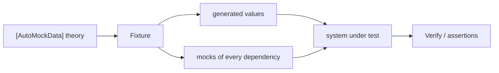

<sub>[CodeBrix](../../README.md) › [Libraries](README.md) › CodeBrix.TestMocks</sub>

# CodeBrix.TestMocks

**CodeBrix.TestMocks is one package that gives a test project mocking, auto-generated test data and
xUnit v3 data attributes.** Mock an interface and verify how it was called, generate a whole object
graph without writing a single `new`, let a theory's parameters arrive already built with every
dependency mocked - and, underneath it all, use the proxy generator directly for aspect-style
interception. Add it to the test project of any .NET 10 application, including a CodeBrix.Platform
application.

| | |
| --- | --- |
| **Repository** | [ellisnet/CodeBrix.TestMocks](https://github.com/ellisnet/CodeBrix.TestMocks) |
| **Packages** | [`CodeBrix.TestMocks.ApacheLicenseForever`](https://www.nuget.org/packages/CodeBrix.TestMocks.ApacheLicenseForever) |
| **License** | Apache License 2.0; see [License](#license) |
| **Requires** | .NET 10 or later; xUnit v3 and a runner for the data attributes; a test host that allows dynamic code generation |
| **Use it from** | Any .NET 10 test project, whatever the application under test is |
| **Platforms** | Pure managed code; no native libraries, no OS restrictions |

## What it does

- Creates mocks of interfaces and of the virtual members of a class, configures them and verifies how
  they were called: `new Mock<T>()`, `Mock.Of<T>()`, `Setup(...)`, `Returns(...)`, `Verify(...)`
- Matches arguments precisely - `It.IsAny<T>()`, `It.Is<T>(x => ...)`,
  `It.IsInRange(1, 100, Range.Inclusive)`, type matchers for generic methods, `It.Ref<T>.IsAny` for
  ref/out parameters, `Match.Create` for a reusable matcher, and `Capture.In` to keep the argument
- Asserts call counts with `Times.Once()`, `Times.Never()`, `Times.Exactly(n)`, `Times.AtLeastOnce()`,
  and exposes the raw recorded calls through `mock.Invocations` and `mock.Setups`
- Covers callbacks, call sequences, property stubs, conditional setups, ordering across mocks with
  `MockSequence`, and repositories that create and verify a group of mocks together
- Simulates events: set them up, raise them directly or as the side effect of a call, and verify
  subscription and unsubscription
- Sets up async members with `ReturnsAsync` and `ThrowsAsync`, including delay overloads and the
  sequence forms
- Generates anonymous test data and whole object graphs - `Fixture`, `Create<T>()`, `CreateMany<T>()`,
  `Freeze<T>()` and the `Build<T>().With(...).Without(...).Create()` chain
- Honors data annotations when generating values: `[Range]`, `[StringLength]`, `[MinLength]`,
  `[MaxLength]`, `[RegularExpression]` and `[EnumDataType]`
- Auto-mocks constructor dependencies, so a system under test can be built with every dependency mocked
  and no fixture plumbing in the test body
- Plugs into xUnit v3 with `[AutoData]`, `[InlineAutoData]`, `[MemberAutoData]`, `[ClassAutoData]`,
  `[AutoMockData]`, `[InlineAutoMockData]` and the `[Frozen]` parameter attribute - and lets you derive
  your own attributes for project-wide conventions
- Exposes the proxy generator the mocking API is built on, for logging, timing, retry or lazy-loading
  interception with no mocking involved
- Generates strings that match a regular expression, which is what makes `[RegularExpression]`-annotated
  members produce realistic-looking values

## When to use it

Use it whenever a test needs a stand-in for a dependency, or values that are not the point of the test.
One package reference covers all of it, and the three layers compose: the fixture builds the data, the
auto-mocking customization supplies the dependencies, and the data attribute hands both to the test
method.



It provides no assertions. Use `Assert` from xUnit, or a fluent assertion library such as
[SilverAssertions](SilverAssertions.md), which is the family's assertion package and ships no mocks of
its own.

What it does not do, in the source's own terms:

- It does not mock sealed classes, static classes, static methods, extension methods, or non-virtual
  instance members.
- It does not provide a test runner or a test framework. xUnit v3 supplies those; this package only
  plugs data attributes into it. It does not support xUnit v2, NUnit or MSTest.
- It does not fake HTTP, databases, the clock, or the file system. Mock your own abstractions over them.
- It does not generate realistic or domain-valid data, and it is not a property-based testing /
  shrinking framework.
- It does not do integration, UI, load or snapshot testing.
- It does not run on .NET versions below 10, and it cannot run where runtime IL generation is
  unavailable - which rules out full NativeAOT and trimmed "no dynamic code" test hosts.
- Its `CodeBrix.TestMocks.Logging` types are a proxy-generator logging seam, not a logging framework for
  application code, and they are unrelated to `Microsoft.Extensions.Logging`.

## Getting started

```bash
dotnet add package CodeBrix.TestMocks.ApacheLicenseForever
```

The package id is `CodeBrix.TestMocks.ApacheLicenseForever` - not `CodeBrix.TestMocks`, which is the
assembly and the namespace root. Every public namespace in the package begins with `CodeBrix.TestMocks`.

To actually run tests the project needs the xUnit v3 framework and a runner as well; this package brings
in only the extensibility core the data attributes are built on:

```xml
<PackageReference Include="CodeBrix.TestMocks.ApacheLicenseForever" />
<PackageReference Include="xunit.v3" />
<PackageReference Include="xunit.runner.visualstudio">
  <PrivateAssets>all</PrivateAssets>
</PackageReference>
<PackageReference Include="Microsoft.NET.Test.Sdk" />
```

> [!IMPORTANT]
> On the .NET 10 SDK a `global.json` beside the solution is also required, because xUnit v3 runs on
> Microsoft Testing Platform and the SDK will not run those tests through VSTest. Without it `dotnet test`
> fails immediately with "Testing with VSTest target is no longer supported by
> Microsoft.Testing.Platform on .NET 10 SDK and later."

```json
{
  "test": {
    "runner": "Microsoft.Testing.Platform"
  }
}
```

The first test needs one using and no registration call:

```csharp
using CodeBrix.TestMocks.Mocking;
using Xunit;

public interface IOrderRepository
{
    Order GetById(int id);
    void Save(Order order);
    void Delete(int id);
}

public class OrderProcessorTests
{
    [Fact]
    public void Process_saves_the_order()
    {
        //Arrange
        var mockRepo = new Mock<IOrderRepository>();
        var order = new Order { Id = 42, CustomerName = "Alice",
                                Total = 99.95m };
        mockRepo.Setup(r => r.GetById(42)).Returns(order);
        var processor = new OrderProcessor(mockRepo.Object);

        //Act
        processor.Process(42);

        //Assert
        mockRepo.Verify(r => r.Save(It.Is<Order>(o => o.Id == 42)),
                        Times.Once());
        mockRepo.Verify(r => r.Delete(It.IsAny<int>()), Times.Never());
    }
}
```

Note `mockRepo.Object`: that is the instance to hand to the system under test, never the `Mock<T>`
itself.

## Key concepts

### The namespaces

Folder is not namespace here; these are the combinations the source itself lists for each kind of test:

```csharp
// Basic mocking:
using CodeBrix.TestMocks.Mocking;

// Mocking with hand-built fixtures:
using CodeBrix.TestMocks.AutoFixture;
using CodeBrix.TestMocks.AutoFixture.AutoMock;
using CodeBrix.TestMocks.Mocking;

// Data-driven tests with auto-mocking:
using CodeBrix.TestMocks.AutoFixture.AutoMock.Data;
using CodeBrix.TestMocks.AutoFixture.Xunit3;
using CodeBrix.TestMocks.Mocking;

// Protected member testing:
using CodeBrix.TestMocks.Mocking;
using CodeBrix.TestMocks.Mocking.Protected;

// Writing fixture extensibility:
using CodeBrix.TestMocks.AutoFixture;
using CodeBrix.TestMocks.AutoFixture.Dsl;
using CodeBrix.TestMocks.AutoFixture.Kernel;

// Direct proxy interception:
using CodeBrix.TestMocks.DynamicProxy;
```

`CodeBrix.TestMocks.Mocking.IInvocation` and `CodeBrix.TestMocks.DynamicProxy.IInvocation` are two
different types; if you import both namespaces in one file you must disambiguate. The same goes for
`CodeBrix.TestMocks.Mocking.Range`, which collides with `System.Range` in a file that uses index/range
syntax: `using Range = CodeBrix.TestMocks.Mocking.Range;`.

### Creating mocks, and MockBehavior

`Mock<T>` has constructors for the plain case, for a behavior, for constructor arguments when mocking a
class, and for an expression that names the constructor to call. `MockBehavior` is `Strict`, `Loose` or
`Default` (which is `Loose`): loose mocks return default values for calls you did not set up, strict
mocks throw a `MockException` on any call that has no matching setup.

The instance members that matter are `Object`, `Behavior`, `CallBase`, `DefaultValue`,
`DefaultValueProvider`, `Invocations`, `Setups`, `As<TInterface>()`, `SetReturnsDefault<TReturn>(...)`,
`Verify()`, `VerifyAll()` and `VerifyNoOtherCalls()`. The static side of `Mock` adds `Get<T>(mocked)`,
`Of<T>(...)` and the multi-mock `Verify` / `VerifyAll`.

### Setups, returns and recursive mocks

`Setup`, `SetupGet`, `SetupSet`, `SetupAdd`, `SetupRemove`, `SetupProperty`, `SetupAllProperties`,
`SetupSequence` and `When(condition)` are the entry points. Setup expressions may chain through
properties - the intermediate mocks are created for you:

```csharp
mock.SetupGet(m => m.Bar.Value).Returns(5);
int five = mock.Object.Bar.Value;
Mock<IBar> barMock = Mock.Get(mock.Object.Bar);   // reachable afterwards
```

`Mock<T>.CallBase` is a mock-wide switch: when true, calls with no matching setup invoke the real base
implementation instead of returning a default. It applies to class mocks only. The same idea per setup is
the `CallBase()` step in the fluent chain.

### Callbacks and the whole invocation

`Callback` takes an `Action`, an `Action<T1..T16>`, a `Delegate`, or an `InvocationAction` -
and `InvocationAction` / `InvocationFunc` give you the whole invocation, which is the way to observe
generic type arguments or write to ref/out parameters:

```csharp
mock.Setup(m => m.Method(It.IsAny<int>()))
    .Callback(new InvocationAction(inv =>
        Console.WriteLine(inv.Method.Name + ": " + inv.Arguments[0])));

mock.Setup(m => m.Compute(It.IsAny<int>()))
    .Returns(new InvocationFunc(inv => (int)inv.Arguments[0] * 2));
```

### Verification and Times

`Verify`, `VerifyGet`, `VerifySet`, `VerifyAdd`, `VerifyRemove` and `VerifyNoOtherCalls()` all accept, in
addition to the expression: nothing, a `Times`, a `Func<Times>`, a fail message, or a pair of the two.
`Verify()` with no argument checks only the setups marked `Verifiable()`; `VerifyAll()` checks every
setup. `Times` is a readonly struct with `Once()`, `Never()`, `AtLeastOnce()`, `AtLeast(n)`,
`AtMostOnce()`, `AtMost(n)`, `Exactly(n)` and `Between(from, to, rangeKind)`. A failed verification - and
an unexpected call on a strict mock - throws `MockException`, which exposes `IsVerificationError`.

When an assertion is easier to express over the recorded calls than as a `Verify` expression, read them:
`mock.Invocations` is an `IInvocationList` of `IInvocation` (`Method`, `Arguments`, `MatchingSetup`,
`IsVerified`, `ReturnValue`, `Exception`), and `mock.Setups` is the matching list of `ISetup`.

### Type matchers, protected members and LINQ to Mocks

A type matcher is used as the type argument of a generic method, not as a value: `It.IsAnyType`,
`It.IsSubtype<T>` and `It.IsValueType` are built in, and your own is any type implementing `ITypeMatcher`
with a public parameterless constructor:

```csharp
public sealed class IntOrString : ITypeMatcher
{
    public bool Matches(Type typeArgument)
        => typeArgument == typeof(int) || typeArgument == typeof(string);
}

mock.Setup(x => x.Method<IntOrString>()).Callback(() => count++);
mock.Verify(x => x.Method<IntOrString>(), Times.Exactly(3));
```

Protected members are reached through `mock.Protected()`, either by member name with the `ItExpr`
matchers, or - the type-safe way - by declaring an "analog" interface that mirrors the protected members
and using ordinary lambdas through `mock.Protected().As<IMyClassProtected>()`.

`Mock.Of<IService>(s => s.Name == "Test" && s.Id == 42)` builds a configured instance straight from a
predicate; `MockRepository` offers the same six `Of` / `OneOf` overloads as instance methods so the mocks
it makes are tracked for repository-wide verification.

### The Fixture

`Fixture` implements `IFixture`, whose surface is `Behaviors`, `Customizations`, `ResidueCollectors`,
`OmitAutoProperties`, `RepeatCount`, `Build<T>()` and the two `Customize` overloads. `RepeatCount`
defaults to 3 - that is how many items `CreateMany` produces and how many elements an auto-generated
collection gets. `OmitAutoProperties` defaults to false, so writable public properties of a created
object are filled in.

Values come from extension methods available on `IFixture`, `ISpecimenBuilder`, `ISpecimenContext` and
`IPostprocessComposer<T>`: `Create<T>()`, `CreateMany<T>()`, `CreateMany<T>(count)`, plus `Freeze`,
`Inject`, `Register`, `Repeat`, `AddMany` / `AddManyTo` and `ToCustomization`. Strings are a GUID
rendered as text, prefixed by the seed when the request carries one - they are anonymous values, not
realistic data.

`Build<T>()` shapes one object, once:

```csharp
var order = fixture.Build<Order>()
    .With(o => o.CustomerName, "SpecificCustomer")
    .With(o => o.Total, 250.00m)
    .With(o => o.Reference, () => Guid.NewGuid().ToString("N"))
    .Without(o => o.IsProcessed)
    .Do(o => o.Lines.Add(new Line()))
    .Create();
```

`Build<T>()` is a one-off: it does not change what `fixture.Create<T>()` returns. To make the shaping
permanent use `Customize<T>`. And `Freeze` is `Inject` plus "create it first": it creates one specimen
and injects it, so every later request for that type gets the same instance.

### Auto-mocking

`AutoMockCustomization` teaches the fixture to satisfy a request for an interface or abstract class by
creating a mock of it, so the fixture can build a system under test whose constructor dependencies are
all mocks:

```csharp
public class AutoMockCustomization : ICustomization
{
    AutoMockCustomization();
    AutoMockCustomization(ISpecimenBuilder relay);
    bool ConfigureMembers { get; set; }     // default false
    bool GenerateDelegates { get; set; }    // default false
    ISpecimenBuilder Relay { get; set; }    // default: new MockRelay()
    void Customize(IFixture fixture);
}
```

With `ConfigureMembers = true` every mockable member of a created mock is set up to return a value taken
from the fixture, so a dependency's methods return populated objects instead of nulls and zeros. With
`GenerateDelegates = true` delegate-typed dependencies are produced through a mock as well. A setup can
draw its return value from the fixture on demand too:

```csharp
mock.Setup(s => s.GetById(It.IsAny<int>())).ReturnsUsingFixture(fixture);
```

### The kernel

Everything is built on two one-method interfaces: `ISpecimenBuilder` (`object Create(object request,
ISpecimenContext context)`) and `ISpecimenContext` (`object Resolve(object request)`). A request is
usually a `Type`, a `PropertyInfo`, a `FieldInfo`, a `ParameterInfo`, or one of the kernel's own request
objects, and a builder that cannot handle the request must return a sentinel rather than null:
`NoSpecimen.Instance` means "not mine - ask someone else", `new OmitSpecimen()` means "produce nothing at
all here".

Three insertion points are consulted in order: `fixture.Customizations` (your builders, which win over
everything), the engine (the default construction machinery), and `fixture.ResidueCollectors`
(last-chance fallbacks such as interfaces). `fixture.Behaviors` wraps the whole graph -
`ThrowingRecursionBehavior` is present by default, and `OmitOnRecursionBehavior`, `NullRecursionBehavior`,
`TracingBehavior`, `DisposableTrackingBehavior` and `ReadonlyCollectionPropertiesBehavior` are the
alternatives:

```csharp
fixture.Behaviors.OfType<ThrowingRecursionBehavior>().ToList()
    .ForEach(b => fixture.Behaviors.Remove(b));
fixture.Behaviors.Add(new OmitOnRecursionBehavior());
```

Between them sit the composition types (`CompositeSpecimenBuilder`, `FilteringSpecimenBuilder`,
`Postprocessor`, `FixedBuilder`, `TypeRelay`, `ElementsBuilder<T>`), the request specifications
(`IRequestSpecification`), the constructor queries (`ModestConstructorQuery` is the default,
`GreedyConstructorQuery` and the array/enumerable/list-favoring ones are the alternatives) and the relays
that translate one request into another. Failures surface as `ObjectCreationException`.

### Data annotations

A default `Fixture` has data-annotation support wired into its builder graph, so `[Range(1, 10)]`,
`[StringLength(20)]`, `[MinLength(2)]` / `[MaxLength(8)]`, `[RegularExpression(@"^\d{3}$")]` and
`[EnumDataType(typeof(Suit))]` constrain the generated value. Regular-expression values are produced with
the bundled regex-driven string engine, so those patterns really do generate matching strings. To turn
the whole feature off - it costs reflection time - use
`fixture.Customize(new NoDataAnnotationsCustomization());`.

### xUnit v3 data attributes

All of them derive from xUnit v3's `DataAttribute` and feed a `[Theory]`: `[AutoData]`,
`[InlineAutoData]`, `[MemberAutoData]`, `[ClassAutoData]`, and, in
`CodeBrix.TestMocks.AutoFixture.AutoMock.Data`, `[AutoMockData]` and `[InlineAutoMockData]` - which are
exactly `[AutoData]` / `[InlineAutoData]` with a fixture already customized with
`AutoMockCustomization { ConfigureMembers = true }`. Inline values always come first in the parameter
list; the remaining parameters are generated.

Parameter-level attributes shape one argument: `[Frozen]`, `[Frozen(Matching by)]`, `[Greedy]`,
`[Modest]`, `[FavorArrays]`, `[FavorEnumerables]`, `[FavorLists]` and `[NoAutoProperties]`. `Matching`
selects what a frozen value satisfies:

```csharp
[Flags] enum Matching
{
    ExactType = 1, DirectBaseType = 2, ImplementedInterfaces = 4,
    ParameterName = 8, PropertyName = 16, FieldName = 32,
    MemberName = ParameterName | PropertyName | FieldName
}
```

To share a customized fixture across many theories, subclass the attribute and pass a fixture factory to
the protected constructor - that is the supported way, and it is shown in full below.

### Regex-driven strings

The string generator the fixture uses for `[RegularExpression]` members is public, so you can call it
directly. Pass a seeded `Random` when you need reproducible values:

```csharp
class Xeger
{
    Xeger(string regex);
    Xeger(string regex, Random random);
    string Generate();
}

var sku = new Xeger(@"[A-Z]{3}-\d{4}").Generate();   // e.g. "QWE-8412"
var seeded = new Xeger(@"\d{3}", new Random(1234)).Generate();
```

Anchors (`^` and `$`) are stripped before generation and the "any string" syntax option is disabled, so
use character classes and quantifiers rather than relying on anchoring.

### The dynamic proxy

The proxy generator that the mocking API is built on is public, and can be used directly for aspect-style
interception - logging, timing, retry, lazy loading - without any mocking involved. `ProxyGenerator`
creates interface proxies with a target, with a target interface or without a target, and class proxies
with or without a target, each in generic and `Type`-based forms.

An interceptor is `void Intercept(IInvocation invocation)`, where the DynamicProxy `IInvocation` exposes
`Arguments`, `GenericArguments`, `InvocationTarget`, `Method`, `Proxy`, `ReturnValue`, `TargetType`,
`GetArgumentValue`, `SetArgumentValue`, `Proceed()` and `CaptureProceedInfo()`. `IProxyGenerationHook`
and `IInterceptorSelector` decide what gets intercepted and by whom, `ProxyGenerationOptions` carries the
hook, the selector and any mixins, and `ProxyUtil` answers `IsProxy`, `GetUnproxiedType` and friends. Only
virtual and abstract members of classes, and all members of interfaces, can be intercepted - the same
limitation as mocking, for the same reason.

## Examples

The same test written three ways, from the most explicit to the least. First, a hand-built fixture with
auto-mocking, showing `Freeze`:

```csharp
using CodeBrix.TestMocks.AutoFixture;
using CodeBrix.TestMocks.AutoFixture.AutoMock;
using CodeBrix.TestMocks.Mocking;
using Xunit;

[Fact]
public void Process_saves_the_generated_order()
{
    //Arrange
    var fixture = new Fixture();
    fixture.Customize(new AutoMockCustomization
                      { ConfigureMembers = true });

    var mockRepo = fixture.Freeze<Mock<IOrderRepository>>();
    var order = fixture.Create<Order>();
    mockRepo.Setup(r => r.GetById(order.Id)).Returns(order);

    var processor = fixture.Create<OrderProcessor>();

    //Act
    processor.Process(order.Id);

    //Assert
    mockRepo.Verify(r => r.Save(order), Times.Once());
}
```

Then the same test as a data-driven theory, where one attribute replaces all of the plumbing:

```csharp
using CodeBrix.TestMocks.AutoFixture.AutoMock.Data;
using CodeBrix.TestMocks.AutoFixture.Xunit3;
using CodeBrix.TestMocks.Mocking;
using Xunit;

[Theory, AutoMockData]
public void Process_saves_and_notifies(
    [Frozen] Mock<IOrderRepository> mockRepo,
    [Frozen] Mock<IEmailService> mockEmail,
    Order order,
    OrderProcessor sut)
{
    //Arrange
    mockRepo.Setup(r => r.GetById(order.Id)).Returns(order);

    //Act
    sut.Process(order.Id);

    //Assert
    mockRepo.Verify(r => r.Save(order), Times.Once());
    mockEmail.Verify(e => e.SendConfirmation(order.CustomerName),
                     Times.Once());
}
```

Async setups, including a sequence whose second call throws:

```csharp
using CodeBrix.TestMocks.Mocking;
using Xunit;

public interface IOrderRepository
{
    Task<Order> GetByIdAsync(int id);
    Task SaveAsync(Order order);
    ValueTask<int> CountAsync();
}

[Fact]
public async Task ProcessAsync_saves_the_order()
{
    //Arrange
    var mockRepo = new Mock<IOrderRepository>();
    mockRepo.Setup(r => r.GetByIdAsync(42))
            .ReturnsAsync(new Order { Id = 42 });
    mockRepo.Setup(r => r.CountAsync()).ReturnsAsync(1);
    mockRepo.SetupSequence(r => r.GetByIdAsync(7))
            .ReturnsAsync(new Order { Id = 7 })
            .ThrowsAsync(new TimeoutException());

    var processor = new OrderProcessor(mockRepo.Object);

    //Act
    await processor.ProcessAsync(42);

    //Assert
    mockRepo.Verify(r => r.SaveAsync(It.IsAny<Order>()), Times.Once());
}
```

Events end to end - subscribe, raise as a side effect of a call, raise directly, and verify the add and
the remove:

```csharp
using System;
using CodeBrix.TestMocks.Mocking;
using Xunit;

public interface IMonitor
{
    event EventHandler<StatusEventArgs> StatusChanged;
    void Start();
}

[Fact]
public void Watcher_subscribes_and_reacts()
{
    //Arrange
    var mock = new Mock<IMonitor>();
    mock.SetupAdd(m => m.StatusChanged +=
                       It.IsAny<EventHandler<StatusEventArgs>>());
    mock.SetupRemove(m => m.StatusChanged -=
                          It.IsAny<EventHandler<StatusEventArgs>>());
    // raising an event as a side effect of a method call:
    mock.Setup(m => m.Start())
        .Raises(m => m.StatusChanged += null,
                mock.Object, new StatusEventArgs("running"));

    var watcher = new Watcher(mock.Object);   // subscribes in its ctor

    //Act
    watcher.Begin();                          // calls IMonitor.Start()
    mock.Raise(m => m.StatusChanged += null,
               mock.Object, new StatusEventArgs("stopped"));
    watcher.Dispose();                        // unsubscribes

    //Assert
    Assert.Equal(new[] { "running", "stopped" }, watcher.Seen);
    mock.VerifyAdd(m => m.StatusChanged +=
                        It.IsAny<EventHandler<StatusEventArgs>>(),
                   Times.Once());
    mock.VerifyRemove(m => m.StatusChanged -=
                           It.IsAny<EventHandler<StatusEventArgs>>(),
                      Times.Once());
}
```

One project-wide `ICustomization` and the data attribute that uses it - auto-mocking, a custom builder,
a residue-collector `TypeRelay`, permanent shaping and the recursion-behavior swap, all in one place:

```csharp
using System;
using System.Linq;
using CodeBrix.TestMocks.AutoFixture;
using CodeBrix.TestMocks.AutoFixture.AutoMock;
using CodeBrix.TestMocks.AutoFixture.Kernel;
using CodeBrix.TestMocks.AutoFixture.Xunit3;

public sealed class DomainCustomization : ICustomization
{
    public void Customize(IFixture fixture)
    {
        if (fixture == null) throw new ArgumentNullException(nameof(fixture));

        // mock every abstraction the SUT asks for
        fixture.Customize(new AutoMockCustomization
                          { ConfigureMembers = true });

        // a project-specific builder
        fixture.Customizations.Add(new EmailAddressBuilder());

        // last-chance mapping for an abstraction with one obvious impl
        fixture.ResidueCollectors.Add(
            new TypeRelay(typeof(IClock), typeof(SystemClock)));

        // permanent shaping of one aggregate
        fixture.Customize<Order>(c => c
            .With(o => o.IsProcessed, false)
            .Without(o => o.Id));

        fixture.RepeatCount = 5;

        // this domain has circular navigation properties
        fixture.Behaviors.OfType<ThrowingRecursionBehavior>().ToList()
            .ForEach(b => fixture.Behaviors.Remove(b));
        fixture.Behaviors.Add(new OmitOnRecursionBehavior());
    }
}

public class DomainAutoDataAttribute : AutoDataAttribute
{
    public DomainAutoDataAttribute() : base(CreateFixture) { }

    private static IFixture CreateFixture()
        => new Fixture().Customize(new DomainCustomization());
}

// Usage
[Theory, DomainAutoData]
public void Order_starts_unprocessed(Order order)
    => Assert.False(order.IsProcessed);
```

The custom builder that customization registers, showing the `NoSpecimen.Instance` sentinel and the two
ways to narrow or package a builder:

```csharp
using System;
using System.Reflection;
using CodeBrix.TestMocks.AutoFixture;
using CodeBrix.TestMocks.AutoFixture.Kernel;

// Any string property or parameter whose name ends in "Email" gets a
// value that actually looks like an e-mail address.
public sealed class EmailAddressBuilder : ISpecimenBuilder
{
    public object Create(object request, ISpecimenContext context)
    {
        if (context == null) throw new ArgumentNullException(nameof(context));

        string name = request switch
        {
            PropertyInfo pi when pi.PropertyType == typeof(string)
                => pi.Name,
            ParameterInfo pa when pa.ParameterType == typeof(string)
                => pa.Name,
            _ => null
        };

        if (name == null ||
            !name.EndsWith("Email", StringComparison.OrdinalIgnoreCase))
        {
            return NoSpecimen.Instance;   // not mine — let others try
        }

        var local = context.Resolve(typeof(string));
        if (local is NoSpecimen) return local;

        return local + "@example.com";
    }
}

// Register it — Customizations are consulted before everything else
var fixture = new Fixture();
fixture.Customizations.Add(new EmailAddressBuilder());

// Any builder can be narrowed with a specification instead of doing the
// filtering by hand inside Create():
fixture.Customizations.Add(new FilteringSpecimenBuilder(
    new ElementsBuilder<string>("red", "green", "blue"),
    new PropertySpecification(typeof(string), "Colour")));

// ...and any builder can be packaged as a customization:
ICustomization asCustomization = new EmailAddressBuilder().ToCustomization();

// Return new OmitSpecimen() instead of a value to leave the member unset.
```

The proxy generator on its own, with a generation hook that narrows what is intercepted:

```csharp
using System;
using System.Collections.Generic;
using System.Diagnostics;
using System.Reflection;
using CodeBrix.TestMocks.DynamicProxy;
using Xunit;

public sealed class TimingInterceptor : IInterceptor
{
    public List<string> Log { get; } = new List<string>();

    public void Intercept(IInvocation invocation)
    {
        var sw = Stopwatch.StartNew();
        invocation.Proceed();                 // call the real member
        sw.Stop();

        this.Log.Add($"{invocation.Method.Name} " +
                     $"({invocation.Arguments.Length} args) " +
                     $"took {sw.ElapsedMilliseconds} ms");

        if (invocation.ReturnValue is int value)
        {
            invocation.ReturnValue = value;   // could rewrite it here
        }
    }
}

[Fact]
public void Interceptor_wraps_every_call()
{
    //Arrange
    var generator = new ProxyGenerator();
    var interceptor = new TimingInterceptor();

    ICalculator proxy = generator.CreateInterfaceProxyWithTarget<ICalculator>(
        new Calculator(), interceptor);

    //Act
    int sum = proxy.Add(2, 3);

    //Assert
    Assert.Equal(5, sum);
    Assert.Single(interceptor.Log);
    Assert.True(ProxyUtil.IsProxy(proxy));
    Assert.Equal(typeof(Calculator), ProxyUtil.GetUnproxiedType(proxy));
}

// Choose which members are intercepted:
var options = new ProxyGenerationOptions(new OnlyPublicMethodsHook());
var proxy2 = generator.CreateClassProxy<Calculator>(options, interceptor);

public sealed class OnlyPublicMethodsHook : AllMethodsHook
{
    public override bool ShouldInterceptMethod(Type type, MethodInfo mi)
        => mi.IsPublic;
}

// CreateInterfaceProxyWithoutTarget has nothing to Proceed() to; an
// interceptor for such a proxy must set invocation.ReturnValue itself.
```

## Using it in a CodeBrix.Platform application

Nothing special is needed, and nothing is registered. A CodeBrix.Platform application is tested the way
any other .NET application is: a `net10.0` test project references this package, xUnit v3, its runner and
`Microsoft.NET.Test.Sdk`, carries the `global.json` above, and mocks the services and abstractions the
view models depend on.

> [!WARNING]
> Mocking and proxy generation use runtime IL emission, so the test host must allow dynamic code
> generation. A fully NativeAOT or trimmed "no dynamic code" test host cannot run these tests. That is a
> constraint on the test host only - it says nothing about how the application under test is published.

## Pitfalls

- Do not confuse the package id with the namespaces. The package is
  `CodeBrix.TestMocks.ApacheLicenseForever`; every namespace begins with `CodeBrix.TestMocks`.
- Do not forget `[Frozen]` or `Freeze` when a mock must reach the system under test. This is the single
  most common cause of "Verify says the call never happened": without it, the mock you configured and
  the mock the SUT received are different instances.
- Do not try to mock sealed classes, static members, or non-virtual members of a concrete class. Only
  interfaces, and abstract or virtual members of non-sealed classes, can be intercepted.
- Do not pass the `Mock<T>` itself to the system under test. Pass `mock.Object`.
- Do not expect a circular object graph to work. A default `Fixture` carries
  `ThrowingRecursionBehavior` and throws an `ObjectCreationException` naming the circular path; remove it
  and add `OmitOnRecursionBehavior` or `NullRecursionBehavior`.
- Do not return null from `ISpecimenBuilder.Create`. Return `NoSpecimen.Instance` for "not my request"
  and `new OmitSpecimen()` for "leave this unset"; null is a legitimate specimen and will be treated as
  one.
- Do not expect `Build<T>()` to change later `Create<T>()` calls. `Build` is a one-off pipeline;
  `Customize<T>(...)` is the persistent form.
- Do not assume out/ref arguments behave like normal matchers. The value of an out argument in a setup is
  captured eagerly when the setup is made, and a ref argument matches only the same value or instance
  unless you use `It.Ref<T>.IsAny`.
- Do not mix up the two `IInvocation` types. `CodeBrix.TestMocks.Mocking.IInvocation` describes a
  recorded call on a mock; the DynamicProxy one is the live interception context with `Proceed()`.
- Do not call `invocation.Proceed()` in an interceptor attached to a proxy created without a target -
  there is nothing to proceed to. Set `invocation.ReturnValue` instead.
- Do not expect realistic data. Strings are GUID-based, numbers are arbitrary. If a value must look real,
  register a builder or use a `[RegularExpression]` annotation - and assert on relationships (the value
  that went in came out), never on the content of a generated value.
- Do not use xUnit v2. These attributes derive from xUnit v3's `DataAttribute`, so `[Theory]` must come
  from xUnit v3.
- Do not expect the test explorer to expand `[AutoData]` theories into one row per case before the run.
  Discovery enumeration is not supported, because the data does not exist until the fixture runs.
- Do not set `mock.DefaultValue = DefaultValue.Custom`. It throws; `Custom` is what the property reports
  once you assign a `DefaultValueProvider`.
- Do not let `CodeBrix.TestMocks.Mocking.Range` collide with `System.Range` in a file that uses
  index/range syntax - alias one of them.
- Do not treat `mock.Reset()` as "clear the calls". It also drops every setup, configured default value
  and registered event handler. To forget only the recorded calls, use `mock.Invocations.Clear()`.
- Do not use `MatcherAttribute` or `AutoConfiguredMockCustomization` in new code; both are obsolete. Use
  `Match.Create` and `AutoMockCustomization { ConfigureMembers = true }`.
- Do not build against the types under `CodeBrix.TestMocks.AutoFixture.Xunit3.Internal`. They are public
  only so the attributes can share them.
- Do not pass `--nologo` to `dotnet test` in Microsoft Testing Platform mode. It is a VSTest-only switch;
  the SDK forwards it to the test application, which rejects it and exits before discovery, so the run
  reports "Zero tests ran" and no test actually executes. The spelling to use is
  `dotnet test -- --no-banner`.
- Keep `MockBehavior.Loose`, the default. Strict mocks throw on any call you did not anticipate, so every
  unrelated refactor breaks the test; reach for `Strict` only when "nothing else may be called" is the
  actual assertion, or end a loose test with `VerifyNoOtherCalls()` instead.
- Reuse one `ProxyGenerator` when using the dynamic proxy directly - it caches generated proxy types, and
  a fresh generator per call re-emits IL.

## Documentation and source

| Document | Where |
| --- | --- |
| Overview (README) | [README.md](https://github.com/ellisnet/CodeBrix.TestMocks/blob/main/README.md) |
| Complete API guide (ships inside the package too) | [AGENT-README.txt](https://github.com/ellisnet/CodeBrix.TestMocks/blob/main/AGENT-README.txt) |
| Map of every document in the repository | [README-INDEX.txt](https://github.com/ellisnet/CodeBrix.TestMocks/blob/main/README-INDEX.txt) |
| Tests (worked examples of every API) | [tests/CodeBrix.TestMocks.Tests](https://github.com/ellisnet/CodeBrix.TestMocks/tree/main/tests/CodeBrix.TestMocks.Tests) |

The repository ships no sample applications. The test project mirrors the library's own folder structure
- mocking at the root with `Async/`, `Linq/`, `Matchers/`, `Helpers/`, `ProxyFactories/` and
`Regressions/` beside it, and the test-data suites under `AutoFixture/` - and it doubles as the most
complete set of worked examples for the library's behavior. It needs no environment variables, no
external services and no platform-specific prerequisites: the `global.json` that selects the Microsoft
Testing Platform runner is committed at the repository root, so a fresh clone runs the suite as-is.

## License

CodeBrix.TestMocks is licensed under the Apache License 2.0; the license is also named in the package ID
(`CodeBrix.TestMocks.ApacheLicenseForever`), and the package requires license acceptance. For the
provenance and licensing of open source code included in this library, see
[THIRD-PARTY-NOTICES.txt](https://github.com/ellisnet/CodeBrix.TestMocks/blob/main/THIRD-PARTY-NOTICES.txt)
in the repository, which also ships inside the package.

---

**Where to go next**

- [SilverAssertions](SilverAssertions.md) - the assertion vocabulary to pair with these mocks
- [Testing your application](../platform/10-testing-your-application.md) - how a CodeBrix.Platform application is tested end to end
- [Library catalog](README.md) - every CodeBrix library by topic
- [ellisnet/CodeBrix.TestMocks on GitHub](https://github.com/ellisnet/CodeBrix.TestMocks) - source and tests
