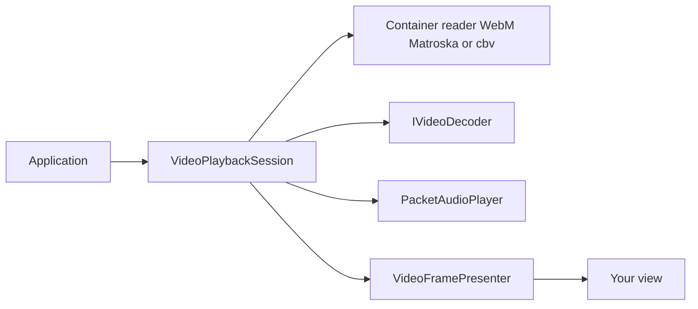

<sub>[CodeBrix](../../README.md) › [Libraries](README.md) › CodeBrix.VideoPlayback</sub>

# CodeBrix.VideoPlayback

**CodeBrix.VideoPlayback plays video in .NET without a royalty-bearing codec, a copyleft binary, or an
MP4-family dependency anywhere in the shipped application.** It reads WebM and Matroska carrying AV1
video with Opus or Vorbis audio plus text caption tracks, and it reads and writes `.cbv`, a bespoke
container laid out so that the whole index and every caption cue sit in front of the media data. The
repository produces three libraries - playback, a presenter that draws the frames through SkiaSharp,
and a developer-machine library that writes the files the first one reads - and you reach for them from
any .NET 10 application or from a CodeBrix.Platform application.

| | |
| --- | --- |
| **Repository** | [ellisnet/CodeBrix.VideoPlayback](https://github.com/ellisnet/CodeBrix.VideoPlayback) |
| **Packages** | [`CodeBrix.VideoPlayback.MitLicenseForever`](https://www.nuget.org/packages/CodeBrix.VideoPlayback.MitLicenseForever)<br>[`CodeBrix.VideoPlayback.Skia.MitLicenseForever`](https://www.nuget.org/packages/CodeBrix.VideoPlayback.Skia.MitLicenseForever)<br>[`CodeBrix.VideoPlayback.Authoring.MitLicenseForever`](https://www.nuget.org/packages/CodeBrix.VideoPlayback.Authoring.MitLicenseForever) |
| **License** | MIT; see [License](#license) |
| **Requires** | .NET 10 or later. The presenter also needs a SkiaSharp native-asset package on Linux; the authoring library needs FFmpeg on the machine that runs it |
| **Use it from** | Any .NET 10 application, or a CodeBrix.Platform application |
| **Platforms** | The playback core has no native binaries and no drawing dependency: it runs anywhere .NET 10 runs |

## What it does

- Plays a file, a stream, bytes in memory, a memory-mapped file or an HTTP URL through one
  `VideoPlaybackSession`, with a transport, a clock, A/V sync, seeking, looping, captions and chapters.
- Reads WebM and Matroska carrying AV1 video with Opus or Vorbis audio, plus any number of text
  caption tracks.
- Reads and writes `.cbv`, the bespoke container, with its index and every caption cue in front of the
  media data.
- Hands out frames from a buffer pool whose layout lets a decoder write straight into the memory a
  presenter uploads from - no copy in between, and nothing allocated per frame once playback is warm.
- Publishes the newest picture through a frame presenter: a one-slot mailbox, so the drawing side never
  waits and never shows a stale picture.
- Converts planar YUV to BGRA with a managed SIMD converter, for when there is no graphics device to do it.
- Carries a color lookup-table engine - 1D and 3D tables, `.cube` reading and writing, and layered
  chains folded into one resultant table.
- Ships container readers for EBML, Matroska/WebM and `.cbv`, and writers for `.cbv`, IVF and Ogg.
- Offers a codec-neutral decoder seam that decoder packages register themselves into, and a
  streamable-profile checker that says whether a file really is laid out the way a `.cbv` promises.
- Draws, in the `.Skia` package, through one class - `SkiaVideoPresenter` - which composes the newest
  frame on an off-screen surface and blits the result into whatever canvas your application owns, with
  a graphics-device path, a processor path, letterboxing, overlay layers and color effects.
- Writes, in the `.Authoring` package, a source video plus its caption files and a chapter file into a
  `.cbv` with one call, in either flavor, with device-class presets, a baked color grade, a dry run and
  a profile report over the finished file.

## When to use it

Reach for CodeBrix.VideoPlayback when an application has to play video and the shipped output must stay
free of MP4-family formats and their codec licensing. The playback core is the piece every application
takes; the other two are chosen by role. Take
[`CodeBrix.VideoPlayback.Skia.MitLicenseForever`](https://www.nuget.org/packages/CodeBrix.VideoPlayback.Skia.MitLicenseForever)
when your host already gives you a Skia canvas to draw on, and take
[`CodeBrix.VideoPlayback.Authoring.MitLicenseForever`](https://www.nuget.org/packages/CodeBrix.VideoPlayback.Authoring.MitLicenseForever)
in a build tool, an asset pipeline or a content-authoring utility - never in the thing you ship to a
customer.

Coded video needs a decoder package beside the core. Add
[CodeBrix.VideoPlayback.Dav1d](CodeBrix.VideoPlayback.Dav1d.md) to play AV1, and
[CodeBrix.Audio.Opus](CodeBrix.Audio.Opus.md) to play Opus audio; Vorbis audio is built into
[CodeBrix.Audio](CodeBrix.Audio.md), which the core package brings with it.

What the playback core deliberately does not do:

- It does not decode coded video. The decoder seam is the product, and the only codec in the box is the
  uncompressed one, for `V_UNCOMPRESSED` tracks - a diagnostics and test codec, not a distribution format.
- It does not draw. There is no drawing surface, no bitmap type, no dependency on any drawing library.
- No MP4 / ISOBMFF, no H.264, no HEVC, no AAC.
- No hardware or GPU decoding, no HDR tone-mapping, no playback rate other than 1.0.
- No streaming protocol beyond plain HTTP and HTTPS - no HLS, no DASH, no RTSP. No DRM of any kind.
- No caption rendering. It carries caption tracks, cues, settings and flags faithfully; drawing them is
  a presenter's job.
- No rotation metadata for foreign files, no AV1 alpha, no nested or ordered chapters, no multiple
  chapter editions.
- No writing of WebM or Matroska. It reads them; it writes only `.cbv`. And no encoding of any kind.

The presenter is not a view: there is no control, no element and no XAML type in it, it creates no
graphics context, it renders no captions, and it does no neighborhood effects - blurs, sharpens, warps
and scalers are not color lookups and cannot be folded into one table. The authoring library does not
decode or play anything, does not edit, and never writes MP4, H.264, HEVC or AAC.

## Getting started

```bash
dotnet add package CodeBrix.VideoPlayback.MitLicenseForever
dotnet add package CodeBrix.VideoPlayback.Skia.MitLicenseForever
dotnet add package CodeBrix.VideoPlayback.Authoring.MitLicenseForever
```

The three are published together and are taken at matching versions. Most applications need only the
first; the second goes in the project that draws, and the third only in a developer-machine tool.

These are the namespaces the core package offers. Playing a file needs the first three; everything else
is there when you want it.

```csharp
using CodeBrix.VideoPlayback;               // VideoPlaybackSession, VideoPlaybackOptions,
                                            //   VideoPlaybackException
using CodeBrix.VideoPlayback.Playback;      // VideoPlaybackState, VideoSeekMode, the event args
using CodeBrix.VideoPlayback.Presentation;  // VideoFramePresenter
using CodeBrix.VideoPlayback.Frames;        // VideoFrame, VideoFramePlane, the buffer pool
using CodeBrix.VideoPlayback.Decoding;      // VideoDecoders, IVideoDecoder, colour metadata
using CodeBrix.VideoPlayback.Color;         // VideoFrameConverter, BgraFrameBufferPool
using CodeBrix.VideoPlayback.Color.Luts;    // Lut3D, Lut1D, CubeLutFile, LutComposer, LutLayer
using CodeBrix.VideoPlayback.Captions;      // CaptionTrack, CaptionCue, CaptionFiles
using CodeBrix.VideoPlayback.Chapters;      // Chapter, FfMetadataChapters
using CodeBrix.VideoPlayback.Sources;       // IMediaSource and the five ways to open one
using CodeBrix.VideoPlayback.Containers;    // MediaTrackInfo, MediaPacket, IMediaContainerReader,
                                            //   MediaContainers, StreamableProfile, LanguageTags
using CodeBrix.VideoPlayback.Containers.Cbv;       // CbvReader, CbvMuxer, CbvAuthoring
using CodeBrix.VideoPlayback.Containers.Matroska;  // MatroskaReader
using CodeBrix.VideoPlayback.Containers.Ebml;      // EbmlReader, EbmlCrc32
using CodeBrix.VideoPlayback.Containers.Ogg;       // OggAudioStream / OggAudioWriter,
                                                   //   OggReader / OggStreamWriter, OggChecksum
using CodeBrix.VideoPlayback.Containers.Ivf;       // IvfReader / IvfWriter (authoring)
using CodeBrix.VideoPlayback.Codecs;        // Av1Bitstream, RawVideoFormat,
                                            //   RawVideoDecoder(Factory) - the built-in codec
using CodeBrix.VideoPlayback.Effects;       // IVideoFrameEffect, LutEffect, EffectComposer
using CodeBrix.VideoPlayback.Rendering;     // VideoStretch, VideoRenderPath, VideoRectangle,
                                            //   VideoCompositionContext, VideoStretchMath,
                                            //   GpuUploadFence, the shader source
```

This is a whole player: open a file, start it, and repaint a view whenever a frame is ready.

```csharp
using System;
using CodeBrix.VideoPlayback;
using CodeBrix.VideoPlayback.Frames;

VideoPlaybackSession session = new VideoPlaybackSession();
session.MediaOpened += (s, e) => Console.WriteLine($"{session.Duration} of video");
session.MediaFailed += (s, e) => Console.WriteLine(e.Message);
session.FrameReady += (s, e) => myView.Invalidate();   // mark dirty; draw later

session.Open("clip.cbv");
session.Play();

// ... on the thread that draws, inside your paint handler:
if (session.Presenter.TryTakeLatest(out VideoFrame frame))
{
    using (frame)
    {
        // frame.Y / frame.U / frame.V are the planes; see example 2.
    }
}
```

Notice that `FrameReady` only says "repaint": it fires on the decoding thread, and the frame is taken
on the thread that owns the drawing surface.

## Key concepts

### How the pieces fit together

The session decodes and paces; the presenter holds the newest frame; a drawing package supplies a
canvas and nothing else. Audio plays through [CodeBrix.Audio](CodeBrix.Audio.md).



### The playback session

`VideoPlaybackSession` is the whole transport, and everything on it has a working default.

```csharp
new VideoPlaybackSession()
new VideoPlaybackSession(VideoPlaybackOptions options)

void Open(string pathOrUrl)
void Open(string pathOrUrl, FileSourceMode mode)
void Open(Stream stream, string name = null, bool leaveOpen = false)
void Open(PreloadedClip clip)
void Open(IMediaSource mediaSource, bool leaveOpen = false)

void Play()                 void Pause()      void Stop()
void Seek(TimeSpan position)
void Close()                void Dispose()

TimeSpan Position { get; }          TimeSpan Duration { get; }
bool IsPlaying { get; }             bool IsOpen { get; }
bool IsLooping { get; set; }
float Volume { get; set; }          bool IsMuted { get; set; }
VideoPlaybackState State { get; }
VideoPlaybackOptions Options { get; }

IReadOnlyList<MediaTrackInfo> Tracks { get; }
MediaTrackInfo VideoTrack { get; }   MediaTrackInfo AudioTrack { get; }
VideoStreamInfo VideoStreamInfo { get; }
IReadOnlyList<string> Notices { get; }

VideoFramePresenter Presenter { get; }
IVideoFrameBufferPool BufferPool { get; }

IReadOnlyList<CaptionTrack> CaptionTracks { get; }
CaptionTrack SelectedCaptionTrack { get; set; }     // null = captions off
bool ShowForcedCaptions { get; set; }               // default true
IReadOnlyList<CaptionCue> ActiveCues { get; }

IReadOnlyList<Chapter> Chapters { get; }
Chapter CurrentChapter { get; }
void SeekToChapter(int index)
bool NextChapter()        bool PreviousChapter()
string TitleFor(Chapter chapter, IReadOnlyList<string> preferredLanguages)

void RegisterDecoderFactory(IVideoDecoderFactory factory)   // this session only

event EventHandler MediaOpened
event EventHandler<VideoPositionChangedEventArgs> PositionChanged
event EventHandler PlaybackEnded
event EventHandler<MediaFailedEventArgs> MediaFailed
event EventHandler<VideoFrameReadyEventArgs> FrameReady
event EventHandler CaptionCuesChanged
event EventHandler<ChapterChangedEventArgs> ChapterChanged
```

`VideoPlaybackOptions` carries the knobs, all with working defaults.

```csharp
VideoSeekMode SeekMode              Exact (default) | KeyFrameOnly
int VideoQueueCapacity              32
int AudioQueueCapacity              128
long MaxTrackParkingBytes           32 MB per track
TimeSpan PositionUpdateInterval     100 ms
TimeSpan LateFrameTolerance         40 ms
int ConsecutiveLateFramesBeforeSkip 4
bool PlayAudio                      true
int AudioSampleRate                 48000  (0 = leave the shared output alone)
bool DecodeAheadWhilePaused         true
VideoDecoderOptions DecoderOptions  Threads, MaxFrameDelay, FrameSizeLimit,
                                    ApplyFilmGrain (the pool is filled in for you)
```

### The one-slot mailbox

`VideoFramePresenter` always holds the newest frame and nothing older, so the drawing side never waits.

```csharp
bool TryTakeLatest(out VideoFrame frame)   // you now own the frame; dispose it
void Post(VideoFrame frame)                // the presenter takes its own reference
bool HasFrame { get; }
TimeSpan LastPresentedTimestamp { get; }
event EventHandler Invalidated
VideoFramePresenterStatistics GetStatistics()   // Posted/Presented/Superseded/Late
void NotifyLateFrameDropped(int count = 1)
void Clear()   void ResetStatistics()   void Dispose()
```

A rising `Superseded` count is the display being slower than the video, which is fine. A rising `Late`
count is the decoder falling behind, which is not.

### Frames are reference-counted

A `VideoFrame` is one decoded picture over pooled memory. Whoever obtains one owns a single reference
and must dispose it; anything that needs the frame to outlive that scope calls `Retain()` and disposes
the result in turn.

```csharp
VideoFramePlane Y, U, V           // IntPtr Data, int Stride, Width, Height,
                                  //   BytesPerSample; GetRowBytes(row)
VideoFrameBuffer Buffer
int Width, Height, DisplayWidth, DisplayHeight
VideoPixelLayout Layout           // Gray | I420 | I422 | I444
int BitDepth, MaxSampleValue, ChromaShiftX, ChromaShiftY
TimeSpan Timestamp                long PresentationTimestamp, FrameNumber
bool IsKeyFrame
VideoColorInfo Color              HdrMetadata Hdr        VideoFrameInfo Info
int ReferenceCount { get; }
VideoFrame Retain()               // +1; the SAME object, dispose it in turn
void Dispose()                    // -1; at zero the buffer goes back to the pool
static VideoFrame Create(VideoFrameBuffer buffer, in VideoFrameInfo info,
                         IVideoFrameBufferPool pool)
```

The session owns a `PinnedFrameBufferPool` and hands it to every decoder, so most applications never
implement `IVideoFrameBufferPool` themselves. Implement it only to supply memory of your own, and then
honor the layout promises: 64-byte-aligned planes, strides a multiple of 64, both dimensions rounded up
to 128 samples, 64 bytes of slack after each plane, the chroma planes sharing a stride, and 10-bit and
12-bit samples as little-endian 16-bit words justified towards the least significant bit.

### Five ways in

```csharp
MediaSources.Open(pathOrUrl, FileSourceMode.Streaming | MemoryMapped | Preloaded)
new FileMediaSource(path)              streams from disk, seeks with the file system
new MemoryMappedMediaSource(path)      free seeks, the operating system pages it
PreloadedClip.FromFile(path)           whole file in a pooled buffer; .OpenSource()
HttpMediaSource.Create(uri)            byte ranges when the server has them,
                                       progressive download when it does not
new StreamMediaSource(stream)          any stream; seekable ones can seek
new MemoryMediaSource(bytes)           bytes you already have
```

Over a network, prefer files whose index is at the front: those open in one request.

### Decoders register themselves

Nothing is guessed at and nothing is reflected on. A file whose codec has no decoder fails with a
message naming the package to add.

```csharp
VideoDecoders.Register(IVideoDecoderFactory factory)     // process-wide, idempotent
VideoDecoders.Unregister(factory)                        // returns true if it was there
VideoDecoders.IsCodecSupported("av01")
VideoDecoders.RegisteredFactories                        // highest priority first
VideoDecoders.BuiltInRawVideoFactory                     // the built-in one, by name
session.RegisterDecoderFactory(factory)                  // this session only, tried first
VideoCodecIds.Av1 / Opus / Vorbis / WebVtt / SubRip / Ass / Raw

AudioDecoders.IsCodecSupported("opus")                   // asks, starts NOTHING
AudioDecoders.SupportedCodecIds                          // asks, starts NOTHING
```

Both questions can be asked before a file is opened, and neither starts a decoder, a device or a
thread - which is what a file browser or a preflight check wants, and what makes a headless run honest.
Registering is one call per package: `CodeBrixVideoPlaybackDav1d.Register()` for AV1 video and
`CodeBrixAudioOpus.Register()` for Opus audio. Call `SharedAudioOutput.Configure(48000)` before the
first sound of any kind.

### Containers, without playing anything

```csharp
new MatroskaReader(IMediaSource source, bool leaveSourceOpen = false)
new CbvReader(IMediaSource source, bool leaveSourceOpen = false)
Both implement IMediaContainerReader:
    FormatName, Duration, CanSeek, Tracks, CaptionTracks, Chapters, Notices
    bool TryReadPacket(out MediaPacket packet)
    bool IsTrackExhausted(int trackId)
    TimeSpan? GetTrackEndTimestamp(int trackId)
    TimeSpan Seek(TimeSpan position, int keyFrameTrackId)

MediaContainers.Open(string pathOrUrl)                  the reader the header calls for
MediaContainers.Open(IMediaSource source, bool leaveSourceOpen = false)
```

`MediaContainers.Open` sniffs the first four bytes - `CbvReader` for a file beginning "CBVF",
`MatroskaReader` for one beginning `1A 45 DF A3`. The extension is never consulted, which is exactly why
the two `.cbv` flavors can share one name. `MatroskaReader.IsMatroska(firstFourBytes)` and
`CbvReader.IsCbv(...)` let you ask yourself.

### The two flavors of `.cbv`

The `.cbv` extension covers two file formats. One is an ordinary WebM document constrained to a
profile - AV1 video, Opus or Vorbis audio, WebVTT caption tracks, Cues and SeekHead before the first
Cluster, no unknown-size elements, a Duration in the Info element, ascending cluster timestamps, and
8-bit 4:2:0 recommended - so nothing about it is private to this library. The other is the bespoke
"CBVF" container, read by `CbvReader` and written by `CbvMuxer`. The sample-video corpus in the
repository names the same two things Mode1 and Mode2.

The bespoke format exists for one reason: every index entry and every caption cue sits in front of the
media data, so opening a file and seeking in it cost one read each and the captions are complete the
instant the file is open, including immediately after a seek. Matroska can be persuaded to put its cues
first; it cannot put every subtitle cue first.

```text
  +--------------------+  offset 0
  | fixed header       |  48 bytes
  +--------------------+
  | track table        |  }
  +--------------------+  }  together: the "header region",
  | chapter table      |  }  header_length bytes from offset 0
  +--------------------+
  | index              |  index_length bytes at index_offset
  +--------------------+
  | chunks             |  to the end of the file
  +--------------------+
```

Everything is little-endian and byte-packed. Timestamps are counted in the declared timescale, and the
writer always states 10,000,000 ticks per second, so a timestamp is exactly a .NET `TimeSpan` tick
count; a reader honors whatever timescale the file declares. A caption track's whole content lives in
the header region - caption tracks carry no chunks at all. Seeking is a binary search over an array in
memory: no reading, no scanning. `CBV-FORMAT.txt` in the repository documents the container byte by byte.

### The streamable profile

One implementation of the layout rules serves the whole repository: the `cbvinfo` tool prints from it,
and the authoring library checks every file it writes with it. Nothing is decoded, so it runs with no
codec package installed at all.

```text
video codec is AV1
audio codec is Opus or Vorbis
caption tracks are WebVTT
cues sit before the first cluster        (or, for .cbv, the index is present
                                          and sits before the chunks)
every element declares a known size
the file states a duration
timestamps ascend within every track
video is 8-bit 4:2:0                     (a warning, not a failure)
```

```csharp
StreamableProfile.EvaluateFile(string path)             open, walk, judge
StreamableProfile.Evaluate(IMediaContainerReader reader, int outOfOrderPacketCount)
StreamableProfile.CountOutOfOrderPackets(IMediaContainerReader reader)

StreamableProfileReport
    IReadOnlyList<StreamableProfileRule> Rules
    int Failed        int Warnings       bool Passes
    string Verdict                       IEnumerable<...> FailedRules()
    ToString()        the whole report, as the cbvinfo tool prints it
```

A warning never costs a file its pass.

### Color lookup tables and the effect chain

Everything about `.cube` lookup tables lives in the core, with no drawing dependency at all, so the same
numbers are used when a picture is played back and when a grade is baked for the authoring pipeline.
`Lut3D` is a cube of colors, `Lut1D` three per-channel curves, `CubeLutFile` the reader and writer for
the one supported file format, `LutLayer` one table in a chain with how much of it to apply, and
`LutComposer` the effective-table engine. A chain folds in one line:

```text
colour = colour + ((layer.Sample(colour) - colour) * (percent / 100))
```

The fold is walked over the nodes of the output table, each layer sampled at its own size and over its
own domain. Order matters, a layer at 0 is skipped, and the output is as many nodes a side as the
largest layer - never below 33 and never above 65.

Folding a chain and writing the result needs the core package only - no presenter, no decoder, no window.

```csharp
using CodeBrix.VideoPlayback.Color.Luts;

List<LutLayer> chain =
[
    LutLayer.FromCubeFile(warmPath, 40d),
    LutLayer.FromCubeFile(coolPath, 65d),
];

Lut3D resultant = LutComposer.Compose(chain);
CubeLutFile.Write(resultant, chosenPath, "warm@40 + cool@65");
```

An effect is anything expressible as "this color becomes that color". A chain of them is folded once,
when the chain changes, into a single three-dimensional table, so ten effects cost what one costs.
Anything that needs to see a pixel's neighbors - a blur, a sharpen, a warp - is not an effect; it is an
overlay layer, and a presenter gives it a canvas.

```csharp
IVideoFrameEffect      string Name { get; }
                       void Compose(EffectComposer composer)

LutEffect              new LutEffect(Lut3D lut [, string name [, double percent]])
                       new LutEffect(Lut1D lut [, string name [, double percent]])
                       new LutEffect(LutLayer layer)
                       static LutEffect FromCubeFile(string path [, double percent])
                       static LutEffect FromCube(CubeLut cube, double percent = 100)
                       ApplyAtPercent, Layer, Lut3D, Lut1D

EffectComposer         const int DefaultSize = 33
                       new EffectComposer(int size = DefaultSize)
                       static Lut3D Compose(IEnumerable<IVideoFrameEffect> effects,
                                            int size = DefaultSize)
                       Size, NodeCount, Interpolation
                       Reset(), ApplyLut(...), ApplyLayer(layer),
                       Apply(VideoColorTransform transform),
                       GetNode(r, g, b, out red, out green, out blue), ToLut3D()

VideoColorTransform    delegate void (ref float red, ref float green, ref float blue)
```

### The presenter pieces live in the core

The render-path enums, the letterbox arithmetic, the composition context handed to an overlay layer,
the composed-effect chain, the upload fence and the color shader's source text are all in
`CodeBrix.VideoPlayback.Rendering`, drawing-library-free on purpose, so that the Skia presenter and any
other presenter share one definition rather than copying it. `YuvShaderSource` is the shader's source
text in SkSL: content, not a dependency. A presenter takes the string, compiles it with whatever library
it is built on, and binds the four children it names.

### The Skia presenter

There is exactly one class to learn. Attach it to a session's presenter, call `Draw` from your paint
handler, and you have video.

```csharp
new SkiaVideoPresenter()                    starts on the processor path
new SkiaVideoPresenter(GRContext context)   starts on the graphics path

void Attach(VideoFramePresenter mailbox)    read a session's mailbox
void Detach()                               go back to the presenter's own
void Present(VideoFrame frame)              hand a frame over directly
VideoFramePresenter Source { get; }          which mailbox is being read
bool IsAttached { get; }

void Draw(SKCanvas canvas, SKRect destination,
          VideoStretch stretch = VideoStretch.Uniform)
bool Update()
SKImage CurrentImage { get; }
SKImage CaptureComposedFrame()
```

`Draw` collects the newest frame, composes it on an off-screen surface, and blits the result; `Update`
does the first half only. `CurrentImage` is the composed picture as an image the presenter owns and
replaces at the next frame; `CaptureComposedFrame` is a copy you own and must dispose. The presenter
never owns a `GRContext` it is given: the context must outlive it and must be current on the thread
that draws. If your host framework already gives you a Skia view, keep using it - this package draws
into the canvas that view hands you.

### Choosing a render path

```csharp
VideoRenderPath RenderPath { get; set; }        GpuAuto (default) | GpuNoFallback | Cpu
VideoRenderBackend ActiveRenderPath { get; }    Gpu | Cpu - what is running
void UseGpu(GRContext context)                  supply or withdraw a context
GRContext GraphicsContext { get; }
VideoRenderBackend ResolveRenderPath()          settle it now rather than at the first frame
event RenderPathChanged                         announced when it settles or changes
```

`GpuAuto` takes the graphics device when one is there and falls back to the processor when it is not -
no exception, no error dialog, the video plays. `GpuNoFallback` is for an application whose
picture is wrong without the effect chain: it fails with a clear message instead of degrading. `Cpu`
forces the processor path, which is not a degraded mode - it converts the frame into the composition
surface's own memory with no copy at all, and allocates nothing per frame.

`VideoStretch` decides the geometry: `None` shows the picture at its own display size, centered and
clipped; `Fill` stretches to the destination and ignores aspect ratio; `Uniform` scales to fit and
letterboxes, and is the default; `UniformToFill` scales to cover and clips the edges. The aspect ratio
they keep is the frame's display aspect ratio, so anamorphic content comes out the shape its author
intended.

### Effects and overlay layers on the presenter

```csharp
ObservableCollection<IVideoFrameEffect> Effects { get; }
bool EffectsActive { get; }
bool AllowEffectsOnCpu { get; set; }            false by default
LutInterpolation EffectInterpolation { get; set; }   Tetrahedral by default
int EffectLutSize { get; set; }                 33 by default
Lut3D GetResultantLut()

ObservableCollection<IVideoLayer> Layers { get; }
event Composing                                 EventHandler<VideoComposingEventArgs>
```

Editing `Effects` marks the chain for recomposition, which happens at the next frame, not per frame.
`EffectsActive` tells you whether the chain is actually being applied; it is false, deliberately and
silently, when the presenter is on the processor path and `AllowEffectsOnCpu` is not set. Editing the
chain while playback is paused changes nothing visible until you call `Recompose()` on the drawing
thread, because the picture is only built when a frame arrives.

Layers draw in list order, on the composition surface, in video pixels - after the video and before the
blit - so what they draw is scaled and letterboxed along with the picture. The `Composing` event is the
same hook for an application that would rather write a handler than a class. The canvas is saved and
restored around your call, so transform and clip it freely.

`EffectInterpolation` is the one knob for how a color that falls between a table's nodes is worked out,
and it governs three things at once, on purpose: how each effect's own table is sampled while the chain
is folded, how the shader reads the resultant table on the graphics path, and how `AllowEffectsOnCpu`
reads it on the processor path.

```csharp
presenter.EffectInterpolation = LutInterpolation.Trilinear;   // 2 fetches
presenter.EffectInterpolation = LutInterpolation.Tetrahedral; // 4, default
```

Tetrahedral holds the neutral axis exactly - a gray the table leaves gray stays gray - and costs four
texture fetches a pixel. Trilinear is what a graphics card's texture filter does natively and costs two.

### Authoring a `.cbv`

`CbvAuthor` is the whole front door of the authoring library, and FFmpeg (`ffmpeg` and `ffprobe`) is the
only thing that has to be installed.

```csharp
IReadOnlyList<AuthoringCommand> RenderCommands(VideoAuthoringRequest request)
VideoAuthoringResult Write(VideoAuthoringRequest request)
bool TryVerifyTools(out string problem)
void VerifyTools()
```

`RenderCommands` validates the request, resolves the color-grade chain to the one file FFmpeg would look
up, and renders the command lines - reading nothing, writing nothing, needing no FFmpeg at all. `Write`
validates, checks that FFmpeg is there, composes the grade chain if it needs composing, encodes, muxes
where muxing is needed, deletes every temporary file, reads the finished file back and checks it against
the streamable profile. It watches `request.CancellationToken` throughout, and a canceled run kills the
child process outright and deletes the part-written output, because a half-written video file is worse
than none: it looks playable. Everything throws `VideoAuthoringException`, which derives from
`VideoPlaybackException`, so one catch covers the family.

The WebM-profile flavor is one FFmpeg pass. The bespoke flavor is two passes into temporary files - AV1
in an IVF wrapper and the sound as an Ogg stream - which the playback library's own managed muxer then
turns into a CBVF file; the temporary files are deleted whether the run succeeded or failed.

```csharp
VideoAuthoringFlavour Flavour            WebMProfile (default) | Bespoke
string SourcePath                        what to encode from
string OutputPath                        where the finished file goes
AuthoringVideoSettings Video             the picture (see below)
AuthoringAudioSettings Audio             the sound (see below)
IList<AuthoringCaptionInput> Captions    the text tracks
string ChaptersPath                      an ffmetadata file, or null

AuthoringContainerFormat Container       WebM (default) | Matroska
bool CuesToFront                         true by default
bool SelectStreamsExplicitly             true by default
bool CopySourceMetadata                  false by default
bool RequireNoExtraPlaybackPackages      false by default
bool ValidateProfile                     true by default
bool FailWhenProfileFails                true by default
string TemporaryFolder                   null means the system's own
TimeSpan SourceDuration                  needed for progress
Action<AuthoringProgress> ProgressCallback
CancellationToken CancellationToken      None by default
```

The picture settings pin what matters and leave the rest to you.

```csharp
AuthoringVideoEncoder Encoder            LibSvtAv1 (default) | LibAomAv1
int SpeedPreset                          0..13; 6 by default
int ConstantRateFactor                   0..63; 30 by default
AuthoringFrameSize FrameSize             Source by default
string ScalerFlags                       "lanczos" by default
double FrameRate                         0 leaves the source's own alone
AuthoringFrameRateMode FrameRateMode     Encoder (default) | Filter
int KeyframeIntervalFrames               0 leaves the encoder's default
bool AutoRotate                          true by default
IList<AuthoringLutInput> Luts            the colour grade, in order
string ComposedLutPath                   keep the effective table here
string TrackName                         bespoke flavour only

const string PixelFormat = "yuv420p"     NOT a setting - see below
```

The pixel format is pinned: every file this library authors is 8-bit 4:2:0, and the chain pins it twice -
as the last filter and as the encoder's `-pix_fmt` - so neither an unusual source nor a filter that
hands on RGB can change it. Frame sizes come in four shapes, and the aspect-preserving ones render an
FFmpeg expression rather than a number, so they still need no probe of the source.

```csharp
AuthoringFrameSize.Source            no scale filter at all
AuthoringFrameSize.Exact(w, h)       both numbers, both even
AuthoringFrameSize.LongSide(n)       n on the longer side, aspect kept
AuthoringFrameSize.ShortSide(n)      n on the shorter side, aspect kept
```

There is exactly one filter chain, always, built in this order:

```text
1. scale     the resample first, so everything after works on less
2. fps       only in Filter mode; drops frames before the expensive part
3. lut3d     the colour grade; ffmpeg's lookup works in RGB and inserts
             the conversion itself, exactly as the playback presenter
             applies its own lookup to RGB after the same conversion
4. format    LAST, so the encoder is handed 8-bit 4:2:0 whatever the
             chain did
```

Sound is described the same way, and the default resolves per flavor: Opus for a WebM-profile file and
Vorbis for a bespoke one, which is the flavor an application ships inside itself - a Vorbis file plays
with the core package alone.

```csharp
AuthoringAudioCodec Codec                Default | LibOpus | LibVorbis
bool Include                             true by default
int BitrateKilobitsPerSecond             128 by default
double? VorbisQuality                    null means rate-control by bit rate
int SampleRateHz                         48000 by default
int Channels                             2 by default
string Language                          a well-formed BCP 47 tag, or null
string Name                              a menu name, or null
```

Device-class presets are starting numbers, not limits: the speed preset gets faster as the frame gets
bigger, and the rate factor gets lower as the frame gets smaller, because AV1's rate factor is
resolution-relative.

```csharp
DeviceClassPresets.Desktop4K     3840 long side, preset 6, crf 28, 128 kbit/s
DeviceClassPresets.Pi1080p       1920 long side, preset 5, crf 26, 128 kbit/s
DeviceClassPresets.RiscV720p     1280 long side, preset 4, crf 24,  96 kbit/s
DeviceClassPresets.All / For(DeviceClass)
preset.ApplyTo(request)          writes its four numbers and returns the request
```

### What authoring refuses, before any process starts

- A bespoke `.cbv` never carries Opus: a bespoke request that asks for it is refused, always, whatever
  the switches say. The headless `cbvmux` tool holds the same line and refuses an Ogg Opus input.
- A SubRip caption file in a WebM-profile request. The bespoke flavor reads WebVTT and SubRip; the
  WebM-profile flavor takes WebVTT only.
- A Vorbis bit rate outside the encoder's band for that sample rate and channel count. There is a
  ceiling as well as a floor, it bites hardest at low sample rates, and above 48 kHz the bit-rate mode
  mostly does not open at all - those requests are refused up front and told to use `VorbisQuality`,
  which has neither floor nor ceiling.
- A malformed language tag. Tags are checked for BCP 47 shape: hyphen-separated subtags of letters and
  digits, the first of them two to eight letters. `"en"`, `"en-GB"` and `"zh-Hant-TW"` pass; `"en_GB"`,
  `"english"` and `"e"` are refused. Never an underscore.
- An odd frame dimension, refused at the point of construction, because 4:2:0 chroma has half as many
  samples per axis and an odd dimension has nowhere to put the last one.

### What the source contributes, and what it does not

The source contributes its picture and its sound - the first video stream and the first audio stream. It
never contributes its own subtitle streams and never its own chapters, in either flavor: captions come
from the request's `Captions` inputs and chapters from `ChaptersPath`, and from nowhere else. `Write`
probes the source once and the result's `Notes` carry one line per kind:

```text
the source's own subtitle stream(s) #2 subrip (eng) were NOT carried: ...
the source's own 2 chapter(s) were NOT carried: ...
the source's own 2 chapter(s) were REPLACED by the 3 chapter(s) in '...'
```

To bring them along, extract them first and hand them in:

```bash
ffmpeg -i source.mkv -map 0:2 -c:s webvtt en.vtt          (one text track)
ffmpeg -i source.mkv -f ffmetadata chapters.txt           (the chapters)
```

```csharp
request.Captions.Add(new AuthoringCaptionInput("en.vtt", "en"));
request.ChaptersPath = "chapters.txt";
```

Two things do not survive the WebM-profile flavor, and the result says so every time it happens:
multilingual chapter titles, because that flavor keeps only the untagged title, and the
hearing-impaired caption flag, because a WebM document has no element for it. If your captions carry an
SDH track, or your chapters are multilingual, author the bespoke flavor.

## Examples

Turn the newest frame into BGRA pixels you can blit, reusing one pooled buffer.

```csharp
using System;
using CodeBrix.VideoPlayback.Color;
using CodeBrix.VideoPlayback.Frames;

BgraFrameBufferPool pixels = new BgraFrameBufferPool();

if (session.Presenter.TryTakeLatest(out VideoFrame frame))
{
    using (frame)
    {
        BgraFrameBuffer surface = pixels.Rent(frame.Width, frame.Height);
        try
        {
            VideoFrameConverter.ToBgra32(frame, surface.AsSpan(), surface.Stride);
            // surface.Data is a 64-byte-aligned pointer to Width * Height BGRA pixels.
        }
        finally
        {
            pixels.Return(surface);
        }
    }
}
```

Play a file into a Skia view: one session, one presenter, one paint handler.

```csharp
using CodeBrix.VideoPlayback;
using CodeBrix.VideoPlayback.Skia;
using CodeBrix.VideoPlayback.Rendering;
using SkiaSharp;

public sealed class Player : IDisposable
{
    private readonly VideoPlaybackSession session = new VideoPlaybackSession();
    private readonly SkiaVideoPresenter presenter = new SkiaVideoPresenter();

    public Player()
    {
        presenter.Attach(session.Presenter);
        presenter.Invalidated += (sender, args) => RequestRepaint();
    }

    public void Open(string path)
    {
        session.Open(path);
        session.Play();
    }

    // Call this from whatever your host framework calls when it wants a repaint.
    public void Paint(SKCanvas canvas, SKRect bounds)
    {
        canvas.Clear(SKColors.Black);
        presenter.Draw(canvas, bounds, VideoStretch.Uniform);
    }

    private void RequestRepaint()
    {
        // Mark the host element dirty here. Do NOT draw: this runs on the decode thread.
    }

    public void Dispose()
    {
        presenter.Dispose();
        session.Dispose();
    }
}
```

Draw over the video with an overlay layer. The context carries the video rectangle, the frame and
display sizes, the timestamp, the frame number, the running backend and whether effects are active.

```csharp
using CodeBrix.VideoPlayback.Skia.Composition;
using CodeBrix.VideoPlayback.Rendering;

public sealed class TimecodeBar : IVideoLayer
{
    public void Draw(SKCanvas canvas, VideoCompositionContext context)
    {
        float width = context.VideoRect.Width * (float)context.FrameNumber / 250f;
        using SKPaint paint = new SKPaint { Color = new SKColor(255, 255, 255, 160) };
        canvas.DrawRect(
            SKRect.Create(0f, context.VideoRect.Bottom - 4f, width, 4f),
            paint);
    }
}

presenter.Layers.Add(new TimecodeBar());
```

Author a clip to ship inside an application: the bespoke flavor with Vorbis sound, which needs no extra
playback package on the customer's machine.

```csharp
VideoAuthoringRequest request = new VideoAuthoringRequest
{
    Flavour = VideoAuthoringFlavour.Bespoke,
    SourcePath = "master.mov",
    OutputPath = "intro.cbv",
};

DeviceClassPresets.Pi1080p.ApplyTo(request);
request.Video.FrameRate = 30;
request.Video.KeyframeIntervalFrames = 60;

CbvAuthor.Write(request);
```

## Using it in a CodeBrix.Platform application

The repository's `samples/SimpleCbxVideoPlayer` drives all three packages from the six CodeBrix.Platform
heads plus native WinUI and WPF heads. The two families share no user-interface code, and all of them
drive the same playback library through one library, `src/libs/SimpleCbxVideoPlayer.SkiaVideo` - the only
project that names the video packages. The application talks to a `VideoPlaybackController` that offers
open, play, pause, stop, seek, "draw into this canvas", "here is a graphics context" and "apply this
chain of tables", and never names a type from the video packages itself. That is the shape to copy.

What supplies the canvas differs per family:

| Family | GPU canvas | Processor canvas |
| --- | --- | --- |
| CodeBrix.Platform | `SkiaGLCanvasElement` | `SKXamlCanvas` |
| WinUI | `SKSwapChainPanel` | `SKXamlCanvas` |
| WPF | `SKGLElement` | `SKElement` |

On the CodeBrix.Platform heads, `SKXamlCanvas` paints on the processor and cannot hand out a `GRContext`,
so the page builds a `SkiaGLCanvasElement` instead, which creates an offscreen OpenGL context and gives
each paint a GPU-backed `SKSurface` and the `GRContext` behind it. Each head builds a GPU canvas and a
processor canvas, waits until the GPU one has had its chance to start, then paints whichever one it
settled on and collapses the other; when the GPU canvas started, its `GRContext` is handed to the
presenter and the lookup tables become real. `SkiaGLCanvasElement` comes from the
[Graphics3DGL add-in](../platform/add-ins/Graphics3DGL.md) and `SKXamlCanvas` from the
[SkiaSharpViews add-in](../platform/add-ins/SkiaSharpViews.md).

The Linux frame-buffer head is run from a text console rather than from inside a desktop session.

## Pitfalls

- Forgetting to register a decoder for a coded format. An AV1 file opened with nothing registered throws
  with the exact words `video codec 'av01' has no registered decoder` and the name of the package to
  add. That is the message, not a defect. The same shape of message appears when
  `CodeBrixAudioOpus.Register()` was not called for Opus audio; referencing the package is not enough,
  because nothing is discovered by reflection anywhere in this family.
- Using a frame after disposing it. At zero references its buffer goes straight back to the pool for a
  decoder to overwrite. Hand a frame to something that outlives your scope only through `Retain()`, and
  let that disposal happen in turn. Dispose every frame you take, exactly once: holding two or three is
  normal, holding a hundred is a leak.
- Keeping a `MediaPacket`'s bytes. `MediaPacket.Data` points into the reader's own buffer and is valid
  only until the next `TryReadPacket` call. Copy it if you want to keep it.
- Expecting to seek a progressive download, or a Matroska file with no Cues. A server with no
  byte-range support gives you one forward-only read, and `Seek` throws `NotSupportedException` saying
  so. `IMediaSource.CanSeek` and `IMediaContainerReader.CanSeek` told you in advance - check before you
  offer a scrubber.
- Reading `Position` from several places and expecting them to agree exactly. When there is an audio
  track, `Position` is the audio clock - what a listener is actually hearing - and it advances in the
  mixer's own steps, not smoothly.
- Assuming the first frame is at zero after a seek in `KeyFrameOnly` mode. It lands on the key frame at
  or before the moment you asked for, which can be a second earlier; use `VideoSeekMode.Exact` when the
  frame matters.
- Calling `Open` twice without `Close`. `Open` closes whatever was open first, which stops its threads;
  that is fine, but it is not instantaneous, so do not do it in a tight loop.
- Treating a notice as an error. Notices list things that were stepped over on purpose - a bitmap
  subtitle track, rotation metadata - and the file still plays.
- Expecting `PlaybackEnded` when the picture stops. It fires at the later of the two ends.
- Expecting HDR to look right. A high-dynamic-range stream decodes correctly and is converted as if it
  were BT.709, which looks flat. `VideoColorInfo.IsHighDynamicRange` tells you when that is happening.
- Confusing the two Ogg and EBML checksums. The Ogg page checksum is not the same CRC-32 as `EbmlCrc32`
  and the two never agree; feed a page to the wrong one and you get a plausible number that never
  matches, on every page, for ever.
- Drawing from the presenter's `Invalidated` handler. It is raised on the decode thread: mark the view
  dirty and return.
- Disposing `CurrentImage`. The presenter owns it and replaces it at the next frame; dispose what
  `CaptureComposedFrame` gives you instead.
- Sharing one `SkiaVideoPresenter` between two threads. `Present` and `Attach` are safe from anywhere;
  everything that touches the surface - `Update`, `Draw`, `CurrentImage`, `CaptureComposedFrame` -
  belongs to the one thread that owns the graphics context. Do not dispose a `GRContext` you gave the
  presenter while it is still drawing: call `UseGpu(null)` first, or dispose the presenter first.
- Assuming the graphics path is running. With the default `GpuAuto` it might not be, and nothing will
  tell you unless you ask. Read `ActiveRenderPath`, or say `GpuNoFallback` and mean it.
- Expecting effects to apply on the processor path. They are ignored, silently and on purpose, unless
  `AllowEffectsOnCpu` is set; `EffectsActive` is the property that tells you the truth.
- Forgetting the native asset package on Linux. SkiaSharp attaches one automatically on Windows and
  macOS and cannot on Linux, because there are two and only your application knows which. Without it you
  get a `DllNotFoundException` for `libSkiaSharp` the first time anything draws.
- Adding a Skia view package on account of the presenter. It depends on plain SkiaSharp and draws into
  a canvas you already have.
- Reusing an authoring request across threads. It is a plain settings object with no locking: build one
  per file, and do not call `Write` twice with the same `OutputPath` concurrently, because the temporary
  file names are derived from the output's name.
- Expecting an off-the-shelf file to pass the profile. A plain Matroska with its cues at the end fails
  one rule on purpose; pair `Container = Matroska` with `FailWhenProfileFails = false`.
- Reading a rendered command line as a promise about the temporary files. They are named
  deterministically so that a dry run and a real run agree, but they are deleted when the run ends.

> [!TIP]
> Watch the counters rather than guessing. `PinnedFrameBufferPool.GetStatistics()` should show
> `Allocations` flat after the first few frames, and the presenter's `SurfaceAllocations` should reach
> one and stay there - if it keeps climbing, the frame size is changing.

> [!WARNING]
> Do not ship the authoring package inside an application. It expects an FFmpeg on the machine, and
> FFmpeg's binaries carry the licenses this family exists to keep out of a shipped application. Playing
> needs the playback package and a decoder.

## Samples and tools in the repository

| Name | What it demonstrates | Where |
| --- | --- | --- |
| SimpleCbxVideoPlayer | A player across the six CodeBrix.Platform heads plus native WinUI and WPF heads, grading the picture with a chain of `.cube` tables while it plays | [`samples/SimpleCbxVideoPlayer`](https://github.com/ellisnet/CodeBrix.VideoPlayback/tree/main/samples/SimpleCbxVideoPlayer) |
| ConsumerShape | The smallest honest application: plays a Vorbis-audio clip with no display, writes one PNG, and proves by its publish output that no Opus binary is present | [`samples/CodeBrix.VideoPlayback.ConsumerShape`](https://github.com/ellisnet/CodeBrix.VideoPlayback/tree/main/samples/CodeBrix.VideoPlayback.ConsumerShape) |
| Tools | One console executable carrying `cbvinfo`, `cbvdecode`, `cbvmux` and `lutbake` | [`tools/CodeBrix.VideoPlayback.Tools`](https://github.com/ellisnet/CodeBrix.VideoPlayback/tree/main/tools/CodeBrix.VideoPlayback.Tools) |
| AssetAuthoring | The library's reference consumer: turns a plan entry into a `VideoAuthoringRequest` and regenerates the sample-video corpus | [`tools/CodeBrix.VideoPlayback.AssetAuthoring`](https://github.com/ellisnet/CodeBrix.VideoPlayback/tree/main/tools/CodeBrix.VideoPlayback.AssetAuthoring) |
| Golden corpus | Small synthetic media files with an `ffprobe` oracle beside each one, and the `.cube` corpus the lookup-table engine is measured against | [`tests/assets`](https://github.com/ellisnet/CodeBrix.VideoPlayback/tree/main/tests/assets) |

The tools run from a clone, and the verbs are worth knowing:

```bash
dotnet run --project tools/CodeBrix.VideoPlayback.Tools -c Release -- <verb> ...
```

- `cbvinfo <file> [--cues] [--packets] [--verify-checksums]` reads either container flavor and prints
  the header, the tracks with their codec data, the caption tracks with their first few cues, the
  chapters, the index or cues, a per-track packet summary and the streamable-profile report. Its exit
  code is 0 when the file passes, 1 when it does not or cannot be read, and 2 for a bad command line, so
  it works as a gate in a script.
- `cbvdecode --headless <file> [--y4m <out.y4m>] [--frames <n>] [--quiet]` decodes every video frame and
  prints a stream hash: two machines decoding the same file must produce the same hash, which makes a
  cross-architecture build verifiable with no display involved.
- `cbvmux` builds a bespoke `.cbv` from an encoder's output, and `--synthetic-video` writes an
  uncompressed test clip instead, needing no encoder at all.
- `lutbake` folds one or more `.cube` tables into one effective table, using the core package and
  nothing else - no drawing, no codec, no FFmpeg - and calling exactly the code the playback presenter
  calls.

```bash
lutbake --lut film-stock.cube@70 --lut cool-shadows.cube -o effective.cube
ffmpeg -i in.mov -vf lut3d=file=effective.cube ... out.mkv
```

## Documentation and source

| Document | Where |
| --- | --- |
| Overview (README) | [README.md](https://github.com/ellisnet/CodeBrix.VideoPlayback/blob/main/README.md) |
| Complete API guide for the playback package (ships inside the package too) | [AGENT-README.txt](https://github.com/ellisnet/CodeBrix.VideoPlayback/blob/main/AGENT-README.txt) |
| Complete API guide for the presenter | [src/CodeBrix.VideoPlayback.Skia/AGENT-README.txt](https://github.com/ellisnet/CodeBrix.VideoPlayback/blob/main/src/CodeBrix.VideoPlayback.Skia/AGENT-README.txt) |
| Complete API guide for the authoring library | [src/CodeBrix.VideoPlayback.Authoring/AGENT-README.txt](https://github.com/ellisnet/CodeBrix.VideoPlayback/blob/main/src/CodeBrix.VideoPlayback.Authoring/AGENT-README.txt) |
| The bespoke container, byte by byte | [CBV-FORMAT.txt](https://github.com/ellisnet/CodeBrix.VideoPlayback/blob/main/CBV-FORMAT.txt) |
| Tools, samples and the test corpus | [EXTRAS-README.txt](https://github.com/ellisnet/CodeBrix.VideoPlayback/blob/main/EXTRAS-README.txt) |
| Map of every document in the repository | [README-INDEX.txt](https://github.com/ellisnet/CodeBrix.VideoPlayback/blob/main/README-INDEX.txt) |
| Tests (worked examples of every API) | [tests](https://github.com/ellisnet/CodeBrix.VideoPlayback/tree/main/tests) |
| Samples | [samples](https://github.com/ellisnet/CodeBrix.VideoPlayback/tree/main/samples) |

XML documentation ships alongside every assembly, and every package carries its own `AGENT-README.txt`
inside it, so an agent can be pointed at the file inside the package it is writing code against.

## License

CodeBrix.VideoPlayback is licensed under the MIT License, and the license is also named in each package
ID: `CodeBrix.VideoPlayback.MitLicenseForever`, `CodeBrix.VideoPlayback.Skia.MitLicenseForever` and
`CodeBrix.VideoPlayback.Authoring.MitLicenseForever` all carry the same terms. For the provenance and
licensing of open source code included in this library, see
[THIRD-PARTY-NOTICES.txt](https://github.com/ellisnet/CodeBrix.VideoPlayback/blob/main/THIRD-PARTY-NOTICES.txt)
in the repository.

---

**Where to go next**

- [CodeBrix.VideoPlayback.Dav1d](CodeBrix.VideoPlayback.Dav1d.md) - the AV1 decoder these packages need for coded video
- [CodeBrix.VideoProcessing](CodeBrix.VideoProcessing.md) - the FFmpeg wrapper the authoring library runs its encodes through
- [Graphics, media and vision](../platform/09-graphics-media-and-vision.md) - where video sits in a CodeBrix.Platform application
- [ellisnet/CodeBrix.VideoPlayback on GitHub](https://github.com/ellisnet/CodeBrix.VideoPlayback) - source, tests and samples
