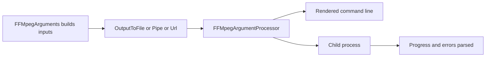

<sub>[CodeBrix](../../README.md) › [Libraries](README.md) › CodeBrix.VideoProcessing</sub>

# CodeBrix.VideoProcessing

**CodeBrix.VideoProcessing is a fully managed, cross-platform FFmpeg and FFprobe wrapper for .NET.** It
analyzes media - durations, streams, codecs, resolutions, bitrates, frames, packets, chapters and tags -
converts, transcodes and muxes video and audio, extracts snapshots and animated GIFs, pipes raw frames
and byte streams into and out of FFmpeg, and builds FFmpeg metadata. It is a wrapper, not a codec: at run
time it launches the external `ffmpeg` and `ffprobe` executables as child processes and parses their
output, from any .NET 10 application or from a CodeBrix.Platform application.

| | |
| --- | --- |
| **Repository** | [ellisnet/CodeBrix.VideoProcessing](https://github.com/ellisnet/CodeBrix.VideoProcessing) |
| **Packages** | [`CodeBrix.VideoProcessing.MitLicenseForever`](https://www.nuget.org/packages/CodeBrix.VideoProcessing.MitLicenseForever) |
| **License** | MIT; see [License](#license) |
| **Requires** | .NET 10 or later, and the `ffmpeg` and `ffprobe` executables installed on the machine that runs it |
| **Use it from** | Any .NET 10 application, or a CodeBrix.Platform application |
| **Platforms** | Linux, Windows and macOS - the assembly is fully managed C# and runs wherever you can install the two executables |

## What it does

- Analyzes media files, URLs and streams with FFprobe through `FFProbe.Analyse` / `AnalyseAsync`, and
  reads per-frame and per-packet detail with `GetFrames` and `GetPackets`.
- Converts, transcodes and muxes video and audio with a fluent argument builder that covers scaling,
  cropping, seeking, bitrate, codecs, filters, hardware acceleration, concatenation, tee and
  multi-output, and dozens of other options.
- Renders the complete command line without running anything - `FFMpegArguments.Text` and
  `FFMpegArgumentProcessor.Arguments` - which is what a unit test should assert on.
- Manages color: zscale resizing and color-space conversion, HDR-to-SDR tonemapping, and 3D `.cube`
  lookup-table grading, all inside a single filter chain.
- Writes per-stream metadata and dispositions, subtitle codecs, WebM cue placement (`cues_to_front` and
  `reserve_index_space`), numeric AV1 speed presets and free-form encoder parameter strings.
- Extracts single-frame snapshots and animated GIF snapshots.
- Pipes raw audio and video frames into and out of FFmpeg through `IPipeSource` and `IPipeSink`, with no
  temporary files.
- Builds and serializes FFmpeg metadata, including chapters, with two independent builders.
- Parses FFmpeg's own capability catalogs - `-codecs`, `-encoders`, `-decoders`, `-pix_fmts`,
  `-formats` - into `Codec`, `PixelFormat` and `ContainerFormat` objects, cached process-wide.
- Bridges to in-memory images under `CodeBrix.VideoProcessing.Imaging`: grab a snapshot as a
  [CodeBrix.Imaging](CodeBrix.Imaging.md) image, feed images into FFmpeg as frames, or mux an image plus
  audio into a video.
- Ships a public process wrapper, `CodeBrix.VideoProcessing.Instances`, so you can drive any other child
  process with the same line-streaming API.

## When to use it

Use CodeBrix.VideoProcessing when the work is a media *job*: probing a file, transcoding it, cutting a
thumbnail, building a preview, or shaping a stream on a machine you control. It is the right tool
whenever FFmpeg is the tool and you want the command line built, run and parsed from typed C# rather
than assembled by hand.

It is not a player. For in-process playback with no external executable anywhere near it, use
[CodeBrix.VideoPlayback](CodeBrix.VideoPlayback.md); that library's authoring package drives this one to
run its encodes, which is exactly the division of labor to copy - this library on a build machine, the
playback library in the shipped application. For still-image work - resizing, drawing, format conversion -
use [CodeBrix.Imaging](CodeBrix.Imaging.md); this library only bridges to it.

What it does not do:

- It does not decode or encode anything itself. There is no codec, no demuxer and no filter
  implementation in the assembly - FFmpeg does all of it in a separate process.
- It does not ship, download or install the executables. Install them yourself, or point
  `FFOptions.BinaryFolder` at them.
- It does not call into the FFmpeg libraries directly, so there is no in-process frame-accurate decoding
  API and no access to FFmpeg internals.
- It gives you no filter-graph object model. Anything beyond the modeled `-vf` / `-af` filters goes
  through `WithCustomArgument` or a custom `IArgument`.
- It has no user interface, no player, no rendering surface and no hardware-device enumeration;
  `WithHardwareAcceleration` passes `-hwaccel <name>` through to FFmpeg and nothing more.
- It does not safety-check your command line, validate codec and container combinations, or repair
  broken inputs - FFmpeg's own error output is what you get.
- It is not thread-safe at the configuration level: `GlobalFFOptions` and the capability cache are
  process-wide singletons. Configure once at start-up.

## Getting started

```bash
dotnet add package CodeBrix.VideoProcessing.MitLicenseForever
```

The executables are your responsibility. On a Debian-based Linux distribution both come from one
package:

```bash
sudo apt install ffmpeg
```

On Windows and macOS, install them yourself and either put them on PATH or name their folder through
`FFOptions.BinaryFolder`.

```csharp
using CodeBrix.VideoProcessing;
using CodeBrix.VideoProcessing.Arguments;
using CodeBrix.VideoProcessing.Enums;
using CodeBrix.VideoProcessing.Builders.MetaData;
using CodeBrix.VideoProcessing.Pipes;
using CodeBrix.VideoProcessing.Extend;
using CodeBrix.VideoProcessing.Exceptions;
using CodeBrix.VideoProcessing.Helpers;
using CodeBrix.VideoProcessing.Imaging;      // needs CodeBrix.Imaging
using CodeBrix.VideoProcessing.Instances;
using CodeBrix.VideoProcessing.Instances.Exceptions;
```

There is no registration call. This is a whole program: ask a file what it is.

```csharp
using CodeBrix.VideoProcessing;

var info = FFProbe.Analyse("input.mp4");

Console.WriteLine($"Duration: {info.Duration}");
Console.WriteLine($"Video codec: {info.PrimaryVideoStream?.CodecName}");
Console.WriteLine($"Resolution: {info.PrimaryVideoStream?.Width}x{info.PrimaryVideoStream?.Height}");
```

Notice the question marks: nullable reference types are disabled in this assembly, so the compiler will
not warn you that `PrimaryVideoStream` can legitimately be null. It can, and so can `Tags`, `Disposition`
and several `MediaFormat` fields.

## Key concepts

### Build, render, execute, parse

A conversion is built as a data structure, rendered to a command line, executed as a child process, and
its output parsed. Every stage is inspectable, which is what makes the library testable.



`FFMpegArguments` is the root builder. A static factory - `FromFileInput`, `FromPipeInput`,
`FromUrlInput`, `FromDeviceInput`, `FromConcatInput` or `FromDemuxConcatInput` - creates it with one
input, and the instance `AddXxxInput` methods append more. `WithGlobalOptions` adds pre-input global
flags. Internally it holds an ordered list of `IArgument`, and each one knows how to render its own text.

The terminal call - `OutputToFile`, `OutputToPipe`, `OutputToUrl`, `OutputToTee` or `MultiOutput` - takes
an `Action<FFMpegArgumentOptions>` callback and returns an `FFMpegArgumentProcessor`, which is the object
that runs FFmpeg. `ProcessSynchronously()` and `ProcessAsynchronously()` resolve the binary path, verify
it runs, and start the process; before it starts, every input and output argument gets `Pre()`, while it
runs their `During(token)` tasks pump the pipes, and after it exits `Post()` cleans up. A non-zero exit
code throws `FFMpegException` with `Type = FFMpegExceptionType.Process` and the captured standard error
in `FFMpegErrorOutput`, unless you pass `throwOnError: false`.

`FFMpegArguments` is single-use and stateful: each terminal call appends the output argument to the same
instance. Build a fresh chain for every conversion.

### Locating the executables

```csharp
GlobalFFOptions.Configure(new FFOptions
{
    BinaryFolder = "/opt/ffmpeg/bin",
    TemporaryFilesFolder = "/var/tmp",
});
// or mutate the existing instance:
GlobalFFOptions.Configure(o => o.LogLevel = FFMpegLogLevel.Error);
```

Given a `BinaryFolder`, the path is resolved in three steps: `{BinaryFolder}/{x64|x86}/ffmpeg[.exe]` -
the sub-folder matching the bitness of the current process - then `{BinaryFolder}/ffmpeg[.exe]`, then the
bare name, resolved through PATH. `.exe` is appended on Windows only, and the same rules apply to
`ffprobe`. An empty `BinaryFolder` means "look on PATH".

`GlobalFFOptions.Current` is loaded on first access from a file named `ffmpeg.config.json` in the
process's current directory when that file exists, deserialized straight into `FFOptions`, so its keys
are `BinaryFolder`, `TemporaryFilesFolder`, `WorkingDirectory`, `EncodingWebName`, `LogLevel`,
`ExtensionOverrides` and `UseCache`. `Configure(FFOptions)` replaces the process-wide options;
`Configure(Action<FFOptions>)` mutates them in place. `FFMpegArgumentProcessor.Configure(...)` is the
per-run alternative: it clones `GlobalFFOptions.Current` and applies the actions to the clone, so globals
are never mutated.

### Media analysis

```csharp
Analyse(string filePath | Uri | Stream, FFOptions ffOptions = null, string customArguments = null)
AnalyseAsync(..., FFOptions ffOptions = null, CancellationToken cancellationToken = default,
             string customArguments = null)
GetFrames / GetFramesAsync        // path and Uri
GetPackets / GetPacketsAsync      // path
```

`customArguments` is appended to the ffprobe command line, so probe flags such as
`"-probesize 50M -analyzeduration 100M"` go there.

`IMediaAnalysis` is the friendly typed view, and the implementing class is internal, so always hold the
interface. It carries `Duration` (the greatest of the format, video and audio durations), `Format`,
`Chapters`, `PrimaryAudioStream` / `PrimaryVideoStream` / `PrimarySubtitleStream` (the lowest index, or
null), the three stream lists, and `ErrorData`. `MediaStream` is the abstract base of `VideoStream`,
`AudioStream` and `SubtitleStream`; `VideoStream` adds the geometry, frame rates, profile, level,
rotation and the four color properties, and `AudioStream` adds `Channels`, `ChannelLayout`,
`SampleRateHz` and `Profile`.

The raw ffprobe JSON model is public as well - `FFProbeAnalysis`, `FFProbeStream`, `Format` and
`Chapter` - so you can reach fields the friendly model does not surface. `TagExtensions` adds
`GetLanguage()`, `GetCreationTime()`, `GetRotate()` and `GetDuration()` over anything with tags, and
`DispositionExtensions` adds `GetDefault()` and `GetForced()` over `FFProbeStream`. All of them return
null when the key is absent.

### One-shot conveniences

`FFMpeg` builds and runs a complete conversion in one call, probing the source first where it needs the
size or the duration: `Snapshot` / `SnapshotAsync` (output extension `.png`, `.jpg`, `.bmp` or `.webp`;
the capture time defaults to one third of the source duration), `GifSnapshot` / `GifSnapshotAsync`
(`.gif`), `SubVideo`, `Convert`, `Join`, `JoinImageSequence`, `PosterWithAudio`, `Mute`, `ExtractAudio`,
`ReplaceAudio` and `SaveM3U8Stream`. Beside them sits the capability catalog: `GetCodecs`,
`TryGetCodec`, `GetCodec`, `GetPixelFormats`, `GetContainerFormats` and their typed variants.

### Filters, and the one chain per output rule

`WithVideoFilters(Action<VideoFilterOptions>)` renders one `-vf`, and `WithAudioFilters` one `-af`.
FFmpeg accepts a single `-vf` per output and silently keeps only the last one, so a second call on the
same output throws `FFMpegArgumentException`. Build the whole chain in one call.

```csharp
// WRONG - throws
.OutputToFile(out, true, o => o
    .WithVideoFilters(f => f.Scale(1280, 720))
    .WithVideoFilters(f => f.Fps(30)))

// RIGHT
.OutputToFile(out, true, o => o
    .WithVideoFilters(f => f.Scale(1280, 720).Fps(30)))
```

`VideoFilterOptions` offers `Scale`, `Transpose`, `Mirror`, `DrawText`, `HardBurnSubtitle`,
`BlackDetect`, `BlackFrame`, `Pad`, `Custom`, `Fps`, `Lut3D`, `Format`, `ZScale`, `Tonemap` and `Rotate`;
`AudioFilterOptions` offers `Pan`, `DynamicNormalizer`, `HighPass`, `LowPass`, `AudioGate` and
`SilenceDetect`. `Format(...)` is the in-chain pixel-format conversion; `ForcePixelFormat(...)` on the
output options is the encoder-level `-pix_fmt`. `Rotate(...)` is an arbitrary-angle resample, so for the
four right-angle cases `Transpose(...)` is cheaper and lossless. Every number is formatted with the
invariant culture.

`AudioFilterOptions` has no `Custom(...)` method, but `CustomFilterArgument` implements
`IAudioFilterArgument`, so add it to the options object's public `Arguments` list yourself.

```csharp
using CodeBrix.VideoProcessing;
using CodeBrix.VideoProcessing.Arguments;

FFMpegArguments
    .FromFileInput("in.mp4")
    .OutputToFile("out.mp4", true, o => o
        .WithAudioFilters(f =>
        {
            f.Pan(2, "c0=c0", "c1=c1");
            f.Arguments.Add(new CustomFilterArgument("loudnorm",
                ("I", "-16"), ("TP", "-1.5")));
        }))
    .ProcessSynchronously();
```

### Filter-graph escaping

FFmpeg unescapes a filter option value twice while it parses a filtergraph, so a free-text value has to
be escaped twice. `Custom(name, params (key, value)[])`, `Lut3D(path)`, `Fps(string)`, `Format`,
`Rotate(string)` and the zscale values escape each value for both passes, so a Windows path, a path with
a comma or a space, and an apostrophe all survive. `Custom(name, "already:formed=opts")` escapes only
`, ; [ ]` - the colon and equals pass through, and the escaping is not quote-aware. `Custom("raw filter
text")` escapes nothing at all. A double-quote character is not escaped by any of them: a path
containing one is not supported.

### Progress, logging and cancellation

`NotifyOnProgress`, `NotifyOnOutput` and `NotifyOnError` register callbacks. The percentage overload
requires the total duration as a second, non-optional argument - probe the input first - while the
`TimeSpan` overload takes only the callback; you may register both, and on success the percentage
callback is invoked one final time with 100.0 and the time callback with the total duration.
`WithLogLevel(FFMpegLogLevel)` appends `-v <level>` for one run, `FFOptions.LogLevel` is the global
default, and `WithGlobalOptions(o => o.WithVerbosityLevel(...))` emits a pre-input `-loglevel`.

`CancellableThrough(out Action cancel, int timeout = 0)` and `CancellableThrough(CancellationToken token,
int timeout = 0)` wire cancellation. When cancellation fires, the processor sends `q` to ask FFmpeg to
quit gracefully, waits up to `timeout` milliseconds for the process to exit on its own, and then
cancels its internal token source and kills the process. With the default `timeout = 0` the wait
returns immediately and the process is killed; a non-zero timeout gives FFmpeg a grace period to flush a valid output file
first. Cancellation before the process started throws `OperationCanceledException("cancelled before
starting processing")`; during the run it throws `OperationCanceledException("ffmpeg processing was
cancelled")` - but only when `throwOnError` is true, which is the default.

### Pipes

Pipes feed data into FFmpeg or read its output in-process, with no temporary files. The library creates
an operating-system named pipe, passes its path to FFmpeg as the input or output "file", and copies bytes
on a background task while FFmpeg runs.

Input sources implement `IPipeSource`: `RawVideoPipeSource(IEnumerable<IVideoFrame> frames)` reads the
first frame to fix the stream format, emits `-f rawvideo -r {FrameRate} -pix_fmt {StreamFormat} -s
{Width}x{Height}`, and validates that every subsequent frame has the same width, height and format;
`RawAudioPipeSource` emits `-f {Format} -ar {SampleRate} -ac {Channels}`; `StreamPipeSource` contributes
no format flags of its own. Output sinks implement `IPipeSink`: `StreamPipeSink` takes a destination
stream or a writer delegate.

```csharp
public interface IVideoFrame
{
    int Width { get; }
    int Height { get; }
    string Format { get; }              // an ffmpeg pix_fmt name
    void Serialize(Stream pipe);
    Task SerializeAsync(Stream pipe, CancellationToken token);
}

public interface IAudioSample
{
    void Serialize(Stream stream);
    Task SerializeAsync(Stream stream, CancellationToken token);
}
```

Two implementations ship: `ImageVideoFrameWrapper` in the imaging bridge, and `PcmAudioSampleWrapper` in
`CodeBrix.VideoProcessing.Extend`, which writes your `byte[]` straight through - so you choose the sample
layout and describe it with `RawAudioPipeSource.Format`, `SampleRate` and `Channels`.

### Metadata

Two independent builders ship; use either one. `MetaDataBuilder` offers `WithEntry` plus named helpers
for title, album, artists, composers, genres, comments, copyright, date, encoder and brands, along with
`AddChapter` and `AddChapters<T>`; multiple values for one key are joined with `"; "`, and calling
`WithEntry` twice for the same key appends. `FFMetadataBuilder` offers `WithTag` and `WithChapter`, lays
chapters end to end on a 1/1000 timebase, and throws if you add the same key twice.

Feed either one to the argument builder with `.AddMetaData(...)`, which writes a temporary FFMETADATA
file, adds it as an extra input, emits `-map_metadata` pointing at that input's index, and deletes the
temporary file afterwards. `.MapMetaData()` copies metadata from an existing input, and
`.WithoutMetadata()` on the output options strips it.

### Feature detection

```csharp
try
{
    FFMpegHelper.VerifyFFMpegExists(GlobalFFOptions.Current);
    FFProbeHelper.VerifyFFProbeExists(GlobalFFOptions.Current);
}
catch (Exception ex)   // FFMpegException / FFProbeException
{
    Console.Error.WriteLine($"FFmpeg tooling unavailable: {ex.Message}");
}
```

Both checks run `-version` once and remember a success for the life of the process. Per-codec questions
are answered from the parsed catalog:

```csharp
if (FFMpeg.TryGetCodec("libx265", out Codec hevc) && hevc.EncodingSupported)
{
    bool experimental = hevc.EncoderFeatureLevel.IsExperimental;
}
```

`Codec`, `ContainerFormat` and `PixelFormat` are not enums - they are catalog objects with internal
constructors, parsed out of FFmpeg's own capability listings, so obtain them from `FFMpeg.GetCodec`,
`GetContainerFormat` and `GetPixelFormat` or the named helpers. The named shortcuts such as
`VideoCodec.LibX264` are properties that call `GetCodec`, so the first use launches FFmpeg to read its
catalog.

### The imaging bridge

`CodeBrix.VideoProcessing.Imaging` needs
[`CodeBrix.Imaging.ApacheLicenseForever`](https://www.nuget.org/packages/CodeBrix.Imaging.ApacheLicenseForever),
which is the package's single NuGet dependency; everything else in the library works without touching it.
`FFMpegImage.Snapshot` and `SnapshotAsync` return a `CodeBrix.Imaging.Image` - the frame is produced by
FFmpeg with the PNG image codec into a pipe and decoded in memory, so no temporary file is written, and
the returned image is disposable. `ImageVideoFrameWrapper` turns an image into an `IVideoFrame` and
disposes the wrapped image with the frame. `ImageExtensions.AddAudio` muxes an image and an audio file
into a video.

### Exceptions

`FFMpegException` carries `Type` - one of `Conversion`, `File`, `Operation` or `Process` - and
`FFMpegErrorOutput`, the captured standard error. Around it sit `FFMpegStreamFormatException` (a pipe
frame that does not match the first one), `FFMpegArgumentException` (an empty filter list, a second
filter chain on one output, an empty `ZScaleOptions` or a non-finite `Npl`), `FFOptionsException`,
`FFProbeException` and `FormatNullException`. A canceled run throws `OperationCanceledException`, and a
missing conversion input with `verifyExists: true` surfaces as `System.IO.FileNotFoundException` when the
process starts. Catching `FFMpegException` plus `OperationCanceledException` plus `System.IO.IOException`
covers essentially every failure mode at run time.

## Examples

Transcode with progress reporting and cancellation, giving FFmpeg a grace period to flush a playable
file.

```csharp
using System;
using System.Threading;
using System.Threading.Tasks;
using CodeBrix.VideoProcessing;
using CodeBrix.VideoProcessing.Enums;

public static class Transcoder
{
    public static async Task<bool> ToMp4Async(
        string input, string output, CancellationToken token)
    {
        IMediaAnalysis info = await FFProbe.AnalyseAsync(
            input, cancellationToken: token);

        try
        {
            return await FFMpegArguments
                .FromFileInput(input)
                .OutputToFile(output, overwrite: true, opt => opt
                    .WithVideoCodec(VideoCodec.LibX264)
                    .WithConstantRateFactor(23)
                    .WithSpeedPreset(Speed.Fast)
                    .WithAudioCodec(AudioCodec.Aac)
                    .WithAudioBitrate(AudioQuality.Good)
                    .WithFastStart())
                .NotifyOnProgress(
                    percent => Console.Write($"\r{percent:F1}%   "),
                    info.Duration)
                .NotifyOnProgress(
                    done => Console.Write($"[{done:hh\\:mm\\:ss}] "))
                .NotifyOnError(line => Console.Error.WriteLine(line))
                .WithLogLevel(FFMpegLogLevel.Error)
                // give ffmpeg 3 seconds to flush a playable file on cancel
                .CancellableThrough(token, timeout: 3000)
                .ProcessAsynchronously();
        }
        catch (OperationCanceledException)
        {
            Console.WriteLine("cancelled");
            return false;
        }
    }
}
```

The `cancellationToken` on the async probe overloads is the third parameter, before `customArguments`,
so pass it by name as this sample does.

Pipe frames generated in memory into FFmpeg, with no file on disk anywhere in the path.

```csharp
using System.Collections.Generic;
using CodeBrix.Imaging;
using CodeBrix.Imaging.PixelFormats;
using CodeBrix.VideoProcessing;
using CodeBrix.VideoProcessing.Enums;
using CodeBrix.VideoProcessing.Imaging;
using CodeBrix.VideoProcessing.Pipes;

static IEnumerable<IVideoFrame> Frames(int count, int w, int h)
{
    for (int i = 0; i < count; i++)
    {
        var image = new Image<Rgba32>(w, h);
        for (int y = 0; y < h; y++)
        {
            for (int x = 0; x < w; x++)
            {
                image[x, y] = new Rgba32(
                    (byte)((x + i) % 256), (byte)(y % 256), (byte)i, 255);
            }
        }

        // ImageVideoFrameWrapper disposes the image when the frame is
        // disposed; yield it inside a using so each frame is released as
        // soon as it has been serialized to the pipe.
        using var frame = new ImageVideoFrameWrapper(image);
        yield return frame;
    }
}

var source = new RawVideoPipeSource(Frames(120, 320, 240)) { FrameRate = 30 };

FFMpegArguments
    .FromPipeInput(source)
    .OutputToFile("generated.mp4", overwrite: true, opt => opt
        .WithVideoCodec(VideoCodec.LibX264)
        .ForcePixelFormat("yuv420p"))
    .ProcessSynchronously();
```

Snapshots three ways: to a file, to an in-memory image with no temporary file, and as an animated GIF.

```csharp
using System;
using System.Drawing;
using CodeBrix.VideoProcessing;
using CodeBrix.VideoProcessing.Imaging;

// to a file (extension must be .png/.jpg/.bmp/.webp)
FFMpeg.Snapshot("input.mp4", "thumb.png",
    size: new Size(640, -1),            // -1 == keep the aspect ratio
    captureTime: TimeSpan.FromSeconds(5));

// to an in-memory CodeBrix.Imaging image (no temp file)
using (CodeBrix.Imaging.Image image =
           FFMpegImage.Snapshot("input.mp4", new Size(320, -1)))
{
    image.SaveAsPng("thumb-small.png");
}

// an animated GIF of 3 seconds starting at 00:00:10
FFMpeg.GifSnapshot("input.mp4", "preview.gif",
    size: new Size(480, -1),
    captureTime: TimeSpan.FromSeconds(10),
    duration: TimeSpan.FromSeconds(3));
```

`Size` here is `System.Drawing.Size`, and a width or height of -1 means "derive it from the other
dimension".

Several outputs from one input. `MultiOutput` renders FFmpeg's native multiple-output form, so each
output re-encodes independently from one pass over the input; `OutputToTee` renders one encode duplicated
to several destinations by the tee muxer, so only options the tee muxer accepts belong in a branch.

```csharp
using CodeBrix.VideoProcessing;
using CodeBrix.VideoProcessing.Enums;

// (a) MultiOutput - independent encodes, one pass over the input
FFMpegArguments
    .FromFileInput("input.mp4")
    .MultiOutput(outputs => outputs
        .OutputToFile("sd.mp4", true, o => o.Resize(1280, 720))
        .OutputToFile("hd.mp4", true, o => o.Resize(1920, 1080))
        .OutputToUrl("rtmp://server/live/key", o => o.ForceFormat("flv")))
    .ProcessSynchronously();

// (b) OutputToTee - ONE encode duplicated to several destinations
FFMpegArguments
    .FromFileInput("input.mp4")
    .OutputToTee(outputs => outputs
        .OutputToFile("archive.mp4", false, o => o.WithFastStart())
        .OutputToUrl("http://server/path", o => o
            .ForceFormat("mpegts")
            .SelectStream(0, channel: Channel.Video)),
        // options applied to the single shared encode:
        opt => opt
            .WithVideoCodec(VideoCodec.LibX264)
            .WithAudioCodec(AudioCodec.Aac))
    .ProcessSynchronously();
```

## Using it in a CodeBrix.Platform application

This library has no user interface, no player and no rendering surface, so it behaves the same on every
head: it is the media engine behind a background job, an import step or a thumbnail service. The one
deployment fact that follows the application onto every machine it runs on is that `ffmpeg` and
`ffprobe` must be present there - on PATH, or in the folder named by `FFOptions.BinaryFolder`. Verify it
once at start-up with `FFMpegHelper.VerifyFFMpegExists` and `FFProbeHelper.VerifyFFProbeExists` and
report a clear message, rather than letting the first conversion fail.

## Pitfalls

- Missing executables at run time is the most common failure. Verify at start-up, and remember that
  `BinaryFolder` is searched as `{BinaryFolder}/{x64|x86}/` before `{BinaryFolder}/` before PATH.
- Two filter chains on one output. A second `WithVideoFilters` throws, but `Crop()` does not go through
  the filter list, so that throw does not catch it: `CropArgument` renders its own `-vf crop=...`, and
  combining `.Crop(...)` with `.WithVideoFilters(...)` puts two `-vf` flags on one output, of which
  FFmpeg honors only the last. Do the crop inside the filter chain instead - `.WithVideoFilters(f =>
  f.Custom("crop", "w:h:x:y") ...)` - and always inspect `.Arguments`. `WithGifPaletteArgument` renders
  `-filter_complex`, which conflicts the same way.
- Calling the percentage `NotifyOnProgress` overload without a total duration. It is not optional -
  probe the input first, or the callback is never invoked.
- Passing a cancellation token positionally to the async `FFProbe` overloads. It is the third parameter,
  before `customArguments`; pass it by name.
- Inconsistent pipe frames. Every `IVideoFrame` handed to a `RawVideoPipeSource` must match the first
  frame's width, height and format, or you get `FFMpegStreamFormatException`; an empty frame sequence
  throws `InvalidOperationException`. `RawAudioPipeSource.Format`, `SampleRate` and `Channels` must
  describe the bytes you actually write.
- Forgetting `ForceFormat(...)` on a pipe output. A pipe has no file extension, so FFmpeg cannot guess
  the container. `StreamPipeSink.Format` is a property of the sink, not the FFmpeg flag.
- Using `OutputToTee` when you wanted independent encodes. A tee needs at least one output and exactly
  one output argument per branch; `MultiOutput` is the other shape.
- Changing `GlobalFFOptions` mid-flight. Both `Configure` overloads are process-wide and not thread-safe
  to change while work is running; use `FFMpegArgumentProcessor.Configure(...)` per run.
- Expecting `FFOptions.Encoding` to round-trip through `ffmpeg.config.json`. It is ignored there; the
  value that persists is `EncodingWebName`.
- Odd dimensions and mismatched extensions. `FFMpeg.Convert` throws `ArgumentException` when either
  source dimension is odd, and `FFMpegException` when the output extension does not match the requested
  container. Snapshot output extensions are restricted to `.png`, `.jpg`, `.bmp` and `.webp`, and
  `GifSnapshot` to `.gif`.
- Reusing an `FFMpegArguments` instance. It is single-use and stateful; build a fresh chain per
  conversion.
- Casting between `VerbosityLevel` and `FFMpegLogLevel`. They live in different namespaces, mean
  different things and have different numeric values.
- Expecting `MetaDataBuilder.WithEntry` to replace a key. It appends, producing `"old; new"`, while
  `FFMetadataBuilder.WithTag` throws on a duplicate key.
- The argument order of `CropArgument(size, top, left)` against the fluent `Crop(size, left, top)`. They
  are the other way round.
- Writing a catch block for `FFProbeProcessException`. It is part of the public surface, but nothing in
  this library throws it - a failing ffprobe run raises `FFMpegException` instead.
- Two public classes named `ProcessArgumentsExtensions`, one in `CodeBrix.VideoProcessing` and one in
  `CodeBrix.VideoProcessing.Instances`, with the same extension methods. Importing both namespaces in one
  file makes `StartAndWaitForExit` ambiguous.
- `OutputToFile(path, overwrite: false)` does not merely omit `-y`: it throws `FFMpegException(File)` at
  start-up when the output file already exists.
- Putting `AutoRotate(...)` in an output callback. It is an input option: FFmpeg honors `-autorotate` /
  `-noautorotate` only before the `-i` it belongs to, so it goes in the `addArguments` callback of
  `FromFileInput` or `AddFileInput`. On an output it renders and is ignored.
- Handing a path to `Custom("raw filter text")`. That overload escapes nothing, and a Windows path is the
  classic casualty: the drive colon ends the option and the backslashes disappear. Use `Lut3D(path)` or
  `Custom(name, ("file", path))` so the path gets the full escaping.
- Using zscale on a source with unspecified color metadata, or straight after a filter that hands it RGB.
  It needs to know the color space it is converting from, and until you set `Matrix` - or zscale's own
  input-side options through `Custom` - it fails with `code 3074: no path between colorspaces`. It also
  needs an FFmpeg build that includes the filter.

> [!TIP]
> Leave `FFOptions.UseCache` at true. With the cache off, every strongly-typed codec property access
> launches FFmpeg again to re-read its catalog. In code that only renders a command line, prefer the
> string codec names, which need no FFmpeg on the machine at all.

Two more habits pay off: seek on the input side rather than the output side, and prefer
`ProcessAsynchronously` in server code. Analyzing a `Stream` pipes the whole stream to ffprobe, while
analyzing a path lets ffprobe seek.

## Samples and tools in the repository

This repository ships no sample applications, demos or tools. Everything that is not the library itself
is test content - and the suite doubles as the worked-example collection for the package, with a file per
feature area.

| Name | What it demonstrates | Where |
| --- | --- | --- |
| Test suite | Every feature area, one file at a time: the argument builder, video and audio conversions, FFprobe, metadata, options, the processor, filter options and integration, pixel formats, and the process layer | [`tests/CodeBrix.VideoProcessing.Tests`](https://github.com/ellisnet/CodeBrix.VideoProcessing/tree/main/tests/CodeBrix.VideoProcessing.Tests) |
| Test resources | Short media clips - mp4, webm, mkv, mov, audio-only, rotated and HDR variants, WAV at several bit depths, a raw PCM file, an `.srt` file, a cover image and an image sequence - plus an `ffmpeg.config.json` that exercises automatic option loading | [`tests/CodeBrix.VideoProcessing.Tests/Resources`](https://github.com/ellisnet/CodeBrix.VideoProcessing/tree/main/tests/CodeBrix.VideoProcessing.Tests/Resources) |
| Waiting program | A one-statement console application that blocks on standard input, so the process wrapper's tests have a real child process to start, send input to, wait on and kill | [`tests/CodeBrix.VideoProcessing.Tests.WaitingProgram`](https://github.com/ellisnet/CodeBrix.VideoProcessing/tree/main/tests/CodeBrix.VideoProcessing.Tests.WaitingProgram) |

Running the suite needs `ffmpeg` and `ffprobe` on PATH.

## Documentation and source

| Document | Where |
| --- | --- |
| Overview (README) | [README.md](https://github.com/ellisnet/CodeBrix.VideoProcessing/blob/main/README.md) |
| Complete API guide (ships inside the package too) | [AGENT-README.txt](https://github.com/ellisnet/CodeBrix.VideoProcessing/blob/main/AGENT-README.txt) |
| Map of every document in the repository | [README-INDEX.txt](https://github.com/ellisnet/CodeBrix.VideoProcessing/blob/main/README-INDEX.txt) |
| Non-package content in the repository | [EXTRAS-README.txt](https://github.com/ellisnet/CodeBrix.VideoProcessing/blob/main/EXTRAS-README.txt) |
| Tests (worked examples of every API) | [tests/CodeBrix.VideoProcessing.Tests](https://github.com/ellisnet/CodeBrix.VideoProcessing/tree/main/tests/CodeBrix.VideoProcessing.Tests) |

XML documentation ships alongside the assembly.

## License

CodeBrix.VideoProcessing is licensed under the MIT License; the license is also named in the package ID
(`CodeBrix.VideoProcessing.MitLicenseForever`). Its one dependency,
`CodeBrix.Imaging.ApacheLicenseForever`, carries the Apache License 2.0. For the provenance and licensing
of open source code included in this library, see
[THIRD-PARTY-NOTICES.txt](https://github.com/ellisnet/CodeBrix.VideoProcessing/blob/main/THIRD-PARTY-NOTICES.txt)
in the repository.

---

**Where to go next**

- [CodeBrix.Imaging](CodeBrix.Imaging.md) - the image library the snapshot bridge is expressed in
- [CodeBrix.VideoPlayback](CodeBrix.VideoPlayback.md) - playback with no external executable, and the authoring library that drives this one
- [Graphics, media and vision](../platform/09-graphics-media-and-vision.md) - where media work sits in a CodeBrix.Platform application
- [ellisnet/CodeBrix.VideoProcessing on GitHub](https://github.com/ellisnet/CodeBrix.VideoProcessing) - source and tests
