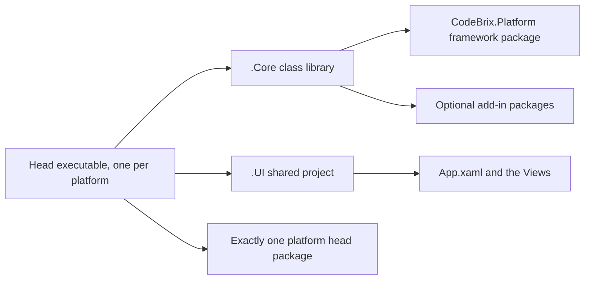

<sub>[CodeBrix](../../README.md) › [Build a CodeBrix.Platform application](README.md) › What CodeBrix.Platform is</sub>

# What CodeBrix.Platform is

**By the end of this chapter you will know exactly what CodeBrix.Platform gives you, which two packages an application needs to start, and how a solution is shaped.** It covers the API surface you write against, the `.Core` / `.UI` / heads structure, what is deliberately out of scope, and where the rest of the package family fits.

## One codebase, a native window on three operating systems

CodeBrix.Platform is a cross-platform desktop UI application framework for .NET. You write your application ONCE using the WinUI XAML API surface - the same `Microsoft.UI.Xaml.*` controls, XAML, code-behind, and data binding you would use in a Windows App SDK app - and CodeBrix.Platform renders it natively on Windows, Linux, and macOS desktops using a Skia-based rendering engine. The result is one shared UI plus business-logic codebase, and multiple thin per-platform "head" executables.

That API surface is the real one, not a subset with a familiar shape. Controls, panels, styles, resource dictionaries, templates, visual states, animations and data binding are written exactly as documented for WinUI. Both `{Binding}` and `{x:Bind}` work: `{x:Bind}` is compiled by the XAML source generator, is type-checked, and defaults to `Mode=OneTime`, so say `Mode=OneWay` or `Mode=TwoWay` explicitly; `{Binding}` is resolved at run time through generated metadata and needs a `DataContext`.

These are the namespaces an application actually uses, straight from the framework's own reference:

```csharp
using Microsoft.UI.Xaml;                       // Application, Window, FrameworkElement
using Microsoft.UI.Xaml.Controls;              // Page, Frame, Button, TextBox, ContentDialog, ...
using Microsoft.UI.Xaml.Navigation;            // navigation event args
using Microsoft.UI.Xaml.Data;                  // IValueConverter, binding
using Microsoft.UI.Xaml.Media;                 // brushes, transforms, FontFamily
using Microsoft.UI.Dispatching;                // DispatcherQueue
using Microsoft.UI.Windowing;                  // AppWindow, OverlappedPresenter
using Windows.UI;                              // Colors, Color
using Windows.Storage;                         // StorageFile, StorageFolder
using Windows.Storage.Pickers;                 // FileOpenPicker, FileSavePicker, FolderPicker
using Windows.ApplicationModel.DataTransfer;   // Clipboard, DataPackage
using Windows.Graphics.Display;                // DisplayOrientations (FrameBuffer head)
```

Notice that nothing in that list is CodeBrix-specific. The only framework namespace an ordinary application names is the one that starts the process, `CodeBrix.Platform.UI.Hosting`. In `.xaml` files the namespace URIs are the standard WinUI ones:

```xml
xmlns="http://schemas.microsoft.com/winfx/2006/xaml/presentation"
xmlns:x="http://schemas.microsoft.com/winfx/2006/xaml"
```

Beyond the control set, the framework provides application windowing (`AppWindow`, `OverlappedPresenter`), UI-thread dispatching (`DispatcherQueue`) and navigation; `Windows.Storage` files and folders, file, folder and save pickers, and the clipboard; font loading and preloading, Unicode and ICU text handling, and shaped bidirectional text; a diagnostics overlay; and a logging bridge onto `Microsoft.Extensions.Logging`. XML documentation ships alongside the assemblies, so IntelliSense works on every member.

## Two packages to start

An application needs exactly two packages to begin: the core framework in its shared class library, and one platform head package in each head executable. For a Linux X11 head:

```bash
dotnet add package CodeBrix.Platform.ApacheLicenseForever
dotnet add package CodeBrix.Platform.Runtime.Skia.X11.ApacheLicenseForever
```

The first line goes in the `.Core` library. The second goes in ONE head project. That is the whole starting position - [CodeBrix.Platform.ApacheLicenseForever](https://www.nuget.org/packages/CodeBrix.Platform.ApacheLicenseForever) is self-contained, folding in the Foundation, WinRT, Dispatching, Toolkit and logging-adapter assemblies, so one reference delivers the whole framework. [CodeBrix.Platform.Runtime.Skia.X11.ApacheLicenseForever](https://www.nuget.org/packages/CodeBrix.Platform.Runtime.Skia.X11.ApacheLicenseForever) brings the core framework and the shared Skia runtime in transitively, along with `buildTransitive` targets that set the head's compilation constants.

> [!NOTE]
> Package IDs carry a license suffix; namespaces do not. The package `CodeBrix.Platform.ApacheLicenseForever` provides the namespaces `CodeBrix.Platform.UI.*`, `Microsoft.UI.Xaml.*`, and so on. There is no package named plain `CodeBrix.Platform`.

The suffix is a promise, not decoration. A package with that exact package ID will never have its license change. If the license of the code behind a package ever changed, new versions could not be published under the old ID - they would need a new ID whose suffix names the new license, and the old ID stays locked to its license with its published versions available as-is.

Reference the packages WITHOUT a version attribute and let NuGet resolve them; the family is always published together.

Everything past those two packages is optional. Each add-in is one more line in `.Core` - here, the audio and MIDI add-in [CodeBrix.Platform.AudioPlayer.ApacheLicenseForever](https://www.nuget.org/packages/CodeBrix.Platform.AudioPlayer.ApacheLicenseForever):

```bash
dotnet add package CodeBrix.Platform.AudioPlayer.ApacheLicenseForever
```

## How an application is structured

A CodeBrix.Platform solution is built from three kinds of projects. This is THE canonical structure; follow it exactly.

1. **The `.Core` project** - a class library holding application logic, view models, services, and ALL NuGet package references for the UI framework and its add-ins. It does NOT reference any platform head package.
2. **The `.UI` shared project** - an MSBuild shared project (a `.shproj` with a sibling `.projitems`) holding the shared XAML: `App.xaml`, `App.xaml.cs`, and the Views. A shared project is NOT compiled on its own. Its files are compiled INTO each head project that imports its `.projitems` file.
3. **One head project per target** - an executable with `OutputType=Exe`, one per platform you ship. Each head is tiny: it imports the `.UI` shared project, references the `.Core` project, references EXACTLY ONE platform head package, and contains a `Program.cs` with the startup bootstrap.



Why this split? The framework, your view models, and your XAML are 100% shared. Only the head project and its single head package change per platform. Adding a new platform target means adding one more thin head project.

The `.UI` project is a shared project rather than a second class library for a concrete reason: the CodeBrix.Platform XAML source-generator and build-task wiring does NOT flow across a `ProjectReference`. The XAML must be compiled INTO each head, which is exactly what a shared project does and a referenced `.Core` assembly cannot. Do not tidy the Views into `.Core`.

> [!TIP]
> The single most important packaging rule: the `.Core` project references the framework package and every add-in package, and never a head package. Each head project references exactly one head package, the `.Core` project, and the `.UI` shared project - and nothing else that is UI-related. If you put a head package in `.Core`, or more than one head package in a single head project, the build will be wrong. One head project equals one head package.

Chapter [04 - Project architecture](04-project-architecture.md) takes this apart in full, including project naming and the libraries an application grows under `src/libs`.

## What CodeBrix.Platform deliberately does not do

Knowing the edges is part of knowing the framework.

- **No mobile and no browser targets.** iOS, Android and WebAssembly are out of scope for this framework. Ever. If you also ship a mobile application, chapter [14 - Sharing code with native frameworks](14-sharing-code-with-native-frameworks.md) covers running one view model on a native mobile head instead.
- **The optional capabilities are not in the core package.** 2D and 3D canvases, Lottie, SVG, media and audio playback, an embedded browser, a code editor, a terminal view, charts, flex layout and a settings store are separate add-in packages, each referenced once in `.Core`.
- **A subset of the WinUI surface is present but not backed by an implementation.** Every WinUI and UWP type and member exists so that code, XAML, and third-party libraries compile unchanged. Members with no meaningful behavior on the supported targets throw a "not implemented" exception naming the exact member rather than silently doing the wrong thing - for example, "The member `string SomeType.SomeMember` is not implemented." Check the message for the member name and look for an implemented alternative API, or guard the call at run time.
- **Some things are not implemented on any Skia head.** IME (composed CJK or dead-key) text input, and initiating drag-and-drop. Accepting drops works on X11, Windows and macOS, and on Wayland subject to the compositor.
- **Some heads have their own gaps.** The Wayland head does not implement touch input or native-view hosting in a `ContentPresenter`, and a handful of window-management APIs are permanent protocol-level no-ops there. The frame-buffer head has no system clipboard, no window management, and no pickers or keyboard unless you enable them. Chapter [02 - Runs on every laptop](02-runs-on-every-laptop.md) gives each head's list.

## The package families at a glance

Three families come out of the CodeBrix universe, and you pick by the kind of application you are writing.

| You are building | You want | Where to read |
| --- | --- | --- |
| A cross-platform desktop application from one shared codebase | The CodeBrix.Platform framework family: the core package plus optional add-ins in `.Core`, and exactly one `CodeBrix.Platform.Runtime.Skia.*` package per head | This track, starting at [03 - Your first application](03-your-first-application.md) |
| A native WinUI, WPF or .NET MAUI application | The native-framework toolkit packages, which give the same "Simple" MVVM surface on Microsoft's own UI frameworks | [14 - Sharing code with native frameworks](14-sharing-code-with-native-frameworks.md) |
| Any .NET 10 application that needs one specific capability | A general-purpose CodeBrix library - they are UI-framework-agnostic | [The standalone libraries](../libraries/README.md) |

Two rules keep those families straight. Do not mix the two UI-framework families in one application head: a given executable uses one or the other, never both. And the two UI-framework families share an identical "Simple" MVVM API across the Skia-based framework, WinUI, WPF and .NET MAUI, so an application shipping the CodeBrix.Platform heads and native heads can share its view models across all of them, provided each native head adds the matching toolkit package.

Inside the framework family itself, the add-ins are the packages that make the framework do more. Each one is referenced once, in `.Core`, without a version attribute, flows to every head transitively, and activates itself on the heads it supports - an add-in that only works on some heads is inert on the others and never breaks a build. [08 - Add-ins](08-add-ins.md) is the catalog: drawing surfaces, SVG, Lottie, media, audio and MIDI, video, an embedded browser, a terminal, charts, flex layout, host-free text layout, persisted settings and a full code editor.

The framework also leans on a few companion packages that are libraries in their own right: bundled font packages such as [CodeBrix.Platform.Fonts.OpenSans.ApacheLicenseForever](https://www.nuget.org/packages/CodeBrix.Platform.Fonts.OpenSans.ApacheLicenseForever), the Unicode and ICU packages behind text handling, and [CodeBrix.Platform.Extensions.ApacheLicenseForever](https://www.nuget.org/packages/CodeBrix.Platform.Extensions.ApacheLicenseForever), the helper assembly the framework takes a single dependency on.

## Checklist

- [ ] The `.Core` library references `CodeBrix.Platform.ApacheLicenseForever` and every add-in the application uses
- [ ] Each head project references exactly one `CodeBrix.Platform.Runtime.Skia.*` package
- [ ] No head package appears in `.Core`, and no add-in package appears in a head
- [ ] Package references carry no version attribute
- [ ] The shared XAML lives in the `.UI` shared project, not in `.Core`
- [ ] Every head imports the `.UI` `.projitems` and references `.Core`
- [ ] The application targets .NET 10 or later

---

**Where to go next**

- [02 - Runs on every laptop](02-runs-on-every-laptop.md) - the six heads, what each needs from the operating system, and how each one draws
- [03 - Your first application](03-your-first-application.md) - every file, verbatim, from an empty folder to a running window
- [08 - Add-ins](08-add-ins.md) - the optional packages and the heads each one is live on
- [CodeBrix.Platform on GitHub](https://github.com/ellisnet/CodeBrix.Platform) - source, tests and samples
