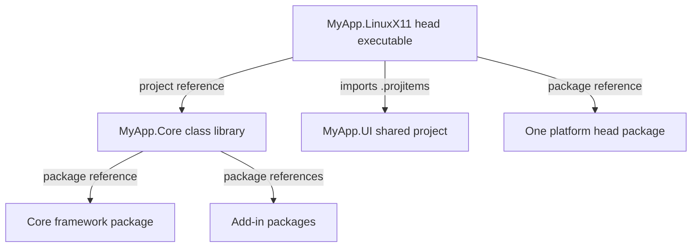

<sub>[CodeBrix](../../README.md) › [Build a CodeBrix.Platform application](README.md) › Project architecture</sub>

# Project architecture

**By the end of this chapter you will know which project every package reference, every source file and every compilation constant belongs in, and why an application that follows the layout adds a platform head without touching a line of application code.** It covers the one rule that matters most - which package goes where - and then the responsibilities of the three kinds of projects, the naming rules, the constants, the startup order inside `Program.Main` and the `App` constructor, the logging bridge, and the framework-wide switches in `FeatureConfiguration`.

[03 - Your first application](03-your-first-application.md) builds the layout file by file. This chapter explains it, and takes it as far as an application with its own libraries, its own tests and its own per-operating-system solutions.

## Which package goes where

A CodeBrix.Platform solution is built from three kinds of projects, and each kind owns a different half of the package list.

> [!IMPORTANT]
> The `.Core` library references the framework package, every add-in package the application uses, and its companion packages. It NEVER references a platform head package. Each head project references EXACTLY ONE platform head package, plus the `.Core` project and the `.UI` shared project - and nothing else that is UI-related: no add-in packages, no second head package. If you put a head package in `.Core`, or more than one head package in a single head project, the build will be wrong. One head project == one head package.

That rule, and nothing else, is what makes a head disposable. Add a platform: add one thin project. Add a capability: add one line to `.Core`.

| Project | References | Never references |
| --- | --- | --- |
| `MyApp.Core` (class library) | The core framework package, every add-in package used, companion packages, your own libraries | Any platform head package |
| `MyApp.UI` (shared project) | Nothing - it is not an assembly and has no package references | Anything |
| `MyApp.<Head>` (executable) | Exactly one platform head package, the `.Core` project, the `.UI` `.projitems` | A second head package, any add-in package |

The dependency flow, with one head shown:



Add-ins - including the MediaPlayer and WebView add-ins, which need a system-installed engine on Linux - are referenced ONCE, in `.Core`. Every head inherits them transitively, and each add-in activates itself on the heads it supports; an add-in that only works on some heads is inert on the others and never breaks a build.

The only non-CodeBrix package a head project may need is one an add-in's own `AGENT-README.txt` tells you to put there, such as a native runtime redistributable for Windows. Never decide that on your own. [08 - Add-ins](08-add-ins.md) lists every add-in with its companion packages and the heads it is live on.

Two packages in the family are never referenced by an application at all. [`CodeBrix.Platform.Runtime.Skia.ApacheLicenseForever`](https://www.nuget.org/packages/CodeBrix.Platform.Runtime.Skia.ApacheLicenseForever) is the shared Skia runtime every head package builds on; it arrives transitively. [`CodeBrix.Platform.Runtime.Skia.FrameBuffer.Emulated.ApacheLicenseForever`](https://www.nuget.org/packages/CodeBrix.Platform.Runtime.Skia.FrameBuffer.Emulated.ApacheLicenseForever) is an off-screen variant of the frame-buffer head used by tooling; never reference it directly.

### The head package and the bootstrap call

Every head project is nearly identical. The only differences between heads are the single head package referenced, the `.Use...()` call in `Program.cs`, and - for the WPF head alone - the target framework.

| Platform target | Head package | Bootstrap call |
| --- | --- | --- |
| Windows (Win32) | [`CodeBrix.Platform.Runtime.Skia.Win32.ApacheLicenseForever`](https://www.nuget.org/packages/CodeBrix.Platform.Runtime.Skia.Win32.ApacheLicenseForever) | `.UseWindowsWin32()` |
| Windows (WPF) | [`CodeBrix.Platform.Runtime.Skia.Wpf.ApacheLicenseForever`](https://www.nuget.org/packages/CodeBrix.Platform.Runtime.Skia.Wpf.ApacheLicenseForever) | `.UseWindowsWpf()` |
| Linux (X11) | [`CodeBrix.Platform.Runtime.Skia.X11.ApacheLicenseForever`](https://www.nuget.org/packages/CodeBrix.Platform.Runtime.Skia.X11.ApacheLicenseForever) | `.UseLinuxX11()` |
| Linux (native Wayland) | [`CodeBrix.Platform.Runtime.Skia.Wayland.ApacheLicenseForever`](https://www.nuget.org/packages/CodeBrix.Platform.Runtime.Skia.Wayland.ApacheLicenseForever) | `.UseLinuxWayland()` |
| Linux (frame buffer) | [`CodeBrix.Platform.Runtime.Skia.FrameBuffer.ApacheLicenseForever`](https://www.nuget.org/packages/CodeBrix.Platform.Runtime.Skia.FrameBuffer.ApacheLicenseForever) | `.UseLinuxFrameBuffer()` |
| macOS | [`CodeBrix.Platform.Runtime.Skia.MacOS.ApacheLicenseForever`](https://www.nuget.org/packages/CodeBrix.Platform.Runtime.Skia.MacOS.ApacheLicenseForever) | `.UseMacOS()` |

The `.Use...()` methods are extension methods in the `CodeBrix.Platform.UI.Hosting` namespace, surfaced by the corresponding head package - so a head sees only the one method that matches its package. Every one except `UseMacOS()` also has an overload taking a configuration lambda. The head package brings the core framework and the shared Skia runtime in transitively, along with `buildTransitive` targets that set `CodeBrixRuntimeIdentifier=Skia` and the head's compilation constants.

## The three kinds of projects

This is THE canonical structure; follow it exactly.

**The `.Core` project** is a class library holding application logic, view models, services, and all the NuGet package references for the UI framework and its add-ins. It is where a new capability arrives, and it is the only project that changes when you add one.

**The `.UI` shared project** is an MSBuild Shared Project - a `.shproj` with a sibling `.projitems` - holding `App.xaml`, `App.xaml.cs` and the Views. A Shared Project is not compiled on its own: its files are compiled INTO each head project that imports its `.projitems` file.

**Each `.<Platform>` head project** is an executable, one per platform shipped. Each head is tiny: it imports the `.UI` shared project, references the `.Core` project, references exactly one platform head package, and contains a `Program.cs` with the startup bootstrap.

The three lines that make a head a head are these, from the X11 head of a reference application:

```xml
  <!-- Tell MSBuild to treat .xaml files as CodeBrix.Platform XAML pages -->
  <ItemGroup>
    <Page Include="**\*.xaml" Exclude="bin\**\*.xaml;obj\**\*.xaml" />
    <None Remove="**\*.xaml" />
  </ItemGroup>

  <!-- Shared UI files (App.xaml + Views) -->
  <Import Project="..\PdfSideBySide.UI\PdfSideBySide.UI.projitems" Label="Shared" />
  <ItemGroup>
    <ProjectReference Include="..\PdfSideBySide.Core\PdfSideBySide.Core.csproj" />
  </ItemGroup>
```

Notice that the page glob and the matching `None` removal are both required, in every head: without them the shared XAML arrives as content and is never compiled. The full head project file is in [03 - Your first application](03-your-first-application.md), and this one is from [PdfSideBySide](https://github.com/ellisnet/CodeBrix.Samples/blob/main/PdfSideBySide/src/PdfSideBySide.LinuxX11/PdfSideBySide.LinuxX11.csproj).

### Why .UI is a shared project and not part of .Core

The CodeBrix.Platform XAML source-generator and build-task wiring does not flow across a `ProjectReference`. The XAML must be compiled INTO each head, which is exactly what a Shared Project - its `.projitems` imported by each head - does, and what a referenced `.Core` assembly cannot do. Do not "tidy" the Views into `.Core`.

That is also why a page can reference `.Core` types through an assembly-qualified XML namespace but `.Core` cannot reference a page.

Two consequences are worth knowing before you add your second page. There is no globbing in a shared project: a new page and its code-behind are added by hand, as a `<Page>` item with the compile generator and as a `<Compile>` item that depends upon its XAML.

```xml
  <ItemGroup>
    <Page Include="$(MSBuildThisFileDirectory)Views\MainPage.xaml">
      <SubType>Designer</SubType>
      <Generator>MSBuild:Compile</Generator>
    </Page>
  </ItemGroup>
  <ItemGroup>
    <Compile Include="$(MSBuildThisFileDirectory)Views\MainPage.xaml.cs">
      <DependentUpon>MainPage.xaml</DependentUpon>
    </Compile>
  </ItemGroup>
```

Notice that the `.projitems` identifier and the `.shproj` project identifier are the same value - that pairing is what makes a shared project work. The shared project produces no assembly, but list it in the solution anyway so it appears in the tree.

## Naming the projects

Head names are not cosmetic. Never give a head project a name whose segments match a top-level SDK namespace your code uses unqualified - above all `Windows` (the root of the WinRT `Windows.*` namespaces), and also `System`. A head named `MyApp.Windows` gives that project its own `MyApp.Windows` namespace, which shadows the global `Windows` namespace: an inline reference such as `Windows.System.VirtualKey` in shared code then binds to `MyApp.Windows` and fails to compile with CS0234 - on that one head only. A `using Windows.System;` directive still resolves globally, so the breakage is inconsistent and easy to miss. This is why the Skia-on-Win32 head is named `.Win32Skia`, never `.Windows`.

The "Skia" suffix appears only on the two Windows heads, because Windows is the only operating system that also ships a native head to disambiguate from. Keep every project name distinct from the solution file's base name, and use the exact casing the reference layout shows.

### Root namespaces

The `.Core` project takes the application namespace, so that view models live in `<App>.ViewModels`, helpers in `<App>.Helpers`, and the shared XAML reaches them with one assembly-qualified namespace:

```xml
<PropertyGroup>
  <TargetFramework>net10.0</TargetFramework>

  <!-- Match the namespace used by the app code -->
  <RootNamespace>MediaPlayerDemo</RootNamespace>
</PropertyGroup>
```

```xml
<Page
    x:Class="MediaPlayerDemo.Views.MainPage"
    xmlns="clr-namespace:Microsoft.UI.Xaml.Controls;assembly=CodeBrix.Platform.UI"
    xmlns:d="clr-namespace:Microsoft.UI.Xaml.Data;assembly=CodeBrix.Platform.UI"
    xmlns:x="http://schemas.microsoft.com/winfx/2006/xaml"
    xmlns:vm="clr-namespace:MediaPlayerDemo.ViewModels;assembly=MediaPlayerDemo.Core"
    ...>
```

Notice that the namespace and the assembly name are deliberately different things: the XAML still says `assembly=MediaPlayerDemo.Core` while the namespace says `MediaPlayerDemo.ViewModels`. The `.Core` root namespace also decides the manifest resource names of everything it embeds, so changing it changes every embedded-resource URI in the XAML too.

The opposite rule applies to any *other* library that also references CodeBrix.Platform - typically one under `src/libs` that hosts a view model or a custom element. It must keep its own root namespace:

```xml
<PropertyGroup>
  <TargetFramework>net10.0</TargetFramework>
  <GenerateDocumentationFile>true</GenerateDocumentationFile>

  <!-- This library hosts a SimpleViewModel-derived view model, so it references CodeBrix.Platform.
       Keep this library's OWN RootNamespace (not the app's "CodeBrixVideoTool") so the per-head
       generated GlobalStaticResources class does not collide across assemblies (CS0433). -->
  <RootNamespace>CodeBrixVideoTool.Playback</RootNamespace>
</PropertyGroup>
```

Notice where that error appears: the duplicate-type error is reported in the head, not in the library, which makes it easy to misdiagnose. A library that hosts no XAML-facing type keeps its default root namespace, which is already its assembly name and therefore already distinct - but setting the property anyway documents the rule and survives a project rename.

> [!TIP]
> If a namespace collision cannot be resolved by renaming, setting `<RootNamespace>MyApp</RootNamespace>` on the affected head keeps its generated code out of the colliding segment. That is a targeted fix for one project, not a blanket policy.

## Compilation constants

Define `HAS_CODEBRIX` and `HAS_CODEBRIX_WINUI` in every project that participates in the UI - the `.Core` library and every head:

```xml
<DefineConstants>$(DefineConstants);HAS_CODEBRIX;HAS_CODEBRIX_WINUI</DefineConstants>
```

Notice that this is not decoration: some public API is only public when `HAS_CODEBRIX_WINUI` is defined, `Window.AppWindow` among it. Missing constants cause incorrect conditional compilation rather than a clean error.

The core package's build targets also add these constants to projects that reference it; declaring them yourself is the reference-application convention and is harmless. The head packages additionally define the head-specific constants for you - `HAS_CODEBRIX_SKIA`, and per head, for example `HAS_CODEBRIX_SKIA_WIN32` and `__DESKTOP__`. Do not define those by hand.

Application symbols of your own follow the same placement rule: define them in `.Core` and in every head that compiles the shared source, and keep them few - every symbol is a place where one head can drift from the others. `HAS_CODEBRIX` is the symbol a shared file uses to tell a CodeBrix.Platform head from a native one:

```csharp
#if HAS_CODEBRIX
[Microsoft.UI.Xaml.Data.Bindable]
#endif
public class MainViewModel : SimpleViewModel, IFileSaveBridge, ICanvasInvalidator
{
    // ...
}
```

Notice that the guard is there because `HAS_CODEBRIX` is defined by `.Core` and by every Skia head, but not by a native WinUI or WPF project that links the same file. [14 - Sharing code with native frameworks](14-sharing-code-with-native-frameworks.md) covers that case in full.

## Startup and service registration ordering

Startup has two halves with a strict order in each: the head's `Program.Main`, which owns hosting and nothing else, and the `App` constructor, which is the composition root.

### The head: Program.Main

`Program.Main` initializes logging, builds a host, hands it a factory for the shared `App` class, selects exactly one backend, and runs. No application logic lives in a head; services, fonts, settings and the first page all belong to `App`, and everything the user interacts with belongs to a view model.

```csharp
// From CodeBrix.Samples/MediaPlayerDemo/src/MediaPlayerDemo.LinuxX11/Program.cs
using CodeBrix.Platform.UI.Hosting;
using System;

namespace MediaPlayerDemo;

internal class Program
{
    [STAThread]
    public static void Main(string[] args)
    {
        App.InitializeLogging();

        var host = CodeBrixPlatformHostBuilder.Create()
            .App(() => new App())
            .UseLinuxX11()
            .UseDirectSkiaCanvasMode() //Experimental - should be safe to leave enabled
            .Build();

        host.Run();
    }
}
```

Notice four things. `App.InitializeLogging()` is called before the host is built, never after - logging wired after `Build()` misses the framework's own startup messages. `.App(() => new App())` takes a factory, not an instance, so the host decides when the application object is constructed. `[STAThread]` is on `Main` in every head, including the Linux and macOS ones. And the head declares the same namespace as the shared UI project, which is what lets `new App()` resolve with no `using` directive.

`UseDirectSkiaCanvasMode()` is an experimental, app-wide, one-way opt-in that makes an `SKXamlCanvas` draw each frame straight into its on-screen bitmap buffer - one fewer full-frame copy per paint. Its order relative to the `.Use...()` call does not matter, and omitting it changes nothing. Enable it to test performance and stability, and measure.

Between `Build()` and `Run()` is where a head sets host properties, by pattern-matching the host `Build()` returned:

```csharp
// From CodeBrix.Samples/JustBetweenUs/CodeBrixPlatform/JustBetweenUs.WinWpfSkia/Program.cs
        var host = CodeBrixPlatformHostBuilder.Create()
            .App(() => new App())
            .UseWindowsWpf()
            .Build();

        // ...
        if (host is WpfHost wpfHost)
        {
            wpfHost.RenderSurfaceType = RenderSurfaceType.Software;
        }

        host.Run();
```

Notice the guarded cast: `Build()` returns the concrete host for the selected head - `Win32Host`, `WpfHost`, `X11ApplicationHost`, `WaylandApplicationHost`, `FrameBufferHost` or `MacSkiaHost`, all deriving from `SkiaHost` - so `is` keeps the file valid whatever the head.

> [!WARNING]
> The WPF head needs that software-rendering line. Its default OpenGL renderer draws through raw OpenGL onto WPF's own DirectX-composited window, which is an airspace conflict on many systems: the window appears and the content never composites. In most applications this is the only per-head behavioral difference in the whole solution.

`AfterInit` is the place for work that needs the platform up but must precede the first frame:

```csharp
var host = CodeBrixPlatformHostBuilder.Create()
    .App(() => new App())
    .AfterInit(() => Console.Error.WriteLine("host initialized"))
    .UseLinuxX11()
    .Build();
```

Notice that this runs after the host is initialized and before the run loop starts - which is a different moment from the `App` constructor, and a different moment again from `OnLaunched`.

### The App constructor: the ordering contract

`App` is the composition root and does nothing else. The order is: font configuration, then the service container, then design mode off, then - if the application has one - the settings store, then `InitializeComponent()`.

```csharp
// From CodeBrix.Samples/NotionDocumentCreator/src/NotionDocumentCreator.UI/App.xaml.cs
public App()
{
    //Set Roboto as the default font for all text in the application
    global::CodeBrix.Platform.UI.FeatureConfiguration.Font.DefaultTextFontFamily =
        "ms-appx:///CodeBrix.Platform.Fonts.Roboto/Fonts/Roboto.ttf";

    //Fonts consulted for characters the default font has no glyph for
    global::CodeBrix.Platform.UI.FeatureConfiguration.Font.FallbackFontFamilies =
    [
        "ms-appx:///CodeBrix.Platform.Fonts.Roboto/Fonts/NotoSansArmenian.ttf",
        "ms-appx:///CodeBrix.Platform.Fonts.Roboto/Fonts/NotoSansGeorgian.ttf",
    ];

    SimpleServiceResolver.CreateInstance(HostHelper.GetHost(), services =>
    {
        //Register the app's services here
        services.AddCreateDocument();
    });
    SimpleViewModel.SetIsDesignMode(false);

    InitializeComponent();
}
```

Notice that every line is before `InitializeComponent()`, and that is the whole point: the XAML parser constructs the first page's view model during `InitializeComponent()`, and that view model resolves services and reads settings in its own constructor.

> [!TIP]
> Forgetting `SimpleViewModel.SetIsDesignMode(false)` is silent. Nothing throws; every view model built by XAML takes its design-time early-out and the application starts and does nothing at all. Call it before the first view model is constructed, which in practice means before `InitializeComponent()`.

An application with a settings store opens it in the same constructor, after the resolver and before `InitializeComponent()`:

```csharp
// From CodeBrix.Samples/KenneyAssetBrowser/src/KenneyAssetBrowser.UI/App.xaml.cs
    SimpleServiceResolver.CreateInstance(HostHelper.GetHost(), services =>
    {
        //Register the app's services here
        services.AddKenneyAssetBrowser();
    });
    SimpleViewModel.SetIsDesignMode(false);

    //Open (or silently create) the single portable settings.sqlite store —
    //  including its startup auto-backup and pruning — before any UI renders.
    SettingsService.Initialize();

    InitializeComponent();
```

Notice that the store is opened before any UI renders, because the page's view model reads a setting in its own constructor. The store itself comes from the [AppSettings add-in](add-ins/AppSettings.md).

Work that must happen before anything else at all - registering optional media codecs, for example - goes at the top of the same constructor, ahead of the container and the XAML, so nothing can open a file first:

```csharp
// From CodeBrix.Samples/CodeBrixVideoTool/src/CodeBrixVideoTool.UI/App.xaml.cs
//Turn on AV1 video and Opus audio, once. Every one of the four formats this application
//writes carries AV1, so nothing plays at all without the first of these.
PlaybackCodecs.RegisterOnce();
```

Notice that the registration is a call, not a module initializer: the source of that helper says outright that a module initializer "would work in a debug build and silently not run in a trimmed publish".

### The host builder provider

`SimpleServiceResolver.CreateInstance()` needs an `IHostBuilderProvider`. Keep it in one shared place - a small static helper in the library the heads reference - so every head gets an identical container:

```csharp
// From CodeBrix.Samples/MediaPlayerDemo/src/MediaPlayerDemo.Core/Helpers/HostHelper.cs
using CodeBrix.Platform.Simple;
using Microsoft.Extensions.Hosting;

namespace MediaPlayerDemo.Helpers;

/// <summary>
/// Supplies the generic-host builder that <see cref="SimpleServiceResolver"/> uses to build
/// the application's dependency-injection container at startup.
/// </summary>
public static class HostHelper
{
    private sealed class HostBuilderProvider : IHostBuilderProvider
    {
        public IHostBuilder CreateDefaultBuilder() => Host.CreateDefaultBuilder();
        public IHostBuilder CreateDefaultBuilder(string[] args) => Host.CreateDefaultBuilder(args);
    }

    private static readonly HostBuilderProvider Provider = new();

    /// <summary>Gets the shared host-builder provider.</summary>
    public static IHostBuilderProvider GetHost() => Provider;
}
```

Notice that the provider is a private nested class exposed only through the interface, with one cached instance, so there is nothing to construct twice by accident - and that the generic-hosting package is referenced by `.Core`, not by the heads. Keeping it there is what lets every head share one helper.

`SimpleServiceResolver.CreateInstance()` is called even when there is nothing to register; applications with no services of their own keep an empty, commented registration callback rather than dropping the call.

### One AddXxx per library

Your real work lives in libraries, and the application registers each one in a single line without ever naming an implementation type:

```csharp
// From CodeBrix.Samples/WikipediaPublisher/WikipediaPublisher.RenderArticle/RegisterServices.cs
public static class RegisterServices
{
    /// <summary>
    /// Registers the WikipediaPublisher article-rendering services with the DI container.
    /// </summary>
    public static IServiceCollection AddRenderArticle(this IServiceCollection services)
    {
        if (services == null) { throw new ArgumentNullException(nameof(services)); }
        services.AddSingleton<IArticleRenderService, ArticleRenderService>();
        return services;
    }
}
```

Notice the null check and the returned collection, so calls chain; and notice that a service holding state between calls is registered as a singleton. A view model then resolves the interface with the inherited `GetService<T>()` and never sees the concrete class - see [05 - MVVM the right way](05-mvvm-the-right-way.md).

When an application has several services and one of them is a library with its own registration method, keep a single application-level `RegisterServices.cs` that chains them, so `App` still calls one method.

> [!TIP]
> Give a library service an optional `ILogger<T>` and fall back to a null logger. The library then still works in tests with no container at all - and a view model that may run without a container can fall back too: `runner = GetService<IConversionRunner>() ?? new ConversionRunner();`.

For an application that wants service location without the generic host, [CodeBrix.ServiceLocator](../libraries/CodeBrix.ServiceLocator.md) is the family's container-agnostic abstraction: an application publishes one adapter as the ambient container at startup, and anything can resolve through it.

## Logging

The framework logs through `Microsoft.Extensions.Logging` abstractions and writes nothing until an application connects a factory. Two statements do it, in this order, and both are needed: assigning `LogExtensionPoint.AmbientLoggerFactory` is not enough on its own; `LoggingAdapter.Initialize()` is what connects the framework's own logging to your factory. The adapter is folded into the core package - there is no separate adapter package to install.

```csharp
// From CodeBrix.Samples/MediaPlayerDemo/src/MediaPlayerDemo.UI/App.xaml.cs
// Called from each head's Program.Main BEFORE building the host.
public static void InitializeLogging()
{
#if DEBUG
    var factory = LoggerFactory.Create(builder =>
    {
        builder.AddConsole();
        builder.SetMinimumLevel(LogLevel.Information);
        builder.AddFilter("CodeBrix.Platform", LogLevel.Warning);
        builder.AddFilter("Windows", LogLevel.Warning);
        builder.AddFilter("Microsoft", LogLevel.Warning);
    });

    global::CodeBrix.Platform.Extensions.LogExtensionPoint.AmbientLoggerFactory = factory;
    global::CodeBrix.Platform.UI.Adapter.Microsoft.Extensions.Logging.LoggingAdapter.Initialize();
#endif
}
```

Notice the filter policy: the minimum level is Information while the framework, `Windows` and `Microsoft` categories are filtered to Warning, so your own messages are visible without the framework drowning them. Framework categories all start with `CodeBrix.Platform`. And notice that the whole body sits inside `#if DEBUG`: the method compiles to nothing in Release and every call site stays valid, which matters because console logging at Information level in Release costs frames.

To let one component through the filter, name it - a longer category prefix wins:

```csharp
// From CodeBrix.Samples/CodeBrixVideoTool/src/CodeBrixVideoTool.UI/App.xaml.cs
        builder.AddFilter("CodeBrix.Platform", LogLevel.Warning);
        //The player add-in logs the graphics backend it chose exactly once, at Information.
        builder.AddFilter("CodeBrix.Platform.UI.VideoPlayer", LogLevel.Information);
```

Notice that this is the way to answer "which render path did I actually get" without turning the whole framework back on.

When the same `App.xaml.cs` is linked into a native head, guard the adapter call, because the adapter only exists in the CodeBrix.Platform assemblies:

```csharp
// From CodeBrix.Samples/JustBetweenUs/CodeBrixPlatform/JustBetweenUs.UI/App.xaml.cs
    global::CodeBrix.Platform.Extensions.LogExtensionPoint.AmbientLoggerFactory = factory;

#if HAS_CODEBRIX
    global::CodeBrix.Platform.UI.Adapter.Microsoft.Extensions.Logging.LoggingAdapter.Initialize();
#endif
```

Notice that the factory assignment stays unguarded: `LogExtensionPoint` is in [CodeBrix.Platform.Extensions](../libraries/CodeBrix.Platform.Extensions.md), which every head has. That library also gives your own code a logger for any type with `this.Log()`, and never throws for want of configuration - with nothing registered it falls back to a factory with no providers, so the failure mode is silence rather than an exception.

## Feature configuration

`CodeBrix.Platform.UI.FeatureConfiguration` is a static class of framework-wide switches, organized as static nested classes. Set them from the `App` constructor before `InitializeComponent()`, or from `Program.Main` before `Build()`.

| Group | What it controls |
| --- | --- |
| `Font` | Default text font family, symbols font, fallback chain, text scaling |
| `Rendering` | Per-head GPU selection, and skipping re-render of unchanged visual subtrees |
| `TextBlock` | The measure cache |
| `TextBox` | Caret display, and using a native overlay instead of the Skia text box |
| `ScrollViewer` | Update mode, scrollbar auto-hide delay, snap delay |
| `Popup` | Light dismiss, bounds constraint, native popups |
| `ToolTip` | Whether tooltips show, and their delays |
| `Page`, `Frame` | Page pooling across navigation, and frame behavior |
| `ListViewBase` | Cache length, and scroll-into-view animation |
| `Control`, `UIElement`, `FrameworkElement` | Legacy layout, template and invalidation behaviors |
| `Xaml`, `XamlReader`, `ResourceDictionary`, `Cursors` | Parser strictness, dictionary inclusion, cursor behavior |

Further nested classes exist for narrower cases. Read the XML doc comments on the class in your editor before flipping one: most exist for compatibility with older behavior, and the defaults are right for new applications.

The `Rendering` group is how an application chooses a render path without touching a head - `UseOpenGLOnWin32`, `UseOpenGLOnX11`, `PreferGLESOverGLOnX11`, `UseVulkanOnWayland`, `ForceVulkanOnWayland`, `UseOpenGLOnWayland` and `UseMetalOnMacOS`, each `bool?` where null means "use the GPU path when it is available". A head builder's own `RenderingBackend(...)` call takes precedence over these. [02 - Runs on every laptop](02-runs-on-every-laptop.md) has the per-head defaults and the trade-offs.

`EnableVisualSubtreeSkippingOptimization`, with its two thresholds, avoids re-rendering subtrees that have not changed, and is the first thing to try on a busy page.

### Fonts

`Segoe UI` is the default text font family and is not present on Linux or macOS, so set a bundled font. The `ms-appx:///<PackageId-without-suffix>/Fonts/<file>.ttf` form loads a font shipped inside a referenced package:

```csharp
global::CodeBrix.Platform.UI.FeatureConfiguration.Font.DefaultTextFontFamily =
    "ms-appx:///CodeBrix.Platform.Fonts.OpenSans/Fonts/OpenSans.ttf";
```

Notice the first path segment: it is the font assembly's name, not the package ID with its license suffix. The font package is referenced from `.Core`, so all six heads ship it and no head references it.

Publish the same face under a resource key in `App.xaml` when a page needs to name it:

```xml
<!-- From CodeBrix.Samples/PdfSideBySide/src/PdfSideBySide.UI/App.xaml -->
  <Application.Resources>
    <ResourceDictionary>
      <ResourceDictionary.MergedDictionaries>
        <!-- Load WinUI resources -->
        <c:XamlControlsResources xmlns="using:Microsoft.UI.Xaml.Controls" />
      </ResourceDictionary.MergedDictionaries>
      <!-- Roboto font - reference the .ttf file directly (the Fonts.xaml
           merge does not work on Skia targets) -->
      <m:FontFamily x:Key="RobotoFont">ms-appx:///CodeBrix.Platform.Fonts.Roboto/Fonts/Roboto.ttf</m:FontFamily>
    </ResourceDictionary>
  </Application.Resources>
```

Notice the comment, which records a rule the whole reference set follows: merging a font package's `Fonts.xaml` resource dictionary does not work on Skia targets - reference the `.ttf` directly through an `ms-appx:///` URI. `DefaultTextFontFamily` and the `FontFamily` resource are different mechanisms and both are worth setting: the first covers text the application never styles, the second is what `FontFamily="{StaticResource RobotoFont}"` binds to.

Three timing rules govern the rest.

- `DefaultTextFontFamily` and `FallbackFontFamilies` must be set before the first text is measured, which means in the `App` constructor.
- `SymbolsFont` - the font used for `SymbolIcon` glyphs - must be set AFTER `App.InitializeComponent()`.
- `RestrictToEmbeddedFonts` confines resolution to fonts the application ships.

Fallback entries name the plain, weight-less face files; a font package also ships per-weight files whose names will not resolve there. A character no font can supply renders as the font's `.notdef` glyph - blank or a box, depending on the font. The framework never substitutes the host machine's fonts unless `FallbackFontFamilies` is left empty and the application's own fonts have no glyph. To avoid a re-layout when a font arrives late, preload it:

```csharp
await FontFamilyHelper.PreloadAsync(
    "ms-appx:///CodeBrix.Platform.Fonts.OpenSans/Fonts/OpenSans.ttf",
    Windows.UI.Text.FontWeights.Normal, Windows.UI.Text.FontStretch.Normal,
    Windows.UI.Text.FontStyle.Normal);
```

Notice that `FontFamilyHelper` lives in `CodeBrix.Platform.UI.Xaml.Media` and also offers `PreloadAllFontsInManifest(Uri)` for a package that ships a font manifest. The bundled font packages are [CodeBrix.Platform.Fonts.OpenSans](../libraries/CodeBrix.Platform.Fonts.OpenSans.md) and [CodeBrix.Platform.Fonts.Roboto](../libraries/CodeBrix.Platform.Fonts.Roboto.md), among others.

## Growing the solution

An application with more than a page and a view model puts each self-contained concern in its own library, with a mirrored test project, and lets the view model be the only place the libraries meet.

```text
src/PalmVisualizer.UI/            .shproj + .projitems: App.xaml(.cs), Views/MainPage.xaml(.cs)
src/PalmVisualizer.Core/          view models + helpers; owns the platform and font packages
src/libs/PalmVisualizer.Camera/   capture + preview canvas       -> tests/libs/PalmVisualizer.Camera.Tests
src/libs/PalmVisualizer.Vision/   palm tracking + models         -> tests/libs/PalmVisualizer.Vision.Tests
src/libs/PalmVisualizer.Rendering/ engine session + shader scene -> tests/libs/PalmVisualizer.Rendering.Tests
src/PalmVisualizer.<Head>/        one per head; imports the .projitems, references Core
```

Notice the two rules hiding in that tree. Libraries do not reference each other - all composition happens in the view model, which is what keeps each library's seam a plain type. And a library with no platform reference is what keeps its test project free of UI packages; a test project has no head, so it must reference any native assets it needs itself.

Each library carries an internals-visible file at its root naming only its own test assembly, and holding nothing else:

```csharp
// From CodeBrix.Samples/PdfSideBySide/src/libs/PdfSideBySide.PdfRender/InternalsVisibleTo.cs
using System.Runtime.CompilerServices;

[assembly: InternalsVisibleTo("PdfSideBySide.PdfRender.Tests")]
```

Notice that `src/libs` and `tests/libs` are the folder names on disk; solution folders such as `/Libraries/` and `/Tests/` are declarations only. [10 - Testing your application](10-testing-your-application.md) covers what goes in those test projects.

### Native packages go on the heads

A library that calls a native API references only the managed binding, so it stays runtime-independent. The native packages are referenced by the head projects - each head naming both architectures of its platform, unconditionally, so that head publishes for either without an edit:

| Head | Native packages referenced |
| --- | --- |
| LinuxX11, LinuxWayland, LinuxFrameBuffer | Linux x64 and Linux arm64 |
| MacOS | macOS arm64 and macOS x64 |
| Win32Skia, WinWpfSkia | Windows x64 and Windows arm64 |

This is the documented exception to "exactly one platform package": a native dependency that an add-in needs on some heads belongs in those heads. Leaving it off builds cleanly and fails at run time, so put the reason in a comment beside it. Never put a runtime identifier in a library - a library that names one stops being reusable across heads. Some packages carry their own natives for every runtime identifier and need no fan-out at all and no system library installed; when that is true, say so in a comment so nobody adds one.

### Solutions per operating system

Some heads only build where they run, so keep one solution per operating system - or one cross-platform solution plus a Windows superset - all sharing the same project files:

```text
JustBetweenUs.Windows.sln   all six Skia heads + WinUI + WPF + Mobile + Encryption + tests
JustBetweenUs.Linux.sln     Skia heads except WinWpfSkia + Encryption + tests
JustBetweenUs.MacOS.sln     Skia heads except WinWpfSkia + Mobile + Encryption + tests
```

Notice which head is excluded and which is not. Exclude a head only when it genuinely cannot restore: the Win32 Skia head targets the plain framework moniker and restores and builds anywhere even though it only runs on Windows, while the WPF-hosted head targets a Windows framework moniker and cannot - unless you let it:

```xml
<!-- From CodeBrix.Samples/PainDiagram/CodeBrixPlatform/PainDiagram.WinWpfSkia/PainDiagram.WinWpfSkia.csproj -->
<PropertyGroup>
  <!--
    The WPF-hosted head must target net10.0-windows (the runtime package flows a
    Microsoft.WindowsDesktop.App.WPF FrameworkReference). Do NOT set <UseWPF> here -
    that would make the WPF build targets grab the CodeBrix.Platform XAML
    Page items. EnableWindowsTargeting lets this head compile inside the cross-platform
    solution on Linux and macOS build hosts.
  -->
  <TargetFramework>net10.0-windows</TargetFramework>
  <OutputType>Exe</OutputType>
  <EnableWindowsTargeting>true</EnableWindowsTargeting>
</PropertyGroup>
```

Notice that it compiles, it does not run: `EnableWindowsTargeting` buys you a solution that restores everywhere, not a head that runs everywhere. Heads that are Windows-only in a stronger sense - a native WinUI head, a native WPF head - are usually kept out of the cross-platform solution entirely rather than given this property.

### Assets and notices

Anything a project embeds gets an explicit logical name, because a derived name changes when the file moves or the project is renamed - and shared source compiled into several assemblies would get a different name in each of them:

```xml
<!-- From CodeBrix.Samples/PainDiagram/CodeBrixPlatform/PainDiagram.Core/PainDiagram.Core.csproj -->
<!-- The body-map image the view model loads; the logical name must match
     MainViewModel.BodyMapResourceName -->
<ItemGroup>
  <EmbeddedResource Include="..\..\Shared\Assets\body_map_master.png" Link="Assets\body_map_master.png">
    <LogicalName>PainDiagram.Assets.body_map_master.png</LogicalName>
  </EmbeddedResource>
</ItemGroup>
```

Notice that the `Link` attribute only decides where the file appears in the project tree; the real file can stay where a notices file points at it. Assets are a per-head decision: the same file can be embedded in one head and shipped as content in another, and a head that does not use it embeds nothing.

Every application folder carries one `THIRD-PARTY-NOTICES.txt` listing bundled content by path, with its origin, copyright and license - and saying what it deliberately does not cover. Package dependencies are not reproduced there: every CodeBrix package ships its own `THIRD-PARTY-NOTICES.txt`. Adding a bundled asset means editing that file in the same change, not later.

## What to copy, and from where

Every application in [CodeBrix.Samples](https://github.com/ellisnet/CodeBrix.Samples) is built exactly this way, and each one has a `README.md` that walks its own layout. The applications inside the framework repository, under [samples/CodeBrixPlatform](https://github.com/ellisnet/CodeBrix.Platform/tree/main/samples/CodeBrixPlatform), have the same project shape, with one difference that matters: with a single exception they reference the framework through `ProjectReference` into `src/` rather than through `PackageReference`, which is the opposite of what a real application does. **Copy the samples' project structure and their XAML and C#, not their reference lines.** The exception, [EmulateFrameBufferDemo](https://github.com/ellisnet/CodeBrix.Platform/tree/main/samples/CodeBrixPlatform/EmulateFrameBufferDemo), consumes the framework from NuGet packages exactly as an application does.

The framework repository also ships [templates/TemplateApp.zip](https://github.com/ellisnet/CodeBrix.Platform/blob/main/templates/TemplateApp.zip), a complete six-head application named TemplateApp with `src/TemplateApp.Core`, `src/TemplateApp.UI` and all six heads - data rather than a buildable project, kept in step with the structure documented here.

## Checklist

- [ ] `.Core` references the core framework package and every add-in package, and no head package
- [ ] Each head references exactly one platform head package, the `.Core` project, and the `.UI` `.projitems`
- [ ] No head references an add-in package, except one an add-in's own `AGENT-README.txt` names
- [ ] `HAS_CODEBRIX` and `HAS_CODEBRIX_WINUI` are defined in `.Core` and in every head, and no head-specific constant is defined by hand
- [ ] No head project is named `.Windows` or `.System`, and every project name differs from the solution's base name
- [ ] `.Core` sets `<RootNamespace>` to the application namespace; every other library that references CodeBrix.Platform keeps its own
- [ ] Each head declares the `.xaml` page glob and the matching `None` removal
- [ ] Every head's `Main` calls `App.InitializeLogging()` before `CodeBrixPlatformHostBuilder.Create()`, and carries `[STAThread]`
- [ ] The `App` constructor runs fonts, then the service resolver, then `SetIsDesignMode(false)`, then any settings store, then `InitializeComponent()`
- [ ] A bundled font is set as `DefaultTextFontFamily` and referenced from `.Core`
- [ ] Each library under `src/libs` has a mirrored test project and an `InternalsVisibleTo.cs` naming only that test assembly
- [ ] Native per-platform packages are on the heads, never in a library
- [ ] Every bundled asset has an entry in the application's `THIRD-PARTY-NOTICES.txt`

---

**Where to go next**

- [05 - MVVM the right way](05-mvvm-the-right-way.md) - the next chapter: the view models that `.Core` is full of
- [08 - Add-ins](08-add-ins.md) - every add-in package, its heads and its companion packages
- [Blueprints](../samples/blueprints.md) - task-shaped recipes with the sample file that shows each one
- [CodeBrix.Platform on GitHub](https://github.com/ellisnet/CodeBrix.Platform) - source, tests and samples
