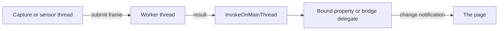

<sub>[CodeBrix](../../README.md) › [Build a CodeBrix.Platform application](README.md) › MVVM the right way</sub>

# MVVM the right way

**By the end of this chapter you will write a view model that owns everything the user can see and do on a page - state, commands, progress, dialogs, background work and its own disposal - with a code-behind that does nothing but forward what only a view can do.** Every recipe here is taken from a working application, with the file it came from linked so you can read the rest of it.

The types are in the `CodeBrix.Platform.Simple` namespace and arrive with the core framework package; there is nothing extra to install. The same API exists for native WinUI, WPF and .NET MAUI heads through their own toolkit packages, which is what lets one view model drive every head an application ships - see [14 - Sharing code with native frameworks](14-sharing-code-with-native-frameworks.md).

## The Simple types

| Type | What it is for |
| --- | --- |
| `SimpleViewModel` | The base class: change notification, service resolution, main-thread marshalling, dialogs, disposal |
| `SimpleCommand` | One `ICommand` per action, with sync and async handlers and a `CanExecute` predicate |
| `SimpleServiceResolver` | The application's dependency-injection container, created once in `App` |
| `SimpleDialog` | Dialog support behind the view model's own `ConfirmDialog`, `ShowInfo` and `ShowError` |
| `SimpleMessaging` | Weak-reference publish and subscribe between view models |
| `SimpleEnumInfo<TEnum>` | An enum member bound to a friendly description, for pickers |
| `SimpleOsInfo` | The host operating system, runtime and architecture, from a view model |

The members of `SimpleViewModel` that this chapter uses over and over are `SetProperty`, `SetEnumProperty`, `NotifyPropertyChanged`, `GetVisibility`, `GetService<T>`, `InvokeOnMainThread`, `IsDesignMode` / `SetIsDesignMode`, `CreateDialog`, `ConfirmDialog`, `ShowInfo`, `ShowError` and `Dispose`.

None of this is required. A view model that implements `System.ComponentModel.INotifyPropertyChanged` itself binds exactly as it does in WinUI:

```csharp
using System.Collections.ObjectModel;
using System.ComponentModel;
using System.Runtime.CompilerServices;

namespace MyApp.ViewModels;

public class MainViewModel : INotifyPropertyChanged
{
    private string _status = "Ready";
    private bool _isBusy;

    public event PropertyChangedEventHandler PropertyChanged;

    public ObservableCollection<string> Files { get; } = new();

    public string Status
    {
        get => _status;
        set { if (_status != value) { _status = value; OnPropertyChanged(); } }
    }

    public bool IsBusy
    {
        get => _isBusy;
        set { if (_isBusy != value) { _isBusy = value; OnPropertyChanged(); } }
    }

    void OnPropertyChanged([CallerMemberName] string name = null) =>
        PropertyChanged?.Invoke(this, new PropertyChangedEventArgs(name));
}
```

Notice how much of that file is ceremony. The rest of this chapter shows what the Simple types replace it with, and what they add that hand-written notification does not: commands that re-evaluate themselves, a design-mode guard, thread marshalling and dialogs that a view model can raise without knowing what a window is.

> [!NOTE]
> The XAML in this chapter comes from applications that alias the binding markup namespace as `d:` - `xmlns:d="clr-namespace:Microsoft.UI.Xaml.Data;assembly=CodeBrix.Platform.UI"` - so their bindings read `{d:Binding Status}`. Plain `{Binding}` and `{x:Bind}` both work; [06 - Views and styling](06-views-and-styling.md) covers the page side.

## Bound properties

State is `field`-keyword auto-properties whose setters call `SetProperty(ref field, value)`. The property's initializer goes after the closing brace.

```csharp
// From CodeBrix.Samples/WebcamPainter/src/WebcamPainter.Core/ViewModels/MainViewModel.cs
[AffectsCommands(nameof(TakePhotoCommand))]
public bool HasFrame
{
    get;
    private set => SetProperty(ref field, value);
}

public CameraDevice SelectedCamera
{
    get;
    set
    {
        if (field != value)
        {
            SetProperty(ref field, value);
            SwitchCamera(value);
        }
    }
}

public string StatusText
{
    get;
    set => SetProperty(ref field, value ?? string.Empty);
} = string.Empty;
```

Notice three habits worth copying. A property only the view model writes has a public getter and a private setter. A setter that must do something as well as store keeps the comparison itself, so the side effect runs only on a real change. And a string setter normalizes `null` to `string.Empty`, so no predicate downstream has to null-check.

The attribute on the first property is what makes buttons enable themselves; commands are next.

### Value types and enums

`SetProperty` takes reference types. For a `double` or another value type with no overload, compare, assign and notify by hand - and say why in a comment:

```csharp
// From CodeBrix.Samples/CodeBrixVideoTool/src/libs/CodeBrixVideoTool.Processing/ViewModels/ConversionViewModel.cs
public QualityLevel SelectedQuality
{
    get;
    set
    {
        //SetProperty takes reference types only; compare-and-notify by hand, as ProgressPercent does.
        if (field == value) { return; }
        field = value;
        NotifyPropertyChanged(nameof(SelectedQuality));
    }
} = QualityLevel.Good;

public double ProgressPercent
{
    get;
    private set
    {
        //No SetProperty overload takes a double; compare-and-notify by hand.
        if (field.Equals(value)) { return; }
        field = value;
        NotifyPropertyChanged(nameof(ProgressPercent));
    }
}
```

Notice that `bool` properties in the same file do use `SetProperty(ref field, value)`, so the restriction is not "value types" alone - check for an overload before assuming. Enum-valued properties have their own helper, `SetEnumProperty()`, covered under pickers below.

### Make bound types bindable

Every type a binding reaches - view models, cell view models, collection types, plain records - carries `[Microsoft.UI.Xaml.Data.Bindable]`. It is what makes the type usable as a binding source. An application that also compiles the same file into a native head puts the attribute behind `#if HAS_CODEBRIX`.

## Commands

Behavior is one `SimpleCommand` per action, created lazily from a `CanXxx()` predicate and a `DoXxx()` handler.

```csharp
// From CodeBrix.Samples/WebcamPainter/src/WebcamPainter.Core/ViewModels/MainViewModel.cs
private SimpleCommand _takePhotoCommand;
public SimpleCommand TakePhotoCommand =>
    (_takePhotoCommand ??= new SimpleCommand(CanTakePhoto, DoTakePhoto));

private bool CanTakePhoto() => (!IsBusy) && IsCaptureMode && HasFrame;

private async Task DoTakePhoto()
{
    if (!CanTakePhoto()) { return; }
    // ...
}

private SimpleCommand _selectColorCommand;
public SimpleCommand SelectColorCommand =>
    (_selectColorCommand ??= new SimpleCommand(CanSelectColor, (Action<object>)DoSelectColor));

private void DoSelectColor(object parameter)
{
    var session = _paintSession;
    if (session != null && parameter is string colorName && session.SelectColor(colorName))
    {
        ActiveColorText = $"Painting with: {session.ActiveColorName}";
    }
}
```

Notice that every `DoXxx()` re-checks its own `CanXxx()` on the first line. `CanExecute` is a hint to the UI, not a guarantee: a command can be invoked programmatically, or while the UI has not refreshed yet. Notice too the explicit `(Action<object>)` cast on the parameterized command - overload selection needs it.

> [!TIP]
> An asynchronous command body needs an explicit cast so the right overload is chosen: `(Func<object, Task>)(_ => RunAsync())` or `(Func<Task>)(() => StepAsync(...))`. Without it a `Task`-returning lambda binds to the synchronous `Action` overload, and the command completes immediately while the work runs unobserved. A parameterized synchronous command needs `(Action<object>)` for the same reason.

Commands are created once, whether through an explicit backing field or `field ??=`. A plain `=> new SimpleCommand(...)` would hand a fresh instance to every binding, and `RaiseCanExecuteChanged()` would then update a command nothing is bound to. Use an explicit field for any command that owns resources, because a command created through the `field` keyword cannot be reached from `Dispose()`.

The page side is a plain command binding:

```xml
<!-- From CodeBrix.Samples/MediaPlayerDemo/src/MediaPlayerDemo.UI/Views/MainPage.xaml -->
<TextBox Grid.Column="0" Height="40"
         VerticalAlignment="Center" VerticalContentAlignment="Center"
         Text="{d:Binding MediaAddress, Mode=TwoWay, UpdateSourceTrigger=PropertyChanged}" />
<Button Grid.Column="1" Margin="8,0,0,0" Height="40"
        VerticalAlignment="Center" Content="Load"
        Command="{d:Binding LoadCommand}" />
```

Notice that there is no `Click` handler and no `IsEnabled` binding. The button's enabled state comes from the command, and the command's enabled state comes from the attributes below.

### Buttons that enable themselves

Anything a predicate reads carries `[AffectsCommands(...)]` naming the commands it gates, so `CanExecute` refreshes itself with no `RaiseCanExecuteChanged()` anywhere. `[AffectsProperties(...)]` does the same for computed properties, and `[AffectsAllCommands]` covers a flag that gates everything.

```csharp
// From CodeBrix.Samples/NotionDocumentCreator/src/NotionDocumentCreator.Core/ViewModels/MainViewModel.cs
[AffectsCommands(nameof(CreateCommand), nameof(LoadWholeTreeCommand))]
[AffectsProperties(nameof(TreePlaceholderVisibility), nameof(TreeVisibility))]
public bool IsConnected
{
    get;
    private set => SetProperty(ref field, value);
}

// ...

private SimpleCommand _createCommand;
public SimpleCommand CreateCommand =>
    (_createCommand ??= new SimpleCommand(CanCreate, DoCreate));

private bool CanCreate() =>
    (!IsBusy)
    && IsConnected
    && (!string.IsNullOrWhiteSpace(OutputFilePath))
    && CheckedCount > 0;
```

Notice that `[AffectsCommands]` takes command *property* names, so `nameof` is what keeps a rename honest - renaming a command without updating the attribute silently stops refreshing the button.

### When the gating state is not a bound property

Some buttons are gated by facts that live in a model object, where an attribute has nothing to hang on. Use `[AffectsAllCommands]` for the one real bound property that gates everything, and call `RaiseCanExecuteChanged()` explicitly from the single method that already runs whenever the model moved:

```csharp
// From CodeBrix.Samples/PdfSideBySide/src/PdfSideBySide.Core/ViewModels/MainViewModel.cs
    /// <summary>Whether a file picker or document open is in progress (blocks the navigation buttons).</summary>
    [AffectsAllCommands]
    public bool IsBusy
    {
        get;
        private set => SetProperty(ref field, value);
    }

    /// <summary>Main Down: both documents to their next page.</summary>
    public SimpleCommand NextPageCommand => field ??=
        new SimpleCommand(() => !IsBusy && _comparison.CanMoveBothNext,
            (Func<Task>)(() => StepAsync(_comparison.MoveBothNext, renderLeft: true)));

    //Tell the page the view (zoom/pan/page) moved and refresh every button that depends on it
    private void ViewChanged()
    {
        ViewVersion++;
        NotifyPropertyChanged(nameof(ZoomLabel));
        RaiseNavigationCanExecute();
    }

    private void RaiseNavigationCanExecute()
    {
        PreviousPageCommand.RaiseCanExecuteChanged();
        NextPageCommand.RaiseCanExecuteChanged();
        AdjustPreviousCommand.RaiseCanExecuteChanged();
        AdjustNextCommand.RaiseCanExecuteChanged();
        ZoomInCommand.RaiseCanExecuteChanged();
        ZoomOutCommand.RaiseCanExecuteChanged();
        ZoomResetCommand.RaiseCanExecuteChanged();
        PanCommand.RaiseCanExecuteChanged();
    }
```

Notice that both the predicate and the body read the model directly, so the view model never mirrors model state into properties of its own - and that every model change is funneled through one method. Adding a new kind of change then means calling that one method rather than remembering three separate things.

An application whose command model lives in a headless library does the same thing at a larger scale: one method recomputes every command's enabled state from current state, called from a single "something about the document changed" funnel that every model event routes through.

```csharp
// From CodeBrix.Samples/Pinta.Brix/src/Pinta.Brix.UI/Views/MainPage.xaml.cs
/// <summary>
/// One place for "something about the document changed" - the pads and the
/// command enablement both follow from it.
/// </summary>
private void OnDocumentStateChanged()
{
    RefreshLayersPad();
    RefreshHistoryPad();
    UpdateActionSensitivity();
    UpdateSelectionSizeText();
}
```

Notice that this is the manual version of what `[AffectsCommands]` automates. Prefer `SimpleCommand` with the attributes when the commands can live on a view model; reach for this shape only when the command model is owned by a headless library.

## The design-mode guard

The page declares its view model in XAML, so the XAML designer constructs it too - and a constructor that opens cameras, starts threads or hits the network must not run there.

```csharp
// From CodeBrix.Samples/MediaPlayerDemo/src/MediaPlayerDemo.Core/ViewModels/MainViewModel.cs
[Microsoft.UI.Xaml.Data.Bindable]
public class MainViewModel : SimpleViewModel
{
    public MainViewModel()
    {
        if (IsDesignMode(true)) { return; } //Leave as the first line of constructor

        Debug.WriteLine("Main view model startup.");

        //Load (and, because the player has AutoPlay enabled, start) the default media on startup
        LoadMedia();
    }
    // ...
}
```

```xml
<!-- From CodeBrix.Samples/MediaPlayerDemo/src/MediaPlayerDemo.UI/Views/MainPage.xaml -->
<Page.DataContext>
    <vm:MainViewModel />
</Page.DataContext>
```

Notice that the comment is part of the pattern: the guard must be the first line, before any field is assigned or any service resolved. At run time `App` has already called `SimpleViewModel.SetIsDesignMode(false)`, so the guard falls through; in the designer it returns immediately and only the property initializers run, which is where design-time values come from.

> [!TIP]
> The pairing is easy to get half right. Without `SetIsDesignMode(false)` in the `App` constructor, the run-time constructor also returns early and the application starts and does nothing at all. Child view models need the guard too - and because a child returns early in design mode, members its constructor would assign stay null then.

Some applications write the guard as `if (!IsDesignMode(true)) { ... }` around the whole body instead of an early return; the two forms are equivalent.

## Starting work from a constructor

The page must show something immediately while its data arrives, and must show a readable message when the load fails. The constructor sets up synchronous state and starts one async method without awaiting it; that method sets bound state, flips a loading flag, and turns a failure into text on screen rather than an exception.

```csharp
// From CodeBrix.Samples/PolyHavenBrowser/src/PolyHavenBrowser.Core/ViewModels/MainViewModel.cs
public bool IsCatalogLoading
{
    get;
    private set
    {
        SetProperty(ref field, value);
        NotifyPropertyChanged(nameof(CatalogLoadingVisibility));
    }
} = true;

public Visibility CatalogLoadingVisibility => IsCatalogLoading ? Visibility.Visible : Visibility.Collapsed;

public string CatalogStatusText
{
    get;
    private set => SetProperty(ref field, value);
} = "Loading the Poly Haven model catalog…";

private async Task LoadCatalogAsync()
{
    try
    {
        _allModels = await _catalog.GetModelsAsync(CancellationToken.None);
        IsCatalogLoading = false;
        RebuildCells();
    }
    catch (Exception ex)
    {
        CatalogStatusText = $"Could not load the Poly Haven catalog: {ex.Message}";
    }
}
```

Notice that on failure the loading indicator deliberately stays visible with the error text under it, rather than leaving the user staring at an empty grid.

The constructor starts it with a discard, and every exception is caught inside, so nothing is left unobserved:

```csharp
// From CodeBrix.Samples/KenneyAssetBrowser/src/KenneyAssetBrowser.Core/ViewModels/MainViewModel.cs
public MainViewModel()
{
    if (IsDesignMode(true)) { return; } //Leave as the first line of constructor

    _catalogService = GetService<AssetCatalogService>();

    _assetsFolder = SettingsService.Get<string>(AssetsFolderKey);
    if (HasAssetsFolder)
    {
        _ = ReloadCatalogAsync();
    }
}
```

Notice `GetService<T>()`: the view model resolves what it needs from the container `App` built, and nothing is passed down to it. A constructor that awaited would block page construction, which is why the discard is deliberate rather than sloppy.

Naming the task lets a page or a test await it:

```csharp
// Adapted from CodeBrix.Samples/JustBetweenUs/Shared/ViewModels/MainViewModel.cs
// The sample starts a fire-and-forget Task in the constructor and pads it with a
// fixed Task.Delay before showing its first dialog; this version keeps the same
// steps but names the initialization so a page or a test can await it.
public MainViewModel()
{
    if (!IsDesignMode(true))
    {
        _encryptSvc = GetService<IEncryptionService>();
        // ... fill the picker list and select the first entry ...
        Initialization = InitializeAsync();
    }
}

public Task Initialization { get; private set; } = Task.CompletedTask;

private async Task InitializeAsync()
{
    var defaultKey = await _encryptSvc.GetDefaultKey();
    InvokeOnMainThread(() => EncryptionKey = defaultKey);
}
```

Notice why that matters beyond testing: work started this early can finish before the page has handed the view model a `XamlRoot`, and a dialog raised then has nowhere to attach. Prefer a page-readiness signal you can await over a fixed delay.

The same pattern loads documents named on the command line, which is what turns a repeated task into a scripted one:

```csharp
// From CodeBrix.Samples/PdfSideBySide/src/PdfSideBySide.Core/ViewModels/MainViewModel.cs
    /// <summary>
    /// Convenience for repeated comparisons: launching a head as
    /// PdfSideBySide.LinuxX11 left.pdf right.pdf pre-loads the two documents, so the
    /// user need not browse for them. Anything that goes wrong is reported in the status line.
    /// </summary>
    private async Task OpenStartupDocumentsAsync()
    {
        var arguments = Environment.GetCommandLineArgs();
        if (arguments.Length < 3) { return; }

        IsBusy = true;
        try
        {
            LeftPane.ShowDocument(await _comparison.OpenAsync(DocumentSide.Left, arguments[1]));
            RightPane.ShowDocument(await _comparison.OpenAsync(DocumentSide.Right, arguments[2]));
            UpdateStatus();
            ViewChanged();
            await Task.WhenAll(RenderSideAsync(DocumentSide.Left), RenderSideAsync(DocumentSide.Right));
        }
        catch (Exception e)
        {
            await ShowError(e, "Could not open the documents given on the command line.");
        }
        finally
        {
            IsBusy = false;
        }
    }
```

Notice that the view model reads the process arguments itself - the head's `Main` forwards nothing - and that `GetCommandLineArgs()` includes the executable at index 0, which is why the guard is `arguments.Length < 3`.

## Computed properties instead of converters

A view model that exposes `Visibility` directly keeps value converters out of the XAML. `SimpleViewModel` supplies `GetVisibility(bool)` for it:

```csharp
// From CodeBrix.Samples/NotionDocumentCreator/src/NotionDocumentCreator.Core/ViewModels/MainViewModel.cs
public Visibility PreviewContentVisibility => GetVisibility(SelectedNode is not null);
public Visibility PreviewPlaceholderVisibility => GetVisibility(SelectedNode is null);
public Visibility PreviewCoverVisibility => GetVisibility(PreviewCoverSource is not null);
public Visibility TreePlaceholderVisibility => GetVisibility(!IsConnected);
public Visibility TreeVisibility => GetVisibility(IsConnected);
```

The page stacks the panes in the same grid cell and binds each one's visibility:

```xml
<!-- From CodeBrix.Samples/NotionDocumentCreator/src/NotionDocumentCreator.UI/Views/MainPage.xaml -->
<!-- Before Connect: a quiet hint instead of a blank panel -->
<StackPanel Grid.Row="1" HorizontalAlignment="Center" VerticalAlignment="Center"
            Spacing="14" MaxWidth="420" Margin="20"
            Visibility="{d:Binding TreePlaceholderVisibility}">
    <FontIcon Glyph="&#xE8F1;" FontSize="40"
              Foreground="{StaticResource AccentDimBrush}"
              HorizontalAlignment="Center" />
    <TextBlock Text="Connect to see your pages"
               FontSize="15.5" FontWeight="SemiBold" TextAlignment="Center"
               Foreground="{StaticResource TextPrimaryBrush}" />
</StackPanel>

<TreeView Grid.Row="1" Padding="10,0,10,12"
          SelectionMode="None"
          Visibility="{d:Binding TreeVisibility}"
          ItemsSource="{d:Binding RootNodes}"
          ItemTemplate="{StaticResource PageNodeTemplate}" />
```

Notice that the placeholder and the real content are siblings in the same cell, each with its own visibility, rather than one element being swapped in and out. The source property either lists the computed properties in `[AffectsProperties]` or notifies them from its setter.

Where several panes are exclusive, hold the mode in one field and route every path that changes it through one method, so the notifications live in one place instead of being scattered through eight of them:

```csharp
// From CodeBrix.Samples/KenneyAssetBrowser/src/KenneyAssetBrowser.Core/ViewModels/MainViewModel.cs
private enum ViewerMode { None, Image, Model, Text, Audio }

public Visibility ImageViewerVisibility => _viewerMode == ViewerMode.Image ? Visibility.Visible : Visibility.Collapsed;
public Visibility ModelViewerVisibility => _viewerMode == ViewerMode.Model ? Visibility.Visible : Visibility.Collapsed;
public Visibility TextViewerVisibility => _viewerMode == ViewerMode.Text ? Visibility.Visible : Visibility.Collapsed;
public Visibility NoPreviewVisibility => _viewerMode == ViewerMode.None ? Visibility.Visible : Visibility.Collapsed;
public Visibility AudioViewerVisibility => _viewerMode == ViewerMode.Audio ? Visibility.Visible : Visibility.Collapsed;
public Visibility ZoomBarVisibility => ImageViewerVisibility;

private void SetViewerMode(ViewerMode mode, string hint, bool activateViewer = true)
{
    _viewerMode = mode;
    ViewerHint = hint;
    if (mode == ViewerMode.Image)
    {
        ImagePainter.ZoomFactor = 1f;
        ImagePainter.HighlightRegion = null;
        NotifyPropertyChanged(nameof(ZoomText));
    }

    NotifyPropertyChanged(nameof(ImageViewerVisibility));
    NotifyPropertyChanged(nameof(ModelViewerVisibility));
    NotifyPropertyChanged(nameof(TextViewerVisibility));
    NotifyPropertyChanged(nameof(NoPreviewVisibility));
    NotifyPropertyChanged(nameof(AudioViewerVisibility));
    NotifyPropertyChanged(nameof(ZoomBarVisibility));
    NotifyPropertyChanged(nameof(RegionListVisibility));
    NotifyPropertyChanged(nameof(AnimationBarVisibility));

    if (activateViewer)
    {
        IsViewerActive = true;
        InvalidateImageCanvas?.Invoke();
    }
}
```

Notice that two top-level "views" can be two grids in the same cell with bound visibility - no navigation, and no page state to restore.

The same idea drives captions. One private-set property holds the active choice; computed properties derive the captions from it:

```csharp
// From CodeBrix.Samples/PainDiagram/Shared/ViewModels/MainViewModel.cs
public string ActiveLayerName
{
    get;
    private set
    {
        SetProperty(ref field, value);
        NotifyPropertyChanged(nameof(PainButtonText));
        NotifyPropertyChanged(nameof(NumbnessButtonText));
        NotifyPropertyChanged(nameof(TinglingButtonText));
    }
} = PainLayerName;

public string PainButtonText => ActiveLayerName == PainLayerName ? "✓ Pain" : "Pain";
public string NumbnessButtonText => ActiveLayerName == NumbnessLayerName ? "✓ Numbness" : "Numbness";
public string TinglingButtonText => ActiveLayerName == TinglingLayerName ? "✓ Tingling" : "Tingling";
```

Notice that the property initializer sets the initial caption without running the setter body, so the computed captions are correct before the first notification.

When what changed is an object graph rather than a property, expose one counter and let the page watch that single name:

```csharp
// From CodeBrix.Samples/PdfSideBySide/src/PdfSideBySide.Core/ViewModels/MainViewModel.cs
    /// <summary>
    /// Bumped whenever the zoom, a pan position, or a page changes, so the page can re-apply
    /// the view to its image controls (one property to watch instead of many).
    /// </summary>
    public int ViewVersion
    {
        get;
        private set => SetProperty(ref field, value);
    }
```

Notice that it is a counter, not a `bool` or an event: any increment is a change, and it survives being read late.

## Progress, cancellation and the busy flag

This is the canonical long-running-operation shape: a Run command, a Cancel command that stays live, a progress bar, a status line, and everything else disabled.

```csharp
// From CodeBrix.Samples/CodeBrixVideoTool/src/libs/CodeBrixVideoTool.Processing/ViewModels/ConversionViewModel.cs
public SimpleCommand RunCommand => field ??= new SimpleCommand(
    () => !IsRunning && Source is not null && SelectedDestination is not null,
    (Func<object, Task>)(_ => RunAsync()));

public SimpleCommand CancelCommand => field ??= new SimpleCommand(
    () => IsRunning && !IsCancelling, _ => DoCancel());

private async Task RunAsync()
{
    // ... choose the output path, build the plan ...

    //The notes on screen belong to the run named in the status bar, so they go the moment a new
    //run takes that line over.
    SetLastRunNotes([]);

    IsRunning = true;
    IsCancelling = false;
    ProgressPercent = 0d;
    IsProgressIndeterminate = true;
    ProgressText = "Starting...";
    StatusText = plan.ToString();

    cancellation = new CancellationTokenSource();
    var progress = new Progress<ConversionProgress>(report =>
    {
        ProgressPercent = report.OverallPercent;
        IsProgressIndeterminate = report.IsIndeterminate;
        ProgressText = report.ToString();
    });

    ConversionOutcome outcome;
    try
    {
        outcome = await runner.RunAsync(plan, progress, cancellation.Token);
    }
    finally
    {
        cancellation.Dispose();
        cancellation = null;
        IsRunning = false;
        IsCancelling = false;
    }

    ProgressPercent = outcome.Succeeded ? 100d : 0d;
    IsProgressIndeterminate = false;
    ProgressText = string.Empty;
    StatusText = outcome.ToString();
    SetLastRunNotes(DescribeOutcome(outcome, destination));

    ConversionFinished?.Invoke(this, outcome);
}

private void DoCancel()
{
    if (cancellation is null)
    {
        return;
    }

    IsCancelling = true;
    ProgressText = "Stopping...";
    cancellation.Cancel();
}
```

Notice the division of labor. `IsRunning` and `IsCancelling` are `[AffectsCommands]` properties, so pressing Run disables Run and enables Cancel with no manual refresh. The service takes an `IProgress<T>` and a `CancellationToken` and knows nothing about the UI. The `CancellationTokenSource` is a field, disposed and nulled in a `finally` that also clears both flags - so a failed run never leaves the bar part-filled or the UI busy.

> [!TIP]
> Cancellation should not travel as an exception out of the command. Let the service catch `OperationCanceledException` itself and return a canceled outcome, so the view model has one exit path - and have it delete the part-written output on cancel and on failure. Ask for any confirmation before setting the busy flag, so a declined overwrite prompt cannot leave the UI in a busy state.

Where the service posts its progress from wherever it happens to be, the callback marshals itself:

```csharp
// From CodeBrix.Samples/NotionDocumentCreator/src/NotionDocumentCreator.Core/ViewModels/MainViewModel.cs
private async Task DoCreate()
{
    if (!CanCreate()) { return; }
    // ...
    try
    {
        IsBusy = true;
        ProgressValue = 0;
        // ...
        var progress = new Progress<CreateProgress>(p => InvokeOnMainThread(() =>
        {
            StatusText = p.Message;
            ProgressValue = p.PercentComplete;
        }));

        var result = await _documentSvc.CreateDocumentAsync(request, progress);

        StatusText = $"Saved: {result.OutputFilePath}";
        await ShowInfo(BuildResultMessage(result));
    }
    catch (Exception e)
    {
        StatusText = "Creation failed.";
        await ShowError($"Error while creating the document: {e.Message}");
    }
    finally
    {
        ProgressValue = 0;
        IsBusy = false;
    }
}
```

Notice that both forms appear in working applications and each is correct for its own service: a `Progress<T>` created on the UI thread already posts its callbacks back there, while one whose callback runs wherever the service is needs the explicit `InvokeOnMainThread`. Check which case you are in before adding a second layer of marshalling. Make `IProgress<T>` optional on the service, too - offline tests rely on passing `null`.

### Honest progress across stages

When only some stages can report a percentage, carry the stage in the report and derive the bar from it:

```csharp
// From CodeBrix.Samples/CodeBrixVideoTool/src/libs/CodeBrixVideoTool.Processing/Operations/ConversionProgress.cs
public sealed class ConversionProgress
{
    // ...
    public bool IsIndeterminate => StagePercent is null;

    /// <remarks>
    /// A stage with no percentage of its own counts as half-done, so the bar still moves forward
    /// when one finishes rather than sitting still until the last stage starts.
    /// </remarks>
    public double OverallPercent
    {
        get
        {
            var within = Math.Clamp(StagePercent ?? 50d, 0d, 100d);
            var completed = Math.Max(0, StageNumber - 1);
            return Math.Clamp(((completed * 100d) + within) / StageCount, 0d, 100d);
        }
    }

    public override string ToString() => StagePercent is null
        ? $"{Stage} ({StageNumber} of {StageCount})"
        : $"{Stage} ({StageNumber} of {StageCount}) - {StagePercent:F0}%";
}
```

```xml
<!-- From CodeBrix.Samples/CodeBrixVideoTool/src/CodeBrixVideoTool.UI/Views/MainPage.xaml -->
<ProgressBar Grid.Column="0"
             Height="6"
             Minimum="0"
             Maximum="100"
             Value="{d:Binding Conversion.ProgressPercent}"
             IsIndeterminate="{d:Binding Conversion.IsProgressIndeterminate}"
             VerticalAlignment="Center"
             Margin="0,0,14,0" />
```

Notice that the stage count is fixed for every run, so the bar never rescales mid-operation, and that computing the percentage as a band per stage stops it going backwards between stages. A progress record that carries a stage enum as well as a message and a percentage also lets a UI render a stage list rather than only a bar:

```csharp
// From CodeBrix.Samples/WikipediaPublisher/WikipediaPublisher.RenderArticle/Models/RenderModels.cs
/// <summary>
/// The stages a render moves through, in order (useful for progress display).
/// </summary>
public enum RenderStage
{
    FetchingArticle = 0,
    ParsingArticle,
    DownloadingImages,
    ComposingBook,
    SavingPdf,
    Done
}

/// <summary>
/// A progress report raised while rendering.
/// </summary>
public sealed record RenderProgress(RenderStage Stage, string Message, int PercentComplete);
```

Notice that the record is immutable and carries no UI type, which is what lets the same report drive a bar, a stage list and a log line.

### Snapshot what a long command needs

A command that takes many seconds runs while the user is free to navigate away or change the selection. Copy everything the run needs into locals at the top:

```csharp
// From CodeBrix.Samples/PolyHavenBrowser/src/PolyHavenBrowser.Core/ViewModels/MainViewModel.cs
private bool CanCreateDocument() => IsModelViewActive && !_isCreatingDocument;

private async Task CreateDocumentAsync()
{
    if (!CanCreateDocument()) { return; }

    //Snapshot everything the document needs: the user can navigate Back (or open a
    //  different model) while it builds, and the run continues from this snapshot.
    var asset = _currentAsset;
    var stats = _currentStats;
    var model = _currentModel;
    if (asset == null || stats == null || model == null) { return; }

    var title = ModelTitle;
    // ... authorLine, description, facts, downloadFolder ...

    // ... pick the output path ...

    _isCreatingDocument = true;
    DocumentCommand.RaiseCanExecuteChanged();
    var saved = false;
    try
    {
        // ... stages 1-4, then: ...
        await Task.Run(() => new MarketingSheetCreator().CreateToFile(request, outputPath));
        DocumentStatusText = $"Saved: {outputPath}";
        saved = true;
    }
    catch (Exception e)
    {
        DocumentStatusText = string.Empty;
        await ShowError(e, $"Could not create the marketing one-sheet for “{title}”.");
    }
    finally
    {
        _isCreatingDocument = false;
        DocumentCommand.RaiseCanExecuteChanged();
    }

    if (saved)
    {
        //Say so plainly: creating the sheet takes a while, and the footer status line is
        //  easy to miss. Announced after the finally block so the Document button is live
        //  again by the time the user dismisses this.
        using var alert = CreateDialog(
            $"The marketing one-sheet for “{title}” has been created.\n\n" +
            $"It was saved to:\n{outputPath}",
            "Document Created");
        _ = await alert.ShowAsync();
    }
}
```

Notice where the success announcement is: after the `finally`, not inside the `try`, so the button is live again by the time the user dismisses the dialog. Setting the status line per stage is what makes a multi-second command tolerable.

## Threading and the dispatcher

All UI access happens on the UI thread. The view model owns the marshalling, and `InvokeOnMainThread` - an inherited `SimpleViewModel` member - is the one call to remember, so the same code is correct on every head.



```csharp
// From CodeBrix.Samples/JustBetweenUs/Shared/ViewModels/MainViewModel.cs
var defaultKey = await _encryptSvc.GetDefaultKey();
//We can't set a value to EncryptionKey except on the main (UI) thread, because this causes problems on Linux and macOS
InvokeOnMainThread(() => EncryptionKey = defaultKey);
```

```csharp
// From CodeBrix.Samples/PainDiagram/Shared/ViewModels/MainViewModel.cs
_session.DrawingChanged += (_, _) => InvokeOnMainThread(() => HasDrawing = _session.HasStrokes);
```

> [!WARNING]
> Assigning a bound property off the UI thread appears to work on Windows and fails on Linux and macOS. Test the marshalling on the strictest head, not the most forgiving one. The same applies to an assignment that drives `[AffectsCommands]`, because refreshing a command's `CanExecute` touches the UI, and to any head-supplied bridge delegate - a clipboard or canvas call is usually main-thread only as well.

Underneath, this is the framework's `DispatcherQueue`. Code that is not in a view model marshals the same way, by capturing the queue on the UI thread and enqueuing back to it:

```csharp
var queue = this.DispatcherQueue;           // captured on the UI thread
_ = Task.Run(async () =>
{
    var result = await LoadAsync();
    queue.TryEnqueue(() => StatusText.Text = result);
});
```

Notice that every `DependencyObject` exposes a `DispatcherQueue`, as does `Window`, and that `HasThreadAccess` answers "am I already on it" when you are unsure.

### Three threads, one view model

When a sensor callback, a processing worker and the UI are all involved, the capture-thread handler does the minimum and forwards; the worker-thread handler feeds anything thread-safe straight in and wraps only what touches bound state:

```csharp
// From CodeBrix.Samples/WebcamPainter/src/WebcamPainter.Core/ViewModels/MainViewModel.cs
private void OnFrameArrived(object sender, EventArgs e)
{
    //Capture-thread context: get out fast
    if (!HasFrame)
    {
        InvokeOnMainThread(() => HasFrame = _captureService.HasFrame);
    }

    if (IsCaptureMode)
    {
        InvalidateMainCanvas?.Invoke();
    }
    else
    {
        //Paint Mode: the live feed drives the hand tracker and the little self-view
        var tracker = _tracker;
        if (tracker is { IsRunning: true }
            && _captureService.TryCopyLatestFrame(ref _visionFrame, out var width, out var height))
        {
            tracker.SubmitFrame(_visionFrame, width, height);
        }
        InvalidateSelfView?.Invoke();
    }
}

private void OnTrackingUpdated(object sender, HandTrackingEventArgs e)
{
    //Worker-thread context: marshal all painting decisions onto the UI thread
    var result = e.Result;
    InvokeOnMainThread(() =>
    {
        var session = _paintSession;
        if (IsCaptureMode || session == null) { return; }
        // ... update crosshair, begin/continue/end the stroke ...
        InvalidateMainCanvas?.Invoke();
    });
}
```

Notice four things that keep this correct at frame rate. A field another thread can null is read into a local first, so a concurrent `Dispose()` cannot turn the null check into a race. The dispatch only happens when something changed - the `if (!HasFrame)` guard - because otherwise the UI thread takes a dispatch on every frame. The mode is re-checked *inside* the marshalled callback, because by the time it runs the user may already have pressed Back. And one handler decides where a frame goes, so a single camera feed serves two consumers with no duplicated capture.

Where the consumer is thread-safe, only the status line needs the UI thread:

```csharp
// From CodeBrix.Samples/PalmVisualizer/src/PalmVisualizer.Core/ViewModels/MainViewModel.cs
    var openCount = attractors.Count;
    if (openCount != _reportedOpenPalmCount)
    {
        _reportedOpenPalmCount = openCount;
        InvokeOnMainThread(() => StatusText = openCount switch
        {
            0 => "Show the camera your open palm - the colors will gather toward it.",
            1 => "The colors are chasing your open palm - close your hand to set them free.",
            _ => $"The colors are chasing {openCount} open palms - close your hands to set them free.",
        });
    }
```

Notice the comparison before the dispatch: the same guard, applied to a value rather than a flag.

## Background work in services

A registered service exposes only `Task`-returning methods and does the blocking work inside `Task.Run`. The view model awaits them, owns the loading flag and the visibility that follows it, and disposes whatever it opened.

```csharp
// From CodeBrix.Samples/KenneyAssetBrowser/src/KenneyAssetBrowser.Core/Services/AssetCatalogService.cs
public class AssetCatalogService
{
    public Task<AssetFolderCatalog> LoadCatalogAsync(string folderPath) =>
        Task.Run(() => AssetFolderCatalog.LoadFrom(folderPath));

    public Task<BundleArchive> OpenArchiveAsync(AssetBundle bundle) =>
        Task.Run(() => new BundleArchive(bundle.ZipPath));

    public Task<byte[]> ReadEntryBytesAsync(AssetBundle bundle, string entryPath) =>
        Task.Run(() =>
        {
            using var archive = new BundleArchive(bundle.ZipPath);
            return archive.ReadEntryBytes(entryPath);
        });
}
```

Notice that the one-off read opens and disposes its own handle rather than sharing a long-lived one, so a background fetch cannot outlive the selection that started it. When a handle must be long-lived, swap it under a helper that nulls the field before disposing, so a read racing the swap sees null rather than a disposed object.

Two more rules hold for anything heavy. Guard re-entry with the busy flag at the top of the method, and always clear the flag - and invalidate whatever needs repainting - in the `finally`. And dispose the previous result only after the new one is built and assigned, so a failed build leaves the previous view intact:

```csharp
// From CodeBrix.Samples/PolyHavenBrowser_viewer_only/src/PolyHavenBrowser.Core/ViewModels/MainViewModel.cs
private async Task SelectAsync(SampleAssetKind kind)
{
    if (IsBusy) { return; }

    _selectedKind = kind;
    RaiseSelectionChanged();
    IsBusy = true;

    try
    {
        var progress = new Progress<string>(message => StatusText = message);
        var asset = await _assets.EnsureSampleAsync(kind, progress, CancellationToken.None);

        //Decode/build off the UI thread; the painters upload to GL lazily during Paint.
        var painter = await Task.Run(() => BuildPainter(kind, asset));
        _currentPainter = painter;
        StatusText = $"{Label(kind)}: {asset.Name}    ·    {Hint(kind)}";
    }
    catch (Exception ex)
    {
        StatusText = $"Could not load the {kind.ToString().ToLowerInvariant()} sample: {ex.Message}";
    }
    finally
    {
        IsBusy = false;
        InvalidateCanvas?.Invoke();
    }
}
```

Notice the comment about the graphics upload: keep GPU work off the worker thread. A renderer takes a lock, stashes the new data as pending, and uploads it on the next render, on the render thread.

### A cache belongs to the service

Stepping back and forth between neighboring items should not re-render anything, and the cache that prevents it is a private detail of the service, not of the view model:

```csharp
// From CodeBrix.Samples/PdfSideBySide/src/libs/PdfSideBySide.PdfRender/Rendering/PageRenderer.cs
    private readonly Dictionary<string, RenderedPage> _cache = new();
    private readonly LinkedList<string> _cacheOrder = new(); //Most recently used at the front
    private readonly Lock _cacheLock = new();
    // ...
    private static string CacheKey(PdfPageDocument document, int pageNumber, int dpi) =>
        $"{document.FilePath}|{pageNumber}|{dpi}";

    private bool TryGetCached(string key, out RenderedPage rendered)
    {
        lock (_cacheLock)
        {
            if (!_cache.TryGetValue(key, out rendered)) { return false; }
            _cacheOrder.Remove(key);
            _cacheOrder.AddFirst(key);
            return true;
        }
    }

    private void AddToCache(string key, RenderedPage rendered)
    {
        if (CacheCapacity < 1) { return; }
        lock (_cacheLock)
        {
            if (_cache.ContainsKey(key)) { _cacheOrder.Remove(key); }
            _cache[key] = rendered;
            _cacheOrder.AddFirst(key);
            while (_cache.Count > CacheCapacity)
            {
                var oldest = _cacheOrder.Last.Value;
                _cacheOrder.RemoveLast();
                _cache.Remove(oldest);
            }
        }
    }
```

Notice that the key contains everything that affects the output, that the lock is a `System.Threading.Lock` rather than an arbitrary object, and that a cache hit returns the same instance - so a returned record must never be mutated. A capacity below one disables caching rather than throwing.

### Worker loops and native teardown

A sensor that produces frames faster than processing can consume them belongs in a library class with a `SubmitFrame()` method and an event; the view model owns the instance, subscribes, and does nothing else.

```csharp
// From CodeBrix.Samples/WebcamPainter/src/libs/WebcamPainter.Vision/HandTracker.cs
public void SubmitFrame(byte[] bgraPixels, int width, int height)
{
    if (!_running || bgraPixels == null || width < 1 || height < 1) { return; }

    int needed = width * height * 4;
    if (bgraPixels.Length < needed) { return; }

    lock (_pendingLock)
    {
        if (_pendingFrame == null || _pendingFrame.Length != needed)
        {
            _pendingFrame = new byte[needed];
        }
        Array.Copy(bgraPixels, _pendingFrame, needed);
        _pendingWidth = width;
        _pendingHeight = height;
        _hasPending = true;
    }
    _frameSignal.Set();
}
```

Notice that submitting faster than the worker can process silently replaces the pending frame - that is the point: stale frames are dropped and the producer never waits. `SubmitFrame` copies before returning so the caller may reuse its buffer immediately, and the worker swaps the two buffers under the lock, so steady state costs one copy per processed frame and no allocations. The class documents that its event is raised on the worker thread, which is how consumers know they must marshal.

A worker that calls into a native library needs two catch clauses, not one:

```csharp
// From CodeBrix.Samples/WebcamPainter/src/libs/WebcamPainter.Vision/HandTracker.cs
try
{
    HandTrackingResult result = ProcessFrame(detector, landmarker, _workingFrame, width, height);
    TrackingUpdated?.Invoke(this, new HandTrackingEventArgs(result));
}
catch (Exception ex) when (!_running)
{
    //Shutting down: a frame was in flight when the tracker - or the native
    //  OpenCV runtime at process exit - began tearing down (e.g. "terminated
    //  TLS container"). The app is going away; exit the loop quietly rather
    //  than surfacing this as a fatal unhandled exception on the worker thread.
    Debug.WriteLine($"HandTracker worker stopping during shutdown: {ex.Message}");
    break;
}
catch (Exception ex)
{
    //A single frame failed to process - drop it and keep tracking rather than
    //  taking down the whole application over one bad frame.
    Debug.WriteLine($"HandTracker skipped a frame: {ex.Message}");
}
```

Notice that the `when (!_running)` filter is what separates "we are shutting down" from "a frame was bad"; the running flag is `volatile` precisely so the filter sees it the moment `Stop()` clears it.

What such a worker publishes is an immutable result with an `internal` constructor, so consumers can only read it - and the XML documentation carries the coordinate contract that tells a consumer what it must reconcile:

```csharp
// From CodeBrix.Samples/WebcamPainter/src/libs/WebcamPainter.Vision/HandTrackingResult.cs
internal static HandTrackingResult NoHand { get; } =
    new HandTrackingResult(false, false, 0f, 0f, 0f, 0f);

/// <summary>Indicates whether a hand was found in the frame.</summary>
public bool HandDetected { get; }

/// <summary>
/// Indicates whether the hand is showing the open-palm ("spatula") gesture - the
/// gesture that paints.
/// </summary>
public bool IsOpenPalm { get; }

/// <summary>
/// The palm center's horizontal position, normalized 0..1 across the UNMIRRORED camera
/// frame (smoothed across recent frames).
/// </summary>
public float PalmCenterX { get; }
```

Notice the cached "nothing found" singleton: the event fires on empty frames too, because subscribers need it to end an in-progress gesture.

### Repaints and pointer backlogs

Two independent mechanisms keep an expensive canvas responsive. Paint coalescing keeps at most one pending invalidate; backlog detection compares the pointer event's own timestamp against a stopwatch and, when the input stream has fallen behind, advances the drag anchor without rendering:

```csharp
// From CodeBrix.Samples/PolyHavenBrowser_viewer_only/src/PolyHavenBrowser.UI/Views/MainPage.xaml.cs
//Coalescing: never queue more than one paint. While one is pending, pointer moves only
//update the camera; the next paint draws the latest state.
private bool _renderPending;

private void RequestRender()
{
    if (_renderPending) { return; }
    _renderPending = true;
    DisplayCanvas?.Invalidate();
}

private bool IsBacklogFrame(ulong timestamp)
{
    if (!_gestureClock.IsRunning) { return false; }
    var inputElapsed = timestamp - _gestureStartTimestamp;
    var lag = _gestureClock.Elapsed.TotalMicroseconds - inputElapsed;
    return lag > StaleFrameMicroseconds;
}
```

Notice that the pending flag is cleared at the top of the paint handler, so a request made during paint still queues the next frame, and that a dropped frame is only invisible because the painter exposes a seam for it:

```csharp
// From CodeBrix.Samples/PolyHavenBrowser_viewer_only/src/PolyHavenBrowser.Core/Display/IScenePainter.cs
/// <summary>
/// Advances the drag anchor to the given position without moving the camera, used to
/// discard a stale (backlogged) pointer frame while staying in sync with the cursor.
/// </summary>
void PointerSkip(double x, double y);
```

Notice the last piece: on pointer release the page requests one more render at full, non-drag resolution, which is what makes a two-tier resolution scheme work.

A GPU backend that a paint callback is about to use gets pre-warmed off the UI thread, so a missing driver becomes a status message rather than an exception inside the paint handler:

```csharp
// From CodeBrix.Samples/PolyHavenBrowser_viewer_only/src/PolyHavenBrowser.Core/ViewModels/MainViewModel.cs
    var engine = _engineSelector.Create(kind, GetXamlRoot);
    if (kind is RenderEngineKind.Vulkan or RenderEngineKind.Metal)
    {
        //Fail fast off the UI thread (a supported platform can still lack a working
        //driver) so a failure never surfaces inside the Skia paint callback. Safe for the
        //own-stack engines (Vulkan, Metal): they have no thread-affinity, unlike the
        //OpenGL engine's native GL context, which must be created on the render thread at
        //first paint.
        await Task.Run(() => engine.RenderFrame(1, 1, (0f, 0f, 0f, 1f)));
    }
```

Notice the exclusion in that comment: the pre-warm is only safe for backends with no thread affinity.

## Dropping stale answers

Two mechanisms, and the source names both. The first is one `CancellationTokenSource` per independent region - latest request wins:

```csharp
// From CodeBrix.Samples/PdfSideBySide/src/PdfSideBySide.Core/ViewModels/MainViewModel.cs
    //One in-flight render per side; a newer page request cancels the older one
    private CancellationTokenSource _leftRender;
    private CancellationTokenSource _rightRender;
    // ...
    private async Task RenderSideAsync(DocumentSide side)
    {
        var document = _comparison.GetDocument(side);
        if (document == null) { return; }

        //Supersede whatever render was in flight for this side
        var previous = side == DocumentSide.Left ? _leftRender : _rightRender;
        previous?.Cancel();
        var cts = new CancellationTokenSource();
        if (side == DocumentSide.Left) { _leftRender = cts; } else { _rightRender = cts; }

        var pane = PaneFor(side);
        pane.SetRendering(true);
        try
        {
            var dpi = View.Zoom.GetRenderDpi(_renderer.Dpi);
            var page = await _renderer.RenderCurrentPageAsync(document, dpi, cts.Token);
            if (!cts.IsCancellationRequested)
            {
                await pane.ShowPageAsync(page);
            }
        }
        catch (OperationCanceledException)
        {
            //A newer page request won; nothing to show for this one
        }
        catch (Exception e)
        {
            await ShowError(e, $"Could not render page {document.CurrentPage} of “{document.FileName}”.");
        }
        finally
        {
            if (!cts.IsCancellationRequested) { pane.SetRendering(false); }
            previous?.Dispose();
        }
    }
```

Notice three details that are easy to get wrong. `OperationCanceledException` is swallowed silently, because it is the expected outcome rather than a fault. The busy flag is cleared in `finally` only when this render was not superseded, so a canceled render cannot turn off an indicator the newer render turned on. And the token is checked a second time before the result is shown, because a service can return a cached answer without ever observing cancellation.

The second mechanism needs no token: capture what the request was for, and compare against the current selection inside the marshalled callback.

```csharp
// From CodeBrix.Samples/NotionDocumentCreator/src/NotionDocumentCreator.Core/ViewModels/MainViewModel.cs
private async Task LoadPreviewForNodeAsync(NotionPageNodeViewModel node)
{
    try
    {
        var preview = await _documentSvc.LoadPreviewAsync(node.Id);
        InvokeOnMainThread(() =>
        {
            if (SelectedNode != node) { return; } //A newer selection superseded this preview

            PreviewTitle = preview.Title;
            // ...
        });
    }
    catch (Exception e)
    {
        InvokeOnMainThread(() => StatusText = $"Preview failed: {e.Message}");
    }
}
```

Notice that the comparison is only meaningful because `SelectedNode` is set synchronously before the async work starts.

### Debounce free text

A search box bound with `UpdateSourceTrigger=PropertyChanged` would otherwise rebuild the list on every keystroke. The setter starts a cancellable delay, and the next keystroke cancels the previous one:

```csharp
// From CodeBrix.Samples/PolyHavenBrowser/src/PolyHavenBrowser.Core/ViewModels/MainViewModel.cs
/// <summary>The search text; matching cells re-populate shortly after each keystroke.</summary>
public string SearchText
{
    get;
    set
    {
        var newValue = value ?? string.Empty;
        if (newValue == field) { return; }

        SetProperty(ref field, newValue);
        DebounceRebuild();
    }
} = string.Empty;

//Waits a beat after the last keystroke before rebuilding, so typing stays smooth.
private async void DebounceRebuild()
{
    _searchDebounce?.Cancel();
    var debounce = new CancellationTokenSource();
    _searchDebounce = debounce;
    try
    {
        await Task.Delay(300, debounce.Token);
        RebuildCells();
    }
    catch (OperationCanceledException)
    {
        //Superseded by more typing.
    }
}
```

Notice that `async void` is right here - it is a fire-and-forget UI reaction, and the cancellation is caught rather than allowed to escape. The setter compares before assigning, so re-setting the same text does not restart the timer. A discrete choice such as a sort selector rebuilds immediately; only free text needs debouncing.

## Dialogs raised from a view model

`SimpleViewModel` supplies awaitable `ConfirmDialog`, `ShowInfo` and `ShowError` helpers, so a command asks and reacts inline with no dialog type in the view model. The page's only contribution is handing the view model a way to reach the XAML root.

```csharp
// From CodeBrix.Samples/WebcamPainter/src/WebcamPainter.Core/ViewModels/MainViewModel.cs
private async Task DoClear()
{
    if (!CanClear()) { return; }

    var doClear = true;
    if (_paintSession.StrokeCount > 2)
    {
        doClear = await ConfirmDialog(
            "Are you sure you want to clear your painting and start over?",
            "Confirm");
    }

    if (doClear)
    {
        _paintSession.Clear();
        StatusText = "Cleared - paint something new.";
    }
}

private async Task DoGoBack()
{
    if (!CanGoBack()) { return; }

    if (HasDrawing)
    {
        var discard = await ConfirmDialog(
            "Going back to the camera will discard your painting. Are you sure?",
            "Discard painting?");
        if (!discard) { return; }
    }

    LeavePaintMode();
    // ...
}
```

Notice that the confirmation is conditional. A threshold rather than a blanket prompt keeps a destructive-action confirmation from becoming noise - here, two strokes or fewer are cleared without asking.

> [!TIP]
> Confirm at the moment of writing, not at the moment of picking, so a path the user typed by hand is covered too. Suppress the head picker's own overwrite prompt so that yours is the single confirmation the user sees, and ask before setting the busy flag so a declined prompt never leaves the UI busy.

```csharp
// From CodeBrix.Samples/WikipediaPublisher/Shared/ViewModels/MainViewModel.cs
var outputPath = OutputFilePath.Trim();

//Confirm before clobbering an existing file (requirement: prompt via SimpleDialog)
if (File.Exists(outputPath))
{
    var replace = await ConfirmDialog(
        $"A file already exists at:\n{outputPath}\n\nDo you want to replace it?",
        "Replace existing file?");
    if (!replace)
    {
        StatusText = "Publishing cancelled - the existing file was kept.";
        return;
    }
}
```

Notice the split between the two report helpers: `ShowInfo` for something the user needs to know, `ShowError` for something that went wrong. `ShowError` has two shapes - `ShowError(string)` for a message that is already user-ready, and `ShowError(Exception, string)` for "here is what went wrong plus context".

```csharp
// From CodeBrix.Samples/JustBetweenUs/Shared/ViewModels/MainViewModel.cs
private async Task DoDecrypt()
{
    if (CanDecrypt())
    {
        if (!_encryptSvc.IsBase64Text(EnteredText))
        {
            await ShowInfo("The specified text does not look like it is encrypted.");
        }
        else
        {
            try
            {
                // ... call the service, assign ProcessedText ...
            }
            catch (Exception e)
            {
                await ShowError($"Error while decrypting: {e.Message}");
            }
        }
    }
}
```

Notice where the validity check went. Putting it in `CanDecrypt` made the button flash on and off as the user typed; moving it into the command body turned it into an explanation instead. That is a general lesson: a `CanExecute` that changes on every keystroke is worse than a command that explains itself.

### Three-way prompts

An application with dirty documents and more than one way to close one funnels every close path through a single method returning a three-way result:

```csharp
// From CodeBrix.Samples/Pinta.Brix/src/Pinta.Brix.UI/Views/MainPage.Dialogs.cs
private enum SaveConfirmation
{
    Save,
    Discard,
    Cancel,
}

/// <summary>
/// Closes a document, prompting first when it has unsaved changes.
/// </summary>
/// <returns>False when the user cancelled.</returns>
private async Task<bool> CloseDocumentAsync(Document document)
{
    if (document is null) { return true; }

    if (document.IsDirty)
    {
        switch (await ConfirmDiscardAsync(document))
        {
            case SaveConfirmation.Cancel:
                return false;

            case SaveConfirmation.Save:
                //A failed or cancelled save must not lose the document.
                if (!await document.Save(saveAs: false)) { return false; }
                break;
        }
    }

    PintaCore.Workspace.CloseDocument(document);
    return true;
}

private async Task<bool> CloseAllAsync()
{
    foreach (Document document in PintaCore.Workspace.OpenDocuments.ToList())
    {
        if (!await CloseDocumentAsync(document)) { return false; }
    }

    return true;
}
```

Notice that the dismiss case must fall into cancel, not discard, and that the close-all loop iterates a snapshot because closing mutates the collection. Both the tab close button and the window close funnel here, so there is one place the behavior can be wrong.

### Explain a gate instead of showing a dead button

An action that cannot run until the user supplies something still executes - it explains itself and returns:

```csharp
// From CodeBrix.Samples/PolyHavenBrowser/src/PolyHavenBrowser.Core/ViewModels/MainViewModel.cs
public bool HasDownloadFolder => !string.IsNullOrWhiteSpace(_downloadFolder);

/// <summary>The folder-picker button's caption: an invitation, or the chosen path.</summary>
public string DownloadFolderLabel => HasDownloadFolder ? _downloadFolder : "Choose download folder…";

public SimpleCommand PickFolderCommand => field ??=
    new SimpleCommand((Func<object, Task>)(_ => PickFolderAsync()));

private async Task PickFolderAsync()
{
    var picker = new FolderPicker
    {
        SuggestedStartLocation = PickerLocationId.DocumentsLibrary,
    };
    picker.FileTypeFilter.Add("*");

    var folder = await picker.PickSingleFolderAsync();
    if (folder == null) { return; }

    //Same encoding trap as the save picker: a folder called "My Models" would otherwise
    //  come back as "My%20Models" and every download would go to the wrong place.
    _downloadFolder = FileDialogHelper.ToFileSystemPath(folder.Path);
    NotifyPropertyChanged(nameof(HasDownloadFolder));
    NotifyPropertyChanged(nameof(DownloadFolderLabel));
}

private async Task DownloadAsync(ModelCellViewModel cell)
{
    if (cell == null || IsDownloading) { return; }

    if (!HasDownloadFolder)
    {
        using (var alert = CreateDialog(
            "Downloading is disabled until you choose a download folder.\n\n" +
            "Use the folder button at the top of the window to pick where models should be saved.",
            "Choose a Download Folder"))
        {
            _ = await alert.ShowAsync();
        }
        return;
    }
    // ... download, then open the Model View ...
}
```

Notice three things. `CreateDialog` returns a dialog you own, so `using` disposes it after showing. `FileTypeFilter.Add("*")` is required on the folder picker even though it filters nothing. And the button's caption doubles as the state display: an invitation before, the chosen path after.

## Reporting failure

The cheapest report is a status line. The operation is wrapped in try/catch inside the view model: on success it sets both the result property and a status string; on failure it sets only the status string, leaving the previous good state in place.

```csharp
// From CodeBrix.Samples/MediaPlayerDemo/src/MediaPlayerDemo.Core/ViewModels/MainViewModel.cs
private void LoadMedia()
{
    try
    {
        var uri = new Uri(MediaAddress);
        PlayerSource = MediaSource.CreateFromUri(uri);
        StatusText = $"Loaded: {uri}";
    }
    catch (Exception ex)
    {
        StatusText = $"Cannot load '{MediaAddress}': {ex.Message}";
    }
}

public string StatusText
{
    get;
    private set => SetProperty(ref field, value ?? string.Empty);
} = "Ready";
```

Notice that the whole UI for this is one bound `TextBlock` - `<TextBlock Grid.Row="2" Text="{d:Binding StatusText}" />` - and that the status is honest about its scope: it covers building the URI and creating the source, and says nothing about whether the media actually plays.

A rule the model enforces deserves its own exception type, with the message already phrased for a human:

```csharp
// From CodeBrix.Samples/PdfSideBySide/src/libs/PdfSideBySide.PdfRender/Documents/DuplicateDocumentException.cs
public sealed class DuplicateDocumentException : InvalidOperationException
{
    public DuplicateDocumentException(string filePath, DocumentSide alreadyOpenSide)
        : base($"“{Path.GetFileName(filePath)}” is already selected as " +
               $"{DescribeSide(alreadyOpenSide)}; choose a different PDF for " +
               $"{DescribeSide(alreadyOpenSide == DocumentSide.Left ? DocumentSide.Right : DocumentSide.Left)}.")
    {
        FilePath = filePath;
        AlreadyOpenSide = alreadyOpenSide;
    }
    // ...
}
```

```csharp
// From CodeBrix.Samples/PdfSideBySide/src/PdfSideBySide.Core/ViewModels/MainViewModel.cs
        catch (DuplicateDocumentException e)
        {
            //The same file cannot be compared with itself; the pane keeps what it had
            await ShowError(e.Message);
        }
        catch (Exception e)
        {
            await ShowError(e, "Could not open the PDF document.");
        }
```

Notice the catch order, and notice that the exception carries the facts as properties as well as in the message, so a different UI could phrase the same failure differently. Throw before the side effect, so the failed operation leaves the previous state untouched.

A service can also refuse to let any exception out, turning every case into an outcome value so its caller has a single exit path:

```csharp
// From CodeBrix.Samples/CodeBrixVideoTool/src/libs/CodeBrixVideoTool.Processing/Operations/ConversionRunner.cs
catch (OperationCanceledException)
{
    DeletePartialOutput(plan.OutputPath);
    return ConversionOutcome.Cancelled(stopwatch.Elapsed, notes);
}
catch (VideoToolProcessingException exception)
{
    DeletePartialOutput(plan.OutputPath);
    return ConversionOutcome.Failed(exception.Message, stopwatch.Elapsed, notes);
}
catch (Exception exception)
{
    DeletePartialOutput(plan.OutputPath);
    return ConversionOutcome.Failed(exception.Message, stopwatch.Elapsed, notes);
}
finally
{
    DeleteFolder(workingFolder);
}
```

Notice that `OperationCanceledException` is always caught before the general handlers, so a cancel is never reported as a failure, and that every message names the thing that failed and says what to do about it.

### Settle the decision before doing any of the work

"Can this be done, and what exactly will happen" is a separate question from the doing, and answering it in one place makes it testable:

```csharp
// From CodeBrix.Samples/CodeBrixVideoTool/src/libs/CodeBrixVideoTool.Processing/Planning/ConversionPlanner.cs
public static ConversionPlan Create(
    SourceMediaInfo source,
    MediaFormatKind destination,
    string outputPath,
    ResolutionOption resolution,
    QualityLevel quality = QualityLevel.Good)
{
    ArgumentNullException.ThrowIfNull(source);

    if (string.IsNullOrWhiteSpace(outputPath))
    {
        throw new VideoToolProcessingException("A conversion needs somewhere to put its result.");
    }

    if (source.Format == destination)
    {
        throw new VideoToolProcessingException(
            $"'{source.FileName}' is already {MediaFormats.DisplayName(destination)}, so there is nothing to convert.");
    }

    ConversionOperationKind operation;
    try
    {
        operation = MediaFormats.OperationFor(source.Format, destination);
    }
    catch (ArgumentException exception)
    {
        throw new VideoToolProcessingException(exception.Message, exception);
    }

    if (PathsMatch(source.Path, outputPath))
    {
        throw new VideoToolProcessingException("A conversion cannot write over the file it is reading.");
    }

    var chosen = resolution ?? ResolutionOption.Original(
        ResolutionLadder.MakeEven(source.Width), ResolutionLadder.MakeEven(source.Height));

    return new ConversionPlan(source, destination, outputPath, chosen, quality, operation,
        DescribeSteps(source, destination, operation, chosen, quality));
}
```

Notice that everything the runner branches on ends up as a property of the plan, so the runner reads as a straight line and the branching is testable without doing any work - and that the step descriptions the plan carries are the same sentences the status line shows, so the explanation and the behavior come from one place.

## Parent and child view models

A window with two or more regions that each own real state keeps them separate without giving up one data context. The parent exposes each child as a get-only property, creates them in its constructor, and owns the one thing they share.

```csharp
// From CodeBrix.Samples/CodeBrixVideoTool/src/CodeBrixVideoTool.Core/ViewModels/MainViewModel.cs
public MainViewModel()
{
    if (IsDesignMode(true)) { return; } //Leave as the first line of constructor

    probe = GetService<IMediaProbe>() ?? new MediaProbe();

    Playback = new PlaybackViewModel();
    Conversion = new ConversionViewModel();
    Conversion.ConversionFinished += OnConversionFinished;
}

/// <summary>The player half: what is open, the transport, the chapters and the captions.</summary>
public PlaybackViewModel Playback { get; }

/// <summary>The conversion half: the destination, the size, the action and the progress.</summary>
public ConversionViewModel Conversion { get; }

/// <summary>The file the player is showing and the conversion panel is set up for.</summary>
[AffectsCommands(nameof(RemoveCommand))]
public SourceMediaInfo SelectedItem
{
    get;
    set
    {
        SetProperty(ref field, value);
        Conversion.Source = value;
        Playback.Open(value);
        NotifyPropertyChanged(nameof(EmptyLibraryVisibility));
    }
}
```

The XAML binds through the parent with dotted paths:

```xml
<!-- From CodeBrix.Samples/CodeBrixVideoTool/src/CodeBrixVideoTool.UI/Views/MainPage.xaml -->
<Button Content="Play"
        Style="{StaticResource TransportButton}"
        Command="{d:Binding Playback.PlayCommand}" />
<!-- ... -->
<ComboBox HorizontalAlignment="Stretch"
          PlaceholderText="Choose a format"
          ItemsSource="{d:Binding Conversion.Destinations}"
          SelectedItem="{d:Binding Conversion.SelectedDestination, Mode=TwoWay}"
          ItemTemplate="{StaticResource LabelTemplate}" />
```

Two identical regions are better served by scoping the region's own `DataContext`, and by passing the child a delegate for the part only the parent can do:

```csharp
// From CodeBrix.Samples/PdfSideBySide/src/PdfSideBySide.Core/ViewModels/DocumentPaneViewModel.cs
    public DocumentPaneViewModel(string title, Func<Task> browse)
    {
        if (IsDesignMode(true)) { return; } //Leave as the first line of constructor

        Title = title;
        BrowseCommand = new SimpleCommand(browse);
    }
    // ...
    /// <summary>Shows document (or clears the pane when it is null).</summary>
    internal void ShowDocument(PdfPageDocument document)
    {
        FilePath = document?.FilePath;
        PagePixelWidth = 0;
        PagePixelHeight = 0;
        PageImage = null;
        UpdatePageLabel(document);
    }
```

```xml
<!-- From CodeBrix.Samples/PdfSideBySide/src/PdfSideBySide.UI/Views/MainPage.xaml -->
        <Grid Grid.Column="0" DataContext="{d:Binding LeftPane}" RowSpacing="6">
            <!-- ... -->
                <Button Content="{d:Binding BrowseLabel}" Command="{d:Binding BrowseCommand}" FontWeight="SemiBold"
                        Height="24" MinHeight="0" Padding="8,0" />
```

Notice that the child's state-changing methods are `internal`, not `public`, so only the parent and the test assembly can push into them while bindings only read. A child talks upward by raising an event the parent subscribes to, never by holding a reference to the parent - which is what lets the children live in different assemblies and be tested in isolation. Keep the child properties get-only and never reassign them, so the scoped `DataContext` bindings stay valid for the life of the page.

## Pickers, enums and two-way selections

When the enum member names are already the text you want, expose the offered values and a two-way selected value set through `SetEnumProperty()` - no template, no label list, no converter:

```csharp
// From CodeBrix.Samples/MediaPlayerDemo/src/MediaPlayerDemo.Core/ViewModels/MainViewModel.cs
//The stretch modes offered by the ComboBox. The Stretch enum's member names ("Uniform",
//  "UniformToFill", "Fill", "None") are exactly the text we want shown, so the ComboBox can
//  bind straight to the enum values with no separate label list.
public IReadOnlyList<Stretch> StretchOptions { get; } =
[
    Stretch.Uniform,
    Stretch.UniformToFill,
    Stretch.Fill,
    Stretch.None
];

//The player's stretch mode, two-way bound to the ComboBox's SelectedItem.
public Stretch SelectedStretch
{
    get;
    set => SetEnumProperty(ref field, value);
} = Stretch.Uniform;
```

```xml
<!-- From CodeBrix.Samples/MediaPlayerDemo/src/MediaPlayerDemo.UI/Views/MainPage.xaml -->
<ComboBox Grid.Column="2" Margin="8,0,0,0" Height="40"
          VerticalAlignment="Center"
          ItemsSource="{d:Binding StretchOptions}"
          SelectedItem="{d:Binding SelectedStretch, Mode=TwoWay}" />
```

Notice that the list is written out by hand rather than taken from `Enum.GetValues()`: that keeps unwanted members out of the picker and fixes the display order.

When you need friendlier text, derive a small class from `SimpleEnumInfo<TEnum>` that ties each member to a description:

```csharp
// From CodeBrix.Samples/JustBetweenUs/Shared/ViewModels/EncryptionMode.cs
public class EncryptionMode : SimpleEnumInfo<EncryptionMode.CryptAlgorithm>
{
    public enum CryptAlgorithm
    {
        [SimpleEnum<EncryptionMode>(nameof(EncryptionMode.Aes))]
        Aes = 0,

        [SimpleEnum<EncryptionMode>(nameof(EncryptionMode.TripleDes))]
        TripleDes,

        [SimpleEnum<EncryptionMode>(nameof(EncryptionMode.Twofish))]
        Twofish,
    }

    public static EncryptionMode Aes => new(CryptAlgorithm.Aes,
        "AES Standard Encryption (Secure)");

    public static EncryptionMode TripleDes => new(CryptAlgorithm.TripleDes,
        "Triple DES (Obsolete, insecure)");

    public static EncryptionMode Twofish => new(CryptAlgorithm.Twofish,
        "Twofish Encryption (Very secure)");

    public EncryptionMode(CryptAlgorithm algorithm, string description)
        : base(algorithm) =>
        Description = description?.Trim();

    public static Dictionary<CryptAlgorithm, EncryptionMode> GetDictionary() =>
        GetDictionary<EncryptionMode>();
}
```

Notice what to avoid when you consume it: binding the description string rather than the object forces the setter to map text back to the enum with a `Single()` lookup, which throws if two members ever share a description. Binding the object and using `DisplayMemberPath` avoids that.

### Stop a two-way selection from commanding the control back

A drop-down that both drives a control and follows it needs one suppression field, and every place the view model sets the selection itself sets the flag inside a `try`/`finally`:

```csharp
// From CodeBrix.Samples/CodeBrixVideoTool/src/libs/CodeBrixVideoTool.Playback/ViewModels/PlaybackViewModel.cs
public ChapterEntry SelectedChapter
{
    get;
    set
    {
        SetProperty(ref field, value);
        if (!suppressSelectionChanges && value is not null)
        {
            surface?.SeekToChapter(value.Index);
        }
    }
}

private void OnChapterChanged(object sender, EventArgs e)
{
    var index = surface?.CurrentChapterIndex ?? -1;
    if (index < 0 || index >= Chapters.Count)
    {
        return;
    }

    //The drop-down follows playback; setting it here must not seek back to where it already is.
    suppressSelectionChanges = true;
    try
    {
        SelectedChapter = Chapters[index];
    }
    finally
    {
        suppressSelectionChanges = false;
    }
}
```

Notice that every write path needs the flag, including teardown: clearing a collection and then nulling the selection would otherwise command the control on the way down. The alternative shape is to compare before pushing - only push into the model when the value actually differs.

### Alert and revert

A picker that offers something the running platform cannot do should say why, rather than silently omitting the option. The setter is optimistic; validation reverts:

```csharp
// From CodeBrix.Samples/PolyHavenBrowser_viewer_only/src/PolyHavenBrowser.Core/ViewModels/MainViewModel.cs
public string SelectedRenderEngineName
{
    get => _selectedRenderEngineName;
    set
    {
        if (string.IsNullOrEmpty(value) || value == _selectedRenderEngineName) { return; }

        //Optimistic: show the new selection at once; SwitchEngineAsync reverts it if the
        //engine is unsupported or fails to initialize.
        _selectedRenderEngineName = value;
        NotifyPropertyChanged(nameof(SelectedRenderEngineName));
        _ = SwitchEngineAsync(value);
    }
}

private void RevertEngineSelection()
{
    _selectedRenderEngineName = _currentEngineKind.ToString();
    NotifyPropertyChanged(nameof(SelectedRenderEngineName));
}
```

Notice that the revert writes the backing field directly and raises the notification by hand - going through the public setter would re-enter the validation - and that the revert target is the currently active choice, not a hard-coded default, so a second failed switch returns to whatever is really running.

### Offer only the choices that make sense

Two drop-downs whose contents depend on the current selection are rebuilt by one private method, called from the source property's setter:

```csharp
// From CodeBrix.Samples/CodeBrixVideoTool/src/libs/CodeBrixVideoTool.Processing/ViewModels/ConversionViewModel.cs
private void RefreshForSource()
{
    Destinations.Clear();
    Resolutions.Clear();

    if (Source is null)
    {
        SelectedDestination = null;
        SelectedResolution = null;
        NotifyPropertyChanged(nameof(PanelVisibility));
        NotifyPropertyChanged(nameof(RouteText));
        return;
    }

    foreach (var destination in MediaFormats.DestinationsFor(Source.Format))
    {
        Destinations.Add(new DestinationOption(destination));
    }

    foreach (var rung in ResolutionLadder.Build(Source.Width, Source.Height))
    {
        Resolutions.Add(rung);
    }

    SelectedDestination = Destinations.Count > 0 ? Destinations[0] : null;
    SelectedResolution = Resolutions.Count > 0 ? Resolutions[0] : null;

    NotifyPropertyChanged(nameof(PanelVisibility));
    NotifyPropertyChanged(nameof(RouteText));
}
```

Notice that the rules themselves are static methods on plain classes, so tests can prove them without a view model, and that each row type carries a `Label` and overrides `ToString()` to return it - so a `ComboBox` shows something sensible with or without an item template.

## Lists, grids and trees that fill lazily

A data-templated list binds to its own item, so give each item its own view model holding display text plus the delegates the owner supplies:

```csharp
// From CodeBrix.Samples/KenneyAssetBrowser/src/KenneyAssetBrowser.Core/ViewModels/AssetCellViewModel.cs
/// <summary>
/// Creates a cell for one asset. The owning view model supplies what opening the asset
/// does (openAsync) and how the thumbnail's bytes are fetched (thumbnailBytesAsync,
/// <c>null</c> for kinds with no thumbnail).
/// </summary>
public AssetCellViewModel(string title, AssetCellKind kind, string kindLabel, string glyph,
    string subtitle, string detailText, object payload,
    Func<AssetCellViewModel, Task> openAsync, Func<Task<byte[]>> thumbnailBytesAsync)
{ /* ... */ }

/// <summary>
/// Opens this cell's asset in the viewer. Living on the cell itself keeps the cell
/// template's binding a plain <c>{Binding OpenCommand}</c> - a template binds to its own item.
/// </summary>
public SimpleCommand OpenCommand => field ??=
    new SimpleCommand((Func<object, Task>)(_ => _openAsync(this)));

/// <summary>The placeholder glyph's visibility (shown until a thumbnail arrives, or always for kinds without one).</summary>
public Visibility PlaceholderVisibility => _thumbnail == null ? Visibility.Visible : Visibility.Collapsed;

public async Task LoadThumbnailAsync()
{
    if (_thumbnail != null || _thumbnailFailed || _thumbnailBytesAsync == null) { return; }

    try
    {
        var bytes = await _thumbnailBytesAsync();
        if (bytes == null) { _thumbnailFailed = true; return; }

        //Back on the UI thread here (the awaiter restores the dispatcher context), which
        //is where BitmapImage wants to be touched.
        var image = new BitmapImage();
        using (var stream = new MemoryStream(bytes))
        {
            await image.SetSourceAsync(stream.AsRandomAccessStream());
        }
        Thumbnail = image;
    }
    catch (Exception)
    {
        //A missing thumbnail is cosmetic; the cell simply keeps its placeholder.
        _thumbnailFailed = true;
    }
}
```

Notice that the cell holds delegates rather than a reference to its owner, which keeps it independently testable, and that the load guards on both "already have one" and "already failed" - a lazily filling collection may ask a cell to load more than once, and a failed fetch should never be retried on every rescroll. `BitmapImage` wants to be created and filled on the UI thread; awaiting the fetch restores the dispatcher context, so the construction after the `await` is already in the right place.

An application-wide gate on a per-cell command needs a way to tell every materialized cell to re-query it:

```csharp
// From CodeBrix.Samples/PolyHavenBrowser/src/PolyHavenBrowser.Core/ViewModels/ModelCellViewModel.cs
/// <summary>
/// Lets the owning view model tell this cell's Download button to re-query its enabled
/// state (called on every cell when a download starts or finishes).
/// </summary>
public void NotifyCanDownloadChanged() => _downloadCommand?.RaiseCanExecuteChanged();
```

Notice the null-conditional: with lazy command creation, a cell whose button was never realized costs nothing.

The collection itself owns the full filtered list and adds only a batch at a time:

```csharp
// From CodeBrix.Samples/KenneyAssetBrowser/src/KenneyAssetBrowser.Core/ViewModels/AssetCellCollection.cs
[Microsoft.UI.Xaml.Data.Bindable]
public class AssetCellCollection : ObservableCollection<AssetCellViewModel>
{
    //Enough cells to overfill the first screen even on a wide monitor.
    private const int InitialBatch = 36;

    private readonly IReadOnlyList<AssetCellViewModel> _source;

    public AssetCellCollection(IReadOnlyList<AssetCellViewModel> source)
    {
        _source = source ?? throw new ArgumentNullException(nameof(source));

        RequestMore(InitialBatch);
    }

    public int TotalCount => _source.Count;
    public bool HasMoreItems => Count < _source.Count;

    public void RequestMore(int count)
    {
        var toLoad = Math.Min(count, _source.Count - Count);

        for (var i = 0; i < toLoad; i++)
        {
            var cell = _source[Count];
            Add(cell);

            //Fire-and-forget: the cell fetches its thumbnail in the background and raises
            //a property change when the image arrives.
            _ = cell.LoadThumbnailAsync();
        }
    }
}
```

```csharp
// From CodeBrix.Samples/KenneyAssetBrowser/src/KenneyAssetBrowser.UI/Views/MainPage.xaml.cs
//Lazy grid loading: as the grid scrolls within two screens of its bottom edge,
//ask the cell collection to materialize the next batch.
CatalogScroll.ViewChanged += (_, _) =>
{
    var cells = ViewModel?.Cells;
    if (cells == null || !cells.HasMoreItems) { return; }

    var remaining = CatalogScroll.ExtentHeight - CatalogScroll.VerticalOffset - CatalogScroll.ViewportHeight;
    if (remaining < CatalogScroll.ViewportHeight * 2)
    {
        cells.RequestMore(24);
    }
};

//A new cell collection means the user switched bundle, searched or
//re-filtered: jump back to the top.
if (args.PropertyName == nameof(MainViewModel.Cells))
{
    CatalogScroll.ChangeView(null, 0, null, disableAnimation: true);
}
```

Notice that filtering swaps in a whole new collection instance rather than mutating the existing one, which is what makes "scroll back to the top" a single property change to watch; that a threshold of two viewports means a batch is already in place before the user reaches the end; and that `RequestMore` is safe to call repeatedly and no-ops once everything is materialized.

A tree that is expensive to enumerate loads a level at a time. Each row is its own small view model, and a synthetic placeholder child keeps the expand chevron visible before the real children exist:

```csharp
// From CodeBrix.Samples/NotionDocumentCreator/src/NotionDocumentCreator.Core/ViewModels/NotionPageNodeViewModel.cs
public NotionPageNodeViewModel(NotionPageNode node, MainViewModel owner)
{
    Node = node;
    _owner = owner;

    if (node?.HasChildren == true)
    {
        //A placeholder child keeps the expand chevron visible until the real
        //  children arrive on first expand
        Children.Add(new NotionPageNodeViewModel());
    }
    // ...
}

public bool IsExpanded
{
    get;
    set
    {
        SetProperty(ref field, value);
        if (value) { _ = EnsureChildrenLoadedAsync(); }
    }
}

/// <summary>Loads the real children on first expand (no-op afterwards).</summary>
internal async System.Threading.Tasks.Task EnsureChildrenLoadedAsync()
{
    if (IsPlaceholder || _loadRequested || Node?.HasChildren != true || _owner is null) { return; }
    _loadRequested = true;
    await _owner.LoadChildrenForNodeAsync(this);
}
```

Notice that `_loadRequested` is a separate flag from the child count, so a page that turns out to have no children is not re-fetched on every expand - and that a "load everything" command walks the same `EnsureChildrenLoadedAsync()` path recursively, so there is one loading code path rather than two. A failed child load writes to the status line and leaves the row usable; it never throws into the expand gesture.

## Documents, tabs and history

An editor's history is a list with a pointer. Bind the list, dim the entries past the pointer, and travel one step at a time so each item's own undo or redo runs:

```csharp
// From CodeBrix.Samples/Pinta.Brix/src/Pinta.Brix.UI/Views/MainPage.xaml.cs
private void HistoryList_SelectionChanged(object sender, SelectionChangedEventArgs e)
{
    if (updatingHistorySelection || !PintaCore.Workspace.HasOpenDocuments) { return; }

    DocumentHistory history = PintaCore.Workspace.ActiveWorkspace.History;
    int target = HistoryList.SelectedIndex;

    if (target < 0 || target == history.Pointer) { return; }

    //Travel to the clicked point, one step at a time so every history item's
    //own Undo/Redo runs.
    while (history.Pointer > target && history.CanUndo) { history.Undo(); }
    while (history.Pointer < target && history.CanRedo) { history.Redo(); }
}
```

Notice the guard flag around programmatic selection changes: without it, the refresh that follows an undo triggers another travel. Command enablement follows the history's own `CanUndo` and `CanRedo`, and a tool pushes a history item only when the surface actually changed:

```csharp
// From CodeBrix.Samples/Pinta.Brix/src/libs/Pinta.Brix.Tools/Tools/PencilTool.cs
protected override void OnMouseUp (Document document, ToolMouseEventArgs e)
{
    if (undo_surface != null && surface_modified)
        document.History.PushNewItem (new SimpleHistoryItem (Icon, Name, undo_surface, document.Layers.CurrentUserLayerIndex));

    surface_modified = false;
    undo_surface = null;
    mouse_button = MouseButton.None;
}
```

A tabbed interface keeps the model, not the tab control, in charge of which document is active. A dictionary maps documents to tab items; model events add and remove tabs, and the tab's own selection change pushes the choice back into the model - with an index comparison before pushing, which is what stops the two events ping-ponging.

```csharp
// From CodeBrix.Samples/Pinta.Brix/src/Pinta.Brix.UI/Views/MainPage.xaml.cs
private void AddDocumentTab(Document document)
{
    PintaCanvasView view = new() { Document = document };
    TabViewItem tab = new()
    {
        Header = document.DisplayName,
        Content = view,
    };
    documentTabs[document] = tab;
    DocumentTabs.TabItems.Add(tab);
    DocumentTabs.SelectedItem = tab;

    document.Renamed += (_, _) => { tab.Header = document.DisplayName; RebuildWindowMenu(); };
    document.IsDirtyChanged += (_, _) =>
    {
        tab.Header = document.IsDirty ? $"{document.DisplayName}*" : document.DisplayName;
        RebuildWindowMenu();
    };

    //History changes drive Undo/Redo enablement and the history pad.
    document.History.HistoryItemAdded += (_, _) => OnDocumentStateChanged();
    document.History.ActionUndone += (_, _) => OnDocumentStateChanged();
    document.History.ActionRedone += (_, _) => OnDocumentStateChanged();
    // ...
}
```

Notice that a tab close request must run the save prompt rather than closing the tab directly - the tab close button is the most likely way to lose a document - and that subscriptions re-established on every activation are removed before being added, so switching tabs repeatedly does not stack handlers.

An expensive transform that must render off the UI thread, show partial results, stay cancelable and land in that history is a manager plus a renderer, with the UI thread only polling for finished tiles:

```csharp
// From CodeBrix.Samples/Pinta.Brix/src/libs/Pinta.Brix.Engine/Managers/LivePreviewManager.cs
const uint UPDATE_MILLISECONDS = 100;

AsyncEffectRenderer.Settings settings = new (
    threadCount: system.RenderThreads,
    renderBounds: RenderBounds,
    effectIsTileable: effect.IsTileable);
// ...
renderHandle = AsyncEffectRenderer.Start (
    settings,
    effect,
    layer.Surface,
    LivePreviewSurface);

using IDisposable _ = timer.Start (
    UPDATE_MILLISECONDS,
    () => {
        if (!renderAlive) return false;
        PollForUpdate (renderHandle);
        return true; // Keep ticking as long as the effect is active.
    }
);

bool userConfirmed = !effect.IsConfigurable || await effect.LaunchConfiguration ();

chrome.MainWindowBusy = true;

if (!userConfirmed) {
    renderHandle.Cancel ();
    await renderHandle.Task;
    return;
}

dialog.Show ();

var result = await renderHandle.Task;

// Final poll after the renderer finishes to ensure the last-rendered tiles are displayed.
PollForUpdate (renderHandle);
```

Notice the final poll: without it the last tiles never reach the screen. The correctness gate is the effect's own declaration - an effect that accumulates state across pixels must declare itself untileable, or parallel tiles produce wrong output.

## Disposal

Override `Dispose()`. Dispose and null each command, null every bridge delegate, unsubscribe every event before disposing its source, release service references without disposing container singletons, and call `base.Dispose()` last.

```csharp
// From CodeBrix.Samples/WebcamPainter/src/WebcamPainter.Core/ViewModels/MainViewModel.cs
public override void Dispose()
{
    _takePhotoCommand?.Dispose();
    _takePhotoCommand = null;
    // ... the other four commands ...

    PickSaveJpegPathAsync = null;
    InvalidateMainCanvas = null;
    InvalidateSelfView = null;

    if (_tracker != null)
    {
        _tracker.TrackingUpdated -= OnTrackingUpdated;
        _tracker.Dispose();
        _tracker = null;
    }

    var session = _paintSession;
    _paintSession = null;
    session?.Dispose();

    if (_captureService != null)
    {
        _captureService.FrameArrived -= OnFrameArrived;
        _captureService.Dispose();
        _captureService = null;
    }

    base.Dispose();
}
```

Notice the order in the middle block: null the field *before* disposing the object, so a callback arriving mid-teardown sees null instead of a disposed object. Nulling the bridge delegates is what actually releases the page - a delegate captured in the page's constructor holds the page alive through the view model until it is cleared. And a container singleton is released, not disposed: the view model drops its reference and leaves the lifetime to the container.

Most view models need far less than that:

```csharp
// From CodeBrix.Samples/MediaPlayerDemo/src/MediaPlayerDemo.Core/ViewModels/MainViewModel.cs
#region | IDisposable implementation |

public override void Dispose()
{
    _loadCommand?.Dispose();
    _loadCommand = null;
    base.Dispose();
}

#endregion
```

Notice that this is where the explicit command backing fields earn their keep: a command created through the `field` keyword cannot be reached from `Dispose()`.

## A view model that needs the operating system

`SimpleOsInfo` answers "what am I running on" without any head-specific code:

```csharp
// From CodeBrix.Samples/JustBetweenUs/Shared/ViewModels/MainViewModel.cs
public SimpleCommand ShowOsInfoCommand =>
    (field ??= new SimpleCommand(DoShowOsInfo));

private async Task DoShowOsInfo()
{
    _osInfo ??= await SimpleOsInfo.GatherInfo(withConsoleOutput: false);
    var sb = new StringBuilder();
    sb.AppendLine($"Currently running on: {_osInfo.PlatformOsName}");
    sb.AppendLine($"Operating system description: {_osInfo.OsDescription}");
    sb.AppendLine($"Operating system version: {_osInfo.OsVersion}");
    sb.AppendLine($"Product name: {_osInfo.ProductName}");
    sb.AppendLine($"Product name (for display): {_osInfo.ProductNameDisplay}");

    sb.AppendLine($"Running as user: {_osInfo.RunningAsUser}{((_osInfo.IsAdminUser is true) ? " (local admin)" : "")}");
    sb.AppendLine($"DotNet version: {_osInfo.DotNetVersion}");
    sb.AppendLine($"Platform architecture: {_osInfo.PlatformArchitecture}");

    await ShowInfo(sb.ToString());
}
```

Notice the caching field: `GatherInfo` is awaited once. Pass `withConsoleOutput: false` unless you want the same report on the console.

## Every recipe and the file that shows it

| Recipe | Shown by |
| --- | --- |
| Bound properties and commands, the family way | [WebcamPainter MainViewModel](https://github.com/ellisnet/CodeBrix.Samples/blob/main/WebcamPainter/src/WebcamPainter.Core/ViewModels/MainViewModel.cs) |
| Refresh `CanExecute` when the gating state is not a bound property | [PdfSideBySide MainViewModel](https://github.com/ellisnet/CodeBrix.Samples/blob/main/PdfSideBySide/src/PdfSideBySide.Core/ViewModels/MainViewModel.cs) |
| Refresh enablement in one pass from a headless command model | [Pinta.Brix MainPage.Actions](https://github.com/ellisnet/CodeBrix.Samples/blob/main/Pinta.Brix/src/Pinta.Brix.UI/Views/MainPage.Actions.cs) |
| A command and a lazy thumbnail per grid cell | [KenneyAssetBrowser AssetCellViewModel](https://github.com/ellisnet/CodeBrix.Samples/blob/main/KenneyAssetBrowser/src/KenneyAssetBrowser.Core/ViewModels/AssetCellViewModel.cs) |
| Guard a view model constructor for the designer | [MediaPlayerDemo MainViewModel](https://github.com/ellisnet/CodeBrix.Samples/blob/main/MediaPlayerDemo/src/MediaPlayerDemo.Core/ViewModels/MainViewModel.cs) |
| Start async loading from the constructor | [PolyHavenBrowser MainViewModel](https://github.com/ellisnet/CodeBrix.Samples/blob/main/PolyHavenBrowser/src/PolyHavenBrowser.Core/ViewModels/MainViewModel.cs) |
| Load documents named on the command line | [PdfSideBySide MainViewModel](https://github.com/ellisnet/CodeBrix.Samples/blob/main/PdfSideBySide/src/PdfSideBySide.Core/ViewModels/MainViewModel.cs) |
| Set bound properties from a background thread | [JustBetweenUs MainViewModel](https://github.com/ellisnet/CodeBrix.Samples/blob/main/JustBetweenUs/Shared/ViewModels/MainViewModel.cs) |
| Capture thread through a worker to the UI thread | [WebcamPainter MainViewModel](https://github.com/ellisnet/CodeBrix.Samples/blob/main/WebcamPainter/src/WebcamPainter.Core/ViewModels/MainViewModel.cs) |
| A long job with progress, cancellation and a busy flag | [CodeBrixVideoTool ConversionViewModel](https://github.com/ellisnet/CodeBrix.Samples/blob/main/CodeBrixVideoTool/src/libs/CodeBrixVideoTool.Processing/ViewModels/ConversionViewModel.cs) |
| Progress across stages when only some know a percentage | [CodeBrixVideoTool ConversionProgress](https://github.com/ellisnet/CodeBrix.Samples/blob/main/CodeBrixVideoTool/src/libs/CodeBrixVideoTool.Processing/Operations/ConversionProgress.cs) |
| Snapshot state before a long-running command | [PolyHavenBrowser MainViewModel](https://github.com/ellisnet/CodeBrix.Samples/blob/main/PolyHavenBrowser/src/PolyHavenBrowser.Core/ViewModels/MainViewModel.cs) |
| Dispose a view model, its commands and its bridge delegates | [WebcamPainter MainViewModel](https://github.com/ellisnet/CodeBrix.Samples/blob/main/WebcamPainter/src/WebcamPainter.Core/ViewModels/MainViewModel.cs) |
| One render per pane, latest request wins | [PdfSideBySide MainViewModel](https://github.com/ellisnet/CodeBrix.Samples/blob/main/PdfSideBySide/src/PdfSideBySide.Core/ViewModels/MainViewModel.cs) |
| Ignore a stale async result | [NotionDocumentCreator MainViewModel](https://github.com/ellisnet/CodeBrix.Samples/blob/main/NotionDocumentCreator/src/NotionDocumentCreator.Core/ViewModels/MainViewModel.cs) |
| Debounce a search box | [PolyHavenBrowser MainViewModel](https://github.com/ellisnet/CodeBrix.Samples/blob/main/PolyHavenBrowser/src/PolyHavenBrowser.Core/ViewModels/MainViewModel.cs) |
| Fill a grid lazily as it scrolls | [KenneyAssetBrowser AssetCellCollection](https://github.com/ellisnet/CodeBrix.Samples/blob/main/KenneyAssetBrowser/src/KenneyAssetBrowser.Core/ViewModels/AssetCellCollection.cs) |
| Show and hide panes with computed `Visibility` | [NotionDocumentCreator MainViewModel](https://github.com/ellisnet/CodeBrix.Samples/blob/main/NotionDocumentCreator/src/NotionDocumentCreator.Core/ViewModels/MainViewModel.cs) |
| Load a tree lazily as the user expands it | [NotionDocumentCreator NotionPageNodeViewModel](https://github.com/ellisnet/CodeBrix.Samples/blob/main/NotionDocumentCreator/src/NotionDocumentCreator.Core/ViewModels/NotionPageNodeViewModel.cs) |
| Confirm and inform with the built-in dialogs | [WebcamPainter MainViewModel](https://github.com/ellisnet/CodeBrix.Samples/blob/main/WebcamPainter/src/WebcamPainter.Core/ViewModels/MainViewModel.cs) |
| Prompt before discarding unsaved work | [Pinta.Brix MainPage.Dialogs](https://github.com/ellisnet/CodeBrix.Samples/blob/main/Pinta.Brix/src/Pinta.Brix.UI/Views/MainPage.Dialogs.cs) |
| Gate an action behind a chosen folder | [PolyHavenBrowser MainViewModel](https://github.com/ellisnet/CodeBrix.Samples/blob/main/PolyHavenBrowser/src/PolyHavenBrowser.Core/ViewModels/MainViewModel.cs) |
| Report a failure as status text | [MediaPlayerDemo MainViewModel](https://github.com/ellisnet/CodeBrix.Samples/blob/main/MediaPlayerDemo/src/MediaPlayerDemo.Core/ViewModels/MainViewModel.cs) |
| Report a domain rule as a typed exception | [PdfSideBySide DuplicateDocumentException](https://github.com/ellisnet/CodeBrix.Samples/blob/main/PdfSideBySide/src/libs/PdfSideBySide.PdfRender/Documents/DuplicateDocumentException.cs) |
| Compose a page from parent and child view models | [CodeBrixVideoTool MainViewModel](https://github.com/ellisnet/CodeBrix.Samples/blob/main/CodeBrixVideoTool/src/CodeBrixVideoTool.Core/ViewModels/MainViewModel.cs) |
| Notify a value-typed property by hand | [CodeBrixVideoTool ConversionViewModel](https://github.com/ellisnet/CodeBrix.Samples/blob/main/CodeBrixVideoTool/src/libs/CodeBrixVideoTool.Processing/ViewModels/ConversionViewModel.cs) |
| Bind a picker to enum values | [MediaPlayerDemo MainViewModel](https://github.com/ellisnet/CodeBrix.Samples/blob/main/MediaPlayerDemo/src/MediaPlayerDemo.Core/ViewModels/MainViewModel.cs) |
| Enum members with friendly labels | [JustBetweenUs EncryptionMode](https://github.com/ellisnet/CodeBrix.Samples/blob/main/JustBetweenUs/Shared/ViewModels/EncryptionMode.cs) |
| Stop a two-way selection commanding the control back | [CodeBrixVideoTool PlaybackViewModel](https://github.com/ellisnet/CodeBrix.Samples/blob/main/CodeBrixVideoTool/src/libs/CodeBrixVideoTool.Playback/ViewModels/PlaybackViewModel.cs) |
| Alert and revert on an unsupported option | [PolyHavenBrowser_viewer_only MainViewModel](https://github.com/ellisnet/CodeBrix.Samples/blob/main/PolyHavenBrowser_viewer_only/src/PolyHavenBrowser.Core/ViewModels/MainViewModel.cs) |
| Offer only the choices that make sense | [CodeBrixVideoTool ConversionViewModel](https://github.com/ellisnet/CodeBrix.Samples/blob/main/CodeBrixVideoTool/src/libs/CodeBrixVideoTool.Processing/ViewModels/ConversionViewModel.cs) |
| Settle an operation in a plan before running any of it | [CodeBrixVideoTool ConversionPlanner](https://github.com/ellisnet/CodeBrix.Samples/blob/main/CodeBrixVideoTool/src/libs/CodeBrixVideoTool.Processing/Planning/ConversionPlanner.cs) |
| Report the host operating system | [JustBetweenUs MainViewModel](https://github.com/ellisnet/CodeBrix.Samples/blob/main/JustBetweenUs/Shared/ViewModels/MainViewModel.cs) |
| A bounded most-recently-used cache in a service | [PdfSideBySide PageRenderer](https://github.com/ellisnet/CodeBrix.Samples/blob/main/PdfSideBySide/src/libs/PdfSideBySide.PdfRender/Rendering/PageRenderer.cs) |
| A version counter for a non-property change | [PdfSideBySide MainViewModel](https://github.com/ellisnet/CodeBrix.Samples/blob/main/PdfSideBySide/src/PdfSideBySide.Core/ViewModels/MainViewModel.cs) |
| Blocking work in a service behind `Task.Run` | [KenneyAssetBrowser AssetCatalogService](https://github.com/ellisnet/CodeBrix.Samples/blob/main/KenneyAssetBrowser/src/KenneyAssetBrowser.Core/Services/AssetCatalogService.cs) |
| Load an asset off the UI thread and resolve its side files | [KenneyAssetBrowser GltfModelLoader](https://github.com/ellisnet/CodeBrix.Samples/blob/main/KenneyAssetBrowser/src/libs/KenneyAssetBrowser.Rendering/Models/GltfModelLoader.cs) |
| Pre-warm a rendering backend off the UI thread | [PolyHavenBrowser_viewer_only MainViewModel](https://github.com/ellisnet/CodeBrix.Samples/blob/main/PolyHavenBrowser_viewer_only/src/PolyHavenBrowser.Core/ViewModels/MainViewModel.cs) |
| Coalesce repaints and drop backlogged pointer frames | [PolyHavenBrowser_viewer_only MainPage code-behind](https://github.com/ellisnet/CodeBrix.Samples/blob/main/PolyHavenBrowser_viewer_only/src/PolyHavenBrowser.UI/Views/MainPage.xaml.cs) |
| A sensor pipeline on a worker thread, latest frame wins | [WebcamPainter HandTracker](https://github.com/ellisnet/CodeBrix.Samples/blob/main/WebcamPainter/src/libs/WebcamPainter.Vision/HandTracker.cs) |
| Survive a native runtime tearing down mid-frame | [WebcamPainter HandTracker](https://github.com/ellisnet/CodeBrix.Samples/blob/main/WebcamPainter/src/libs/WebcamPainter.Vision/HandTracker.cs) |
| Publish a small immutable result type | [WebcamPainter HandTrackingResult](https://github.com/ellisnet/CodeBrix.Samples/blob/main/WebcamPainter/src/libs/WebcamPainter.Vision/HandTrackingResult.cs) |
| Capture a still and start a second pipeline | [WebcamPainter MainViewModel](https://github.com/ellisnet/CodeBrix.Samples/blob/main/WebcamPainter/src/WebcamPainter.Core/ViewModels/MainViewModel.cs) |
| An effect on worker threads with a live preview | [Pinta.Brix LivePreviewManager](https://github.com/ellisnet/CodeBrix.Samples/blob/main/Pinta.Brix/src/libs/Pinta.Brix.Engine/Managers/LivePreviewManager.cs) |
| An undo history you can travel through | [Pinta.Brix MainPage code-behind](https://github.com/ellisnet/CodeBrix.Samples/blob/main/Pinta.Brix/src/Pinta.Brix.UI/Views/MainPage.xaml.cs) |
| A tab per open document, in sync both ways | [Pinta.Brix MainPage code-behind](https://github.com/ellisnet/CodeBrix.Samples/blob/main/Pinta.Brix/src/Pinta.Brix.UI/Views/MainPage.xaml.cs) |
| Selection state in button captions | [PainDiagram MainViewModel](https://github.com/ellisnet/CodeBrix.Samples/blob/main/PainDiagram/Shared/ViewModels/MainViewModel.cs) |

## Checklist

- [ ] Every view-model constructor opens with `if (IsDesignMode(true)) { return; }`, and `App` calls `SimpleViewModel.SetIsDesignMode(false)`
- [ ] Every bound type carries `[Microsoft.UI.Xaml.Data.Bindable]`
- [ ] Bound properties use `SetProperty(ref field, value)`; enums use `SetEnumProperty()`; value types with no overload compare and notify by hand
- [ ] Every command is created once, from a `CanXxx()` predicate and a `DoXxx()` handler, and every handler re-checks its own predicate first
- [ ] Async command bodies carry the explicit `Func<Task>` or `Func<object, Task>` cast
- [ ] Anything a predicate reads carries `[AffectsCommands]`, `[AffectsProperties]` or `[AffectsAllCommands]`; anything else funnels through one method that raises the refreshes
- [ ] Visibility is a computed property on the view model, not a converter in the XAML
- [ ] Every assignment to a bound property from a background thread goes through `InvokeOnMainThread`
- [ ] Long operations own a `CancellationTokenSource` field, clear their flags in `finally`, and never let `OperationCanceledException` reach the user as a failure
- [ ] Results that can be superseded are dropped, by token or by comparison against the current selection
- [ ] Confirmations happen before the busy flag is set, and at the moment of writing rather than picking
- [ ] `Dispose()` disposes and nulls commands, nulls bridge delegates, unsubscribes before disposing, and calls `base.Dispose()` last

---

**Where to go next**

- [06 - Views and styling](06-views-and-styling.md) - the next chapter: the page side of every binding here
- [04 - Project architecture](04-project-architecture.md) - where the container is built and design mode is turned off
- [10 - Testing your application](10-testing-your-application.md) - exercising these view models with no window
- [Blueprints](../samples/blueprints.md) - the same recipes, indexed by task
