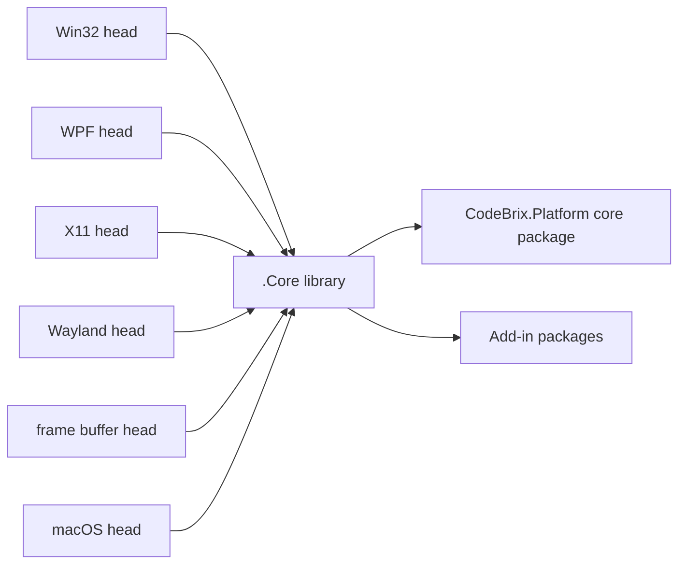

<sub>[CodeBrix](../../README.md) › [Build a CodeBrix.Platform application](README.md) › Add-ins</sub>

# Add-ins

**By the end of this chapter you will know which add-in package supplies which capability, where every one of them belongs in a solution, and what each one brings with it.** An add-in is an optional CodeBrix.Platform package that adds a XAML element, a service, or the engine behind a control the core framework already declares. Every add-in in the family follows one placement rule, and most of them need no startup code at all.

## What an add-in is

The core package, [`CodeBrix.Platform.ApacheLicenseForever`](https://www.nuget.org/packages/CodeBrix.Platform.ApacheLicenseForever), gives you the XAML runtime, the control set, layout, data binding and dispatching. An add-in extends that in one of three shapes:

- **It contributes new types.** You name them in XAML or in code: `SKCanvasElement`, `FlexPanel`, `TerminalControl`, `AudioPlayer`.
- **It supplies the engine behind a core control.** The core declares `SvgImageSource`, `WebView2` and `MediaPlayerElement` but ships no parser, no browser engine and no decoder. The add-in plugs one in, and application code never names a type from the add-in.
- **It is not a UI control at all.** [AppSettings](add-ins/AppSettings.md) is a persistent settings store with no visual surface.

An add-in that only works on some heads is inert on the others and never breaks a build.

## The one rule: reference it once, in .Core

Every add-in package is referenced exactly once, in the application's `.Core` project, next to the core framework package. Never add one to a head project. Each head inherits every add-in through its `.Core` project reference.



This is what a `.Core` project file looks like with two add-ins and a bundled font added to the required core package.

```xml
<Project Sdk="Microsoft.NET.Sdk">
  <PropertyGroup>
    <TargetFramework>net10.0</TargetFramework>
    <RootNamespace>MyApp</RootNamespace>
    <!-- CodeBrix.Platform uses these for internal conditional compilation -->
    <DefineConstants>$(DefineConstants);HAS_CODEBRIX;HAS_CODEBRIX_WINUI</DefineConstants>
  </PropertyGroup>

  <ItemGroup>
    <PackageReference Include="Microsoft.Extensions.Hosting" />
    <PackageReference Include="Microsoft.Extensions.Logging.Console" />

    <!-- The core UI framework (REQUIRED) -->
    <PackageReference Include="CodeBrix.Platform.ApacheLicenseForever" />

    <!-- Optional add-ins - include only what you use, e.g.: -->
    <PackageReference Include="CodeBrix.Platform.Graphics2DSK.ApacheLicenseForever" />
    <PackageReference Include="CodeBrix.Platform.WebView.ApacheLicenseForever" />
    <!-- Optional bundled font: -->
    <PackageReference Include="CodeBrix.Platform.Fonts.OpenSans.ApacheLicenseForever" />
  </ItemGroup>
</Project>
```

Notice that no add-in carries a version attribute and no add-in appears in a head project. Head projects reference exactly one platform head package, the `.Core` project and the `.UI` shared project, and nothing else UI-related.

> [!IMPORTANT]
> If you put a head package in `.Core`, or more than one head package in a single head project, the build will be wrong. One head project equals one head package.

The only non-CodeBrix package a head project may need is one an add-in's own guide tells you to put there - for example a native runtime redistributable on Windows. Never decide that on your own.

## Every add-in

### Drawing and graphics

| Add-in | Package | What it adds | Heads |
| --- | --- | --- | --- |
| [Graphics2DSK](add-ins/Graphics2DSK.md) | [`CodeBrix.Platform.Graphics2DSK.ApacheLicenseForever`](https://www.nuget.org/packages/CodeBrix.Platform.Graphics2DSK.ApacheLicenseForever) | `SKCanvasElement`, an element you subclass and draw into with SkiaSharp | All six |
| [Graphics3DGL](add-ins/Graphics3DGL.md) | [`CodeBrix.Platform.Graphics3DGL.ApacheLicenseForever`](https://www.nuget.org/packages/CodeBrix.Platform.Graphics3DGL.ApacheLicenseForever) | `GLCanvasElement`, `SkiaGLCanvasElement`, `OffscreenGLContext`, `SkiaGpuContext` | All six |
| [SkiaSharp views](add-ins/SkiaSharpViews.md) | [`CodeBrix.Platform.SkiaSharp.Views.MitLicenseForever`](https://www.nuget.org/packages/CodeBrix.Platform.SkiaSharp.Views.MitLicenseForever) | `SKXamlCanvas` and the Point/Rect/Size/Color conversion helpers | All six |
| [Svg](add-ins/Svg.md) | [`CodeBrix.Platform.Svg.ApacheLicenseForever`](https://www.nuget.org/packages/CodeBrix.Platform.Svg.ApacheLicenseForever) | The parser behind the core's `SvgImageSource` | All six |
| [Lottie](add-ins/Lottie.md) | [`CodeBrix.Platform.Lottie.ApacheLicenseForever`](https://www.nuget.org/packages/CodeBrix.Platform.Lottie.ApacheLicenseForever) | `LottieVisualSource` and `ThemableLottieVisualSource` for the core's `AnimatedVisualPlayer`, and the source that makes `ProgressRing` spin | All six |

### Media and the web

| Add-in | Package | What it adds | Heads |
| --- | --- | --- | --- |
| [AudioPlayer](add-ins/AudioPlayer.md) | [`CodeBrix.Platform.AudioPlayer.ApacheLicenseForever`](https://www.nuget.org/packages/CodeBrix.Platform.AudioPlayer.ApacheLicenseForever) | `AudioPlayer`, `MidiPlayer` and `SoundEffect` - audio, and MIDI through a SoundFont, SFZ or Decent Sampler instrument, with no native setup | All six |
| [VideoPlayer](add-ins/VideoPlayer.md) | [`CodeBrix.Platform.VideoPlayer.ApacheLicenseForever`](https://www.nuget.org/packages/CodeBrix.Platform.VideoPlayer.ApacheLicenseForever) | `VideoPlayer`, an AV1 video element with color grading, layers, captions and chapters | All six |
| [MediaPlayer](add-ins/MediaPlayer.md) | [`CodeBrix.Platform.MediaPlayer.LgplLicenseForever`](https://www.nuget.org/packages/CodeBrix.Platform.MediaPlayer.LgplLicenseForever) | The playback engine behind the core's `MediaPlayerElement` | Win32, WPF, X11, Wayland, frame buffer |
| [WebView](add-ins/WebView.md) | [`CodeBrix.Platform.WebView.ApacheLicenseForever`](https://www.nuget.org/packages/CodeBrix.Platform.WebView.ApacheLicenseForever) | The per-head engine behind the core's `WebView2` control | All six |

### Text, layout and controls

| Add-in | Package | What it adds | Heads |
| --- | --- | --- | --- |
| [AdvancedTextEdit](add-ins/AdvancedTextEdit.md) | [`CodeBrix.Platform.AdvancedTextEdit.ApacheLicenseForever`](https://www.nuget.org/packages/CodeBrix.Platform.AdvancedTextEdit.ApacheLicenseForever) | `AdvancedTextEdit`, a code and text editor control with folding, completion and syntax highlighting | All six |
| [TextLayout](add-ins/TextLayout.md) | [`CodeBrix.Platform.TextLayout.ApacheLicenseForever`](https://www.nuget.org/packages/CodeBrix.Platform.TextLayout.ApacheLicenseForever) | The framework's text engine as a plain code API - shaping, bidirectional runs, carets, hit testing | All six, and outside an application |
| [FlexPanel](add-ins/FlexPanel.md) | [`CodeBrix.Platform.FlexPanel.ApacheLicenseForever`](https://www.nuget.org/packages/CodeBrix.Platform.FlexPanel.ApacheLicenseForever) | `FlexPanel`, CSS flexbox-style layout with per-child attached properties | All six |
| [CommandBar](add-ins/CommandBar.md) | [`CodeBrix.Platform.CommandBar.ApacheLicenseForever`](https://www.nuget.org/packages/CodeBrix.Platform.CommandBar.ApacheLicenseForever) | The `ToolBarTray` / `ToolBar` / `ToolButton` desktop tool bar family, with groups, separators, spacers, chevron overflow and SVG and raster icons | All six |
| [PlotterView](add-ins/PlotterView.md) | [`CodeBrix.Platform.PlotterView.ApacheLicenseForever`](https://www.nuget.org/packages/CodeBrix.Platform.PlotterView.ApacheLicenseForever) | `PlotterControl`, a chart view with the full pan, zoom and tracker interaction model | All six |
| [TerminalView](add-ins/TerminalView.md) | [`CodeBrix.Platform.TerminalView.ApacheLicenseForever`](https://www.nuget.org/packages/CodeBrix.Platform.TerminalView.ApacheLicenseForever) | `TerminalControl`, a transport-agnostic VT100/VT220/xterm terminal view | All six |

### Application services

| Add-in | Package | What it adds | Heads |
| --- | --- | --- | --- |
| [AppSettings](add-ins/AppSettings.md) | [`CodeBrix.Platform.AppSettings.ApacheLicenseForever`](https://www.nuget.org/packages/CodeBrix.Platform.AppSettings.ApacheLicenseForever) | `AppSettingsService` over a portable `settings.sqlite` store - the one add-in that is not a UI control | All six |

## The standalone libraries add-ins host

Several add-ins are the XAML skin over a library that is fully usable on its own in any .NET 10 application. When you need the capability without a window - in a service, a test, a batch tool - use the library directly.

| Library | Add-in that hosts it | How it arrives |
| --- | --- | --- |
| [CodeBrix.Platform.OpenGL](../libraries/CodeBrix.Platform.OpenGL.md) | [Graphics3DGL](add-ins/Graphics3DGL.md) | Automatic dependency; supplies the `GL` binding type |
| [CodeBrix.SkiaSvg](../libraries/CodeBrix.SkiaSvg.md) | [Svg](add-ins/Svg.md) | Automatic dependency; the SVG parser and renderer |
| [CodeBrix.Audio](../libraries/CodeBrix.Audio.md) | [AudioPlayer](add-ins/AudioPlayer.md) | Automatic dependency; the managed audio engine |
| [CodeBrix.Audio.Opus](../libraries/CodeBrix.Audio.Opus.md) | [AudioPlayer](add-ins/AudioPlayer.md), [VideoPlayer](add-ins/VideoPlayer.md) | The application references and registers it for Opus sound |
| [CodeBrix.Audio.ModestSynth](../libraries/CodeBrix.Audio.ModestSynth.md) | [AudioPlayer](add-ins/AudioPlayer.md) | The application references and registers it for the oscillators and creative effects a Decent Sampler preset may ask for |
| [CodeBrix.VideoPlayback.Dav1d](../libraries/CodeBrix.VideoPlayback.Dav1d.md) | [VideoPlayer](add-ins/VideoPlayer.md) | The application references and registers it for AV1 decoding |
| [CodeBrix.Platform.MediaPlayerCore](../libraries/CodeBrix.Platform.MediaPlayerCore.md) | [MediaPlayer](add-ins/MediaPlayer.md) | Automatic dependency; delivers playback |
| [CodeBrix.Plotter](../libraries/CodeBrix.Plotter.md) | [PlotterView](add-ins/PlotterView.md) | Automatic dependency; owns the `PlotModel` |
| [CodeBrix.Terminal](../libraries/CodeBrix.Terminal.md) | [TerminalView](add-ins/TerminalView.md) | Automatic dependency; the terminal engine |
| [CodeBrix.Sqlite](../libraries/CodeBrix.Sqlite.md) | [AppSettings](add-ins/AppSettings.md) | Automatic dependency; the engine behind `settings.sqlite` |

> [!TIP]
> Reach for the library rather than the add-in when the work has no visual surface: rasterize SVG in a document pipeline with CodeBrix.SkiaSvg, build a `PlotModel` in a report generator with CodeBrix.Plotter, or lay out text for an image with the TextLayout add-in, which needs no application host at all.

## What an add-in brings with it

Three things happen when you add the package reference and nothing else.

- **Its own dependencies arrive.** Each add-in's guide names them. A few add-ins also name a companion package the application itself must reference - the add-in's guide says which, and where it goes.
- **It activates itself.** Add-ins that supply the engine behind a core control carry an `[assembly: ApiExtension(...)]` registration. The XAML source generator finds that attribute while compiling the application and emits the registration call into the generated `App` code, so the reference alone wires the control to the add-in. There is nothing to call at startup.
- **It reaches every head.** The reference flows transitively from `.Core` to every head project, and each add-in activates itself on the heads it supports.

Two add-ins need a system-installed engine on Linux: the [WebView](add-ins/WebView.md) add-in uses WPE WebKit, and the [MediaPlayer](add-ins/MediaPlayer.md) add-in uses libvlc. Each add-in page gives the exact install command for its own prerequisite.

---

**Where to go next**

- [Graphics, media and vision](09-graphics-media-and-vision.md) - the next chapter, where the drawing and media add-ins are put to work
- [Graphics2DSK](add-ins/Graphics2DSK.md) - the lightest way to draw something custom in a page
- [Project architecture](04-project-architecture.md) - why `.Core`, `.UI` and the heads are split the way they are
- [The library catalog](../libraries/README.md) - every standalone library, by topic
