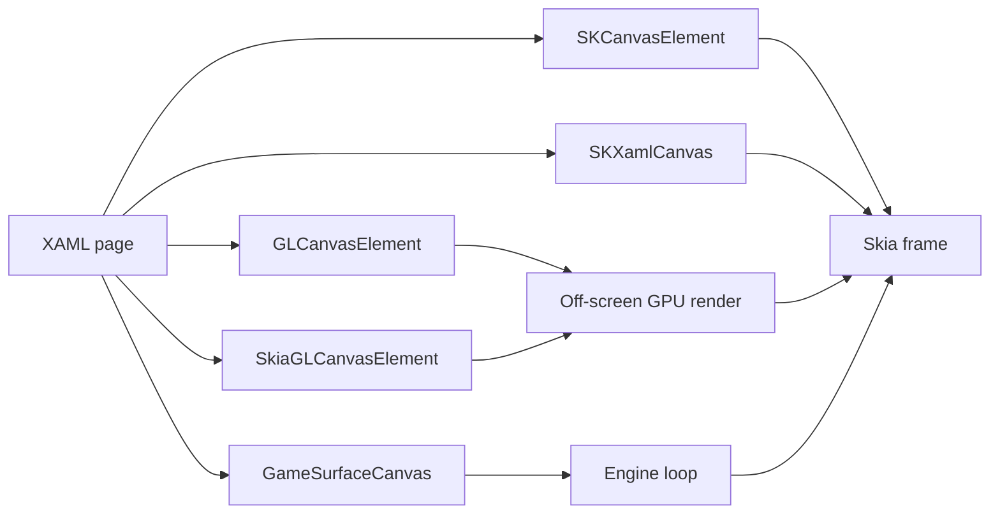

<sub>[CodeBrix](../../README.md) › [Build a CodeBrix.Platform application](README.md) › Graphics, media and vision</sub>

# Graphics, media and vision

**By the end of this chapter you will know which surface to draw on, how to put 2D Skia drawing, a hardware-accelerated 3D scene, vector art, video, audio, a camera feed and a game-engine loop inside an ordinary page, and how to keep every one of them out of your view model.** Each section names the add-in that supplies the element, the standalone library behind it, the verbatim recipe, and the reference application whose file the recipe came from.

One rule runs through everything here. Renderers, cameras, decoders and painters live in a headless library behind small interfaces, so the view model owns a painter and never a graphics API, and the page owns the element and nothing else. That is what makes every recipe below testable without a window - see [10 - Testing your application](10-testing-your-application.md).

## Choosing a surface

Five element types can produce pixels inside a page. They differ in who does the drawing, where the pixels are composed, and what it costs per frame.



| Surface | Package | You write | Cost per paint |
| --- | --- | --- | --- |
| `SKCanvasElement` | [CodeBrix.Platform.Graphics2DSK.ApacheLicenseForever](https://www.nuget.org/packages/CodeBrix.Platform.Graphics2DSK.ApacheLicenseForever) | A subclass with a `RenderOverride` | None: it draws into the frame Skia is already composing |
| `SKXamlCanvas` | [CodeBrix.Platform.SkiaSharp.Views.MitLicenseForever](https://www.nuget.org/packages/CodeBrix.Platform.SkiaSharp.Views.MitLicenseForever) | A `PaintSurface` handler, no subclass | One full-frame copy, unless the host opts into direct canvas mode |
| `SkiaGLCanvasElement` | [CodeBrix.Platform.Graphics3DGL.ApacheLicenseForever](https://www.nuget.org/packages/CodeBrix.Platform.Graphics3DGL.ApacheLicenseForever) | A `PaintSurface` handler over a GPU-backed `SKSurface` | One GPU-to-CPU read-back |
| `GLCanvasElement` | `CodeBrix.Platform.Graphics3DGL.ApacheLicenseForever` | A subclass driving raw OpenGL | One GPU-to-CPU read-back |
| `GameSurfaceCanvas` | [CodeBrix.Platform.GameEngine.MitLicenseForever](https://www.nuget.org/packages/CodeBrix.Platform.GameEngine.MitLicenseForever) | A scene, not a paint handler | Whatever the engine loop costs |

`SKCanvasElement` is the best default for custom-drawn controls, charts, gauges and editors: there is no intermediate bitmap, no per-frame pixel copy and no extra texture. Reach for the GPU surfaces only when the drawing itself needs the GPU - shaders, 3D, very large GPU-Skia scenes - because the read-back costs a copy per frame. Each add-in has its own page: [Graphics2DSK](add-ins/Graphics2DSK.md), [SkiaSharpViews](add-ins/SkiaSharpViews.md), [Graphics3DGL](add-ins/Graphics3DGL.md).

Every add-in package below is referenced once, in the `.Core` project, and never in a head project. [04 - Project architecture](04-project-architecture.md) says why.

## Drawing 2D with Skia

### Subclass SKCanvasElement

The Graphics2DSK add-in contributes exactly one type, and this is the whole of it:

```csharp
namespace CodeBrix.Platform.WinUI.Graphics2DSK;

public abstract partial class SKCanvasElement : FrameworkElement
{
    protected SKCanvasElement();
    public static bool IsSupportedOnCurrentPlatform();
    public void Invalidate();
    protected abstract void RenderOverride(SKCanvas canvas, Size area);
}
```

`RenderOverride` receives the compositor's own frame canvas, already translated so that `(0,0)` is this element's top-left corner and clipped to `area`. The canvas state is saved before the call and restored after it, and the canvas is *not* cleared for you. Everything is in device-independent pixels - the same units as `ActualWidth`, `ActualHeight` and pointer positions - so never multiply your coordinates by a display-scale factor.

This live signal scope is a complete element: paints are fields, the render draws the current state and nothing else, and new data arrives through one method that ends in `Invalidate()`.

```csharp
using System;
using CodeBrix.Platform.WinUI.Graphics2DSK;
using SkiaSharp;
using Windows.Foundation;

namespace MyApp.Views;

public sealed partial class SignalScope : SKCanvasElement
{
    // Paints are reused across frames; never allocate them in RenderOverride.
    private readonly SKPaint _background = new() { Color = new SKColor(0x10, 0x14, 0x1C) };
    private readonly SKPaint _grid = new()
    {
        Color = new SKColor(0x30, 0x38, 0x48), StrokeWidth = 1,
        Style = SKPaintStyle.Stroke, IsAntialias = false
    };
    private readonly SKPaint _trace = new()
    {
        Color = SKColors.LimeGreen, StrokeWidth = 2,
        Style = SKPaintStyle.Stroke, IsAntialias = true
    };
    private readonly SKPath _path = new();
    private float[] _samples = Array.Empty<float>();   // values in -1..1

    public void SetSamples(float[] samples)
    {
        _samples = samples;
        Invalidate();                 // repaint with the new data
    }

    protected override void RenderOverride(SKCanvas canvas, Size area)
    {
        var w = (float)area.Width;
        var h = (float)area.Height;

        canvas.DrawRect(0, 0, w, h, _background);
        for (var x = 0f; x < w; x += 20f) canvas.DrawLine(x, 0, x, h, _grid);
        for (var y = 0f; y < h; y += 20f) canvas.DrawLine(0, y, w, y, _grid);

        if (_samples.Length < 2) return;

        _path.Reset();
        var step = w / (_samples.Length - 1);
        for (var i = 0; i < _samples.Length; i++)
        {
            var x = i * step;
            var y = h / 2 - _samples[i] * (h / 2 - 4);
            if (i == 0) _path.MoveTo(x, y); else _path.LineTo(x, y);
        }
        canvas.DrawPath(_path, _trace);
    }
}
```

Notice that `RenderOverride` reads only fields. The element is repainted whenever the compositor recomposes the frame for any reason, so the method must be a pure function of the current state and must never accumulate onto the canvas.

There is no XAML namespace to declare for the package, because the type you place is your own subclass:

```xml
<Page x:Class="MyApp.Views.MainPage"
      xmlns="http://schemas.microsoft.com/winfx/2006/xaml/presentation"
      xmlns:x="http://schemas.microsoft.com/winfx/2006/xaml"
      xmlns:local="using:MyApp.Views">
    <Grid RowSpacing="8" Padding="12">
        <Grid.RowDefinitions>
            <RowDefinition Height="Auto" />
            <RowDefinition Height="*" />
        </Grid.RowDefinitions>
        <TextBlock Text="Signal" FontSize="20" />
        <local:SignalScope x:Name="Scope" Grid.Row="1" MinHeight="120" />
    </Grid>
</Page>
```

Give the element a bounded size. With no `Height`, no `MinHeight` and no star row it can arrange at zero by zero, and a zero-sized element draws nothing.

### Paint from the view model onto an SKXamlCanvas

When the content and the zoom belong to the view model, put the painting logic in a plain Skia class the view model owns, and let repaint requests travel back through a bridge whose single delegate the page fills in. The interface is one line:

```csharp
// From CodeBrix.Samples/KenneyAssetBrowser/src/KenneyAssetBrowser.Core/ViewModels/IImageCanvasBridge.cs
/// <summary>
/// The head-capability bridge for the 2D image viewer: the page fills in how the
/// SkiaSharp canvas is repainted (marshalled to the UI thread). The view model must
/// behave sensibly when the delegate is <c>null</c>.
/// </summary>
public interface IImageCanvasBridge { Action InvalidateImageCanvas { get; set; } }
```

The view model holds the painter as a property, changes its state, and asks for a repaint:

```csharp
// From CodeBrix.Samples/KenneyAssetBrowser/src/KenneyAssetBrowser.Core/ViewModels/MainViewModel.cs
/// <summary>The 2D canvas painter the page's SkiaSharp canvas paints with.</summary>
public ImageCanvasPainter ImagePainter { get; } = new();

/// <inheritdoc />
public Action InvalidateImageCanvas { get; set; }

public string ZoomText => $"{ImagePainter.ZoomFactor * 100:0}%";

public SimpleCommand ZoomInCommand => field ??= new SimpleCommand(() => AdjustZoom(1.25f));
public SimpleCommand ZoomOutCommand => field ??= new SimpleCommand(() => AdjustZoom(0.8f));

/// <summary>Applies one wheel notch of zoom from the page's pointer-wheel handler.</summary>
public void AdjustZoomFromWheel(int wheelDelta) => AdjustZoom(wheelDelta > 0 ? 1.25f : 0.8f);

private void AdjustZoom(float factor)
{
    ImagePainter.ZoomFactor = Math.Clamp(ImagePainter.ZoomFactor * factor, 0.25f, 16f);
    NotifyPropertyChanged(nameof(ZoomText));
    InvalidateImageCanvas?.Invoke();
}
```

The page contributes three lines: it fills in the delegate, forwards the paint event, and invalidates on resize.

```csharp
// From CodeBrix.Samples/KenneyAssetBrowser/src/KenneyAssetBrowser.UI/Views/MainPage.xaml.cs
//Marshal 2D-canvas invalidations from the view model onto the UI thread
viewModel.InvalidateImageCanvas = () => DispatcherQueue?.TryEnqueue(() => ImageCanvas?.Invalidate());

//The 2D viewer: the view model's painter draws images and spritesheets (checkerboard,
//zoom, sprite spotlight) onto this SkiaSharp surface.
ImageCanvas.PaintSurface += (_, e) =>
    ViewModel?.ImagePainter.Paint(e.Surface.Canvas, e.Info.Width, e.Info.Height);
ImageCanvas.SizeChanged += (_, _) => ImageCanvas.Invalidate();
ImageCanvas.PointerWheelChanged += (_, e) =>
{
    var delta = e.GetCurrentPoint(ImageCanvas).Properties.MouseWheelDelta;
    ViewModel?.AdjustZoomFromWheel(delta);
    e.Handled = true;
};
```

Two things to notice. The invalidation delegate wraps its call in the dispatcher, because the view model raises it from continuations that may not be on the UI thread. And a resize alone does not repaint, so the size-changed handler has to invalidate - that single line is missing from more first drafts than any other in this chapter.

> [!TIP]
> Keep the painter's layout helpers public. The mapping between canvas space and image space is then unit-testable with no canvas, no window and no GPU, which is exactly what the sample's test project exercises.

### Draw in logical units on a scaled display

An `SKXamlCanvas` surface is in physical pixels. One line in the paint handler puts the drawing code back in the element's own coordinates:

```csharp
// From CodeBrix.Samples/Pinta.Brix/src/libs/Pinta.Brix.Controls/Widgets/HistogramWidget.cs
private void OnPaintSurface (object? sender, SKPaintSurfaceEventArgs e)
{
    SKCanvas canvas = e.Surface.Canvas;
    canvas.Clear (SKColors.Transparent);

    if (ActualWidth <= 0 || ActualHeight <= 0)
        return;

    //The surface is physical pixels; draw in the element's logical space.
    canvas.Scale (e.Info.Width / (float) ActualWidth, e.Info.Height / (float) ActualHeight);

    SKRect rect = SKRect.Create (0, 0, (float) ActualWidth, (float) ActualHeight);
    // ... draw in logical units from here on
}
```

Guard the actual size against zero before dividing: a paint can arrive before the first layout pass. This is the opposite of `SKCanvasElement`, which is already in device-independent pixels and needs no scale at all.

### Repaint only what changed

A document that is expensive to composite should keep a cached composite and re-composite only the dirty region. The model raises an invalidation carrying either a rectangle or an "entire surface" flag, and the view accumulates the union until the next paint:

```csharp
// From CodeBrix.Samples/Pinta.Brix/src/libs/Pinta.Brix.Controls/PintaCanvas.cs
private void OnCanvasInvalidated (object? sender, CanvasInvalidatedEventArgs e)
{
    if (e.EntireSurface || pending_dirty is null && surface_stale) {
        surface_stale = true;
        pending_dirty = null;
    } else if (pending_dirty is { } dirty) {
        pending_dirty = dirty.Union (e.Rectangle);
    } else {
        pending_dirty = e.Rectangle;
    }

    Invalidate ();
}

/// <summary>
/// A selection change alters only the overlay pass, not the layer
/// composite, so the cached surface is left intact and just the overlay
/// is repainted. Without this the marching ants and the selection tools'
/// handles never appear, because changing a selection dirties no pixels
/// and therefore never raises CanvasInvalidated.
/// </summary>
private void OnSelectionChanged (object? sender, EventArgs e)
    => Invalidate ();
```

The comment records the pitfall exactly: a change that dirties no pixels - a selection, a caret, a highlight - needs its own invalidate path or it never appears. `null` is used to mean "everything", so the union logic checks for it before unioning.

Boolean geometry over user-drawn regions belongs to [CodeBrix.PolygonTools](../libraries/CodeBrix.PolygonTools.md), whose clipper the same editor uses for union, difference, intersection and exclusion. Clear the clipper after every execute, or the next operation inherits the previous paths.

## Drawing 3D with OpenGL

The Graphics3DGL add-in gives a page two GPU-rendered elements plus two helpers for off-screen GPU work. Everything renders off screen and is composited into the Skia scene, so there is no native child window: the element clips, scrolls, overlaps and animates like any other XAML element, and XAML children can be layered on top of it. It needs an OpenGL context of version 3.0 or later, which every head provides; the GL binding itself comes from [CodeBrix.Platform.OpenGL.MitLicenseForever](https://www.nuget.org/packages/CodeBrix.Platform.OpenGL.MitLicenseForever) and arrives automatically with the add-in.

### Host a GL scene in XAML

Subclass `GLCanvasElement`, drive a framework-free renderer through its lifecycle, and turn pointer input into camera motion in the control. The page places it and binds; the view model holds the loaded scene object and knows nothing about GL.

```csharp
// From CodeBrix.Samples/KenneyAssetBrowser/src/libs/KenneyAssetBrowser.Rendering/GL/ModelSceneGlCanvas.cs
public sealed class ModelSceneGlCanvas : GLCanvasElement
{
    private readonly IModelSceneRenderer _renderer = new GlModelSceneRenderer();

    /// <summary>Creates the preview control and wires its pointer (rotate/zoom) input.</summary>
    // getWindowFunc is only used on WinUI; on CodeBrix.Platform heads it is null.
    public ModelSceneGlCanvas() : base(null)
    {
        _renderer.BackgroundColor = SolidBackground;

        PointerPressed += OnPointerPressed;
        PointerMoved += OnPointerMoved;
        PointerReleased += OnPointerReleased;
        PointerCaptureLost += OnPointerCaptureLost;
        PointerWheelChanged += OnPointerWheelChanged;
    }

    public static readonly DependencyProperty ModelProperty =
        DependencyProperty.Register(
            nameof(Model),
            typeof(LoadedModel),
            typeof(ModelSceneGlCanvas),
            new PropertyMetadata(null, OnModelChanged));

    public LoadedModel? Model
    {
        get => (LoadedModel?)GetValue(ModelProperty);
        set => SetValue(ModelProperty, value);
    }

    private static void OnModelChanged(DependencyObject d, DependencyPropertyChangedEventArgs e)
    {
        var canvas = (ModelSceneGlCanvas)d;

        ApplyDefaultFraming(canvas._renderer.Camera);
        canvas._renderer.SetModel(e.NewValue as LoadedModel, frameCamera: true);
        canvas.Invalidate();
    }

    /// <inheritdoc />
    protected override void Init(GL gl) => EnsureInitialized(gl);

    // Compiles the renderer's GL resources exactly once. Called from both Init and RenderOverride
    // so it does not matter which the host invokes first: GLCanvasElement does not guarantee Init
    // runs before the first RenderOverride on every head (e.g. a canvas that starts collapsed).
    private void EnsureInitialized(GL gl)
    {
        if (_rendererInitialized) { return; }
        _renderer.Initialize(gl);
        _rendererInitialized = true;
    }

    /// <inheritdoc />
    protected override void RenderOverride(GL gl)
    {
        EnsureInitialized(gl);

        // Both this preview and the head's own Skia renderer share the GL context, so save the
        // state we touch and restore it afterwards (the GLCanvasElement contract). The base has
        // already bound the off-screen framebuffer and set the viewport before calling us.
        var depthWasEnabled = gl.IsEnabled(EnableCap.DepthTest);
        var cullWasEnabled = gl.IsEnabled(EnableCap.CullFace);
        try
        {
            _renderer.Render(gl, (uint)RenderSize.Width, (uint)RenderSize.Height);
        }
        finally
        {
            if (depthWasEnabled) { gl.Enable(EnableCap.DepthTest); } else { gl.Disable(EnableCap.DepthTest); }
            if (cullWasEnabled) { gl.Enable(EnableCap.CullFace); } else { gl.Disable(EnableCap.CullFace); }
            gl.BindVertexArray(0);
            gl.UseProgram(0);
        }
    }

    /// <inheritdoc />
    protected override void OnDestroy(GL gl)
    {
        _renderer.Uninitialize(gl);
        _rendererInitialized = false;
    }
}
```

Four rules are visible in that file, and all four matter. Initialization is idempotent and is called from both `Init` and `RenderOverride`, because the base does not guarantee `Init` runs first on every head - a canvas that starts collapsed is the case the comment calls out. Every GL state the render touches is restored in a `finally`, because the head's own Skia renderer shares the context and a renderer exception must not leave it in a state the head did not choose. The base has already bound the off-screen framebuffer and set the viewport, so do not do it again; `RenderSize` is the size to render at. And the constructor's window accessor matters only on a native Windows build - pass `null`.

The page places the control and binds:

```xml
<!-- From CodeBrix.Samples/KenneyAssetBrowser/src/KenneyAssetBrowser.UI/Views/MainPage.xaml -->
<!-- 3D models: a self-contained GL canvas that draws the bound model
     and handles rotate/zoom itself; animated models additionally
     bind their baked clip and play state -->
<render:ModelSceneGlCanvas x:Name="ModelCanvas"
                           Model="{d:Binding CurrentModel}"
                           AnimationClip="{d:Binding CurrentAnimationClip}"
                           IsAnimationPlaying="{d:Binding IsAnimationPlaying}"
                           Visibility="{d:Binding ModelViewerVisibility}" />
```

And the view model parses off the UI thread and publishes a plain property:

```csharp
// From CodeBrix.Samples/PolyHavenBrowser/src/PolyHavenBrowser.Core/ViewModels/MainViewModel.cs
/// <summary>The model shown in the 3D preview (null while browsing); the preview control binds to this.</summary>
public LoadedModel CurrentModel => _currentModel;

private async Task OpenModelViewAsync(PolyHavenAsset asset, DownloadedModel downloaded)
{
    //Parse the glTF and gather its stats off the UI thread; GPU upload happens lazily
    //at first paint.
    var (model, stats) = await Task.Run(() =>
    {
        var loaded = new GltfModelLoader().LoadFile(downloaded.GltfPath);
        return (loaded, ModelFileStats.FromLoadedModel(loaded, downloaded.ModelFolder));
    });

    // Hand the model to the preview control via its bound CurrentModel; the control frames
    // the camera and repaints itself. The GPU upload happens lazily at its first render.
    _currentModel = model;
    // ...
    NotifyPropertyChanged(nameof(CurrentModel));
    IsModelViewActive = true;
}
```

`Invalidate()` coalesces to one paint per frame, so calling it from every pointer move is fine.

### Keep the renderer framework-free

The renderer interface mirrors the canvas lifecycle exactly and says which thread each member is called on. That is what also lets an off-screen pipeline drive the same renderer, and what makes the camera math unit-testable.

```csharp
// From CodeBrix.Samples/KenneyAssetBrowser/src/libs/KenneyAssetBrowser.Rendering/GL/IModelSceneRenderer.cs
/// <summary>
/// A framework-free OpenGL renderer for previewing one <see cref="LoadedModel"/> with an
/// orbit camera. The lifecycle mirrors the Graphics3DGL <c>GLCanvasElement</c> contract:
/// the host element calls <see cref="Initialize"/> from its <c>Init(GL)</c>,
/// <see cref="Render"/> from <c>RenderOverride(GL)</c>, and <see cref="Uninitialize"/>
/// from <c>OnDestroy(GL)</c> — all on the GL thread. <see cref="SetModel"/> may be called
/// from any thread; the model is uploaded on the next render.
/// </summary>
public interface IModelSceneRenderer
{
    OrbitCamera Camera { get; }
    (float R, float G, float B, float A) BackgroundColor { get; set; }

    void SetModel(LoadedModel? model, bool frameCamera = true);
    void SetFrameVertices(IReadOnlyList<ModelFramePrimitive>? frame);

    /// <summary>Compiles shaders and creates GL resources. Call once, on the GL thread.</summary>
    void Initialize(GL gl);

    /// <summary>Renders the scene into the currently bound framebuffer at the given pixel size.</summary>
    void Render(GL gl, uint width, uint height);

    /// <summary>Deletes all GL resources. Call once when the canvas is destroyed, on the GL thread.</summary>
    void Uninitialize(GL gl);
}
```

The "any thread" promise is only safe because the setter never touches GL. It stashes the new data behind a lock, and every buffer creation and deletion happens inside the render call on the GL thread:

```csharp
// From CodeBrix.Samples/KenneyAssetBrowser/src/libs/KenneyAssetBrowser.Rendering/GL/GlModelSceneRenderer.cs
/// <inheritdoc />
public void SetModel(LoadedModel? model, bool frameCamera = true)
{
    lock (_pendingLock)
    {
        _pendingModel = model;
        _pendingFrameCamera = frameCamera;
        _hasPendingModel = true;
    }
}
```

### Write one shader body for desktop GL and GLES

Some heads give you desktop OpenGL and others give you OpenGL ES. Keep the shader bodies version-agnostic and prepend the header after probing the live context:

```csharp
// From CodeBrix.Samples/PolyHavenBrowser/src/libs/PolyHavenBrowser.Rendering/GL/GlModelSceneRenderer.cs
public void Initialize(GL gl)
{
    ArgumentNullException.ThrowIfNull(gl);

    // The same shader source runs on desktop OpenGL and OpenGL ES; only the #version header
    // differs, so we detect the context type and prepend the right one.
    var isGles = (gl.GetStringS(StringName.Version) ?? string.Empty)
        .Contains("OpenGL ES", StringComparison.OrdinalIgnoreCase);
    var header = isGles ? "#version 300 es\n" : "#version 330 core\n";

    var vertexShader = CompileShader(gl, ShaderType.VertexShader, header + VertexShaderBody);
    var fragmentShader = CompileShader(gl, ShaderType.FragmentShader, header + FragmentShaderBody);
    // ... link, check LinkStatus, then cache every uniform location once ...
}
```

Open the fragment shader body with a precision qualifier, which desktop GL accepts and GLES requires, so one body works under both headers. Throw with the driver's information log when compilation or linking fails: a silent black canvas is much harder to diagnose than an exception, and the element surfaces the message through its failure state.

### Share one camera and one matrix convention

Put the camera in the headless library, expose it up the chain so pointer input drives it identically whichever backend is active, and send the matrices to the GPU untransposed.

```csharp
// From CodeBrix.Samples/PolyHavenBrowser/src/libs/PolyHavenBrowser.Rendering/GL/GlModelSceneRenderer.cs
// MVP = view * projection (node transforms are baked at load time). System.Numerics
// stores matrices row-major; uploading with transpose=false makes GL read that
// row-major data as its own column-major layout, which is exactly the transpose GL
// needs. Calling Matrix4x4.Transpose here as well would double-transpose and flatten
// the depth axis for any non-axis-aligned camera.
var mvp = Camera.GetViewMatrix() * Camera.GetProjectionMatrix(width / (float)height);
gl.UniformMatrix4(_mvpLocation, 1, false, (float*)&mvp);
```

Do not add a transpose. GLSL, SPIR-V and MSL all read a four-by-four matrix column-major, which already applies the transpose that .NET's row-major storage needs. Transposing again silently flattens the depth axis, and only for rotated cameras - so an axis-aligned test view hides the bug entirely. The regression test that pins it uses a rotated camera on purpose and tries both draw orders; [10 - Testing your application](10-testing-your-application.md) shows it.

Framing a newly bound model is the camera's job, not the element's:

```csharp
// From CodeBrix.Samples/PolyHavenBrowser/src/libs/PolyHavenBrowser.Rendering/Cameras/OrbitCamera.cs
/// <summary>Frames the camera on a model's bounding box, keeping the current yaw/pitch.</summary>
public void FitToModel(LoadedModel model)
{
    ArgumentNullException.ThrowIfNull(model);
    FitToBounds(model.BoundsMin, model.BoundsMax);
    //Orbit around the centroid when the model provides one, so a model with a sparse
    //extremity rotates in place instead of swinging around the bounding-box center. Raise
    //the look-at point by VerticalFramingBias so the model can sit lower in the view.
    var radius = MathF.Max((model.BoundsMax - model.BoundsMin).Length() * 0.5f, 0.001f);
    Target = (model.Pivot ?? model.BoundsCenter) + new Vector3(0f, radius * VerticalFramingBias, 0f);
}
```

Set the framing before handing over the model: framing is applied when the pending model is taken up at render time, so a later change does not reach the frame you are about to draw.

### Draw translucent surfaces in a second pass

Glass that hides what is behind it is a two-pass problem. Classify materials at load time, then draw opaque geometry first with depth writes on, and the translucent primitives afterwards with blending on and depth writes off.

```csharp
// From CodeBrix.Samples/PolyHavenBrowser/src/libs/PolyHavenBrowser.Rendering/GL/GlModelSceneRenderer.cs
// Two passes over the primitives: opaque (and mask) first with depth writes on, then the
// translucent (BLEND) primitives over them with blending and depth writes off, so
// glass-like surfaces show what's behind them instead of occluding it. BLEND primitives
// are not depth-sorted - fine for the small amount of transparent geometry these preview
// models carry.
DrawPrimitives(gl, blendPass: false);

gl.Enable(EnableCap.Blend);
gl.BlendFuncSeparate(
    BlendingFactor.SrcAlpha, BlendingFactor.OneMinusSrcAlpha,
    BlendingFactor.One, BlendingFactor.OneMinusSrcAlpha);
gl.DepthMask(false);
DrawPrimitives(gl, blendPass: true);
gl.DepthMask(true);
gl.Disable(EnableCap.Blend);
```

The separate alpha function is the part that is easy to get wrong: the alpha channel must accumulate coverage, or a region that is already opaque behind the glass loses its opacity when the frame is composited onto Skia. glTF marks glass two ways, and the second is easy to miss - a blend alpha mode, and a transmission extension on an otherwise opaque material - so the loader treats a transmissive material as translucent.

## Rendering off screen

### Render stills at a size the canvas never has

`OffscreenGLContext` gives you a headless GL context from the hosting page's XAML root. Its `MakeCurrent()` returns a disposable that saves and restores whatever context the head had current, so the head is untouched afterwards even though they share a thread.

```csharp
public sealed class OffscreenGLContext : IDisposable
{
    public static bool TryCreate(XamlRoot xamlRoot,
                                 [NotNullWhen(true)] out OffscreenGLContext? context);
    public GL Gl { get; }
    public IDisposable MakeCurrent();
    public IntPtr GetProcAddress(string name);   // IntPtr.Zero when absent; never throws
    public GRContext CreateGrContext();          // throws InvalidOperationException when
                                                 // neither GL flavour works
    public void Dispose();
}
```

The high-resolution product-shot pipeline in the 3D browser stages the work: pure CPU work goes on `Task.Run`, the GL work stays on the UI thread inside a `using` over the context, and the whole thing still completes when no context can be created.

```csharp
// From CodeBrix.Samples/PolyHavenBrowser/src/PolyHavenBrowser.Core/ViewModels/MainViewModel.cs
//Stage 2: build the photography sets (pure CPU — off the UI thread).
var scenes = await Task.Run(() => (
    Tabletop: ShotSceneBuilder.Build(model, stages.Tabletop),
    Light: ShotSceneBuilder.Build(model, stages.Light),
    Dark: ShotSceneBuilder.Build(model, stages.Dark)));

//Stage 3: the product shots, on this head's off-screen GL context. GL work must
//  stay on the UI thread; MakeCurrent saves/restores the head's own context.
//  With no GL available the sheet still composes, led by the catalog thumbnail.
DocumentStatusText = "Rendering product shots…";
byte[] heroShot = null;
var galleryShots = new List<MarketingSheetShot>();
if (OffscreenGLContext.TryCreate(GetXamlRoot(), out var glContext))
{
    using (glContext)
    using (glContext.MakeCurrent())
    using (var shotRenderer = new ModelShotRenderer(glContext.Gl))
    {
        heroShot = shotRenderer.RenderPng(
            scenes.Tabletop, stages.Tabletop, ShotAngle.Hero, HeroShotWidth, HeroShotHeight);
        galleryShots.Add(new MarketingSheetShot("Front", shotRenderer.RenderPng(
            scenes.Light, stages.Light, ShotAngle.Front, GalleryShotWidth, GalleryShotHeight)));
        // ... Side, Back, Top ...
    }
}
```

Every member of the shot renderer, disposal included, must be called on the thread where the context is current, which is why the `using` block is the only correct shape. Read-back pixels are bottom-up, so flip them before encoding. And a compatibility-first GL context may offer no multisampling at all, so the renderer supersamples and downscales instead, with a conservative ceiling on the framebuffer side:

```csharp
// From CodeBrix.Samples/PolyHavenBrowser/src/libs/PolyHavenBrowser.Rendering/Shots/ModelShotRenderer.cs
//Rendered pixels per output pixel, per axis. 2 gives 4 samples per output pixel.
private const uint Supersample = 2;

//A conservative ceiling for the supersampled framebuffer, kept below every desktop
//  GL/GLES 3.0 implementation's minimum guarantees.
private const uint MaxFramebufferSide = 4096;
```

### Composite engine pixels with the right orientation

When you read pixels back from a GPU API and draw them on a Skia surface, put the orientation on the frame and let one painter honor it. Nothing else in the application then knows which backend produced the pixels.

```csharp
// From CodeBrix.Samples/PolyHavenBrowser_viewer_only/src/PolyHavenBrowser.Core/Display/ModelScenePainter.cs
public void Paint(SKSurface surface, SKImageInfo info)
{
    if (_disposed || info.Width <= 0 || info.Height <= 0) { return; }

    var hasBackground = _backgroundBitmap != null;
    var background = hasBackground ? (0f, 0f, 0f, 0f) : SolidBackground;

    // The engine does all the API-specific work and hands back RGBA pixels.
    var frame = _engine.RenderFrame(info.Width, info.Height, background);

    DrawFrame(surface, info, frame);
}

private void DrawFrame(SKSurface surface, SKImageInfo info, RenderedFrame frame)
{
    var canvas = surface.Canvas;
    var sampling = new SKSamplingOptions(SKFilterMode.Linear);

    DrawBackground(canvas, info, sampling);

    // Straight (unpremultiplied) alpha so a transparent clear lets the background show through.
    var imageInfo = new SKImageInfo(frame.Width, frame.Height, SKColorType.Rgba8888, SKAlphaType.Unpremul);
    using var image = SKImage.FromPixelCopy(imageInfo, frame.Rgba);

    canvas.Save();
    if (frame.IsBottomUp)
    {
        // The engine's first pixel row is the bottom of the image; flip vertically to match
        // Skia's top-down surface.
        canvas.Scale(1f, -1f);
        canvas.Translate(0f, -info.Height);
    }
    canvas.DrawImage(image, new SKRect(0, 0, info.Width, info.Height), sampling);
    canvas.Restore();
}
```

OpenGL's first pixel row is the image bottom, and Vulkan's clip-space Y points the other way, so with the same matrices its read-back is inverted too and it shares the flip. Metal's clip-space Y points up while its framebuffer origin is top-left, so it is the exception and declares itself top-down. Use unpremultiplied alpha, or the transparent clear behind a background texture will not composite correctly.

### GPU Skia off screen, with a CPU fallback

For work that never needs to be on screen - thumbnails, batch rasterization - skip the element entirely. `SkiaGpuContext` is the backend-neutral way to get a GPU Skia context, and `TryCreate` returning false means "keep your CPU fallback".

```csharp
using CodeBrix.Platform.WinUI.Graphics3DGL;
using SkiaSharp;

// Call on the UI thread once the page is loaded (needs a XamlRoot).
SKImage RenderThumbnail(int width, int height)
{
    var info = new SKImageInfo(width, height, SKColorType.Bgra8888, SKAlphaType.Premul);

    if (SkiaGpuContext.TryCreate(XamlRoot, out var gpu))
    {
        using (gpu)
        using (gpu.BeginFrame())                       // GL current / Metal no-op
        using (var surface = SKSurface.Create(gpu.GrContext, true, info))
        {
            Draw(surface.Canvas);
            surface.Flush();
            return surface.Snapshot().ToRasterImage(); // copy off the GPU before Dispose
        }
    }

    using (var surface = SKSurface.Create(info))        // CPU fallback
    {
        Draw(surface.Canvas);
        return surface.Snapshot();
    }
}
```

Copy the snapshot off the GPU before the context is disposed, and dispose a `GRContext` you built yourself inside a make-current scope, before the context it was built on.

On Windows the context needs a real desktop OpenGL driver. Many Windows-on-Arm devices do not ship one; there, OpenGL comes from the OpenCL and OpenGL Compatibility Pack, which the end user installs once per device from the Microsoft Store. Detect the situation and say so rather than showing an empty pane:

```csharp
// MainPage.xaml.cs
Triangle.Loaded += (_, _) =>
{
    var state = Triangle.GetGLInitializationState();
    if (state.Status == GLInitializationStatus.InitializationFailed)
    {
        var msg = "3D rendering is unavailable.\n\n" + state.FailedReason;
        Status.Text = msg;   // or a dialog
    }
};
```

Query that state in `Loaded` or later. In the constructor it is always `NotYetInitialized`.

## Choosing a graphics backend per head

A capability that works only on some heads deserves a policy, not a driver probe that might half-succeed on a head you never validated. Put the policy in the headless library as a static class with a pure support function plus a cached detection of the running head:

```csharp
// From CodeBrix.Samples/PolyHavenBrowser_viewer_only/src/libs/PolyHavenBrowser.Rendering/Vulkan/VulkanPlatformSupport.cs
public static class VulkanPlatformSupport
{
    private const string HeadAssemblyPrefix = "CodeBrix.Platform.UI.Runtime.Skia.";

    private static readonly Lazy<PlatformHead> DetectedHead = new(DetectCurrentHead);

    public static bool IsSupported(PlatformHead head) => head switch
    {
        PlatformHead.LinuxX11 => true,
        PlatformHead.LinuxWayland => true,
        PlatformHead.Win32Skia => true,
        PlatformHead.WinWpfSkia => true,
        _ => false,
    };

    public static bool IsCurrentPlatformSupported => IsSupported(CurrentHead);

    public static PlatformHead CurrentHead => DetectedHead.Value;

    public static PlatformHead ClassifyAssemblyName(string? assemblyName)
    {
        if (assemblyName is null || !assemblyName.StartsWith(HeadAssemblyPrefix, StringComparison.Ordinal))
        {
            return PlatformHead.Unknown;
        }

        var head = assemblyName[HeadAssemblyPrefix.Length..];
        if (head == "X11") { return PlatformHead.LinuxX11; }
        if (head == "Wayland") { return PlatformHead.LinuxWayland; }
        if (head == "Linux.FrameBuffer") { return PlatformHead.LinuxFrameBuffer; }
        if (head == "MacOS") { return PlatformHead.MacOS; }
        if (head == "Wpf") { return PlatformHead.WinWpfSkia; }
        if (head == "Win32" || head.StartsWith("Win32.", StringComparison.Ordinal))
        {
            return PlatformHead.Win32Skia;
        }

        return PlatformHead.Unknown;
    }
}
```

Detection is a one-time scan of loaded assemblies for a head runtime assembly name, so the library needs no reference to any head. Prefix matching keeps satellite assemblies classified with their head, and an unrecognized host classifies as unknown and is conservatively unsupported - which is also what a unit-test host is.

A selector registered as a singleton owns the list of kinds, the gate and engine creation. Everything above the seam - painter, camera, model loading, XAML - is unchanged by the choice.

```csharp
// From CodeBrix.Samples/PolyHavenBrowser_viewer_only/src/PolyHavenBrowser.Core/Display/IModelRenderEngineSelector.cs
public sealed class ModelRenderEngineSelector : IModelRenderEngineSelector
{
    private static readonly RenderEngineKind[] Kinds =
        [RenderEngineKind.OpenGL, RenderEngineKind.Vulkan, RenderEngineKind.Metal];

    public IReadOnlyList<RenderEngineKind> AvailableKinds => Kinds;

    public bool IsSupported(RenderEngineKind kind) => kind switch
    {
        RenderEngineKind.OpenGL => true,
        RenderEngineKind.Vulkan => VulkanPlatformSupport.IsCurrentPlatformSupported,
        RenderEngineKind.Metal => MetalPlatformSupport.IsCurrentPlatformSupported,
        _ => false,
    };

    public IModelRenderEngine Create(RenderEngineKind kind, Func<XamlRoot> getXamlRoot)
    {
        if (!IsSupported(kind))
        {
            throw new NotSupportedException($"The {kind} rendering engine is not supported on this platform.");
        }

        return kind switch
        {
            RenderEngineKind.OpenGL => new OpenGlModelRenderEngineFactory(getXamlRoot).Create(),
            RenderEngineKind.Vulkan => new VulkanModelRenderEngineFactory().Create(),
            RenderEngineKind.Metal => new MetalModelRenderEngineFactory().Create(),
            _ => throw new ArgumentOutOfRangeException(nameof(kind)),
        };
    }
}
```

The view model exposes the kind names as a bound list and the selection as a bound string, and the page is a drop-down:

```xml
<!-- From CodeBrix.Samples/PolyHavenBrowser_viewer_only/src/PolyHavenBrowser.UI/Views/MainPage.xaml -->
<ComboBox Width="130" Height="36" VerticalAlignment="Center"
          ItemsSource="{d:Binding RenderEngineNames}"
          SelectedItem="{d:Binding SelectedRenderEngineName, Mode=TwoWay}"
          IsEnabled="{d:Binding IsNotBusy}"
          Visibility="{d:Binding EngineSelectorVisibility}" />
```

The list is deliberately not filtered to supported kinds, so the user learns why an option is unavailable. Creation hands back a fresh engine and the caller owns and disposes it: build the new one first, pre-warm it off the UI thread, and dispose the old painter - which disposes its engine - only afterwards.

## Vector art and animation

### SVG through the Svg add-in

[CodeBrix.Platform.Svg.ApacheLicenseForever](https://www.nuget.org/packages/CodeBrix.Platform.Svg.ApacheLicenseForever) is an invisible add-in: application code never names a type from it. Reference it once in `.Core`, then use the core framework's own `SvgImageSource` and `Image`, with no XAML namespace to declare.

```xml
<Image Width="96" Height="96" Stretch="Uniform">
    <Image.Source>
        <SvgImageSource UriSource="ms-appx:///Assets/logo.svg" />
    </Image.Source>
</Image>
```

While both `RasterizePixelWidth` and `RasterizePixelHeight` are unset, the SVG is drawn as vectors at the arranged size - crisp at every size and display scale. Set both to pre-render into a bitmap of that logical size instead; setting only one changes nothing. An `ImageBrush` never gets the vector canvas: it receives a bitmap rendered once at the intrinsic size, so use an `Image` element wherever sharpness at large sizes matters.

`SvgImageSource` does not resolve `embedded://` URIs. For an SVG embedded in an assembly, open the manifest stream and hand it over:

```csharp
using System.Reflection;
using Windows.Storage.Streams;
using Microsoft.UI.Xaml.Media.Imaging;

static async Task<SvgImageSource> LoadEmbeddedSvgAsync(string resourceName)
{
    var assembly = typeof(App).Assembly;    // or Assembly.Load("MyApp.Core")
    await using var resource = assembly.GetManifestResourceStream(resourceName)
        ?? throw new InvalidOperationException($"Resource '{resourceName}' not found.");

    var ras = new InMemoryRandomAccessStream();
    var writer = ras.AsStreamForWrite();
    await resource.CopyToAsync(writer);
    await writer.FlushAsync();
    ras.Seek(0);

    var svg = new SvgImageSource();
    var status = await svg.SetSourceAsync(ras);      // SvgImageSourceLoadStatus
    if (status != SvgImageSourceLoadStatus.Success)
        throw new InvalidOperationException($"SVG load failed: {status}");
    return svg;
}

// usage
Logo.Source = await LoadEmbeddedSvgAsync("MyApp.Assets.padlock-icon.svg");
```

Loading errors do not throw. A bad path or an unreachable URI leaves the `Image` blank and raises nothing; only a malformed document raises `OpenFailed` with `InvalidFormat`. A blank image plus a log line saying an SVG package is needed means the add-in is not referenced by the project chain that compiles the application: the log message reads `To use SVG on this platform, make sure to install the CodeBrix.Platform.WinUI.Svg package.`, and the package to install is `CodeBrix.Platform.Svg.ApacheLicenseForever`. The full surface is on the [Svg add-in page](add-ins/Svg.md).

### Rasterize SVG yourself

When you want bytes rather than an element - a thumbnail, an icon at an arbitrary size, art composited into a canvas - use [CodeBrix.SkiaSvg.MitLicenseForever](https://www.nuget.org/packages/CodeBrix.SkiaSvg.MitLicenseForever) directly from a library with no UI types, and call it from `Task.Run`.

```csharp
// From CodeBrix.Samples/KenneyAssetBrowser/src/libs/KenneyAssetBrowser.Rendering/Images/SvgImageDecoder.cs
public static SKBitmap Render(byte[] svgBytes, int maxDimension = 1024)
{
    ArgumentNullException.ThrowIfNull(svgBytes);

    using var stream = new MemoryStream(svgBytes, writable: false);
    SKSvg svg;
    try
    {
        svg = SKSvg.CreateFromStream(stream);
    }
    catch (Exception ex)
    {
        throw new InvalidDataException("The data is not a renderable SVG.", ex);
    }

    using var _ = svg;
    var picture = svg.Picture;
    var rect = picture?.CullRect ?? SKRect.Empty;
    if (picture == null || rect.Width <= 0 || rect.Height <= 0)
    {
        throw new InvalidDataException("The data is not a renderable SVG.");
    }

    var scale = Math.Min(maxDimension / rect.Width, maxDimension / rect.Height);
    var width = Math.Max(1, (int)MathF.Round(rect.Width * scale));
    var height = Math.Max(1, (int)MathF.Round(rect.Height * scale));

    var bitmap = new SKBitmap(new SKImageInfo(width, height, SKColorType.Rgba8888, SKAlphaType.Premul));
    using var canvas = new SKCanvas(bitmap);
    canvas.Clear(SKColors.Transparent);

    //Drawn by hand rather than through SKPictureExtensions.ToBitmap, which does not
    //translate by CullRect's origin — an SVG whose content does not start at (0,0)
    //would come out clipped
    canvas.Scale(scale);
    canvas.Translate(-rect.Left, -rect.Top);
    canvas.DrawPicture(picture);
    return bitmap;
}
```

The comment names the pitfall: the picture's own bounds may have a non-zero origin, so translate as well as scale. Computing the scale so the longer side lands on the requested dimension scales small icons up as well as large art down, which is the point of a vector source. Throw one specific exception for unusable data and let the view model surface it. [CodeBrix.SkiaSvg](../libraries/CodeBrix.SkiaSvg.md) also carries hit testing, a retained scene graph, SMIL animation and pointer dispatch when a static rasterization is not enough.

### Lottie animations

[CodeBrix.Platform.Lottie.ApacheLicenseForever](https://www.nuget.org/packages/CodeBrix.Platform.Lottie.ApacheLicenseForever) supplies the source side of a contract the core framework already ships: the core has `AnimatedVisualPlayer`, the add-in gives it something to play. Referencing the package is the whole of the wiring, and it is also what makes the core's `ProgressRing` render.

```xml
<ItemGroup>
  <EmbeddedResource Include="Assets\star_icon.json" />
</ItemGroup>
```

```xml
<Page ...
      xmlns:lottie="using:CommunityToolkit.WinUI.Lottie">
    <AnimatedVisualPlayer x:Name="Player"
                          AutoPlay="True"
                          Stretch="Uniform"
                          Width="120" Height="120">
        <lottie:LottieVisualSource
            UriSource="embedded://MyApp.Core/MyApp.Assets.star_icon.json" />
    </AnimatedVisualPlayer>
</Page>
```

The host part of an `embedded://` URI is the simple assembly name; the path part is the manifest resource name, which follows the usual root-namespace-plus-folders rule with separators turned into dots. Load failures are silent: a wrong resource name leaves the player blank and logs the reason, so check the log first. `PlayAsync` returns an already-completed action, so watch `IsPlaying` to learn when a non-looped segment has finished. The [Lottie add-in page](add-ins/Lottie.md) covers themable sources, scrubbing and the playback model; the reference copy of JustBetweenUs shows a player inside a `Button` whose `Command` still binds to the view model, in [JustBetweenUs/CodeBrixPlatform/JustBetweenUs.UI/Views/MainPage.xaml](https://github.com/ellisnet/CodeBrix.Samples/blob/main/JustBetweenUs/CodeBrixPlatform/JustBetweenUs.UI/Views/MainPage.xaml).

## Images: decoding, orientation and export

### Decode into a Skia bitmap

[CodeBrix.Imaging.ApacheLicenseForever](https://www.nuget.org/packages/CodeBrix.Imaging.ApacheLicenseForever) is fully managed, has no native libraries to deploy and depends only on the base class library. Put the decode in a library with no UI types and call it from `Task.Run` or from a renderer's texture upload:

```csharp
// From CodeBrix.Samples/KenneyAssetBrowser/src/libs/KenneyAssetBrowser.Rendering/Images/LdrImageDecoder.cs
/// <summary>Decodes an image from a stream into an RGBA <see cref="SKBitmap"/>.</summary>
/// <exception cref="InvalidDataException">The data is not a decodable image.</exception>
public static unsafe SKBitmap Decode(Stream stream)
{
    ArgumentNullException.ThrowIfNull(stream);

    Image<Rgba32> image;
    try
    {
        image = Image.Load<Rgba32>(stream);
    }
    catch (Exception ex) when (ex is UnknownImageFormatException or InvalidImageContentException)
    {
        throw new InvalidDataException("The data is not a decodable image.", ex);
    }

    using (image)
    {
        var bitmap = new SKBitmap(new SKImageInfo(image.Width, image.Height, SKColorType.Rgba8888, SKAlphaType.Unpremul));
        var destination = new Span<byte>((void*)bitmap.GetPixels(), bitmap.ByteCount);
        image.CopyPixelDataTo(destination);
        return bitmap;
    }
}

/// <summary>
/// Decodes an image from a byte buffer into a raw RGBA byte array (4 bytes per pixel,
/// row-major, top-left origin) — the form GPU texture uploads want.
/// </summary>
public static (byte[] Rgba, int Width, int Height) DecodeToRgbaBytes(byte[] data) { /* ... */ }
```

Three details are load-bearing. Enabling unsafe blocks lets the pixels go straight into the Skia bitmap's buffer with no intermediate array. The alpha type must match what the decoder produces, or transparent edges pick up dark fringing. And only the two documented decode failures are translated to a domain exception, so a genuine bug is not swallowed as "not an image".

### Normalize an image before you embed it

Re-encoding is a last resort, not a default. This pipeline decodes, resizes only when it must, and picks the output format from whether the source keeps transparency - which is also what converts a format the destination cannot take.

```csharp
// From CodeBrix.Samples/NotionDocumentCreator/src/libs/NotionDocumentCreator.CreateDocument/Internal/ImagePipeline.cs
using CodeBrix.Imaging;
using CodeBrix.Imaging.Formats;
using CodeBrix.Imaging.Formats.Gif;
using CodeBrix.Imaging.Formats.Jpeg;
using CodeBrix.Imaging.Formats.Png;
using CodeBrix.Imaging.Formats.Webp;
using CodeBrix.Imaging.Processing;

internal static class ImagePipeline
{
    private const int MaxPixelWidth = 1800;
    private const int JpegQuality = 87;

    public static ProcessedImage ProcessForPrint(byte[] bytes)
    {
        ArgumentNullException.ThrowIfNull(bytes);

        using var image = Image.Load(bytes, out IImageFormat format);

        var keepsTransparency = format is PngFormat or WebpFormat or GifFormat;
        var needsResize = image.Width > MaxPixelWidth;

        //Untouched JPEG/PNG bytes embed best — only re-encode when we must
        if (!needsResize && (format is JpegFormat || format is PngFormat))
        {
            return new ProcessedImage { Bytes = bytes, Width = image.Width, Height = image.Height };
        }

        if (needsResize)
        {
            image.Mutate(x => x.Resize(MaxPixelWidth, 0));
        }

        using var output = new MemoryStream();
        if (keepsTransparency)
        {
            image.Save(output, new PngEncoder());
        }
        else
        {
            image.Save(output, new JpegEncoder { Quality = JpegQuality });
        }

        return new ProcessedImage { Bytes = output.ToArray(), Width = image.Width, Height = image.Height };
    }
}
```

The method throws on undecodable data, and the caller turns that into a warning plus a placeholder card rather than a failed document. That pattern - degrade with a visible note instead of failing the job - runs through every media path in this chapter.

### Honor stored photo orientation

Four of the eight encoded origins transpose the image, so the destination surface has to be allocated with swapped dimensions before anything is drawn:

```csharp
// From CodeBrix.Samples/Pinta.Brix/src/libs/Pinta.Brix.FileFormats/SkiaCodecFormat.cs
SKEncodedOrigin origin = codec.EncodedOrigin;
// ...
// EXIF origins 5-8 are transposed: the upright image swaps width/height.
bool swapsDimensions = origin is
    SKEncodedOrigin.LeftTop or
    SKEncodedOrigin.RightTop or
    SKEncodedOrigin.RightBottom or
    SKEncodedOrigin.LeftBottom;

Size imageSize =
    swapsDimensions
    ? new (decoded.Height, decoded.Width)
    : new (decoded.Width, decoded.Height);
// ...
using (SKCanvas canvas = new (layer.Surface.Bitmap)) {
    canvas.SetMatrix (GetOriginMatrix (origin, imageSize.Width, imageSize.Height));
    canvas.DrawBitmap (decoded, 0, 0, SKSamplingOptions.Default, paint: null);
}
```

The matrix arguments are the upright output dimensions, not the decoded ones. Decoding directly into the target color and alpha types avoids a format conversion afterwards.

### Turn raw pixels into a XAML image source

For pixels that are already premultiplied in the order the bitmap expects - from a decoder, a renderer or a thumbnail - copy into the bitmap's pixel buffer and invalidate. Returning `null` for an unknown key lets callers fall back to a text label instead of showing an empty square.

```csharp
// From CodeBrix.Samples/Pinta.Brix/src/libs/Pinta.Brix.Controls/IconImageSource.cs
public static ImageSource? Create (string iconName, int size)
{
    if (cache.TryGetValue ((iconName, size), out ImageSource? cached))
        return cached;

    // An unknown name must come back null so callers can fall back to a
    // label rather than rendering a blank square.
    if (!PintaCore.Resources.HasIcon (iconName))
        return null;

    ImageSurface surface = PintaCore.Resources.GetIcon (iconName, size);
    byte[] pixels = surface.GetData ().ToArray ();

    WriteableBitmap bitmap = new (surface.Width, surface.Height);
    pixels.CopyTo (bitmap.PixelBuffer);
    bitmap.Invalidate ();

    cache[(iconName, size)] = bitmap;
    return bitmap;
}
```

Cache by name and size: icons are requested repeatedly by menus, toolbars and pads.

## Freehand drawing sessions

[CodeBrix.Imaging.Drawing.ApacheLicenseForever](https://www.nuget.org/packages/CodeBrix.Imaging.Drawing.ApacheLicenseForever) turns a canvas into a painting session with named color layers, a calibrated drawing space and an export. A companion package, [CodeBrix.Imaging.Drawing.NoSkia.ApacheLicenseForever](https://www.nuget.org/packages/CodeBrix.Imaging.Drawing.NoSkia.ApacheLicenseForever), carries the same drawing without a Skia dependency.

The view model creates the session, adds one layer per color by name, and exposes only what the application needs:

```csharp
// From CodeBrix.Samples/PainDiagram/Shared/ViewModels/MainViewModel.cs
public const string PainLayerName = "Pain";
public const string NumbnessLayerName = "Numbness";
public const string TinglingLayerName = "Tingling";

public MainViewModel()
{
    if (!IsDesignMode(true))
    {
        _session = new DrawingSession(new DrawingSessionOptions
        {
            BackgroundFillColor = Color.White,
            SurfaceClearColor = Color.White,
        });

        _session.AddLayer(PainLayerName, Color.FromRgb(255, 30, 230));
        _session.AddLayer(NumbnessLayerName, Color.FromRgb(30, 128, 204));
        _session.AddLayer(TinglingLayerName, Color.FromRgb(204, 170, 10));

        LoadBodyMapBackground();
        // ...
    }
}

/// <summary>
/// The interactive drawing session; the hosting page renders it in its paint handler and
/// forwards pointer events to it.
/// </summary>
public DrawingSession Session => _session;

private void SetActiveLayer(string layerName)
{
    DrawingLayer layer = _session?.GetLayer(layerName);
    if (layer != null)
    {
        _session.ActiveLayer = layer;
        ActiveLayerName = layerName;
    }
}
```

One layer per color is what makes the highlighter effect work: repeated passes of one color over the same area do not darken where they cross. Keep the layer names as constants and use them both as the session key and as the value of the bound "active" property, so the two cannot drift apart, and change the bound name only when the lookup actually returned a layer. The session is null in the designer, because the view model skips construction in design mode, so every handler uses null-conditional access.

The page's whole contribution is two lines:

```csharp
// From CodeBrix.Samples/PainDiagram/CodeBrixPlatform/PainDiagram.UI/Views/MainPage.xaml.cs
DrawCanvas.PaintSurface += (_, e) => ViewModel?.Session?.Render(e.Surface, e.Info);

// ...

DrawCanvas.SizeChanged += (_, _) => DrawCanvas.Invalidate();
```

Exporting is one call on the session, at a size that has nothing to do with the window:

```csharp
// From CodeBrix.Samples/PainDiagram/Shared/ViewModels/MainViewModel.cs
private const int ExportPixelSize = 1000;

// ...

byte[] png = _session.ExportPng(new Size(ExportPixelSize, ExportPixelSize));
await File.WriteAllBytesAsync(outputPath, png);

StatusText = $"Saved: {outputPath}";
```

When the strokes come from something other than a pointer - a tracker, a controller, a network feed - drive them in zero-to-one image coordinates and keep view-size, display-scale and letterbox math out of the input path entirely:

```csharp
// From CodeBrix.Samples/WebcamPainter/src/libs/WebcamPainter.Painting/PaintingSession.cs
public bool BeginStroke(float normX, float normY)
    => _session.PointerPressedNormalized(normX, normY);

public bool ContinueStroke(float normX, float normY)
    => _session.PointerMovedNormalized(normX, normY);

public bool EndStroke() => _session.PointerReleased();

public void CancelStroke() => _session.PointerCanceled();
```

Normalized input works before the first render, because the drawing space is calibrated from the background image rather than from a view size. A position outside the normalized range is ignored rather than clamped.

## Video and audio in a page

### The VideoPlayer add-in

[CodeBrix.Platform.VideoPlayer.ApacheLicenseForever](https://www.nuget.org/packages/CodeBrix.Platform.VideoPlayer.ApacheLicenseForever) is live on all six heads with no per-OS engine and nothing to install: the container readers, the demultiplexer, the clock and the sound are fully managed, and the picture is composed with SkiaSharp. It plays AV1 video from WebM and Matroska containers and from CodeBrix `.cbv` files, with Ogg Vorbis or Opus sound.

Three packages go into the `.Core` project, and the last is only for Opus sound:

```bash
dotnet add package CodeBrix.Platform.VideoPlayer.ApacheLicenseForever
dotnet add package CodeBrix.VideoPlayback.Dav1d.BsdLicenseForever
dotnet add package CodeBrix.Audio.Opus.BsdLicenseForever        (Opus sound only)
```

[CodeBrix.VideoPlayback.Dav1d.BsdLicenseForever](https://www.nuget.org/packages/CodeBrix.VideoPlayback.Dav1d.BsdLicenseForever) and [CodeBrix.Audio.Opus.BsdLicenseForever](https://www.nuget.org/packages/CodeBrix.Audio.Opus.BsdLicenseForever) are not dependencies of the add-in - the application supplies them, and registers them itself:

```csharp
CodeBrixVideoPlaybackDav1d.Register();
CodeBrixAudioOpus.Register();
```

Both calls go in the application's start-up, once, before a source is opened. There is deliberately no module initializer doing it for you, because that works in a debug build and silently does not run in a trimmed publish. Until the calls are made, `MediaFailed` carries a message naming the package and the call.

> [!IMPORTANT]
> The first registration is needed for every AV1 file, which is every file this family authors: no coded video decodes without it. The second is needed only when the soundtrack is Opus - Vorbis needs nothing.

Now the page. The view model owns every decision - what is open, whether it can be played at all, what the transport may do, which chapter and which caption track are showing - and reaches the element only through an interface the library declares and the page implements over the real control:

```csharp
// From CodeBrix.Samples/CodeBrixVideoTool/src/libs/CodeBrixVideoTool.Playback/Services/IVideoPlayerSurface.cs
public interface IVideoPlayerSurface
{
    void Open(string path);
    void Close();
    void Play();
    void Pause();
    void Stop();
    void SeekToChapter(int index);
    void SelectCaptionTrack(CaptionTrack track);

    TimeSpan Duration { get; }
    bool IsPlaying { get; }
    IReadOnlyList<Chapter> Chapters { get; }
    IReadOnlyList<CaptionTrack> CaptionTracks { get; }
    int CurrentChapterIndex { get; }

    event EventHandler MediaOpened;
    event EventHandler PlaybackEnded;
    event EventHandler<string> MediaFailed;
    event EventHandler PlayStateChanged;
    event EventHandler ChapterChanged;
}
```

What is *not* on that interface is as deliberate as what is: position, duration and volume are dependency properties the scrubber, the timecodes and the volume slider bind straight to.

The page implements it over the element:

```csharp
// From CodeBrix.Samples/CodeBrixVideoTool/src/CodeBrixVideoTool.UI/Views/MainPage.xaml.cs
private sealed class VideoPlayerSurface : IVideoPlayerSurface
{
    private readonly VideoPlayer player;

    internal VideoPlayerSurface(VideoPlayer player)
    {
        this.player = player;
        player.RegisterPropertyChangedCallback(
            VideoPlayer.IsPlayingProperty, (_, _) => PlayStateChanged?.Invoke(this, EventArgs.Empty));
        player.ChapterChanged += (_, _) => ChapterChanged?.Invoke(this, EventArgs.Empty);
    }

    // ...

    public void Open(string path)
    {
        //The source has to be unloaded before anything read at open time is changed, and the
        //real path comes last.
        player.Source = "";
        player.AutoPlay = false;
        player.Source = path;
    }

    public void Close() => player.Source = "";

    public void Play() => player.Play();

    public void SeekToChapter(int index) => player.SeekToChapter(index);

    public void SelectCaptionTrack(CaptionTrack track) => player.SelectedCaptionTrack = track;

    internal void RaiseMediaOpened() => MediaOpened?.Invoke(this, EventArgs.Empty);
}
```

Opening has an order: unload the source, change anything read at open time, then assign the real path last. A dependency property with no event of its own needs a registered property-changed callback so the surface can raise one.

The wiring runs from the data-context-changed handler, not the constructor, because the data context is created by the XAML; XAML-declared handlers arrive on the page, so the page forwards each one in a line:

```csharp
// From CodeBrix.Samples/CodeBrixVideoTool/src/CodeBrixVideoTool.UI/Views/MainPage.xaml.cs
private void WireViewModel()
{
    if (ViewModel is not { } viewModel)
    {
        return;
    }

    surface ??= new VideoPlayerSurface(Player);
    viewModel.Playback.AttachSurface(surface);
    viewModel.PickMediaFileAsync = PickMediaFileAsync;
    viewModel.Conversion.PickOutputPathAsync = PickOutputPathAsync;
}

private void Player_MediaOpened(object sender, EventArgs e) => surface?.RaiseMediaOpened();

private void Player_PlaybackEnded(object sender, EventArgs e) => surface?.RaisePlaybackEnded();

private void Player_MediaFailed(object sender, VideoPlayerFailedEventArgs e) => surface?.RaiseMediaFailed(e.Message);
```

```xml
<!-- From CodeBrix.Samples/CodeBrixVideoTool/src/CodeBrixVideoTool.UI/Views/MainPage.xaml -->
<Page
    xmlns:video="clr-namespace:CodeBrix.Platform.UI.VideoPlayer.Skia;assembly=CodeBrix.Platform.UI.VideoPlayer.Skia">
  <!-- The stage. The player letterboxes whatever it is given inside it. -->
  <Grid Grid.Row="0" Background="{StaticResource AppStageBrush}">
      <video:VideoPlayer x:Name="Player"
                         Stretch="Uniform"
                         MediaOpened="Player_MediaOpened"
                         PlaybackEnded="Player_PlaybackEnded"
                         MediaFailed="Player_MediaFailed" />
  </Grid>
</Page>
```

The element also exposes captions and chapters as data rather than chrome, a composed-frame capture for screenshots, and an effect chain. The [VideoPlayer add-in page](add-ins/VideoPlayer.md) has the full member list; the engine underneath is [CodeBrix.VideoPlayback](../libraries/CodeBrix.VideoPlayback.md).

### The MediaPlayer add-in

When you want the framework's own `MediaPlayerElement` and its built-in transport controls, reference [CodeBrix.Platform.MediaPlayer.LgplLicenseForever](https://www.nuget.org/packages/CodeBrix.Platform.MediaPlayer.LgplLicenseForever). It makes that control work on every Skia head except macOS, where the head has its own media support and the add-in is inert. No bridge interface is needed for playback itself, because the element is a normal XAML control:

```csharp
// From CodeBrix.Samples/MediaPlayerDemo/src/MediaPlayerDemo.Core/ViewModels/MainViewModel.cs
using CodeBrix.Platform.Simple;
using System;
using Windows.Media.Core;
using Windows.Media.Playback;
// ...
private void LoadMedia()
{
    try
    {
        var uri = new Uri(MediaAddress);
        PlayerSource = MediaSource.CreateFromUri(uri);
        StatusText = $"Loaded: {uri}";
    }
    catch (Exception ex)
    {
        StatusText = $"Cannot load '{MediaAddress}': {ex.Message}";
    }
}

public IMediaPlaybackSource PlayerSource
{
    get;
    private set => SetProperty(ref field, value);
}
```

```xml
<!-- From CodeBrix.Samples/MediaPlayerDemo/src/MediaPlayerDemo.UI/Views/MainPage.xaml -->
<MediaPlayerElement Grid.Row="1" Margin="0,10,0,10"
                    AutoPlay="True"
                    AreTransportControlsEnabled="True"
                    Source="{d:Binding PlayerSource, Mode=OneWay}"
                    Stretch="{d:Binding SelectedStretch, Mode=OneWay}" />
```

The property type on the view model is the playback-source interface, not the concrete type the factory returns. Creating a source from a URI succeeds for any well-formed URI, so constructing the `Uri` is the only validation here; an unreachable or unplayable address fails at the element. Setting the source is what starts playback, because auto-play is on - turn auto-play off rather than withholding the source. This add-in needs a media engine on the machine: Linux heads install it with `sudo apt install libvlc5 vlc-plugin-base`, and Windows heads add the [VideoLAN.LibVLC.Windows](https://www.nuget.org/packages/VideoLAN.LibVLC.Windows) package to the head project. The [MediaPlayer add-in page](add-ins/MediaPlayer.md) has the details, and the engine behind it is [CodeBrix.Platform.MediaPlayerCore](../libraries/CodeBrix.Platform.MediaPlayerCore.md).

### The AudioPlayer add-in

[CodeBrix.Platform.AudioPlayer.ApacheLicenseForever](https://www.nuget.org/packages/CodeBrix.Platform.AudioPlayer.ApacheLicenseForever) plays WAV, MP3, Ogg Vorbis and FLAC on all six heads with no native setup at all, and adds MIDI music through a SoundFont or SFZ instrument. The players are non-visual elements, so you compose the transport UI from ordinary controls.

Because the elements have no view-model-facing interface of their own, reach them through a bridge of settable delegates that the view model declares and implements:

```csharp
// From CodeBrix.Samples/KenneyAssetBrowser/src/KenneyAssetBrowser.Core/ViewModels/IAudioPlayerBridge.cs
public interface IAudioPlayerBridge
{
    /// <summary>
    /// Hands the player a seekable stream of an audio file it can decode (Ogg Vorbis, WAV, MP3
    /// or FLAC); the player takes ownership of it.
    /// </summary>
    Action<Stream> LoadAudioSource { get; set; }

    Action PlayAudio { get; set; }
    Action PauseAudio { get; set; }
    Action StopAudio { get; set; }
    Action<bool> SetAudioLooping { get; set; }
}
```

The view model owns the transport commands and the loop state, null-guards every call site, and says so in the UI when a head did not fill the bridge in:

```csharp
// From CodeBrix.Samples/KenneyAssetBrowser/src/KenneyAssetBrowser.Core/ViewModels/MainViewModel.cs
private async Task OpenAudioAsync(AssetEntry entry)
{
    var bytes = await ReadArchiveBytesAsync(entry.EntryPath)
        ?? throw new InvalidDataException($"The bundle has no entry “{entry.EntryPath}”.");

    var audioStream = new MemoryStream(bytes, writable: false);

    // ... header and facts ...

    IsAudioLooping = false;
    SetAudioLooping?.Invoke(false);
    LoadAudioSource?.Invoke(audioStream);
    SetViewerMode(ViewerMode.Audio,
        LoadAudioSource == null ? "audio playback is not available on this head" : string.Empty);
}

public SimpleCommand PlayAudioCommand => field ??= new SimpleCommand(() => PlayAudio?.Invoke());
public SimpleCommand PauseAudioCommand => field ??= new SimpleCommand(() => PauseAudio?.Invoke());
public SimpleCommand StopAudioCommand => field ??= new SimpleCommand(() => StopAudio?.Invoke());

public SimpleCommand ToggleAudioLoopCommand => field ??= new SimpleCommand(() =>
{
    IsAudioLooping = !IsAudioLooping;
    SetAudioLooping?.Invoke(IsAudioLooping);
});
```

```csharp
// From CodeBrix.Samples/KenneyAssetBrowser/src/KenneyAssetBrowser.UI/Views/MainPage.xaml.cs
//Audio bridge: the view model hands over the clip's raw stream and transport
//calls; the AudioPlayer element does the decoding and playing (it takes
//stream ownership)
viewModel.LoadAudioSource = stream =>
{
    _audioPlaybackEnded = false;
    AudioElement?.SetSourceStream(stream);
};
viewModel.PlayAudio = PlayAudio;
viewModel.PauseAudio = () => AudioElement?.Pause();
viewModel.StopAudio = () =>
{
    _audioPlaybackEnded = false;
    AudioElement?.Stop();
};
viewModel.SetAudioLooping = looping =>
{
    if (AudioElement != null) { AudioElement.IsLooping = looping; }
};
```

```xml
<!-- From CodeBrix.Samples/KenneyAssetBrowser/src/KenneyAssetBrowser.UI/Views/MainPage.xaml -->
<audio:AudioPlayer x:Name="AudioElement" />
```

The element takes ownership of the stream handed to it: do not dispose it yourself, and do not hand it the same stream twice. See the [AudioPlayer add-in page](add-ins/AudioPlayer.md) for the scrubber, the MIDI player and the fire-and-forget sound effects.

## Probing and converting media

### Probe a file behind an interface

Know what is inside a file before you offer anything to do with it. Register the probe as a singleton at startup, resolve it in the view model's constructor, and let the interface document the two routes:

```csharp
// From CodeBrix.Samples/CodeBrixVideoTool/src/libs/CodeBrixVideoTool.Processing/Probing/IMediaProbe.cs
public interface IMediaProbe
{
    /// <summary>
    /// Probes one file. A <c>.cbv</c> file is read by the playback core's own container readers; every
    /// other file is probed with ffprobe through CodeBrix.VideoProcessing.
    /// </summary>
    Task<SourceMediaInfo> ProbeAsync(string path, CancellationToken cancellationToken);
}
```

```csharp
// From CodeBrix.Samples/CodeBrixVideoTool/src/libs/CodeBrixVideoTool.Processing/Probing/MediaProbe.cs
public Task<SourceMediaInfo> ProbeAsync(string path, CancellationToken cancellationToken)
{
    // ... null and File.Exists guards, each throwing VideoToolProcessingException ...

    var format = MediaFormats.Detect(path);
    // ... a container the application does not recognize is refused here ...

    return MediaFormats.IsCodeBrixContainer(format)
        ? Task.FromResult(ProbeCodeBrixContainer(path, format))
        : ProbeWithFfProbeAsync(path, format, cancellationToken);
}
```

Two routes, and the reason is worth stating: an external prober cannot read a bespoke container at all, and would see a constrained standard container as an ordinary one. Your own formats go to your own readers; everything else goes to the external tool.

The view model sets the busy flag around the call so the commands disable themselves, catches its own exception type plus cancellation, turns each into one sentence in the status bar, and clears the flag in a `finally`:

```csharp
// From CodeBrix.Samples/CodeBrixVideoTool/src/CodeBrixVideoTool.Core/ViewModels/MainViewModel.cs
public async Task<SourceMediaInfo> AddAsync(string path, CancellationToken cancellationToken)
{
    IsBusy = true;
    try
    {
        var existing = Library.FirstOrDefault(i =>
            string.Equals(i.Path, path, StringComparison.Ordinal));
        if (existing is not null)
        {
            SelectedItem = existing;
            StatusText = $"{existing.FileName} is already in the list.";
            return existing;
        }

        var info = await probe.ProbeAsync(path, cancellationToken);
        Library.Add(info);
        NotifyPropertyChanged(nameof(EmptyLibraryVisibility));
        SelectedItem = info;
        StatusText = $"Opened {info.FileName} - {info}";
        return info;
    }
    catch (VideoToolProcessingException exception)
    {
        StatusText = exception.Message;
        return null;
    }
    catch (OperationCanceledException)
    {
        StatusText = "Cancelled.";
        return null;
    }
    finally
    {
        IsBusy = false;
    }
}
```

That filtered catch is also the whole of this application's behavior when the external tools are absent: there is no availability check anywhere. A missing tool surfaces as one of those exceptions, becomes the application's own exception, and lands in the status bar, while files read by the in-process readers keep opening.

### Detect a container from its first bytes

Two formats can share an extension. Tell them apart the way the reader will, and publish the test rather than hard-coding signature bytes:

```csharp
// From CodeBrix.Samples/CodeBrixVideoTool/src/libs/CodeBrixVideoTool.Processing/Formats/MediaFormats.cs
/// <remarks>
/// A <c>.cbv</c> file is Mode 2 when it starts with the ASCII bytes "CBVF" and Mode 1 when it
/// starts with the EBML magic. Nothing else about either file is consulted, which is exactly how
/// the playback core picks its reader.
/// </remarks>
public static MediaFormatKind Detect(string path)
{
    // ...
    var extension = Path.GetExtension(path).ToLowerInvariant();
    var sniffed = SniffSignature(path);

    if (extension == ".cbv")
    {
        return sniffed == MediaFormatKind.Unknown ? MediaFormatKind.Unknown : sniffed;
    }
    // ... .mkv, .webm, then ImportExtensions -> Mp4, else Unknown ...
}

private static MediaFormatKind SniffSignature(string path)
{
    try
    {
        using var stream = new FileStream(path, FileMode.Open, FileAccess.Read, FileShare.Read);
        Span<byte> first = stackalloc byte[4];
        if (stream.Read(first) < 4)
        {
            return MediaFormatKind.Unknown;
        }

        if (CbvReader.IsCbv(first))
        {
            return MediaFormatKind.CodeBrixMode2;
        }

        return first.SequenceEqual(CbvFormat.EbmlMagic) ? MediaFormatKind.CodeBrixMode1 : MediaFormatKind.Unknown;
    }
    catch (IOException) { return MediaFormatKind.Unknown; }
    catch (UnauthorizedAccessException) { return MediaFormatKind.Unknown; }
}
```

A file whose signature matches neither expectation is unknown and is refused, rather than trusted because of its extension.

### Author a .cbv file from a settled plan

[CodeBrix.VideoPlayback.Authoring.MitLicenseForever](https://www.nuget.org/packages/CodeBrix.VideoPlayback.Authoring.MitLicenseForever) is a developer-machine library: put it in a build tool, an asset pipeline or a content-authoring utility, never in the thing you ship. It needs FFmpeg installed. Keep it behind a service interface, hand it a plan and a progress sink, and let the runner turn the destination into the encoder settings:

```csharp
// From CodeBrix.Samples/CodeBrixVideoTool/src/libs/CodeBrixVideoTool.Processing/Operations/ConversionRunner.cs
var request = new VideoAuthoringRequest
{
    SourcePath = sourcePath,
    OutputPath = plan.OutputPath,
    SourceDuration = plan.Source.Duration,
    TemporaryFolder = workingFolder,
    ChaptersPath = sidecars.ChaptersPath,
    CancellationToken = cancellationToken,

    //The bespoke CBVF container is written by the muxer in the playback core; the other
    //three are written by FFmpeg's own WebM and Matroska muxers.
    Flavour = plan.Destination == MediaFormatKind.CodeBrixMode2
        ? VideoAuthoringFlavour.Bespoke
        : VideoAuthoringFlavour.WebMProfile,

    Container = plan.Destination == MediaFormatKind.Matroska
        ? AuthoringContainerFormat.Matroska
        : AuthoringContainerFormat.WebM,

    //Only the two .cbv flavours are meant to satisfy the streamable profile. A standard MKV
    //is checked and reported on, but its failures are not this application's business.
    CuesToFront = plan.Destination != MediaFormatKind.Matroska,
    ValidateProfile = true,
    FailWhenProfileFails = MediaFormats.IsCodeBrixContainer(plan.Destination),
};

request.Video.FrameSize = plan.IsResized
    ? AuthoringFrameSize.Exact(plan.Resolution.Width, plan.Resolution.Height)
    : AuthoringFrameSize.Source;
request.Video.SpeedPreset = Av1SpeedPreset;
request.Video.ConstantRateFactor = Av1RateFactor(plan.Quality);

request.Audio.Include = plan.Source.HasAudio;
request.Audio.Codec = plan.AudioCodec == TargetAudioCodec.Vorbis
    ? AuthoringAudioCodec.LibVorbis
    : AuthoringAudioCodec.LibOpus;

foreach (var caption in sidecars.Captions)
{
    request.Captions.Add(new AuthoringCaptionInput(
        caption.Path, caption.Language, caption.Name, caption.Flags));
}
```

The two container modes are worth memorizing. Mode 1 writes a `.cbv` that is a WebM constrained to the streamable profile - AV1 video, Opus audio, cues in front of the first cluster. Mode 2 writes a `.cbv` in the bespoke container - AV1 video, Vorbis audio, every index entry and every caption cue ahead of the media data. The codec table calls the Vorbis choice the hard invariant:

```csharp
// From CodeBrix.Samples/CodeBrixVideoTool/src/libs/CodeBrixVideoTool.Processing/Formats/MediaFormats.cs
public static TargetAudioCodec AudioCodecFor(MediaFormatKind kind) => kind switch
{
    MediaFormatKind.Mp4 => TargetAudioCodec.Aac,
    MediaFormatKind.Matroska => TargetAudioCodec.Opus,
    MediaFormatKind.WebM => TargetAudioCodec.Opus,
    MediaFormatKind.CodeBrixMode1 => TargetAudioCodec.Opus,

    //The hard invariant: a bespoke CBVF file this application writes carries Vorbis, never Opus.
    MediaFormatKind.CodeBrixMode2 => TargetAudioCodec.Vorbis,

    _ => throw new ArgumentOutOfRangeException(nameof(kind), kind, "There is no audio codec for an unrecognised format."),
};
```

The authoring library is synchronous, so the pass runs on a worker thread with `Task.Run(() => CbvAuthor.Write(request), CancellationToken.None)` - note the `None`: cancellation reaches the library through the request's own token, not through `Task.Run`. The library takes captions and chapters only as files, which is why a sidecar-extraction step exists at all.

### Convert with the argument builder

[CodeBrix.VideoProcessing.MitLicenseForever](https://www.nuget.org/packages/CodeBrix.VideoProcessing.MitLicenseForever) is a fully managed wrapper that launches the `ffmpeg` and `ffprobe` executables as child processes and parses their output. It does not bundle them: on a Debian-based machine, `sudo apt install ffmpeg` installs both, and elsewhere you install them yourself or point the wrapper at a folder.

```csharp
// From CodeBrix.Samples/CodeBrixVideoTool/src/libs/CodeBrixVideoTool.Processing/Operations/ConversionRunner.cs
var arguments = FFMpegArguments.FromFileInput(sourcePath);
foreach (var caption in sidecars.Captions)
{
    arguments = arguments.AddFileInput(caption.Path, false);
}

if (sidecars.HasChapters)
{
    arguments = arguments.AddFileInput(sidecars.ChaptersPath, false)
        .MapMetaData(sidecars.Captions.Count + 1);
}

var errors = new List<string>();
var processor = arguments
    .OutputToFile(plan.OutputPath, true, options =>
    {
        options.SelectStream(0, 0, Channel.Video);
        if (plan.Source.HasAudio)
        {
            options.SelectStream(0, 0, Channel.Audio);
        }

        for (var index = 0; index < sidecars.Captions.Count; index++)
        {
            options.SelectStream(0, index + 1, Channel.Subtitle);
            options.WithStreamMetadata(Channel.Subtitle, index, "language", sidecars.Captions[index].Language);
        }

        options
            .WithVideoCodec("libx264")
            .WithConstantRateFactor(H264RateFactor(plan.Quality))
            .WithSpeedPreset(Speed.Medium)
            .ForcePixelFormat("yuv420p");

        if (plan.IsResized)
        {
            options.WithVideoFilters(filters => filters.Scale(plan.Resolution.Width, plan.Resolution.Height));
        }

        // ... audio codec, bitrate, and the channel argument ...

        if (sidecars.Captions.Count > 0)
        {
            //MP4's own timed-text track. Nothing else in the MP4 family carries WebVTT.
            options.WithSubtitleCodec("mov_text");
        }

        options.WithFastStart().ForceFormat("mp4");
    })
    .NotifyOnProgress(
        percent => progress?.Report(new ConversionProgress(gerund, 2, 2, percent)),
        plan.Source.Duration)
    .NotifyOnError(errors.Add)
    .CancellableThrough(cancellationToken);

var commands = new[] { "ffmpeg " + processor.Arguments };
var succeeded = await processor.ProcessAsynchronously(false).ConfigureAwait(false);
```

Progress needs the source duration to turn a position into a percentage, which is why the probe refuses a file that states none. `ProcessAsynchronously(false)` returns a boolean rather than throwing, so the code checks the result and the output file itself and reports the last few error lines it collected. Cancellation is checked twice - the exception from the cancellable wrapper, and the token after the call returns - and both delete the part-written file. Order matters in the option chain: the streaming-friendly flag comes before the forced format.

### Offer resolutions that read correctly in portrait

A rung that names the short side is the industry convention, and it is what keeps a portrait phone clip from being offered a rung far narrower than intended:

```csharp
// From CodeBrix.Samples/CodeBrixVideoTool/src/libs/CodeBrixVideoTool.Processing/Resolution/ResolutionLadder.cs
public static IReadOnlyList<int> StandardShortSides { get; } = [1440, 1080, 720, 480];

public static IReadOnlyList<ResolutionOption> Build(int sourceWidth, int sourceHeight)
{
    // ... positive-dimension guards ...

    var rungs = new List<ResolutionOption>
    {
        ResolutionOption.Original(MakeEven(sourceWidth), MakeEven(sourceHeight)),
    };

    var sourceShortSide = Math.Min(sourceWidth, sourceHeight);
    var sourceLongSide = Math.Max(sourceWidth, sourceHeight);
    var isPortrait = sourceWidth < sourceHeight;

    foreach (var shortSide in StandardShortSides)
    {
        //Strictly below: a source whose short side is already 1080 is not offered "1080p".
        if (shortSide >= sourceShortSide)
        {
            continue;
        }

        var keyed = MakeEven(shortSide);
        var other = ProportionalOtherSide(sourceShortSide, sourceLongSide, shortSide);

        rungs.Add(ResolutionOption.Reduced(
            shortSide + "p",
            isPortrait ? keyed : other,
            isPortrait ? other : keyed));
    }

    return rungs;
}

/// <summary>Rounds a dimension to the nearest even number of pixels, never below 2.</summary>
public static int MakeEven(int value)
{
    if (value <= 2)
    {
        return 2;
    }

    return (value % 2 == 0) ? value : value + 1;
}
```

Every dimension is even, because the chroma planes of the pixel format in use are half-size in each direction and an odd dimension has no representation in it - and the evening is applied to the source's own size too, so even the "original" rung is safe.

### Move one knob and pin everything else

A quality choice should mean one thing. Move the encoder's rate factor and nothing else, and pin the speed presets so an encode takes about as long whichever stop is chosen:

```csharp
// From CodeBrix.Samples/CodeBrixVideoTool/src/libs/CodeBrixVideoTool.Processing/Operations/ConversionRunner.cs
//Faster than the authoring library's own default of 6, which matters a great deal for an
//application a person is sitting in front of, and costs very little at these bit rates. It is
//PINNED: the quality knob moves the rate factor only, so an encode takes about as long whichever
//stop is chosen.
private const int Av1SpeedPreset = 8;

//THE QUALITY KNOB, IN ITS ENTIRETY. A quality stop moves the encoder's constant rate factor and
//nothing else: the speed presets above stay pinned, and sound is settled by the destination alone.
private static int Av1RateFactor(QualityLevel quality) => quality switch
{
    QualityLevel.Fair => 42,
    QualityLevel.Better => 24,
    QualityLevel.Best => 18,
    _ => 30,
};

private static int H264RateFactor(QualityLevel quality) => quality switch
{
    QualityLevel.Fair => 27,
    QualityLevel.Better => 17,
    QualityLevel.Best => 14,
    _ => 20,
};
```

The two sets were chosen to match each other stop for stop rather than to look tidy on either encoder's own scale, so picking a stop gives the same picture whichever destination is chosen. Sound is never touched by the quality knob; it is settled by the destination alone.

## Camera capture and on-device vision

### Enumerate cameras and start a session

[CodeBrix.Webcam.LgplLicenseForever](https://www.nuget.org/packages/CodeBrix.Webcam.LgplLicenseForever) enumerates devices, opens a live capture session and hands back 32-bit BGRA frames. Wrap it in a small service that exposes discovery, start, stop, a "has a frame" flag, a copy-latest-frame method and a frame-arrived event - and nothing else:

```csharp
// From CodeBrix.Samples/WebcamPainter/src/libs/WebcamPainter.Webcam/WebcamCaptureService.cs
public static async Task<IReadOnlyList<CameraDevice>> GetCamerasAsync()
{
    IReadOnlyList<IImagingMediaDevice> devices = await WebcamDevices.GetImagingMediaDeviceListAsync();
    var cameras = new List<CameraDevice>();
    foreach (IImagingMediaDevice device in devices)
    {
        cameras.Add(new CameraDevice(device));
    }
    return cameras;
}

public void Start(CameraDevice camera)
{
    if (camera == null) { throw new ArgumentNullException(nameof(camera)); }

    Stop();

    _session = new WebcamSession(camera.Device);
    _session.FrameReceived += OnFrameReceived;
    _session.Start();
}

private void OnFrameReceived(object sender, WebcamFrameEventArgs frame)
{
    //Capture-thread context: the session caches the pixels itself (see TryCopyLatestFrame);
    //  we only note that a frame exists and get out fast.
    _hasFrame = true;
    FrameArrived?.Invoke(this, EventArgs.Empty);
}

public bool TryCopyLatestFrame(ref byte[] buffer, out int width, out int height)
{
    WebcamSession session = _session;
    if (session == null)
    {
        width = 0;
        height = 0;
        return false;
    }
    return session.TryCopyLatestFrame(ref buffer, out width, out height);
}
```

The frame event fires on the capture thread, so the handler notes the fact and returns; anything touching bound state marshals itself. The flag it sets is `volatile`, because it is written on the capture thread and read on the UI thread. `Start` calls `Stop` first, so switching cameras never leaves two sessions running.

The view model owns the service, holds the devices in an observable collection, and switches from the selected-item setter. Discovery is async and its results are marshalled back before they touch the collection:

```csharp
// From CodeBrix.Samples/PalmVisualizer/src/PalmVisualizer.Core/ViewModels/MainViewModel.cs
private async Task InitializeAsync()
{
    try
    {
        var cameras = await WebcamCaptureService.GetCamerasAsync();
        InvokeOnMainThread(() =>
        {
            Cameras.Clear();
            foreach (var camera in cameras)
            {
                Cameras.Add(camera);
            }
            if (Cameras.Count == 0)
            {
                StatusText = "No cameras were found on this machine.";
            }
            else
            {
                StatusText = $"Found {Cameras.Count} camera(s).";
                SelectedCamera = Cameras[0]; //auto-start on the first camera
            }
        });
    }
    catch (Exception e)
    {
        InvokeOnMainThread(() => StatusText = $"Camera discovery failed: {e.Message}");
    }
}

// ...

private void SwitchCamera(CameraDevice camera)
{
    try
    {
        HasFrame = false;
        if (camera == null)
        {
            _captureService.Stop();
            InvalidatePreviewCanvas?.Invoke();
            return;
        }

        _captureService.Start(camera);
        StatusText = $"Live: {camera.FriendlyName}";
    }
    catch (Exception e)
    {
        StatusText = $"Could not start '{camera?.FriendlyName}': {e.Message}";
    }
}
```

Enumeration works with no session running and no camera present, so it is safe to call at startup, and an empty device list is a normal state rather than an error.

The drop-down binds to plain objects, because the service wraps the device type:

```csharp
// From CodeBrix.Samples/PalmVisualizer/src/libs/PalmVisualizer.Camera/CameraDevice.cs
/// <summary>
/// One connected camera, as shown in the camera-selection dropdown. Wraps the discovered
/// device so consumers of this library never handle CodeBrix.Webcam types directly.
/// </summary>
public sealed class CameraDevice
{
    internal CameraDevice(IImagingMediaDevice device)
    {
        Device = device;
    }

    internal IImagingMediaDevice Device { get; }

    /// <summary>The camera's unique hardware identifier.</summary>
    public string Id => Device.Id;

    /// <summary>The camera's human-readable name.</summary>
    public string FriendlyName => Device.FriendlyName;

    /// <summary>The dropdown display text.</summary>
    public override string ToString() => Device.FriendlyName;
}
```

```xml
<!-- From CodeBrix.Samples/PalmVisualizer/src/PalmVisualizer.UI/Views/MainPage.xaml -->
<ComboBox MinWidth="280" VerticalAlignment="Center"
          ItemsSource="{d:Binding Cameras}"
          SelectedItem="{d:Binding SelectedCamera, Mode=TwoWay}"
          IsEnabled="{d:Binding IsCameraMode}" />
```

`ToString()` is what a `ComboBox` displays, so no item template and no display-member binding are needed. The internal constructor means only the library can mint one, so a device in the view model always came from real enumeration.

### Run a model over each frame

[CodeBrix.VideoProcessing.OpenCV5.ApacheLicenseForever](https://www.nuget.org/packages/CodeBrix.VideoProcessing.OpenCV5.ApacheLicenseForever) plus one native runtime package per platform gives you inference with no extra runtime. Keep one internal class per model, holding the network and its reusable buffers, exposing one method that takes a frame and returns a plain result object - so nothing above the library ever sees an OpenCV type.

```csharp
// From CodeBrix.Samples/PalmVisualizer/src/libs/PalmVisualizer.Vision/Internal/PalmDetector.cs
internal PalmDetector(byte[] modelBytes)
{
    _net = Cv2.Dnn.ReadNetFromTFLite(modelBytes);
}

// ...

//Letterbox the frame into the model's square input
float scale = (float)InputSize / Math.Max(bgrFrame.Width, bgrFrame.Height);
// ...
_letterboxed.SetTo(Scalar.All(0));
Cv2.Resize(bgrFrame, _resized, new Size(scaledW, scaledH));
using (var window = new Mat(_letterboxed, new Rect(padX, padY, scaledW, scaledH)))
{
    _resized.CopyTo(window);
}

using Mat blob = Cv2.Dnn.BlobFromImage(_letterboxed, 1.0 / 255,
    new Size(InputSize, InputSize), new Scalar(0, 0, 0), swapRB: true, crop: false);
_net.SetInput(blob);

//Identity_1 = per-anchor score logits; Identity = per-anchor box+keypoint offsets.
//Read them with separate single-name forwards (not ForwardAll) so the no-hand case
//  below can early-out before ever reading the far larger box tensor.
float[] rawScores;
using (Mat scores = _net.Forward("Identity_1"))
{
    rawScores = scores.ToArray<float>();
}
```

Reading the network from a byte array is what makes an embedded-resource model work with no temporary file. Output tensors are addressed by name, and the choice between read styles is deliberate: separate single-output calls when an early-out can avoid reading a large tensor at all, and the read-all call when every output is needed, because the second read reuses the first forward's results. Dispose every result matrix - `using` for the single reads, a `finally` loop for the read-all.

Frames arrive from the camera in one channel order and the models want another, so convert once per frame with cached matrices rather than allocating:

```csharp
// From CodeBrix.Samples/PalmVisualizer/src/libs/PalmVisualizer.Vision/PalmTracker.cs
if (_bgraMat == null || _bgraMat.Width != width || _bgraMat.Height != height)
{
    _bgraMat?.Dispose();
    _bgraMat = new Mat(height, width, MatType.CV_8UC4);
    _bgrMat?.Dispose();
    _bgrMat = new Mat();
}
Marshal.Copy(bgraPixels, 0, _bgraMat.Data, width * height * 4);
Cv2.CvtColor(_bgraMat, _bgrMat, ColorConversionCodes.BGRA2BGR);
```

Decoding the raw output is the application's job, not the binding's: regenerate the fixed anchor grid, apply a sigmoid to score logits but not to an output that is already a probability, run your own suppression on overlapping boxes, and convert survivors back out of letterboxed space. Doing that arithmetic in small internal static methods is what makes it unit-testable with no model at all.

### Prefer geometry to a model when geometry will do

A fast, explainable, testable rule beats an opaque one. This classifier has no network, no state and no allocation:

```csharp
// From CodeBrix.Samples/PalmVisualizer/src/libs/PalmVisualizer.Vision/Internal/OpenPalmClassifier.cs
internal static class OpenPalmClassifier
{
    /// <summary>
    /// How much farther from the wrist a fingertip must be than its PIP joint (as a ratio)
    /// to count as extended. Raise toward 1.3 to demand flatter hands; lower toward 1.0 to
    /// accept slightly cupped hands.
    /// </summary>
    internal const float ExtendedRatio = 1.1f;

    private static readonly (int Tip, int Pip)[] Fingers = { (8, 6), (12, 10), (16, 14), (20, 18) };

    internal static bool IsOpenPalm(Point2f[] landmarks)
    {
        if (landmarks == null || landmarks.Length < 21) { return false; }

        Point2f wrist = landmarks[0];
        foreach ((int tip, int pip) in Fingers)
        {
            if (Distance(landmarks[tip], wrist) <= Distance(landmarks[pip], wrist) * ExtendedRatio)
            {
                return false;
            }
        }
        return true;
    }

    /// <summary>
    /// The palm's center: the mean of the wrist and the four finger MCP knuckles.
    /// </summary>
    internal static Point2f GetPalmCenter(Point2f[] landmarks)
    {
        var sumX = 0f;
        var sumY = 0f;
        foreach (int i in new[] { 0, 5, 9, 13, 17 })
        {
            sumX += landmarks[i].X;
            sumY += landmarks[i].Y;
        }
        return new Point2f(sumX / 5f, sumY / 5f);
    }
}
```

The rule compares two distances from the same point, so it is scale- and rotation-free and works in any consistent coordinate space - which is exactly what its tests exploit with synthetic inputs. The tuning constant is documented with the direction to move it and what that trades away.

### Give detections stable identities

A per-frame detector returns unordered results; downstream animation needs to know that this frame's item is the same physical thing as last frame's. Keep the track list as worker-thread-only state inside the pipeline class, match by nearest neighbor with closest pairs first and a maximum distance, smooth each track's position, and report in a stable order. Every tuning value is a documented public constant rather than a literal buried in the loop:

```csharp
// From CodeBrix.Samples/PalmVisualizer/src/libs/PalmVisualizer.Vision/PalmTracker.cs
/// <summary>The most palms tracked at once (the palm detector examines the whole frame each time).</summary>
public const int MaxPalms = 4;

/// <summary>The minimum landmark-model presence confidence for a hand to count as present.</summary>
public const float PresenceThreshold = 0.5f;

/// <summary>
/// The exponential-moving-average factor for each palm's position (1 = no smoothing,
/// smaller = smoother but laggier tracking).
/// </summary>
public const float SmoothingAlpha = 0.5f;

/// <summary>
/// How far (normalized, relative to the frame) a palm may move between consecutive
/// frames and still be recognized as the same hand.
/// </summary>
public const float TrackMatchMaxDistance = 0.25f;
```

Build every candidate-and-track pair within the distance limit, sort by distance, then assign greedily, skipping pairs whose candidate or track is already taken. That is a few lines and avoids the mis-assignment a naive first-match loop produces when two items cross. A track that matches nothing this frame is dropped, and an item that leaves and returns gets a new identifier - the result type documents that, and the renderer's slot logic is designed around it.

Smoothing belongs with the producer, not the consumer, so every consumer gets the same smoothed value and the state resets whenever tracking is lost:

```csharp
// From CodeBrix.Samples/WebcamPainter/src/libs/WebcamPainter.Vision/HandTracker.cs
Point2f palmCenter = OpenPalmClassifier.GetPalmCenter(inference.ImageLandmarks);
float normX = Math.Clamp(palmCenter.X / width, 0f, 1f);
float normY = Math.Clamp(palmCenter.Y / height, 0f, 1f);

if (_hasSmoothed)
{
    _smoothedX += (normX - _smoothedX) * SmoothingAlpha;
    _smoothedY += (normY - _smoothedY) * SmoothingAlpha;
}
else
{
    _smoothedX = normX;
    _smoothedY = normY;
    _hasSmoothed = true;
}
```

The "have we smoothed yet" flag is cleared on every empty result and on stop, so the next detection snaps to the true position instead of gliding in from the last one.

Finally, when a preview is mirrored, everything downstream has to agree about which way is left. The renderer mirrors at draw time, the still is mirrored at capture time, and the view model mirrors the tracker's horizontal coordinate - each of the three a single line, each documented where it happens:

```csharp
// From CodeBrix.Samples/WebcamPainter/src/WebcamPainter.Core/ViewModels/MainViewModel.cs
if (result.HandDetected)
{
    //The preview and the captured still are mirrored, so mirror the hand too
    CrosshairNormX = 1f - result.PalmCenterX;
    CrosshairNormY = result.PalmCenterY;
}
else
{
    CrosshairNormX = null;
    CrosshairNormY = null;
}
```

## Hosting a game engine loop

The GameEngine package puts an engine-driven surface alongside ordinary pages and controls. The engine can only start against a surface that already has a non-zero size, which - for a canvas that starts hidden - is the first time it is shown. The canvas raises an event at exactly that moment, and a one-method interface carries it to the view model:

```csharp
// From CodeBrix.Samples/PalmVisualizer/src/PalmVisualizer.Core/ViewModels/MainViewModel.cs
/// <summary>
/// Lets the hosting page tell the view model when the visualizer's game canvas has its
/// first real layout size - the engine can only start against a non-zero surface, which
/// happens the first time Visualize Mode is shown.
/// </summary>
public interface IManageGameCanvas
{
    /// <summary>Called once, on the UI thread, at the canvas's FirstStarted event.</summary>
    /// <param name="canvas">The game canvas the visualizer renders into.</param>
    void CanvasFirstStart(GameSurfaceCanvas canvas);
}
```

```csharp
// From CodeBrix.Samples/PalmVisualizer/src/PalmVisualizer.UI/Views/MainPage.xaml.cs
//Fires once, at the canvas's first non-zero layout size - i.e. the first time
//  Visualize Mode is shown - which is when the engine can start
VisualizerCanvas.FirstStarted += (_, _) => _gameCanvasManager?.CanvasFirstStart(VisualizerCanvas);
```

```csharp
// From CodeBrix.Samples/PalmVisualizer/src/PalmVisualizer.Core/ViewModels/MainViewModel.cs
public void CanvasFirstStart(GameSurfaceCanvas canvas)
{
    //UI thread, the first time Visualize Mode is shown with a real size: build the
    //  shader scene and start the engine. Later mode switches pause and resume it.
    _visualizerSession = new VisualizerSession(canvas);
    _visualizerSession.Start();
}
```

```xml
<!-- From CodeBrix.Samples/PalmVisualizer/src/PalmVisualizer.UI/Views/MainPage.xaml -->
xmlns:game="clr-namespace:CodeBrix.Platform.GameEngine.Host.Rendering;assembly=CodeBrix.Platform.GameEngine.Host"
...
<game:GameSurfaceCanvas x:Name="VisualizerCanvas"
                        Visibility="{d:Binding IsCameraMode, Converter={StaticResource VisibleWhenFalse}}" />
```

Starting the engine from the page's loaded event, or from the command that switches modes, would run against a zero-sized surface. The order inside that command matters too: making the canvas visible - which is what raises the event the first time - comes before resuming the session, and the resume is null-safe because on the first pass the session does not exist yet.

A session class owns the engine lifecycle and lives in a headless library, not in the UI project. Every one of its four methods opens with a guard and returns early, so double calls are harmless:

```csharp
// From CodeBrix.Samples/PalmVisualizer/src/libs/PalmVisualizer.Rendering/VisualizerSession.cs
public void Start()
{
    if (IsStarted) { return; }

    _canvas.UseGpuRendering = Environment.GetEnvironmentVariable("PALMVISUALIZER_USE_CPU") != "1";

    _renderSurface = _canvas.Host;
    _renderSurface.ViewManager.ConfigureSingleFullView();

    Engine.Instance.Start(SynchronizationContext.Current);
    Engine.Instance.Configuration.TargetFPS = 60;

    var adapter = _renderSurface.RenderSurfaceAdapter;
    var view = _renderSurface.ViewManager.Views[0];

    _backdrop = new EtherealBackdrop(_renderSurface, view,
        new Rectangle(0, 0, adapter.Width, adapter.Height), _attractorField);
    _backdrop.ZOrder = 0;

    //The render resolution tracks the window, so follow adapter resizes
    adapter.Resized += OnAdapterResized;

    IsStarted = true;
}

public void Pause()
{
    if (!IsStarted || Engine.Instance.IsPaused) { return; }

    _attractorField.Reset();
    Engine.Instance.Pause();
}

public void Resume()
{
    if (!IsStarted || !Engine.Instance.IsPaused) { return; }

    Engine.Instance.Resume();
}

public void Stop()
{
    if (!IsStarted) { return; }

    _renderSurface.RenderSurfaceAdapter.Resized -= OnAdapterResized;
    Engine.Instance.Stop();
    IsStarted = false;
}

private void OnAdapterResized(RenderSurfaceAdapterResizedEventArgs args)
{
    if (_backdrop != null)
        _backdrop.ScreenBounds = new Rectangle(0, 0, args.NewWidth, args.NewHeight);
}
```

Four rules are in that file. The GPU-or-CPU choice must be made before the canvas's host is read for the first time; reading the host first locks the choice in. The engine is started with the current synchronization context, so `Start()` must run on the UI thread - which the first-started event guarantees. Starting is once per process: leaving and re-entering the engine-driven part of the UI is pause and resume, never stop and start, and the pause is invisible to engine time, so resetting the scene's input state on pause is what makes it resume undisturbed. And stopping unsubscribes the resize handler before stopping the engine.

The view model drives it from its mode commands, reaching the session with `?.` because on the first pass it does not exist yet:

```csharp
// From CodeBrix.Samples/PalmVisualizer/src/PalmVisualizer.Core/ViewModels/MainViewModel.cs
private Task DoVisualize()
{
    if (!CanVisualize()) { return Task.CompletedTask; }

    if (_tracker == null)
    {
        _tracker = new PalmTracker();
        _tracker.TrackingUpdated += OnTrackingUpdated;
    }
    _tracker.Start();
    _reportedOpenPalmCount = 0;

    //Showing the game canvas gives it its first real layout size, which raises its
    //  FirstStarted -> CanvasFirstStart the first time through; on later entries the
    //  engine is merely paused from Camera Mode, so wake it back up
    IsCameraMode = false;
    _visualizerSession?.Resume();

    StatusText = "Show the camera your open palm - the colors will gather toward it.";
    return Task.CompletedTask;
}

private Task DoGoBack()
{
    if (!CanGoBack()) { return Task.CompletedTask; }

    _tracker?.Stop();
    _visualizerSession?.Pause();

    IsCameraMode = true;
    InvalidatePreviewCanvas?.Invoke();
    StatusText = SelectedCamera != null
        ? $"Live: {SelectedCamera.FriendlyName}"
        : "Select a camera.";
    return Task.CompletedTask;
}
```

The engine core has no UI-framework dependency and is headless-usable, which is why the same scene can be exercised in tests with no window; [CodeBrix.Platform.GameEngine](../libraries/CodeBrix.Platform.GameEngine.md) covers tile maps, sprites, physics, input, audio and the save system.

## Checklist

- [ ] Every graphics, media and vision add-in is referenced once in `.Core` and never in a head project
- [ ] Renderers, decoders, cameras and painters live in a headless library behind interfaces; the view model owns a painter, never a graphics API
- [ ] The page's contribution is placing the element, forwarding events, and filling in the bridge from its data-context-changed handler
- [ ] GL initialization is idempotent and invoked from both `Init` and `RenderOverride`
- [ ] Every GL state the render touches is restored in a `finally`, and the base's framebuffer and viewport are not re-bound
- [ ] Matrices go to the GPU untransposed, and the depth-ordering test uses a rotated camera
- [ ] Each engine declares its frame orientation; only the painter flips
- [ ] A size change invalidates the canvas, and a change that dirties no pixels has its own invalidate path
- [ ] Drawing code works in the element's own units; a paint that can arrive before layout guards against a zero size
- [ ] Decode, parse, bake and scene-building work runs on `Task.Run`, and a stale result is discarded on arrival
- [ ] `CodeBrixVideoPlaybackDav1d.Register()` and `CodeBrixAudioOpus.Register()` run once at start-up, before a source is opened
- [ ] A capability a head cannot supply degrades to a stated message, never to a blank pane
- [ ] Camera frame handlers return quickly and marshal their own UI work; flags shared with the UI thread are `volatile`
- [ ] The game engine is started once and afterwards only paused and resumed

---

**Where to go next**

- [10 - Testing your application](10-testing-your-application.md) - the next chapter: proving all of this without a window
- [08 - Add-ins](08-add-ins.md) - every add-in in one table, with the heads each one is live on
- [Blueprints](../samples/blueprints.md) - the full recipe files these excerpts were mined from
- [CodeBrix.Samples on GitHub](https://github.com/ellisnet/CodeBrix.Samples) - the applications every sample above came from
