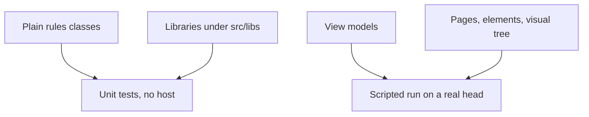

<sub>[CodeBrix](../../README.md) › [Build a CodeBrix.Platform application](README.md) › Testing your application</sub>

# Testing your application

**By the end of this chapter you will have a test project that matches the family conventions and is actually discovered, fixtures and doubles that keep the expensive work out of every test, headless graphics and golden-image comparison for the drawing code, and a scripted run that drives the whole application on a real head.** Every recipe below comes from the test projects of the reference applications, and names the file it came from.

One constraint organizes all of it. A view model derived from `SimpleViewModel` cannot be constructed outside a running application host, because its dispatcher needs one. So the answers move out of the view model into plain classes a test can reach, and the few parts that cannot move - the page, the player element, the visual tree - are covered by a scripted run instead. [05 - MVVM the right way](05-mvvm-the-right-way.md) is where those view models come from; this chapter is how you prove them.

## What a test project can reach

Three layers, three ways of covering them. The first two are ordinary unit tests in an ordinary test host. The third needs the application running.



| Layer | Where it lives | How you cover it |
| --- | --- | --- |
| Decisions and rules | Static classes of plain methods over plain values | Unit tests that construct nothing |
| Services, renderers, parsers, stores | Libraries under `src/libs` | Unit tests, with fixtures and doubles |
| View models | `.Core` | A scripted run that drives their commands |
| Pages, elements, layout | `.UI` and the heads | A scripted run on a real head |

Every decision goes in a static class of plain methods over plain values; the view model is a thin observable wrapper that calls them and raises change notifications. The view model keeps the wiring, the collections and the commands; the class keeps the answers. CodeBrixVideoTool states the reason in the rules class itself.

```csharp
// From CodeBrix.Samples/CodeBrixVideoTool/src/libs/CodeBrixVideoTool.Playback/Services/PlaybackSelection.cs
/// <remarks>
/// The rules live here rather than inside the view model because a view model derived from the
/// platform's SimpleViewModel cannot be constructed without a running application host, and rules
/// that cannot be tested are rules that quietly stop being true. The view model is a thin observable
/// wrapper over this.
/// </remarks>
public static class PlaybackSelection
{
    public static bool CanOpen(SourceMediaInfo item) =>
        item is not null && MediaFormats.IsPlayable(item.Format);

    public static string DescribeUnplayable(SourceMediaInfo item)
    {
        ArgumentNullException.ThrowIfNull(item);
        return $"{MediaFormats.DisplayName(item.Format)} is not played in this application - " +
               "import it to one of the four CodeBrix formats first.";
    }

    // ... BuildChapterRows, BuildCaptionRows, ShouldShowChapters, ShouldShowCaptions, DescribeOpened ...
}
```

Notice that nothing in the class knows about a view model, a page or a dispatcher: it takes values and returns values, so a test calls it directly. The view model then reads as wiring, and the branch a test cares about is one call.

```csharp
// From CodeBrix.Samples/CodeBrixVideoTool/src/libs/CodeBrixVideoTool.Playback/ViewModels/PlaybackViewModel.cs
public void Open(SourceMediaInfo item)
{
    Close();

    if (item is null)
    {
        return;
    }

    CurrentItem = item;

    if (!PlaybackSelection.CanOpen(item))
    {
        IsUnplayableFormat = true;
        StatusText = PlaybackSelection.DescribeUnplayable(item);
        return;
    }

    if (surface is null)
    {
        StatusText = "The player is not ready yet.";
        return;
    }

    StatusText = $"Opening {item.FileName}...";
    surface.Open(item.Path);
}
```

Notice that both the decision and the message the user sees come from the rules class, so a test that pins the message pins what the application says. The tests for it are in [PlaybackSelectionTests.cs](https://github.com/ellisnet/CodeBrix.Samples/blob/main/CodeBrixVideoTool/tests/libs/CodeBrixVideoTool.Playback.Tests/PlaybackSelectionTests.cs), and the same constraint appears in that application's own test project file as a comment - a good sign it is the real organizing principle rather than a convenience.

> [!TIP]
> When a rule is hard to reach from a test, that is the signal to move it, not the signal to write a bigger test. Rules that cannot be tested are rules that quietly stop being true.

## Setting up the test project

A `global.json` at the application root selects the runner for every project below it.

```json
{
    "test": {
        "runner": "Microsoft.Testing.Platform"
    }
}
```

Test projects build as executables and opt into the Microsoft Testing Platform runner. This is the shape every test project in the reference applications carries; package IDs are shown resolved here, and versions are left out so NuGet takes the latest.

```xml
<!-- Adapted from CodeBrix.Samples/PalmVisualizer/tests/libs/PalmVisualizer.Rendering.Tests/PalmVisualizer.Rendering.Tests.csproj
     (package versions elided - see the project's csproj) -->
<PropertyGroup>
  <TargetFramework>net10.0</TargetFramework>
  <!-- xUnit.net v3 test projects are self-executing binaries and
       must build as Exe; run via Microsoft.Testing.Platform,
       matching the CodeBrix family test convention. -->
  <OutputType>Exe</OutputType>
  <UseMicrosoftTestingPlatformRunner>true</UseMicrosoftTestingPlatformRunner>
  <TestingPlatformDotnetTestSupport>true</TestingPlatformDotnetTestSupport>
</PropertyGroup>

<ItemGroup>
  <ProjectReference Include="..\..\..\src\libs\PalmVisualizer.Rendering\PalmVisualizer.Rendering.csproj" />
</ItemGroup>

<ItemGroup>
  <PackageReference Include="xunit.v3" />
  <PackageReference Include="xunit.runner.visualstudio" />
  <PackageReference Include="Microsoft.NET.Test.Sdk" />
  <PackageReference Include="SilverAssertions.ApacheLicenseForever" />
</ItemGroup>
```

Notice the output type. xUnit v3 test projects are self-executing binaries, and a library test project will not run at all - the comment appears in every one of these projects for that reason. The project reference points up out of `tests/libs/` into `src/libs/`, which is the layout [04 - Project architecture](04-project-architecture.md) describes.

Test bodies follow the family style: a file named `<Class>Tests.cs`, snake_case method names, `//Arrange` / `//Act` / `//Assert` comments, and the assertion library's `Should()`.

```csharp
// From CodeBrix.Samples/PalmVisualizer/tests/libs/PalmVisualizer.Camera.Tests/WebcamCaptureServiceTests.cs
[Fact]
public void TryCopyLatestFrame_returns_false_before_any_frame()
{
    //Arrange
    using var service = new WebcamCaptureService();
    byte[] buffer = null;

    //Act
    bool copied = service.TryCopyLatestFrame(ref buffer, out int width, out int height);

    //Assert
    copied.Should().Be(false);
    width.Should().Be(0);
    height.Should().Be(0);
}
```

Notice that the test names the behavior in a sentence, and that the three comments make the shape of every test the same wherever you open one. Every async test passes `TestContext.Current.CancellationToken` to the method under test: it satisfies the analyzer that flags a missing token and makes the test cancellable, and a test that waits on a background thread passes it to the wait as well.

### Running the tests

`dotnet test` works from the solution or the test project folder. Because the runner is the Microsoft Testing Platform, `dotnet test` can report that it discovered no tests on some SDK builds; running the built test executable directly always works and is the fallback when a run reports nothing.

> [!WARNING]
> Do not pass `--nologo` to `dotnet test` in Microsoft Testing Platform mode. It is a VSTest-only switch; the SDK forwards it to the test application, which rejects it and exits before discovery, so the run reports "Zero tests ran" and nothing executes. The spelling to use is `dotnet test -- --no-banner`.

Without the `global.json` above, `dotnet test` fails immediately with "Testing with VSTest target is no longer supported by Microsoft.Testing.Platform on .NET 10 SDK and later." A few of the reference applications have no `global.json` at all and select the runner by project properties alone; adding the file matches the rest of the repository.

## Building against the real platform assemblies

The published CodeBrix.Platform package ships reference assemblies. An application head gets the real implementations swapped in automatically; a plain test project does not, and one project property is what asks for them.

```xml
<!-- From CodeBrix.Samples/Pinta.Brix/tests/libs/Pinta.Brix.Engine.Tests/Pinta.Brix.Engine.Tests.csproj -->
<!-- The published CodeBrix.Platform nuget ships REFERENCE assemblies in
     lib/; every method body throws NotSupportedException("Ref assembly").
     Application heads get the real implementations swapped in
     automatically, plain test projects do NOT. This is the lever that
     swaps them in, and without it every text-layout call would compile
     cleanly and then throw on first use. -->
<CodeBrixRuntimeIdentifier>skia</CodeBrixRuntimeIdentifier>
```

Notice what the failure looks like without it: the call compiles cleanly and throws on first use, which reads like a test bug rather than a build-configuration one. CodeBrixVideoTool's test project carries the same property with a note about what it does not fix.

```xml
<!-- From CodeBrix.Samples/CodeBrixVideoTool/tests/libs/CodeBrixVideoTool.Playback.Tests/CodeBrixVideoTool.Playback.Tests.csproj -->
<!-- ... Note that even
     with the real assemblies present a SimpleViewModel cannot be constructed here, because its
     dispatcher needs a running application host; the view models are exercised by the
     application's own scripted run instead, and the rules under them live in plain classes
     these tests can reach. -->
<CodeBrixRuntimeIdentifier>skia</CodeBrixRuntimeIdentifier>
```

> [!IMPORTANT]
> `CodeBrixRuntimeIdentifier` gives a test project the real platform implementations. It does not lift the view-model limit: a `SimpleViewModel` still needs a running application host. Put the rules in plain classes, and drive the view models from a scripted run.

### The native assets a head would have supplied

A library that binds to a native runtime - graphics, text shaping, computer vision - needs that native present when the tests exercise it for real. In a running application the head's runtime package lays it down; a bare test host gets nothing. The test project references the native package for the current operating system, with an MSBuild platform condition.

```xml
<!-- Adapted from CodeBrix.Samples/WebcamPainter/tests/libs/WebcamPainter.Vision.Tests/WebcamPainter.Vision.Tests.csproj
     (package versions elided - see the project's csproj) -->
<ItemGroup>
  <PackageReference Include="CodeBrix.VideoProcessing.OpenCV5.LinuxX64.ApacheLicenseForever"   Condition="$([MSBuild]::IsOSPlatform('Linux'))" />
  <PackageReference Include="CodeBrix.VideoProcessing.OpenCV5.WindowsX64.ApacheLicenseForever" Condition="$([MSBuild]::IsOSPlatform('Windows'))" />
  <PackageReference Include="CodeBrix.VideoProcessing.OpenCV5.MacOSArm64.ApacheLicenseForever" Condition="$([MSBuild]::IsOSPlatform('OSX'))" />
  <PackageReference Include="CodeBrix.VideoProcessing.OpenCV5.MacOSX64.ApacheLicenseForever"   Condition="$([MSBuild]::IsOSPlatform('OSX'))" />
</ItemGroup>
```

Notice that the tests here run real inference, so the native vision library has to be on disk; the list is exactly what your library touches. The same reasoning applies to rasterizing and to text layout, and Pinta.Brix's test project says so in its own words.

```xml
<!-- From CodeBrix.Samples/Pinta.Brix/tests/libs/Pinta.Brix.Engine.Tests/Pinta.Brix.Engine.Tests.csproj -->
<!-- The engine's SkiaSharp reference is managed-only; on Linux the native
     libSkiaSharp must be pulled in explicitly for the tests to run. -->
<!-- Text layout shapes with HarfBuzz, so its native library is needed here
     for the same reason libSkiaSharp is: an application head gets these
     from its runtime package, a bare test project does not. -->
```

The packages that supply those two on Linux are [`SkiaSharp.NativeAssets.Linux`](https://www.nuget.org/packages/SkiaSharp.NativeAssets.Linux) and [`HarfBuzzSharp.NativeAssets.Linux`](https://www.nuget.org/packages/HarfBuzzSharp.NativeAssets.Linux); use the matching `.Win32` and `.macOS` packages on the other operating systems. Two more things follow from the platform condition: it only brings in the host architecture's package, so a build machine on another architecture needs its own reference added; and shader tests earn the reference on their own, because compiling and evaluating real shader source on raster surfaces needs the native library present with no engine, no window and no GPU.

### Exposing library internals to the tests

Every library with tests carries one file naming its test project, so implementation types can be covered without widening the public surface.

```csharp
// From CodeBrix.Samples/PalmVisualizer/src/libs/PalmVisualizer.Vision/InternalsVisibleTo.cs
using System.Runtime.CompilerServices;

[assembly: InternalsVisibleTo("PalmVisualizer.Vision.Tests")]
```

The convention is applied uniformly - even a library whose tests only touch public members carries the file. When a test needs a value that is otherwise private, add a documented internal accessor rather than making the field itself visible.

```csharp
// From CodeBrix.Samples/PalmVisualizer/src/libs/PalmVisualizer.Vision/Internal/PalmDetector.cs
/// <summary>Exposed for unit tests: the anchor grid's X centers.</summary>
internal static float[] TestAnchorsX => AnchorsX;

/// <summary>Exposed for unit tests: the anchor grid's Y centers.</summary>
internal static float[] TestAnchorsY => AnchorsY;
```

Notice the second use of the same attribute: factoring one step of an expensive operation into an internal static method - compiling a shader, loading an embedded model - is what lets a test call that step with nothing else running.

## Assertions

[`SilverAssertions.ApacheLicenseForever`](https://www.nuget.org/packages/SilverAssertions.ApacheLicenseForever) is the assertion library the family style uses. It brings no runner of its own: it detects the test framework at the first failure and throws that framework's own assertion exception, so a failing assertion is reported as an ordinary test failure.

```bash
dotnet add package SilverAssertions.ApacheLicenseForever
```

One using covers the overwhelming majority of assertions.

```csharp
using SilverAssertions;
```

`Should()` wraps the subject in an assertion class chosen by the subject's compile-time type, and the vocabulary chains from there.

```csharp
using SilverAssertions;
using Xunit;

public class UserServiceTests
{
    [Fact]
    public void GetUser_returns_the_expected_user()
    {
        // Arrange
        var service = new UserService();

        // Act
        var user = service.GetUser(1);

        // Assert
        user.Should().NotBeNull();
        user.Name.Should().Be("Alice");
        user.Age.Should().BeGreaterThan(0).And.BeLessThan(150);
        user.Email.Should().Contain("@").And.EndWith(".com");
        user.Roles.Should().NotBeEmpty().And.Contain("admin");
    }
}
```

Notice that each assertion names one fact, and that `.And` keeps a second fact about the same subject in the same statement. Prefer the specific assertion to the generic one - `BePositive()` over `BeGreaterThan(0)`, `BeEmpty()` over `HaveCount(0)`, `ContainSingle(p)` over filtering and counting - because it costs the same and produces a better failure message.

### Exceptions and async

A delegate subject gets the exception assertions, and the caught exception is refined in the same chain.

```csharp
using System;
using SilverAssertions;
using Xunit;

public class UserServiceExceptionTests
{
    [Fact]
    public void GetUser_with_an_invalid_id_throws()
    {
        var service = new UserService();

        Action act = () => service.GetUser(-1);

        act.Should().Throw<ArgumentException>()
            .WithMessage("*invalid*")
            .WithParameterName("id")
            .And.ParamName.Should().Be("id");
    }
}
```

Notice the wildcard in `WithMessage`: `*` matches zero or more characters and `?` exactly one, so the assertion survives a reworded message. `Throw<T>` unwraps an `AggregateException` and matches against the inner exceptions; `ThrowExactly<T>` does not, so a Task-based API that wraps its failure will report the wrapper.

The async forms are separate members, and every one of them returns a `Task`.

```csharp
[Fact]
public async Task LoadAsync_rejects_a_negative_id()
{
    var service = new UserService();

    Func<Task> act = () => service.LoadAsync(-1);

    await act.Should().ThrowAsync<ArgumentOutOfRangeException>()
        .WithParameterName("id");
}

[Fact]
public async Task GetUsersAsync_completes_quickly_and_is_sorted()
{
    var service = new UserService();

    Func<Task<IReadOnlyList<User>>> act = () => service.GetUsersAsync();

    var users = (await act.Should()
        .CompleteWithinAsync(TimeSpan.FromSeconds(2))).Which;

    users.Should().HaveCountGreaterThan(0);
    users.Should().OnlyContain(u => u.IsActive);
    users.Should().BeInAscendingOrder(u => u.Name);
}
```

Notice the `await` in front of each. Forgetting it silently passes the test: `ThrowAsync`, `NotThrowAsync`, `CompleteWithinAsync`, `NotCompleteWithinAsync`, `ThrowWithinAsync`, `ThrowExactlyAsync`, `NotThrowAfterAsync` and the awaitable `WithMessage` / `WithParameterName` / `WithResult` all return a `Task` that must be awaited. A `Func<Task>` subject offers the async members only - `Throw<T>` and `NotThrow` exist on `Action` and `Func<T>`.

### Comparing whole objects

`BeEquivalentTo` walks the object graph member by member, driven by the expectation: every member of the expectation must have an equivalent on the subject, and members that exist only on the subject are ignored. That is why an anonymous type makes a good partial expectation.

```csharp
[Fact]
public void CreateOrder_returns_the_expected_order()
{
    var service = new OrderService();

    var order = service.CreateOrder(userId: 1, productId: 42,
                                    quantity: 3);

    // The anonymous expectation names only the members that matter,
    // so Id and CreatedAt are simply not compared.
    order.Should().BeEquivalentTo(new
    {
        UserId = 1,
        ProductId = 42,
        Quantity = 3,
        Status = OrderStatus.Pending
    });
}

[Fact]
public void CreateOrder_matches_the_prototype_except_for_identity()
{
    var service = new OrderService();
    var expected = OrderPrototype.Pending(userId: 1, productId: 42);

    var order = service.CreateOrder(userId: 1, productId: 42,
                                    quantity: 3);

    // Here the expectation IS an Order, so Excluding can name its
    // members - and every other member is compared, including
    // nested Customer and the Lines collection.
    order.Should().BeEquivalentTo(expected, options => options
        .Excluding(o => o.Id)
        .Excluding(o => o.CreatedAt)
        .WithStrictOrderingFor(o => o.Lines)
        .ComparingByMembers<Money>());
}
```

Notice that the options lambda is typed on the expectation: with an anonymous expectation, `Excluding(o => o.Id)` does not compile unless the anonymous object itself has an `Id`. Two more defaults are worth knowing: collections are compared without regard to order unless you ask for `WithStrictOrdering()`, and `BeEquivalentTo` is the most expensive assertion in the library, so keep it for graphs and use `Be` for a single value.

### Reporting every failure in one run

An `AssertionScope` batches failures: every assertion inside the scope runs, and all of them are reported together when the scope is disposed.

```csharp
using System;
using SilverAssertions;
using SilverAssertions.Execution;
using Xunit;

public class ProcessingTests
{
    [Fact]
    public void All_processed_items_are_valid()
    {
        var items = Pipeline.GetProcessedItems();

        using (new AssertionScope("the processed items"))
        {
            items.Should().NotBeEmpty();
            items.Should().OnlyHaveUniqueItems(i => i.Id);
            items.Should().AllSatisfy(item =>
            {
                item.Name.Should().NotBeNullOrWhiteSpace();
                item.Price.Should().BePositive();
                item.CreatedAt.Should().BeBefore(DateTime.UtcNow);
            });
        }
        // every violated rule is reported, not just the first
    }
}
```

Notice the context string: it changes the failure messages to read "Expected the processed items ...", which is what makes a batch of failures readable. `AssertionScope` lives in `SilverAssertions.Execution`, not the root namespace - the same is true of `Formatter` (`.Formatting`), `AllTypes` and `TypeSelector` (`.Types`) and the `5.Seconds()` helpers (`.Extensions`). Do not wrap a single assertion in a scope; it allocates and collects for nothing.

### Assertion sharp edges worth knowing early

- `BeCloseTo` and `BeApproximately` are not interchangeable. `BeCloseTo` exists only for the integral numeric types and takes an unsigned delta (`42.Should().BeCloseTo(45, 5u)`); for `float`, `double` and `decimal` use `BeApproximately(expected, precision)`. `DateTime`, `DateTimeOffset`, `TimeSpan` and `TimeOnly` have their own `BeCloseTo`, taking a `TimeSpan` precision.
- Calling `.Should()` on something that is already an assertion object is a compile error, with the message "You are asserting the 'AndConstraint' itself".
- `AssertionOptions` and `Formatter` changes are global and persist for the whole test run; reset them in teardown or tests will influence each other, especially in parallel.
- Mark a helper method that wraps assertions with `[CustomAssertion]`, or the failure message names your helper's local variable instead of the subject under test.
- Dispose an event monitor - `using var monitor = subject.Monitor();` - because it subscribes to every event on the subject until disposed.
- An `async void` method cannot be asserted as an `Action`; assign it to a `Func<Task>` and use the async assertions.

The full vocabulary - strings, numerics, dates, collections, dictionaries, types and members, events, streams, XML, HTTP responses and the extensibility points - is on the [SilverAssertions](../libraries/SilverAssertions.md) library page.

## Test doubles

[`CodeBrix.TestMocks.ApacheLicenseForever`](https://www.nuget.org/packages/CodeBrix.TestMocks.ApacheLicenseForever) supplies the mocks, the auto-generated test data and the xUnit v3 data attributes from one package reference. It provides no assertions - pair it with SilverAssertions, as the reference applications do.

```bash
dotnet add package CodeBrix.TestMocks.ApacheLicenseForever
```

Every public namespace begins with `CodeBrix.TestMocks`.

```csharp
// Basic mocking:
using CodeBrix.TestMocks.Mocking;

// Mocking with hand-built fixtures:
using CodeBrix.TestMocks.AutoFixture;
using CodeBrix.TestMocks.AutoFixture.AutoMock;
using CodeBrix.TestMocks.Mocking;

// Data-driven tests with auto-mocking:
using CodeBrix.TestMocks.AutoFixture.AutoMock.Data;
using CodeBrix.TestMocks.AutoFixture.Xunit3;
using CodeBrix.TestMocks.Mocking;
```

The basic shape is a mock, a setup, the object handed to the system under test, and a verification.

```csharp
using CodeBrix.TestMocks.Mocking;
using Xunit;

public interface IOrderRepository
{
    Order GetById(int id);
    void Save(Order order);
    void Delete(int id);
}

public class OrderProcessorTests
{
    [Fact]
    public void Process_saves_the_order()
    {
        //Arrange
        var mockRepo = new Mock<IOrderRepository>();
        var order = new Order { Id = 42, CustomerName = "Alice",
                                Total = 99.95m };
        mockRepo.Setup(r => r.GetById(42)).Returns(order);
        var processor = new OrderProcessor(mockRepo.Object);

        //Act
        processor.Process(42);

        //Assert
        mockRepo.Verify(r => r.Save(It.Is<Order>(o => o.Id == 42)),
                        Times.Once());
        mockRepo.Verify(r => r.Delete(It.IsAny<int>()), Times.Never());
    }
}
```

Notice `mock.Object` - the mock itself is the control surface, and the object is what the system under test receives. Match precisely where you can: `It.Is<T>(x => x.Id == 42)` fails at the point of the wrong call, while `It.IsAny<T>()` lets a wrong call through and fails later somewhere less informative. Keep `MockBehavior.Loose`, the default, unless "nothing else may be called" is the actual assertion; `VerifyNoOtherCalls()` at the end of a loose test says the same thing without breaking on every unrelated change.

### Mocking a rendering or API seam

This is the payoff for putting an interface in front of a concrete loader or renderer: the flow test needs neither a GPU nor a file on disk.

```csharp
// From CodeBrix.Samples/PolyHavenBrowser/tests/libs/PolyHavenBrowser.Rendering.Tests/Mocked/MockedRenderingTests.cs
[Fact]
public void viewer_flow_loads_then_hands_the_model_to_the_renderer()
{
    //Arrange - the typical app flow: load a model, give it to the scene renderer
    var model = TestAssets.BuildTriangleModel();
    var loaderMock = new Mock<IModelLoader>(MockBehavior.Strict);
    loaderMock.Setup(l => l.LoadFile("model.glb")).Returns(model);

    var rendererMock = new Mock<IModelSceneRenderer>(MockBehavior.Strict);
    rendererMock.Setup(r => r.SetModel(model, true));

    //Act
    var loaded = loaderMock.Object.LoadFile("model.glb");
    rendererMock.Object.SetModel(loaded, frameCamera: true);

    //Assert
    loaderMock.VerifyAll();
    rendererMock.VerifyAll();
    rendererMock.VerifyNoOtherCalls();
}
```

Notice that strict behavior is the right choice here, because the point of the test is that this flow makes these calls and no others. A mocked renderer can still hand out a real camera object, which is how pointer-input wiring gets covered with no GPU at all - and the loader interface exists in the production library specifically so the loading technology can be swapped or mocked. Those interfaces come from [09 - Graphics, media and vision](09-graphics-media-and-vision.md); the mocked flow tests are in [MockedRenderingTests.cs](https://github.com/ellisnet/CodeBrix.Samples/blob/main/PolyHavenBrowser/tests/libs/PolyHavenBrowser.Rendering.Tests/Mocked/MockedRenderingTests.cs).

### Letting the theory build everything

`[AutoMockData]` is `[AutoData]` with a fixture already customized to satisfy every abstraction with a mock, so a theory's parameters arrive built and the test body is the test.

```csharp
using CodeBrix.TestMocks.AutoFixture.AutoMock.Data;
using CodeBrix.TestMocks.AutoFixture.Xunit3;
using CodeBrix.TestMocks.Mocking;
using Xunit;

[Theory, AutoMockData]
public void Process_saves_and_notifies(
    [Frozen] Mock<IOrderRepository> mockRepo,
    [Frozen] Mock<IEmailService> mockEmail,
    Order order,
    OrderProcessor sut)
{
    //Arrange
    mockRepo.Setup(r => r.GetById(order.Id)).Returns(order);

    //Act
    sut.Process(order.Id);

    //Assert
    mockRepo.Verify(r => r.Save(order), Times.Once());
    mockEmail.Verify(e => e.SendConfirmation(order.CustomerName),
                     Times.Once());
}
```

Notice `[Frozen]` on the two mocks. Without it, the mock you configure and the mock the system under test received are different instances, and the verification fails for no visible reason - it is the single most common cause of "Verify says the call never happened". The same idea by hand is `fixture.Freeze<Mock<IOrderRepository>>()`, which creates one specimen and injects it for every later request of that type.

> [!TIP]
> Freeze anything you will configure or verify, and let the fixture create everything else. Do not assert on the content of generated values - anonymous data is arbitrary strings and numbers, so assert on relationships instead: the value that went in came out.

### An offline HTTP client

An API client is almost entirely testable with no network, including the exact URLs it builds, when the library takes a message handler.

```csharp
// From CodeBrix.Samples/PolyHavenBrowser/tests/libs/PolyHavenBrowser.PolyHavenApiClient.Tests/TestDoubles/TestClient.cs
internal static class TestClient
{
    public static (IPolyHavenApiClient Client, StubHttpMessageHandler Stub) Create(
        PolyHavenClientOptions options = null)
    {
        var stub = new StubHttpMessageHandler();
        var factory = new DefaultPolyHavenClientFactory(stub, options);
        return (factory.GetClient(), stub);
    }
}
```

```csharp
// From CodeBrix.Samples/PolyHavenBrowser/tests/libs/PolyHavenBrowser.PolyHavenApiClient.Tests/TestDoubles/StubHttpMessageHandler.cs
/// <summary>Serves <paramref name="json"/> for requests whose path-and-query matches exactly.</summary>
public void OnPath(string pathAndQuery, string json, HttpStatusCode statusCode = HttpStatusCode.OK) =>
    _routes.Add((
        request => request.RequestUri!.PathAndQuery == pathAndQuery,
        _ => new HttpResponseMessage(statusCode)
        {
            Content = new StringContent(json, Encoding.UTF8, "application/json"),
        }));
```

Notice that the stub matches on the path and query, which is what turns "did it build the right query string?" into a one-line assertion, and that the routes are data rather than code. Design the library so a test can hand it a handler: an internal constructor taking a message handler, reachable through the internals attribute, that never disposes what it was given. Return a not-found response naming the URL for anything unrouted, so a missing route reads as a missing route rather than as a client bug.

The rest of the mocking vocabulary - sequences, conditional setups, protected members, argument capture, events, the proxy generator used directly - is on the [CodeBrix.TestMocks](../libraries/CodeBrix.TestMocks.md) library page.

### A clock the test moves

Code that waits is testable when the waiting goes through a seam. Take a `TimeProvider` in the constructor, default it to `TimeProvider.System`, and read the current time and start every delay through it. A test then supplies a fake whose `Advance` fires the timers that have come due and completes the tasks awaiting them, with no real time passing, so a wait for a rate limit to reset an hour from now is exercised in a millisecond and the assertion is on what the code did rather than on how long the run took. Build the fake on `TimeProvider.CreateTimer` rather than on a bespoke delay abstraction, so production code keeps calling the framework type. A throttle that reads its allowance out of the response headers of the last call is the case that makes the seam pay for itself, and it is written out in [Throttle from the rate limit headers an API sends back](https://github.com/ellisnet/CodeBrix.Samples/blob/main/BLUEPRINTS-DocumentsAndData.md#throttle-from-the-rate-limit-headers-an-api-sends-back).

## Fixtures

### Resolve the service the way the container does

A reusable fixture base builds a small service collection, exposes a typed resolve method, and offers one registration hook. The test project subclasses it once and registers what its tests need.

```csharp
// From CodeBrix.Samples/JustBetweenUs/tests/JustBetweenUs.Encryption.Tests/EncryptionTestingFixture.cs
public class EncryptionTestingFixture : SimpleTestFixture
{
    protected override void RegisterCustomServices(
        IServiceCollection services,
        IHostEnvironment environment,
        IConfiguration config,
        Func<IServiceProvider> serviceResolver)
    {
        //Register my custom testing services here
        services.AddSingleton<IEncryptionService>(_ =>
            new EncryptionService(serviceResolver().GetService<ILogger<EncryptionService>>()));
    }
}
```

Test classes then take the fixture as a class fixture and resolve through it, so the service under test is constructed exactly the way the application constructs it.

```csharp
// From CodeBrix.Samples/JustBetweenUs/tests/JustBetweenUs.Encryption.Tests/Services/EncryptionServiceTests.cs
public class EncryptionServiceTests : IClassFixture<EncryptionTestingFixture>
{
    private readonly EncryptionTestingFixture _fixture;
    private readonly ITestOutputHelper _output;

    private IEncryptionService GetService() => _fixture.GetService<IEncryptionService>() as EncryptionService;

    public EncryptionServiceTests(EncryptionTestingFixture fixture,
        ITestOutputHelper output)
    {
        _fixture = fixture ?? throw new ArgumentNullException(nameof(fixture));
        _output = new SimpleTestOutputHelper(output);

        fixture.CreateAndRegisterLogger<EncryptionService>(_output);
    }

    [Fact]
    public void can_get_service() => GetService().Should().NotBeNull();

    [Fact]
    public async Task GetDefaultKey_retrieves_key() =>
        (await GetService().GetDefaultKey()).Should().NotBeNullOrEmpty();
}
```

Notice that resolving a type that was never registered throws rather than returning null, so a missing registration fails the test with a readable message. The fixture is one file linked into the test project rather than a package, and it is feature-gated by compilation constants - define them, or build in the configuration that defines them, because the test classes use the gated types unconditionally.

```xml
<!-- From CodeBrix.Samples/JustBetweenUs/tests/JustBetweenUs.Encryption.Tests/JustBetweenUs.Encryption.Tests.csproj -->
<PropertyGroup Condition="'$(Configuration)|$(Platform)'=='Debug|AnyCPU'">
  <DefineConstants>$(DefineConstants);SIMPLE_OUTPUT_LOGGING</DefineConstants>
</PropertyGroup>
<ItemGroup>
  <Compile Include="..\..\Shared\Testing\SimpleTestFixture.cs" Link="SimpleTestFixture.cs" />
</ItemGroup>
```

### Routing log lines into the test report

The fixture holds a logger factory that wraps the test framework's output helper; the test class registers a logger for the type it is testing in its constructor, and the container hands that logger out whenever one is asked for.

```csharp
// From CodeBrix.Samples/JustBetweenUs/tests/JustBetweenUs.Encryption.Tests/Services/EncryptionServiceTests.cs
_output = new SimpleTestOutputHelper(output);
fixture.CreateAndRegisterLogger<EncryptionService>(_output);
```

Two platform facts are baked into the wrapper, and both are worth copying into any equivalent of your own.

```csharp
// From CodeBrix.Samples/JustBetweenUs/Shared/Testing/SimpleTestFixture.cs
private void WriteText(string text, bool withEndOfLine = false)
{
    if (text != null)
    {
        // ...
        if (AlwaysWriteToConsole
            || (_wrappedOutput == null)
            || (RuntimeInformation.IsOSPlatform(OSPlatform.Linux))) //Need to write test output to console on Linux
        {
            if (withEndOfLine) { Console.WriteLine(text); }
            else { Console.Write(text); }
        }
        else
        {
            try
            {
                //Note: writing to ITestOutputHelper can fail if the test has already completed
                if (withEndOfLine) { _wrappedOutput.WriteLine(text); }
                else { _wrappedOutput.Write(text); }
            }
            catch (Exception)
            {
                if (withEndOfLine) { Console.WriteLine(text); }
                else { Console.Write(text); }
            }
        }
    }
}
```

Notice the two fallbacks: the test output helper does not reliably reach the console on Linux, and writing to it after a test has completed throws. Diagnostic output is also how a probe-style test earns its place - writing environment strings through the output helper lets an environment-specific failure be pinned before anyone edits platform code.

### One expensive fixture, shared by everything that needs it

Setup that does real work - generating media, running imports, probing the results - belongs in an async-lifetime fixture plus a collection definition, so it runs once for the whole collection rather than once per test class.

```csharp
// From CodeBrix.Samples/CodeBrixVideoTool/tests/libs/CodeBrixVideoTool.Processing.Tests/SampleMediaFixture.cs
public sealed class SampleMediaFixture : IAsyncLifetime
{
    public string Root { get; } = Path.Combine(
        Path.GetTempPath(), "CodeBrixVideoTool.Tests", Guid.NewGuid().ToString("N"));

    // ... Mp4Path, CaptionsPath, ChaptersPath, RichMp4Path, Mode2Path, Mode1Path ...

    public async ValueTask InitializeAsync()
    {
        Directory.CreateDirectory(Root);

        await SampleClipFactory.WriteMp4Async(Mp4Path, Width, Height, Duration).ConfigureAwait(false);
        SampleClipFactory.WriteWebVtt(CaptionsPath, Duration);
        SampleClipFactory.WriteChapterMetadata(ChaptersPath, Duration);

        // ... mux the three into RichMp4Path ...

        var probe = new MediaProbe();
        var runner = new ConversionRunner();

        RichMp4Info = await probe.ProbeAsync(RichMp4Path, CancellationToken.None).ConfigureAwait(false);

        await ImportAsync(probe, runner, MediaFormatKind.CodeBrixMode2, Mode2Path).ConfigureAwait(false);
        await ImportAsync(probe, runner, MediaFormatKind.CodeBrixMode1, Mode1Path).ConfigureAwait(false);

        Mode2Info = await probe.ProbeAsync(Mode2Path, CancellationToken.None).ConfigureAwait(false);
        Mode1Info = await probe.ProbeAsync(Mode1Path, CancellationToken.None).ConfigureAwait(false);
    }

    public ValueTask DisposeAsync()
    {
        try
        {
            if (Directory.Exists(Root)) { Directory.Delete(Root, true); }
        }
        catch (IOException)
        {
            //A temporary folder that will not delete is not worth failing a test run over.
        }

        return ValueTask.CompletedTask;
    }
}

/// <summary>Shares one <see cref="SampleMediaFixture" /> across every test class that needs media.</summary>
[CollectionDefinition(Name)]
public sealed class SampleMediaCollection : ICollectionFixture<SampleMediaFixture>
{
    public const string Name = "sample media";
}
```

Notice three things. The fixture's own setup goes through the production code path, so a break in the pipeline fails setup loudly rather than one test obscurely. Everything is written under one uniquely named temporary folder and deleted on disposal, swallowing a delete failure. And the collection name is a constant on the definition class, so the attribute on each test class cannot be misspelled.

```csharp
// From CodeBrix.Samples/CodeBrixVideoTool/tests/libs/CodeBrixVideoTool.Processing.Tests/ConversionRunnerTests.cs
[Collection(SampleMediaCollection.Name)]
public class ConversionRunnerTests
{
    private readonly SampleMediaFixture media;

    public ConversionRunnerTests(SampleMediaFixture media) => this.media = media;

    [Theory]
    [InlineData(MediaFormatKind.Matroska)]
    [InlineData(MediaFormatKind.WebM)]
    [InlineData(MediaFormatKind.CodeBrixMode1)]
    [InlineData(MediaFormatKind.CodeBrixMode2)]
    public async Task an_import_writes_every_one_of_the_four_formats(MediaFormatKind destination)
    {
        //Arrange
        var output = Path.Combine(media.Root, "import-" + destination + MediaFormats.Extension(destination));
        var plan = ConversionPlanner.Create(media.RichMp4Info, destination, output, null);

        //Act
        var outcome = await new ConversionRunner()
            .RunAsync(plan, null, TestContext.Current.CancellationToken);

        //Assert
        outcome.Succeeded.Should().BeTrue(outcome.Failure ?? "");
        File.Exists(output).Should().BeTrue();
        outcome.SizeInBytes.Should().BeGreaterThan(0);
    }
}
```

Notice the theory: one test body covers four destinations, and the failure message passed to `BeTrue` carries the runner's own explanation into the report. The fixture and the collection definition live together in [SampleMediaFixture.cs](https://github.com/ellisnet/CodeBrix.Samples/blob/main/CodeBrixVideoTool/tests/libs/CodeBrixVideoTool.Processing.Tests/SampleMediaFixture.cs).

### Isolating a process-global store

Production code that initializes a singleton store at startup needs that store pointed somewhere harmless before any test runs. A module initializer in the test assembly is what guarantees it happens before a static constructor in the library under test - a fixture would be too late.

```csharp
// From CodeBrix.Samples/Pinta.Brix/tests/libs/Pinta.Brix.Engine.Tests/TestSettingsStore.cs
// PintaCore's static constructor builds the palette manager, which reads
// settings, so touching PintaCore at all requires an open settings store.
// SettingsService is a process-global singleton, so it is pointed at a
// throwaway folder once per test assembly - never at the user's real
// ~/.config/Pinta.Brix/settings, which tests must never read or write.

internal static class TestSettingsStore
{
    [ModuleInitializer]
    internal static void Initialize ()
    {
        if (SettingsService.IsInitialized)
            return;

        SettingsService.Initialize (Path.Combine (
            Path.GetTempPath (),
            "PintaBrix.Engine.Tests_" + Guid.NewGuid ().ToString ("N")));
    }
}
```

Notice the guard on the store's own initialized flag, and that each test assembly carries its own copy of [TestSettingsStore.cs](https://github.com/ellisnet/CodeBrix.Samples/blob/main/Pinta.Brix/tests/libs/Pinta.Brix.Engine.Tests/TestSettingsStore.cs) - two of them in one process would otherwise race on the guard. Tests of the store itself take the opposite approach: a fresh directory per test, deleted on disposal.

```csharp
// From CodeBrix.Samples/KenneyAssetBrowser/tests/libs/KenneyAssetBrowser.Settings.Tests/SettingsStoreTests.cs
// These tests exercise the CodeBrix.Platform.AppSettings store that the
// KenneyAssetBrowser.Settings facade wraps. The add-in's store has no public test
// clock, so assertions about timestamped file names match on the naming
// pattern rather than exact names.
public class SettingsStoreTests : IDisposable
{
    public SettingsStoreTests()
    {
        root = Path.Combine(Path.GetTempPath(), "kenney-asset-browser-tests", Path.GetRandomFileName());
        directory = Path.Combine(root, "settings");
        // ...
    }

    public void Dispose()
    {
        try { Directory.Delete(root, recursive: true); } catch { /* best effort */ }
    }

    AppSettingsStore CreateStore() => new AppSettingsStore(SettingsService.AppName, directory);

    // The auto-backup files whose names carry a parseable timestamp,
    // alphabetical (= chronological, the naming scheme's guarantee).
    string[] AutoBackupFiles() =>
        Directory.EnumerateFiles(directory, $"{AppSettingsStore.AutoBackupFilePrefix}*.sqlite")
            .Select(Path.GetFileName)
            .Where(HasParseableTimestamp)
            .OrderBy(name => name)
            .ToArray();
}
```

Notice that the assertions use the store's own public constants for file names, backup prefixes and timestamp formats, so they test the real naming scheme rather than a copy of it. The corruption tests in that file write junk over the store's file and assert that it is quarantined and restored from the newest backup - a path that exists because the [AppSettings add-in](add-ins/AppSettings.md) provides it.

## Inputs your tests build for themselves

When you are testing a reader, a decoder or a renderer, you do not want binary fixtures in the repository. A small internal builder in the test project writes exactly the input each test needs, in memory or into a throwaway folder.

```csharp
// From CodeBrix.Samples/KenneyAssetBrowser/tests/libs/KenneyAssetBrowser.Rendering.Tests/TestData/TestAssets.cs
/// <summary>Builders for tiny in-memory test assets (no files on disk, no network).</summary>
internal static class TestAssets
{
    /// <summary>Encodes an SKBitmap-drawn solid-color PNG.</summary>
    public static byte[] BuildPng(int width, int height, SKColor color)
    {
        using var bitmap = new SKBitmap(new SKImageInfo(width, height, SKColorType.Rgba8888, SKAlphaType.Unpremul));
        bitmap.Erase(color);
        using var image = SKImage.FromBitmap(bitmap);
        using var encoded = image.Encode(SKEncodedImageFormat.Png, 100);
        return encoded.ToArray();
    }

    /// <summary>
    /// Builds a single-triangle .glb: vertices (0,0,0), (1,0,0),
    /// (0,1,0) with a red, double-sided material, optionally translated.
    /// </summary>
    public static byte[] BuildTriangleGlb(Vector3? translation = null) { /* ... */ }
}
```

Notice that a fake image is a real decodable image. A placeholder byte array throws when the imaging back-end decodes eagerly, so build the real thing - it is a handful of lines.

An archive is the same idea, one level up.

```csharp
// From CodeBrix.Samples/KenneyAssetBrowser/tests/libs/KenneyAssetBrowser.AssetRead.Tests/TestZipBuilder.cs
internal static class TestZipBuilder
{
    public static void Build(string zipPath, IReadOnlyDictionary<string, byte[]> entries)
    {
        Directory.CreateDirectory(Path.GetDirectoryName(zipPath)!);
        using var fileStream = File.Create(zipPath);
        using var zipStream = new ZipOutputStream(fileStream);
        foreach (var (entryPath, bytes) in entries)
        {
            zipStream.PutNextEntry(new ZipEntry(entryPath) { Size = bytes.Length });
            zipStream.Write(bytes, 0, bytes.Length);
            zipStream.CloseEntry();
        }

        zipStream.Finish();
    }

    /// <summary>Encodes text as UTF-8 bytes for an entry.</summary>
    public static byte[] Text(string text) => Encoding.UTF8.GetBytes(text);
}
```

Notice that the builder takes a dictionary of entries, so a test that needs a deliberately corrupt input writes one - which is how a warning path gets tested, and the point of a warning list is that one bad file does not fail the whole load. A test project that builds an archive needs [CodeBrix.Compression](../libraries/CodeBrix.Compression.md)'s writing side referenced explicitly, even when the library under test only reads.

Documents work the same way, with two details that pay off in the assertions. The builder here writes a real file with [CodeBrix.PdfDocuments](../libraries/CodeBrix.PdfDocuments.md).

```csharp
// From CodeBrix.Samples/PdfSideBySide/tests/libs/PdfSideBySide.PdfRender.Tests/Helpers/TestPdfs.cs
/// <summary>A fresh, empty temp folder for one test's files.</summary>
public static string CreateTempFolder()
{
    var folder = Path.Combine(Path.GetTempPath(), "PdfSideBySide.PdfRender.Tests", Guid.NewGuid().ToString("N"));
    Directory.CreateDirectory(folder);
    return folder;
}

/// <summary>
/// Writes a PDF with pageCount pages to folder as fileName; every page carries a
/// filled rectangle placed by page number so the pages are not blank.
/// </summary>
public static string WriteSamplePdf(string folder, string fileName, int pageCount)
{
    using var document = new PdfDocument();
    for (var i = 0; i < pageCount; i++)
    {
        var page = document.AddPage();
        using var graphics = XGraphics.FromPdfPage(page);
        graphics.DrawRectangle(XBrushes.Black, new XRect(50, 50 + i * 20, 200, 30));
    }

    var path = Path.Combine(folder, fileName);
    document.Save(path);
    return path;
}
```

Notice that the rectangle is placed by the page index: a synthetic document has to differ page by page, or "different pages render to different images" is not testable. Give every test that writes files its own uniquely named folder, so tests using the same file name cannot collide and can run in parallel, and choose whole-inch page dimensions when you want the renderer tests to assert exact pixel sizes rather than a tolerance.

### Generating real media

When the inputs have to be real media, a factory in the production library - not the test project - writes clips from synthetic sources into a folder the caller names, so the scripted run can use it too.

```csharp
// From CodeBrix.Samples/CodeBrixVideoTool/src/libs/CodeBrixVideoTool.Processing/Samples/SampleClipFactory.cs
var filterGraph = string.Create(CultureInfo.InvariantCulture,
    $"testsrc2=size={width}x{height}:rate={frameRate}[out0]; sine=frequency=440:sample_rate=48000[out1]");

Directory.CreateDirectory(Path.GetDirectoryName(Path.GetFullPath(path)));

var errors = new List<string>();
var succeeded = await FFMpegArguments
    .FromFileInput(filterGraph, false, input => input.ForceFormat("lavfi"))
    .OutputToFile(path, true, options => options
        .WithDuration(length)
        .WithVideoCodec("libx264")
        .WithConstantRateFactor(28)
        .WithSpeedPreset(Speed.UltraFast)
        .ForcePixelFormat("yuv420p")
        .WithAudioCodec("aac")
        .WithAudioBitrate(96)
        .ForceFormat("mp4"))
    .NotifyOnError(errors.Add)
    .CancellableThrough(cancellationToken)
    .ProcessAsynchronously(false)
    .ConfigureAwait(false);
```

Notice the second argument to `FromFileInput`: existence checking is turned off and the format is forced, because a filter graph is not a file. The interesting case is built in two passes - a plain clip, then a mux that adds a caption track and a chapter metadata file, copying the media rather than re-encoding it. The discipline the class states is worth keeping: nothing is copied from anywhere and nothing is left behind, because every clip is written where the caller asks. [CodeBrix.VideoProcessing](../libraries/CodeBrix.VideoProcessing.md) is the library behind the builder.

### The one input that has to be a real file

Sometimes an input really has to be a file a real tool produced. Either copy it beside the test binary, or embed it in the test assembly.

```xml
<!-- From CodeBrix.Samples/PdfSideBySide/tests/libs/PdfSideBySide.PdfRender.Tests/PdfSideBySide.PdfRender.Tests.csproj -->
<!-- Real-world PDF the tests open and render (a WikipediaPublisher sample) -->
<ItemGroup>
  <None Include="assets\**" CopyToOutputDirectory="PreserveNewest" />
</ItemGroup>
```

```csharp
// From CodeBrix.Samples/PdfSideBySide/tests/libs/PdfSideBySide.PdfRender.Tests/Helpers/TestPdfs.cs
/// <summary>Full path of the assets/Inanna.pdf sample copied beside the test binary.</summary>
public static string InannaPath => Path.Combine(AppContext.BaseDirectory, "assets", "Inanna.pdf");
```

A copied fixture needs both halves - the copy item in the project file and the base-directory lookup in the test - and either one alone fails at run time. The embedded form needs the same pair, expressed differently.

```xml
<!-- From CodeBrix.Samples/WikipediaPublisher/Tests/WikipediaPublisher.RenderArticle.Tests/WikipediaPublisher.RenderArticle.Tests.csproj -->
<ItemGroup>
  <Compile Include="..\..\Shared\Helpers\EmbeddedResourceHelper.cs" Link="Helpers\EmbeddedResourceHelper.cs" />
</ItemGroup>

<ItemGroup>
  <None Remove="Fixtures\cuneiform.html" />
  <EmbeddedResource Include="Fixtures\cuneiform.html" />
</ItemGroup>
```

```csharp
// From CodeBrix.Samples/WikipediaPublisher/Tests/WikipediaPublisher.RenderArticle.Tests/Internal/ArticleParserTests.cs
private const string FixtureResource = "WikipediaPublisher.RenderArticle.Tests.Fixtures.cuneiform.html";

private static string _fixtureHtml;

private static async Task<ParsedArticle> ParseFixture()
{
    _fixtureHtml ??= await EmbeddedResourceHelper.GetResourceAsString(
        FixtureResource, typeof(ArticleParserTests).Assembly);
    return new ArticleParser(FixtureUrl).Parse(_fixtureHtml);
}
```

Notice the resource name: the default namespace with folder separators replaced by dots. Notice too that the fixture is parsed once into a static field and reused across the tests in the class, which keeps a per-test cost off a shared input.

## Headless graphics

Renderer code deserves real tests, and it can have them on a machine or build agent with no window system. A test double creates a surfaceless context and hands out the GL object.

```csharp
// From CodeBrix.Samples/PolyHavenBrowser/tests/libs/PolyHavenBrowser.Rendering.Tests/TestDoubles/EglTestContext.cs
private const string LibEgl = "libEGL.so.1";
private const int EGL_PLATFORM_SURFACELESS_MESA = 0x31DD;
// ...

// The core EGL 1.5 entry point: unlike eglGetPlatformDisplayEXT, this is a real
// exported symbol even under GLVND's dispatcher libEGL.
[DllImport(LibEgl)] private static extern IntPtr eglGetPlatformDisplay(int platform, IntPtr nativeDisplay, IntPtr attribs);
// ...

/// <summary>Tries to create a current GL context; returns <see langword="null"/> when the machine can't.</summary>
public static EglTestContext TryCreate()
{
    if (!OperatingSystem.IsLinux()) { return null; }

    try
    {
        var display = eglGetPlatformDisplay(EGL_PLATFORM_SURFACELESS_MESA, IntPtr.Zero, IntPtr.Zero);
        if (display == IntPtr.Zero || !eglInitialize(display, out _, out _)) { return null; }
        // ... eglChooseConfig, eglCreateContext (client version 3), eglCreatePbufferSurface, eglMakeCurrent ...

        var gl = GL.GetApi(name => eglGetProcAddress(name));
        return new EglTestContext(display, context, surface, gl);
    }
    catch (DllNotFoundException) { return null; }
    catch (EntryPointNotFoundException) { return null; }
}
```

Notice two decisions. The core platform-display entry point is bound rather than the extension one, because only the former is a real exported symbol under the vendor-neutral dispatcher. And the two native-loading exceptions are caught and turned into `null`, so a machine with no software GL stack skips instead of failing. The whole double is in [EglTestContext.cs](https://github.com/ellisnet/CodeBrix.Samples/blob/main/PolyHavenBrowser/tests/libs/PolyHavenBrowser.Rendering.Tests/TestDoubles/EglTestContext.cs), beside a second one that binds the desktop GL API.

The test class turns that `null` into a skip with an actionable message, and cleans up everything it created.

```csharp
// From CodeBrix.Samples/PolyHavenBrowser/tests/libs/PolyHavenBrowser.Rendering.Tests/Gl/GlModelSceneRendererTests.cs
[Trait("Category", "RequiresGL")]
public class GlModelSceneRendererTests
{
    private static EglTestContext RequireGl()
    {
        var context = EglTestContext.TryCreate();
        Assert.SkipWhen(context is null, "No EGL/OpenGL stack available on this machine (install Mesa llvmpipe).");
        return context!;
    }

    [Fact]
    public void renderer_initializes_and_renders_a_triangle_onto_the_background()
    {
        //Arrange
        using var egl = RequireGl();
        var gl = egl.Gl;
        const uint size = 64;
        var (fbo, colorRb, depthRb) = CreateFramebuffer(gl, size, size);
        var renderer = new GlModelSceneRenderer { BackgroundColor = (0f, 0f, 1f, 1f) };
        try
        {
            //Act
            renderer.Initialize(gl);
            renderer.SetModel(TestAssets.BuildTriangleModel());
            renderer.Render(gl, size, size);

            var pixels = new byte[size * size * 4];
            gl.ReadPixels(0, 0, size, size, PixelFormat.Rgba, PixelType.UnsignedByte, pixels.AsSpan());

            //Assert - some pixels show the red triangle, some the blue background
            // ...
        }
        finally
        {
            renderer.Uninitialize(gl);
            gl.DeleteRenderbuffer(colorRb);
            gl.DeleteRenderbuffer(depthRb);
            gl.DeleteFramebuffer(fbo);
        }
    }
}
```

Notice the trait on the class, which lets the whole GPU suite be excluded by filter, and the `finally` that deletes every renderbuffer and framebuffer. A second context is worth having as well: the surfaceless one gives OpenGL ES, while a context that binds the desktop GL API and asks for a core profile is what the X11, Win32, WPF and macOS heads actually hand you - a bug that only appears on desktop GL is invisible in a suite that only ever tests ES.

### The same suite for every backend

An application that ships more than one graphics backend proves the same behaviors for each of them. Each backend gets a requirement helper that skips with a message naming what to install, and each suite is trait-tagged.

```csharp
// From CodeBrix.Samples/PolyHavenBrowser_viewer_only/tests/libs/PolyHavenBrowser.Rendering.Tests/Vulkan/VulkanSceneRendererTests.cs
[Trait("Category", "RequiresVulkan")]
public class VulkanSceneRendererTests
{
    private static void RequireVulkan() =>
        Assert.SkipWhen(
            !VulkanSceneRenderer.IsRuntimeAvailable(),
            "No Vulkan stack available on this machine (install a Vulkan driver or Mesa lavapipe).");
```

The suites mirror each other test for test - draws a triangle onto the background, clearing the model renders only the background, resizing between frames renders at the new size, a textured material shows its texture color, the full path from model file to pixels, and the depth-ordering regression. One adjustment matters when you copy a suite across: a backend that may hand back its pixels the other way up needs orientation-agnostic checks, so scan the whole buffer or assert on a vertically symmetric pixel.

## Golden images and generated documents

A golden-image test loads the expected image, renders the actual, compares with a tolerance, and reports the first few differences with their values.

```csharp
// From CodeBrix.Samples/Pinta.Brix/tests/libs/Pinta.Brix.Effects.Tests/Utilities.cs
public static void CompareImages (
    ImageSurface result,
    ImageSurface expected,
    int tolerance = 1)
{
    Assert.Equal (expected.GetSize (), result.GetSize ());

    ReadOnlySpan<ColorBgra> result_pixels = result.GetReadOnlyPixelData ();
    ReadOnlySpan<ColorBgra> expected_pixels = expected.GetReadOnlyPixelData ();

    int diffs = 0;
    StringBuilder details = new ();
    for (int i = 0; i < result_pixels.Length; ++i) {

        if (ColorBgra.ColorsWithinTolerance (result_pixels[i], expected_pixels[i], tolerance))
            continue;

        ++diffs;

        // Display info about the first few failures.
        if (diffs <= 10)
            details.AppendLine ($"Difference at pixel {i}, got {result_pixels[i]} vs {expected_pixels[i]}, diff. of {ColorBgra.ColorDifference (result_pixels[i], expected_pixels[i])}");
    }

    if (diffs != 0)
        Assert.Fail ($"{diffs} pixel(s) differ beyond tolerance {tolerance}:{Environment.NewLine}{details}");
}

public static void TestEffect (
    BaseEffect effect,
    string result_image_name,
    string? save_image_name = null,
    string source_image_name = "input.png")
{
    using ImageSurface source = Utilities.LoadImage (source_image_name);
    using ImageSurface result = CairoExtensions.CreateImageSurface (Format.Argb32, source.Width, source.Height);
    using ImageSurface expected = LoadImage (result_image_name);

    effect.Render (source, result, [source.GetBounds ()]);

    // For debugging, optionally save out the result to a file.
    if (save_image_name != null)
        SaveImage (result, save_image_name);

    CompareImages (result, expected);
}
```

Notice the tolerance of one, which absorbs a one-bit rounding difference without hiding a real change, and the optional save hook, which turns "accept the new golden" into changing one argument. Two more rules come with this pattern: decode straight into the surface's own pixel format, or the comparison fails on conversion rounding rather than on the code under test; and report the first few differing pixels with both values and the delta, because a bare count is not debuggable. The effects under test here resolve their dependencies from a mock service provider built in the same helper, so no real chrome, workspace or palette is needed - the whole helper is in [Utilities.cs](https://github.com/ellisnet/CodeBrix.Samples/blob/main/Pinta.Brix/tests/libs/Pinta.Brix.Effects.Tests/Utilities.cs).

### When there is no golden file

A library that builds a document rather than returning a value can be tested against the object model it produces, which is faster and more specific than rendering.

```csharp
// From CodeBrix.Samples/NotionDocumentCreator/tests/libs/NotionDocumentCreator.CreateDocument.Tests/TestDom.cs
/// <summary>Creates a styled document, one section, and a renderer over a fresh context.</summary>
public static (Document Document, Section Section, RenderContext Context, BlockRenderer Renderer)
    CreateRenderer(Action<RenderContext> configure = null)
{
    var theme = BookTheme.For(PageSizeOption.EightByTen);
    var document = new Document();
    BookStyles.Define(document, theme);
    var section = document.AddSection();
    var context = new RenderContext { Theme = theme };
    configure?.Invoke(context);
    return (document, section, context, new BlockRenderer(context));
}

/// <summary>Every paragraph in the section, including paragraphs inside table cells.</summary>
public static List<Paragraph> AllParagraphs(Section section) =>
    CollectParagraphs(section.Elements).ToList();

/// <summary>The concatenated plain text of one paragraph (line breaks become \n).</summary>
public static string TextOf(Paragraph paragraph) => TextOfElements(paragraph.Elements);
```

```csharp
// From CodeBrix.Samples/NotionDocumentCreator/tests/libs/NotionDocumentCreator.CreateDocument.Tests/BlockRendererTests.cs
[Fact]
public void consecutive_paragraphs_get_the_classic_book_indent()
{
    //Act
    var (section, _) = Render(Para("First."), Para("Second."));

    //Assert
    var paragraphs = TestDom.AllParagraphs(section);
    paragraphs[0].Style.Should().Be("BodyOpen");
    paragraphs[1].Style.Should().Be("BodyIndented");
}
```

Notice that walking the produced object model - including into table cells - is what makes the assertions specific: a style name and a string, not a rendered page. One helper that builds document, section, context and renderer together keeps every test's arrange step to a single line.

When the output really is a file, the format signature plus a lower bound on size is a cheap, stable check with nothing to maintain.

```csharp
// From CodeBrix.Samples/WikipediaPublisher/Tests/WikipediaPublisher.RenderArticle.Tests/Services/ArticleRenderServiceTests.cs
[Fact]
public async Task Compose_and_render_fixture_offline_produces_multipage_pdf()
{
    //Arrange - parse the embedded article fixture (no network, no images)
    var html = await EmbeddedResourceHelper.GetResourceAsString(
        FixtureResource, typeof(ArticleRenderServiceTests).Assembly);
    var article = new ArticleParser(CuneiformUrl).Parse(html);
    article.Blocks.Should().NotBeEmpty();

    //Act - compose the book and render it to a PDF
    var composer = new BookComposer(article, BookTheme.For(PageSizeOption.EightByTen), DateTime.Now);
    var document = composer.Compose();
    var renderer = new PdfDocumentRenderer(unicode: true) { Document = document };
    renderer.RenderDocument();

    var outPath = Path.Combine(GetOutDirectory(), "cuneiform-offline.pdf");
    renderer.PdfDocument.Save(outPath);

    //Assert
    File.Exists(outPath).Should().BeTrue();
    VerifyPdfSignature(outPath);
    renderer.PdfDocument.PageCount.Should().BeGreaterThan(5);
    _output.WriteLine($"Rendered {renderer.PdfDocument.PageCount} pages to {outPath}");
}
```

Notice that the page-count assertion is a lower bound rather than an equality, because the content can change, and that the output is written to a folder under the test binary's base directory so a failure leaves something to look at.

Two recipes push that further. Pinning every input the output derives from to a constant - the same items, the same positions, the same timestamp, built by a named fixture method rather than assembled test by test - is what lets a suite assert the exact sentence a generator wrote rather than that the text is not empty: [Pin every fixture to fixed ids and a fixed timestamp so tests can assert exact sentences](https://github.com/ellisnet/CodeBrix.Samples/blob/main/BLUEPRINTS-Testing.md#pin-every-fixture-to-fixed-ids-and-a-fixed-timestamp-so-tests-can-assert-exact-sentences). And when the thing under test is a parser whose only output is drawing calls, giving it a private sink interface and a second implementation that counts what it is asked to draw puts the grammar under test with no document constructed at all: [Test a parser through a counting sink that produces no document](https://github.com/ellisnet/CodeBrix.Samples/blob/main/BLUEPRINTS-Testing.md#test-a-parser-through-a-counting-sink-that-produces-no-document).

## Live tests that opt in

A few tests genuinely need the network or a real account, and they must not fail the suite for anyone who does not have one. Either the credentials come from environment variables and the class skips itself when they are absent, or the live tests carry a category trait and share one fixture so a filter can exclude the whole set.

```csharp
// From CodeBrix.Samples/NotionDocumentCreator/tests/libs/NotionDocumentCreator.CreateDocument.Tests/NotionDocumentServiceTests.cs
/// <summary>
/// Integration tests against the live Notion API. Opt-in: they skip unless both
/// NOTION_AUTH_TOKEN and NOTION_TEST_PAGE_ID environment variables are set ...
/// </summary>
public class NotionDocumentServiceTests : IDisposable
{
    public NotionDocumentServiceTests()
    {
        _authToken = Environment.GetEnvironmentVariable("NOTION_AUTH_TOKEN");
        _testPageId = Environment.GetEnvironmentVariable("NOTION_TEST_PAGE_ID");

        Assert.SkipWhen(_authToken == null,
            "NOTION_AUTH_TOKEN environment variable is not set; skipping Notion integration tests.");
        Assert.SkipWhen(_testPageId == null,
            "NOTION_TEST_PAGE_ID environment variable is not set; skipping Notion integration tests.");

        _service = new NotionDocumentService();
    }

    public void Dispose() => _service?.Dispose();
}
```

Notice that skipping in the constructor makes the whole class inert, so nobody has to remember an attribute per test, and that the service the test class constructed is the service the test class disposes. The trait-and-fixture form shares one connection pool across the live suite and names the filter that excludes it.

```csharp
// Adapted from CodeBrix.Samples/PolyHavenBrowser/tests/libs/PolyHavenBrowser.PolyHavenApiClient.Tests/Live/LiveApiFixture.cs
/// <summary>
/// Shares one factory and client across all live-API test classes so the whole live suite
/// reuses a single HTTP connection pool. Live tests carry
/// <c>[Trait("Category", "LiveApi")]</c> and can be excluded with
/// <c>dotnet test --filter Category!=LiveApi</c>.
/// </summary>
public sealed class LiveApiFixture : IDisposable
{
    public LiveApiFixture()
    {
        Factory = new DefaultPolyHavenClientFactory(new PolyHavenClientOptions
        {
            UserAgent = "<your application's user agent>",
        });
        Client = Factory.GetClient();
    }
    // ...
}

[CollectionDefinition("LiveApi")]
public sealed class LiveApiCollection : ICollectionFixture<LiveApiFixture>;
```

Notice that assertions against live content are deliberately loose, because the content changes - and that assertions written against one specific account's data are a smoke test for that account rather than a portable suite. Split the fast live test (fetch and parse, no downloads) from the slow end-to-end one, so a regression can be caught without paying for the rest, and keep an offline counterpart for the same code path so a normal run is entirely offline.

## Scripted end-to-end runs

The parts a unit test cannot reach - a real head, a real player element, a real visual tree - still need proving. The page reads options from the environment in its constructor and, when they are present, hooks its loaded event to run a script that drives the view model's own commands and properties. Nothing about the run changes what the application does when the variables are not set.

```csharp
// From CodeBrix.Samples/CodeBrixVideoTool/src/CodeBrixVideoTool.UI/Views/MainPage.xaml.cs
//Optional scripted run: import, play and report without anyone touching the window.
if (SmokeOptions.FromEnvironment() is { } smoke)
{
    Loaded += (_, _) => RunSmoke(smoke);
}
```

The script prints machine-readable lines and exits with a status, so a build agent can read the result without parsing prose.

```csharp
// From CodeBrix.Samples/CodeBrixVideoTool/src/CodeBrixVideoTool.UI/Views/MainPage.xaml.cs
private static void Fact(string name, object value) =>
    Console.WriteLine($"CBVT-SMOKE: {name}={value?.ToString() ?? "(null)"}");

private static void Finish(int failures)
{
    Console.WriteLine($"CBVT-SMOKE: RESULT {(failures == 0 ? "PASS" : $"FAIL ({failures})")}");
    Console.Out.Flush();
    Environment.Exit(failures == 0 ? 0 : 1);
}
```

Driving a command that finishes on an event is the one piece of real technique here: replace the bridge delegate that would have shown a dialog, then await a completion source the event completes.

```csharp
// From CodeBrix.Samples/CodeBrixVideoTool/src/CodeBrixVideoTool.UI/Views/MainPage.xaml.cs
var outputPath = Path.Combine(
    options.WorkFolder, "smoke" + MediaFormats.Extension(options.Destination));
viewModel.Conversion.PickOutputPathAsync = (_, _) => Task.FromResult(outputPath);

var finished = new TaskCompletionSource<Processing.Operations.ConversionOutcome>();
void OnFinished(object _, Processing.Operations.ConversionOutcome result) => finished.TrySetResult(result);
viewModel.Conversion.ConversionFinished += OnFinished;
viewModel.Conversion.RunCommand.Execute(null);
var outcome = await finished.Task;
viewModel.Conversion.ConversionFinished -= OnFinished;
```

Notice that the bridge delegates are what make the script possible: replacing the save-path delegate with one that returns a fixed path removes the only dialog in the way. Those delegates are the same seam [07 - Platform services](07-platform-services.md) uses for pickers and dialogs. Two more rules keep a script honest: anything that happens off an event rather than in the command needs a bounded retry loop before the script asserts on it, rather than an assumption that it has landed; and to prove a visual rule is real rather than only configured, the script forces a layout pass, gets the item's container, walks the visual tree for the named element and compares it against a control case. Where a case is expected to fail a profile check, assert the expectation rather than success. The whole script is the smoke-mode region of [MainPage.xaml.cs](https://github.com/ellisnet/CodeBrix.Samples/blob/main/CodeBrixVideoTool/src/CodeBrixVideoTool.UI/Views/MainPage.xaml.cs).

## Regression tests that keep their shape

A regression test survives a later tidy-up only if it says why it is shaped the way it is. Reproduce the cause in the test rather than in the environment, and put the reason in the arrange comment.

```csharp
// Adapted from CodeBrix.Samples/JustBetweenUs/tests/JustBetweenUs.Encryption.Tests/Services/EncryptionServiceTests.cs
// (the source file prepends the control character as a literal inside the string;
//  here it stands in as a named constant so it stays visible)
[Theory]
[InlineData("27544076", "This is a test.")]
public async Task AES_decrypt_tolerates_stray_control_chars_from_clipboard(string key, string message)
{
    //Arrange - reproduce the Intel/x64 macOS clipboard glitch where an invisible
    //  U+0001 control character was being prepended to the pasted Base64 text,
    //  which made IsBase64Text() return false and blocked decryption.
    var crypt = GetService();
    var encrypted = await crypt.AES_EncryptToBase64(key, message);
    var corrupted = StrayControlChar + encrypted; //stray SOH char at index 0, as seen in the diagnostic output

    //Act + Assert - the corrupted text must still be recognized as encrypted...
    crypt.IsBase64Text(corrupted).Should().BeTrue();

    //...and must still decrypt back to the original message.
    var decrypted = await crypt.AES_DecryptFromBase64(key, corrupted);
    decrypted.Should().Be(message);
}
```

Notice that reproducing the corrupted input inside the test frees it from the head the bug appeared on, and that it names both symptoms the fix protects, so a partial regression still fails. The graphics equivalent is the same idea with pixels.

```csharp
// From CodeBrix.Samples/PolyHavenBrowser/tests/libs/PolyHavenBrowser.Rendering.Tests/Gl/GlModelSceneRendererTests.cs
[Fact]
public void nearer_geometry_occludes_farther_geometry_regardless_of_draw_order()
{
    //Arrange - two large overlapping triangles centered on the origin: a near red one
    //(z=+0.5) and a far blue one (z=-0.5). Viewed from a ROTATED (non-axis-aligned)
    //camera, the near red triangle must win the center pixel no matter which is drawn
    //first. A rotated view is essential: a bad model-view-projection transpose collapses
    //the depth axis only for non-axis-aligned cameras (an axis-aligned view hides it).
    using var egl = RequireGl();
    var gl = egl.Gl;
    const uint size = 32;
    var center = (((int)size / 2) * (int)size + ((int)size / 2)) * 4;

    foreach (var nearDrawnFirst in new[] { false, true })
    {
        // ... render, read pixels ...

        //Assert - the near (red) triangle occludes the far (blue) one at the center
        pixels[center].Should().BeGreaterThan((byte)128);
        pixels[center + 2].Should().BeLessThan((byte)128);
    }
}
```

Notice that it asserts on a single known pixel rather than an aggregate, and covers both draw orders: an aggregate passes with the depth axis flattened, and one order can happen to look right. A test that asserts an exact string produced from a source literal should normalize line endings on both sides, because the literal has whatever endings the checkout gave it; anything with randomness in it is tested by round trip instead.

## Checklist

- [ ] The rules a test needs to prove live in plain classes over plain values; the view model is a thin observable wrapper over them
- [ ] Each test project builds as `Exe`, sets `UseMicrosoftTestingPlatformRunner` and `TestingPlatformDotnetTestSupport`, and a `global.json` at the application root selects the runner
- [ ] Test files are named `<Class>Tests.cs`, method names are snake_case, and bodies carry `//Arrange` / `//Act` / `//Assert`
- [ ] Every async test passes `TestContext.Current.CancellationToken` to the method under test and to any wait on a background thread
- [ ] A test project that calls into platform types sets `<CodeBrixRuntimeIdentifier>skia</CodeBrixRuntimeIdentifier>`
- [ ] The graphics, shaping and vision natives a head would have supplied are referenced with an operating-system condition
- [ ] Every library that has tests carries an `InternalsVisibleTo.cs` naming its test project, and private values are reached through documented internal accessors
- [ ] Expensive setup lives in one fixture shared by a collection, runs through the production code path, and cleans up its own temporary folder
- [ ] Binary inputs are built by the test project rather than committed, each test writing into its own uniquely named folder
- [ ] Mocks come from CodeBrix.TestMocks and assertions from SilverAssertions; anything the test configures or verifies is frozen so the system under test receives that instance
- [ ] Suites needing hardware or credentials are trait-tagged and skip with a message naming what to install or set
- [ ] Golden-image comparison uses a tolerance, reports the first differing pixels with both values, and has a save hook for accepting a new golden
- [ ] A process-global store is pointed at a throwaway folder by a module initializer, never at the user's real data
- [ ] The scripted run does nothing unless its environment variables are set, prints machine-readable lines, and exits with a status

---

**Where to go next**

- [11 - Packaging and shipping](11-packaging-and-shipping.md) - the next chapter: turning a tested solution into something you can hand over
- [SilverAssertions](../libraries/SilverAssertions.md) - the whole assertion vocabulary, including equivalency, events and the extensibility points
- [CodeBrix.TestMocks](../libraries/CodeBrix.TestMocks.md) - mocks, auto-generated test data and the xUnit v3 data attributes in one package
- [Blueprints](../samples/blueprints.md) - the full recipe files these excerpts were mined from
