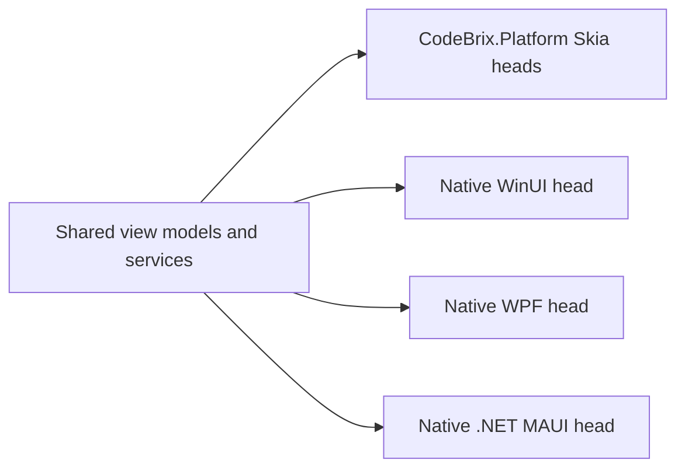

<sub>[CodeBrix](../../README.md) › [Build a CodeBrix.Platform application](README.md) › Sharing code with native frameworks</sub>

# Sharing code with native frameworks

**By the end of this chapter you will be able to take a view model written for a CodeBrix.Platform application and run it unchanged inside an application built on Microsoft's own WinUI, WPF or .NET MAUI.** It covers the three toolkit packages, what each one provides, the startup contract each framework needs, the page wiring that differs between them, and the limits the toolkits state about themselves.

This is the chapter behind the extra heads in [JustBetweenUs](https://github.com/ellisnet/CodeBrix.Samples/tree/main/JustBetweenUs): the same encrypt-and-decrypt view model driving the six CodeBrix.Platform heads plus native WinUI and WPF heads and a .NET MAUI head, from one file set.

## What the toolkits are

The CodeBrix "Simple" MVVM foundation - `SimpleViewModel`, `SimpleCommand`, `SimpleDialog`, `SimpleMessaging`, `SimpleServiceResolver`, `SimpleEnum` and `SimpleOsInfo`, all in the namespace `CodeBrix.Platform.Simple` - is compiled once per Microsoft UI framework and published as one package each. The API is identical across them, so a view model written against `SimpleViewModel` compiles unchanged for WinUI, WPF and .NET MAUI. Only the platform-facing edges differ.

CodeBrix.Platform provides the same Simple API to its own heads, which is what makes the whole arrangement work: one view model layer, four kinds of head.



These packages are independent of the cross-platform CodeBrix.Platform UI packages and share no code with them at run time. They are not add-ins, no CodeBrix.Platform head references them, and the two worlds are not mixed inside one project. The relationship is code sharing: the same source files, compiled into each head.

## The packages

| Package | For | What it adds |
| --- | --- | --- |
| [`CodeBrix.Platform.WinUI.ApacheLicenseForever`](https://www.nuget.org/packages/CodeBrix.Platform.WinUI.ApacheLicenseForever) | WinUI, in a Windows App SDK application | The Simple MVVM toolkit |
| [`CodeBrix.Platform.WinUI.Skia.ApacheLicenseForever`](https://www.nuget.org/packages/CodeBrix.Platform.WinUI.Skia.ApacheLicenseForever) | WinUI | `EmbeddedImage`, `EmbeddedImageButton` and `ImageSizeHelper` - Skia-rendered image controls with vector-direct SVG |
| [`CodeBrix.Platform.WinUI.Lottie.ApacheLicenseForever`](https://www.nuget.org/packages/CodeBrix.Platform.WinUI.Lottie.ApacheLicenseForever) | WinUI | A Skia-rendered Lottie player: `AnimatedVisualPlayer`, `LottieVisualSource` and `ThemableLottieVisualSource` |
| [`CodeBrix.Platform.WPF.ApacheLicenseForever`](https://www.nuget.org/packages/CodeBrix.Platform.WPF.ApacheLicenseForever) | WPF | The Simple MVVM toolkit. View-model side only: no controls |
| [`CodeBrix.Platform.Mobile.ApacheLicenseForever`](https://www.nuget.org/packages/CodeBrix.Platform.Mobile.ApacheLicenseForever) | .NET MAUI | The Simple MVVM toolkit. View-model side only: no controls |

All five are Apache-2.0. Each family carries its own `THIRD-PARTY-NOTICES.txt`, packed into its packages.

Within the WinUI family the dependency direction is strictly Lottie to Skia to Core, and each package brings the ones below it transitively. Reference Core for view models, commands, dialogs, messaging, dependency injection and operating-system facts; Skia when you also want the image controls; Lottie when you also want the player. Referencing all three explicitly is harmless.

```bash
dotnet add package CodeBrix.Platform.WinUI.ApacheLicenseForever
dotnet add package CodeBrix.Platform.WinUI.Skia.ApacheLicenseForever
dotnet add package CodeBrix.Platform.WinUI.Lottie.ApacheLicenseForever
```

```bash
dotnet add package CodeBrix.Platform.WPF.ApacheLicenseForever
```

```bash
dotnet add package CodeBrix.Platform.Mobile.ApacheLicenseForever
```

One dependency is deliberately yours rather than the package's. The toolkits reference only the abstractions packages for dependency injection and hosting; the application implements `IHostBuilderProvider` and returns `Host.CreateDefaultBuilder()`, which lives in [`Microsoft.Extensions.Hosting`](https://www.nuget.org/packages/Microsoft.Extensions.Hosting). Add that package to the application yourself.

The namespaces are short. WPF and MAUI applications need only the first line; the other three are the WinUI controls:

```csharp
    using CodeBrix.Platform.Simple;          // Core: every Simple* type,
                                             //   IXamlRootGetter, IHostBuilderProvider,
                                             //   SimpleServiceExtensions
    using CodeBrix.Platform.WinUI.Controls;  // Skia: EmbeddedImage,
                                             //   EmbeddedImageButton, ImagePosition
    using CodeBrix.Platform.WinUI.Skia;      // Skia: ImageSizeHelper
    using CodeBrix.Platform.WinUI.Lottie;    // Lottie: AnimatedVisualPlayer,
                                             //   LottieVisualSource, Themable...,
                                             //   IAnimatedVisualSource...
```

```xml
    xmlns:controls="using:CodeBrix.Platform.WinUI.Controls"
    xmlns:lottie="using:CodeBrix.Platform.WinUI.Lottie"
```

A WinUI application needs the Windows App SDK properties its own template already sets, with `UseWinUI` on; a WPF application needs a Windows-targeting project with `UseWPF` on; a .NET MAUI application needs `UseMaui` and its usual target frameworks, with `SupportedOSPlatformVersion` values no lower than the package's own minimums, which its `AGENT-README.txt` lists. [11 - Packaging and shipping](11-packaging-and-shipping.md) has a verbatim WinUI head project and the solution-platform mapping that goes with it.

## The startup contract

> [!IMPORTANT]
> Three calls, in this order, before any view model exists: `SimpleServiceResolver.CreateInstance(...)`, then `SimpleViewModel.SetIsDesignMode(false)`, then - on WinUI and MAUI - the per-page root wiring. Calling `SimpleServiceResolver.Instance`, `GetService<T>()` or any `Messaging*` helper before `CreateInstance` throws `InvalidOperationException`.

The service resolver wraps one .NET Generic Host. The application supplies the host builder, which is the same handful of lines in all three frameworks:

```csharp
    using CodeBrix.Platform.Simple;
    using Microsoft.Extensions.Hosting;          // app-owned package

    namespace MyApp.Helpers;

    public static class HostHelper
    {
        private class HostBuilderProvider : IHostBuilderProvider
        {
            public IHostBuilder CreateDefaultBuilder() => Host.CreateDefaultBuilder();
            public IHostBuilder CreateDefaultBuilder(string[] args) =>
                Host.CreateDefaultBuilder(args);
        }

        private static readonly HostBuilderProvider _hostBuilderProvider = new();

        public static IHostBuilderProvider GetHost() => _hostBuilderProvider;
    }
```

`CreateInstance(IHostBuilderProvider, ...)` then calls `CreateDefaultBuilder`, runs your `configureServices` callback, registers `ISimpleServiceResolver` unless it is already registered, scans the edition's own assembly for auto-registered services, adds messaging, and builds. It does not start the host - call `await SimpleServiceResolver.Instance.StartupHost()` yourself if you register `IHostedService` implementations. There is also a `CreateInstance(IHost)` overload that wraps a host you built yourself; that one registers nothing extra, so you must have called `services.AddSimpleMessaging()` on it or every messaging helper throws.

### WinUI

Both calls go in the `App` constructor, before `InitializeComponent()`, because XAML can construct view models during initialization:

```csharp
    using CodeBrix.Platform.Simple;
    using Microsoft.Extensions.DependencyInjection;
    using Microsoft.UI.Xaml;
    using Microsoft.UI.Xaml.Controls;
    using MyApp.Helpers;
    using MyApp.Services;

    namespace MyApp;

    public partial class App : Application
    {
        private Window _window;

        public App()
        {
            SimpleServiceResolver.CreateInstance(HostHelper.GetHost(), services =>
            {
                services.AddSingleton<IGreetingService, GreetingService>();
            });
            SimpleViewModel.SetIsDesignMode(false);

            InitializeComponent();
        }

        protected override void OnLaunched(LaunchActivatedEventArgs args)
        {
            _window = new Window();
            var frame = new Frame();
            _window.Content = frame;
            frame.Navigate(typeof(Views.MainPage));
            _window.Activate();
        }
    }
```

Then every page that hosts a view model hands it a way to reach the current `XamlRoot`, subscribing before `InitializeComponent()` because that call assigns the `DataContext` declared in XAML:

```csharp
    using CodeBrix.Platform.Simple;
    using Microsoft.UI.Xaml.Controls;

    namespace MyApp.Views;

    public sealed partial class MainPage : Page
    {
        public MainPage()
        {
            // Subscribe BEFORE InitializeComponent(): that call assigns the
            // DataContext declared in XAML.
            DataContextChanged += (_, _) =>
                (DataContext as IXamlRootGetter)?.SetXamlRootGetter(() => XamlRoot);

            InitializeComponent();
        }
    }
```

Without that wiring, `ShowInfo`, `ShowError` and `ConfirmDialog` throw `InvalidOperationException` with a message naming `SetXamlRootGetter`. A view model holds one getter, and the last page to bind it wins.

### WPF

The `App` constructor again, before the startup window and its `DataContext` exist - and then nothing else. WPF dialogs are message boxes and need no window reference:

```csharp
    using CodeBrix.Platform.Simple;
    using Microsoft.Extensions.DependencyInjection;
    using MyApp.Helpers;
    using MyApp.Services;
    using System.Windows;

    namespace MyApp;

    public partial class App : Application
    {
        public App()
        {
            // Runs before the StartupUri window - and its DataContext - exist.
            SimpleServiceResolver.CreateInstance(HostHelper.GetHost(), services =>
            {
                services.AddSingleton<IGreetingService, GreetingService>();
            });
            SimpleViewModel.SetIsDesignMode(false);
        }
    }
```

The window binds the view model the ordinary way, with a `clr-namespace` declaration:

```xml
    <Window x:Class="MyApp.Views.MainWindow"
            xmlns="http://schemas.microsoft.com/winfx/2006/xaml/presentation"
            xmlns:x="http://schemas.microsoft.com/winfx/2006/xaml"
            xmlns:vm="clr-namespace:MyApp.ViewModels"
            Title="MyApp" Width="420" Height="240">
        <Window.DataContext>
            <vm:MainViewModel />
        </Window.DataContext>
        <StackPanel Margin="20">
            <TextBox Margin="0,0,0,8"
                     Text="{Binding Name, Mode=TwoWay,
                                    UpdateSourceTrigger=PropertyChanged}" />
            <TextBlock Margin="0,0,0,8" Text="{Binding Greeting}" />
            <StackPanel Orientation="Horizontal">
                <Button Width="100" Margin="0,0,8,0"
                        Command="{Binding GreetCommand}">Greet</Button>
                <Button Width="100" Command="{Binding ResetCommand}">Reset</Button>
            </StackPanel>
        </StackPanel>
    </Window>
```

### .NET MAUI

`CreateInstance` must run before the first page's `BindingContext` is constructed. With Shell, the pages are created inside `CreateWindow()`, so the `App` constructor is the latest safe place; `MauiProgram.CreateMauiApp()` before `builder.Build()` works too.

```csharp
    using CodeBrix.Platform.Simple;
    using Microsoft.Extensions.DependencyInjection;
    using Microsoft.Maui;
    using Microsoft.Maui.Controls;
    using MyApp.Helpers;
    using MyApp.Services;

    namespace MyApp;

    public partial class App : Application
    {
        public App()
        {
            InitializeComponent();

            // Before CreateWindow(): that is where the Shell and its pages -
            // and therefore the first view model - are created.
            SimpleServiceResolver.CreateInstance(HostHelper.GetHost(), services =>
            {
                services.AddSingleton<IGreetingService, GreetingService>();
            });
            SimpleViewModel.SetIsDesignMode(false);
        }

        protected override Window CreateWindow(IActivationState activationState)
        {
            return new Window(new AppShell());
        }
    }
```

The page wiring hands the view model the `Page` itself, because a MAUI dialog is an instance method of the page that is on screen:

```csharp
    using CodeBrix.Platform.Simple;
    using Microsoft.Maui.Controls;

    namespace MyApp.Views;

    public partial class MainPage : ContentPage
    {
        public MainPage()
        {
            // Subscribe BEFORE InitializeComponent(): that call assigns the
            // BindingContext declared in XAML. Every dialog needs this Page.
            BindingContextChanged += (_, _) =>
                (BindingContext as IXamlRootGetter)?.SetXamlRootGetter(() => this);

            InitializeComponent();
        }
    }

    // Equivalent alternative: override the virtual instead of subscribing.
    //   protected override void OnBindingContextChanged()
    //   {
    //       base.OnBindingContextChanged();
    //       (BindingContext as IXamlRootGetter)?.SetXamlRootGetter(() => this);
    //   }
```

Notice the one MAUI-specific trap in that pattern: the getter must return the page that is on screen. A view model shared by several pages holds one getter, and with Shell's `ContentTemplate` the pages are created lazily on first navigation - which the constructor wiring above covers.

## The view model that all of them share

This is the file the WinUI toolkit's own documentation heads "compiles unchanged for WPF and MAUI too". It shows the design-mode guard, service resolution, `SetProperty`, the `Affects*` attributes, lazy `SimpleCommand` properties, the dialog helpers, messaging and disposal:

```csharp
    using CodeBrix.Platform.Simple;
    using MyApp.Services;
    using System;
    using System.Threading.Tasks;

    namespace MyApp.ViewModels;

    public sealed class MainViewModel : SimpleViewModel
    {
        private IGreetingService _greetings;

        public MainViewModel()
        {
            if (!IsDesignMode(true))   // skip service resolution in a designer
            {
                _greetings = GetService<IGreetingService>();
            }
        }

        private string _name = string.Empty;
        [AffectsProperties(nameof(Greeting))]
        [AffectsCommands(nameof(GreetCommand))]
        public string Name
        {
            get => _name;
            set => SetProperty(ref _name, value ?? string.Empty);
        }

        public string Greeting =>
            string.IsNullOrWhiteSpace(Name) ? string.Empty : $"Hello, {Name}!";

        private bool _isBusy;
        [AffectsAllCommands]
        public bool IsBusy
        {
            get => _isBusy;
            set => SetProperty(ref _isBusy, value, notifyOnMainThread: true);
        }

        private SimpleCommand _greetCommand;
        public SimpleCommand GreetCommand =>
            _greetCommand ??= new SimpleCommand(CanGreet, DoGreetAsync);

        private bool CanGreet() => !IsBusy && !string.IsNullOrWhiteSpace(Name);

        private async Task DoGreetAsync()
        {
            try
            {
                IsBusy = true;
                var text = await _greetings.ComposeAsync(Name.Trim());
                await ShowInfo(text);
                MessagingSend(this, "Greeted", Name);
            }
            catch (Exception ex)
            {
                await ShowError(ex, "Could not greet");
            }
            finally
            {
                IsBusy = false;
            }
        }

        private SimpleCommand _resetCommand;
        public SimpleCommand ResetCommand =>
            _resetCommand ??= new SimpleCommand(DoResetAsync);

        private async Task DoResetAsync()
        {
            if (await ConfirmDialog("Clear the name?"))
            {
                Name = string.Empty;
            }
        }

        public override void Dispose()
        {
            _greetCommand?.Dispose();
            _greetCommand = null;
            _resetCommand?.Dispose();
            _resetCommand = null;
            _greetings = null;
            base.Dispose();
        }
    }
```

Notice what carries the behavior. Every `NotifyPropertyChanged` - so every `SetProperty` and every `ThisPropertyChanged` - raises `PropertyChanged` for the property, then looks that property up by reflection and applies the attributes it carries: `[AffectsProperties]` raises `PropertyChanged` for the named properties, `[AffectsCommands]` calls `RaiseCanExecuteChanged()` on the named commands, and `[AffectsAllCommands]` does that for every public property whose declared type is exactly `SimpleCommand`. Names are matched case-insensitively, and where a property carries both, `[AffectsAllCommands]` wins.

`SimpleCommand` itself is an `ICommand` with constructors covering synchronous and asynchronous handlers with and without a `CanExecute` gate, plus opt-in main-thread execution. The lazy-property shape above is the one the samples use throughout.

## Where the three frameworks differ

The API is the same; the edges are not. These are the differences to hold in mind when a view model has to satisfy all three.

| Concern | WinUI | WPF | .NET MAUI |
| --- | --- | --- | --- |
| Root wiring | `SetXamlRootGetter(Func<XamlRoot>)` on each page | None needed | `SetXamlRootGetter(Func<Page>)` on each page |
| Dialogs | A `ContentDialog` built on the dispatcher | `System.Windows.MessageBox` - modal, blocking, no owner window | `Page.DisplayAlertAsync` on the page the getter returns |
| `InvokeOnMainThread` | `TryEnqueue` on the dispatcher captured when the view model was constructed; returns immediately | `Dispatcher.Invoke` - synchronous, blocks until the action has run | Runs inline when already on the main thread, otherwise posts without waiting |
| `GetVisibility(false)` | `Collapsed` | `Hidden` - the element keeps its layout space | `Hidden` - the element keeps its layout space |
| Design mode | Reports only what `SetIsDesignMode` stored, or your default | Same, but with no stored value and no default it falls back to WPF designer detection | Reports only what `SetIsDesignMode` stored, or your default |
| Service container | One Generic Host | One Generic Host | One Generic Host, separate from `MauiAppBuilder.Services` |

Two of those rows are the ones that change how you write shared code. Because `InvokeOnMainThread` is synchronous on WPF and asynchronous elsewhere, a background thread that calls it in a loop is blocked for each round trip on WPF - batch the UI updates into one call. And because `GetVisibility(false)` returns `Hidden` rather than `Collapsed` on WPF and MAUI, return `Visibility.Collapsed` yourself where the layout space must be reclaimed.

The dialog text is identical everywhere: `ShowInfo` uses the title "Information" and does nothing for a blank message; `ShowError` uses the title "ERROR" and a body of `"An error occurred:\n   <message>"` plus, when given, `"Details:\n<details>"`, with details over 200 characters cut to 195 and an ellipsis; `ConfirmDialog` defaults to the title "Are you sure?" and returns true when the user chose Yes or OK.

## Messaging, enums and operating-system facts

`SimpleMessaging` is weak-reference publish and subscribe between view models, keyed by message name plus the sender and args types. Type matching is exact - subscribing with a base class does not receive messages sent with a derived sender type - and a non-null source restricts delivery to that sender. `Action` callbacks run synchronously on the sending thread; `Func<..., Task>` callbacks are fire-and-forget on a thread-pool task, serialized per subscription, so touch UI from them only through `InvokeOnMainThread`.

The lifetime rule is worth reading twice: the subscriber is held by a weak reference, and the callback target is held weakly only when the callback is an instance method of the subscriber itself. A lambda that captures `this` has a compiler-generated closure as its target and is held strongly until you unsubscribe. Prefer method groups, and unsubscribe in `Dispose`.

`SimpleEnum` attaches rich metadata to an enum member: an info class per enum, with a description and any extra members you add, resolved through attributes on the members and cached per enum and info type.

```csharp
    public enum Shipping
    {
        [SimpleEnum<ShippingInfo>(nameof(ShippingInfo.Standard))] Standard = 0,
        [SimpleEnum<ShippingInfo>(nameof(ShippingInfo.Express))]  Express,
    }

    public sealed class ShippingInfo : SimpleEnumInfo<Shipping>
    {
        public int Days { get; }

        public ShippingInfo(Shipping member, string description, int days)
            : base(member)
        {
            Description = description;
            Days = days;
        }

        public static ShippingInfo Standard => new(Shipping.Standard, "Standard (5 days)", 5);
        public static ShippingInfo Express  => new(Shipping.Express,  "Express (1 day)",   1);

        public static Dictionary<Shipping, ShippingInfo> GetDictionary() =>
            GetDictionary<ShippingInfo>();
    }

    var info   = SimpleEnumHelper.FindMemberInfo<Shipping, ShippingInfo>(Shipping.Express);
    var days   = info.Days;                                                   // 1
    var all    = SimpleEnumHelper.GetPossibleValues<Shipping, ShippingInfo>(); // 2 infos
    var byName = SimpleEnumHelper.FindMemberInfo<ShippingInfo>("standard");   // case-insensitive
    var picker = ShippingInfo.GetDictionary().Values.Select(v => v.Description);
```

Notice the contract that makes it work: the info class exposes one public static property of its own type per enum member, and the attribute on the member names that property. Two such attributes on one member throw `TypeLoadException` at the first lookup.

`SimpleOsInfo` reports operating system, user and architecture facts - including Linux distribution identification and, on Android, device model and manufacturer. It does I/O, so gather once and cache the instance.

## The WinUI image and animation controls

The two companion packages exist only for WinUI, and they exist so that art looks the same in a WinUI application as it does on the CodeBrix.Platform Skia heads: SVG renders vector-direct at full display resolution through the same engine and drawing path, and the Lottie player uses the same playback engine and drawing math.

`EmbeddedImage` and `EmbeddedImageButton` load from `embedded://AssemblyName/Resource.Name` or from ordinary application URIs. A `.svg` extension selects the vector path - the bytes are parsed off the UI thread and drawn on a Skia canvas at the final physical-pixel size, so it stays sharp at any scale factor - and everything else becomes a plain bitmap image.

```xml
    <Page
        x:Class="MyApp.Views.MainPage"
        xmlns="http://schemas.microsoft.com/winfx/2006/xaml/presentation"
        xmlns:x="http://schemas.microsoft.com/winfx/2006/xaml"
        xmlns:vm="using:MyApp.ViewModels"
        xmlns:controls="using:CodeBrix.Platform.WinUI.Controls"
        xmlns:lottie="using:CodeBrix.Platform.WinUI.Lottie">

        <Page.DataContext>
            <vm:MainViewModel />
        </Page.DataContext>

        <StackPanel Margin="20" Spacing="12">
            <TextBox Text="{Binding Name, Mode=TwoWay,
                                   UpdateSourceTrigger=PropertyChanged}" />
            <TextBlock Text="{Binding Greeting}" />

            <controls:EmbeddedImageButton
                Command="{Binding GreetCommand}"
                ImageUriSource="embedded://MyApp/MyApp.Assets.wave-icon.svg"
                Text="Greet" ImagePosition="Left"
                ImageWidth="24" ImageHeight="24" Spacing="6" />

            <controls:EmbeddedImageButton
                Command="{Binding ResetCommand}"
                ImageUriSource="ms-appx:///Assets/reset.png">Reset</controls:EmbeddedImageButton>

            <controls:EmbeddedImage
                UriSource="embedded://MyApp/MyApp.Assets.logo.svg"
                Width="120" Height="120" Stretch="Uniform" />

            <lottie:AnimatedVisualPlayer x:Name="Spinner" AutoPlay="True"
                                         Width="48" Height="48">
                <lottie:LottieVisualSource UriSource="ms-appx:///Assets/spinner.json" />
            </lottie:AnimatedVisualPlayer>
        </StackPanel>
    </Page>
```

The assets those URIs name are declared in the application project - embedded resources with an explicit logical name for the `embedded://` scheme, content items for the rest:

```xml
    <ItemGroup>
      <EmbeddedResource Include="Assets\wave-icon.svg">
        <LogicalName>MyApp.Assets.wave-icon.svg</LogicalName>
      </EmbeddedResource>
      <EmbeddedResource Include="Assets\logo.svg">
        <LogicalName>MyApp.Assets.logo.svg</LogicalName>
      </EmbeddedResource>
      <Content Include="Assets\reset.png" />
      <Content Include="Assets\spinner.json">
        <CopyToOutputDirectory>PreserveNewest</CopyToOutputDirectory>
      </Content>
    </ItemGroup>
```

Notice that the resource name in the URI must be the exact manifest resource name - the `<LogicalName>` you set - and that the assembly must already be loaded in the process. A wrong name renders nothing and writes only to debug output; no exception reaches you.

The player is driven from code-behind, and a themable source can recolor named shapes at run time:

```csharp
    using CodeBrix.Platform.WinUI.Lottie;

    // one-shot: play the first half and wait for it to finish
    await Spinner.PlayAsync(0, 0.5, looped: false);
    Spinner.SetProgress(1.0);       // jump to the last frame, stopped
    Spinner.Pause();  Spinner.Resume();  Spinner.Stop();

    // run-time re-colouring: shapes named "{ Color : var(Foreground) }"
    var themed = new ThemableLottieVisualSource
    {
        UriSource = new Uri("ms-appx:///Assets/spinner.json")
    };
    themed.SetColorThemeProperty("Foreground",
        Windows.UI.Color.FromArgb(255, 0, 120, 215));
    Spinner.Source = themed;        // may also be set before the colours
```

The theming contract is exact and case-sensitive: name the shape in the animation file with a binding block such as `{ Color : var(Foreground) }`, several separated by `;` if needed. Only the property name `Color` is honored - `{color: var(x)}` is silently ignored - only shapes under the document's top-level layers are scanned, and only a shape's static color is rewritten; keyframed colors are left alone. Each `SetColorThemeProperty` after load rewrites and reloads the animation, so set all colors before assigning `Source`, and never animate a color through it.

## Testing a view model without a running application

The WPF edition documents the case that bites first, because so much of WPF's dispatcher is unavailable without an `Application`:

```csharp
    // Test double: mark the view model as under test so InvokeOnMainThread
    // runs inline when Application.Current is null.
    public sealed class TestableMainViewModel : MainViewModel
    {
        public TestableMainViewModel() { _isUnderTest = true; }
    }
    // Commands still marshal RaiseCanExecuteChanged through the dispatcher
    // by default; switch that off per command in tests:
    vm.GreetCommand.ShouldRaiseCanExecuteOnMainThread = false;
    // The test project must target net10.0-windows with UseWPF=true and call
    // SimpleServiceResolver.CreateInstance(...) once before the first view
    // model is created.
```

Notice the last comment. Target-framework contagion is the rule to remember in every edition: a class library or test project that references a toolkit package must use the same target framework as the application it serves - a plain .NET class library cannot reference it.

## The limits the toolkits state

These are small, deliberate toolkits, and they say what they are not.

**All three.** No navigation framework and no view-model locator - no window management on WPF, no `Frame` or `Window` helpers on WinUI, no Shell routing wrappers or `NavigationPage` helpers on MAUI. No localization: dialog titles and button labels are English constants, though the WPF message box's own buttons follow the operating-system language. No custom dialog UI - one or two buttons only, and no input dialogs, action sheets, prompts or toasts. `SimpleMessaging` has no request-response, no awaitable send and no ordering guarantees between subscribers. `SimpleServiceResolver` is not a general container: it wraps one Generic Host, has no scopes or child containers, and does not start the host. `SimpleOsInfo` reports operating system, user and architecture only - nothing about windows, displays or hardware.

**WinUI.** There is no designer detection: `IsDesignMode` reports only what `SetIsDesignMode` stored, or your default. The Skia package is the two controls and `ImageSizeHelper` and nothing more - bitmaps are decoded by the platform's own image type, and there is no image processing and no SVG animation or scripting. The Lottie player is its own panel: it does not accept the Windows App SDK's animated-visual sources, `LottieVisualOptions` is accepted for API parity and has no effect, `CreateFromString` throws `NotImplementedException`, there is no diagnostics output, and only the `Color` binding can be themed.

**WPF.** No UI controls of any kind: the package is view-model side only. `IsAndroid` is always false.

**.NET MAUI.** No designer detection. No integration with `MauiAppBuilder.Services` - the resolver hosts its own Generic Host, and a service that both sides need must be registered in both. No UI controls of any kind. `SimpleOsInfo` has no iOS-specific branch, and on Android reports version, codename, API level, model and manufacturer only.

## Pitfalls

> [!WARNING]
> On WinUI, do not construct a `SimpleViewModel` off the UI thread. The dispatcher is captured in the constructor, and off the UI thread it is null - after which `InvokeOnMainThread`, `InvokeOnMainThreadAsync` and every dialog helper throw `ArgumentNullException`. Let XAML or UI-thread code create view models.

- Forgetting `SimpleViewModel.SetIsDesignMode(false)` at startup means `IsDesignMode(true)` returns true at run time, and a view model that guards its constructor with it silently does nothing.
- `SetProperty<T>` is constrained to reference types, with overloads for `string`, `bool`, `int`, `DateTime` and `DateTimeOffset`, plus `SetEnumProperty<TEnum>`. For `double`, `long`, `decimal`, `Guid` and the rest, compare and assign yourself, then call `ThisPropertyChanged()`.
- `SetEnumProperty` silently ignores the assignment when either value is not a defined member - flags combinations, or a field defaulted to zero where zero is not a member.
- The `Affects*` cascade runs only from `NotifyPropertyChanged`; raising `PropertyChanged` yourself bypasses it. It finds public instance properties only, and `[AffectsAllCommands]` refreshes only properties whose declared type is exactly `SimpleCommand`, not `ICommand`.
- `SimpleCommand.Execute` is `async void`: an exception from your handler is an unhandled exception. Wrap the body in `try`/`catch` and call `ShowError`, as the shared view model above does.
- Auto-registration during `CreateInstance` scans only the toolkit's own assembly. Register your own `IAutoRegisterServices` classes with `services.AutoRegisterServices([typeof(App)])` inside `configureServices`.
- On WPF, `SimpleCommand.RaiseCanExecuteChanged` goes through `Application.Current.Dispatcher` while `ShouldRaiseCanExecuteOnMainThread` is true, so a unit test with no WPF `Application` throws. Set that flag to false on commands under test.
- On WPF, a dialog blocks the UI thread for the lifetime of the message box, and nothing else in the application runs until the user closes it - including async continuations queued to the dispatcher.
- The `Affects*` cascade reflects over the view model's properties on every notification. That is right for form-sized view models; for a value that changes thousands of times a second, assign the field and notify once.

## Checklist

- [ ] The view model layer references only the toolkit package and its own services - no framework-specific types
- [ ] `SimpleServiceResolver.CreateInstance(...)` runs before any view model exists, in the `App` constructor
- [ ] `SimpleViewModel.SetIsDesignMode(false)` runs immediately after it
- [ ] Every WinUI and MAUI page wires the root getter from a change handler subscribed before `InitializeComponent()`
- [ ] The application - not the package - references the hosting package and supplies an `IHostBuilderProvider`
- [ ] Your own auto-registered services are named explicitly inside `configureServices`
- [ ] Every command handler catches its own exceptions
- [ ] Messaging subscriptions use method groups and are unsubscribed in `Dispose`
- [ ] Shared code assumes the strictest of the three threading models, and does not depend on `GetVisibility(false)` reclaiming layout space
- [ ] Every library and test project that references a toolkit package uses the same target framework as its application

---

**Where to go next**

- [Samples index](../samples/README.md) - JustBetweenUs runs this chapter's code on eight heads at once
- [05 - MVVM the right way](05-mvvm-the-right-way.md) - the same view-model API, on the CodeBrix.Platform heads
- [11 - Packaging and shipping](11-packaging-and-shipping.md) - the head project properties and solution mapping a native WinUI head needs
- [CodeBrix.Platform on GitHub](https://github.com/ellisnet/CodeBrix.Platform) - source, tests and samples
