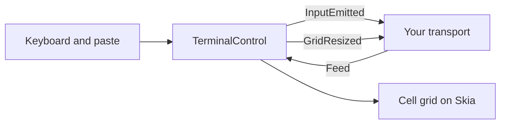

<sub>[CodeBrix](../../../README.md) › [Build a CodeBrix.Platform application](../README.md) › [Add-ins](../08-add-ins.md) › TerminalView</sub>

# TerminalView

**TerminalView adds one XAML element, `TerminalControl`, that renders a CodeBrix.Terminal engine - VT100 / VT220 / xterm-compatible - as a fixed monospace cell grid on a Skia surface and turns keyboard input into VT sequences.** It is the screen-and-keyboard half of a terminal: you feed it the bytes or text arriving from any source and wire the input it emits back to that source. The whole transport contract is three wires - `InputEmitted`, `GridResized`, `Feed` - so the same control fronts an SSH session, a local shell through a PTY, a build-output pane or a pure local echo.

| | |
| --- | --- |
| **Package** | [`CodeBrix.Platform.TerminalView.ApacheLicenseForever`](https://www.nuget.org/packages/CodeBrix.Platform.TerminalView.ApacheLicenseForever) |
| **Adds** | `TerminalControl` - a XAML `Control` rendering a CodeBrix.Terminal engine |
| **Heads** | Every head the framework has: Windows (Win32 and Skia-on-WPF), Linux (X11, Wayland, frame buffer) and macOS |
| **Requires** | A transport of your own - the package ships none. [`CodeBrix.Terminal.MitLicenseForever`](https://www.nuget.org/packages/CodeBrix.Terminal.MitLicenseForever), [`CodeBrix.Platform.TextLayout.ApacheLicenseForever`](https://www.nuget.org/packages/CodeBrix.Platform.TextLayout.ApacheLicenseForever) and [`CodeBrix.Platform.Fonts.RobotoMono.OflLicenseForever`](https://www.nuget.org/packages/CodeBrix.Platform.Fonts.RobotoMono.OflLicenseForever) flow in as dependencies |

## Add it to your application

Add the package:

```bash
dotnet add package CodeBrix.Platform.TerminalView.ApacheLicenseForever
```

Reference it from the shared UI project of your application - the project that already references [`CodeBrix.Platform.ApacheLicenseForever`](https://www.nuget.org/packages/CodeBrix.Platform.ApacheLicenseForever) - not from the per-platform head projects. Four things flow in with it: the framework, the TextLayout add-in (text shaping and cell metrics), the terminal engine (parser, buffer, key encoder, selection service, PTY helpers on Unix and macOS) and the Roboto Mono fonts package that supplies the default face.

Declare the XAML namespace. Either form works:

```xml
xmlns:term="using:CodeBrix.Platform.UI.TerminalView"
xmlns:term="clr-namespace:CodeBrix.Platform.UI.TerminalView;assembly=CodeBrix.Platform.UI.TerminalView"
```

In code-behind:

```csharp
using CodeBrix.Platform.UI.TerminalView;   // TerminalControl
using SkiaSharp;                           // SKColor for the color properties
using CodeBrix.Terminal.Engine;            // only for Pty / UnixWindowSize
                                           // when hosting a local shell
```

There is no registration call and no feature flag. No head project changes are needed; the package works on all six heads. What the application supplies instead is a transport and the three wires.

## Using it

### Declare the control

A bounded star cell is the recommended host: the grid - columns by rows - follows the control size, and an unbounded control ends up at the minimum of four columns by two rows.

```xml
<Page ...
      xmlns:term="using:CodeBrix.Platform.UI.TerminalView">
    <Grid>
        <Grid.RowDefinitions>
            <RowDefinition Height="Auto" />
            <RowDefinition Height="*" />
        </Grid.RowDefinitions>
        <TextBlock x:Name="TitleText" Grid.Row="0" />
        <term:TerminalControl x:Name="Terminal" Grid.Row="1" Margin="8" />
    </Grid>
</Page>
```

### The three wires

Everything a transport needs is three members. `InputEmitted` carries VT-encoded keyboard input, and pasted text, as the string a PTY master would receive - encode it as UTF-8 before writing to a byte transport. `GridResized` reports `(columns, rows)` whenever the grid changes with the control size or the font, and fires only when the numbers actually change. `Feed` pushes host output back onto the screen from any thread.



Two further events are informational: `TitleChanged` carries the window title set by OSC 0 or OSC 2 (OSC 1 icon titles are accepted and ignored), and `CopyRequested` carries the selected text whenever it is copied. Every event is raised on the UI thread.

### Bridge it to an SSH shell stream

This is the whole integration for a remote shell. Leave `ConvertEol` at its default of false: a remote shell emits CR+LF.

```csharp
using System.Text;

// 1. keyboard / paste -> host
Terminal.InputEmitted += text =>
{
    var bytes = Encoding.UTF8.GetBytes(text);
    shellStream.Write(bytes, 0, bytes.Length);
    shellStream.Flush();
};

// 2. grid size -> host (a PTY window-change request)
Terminal.GridResized += (cols, rows) =>
    shellStream.ChangeWindowSize((uint)cols, (uint)rows, 0, 0);

Terminal.TitleChanged += title => TitleText.Text = title;
Terminal.CopyRequested += text => StatusText.Text = $"copied {text.Length} chars";

// 3. host -> screen: a read loop on any thread
_ = Task.Run(() =>
{
    var buffer = new byte[8192];
    int read;
    while ((read = shellStream.Read(buffer, 0, buffer.Length)) > 0)
    {
        Terminal.Feed(buffer, read);     // copies; buffer is reusable at once
    }
});

Terminal.GrabFocus();
```

Notice the read loop hands whole buffers to `Feed`, not lines: each call is one dispatcher hop plus one scheduled repaint, so few large reads are far cheaper than many small ones.

### Host a local shell through a PTY

On Unix and macOS the terminal engine's `Pty` class starts a real shell with a real tty behind it.

```csharp
using CodeBrix.Terminal.Engine;
using Microsoft.Win32.SafeHandles;
using System.IO;
using System.Text;

var winSize = new UnixWindowSize { row = 25, col = 80 };
int pid = Pty.ForkAndExec("/bin/bash", args, env, out int master, winSize);

// Any Stream over the master descriptor will do:
var pty = new FileStream(new SafeFileHandle((IntPtr)master, ownsHandle: true),
                         FileAccess.ReadWrite);

Terminal.InputEmitted += text =>
{
    var bytes = Encoding.UTF8.GetBytes(text);
    pty.Write(bytes, 0, bytes.Length);
    pty.Flush();
};

Terminal.GridResized += (cols, rows) =>
{
    var size = new UnixWindowSize { row = (ushort)rows, col = (ushort)cols };
    Pty.SetWinSize(master, ref size);
};

_ = Task.Run(() =>
{
    var buffer = new byte[8192];
    int read;
    while ((read = pty.Read(buffer, 0, buffer.Length)) > 0)
    {
        Terminal.Feed(buffer, read);
    }
});

Terminal.GrabFocus();
```

The shape is identical to the SSH bridge; only the write target and the window-size call differ.

### No host at all

A terminal that echoes locally needs no transport. This is what the demo does, and it is the fastest way to see the control working.

```csharp
private readonly StringBuilder _line = new();

Terminal.InputEmitted += data =>
{
    foreach (var ch in data)
    {
        switch (ch)
        {
            case '\r':                                     // Enter
                Terminal.Feed("\r\n");
                Terminal.Feed($"\x1b[2myou typed:\x1b[0m {_line}\r\n");
                _line.Clear();
                Terminal.Feed("\x1b[1;32mdemo\x1b[0m$ ");
                break;
            case '\x7f':                                   // Backspace
                if (_line.Length > 0) { _line.Length--; Terminal.Feed("\b \b"); }
                break;
            default:
                if (ch >= ' ') { _line.Append(ch); Terminal.Feed(ch.ToString()); }
                else { Terminal.Feed($"\x1b[2m^{(char)(ch + '@')}\x1b[0m"); }
                break;
        }
    }
};
```

`Feed(string)` hands already-decoded text to the engine, which is what you want for text you produce yourself - a banner, a status line, an echo.

### Feed: the two overloads

`Feed(string data)` and `Feed(byte[] data, int length)` are both safe from any thread: each call enqueues one work item on the control's dispatcher queue, which feeds the engine, updates the scrollbar and schedules a repaint.

`Feed(byte[], int)` copies the first `length` bytes and hands the copy to the engine's byte path, so the caller may reuse its read buffer immediately. It is the natural shape for a transport read loop - decoding to a string yourself before `Feed(string)` risks splitting a multi-byte UTF-8 sequence across two reads.

> [!IMPORTANT]
> Both overloads return without doing anything when the data is empty, and also when the control has no dispatcher queue yet - that is, when it is not in the visual tree. Data fed before the control is loaded is dropped. Connect the session, or write the banner, in the `Loaded` handler.

### Colors, font, scrollback and end-of-line

Three `SKColor` properties are the whole theme surface, and each setter repaints. `ForegroundColor` defaults to white, `BackgroundColor` to black, and `SelectionColor` to a translucent blue - it is an overlay painted over selected cells, so give it an alpha that reads on your background.

```csharp
Terminal.BackgroundColor = new SKColor(0xff, 0xff, 0xff);
Terminal.ForegroundColor = new SKColor(0x00, 0x00, 0x00);
Terminal.SelectionColor  = new SKColor(0x33, 0x66, 0xcc, 0x59);   // reads on white

Terminal.Reset();          // RIS: clears screen, scrollback view, selection
Terminal.GrabFocus();
```

Only default-attributed cells follow `ForegroundColor` and `BackgroundColor`; text that names a palette color keeps its palette value on either ground.

The remaining knobs:

| Property | Default | What it does |
| --- | --- | --- |
| `ConvertEol` | `false` | Treat a bare LF in fed data as CR+LF. Set true for a pipe-connected process or a log file |
| `Scrollback` | `1000` | Lines kept beyond the visible rows. Set it before the control loads; negative values clamp to 0 |
| `TerminalFontFamily` | the Roboto Mono URI | A font URI or family name understood by TextLayout. Must be monospaced |
| `TerminalFontSize` | `14` DIPs | Values below 4 clamp to 4 |
| `Columns`, `Rows` | read-only | The engine's current grid, following the control size |

The default font URI is `"ms-appx:///CodeBrix.Platform.Fonts.RobotoMono/Fonts/RobotoMono.ttf"`; null or blank restores it. The cell advance is measured from the glyph `"x"`, so a proportional face misaligns the grid. Setting either font property re-measures the cell, re-fits the grid - `GridResized` fires if the numbers change - and repaints.

### Reset and focus

`Reset()` performs a full terminal reset: engine reset, selection cleared, scrollbar updated, repaint. It does not touch the color properties, the font or the event subscriptions, and it reconnects nothing. `GrabFocus()` gives the control keyboard focus; call it after connecting a session so typing goes straight to the host.

### Keyboard, mouse and clipboard

Ctrl+Shift+C copies and Ctrl+Shift+V pastes; neither reaches the host, and pasted line endings are normalized to CR before they arrive through `InputEmitted`. Shift+PageUp and Shift+PageDown page through scrollback by one screen less a line; neither reaches the host either. Typing snaps the view back to live output.

Ctrl and Alt chords go through the engine's `TerminalKeyEncoder` - Ctrl to C0 control codes, Alt to an ESC prefix - honoring the engine's application-cursor mode. Shift+Tab becomes back-tab, and cursor, function and editing keys use the encoder's special-key path. Printable characters prefer the platform's layout-composed character, so shifted symbols on non-US layouts come out right; the raw-key fallback assumes US-QWERTY. Caps Lock is tracked and passed to the encoder as a modifier.

A left press starts a selection and takes pointer capture; a drag extends it cell by cell, and dragging above or below the control scrolls one line at a steady interval while held there. A double-click selects the word or expression under the pointer per the engine's rules, a right-click opens the Copy / Paste context menu at the pointer, and the wheel scrolls three lines per notch.

### Attributes and colors on screen

Palette indices resolve against the engine's 256-entry table: 0-7 standard, 8-15 bright, 16-231 the 6x6x6 cube, and the grayscale ramp after it. Bold promotes palette colors 0-7 to their bright 8-15 twin and selects the bold face; italic selects the italic face; inverse swaps the two grounds; dim darkens the foreground to 60%; invisible paints the foreground in the background color. Underline is drawn 2 DIPs below the baseline and crossed-out at half the cell height. Wide CJK characters and emoji occupy two cells and stay grid-aligned.

### The smallest project that runs a terminal

```xml
<ItemGroup>
  <PackageReference Include="CodeBrix.Platform.ApacheLicenseForever" />
  <PackageReference Include="CodeBrix.Platform.TerminalView.ApacheLicenseForever" />
</ItemGroup>
```

```xml
<!-- MainPage.xaml -->
<Page x:Class="MyApp.Views.MainPage"
      xmlns="http://schemas.microsoft.com/winfx/2006/xaml/presentation"
      xmlns:x="http://schemas.microsoft.com/winfx/2006/xaml"
      xmlns:term="using:CodeBrix.Platform.UI.TerminalView">
    <Grid>
        <term:TerminalControl x:Name="Terminal" />
    </Grid>
</Page>
```

```csharp
// MainPage.xaml.cs
public MainPage()
{
    InitializeComponent();
    Terminal.InputEmitted += text => Terminal.Feed(text);   // echo
    Loaded += (_, _) =>
    {
        Terminal.Feed("\x1b[1;36mready\x1b[0m\r\n$ ");     // after Loaded!
        Terminal.GrabFocus();
    };
}
```

The banner is written in `Loaded`, not in the constructor - that is the one ordering rule this control has.

<details>
<summary>The whole application-facing surface of TerminalControl</summary>

```csharp
TerminalControl : Control
  events    InputEmitted   Action<string>     VT input -> host (UI thread)
            GridResized    Action<int,int>    (cols, rows) -> host
            TitleChanged   Action<string>     OSC 0 / 2
            CopyRequested  Action<string>     after a copy; observational
  props     Columns, Rows              int (read-only; min 4 x 2)
            ForegroundColor            SKColor   white
            BackgroundColor            SKColor   black
            SelectionColor             SKColor   4d 8b d8 / alpha 66
            ConvertEol                 bool      false (true for bare LF)
            Scrollback                 int       1000; set before Loaded
            TerminalFontFamily         string    Roboto Mono URI; monospaced
            TerminalFontSize           float     14 (min 4)
  methods   Feed(string)               any thread; text
            Feed(byte[] data, int length)  any thread; copies; bytes
            Reset()                    RIS
            GrabFocus()                keyboard focus
```

</details>

## Per-head notes

- **Frame buffer.** On heads that have a software keyboard, it is summoned when the terminal takes focus.
- **Unix and macOS.** The terminal engine's `Pty` class hosts a local shell. `Pty.ForkAndExec` does not exist on Windows.
- **Windows.** A local process there is a `System.Diagnostics.Process` with redirected standard streams - a pipe, not a terminal. The child sees no tty, so there is no echo and no line editing on the host side, and its output usually has bare LF line endings: set `ConvertEol = true`.
- **Transports the family offers.** [CodeBrix.SSH](../../libraries/CodeBrix.SSH.md) for a remote shell; the engine's `Pty` class for a local one on Unix and macOS.

## Pitfalls

- Give the control a bounded size - a `Grid` star cell, not a `StackPanel` or an auto cell. An unbounded control ends up 4 x 2.
- Feeding before `Loaded` loses data: with no dispatcher queue yet, `Feed` returns without doing anything.
- An escape-driven resize request from the host application is deliberately ignored. The grid follows the control, and the host learns the size through `GridResized`.
- `ConvertEol` defaults to false. A bare-LF source needs true, or every line steps one column to the right.
- Set `Scrollback` before the control loads; afterwards it applies only at the next grid resize.
- `InputEmitted` delivers a string and the host wants bytes. Encode as UTF-8 before writing to a byte transport.
- Pasted text arrives through `InputEmitted` with line endings already normalized to CR, which is what a terminal sends for Enter. Do not re-normalize.
- `CopyRequested` is after the fact. There is no hook to veto or transform a copy; the clipboard already has the text.
- Mouse-reporting escape protocols are not forwarded to the host, and there is no IME or preedit path, so a full-screen application that wants either will not get it. TrueColor SGR is not supported; the engine's color model is the 256-color palette.
- The raw-key fallback is US-QWERTY. Layout-composed printables are preferred automatically where the head provides them, so this only matters for keys the head cannot compose.
- A proportional `TerminalFontFamily` misaligns the grid. Use a monospaced face - the bundled Roboto Mono, or another monospaced application font by its `ms-appx:///` URI.
- Palette-colored text keeps its palette value whatever the theme properties say, so a light scheme can leave bright-yellow text on white. That is terminal behavior, not a defect.
- A background color applied by an erase sequence paints nothing beyond the line's last character.
- `Reset()` is the screen's reset only; it resubscribes and reconnects nothing.
- Paint cost is proportional to the visible grid, not to the scrollback: each paint rebuilds the runs of the visible rows and lays every run out through the TextLayout engine. Scrollback length costs memory, never paint time.
- A focused terminal repaints twice a second for the cursor blink while it is loaded, and the timer stops on `Unloaded`. Collapse or unload idle terminals rather than leaving a page full of them blinking.
- Keep the event handlers short: they run on the UI thread. Hand the bytes to the transport and return, and do a blocking write on the transport's own thread.
- The control does not expose the engine's buffer, and it surfaces no search API even though the engine has search services. Consume the terminal through `Feed`, `InputEmitted` and the events. The types under `CodeBrix.Platform.UI.TerminalView.Rendering` are public so they can be unit-tested, not as extension points.

## Related

- [CodeBrix.Terminal](../../libraries/CodeBrix.Terminal.md) - the engine behind the control: escape-sequence coverage, the buffer model, key encoding and the PTY helpers
- [CodeBrix.SSH](../../libraries/CodeBrix.SSH.md) - the family's SSH transport, and the `ShellStream` the bridge example drives
- [TextLayout](TextLayout.md) - the text engine that measures the cell and lays out every run
- [TerminalViewDemo](https://github.com/ellisnet/CodeBrix.Platform/tree/main/samples/CodeBrixPlatform/TerminalViewDemo) - a local echo loop with a Replay showcase button that plays an ANSI / SGR feature tour, a color-scheme selector, a Reset terminal button and a live grid-size readout. No shell or PTY required

## Documentation and source

| Document | Where |
| --- | --- |
| Complete API guide (ships inside the package too) | [AGENT-README.txt](https://github.com/ellisnet/CodeBrix.Platform/blob/main/src/AddIns/Platform.UI.TerminalView/AGENT-README.txt) |
| Add-in source (`TerminalControl.cs`, plus `Rendering/`) | [src/AddIns/Platform.UI.TerminalView](https://github.com/ellisnet/CodeBrix.Platform/tree/main/src/AddIns/Platform.UI.TerminalView) |
| Sample application | [samples/CodeBrixPlatform/TerminalViewDemo](https://github.com/ellisnet/CodeBrix.Platform/tree/main/samples/CodeBrixPlatform/TerminalViewDemo) |
| Terminal engine API guide | [AGENT-README.txt](https://github.com/ellisnet/CodeBrix.Terminal/blob/main/AGENT-README.txt) |
| Package | [`CodeBrix.Platform.TerminalView.ApacheLicenseForever`](https://www.nuget.org/packages/CodeBrix.Platform.TerminalView.ApacheLicenseForever) |

---

**Where to go next**

- [TextLayout](TextLayout.md) - the shaping and measurement engine this control renders through
- [CodeBrix.Terminal](../../libraries/CodeBrix.Terminal.md) - drive the same engine headlessly from any .NET application
- [All add-ins](../08-add-ins.md) - the whole set at a glance
