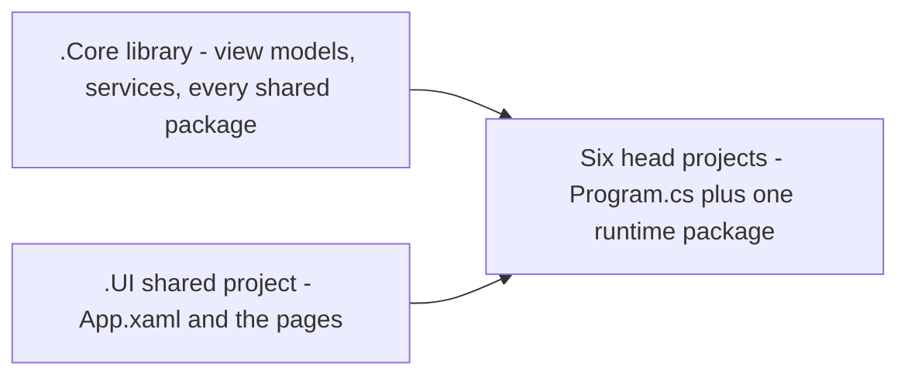

<sub>[CodeBrix](../../README.md) › Samples</sub>

# Samples

**Every sample is a complete, runnable application, not a snippet.** It opens files, talks to
networks, draws, renders, encodes or publishes, and it was built to show how the CodeBrix
libraries are meant to be consumed from a CodeBrix.Platform application. If you want to see how
something is actually done, open the application that does it and read the code beside its README.

The reference applications live in three repositories, split by the license the applications land
on. Each application folder is self-contained: it has its own solution, its own guide, its own
attribution record, and it consumes every library as a package rather than as a project reference.

## The three sample repositories

| Repository | What it holds | License |
| --- | --- | --- |
| [CodeBrix.Samples](https://github.com/ellisnet/CodeBrix.Samples) | The reference applications whose libraries are permissively licensed | Apache License, Version 2.0 |
| [CodeBrix.Samples.Gpl2](https://github.com/ellisnet/CodeBrix.Samples.Gpl2) | The classic-game applications | GNU General Public License, version 2 |
| [CodeBrix.Samples.Gpl3](https://github.com/ellisnet/CodeBrix.Samples.Gpl3) | The applications whose libraries land on GPL-3.0 | GNU General Public License, version 3 |

The split exists so that the licensing of one application never sets the terms for the rest. An
aggregate takes the narrower of the terms it combines, so an application that links a GPL-3.0
library is conveyed on those terms - and it lives in its own repository rather than making that
true of every other sample.

## What they look like

A few of the applications, captured on the Linux X11 head; each runs unchanged on the other five heads.

| | |
| --- | --- |
|  |  |
| **Doom.Brix** ([CodeBrix.Samples.Gpl2](#codebrixsamplesgpl2)) | **Fresco.Brix** ([CodeBrix.Samples.Gpl3](#codebrixsamplesgpl3)) |
|  |  |
| **Pinta.Brix** ([CodeBrix.Samples](#codebrixsamples)) | **PainDiagram** ([CodeBrix.Samples](#codebrixsamples)) |
|  | |
| **GitHubIssueFinder** ([CodeBrix.Samples](#codebrixsamples)) | |

## What every application has in common

The house style is the same everywhere. One shared view model layer and one shared XAML UI drive
every head, and each head is a thin project that supplies only its platform plumbing: a
`Program.cs` and the one runtime package for its windowing system.



The six CodeBrix.Platform heads are present in project form in most applications: LinuxX11,
LinuxWayland, LinuxFrameBuffer, MacOS, Win32Skia and WinWpfSkia. Three applications go further:
JustBetweenUs, PainDiagram and WikipediaPublisher additionally carry native WinUI 3 and WPF heads
that reuse the same view model without the CodeBrix.Platform UI stack, and JustBetweenUs adds a
.NET MAUI head, the only mobile head in the repository. Three go the other way: CodeBrixVideoTool,
GitHubIssueFinder and InannaRosette each build four of the six.

Libraries are consumed as packages, never as source references, so each application folder can be
opened and built on its own.

### The architecture the samples teach

A view model derived from `SimpleViewModel` owns the screen's state and behavior and exposes it as
bound properties and `SimpleCommand` commands. Code-behind stays thin and forwards only what a view
alone can do. Anything the view model needs from the platform - a file dialog, a canvas to
invalidate, the clipboard - arrives through a small bridge interface the page implements. Services
live behind interfaces and are resolved through `SimpleServiceResolver`. Work that takes time
happens off the UI thread and marshals its results back.

That shape is written out recipe by recipe in the [blueprints](blueprints.md), and taught from
first principles in [MVVM the right way](../platform/05-mvvm-the-right-way.md).

### Where an application's documentation lives

Every application folder has a `README.md`, the detailed guide to that application - what it does,
how it is laid out, what it uses, and what is worth studying in it - and a
`THIRD-PARTY-NOTICES.txt`, its attribution record. At the root of each repository, the blueprint
files collect the how-tos mined from all of the applications, and the root
`THIRD-PARTY-NOTICES.txt` points at the per-application ones.

### Building and running

Every application requires .NET 10 or later, and for most of them that is the only prerequisite.
Open the solution in the application's folder: most applications have a single `.slnx` there. The
exceptions are JustBetweenUs, which has three OS-specific `.sln` files
(`JustBetweenUs.Windows.sln`, `JustBetweenUs.Linux.sln`, `JustBetweenUs.MacOS.sln`) instead of a
`.slnx`, and PainDiagram and WikipediaPublisher, which each have a cross-platform `.slnx` plus a
`.Windows.slnx` that adds the native heads.

Windows-targeting heads compile elsewhere but run only on Windows: they target `net10.0-windows`
and set `EnableWindowsTargeting`, so a solution containing them still restores and builds on Linux
and macOS.

Some applications need more than that, and their own READMEs say exactly what: the .NET MAUI
workloads (JustBetweenUs); the WPE WebKit system packages for the Linux WebView
(WikipediaPublisher); a webcam (WebcamPainter, PalmVisualizer, WebcamViewer); network access for
the applications that download content; a Notion integration token (NotionDocumentCreator); ffmpeg
and ffprobe on the host for probing and conversion (CodeBrixVideoTool, and optionally
NotionDocumentCreator); a reachable Docker daemon (RedisSetupTool); and Pico's ps2000 driver with a
PicoScope 2204A attached for live traces, though PicoScope.Brix runs on its simulated device
without either.

### Running the tests

Test projects use the Microsoft.Testing.Platform runner, selected by `global.json` where an
application has one and by properties in the test csproj otherwise. Test assemblies are
self-executing binaries, and in practice a plain `dotnet test` can report that zero tests ran. When
it does, build the test project and run the executable it produces directly.

```bash
dotnet build tests/libs/<Project>.Tests/<Project>.Tests.csproj -c Release
./tests/libs/<Project>.Tests/bin/Release/net10.0/<Project>.Tests
```

Each application's README gives the working form for that application, along with what its
individual test projects need.

> [!NOTE]
> The Gpl2 games depend on data files that cannot be redistributed. Their data-dependent tests
> expect those files under `Downloaded/<App>_assets/` at the repository root, and `Downloaded/` is
> never committed. When the files are absent those tests either fail or skip with a message naming
> the exact path; each application's README gives the policy for its own suites. The tests that
> need no data always run.

## CodeBrix.Samples

The permissively licensed applications: media tooling, document publishing, 3D and imaging
browsers, computer vision and a full raster editor, an oscilloscope front end for a USB instrument,
a control panel for a container daemon, an unmodified Tcl/Tk program hosted in a page, a control
surface for the game engine's music system, a drag-and-drop card table that reads itself back
as prose and prints a hand-typeset vector PDF, and two one-capability skeletons - a video player
and a webcam viewer.

| Application | What it is | Headline libraries and add-ins | Source |
| --- | --- | --- | --- |
| CodeBrixVideoTool | Desktop video converter and player for AV1 media, with chapter and caption drop-downs, a resolution and quality ladder, and long conversions run with live progress and cancellation | [VideoPlayer](../platform/add-ins/VideoPlayer.md) add-in, [CodeBrix.VideoPlayback](../libraries/CodeBrix.VideoPlayback.md), [CodeBrix.VideoProcessing](../libraries/CodeBrix.VideoProcessing.md) | [CodeBrixVideoTool/](https://github.com/ellisnet/CodeBrix.Samples/tree/main/CodeBrixVideoTool) |
| DRAKON.Brix | A visual algorithm-language editor whose whole Tcl/Tk program runs unmodified on a managed Tcl interpreter and Tk toolkit inside one XAML page, generating source code in many target languages and exporting diagrams to PDF | [CodeBrix.Platform.TclTk](../libraries/CodeBrix.Platform.TclTk.md) with its extras and Tk toolkit packages | [DRAKON.Brix/](https://github.com/ellisnet/CodeBrix.Samples/tree/main/DRAKON.Brix) |
| GameEngineMusicDemo | Control surface for the game engine's music system: buses, fades and crossfades, bar-quantized transitions, adaptive stems, MIDI through SFZ and Decent Sampler instruments, ducking, stingers and a global pause, with every asset generated on first run | [CodeBrix.Platform.GameEngine](../libraries/CodeBrix.Platform.GameEngine.md), with [CodeBrix.Audio](../libraries/CodeBrix.Audio.md) writing the assets it plays | [GameEngineMusicDemo/](https://github.com/ellisnet/CodeBrix.Samples/tree/main/GameEngineMusicDemo) |
| GitHubIssueFinder | Finds the open issues and pull requests nobody has picked up across a GitHub user's or organization's public repositories, grouped by repository, paced to the anonymous API allowance with every wait shown on screen, in any of five switchable color schemes | The [FlexPanel](../platform/add-ins/FlexPanel.md) and [AppSettings](../platform/add-ins/AppSettings.md) add-ins | [GitHubIssueFinder/](https://github.com/ellisnet/CodeBrix.Samples/tree/main/GitHubIssueFinder) |
| InannaRosette | Forty-card oracle deck of Sumer and Akkad laid on a nine-station rosette spread by dragging cards onto its petals, read back as written prose and composed into a print-quality PDF whose card art, ornaments and embedded fonts are all vector | [CodeBrix.PdfDocuments](../libraries/CodeBrix.PdfDocuments.md), [CodeBrix.Platform.Fonts.Merriweather](../libraries/CodeBrix.Platform.Fonts.Merriweather.md), [CodeBrix.Platform](../libraries/CodeBrix.Platform.md) | [InannaRosette/](https://github.com/ellisnet/CodeBrix.Samples/tree/main/InannaRosette) |
| JustBetweenUs | Text-encryption utility (AES, Triple DES, Twofish), and the repository's "one view model, many heads" reference - the only application that also runs on mobile | [CodeBrix.Cryptography](../libraries/CodeBrix.Cryptography.md), [CodeBrix.SkiaSvg](../libraries/CodeBrix.SkiaSvg.md), [CodeBrix.Platform](../libraries/CodeBrix.Platform.md) with its WinUI, WPF and Mobile support | [JustBetweenUs/](https://github.com/ellisnet/CodeBrix.Samples/tree/main/JustBetweenUs) |
| KenneyAssetBrowser | Browser for downloaded Kenney game-asset packs: reads each zip without extracting it and previews images, SVG art, font specimens, Tiled maps, 3D models and audio | [CodeBrix.Compression](../libraries/CodeBrix.Compression.md), [CodeBrix.Imaging](../libraries/CodeBrix.Imaging.md), [CodeBrix.SkiaSvg](../libraries/CodeBrix.SkiaSvg.md); the [Graphics3DGL](../platform/add-ins/Graphics3DGL.md), [AudioPlayer](../platform/add-ins/AudioPlayer.md), [FlexPanel](../platform/add-ins/FlexPanel.md) and [AppSettings](../platform/add-ins/AppSettings.md) add-ins | [KenneyAssetBrowser/](https://github.com/ellisnet/CodeBrix.Samples/tree/main/KenneyAssetBrowser) |
| MediaPlayerDemo | One-page media player - an address box, a stretch picker and the element's own transport controls - and the smallest six-head skeleton here | [MediaPlayer](../platform/add-ins/MediaPlayer.md) add-in | [MediaPlayerDemo/](https://github.com/ellisnet/CodeBrix.Samples/tree/main/MediaPlayerDemo) |
| NotionDocumentCreator | Turns selected pages from a Notion workspace into a single print-ready, book-designed PDF | [CodeBrix.NotionApi](../libraries/CodeBrix.NotionApi.md), [CodeBrix.PdfDocuments](../libraries/CodeBrix.PdfDocuments.md), [CodeBrix.Imaging](../libraries/CodeBrix.Imaging.md), [CodeBrix.VideoProcessing](../libraries/CodeBrix.VideoProcessing.md) | [NotionDocumentCreator/](https://github.com/ellisnet/CodeBrix.Samples/tree/main/NotionDocumentCreator) |
| PainDiagram | Interactive pain- and symptom-mapping over a medical body map, drawn on three translucent highlighter layers and exported as a PNG | [CodeBrix.Imaging.Drawing](../libraries/CodeBrix.Imaging.Drawing.md) | [PainDiagram/](https://github.com/ellisnet/CodeBrix.Samples/tree/main/PainDiagram) |
| PalmVisualizer | Webcam toy whose shader-driven plasma and starfield visual chases the open palms a hand-tracking pipeline finds in the live camera feed | [CodeBrix.Platform.GameEngine](../libraries/CodeBrix.Platform.GameEngine.md), [CodeBrix.Platform.MediaPlayerCore](../libraries/CodeBrix.Platform.MediaPlayerCore.md) webcam capture, [CodeBrix.VideoProcessing.OpenCV5](../libraries/CodeBrix.VideoProcessing.OpenCV5.md) | [PalmVisualizer/](https://github.com/ellisnet/CodeBrix.Samples/tree/main/PalmVisualizer) |
| PdfSideBySide | Opens two PDF documents side by side and steps, zooms and nudges them together or independently, so two editions can be compared page by page | [CodeBrix.PdfDocuments](../libraries/CodeBrix.PdfDocuments.md) rasterizer, [CodeBrix.Imaging](../libraries/CodeBrix.Imaging.md) | [PdfSideBySide/](https://github.com/ellisnet/CodeBrix.Samples/tree/main/PdfSideBySide) |
| PicoScope.Brix | One-page oscilloscope front end that streams live traces from a PicoScope 2204A into a chart, falls back to a simulated device that enforces the real instrument's limits, and drives the ps2000 driver from one interop library on Linux and Windows | [CodeBrix.Plotter](../libraries/CodeBrix.Plotter.md) through the [PlotterView](../platform/add-ins/PlotterView.md) add-in | [PicoScope.Brix/](https://github.com/ellisnet/CodeBrix.Samples/tree/main/PicoScope.Brix) |
| Pinta.Brix | Layered raster painting and image editor - tools, selections, adjustments and effects with live preview, and a scrubbable history | [CodeBrix.Imaging](../libraries/CodeBrix.Imaging.md), [CodeBrix.SkiaSvg](../libraries/CodeBrix.SkiaSvg.md), [CodeBrix.PolygonTools](../libraries/CodeBrix.PolygonTools.md); the [AppSettings](../platform/add-ins/AppSettings.md) and [TextLayout](../platform/add-ins/TextLayout.md) add-ins | [Pinta.Brix/](https://github.com/ellisnet/CodeBrix.Samples/tree/main/Pinta.Brix) |
| PolyHavenBrowser | Catalog browser for the Poly Haven CC0 3D model library, with a lazily filled card grid, real-progress downloads, a live on-screen 3D preview and a generated one-page PDF | [Graphics3DGL](../platform/add-ins/Graphics3DGL.md) add-in, [CodeBrix.Imaging](../libraries/CodeBrix.Imaging.md), [CodeBrix.PdfDocuments](../libraries/CodeBrix.PdfDocuments.md); the [FlexPanel](../platform/add-ins/FlexPanel.md) add-in | [PolyHavenBrowser/](https://github.com/ellisnet/CodeBrix.Samples/tree/main/PolyHavenBrowser) |
| PolyHavenBrowser_viewer_only | Three curated Poly Haven samples - a PBR texture, an HDRI panorama and a glTF model - rendered off screen through a graphics backend the user can swap while the application runs, and composited onto one Skia canvas | [Graphics3DGL](../platform/add-ins/Graphics3DGL.md) add-in, [CodeBrix.Imaging](../libraries/CodeBrix.Imaging.md) | [PolyHavenBrowser_viewer_only/](https://github.com/ellisnet/CodeBrix.Samples/tree/main/PolyHavenBrowser_viewer_only) |
| RedisSetupTool | Desktop control panel for Redis on a local Docker daemon: a catalog of topologies stood up, verified and torn down, every container on the daemon managed, images, networks and volumes handled, and a real interactive shell opened inside a container | [CodeBrix.Docker](../libraries/CodeBrix.Docker.md), [CodeBrix.Redis](../libraries/CodeBrix.Redis.md); the [TerminalView](../platform/add-ins/TerminalView.md) add-in | [RedisSetupTool/](https://github.com/ellisnet/CodeBrix.Samples/tree/main/RedisSetupTool) |
| SimpleCbxVideoPlayer | Plays its bundled AV1 clips in Matroska, WebM and both CodeBrix Video container flavors straight through the playback library, and grades the picture with a chain of color lookup tables it can bake back out as one file | [CodeBrix.VideoPlayback](../libraries/CodeBrix.VideoPlayback.md) with its Skia presenter, [CodeBrix.VideoPlayback.Dav1d](../libraries/CodeBrix.VideoPlayback.Dav1d.md), [CodeBrix.Audio.Opus](../libraries/CodeBrix.Audio.Opus.md); the [Graphics3DGL](../platform/add-ins/Graphics3DGL.md) add-in | [SimpleCbxVideoPlayer/](https://github.com/ellisnet/CodeBrix.Samples/tree/main/SimpleCbxVideoPlayer) |
| WebcamPainter | Hand-gesture painting: grab a still from the webcam, then spread highlighter ink across it by moving an open palm in front of the camera | [CodeBrix.Platform.MediaPlayerCore](../libraries/CodeBrix.Platform.MediaPlayerCore.md) webcam capture, [CodeBrix.Imaging.Drawing](../libraries/CodeBrix.Imaging.Drawing.md), [CodeBrix.VideoProcessing.OpenCV5](../libraries/CodeBrix.VideoProcessing.OpenCV5.md) | [WebcamPainter/](https://github.com/ellisnet/CodeBrix.Samples/tree/main/WebcamPainter) |
| WebcamViewer | Live webcam viewer on a Skia surface with a camera picker, an audio-monitor switch and a Photo button that writes the current frame as a PNG - the smallest webcam skeleton here | [CodeBrix.Platform.MediaPlayerCore](../libraries/CodeBrix.Platform.MediaPlayerCore.md) webcam capture, [CodeBrix.Imaging](../libraries/CodeBrix.Imaging.md) | [WebcamViewer/](https://github.com/ellisnet/CodeBrix.Samples/tree/main/WebcamViewer) |
| WikipediaPublisher | Turns a Wikipedia article, chosen in an embedded WebView, into a book-designed print-ready PDF | [CodeBrix.MarkupParse](../libraries/CodeBrix.MarkupParse.md), [CodeBrix.Imaging](../libraries/CodeBrix.Imaging.md), [CodeBrix.PdfDocuments](../libraries/CodeBrix.PdfDocuments.md); the [WebView](../platform/add-ins/WebView.md) add-in | [WikipediaPublisher/](https://github.com/ellisnet/CodeBrix.Samples/tree/main/WikipediaPublisher) |

> [!TIP]
> Read [JustBetweenUs](https://github.com/ellisnet/CodeBrix.Samples/tree/main/JustBetweenUs) first
> if what you want to understand is the head model. It is the "one view model, many heads"
> reference: one `MainViewModel` under `Shared/ViewModels/` drives the six CodeBrix.Platform heads
> plus native WinUI and WPF heads and a .NET MAUI head, with the encryption work behind an injected
> `IEncryptionService` in its own library. The chapter on that is
> [Sharing code with native frameworks](../platform/14-sharing-code-with-native-frameworks.md).

## CodeBrix.Samples.Gpl2

The classic-game repository. Both applications run on CodeBrix.Platform and
[CodeBrix.Platform.GameEngine](../libraries/CodeBrix.Platform.GameEngine.md), which supplies the
fixed-rate game loop, the software framebuffer presenter and the game surface canvas, the input
pollers and the game audio channels. There is one codebase per game, and each codebase builds all
six heads.

| Application | What it is | Headline libraries and add-ins | Source |
| --- | --- | --- | --- |
| Doom.Brix | Plays the original DOOM shareware episode as a CodeBrix.Platform desktop application, with platform backends for video, sound, music and input | [CodeBrix.Platform](../libraries/CodeBrix.Platform.md), [CodeBrix.Platform.GameEngine](../libraries/CodeBrix.Platform.GameEngine.md) with its SDL2 add-on, the [WebView](../platform/add-ins/WebView.md) and [AppSettings](../platform/add-ins/AppSettings.md) add-ins, [CodeBrix.Audio](../libraries/CodeBrix.Audio.md), [CodeBrix.Compression](../libraries/CodeBrix.Compression.md) | [Doom.Brix/](https://github.com/ellisnet/CodeBrix.Samples.Gpl2/tree/main/Doom.Brix) |
| Wolfenstein.Brix | A playable recreation of the Wolfenstein 3D shareware episode, from the original game logic and data formats, with a bit-exact FM synthesizer for its music and effects | [CodeBrix.Platform](../libraries/CodeBrix.Platform.md), [CodeBrix.Platform.GameEngine](../libraries/CodeBrix.Platform.GameEngine.md) with its SDL2 add-on, the [WebView](../platform/add-ins/WebView.md) and [AppSettings](../platform/add-ins/AppSettings.md) add-ins, [CodeBrix.Compression](../libraries/CodeBrix.Compression.md) | [Wolfenstein.Brix/](https://github.com/ellisnet/CodeBrix.Samples.Gpl2/tree/main/Wolfenstein.Brix) |

Neither game ships its game data. On first launch each one opens its Assets Mode: an embedded
browser that downloads the original shareware release, verifies it against known checksums, and
unpacks it into a folder you choose. Every later launch re-verifies that folder and boots straight
into the game. That whole pipeline - the one-file download policy, the checksum check, the nested
archive extraction - is written up in the Gpl2 blueprints.

The engine internals are a plain object graph on the game-loop thread, and that is correct there.
The shell around each game - startup, Assets Mode, the download pipeline, settings and the page
itself - is ordinary MVVM.

## CodeBrix.Samples.Gpl3

One application, at full load: it hosts a long-running engine in process and uses the editor,
settings, PDF, audio and SVG libraries together.

| Application | What it is | Headline libraries and add-ins | Source |
| --- | --- | --- | --- |
| Fresco.Brix | A desktop music-notation editor and engraving environment: write music in the notation language in a language-aware code editor, engrave it in process, then read, play, annotate and export the score | [CodeBrix.LilyPort](../libraries/CodeBrix.LilyPort.md), [CodeBrix.Platform](../libraries/CodeBrix.Platform.md) with the [AdvancedTextEdit](../platform/add-ins/AdvancedTextEdit.md), [AppSettings](../platform/add-ins/AppSettings.md) and [CommandBar](../platform/add-ins/CommandBar.md) add-ins, [CodeBrix.Audio](../libraries/CodeBrix.Audio.md), [CodeBrix.SkiaSvg](../libraries/CodeBrix.SkiaSvg.md), [CodeBrix.PdfDocuments](../libraries/CodeBrix.PdfDocuments.md) rasterizing and writing PDFs | [Fresco.Brix/](https://github.com/ellisnet/CodeBrix.Samples.Gpl3/tree/main/Fresco.Brix) |

Its own sources are GPL-3.0-or-later; the application as conveyed is GPL-3.0-only, because the
CodeBrix.LilyPort library it links is conveyed on those terms and an aggregate takes the narrower
of the terms it combines.

Two details worth borrowing from it. A head accepts file paths on the command line, and if the
application is already running those files open as tabs in the running window while the second
process exits. And the programs under `tools/` are deliberately outside the solution: they ship
nothing, and they are built and run on demand.

## Samples inside CodeBrix.Platform

The CodeBrix.Platform repository carries its own samples, one per add-in plus a few that exercise
the platform itself. They are the shortest path from "what does this element do" to running code.
Nothing under `samples/` is packed into a package.

| Sample | What it shows | Source |
| --- | --- | --- |
| JustBetweenUs | The `.Core` + `.UI` + heads layout, dependency injection and view-model binding, with four add-ins on one page: [Lottie](../platform/add-ins/Lottie.md), [Svg](../platform/add-ins/Svg.md), [SkiaSharpViews](../platform/add-ins/SkiaSharpViews.md) and [Graphics2DSK](../platform/add-ins/Graphics2DSK.md) | [JustBetweenUs](https://github.com/ellisnet/CodeBrix.Platform/tree/main/samples/CodeBrixPlatform/JustBetweenUs) |
| EmulateFrameBufferDemo | The one sample that consumes CodeBrix.Platform from NuGet packages exactly as a real application does; a 3D pane, an off-screen browser pane and a sketch pad on one page, with the frame-buffer builder's orientation and auto-rotation options | [EmulateFrameBufferDemo](https://github.com/ellisnet/CodeBrix.Platform/tree/main/samples/CodeBrixPlatform/EmulateFrameBufferDemo) |
| ParityDemo | The X11-versus-Wayland behavior harness: popups and flyouts, clipboard, drag-and-drop and window chrome, with a live diagnostics log and four unattended self-test suites | [ParityDemo](https://github.com/ellisnet/CodeBrix.Platform/tree/main/samples/CodeBrixPlatform/ParityDemo) |
| FileFolderDialogDemo | `FileOpenPicker`, `FileSavePicker` and `FolderPicker` on every head, with start locations, file-type filters, multi-select and writing to a picked file | [FileFolderDialogDemo](https://github.com/ellisnet/CodeBrix.Platform/tree/main/samples/CodeBrixPlatform/FileFolderDialogDemo) |
| AdvancedTextEditDemo | A working code editor on the [AdvancedTextEdit](../platform/add-ins/AdvancedTextEdit.md) add-in: open and save, undo and redo, a syntax-highlighting selector, line numbers, word wrap and end-of-line marks | [AdvancedTextEditDemo](https://github.com/ellisnet/CodeBrix.Platform/tree/main/samples/CodeBrixPlatform/AdvancedTextEditDemo) |
| AudioPlayerDemo | The [AudioPlayer](../platform/add-ins/AudioPlayer.md) add-in: a song player over five formats and two source schemes, sound effects, and a MIDI pane that plays one piece through either a sampled SFZ instrument or a Decent Sampler preset, with a slider on the preset's first knob, an MPE drop-down and a beat readout | [AudioPlayerDemo](https://github.com/ellisnet/CodeBrix.Platform/tree/main/samples/CodeBrixPlatform/AudioPlayerDemo) |
| CommandBarDemo | A score editor's two tool bars in one tray on the [CommandBar](../platform/add-ins/CommandBar.md) add-in: groups with automatic separators, a filling spacer, plain, toggle and drop-down buttons, inline combo boxes, chevron overflow, SVG and raster icons, and check boxes that change the bar-level label and tooltip settings while the window is open | [CommandBarDemo](https://github.com/ellisnet/CodeBrix.Platform/tree/main/samples/CodeBrixPlatform/CommandBarDemo) |
| VideoPlayerDemo | The [VideoPlayer](../platform/add-ins/VideoPlayer.md) add-in: sample clips in several container forms, transport bound to `PositionSeconds`, a render-path selector and a chapter list | [VideoPlayerDemo](https://github.com/ellisnet/CodeBrix.Platform/tree/main/samples/CodeBrixPlatform/VideoPlayerDemo) |
| FlexPanelDemo | A live playground for the [FlexPanel](../platform/add-ins/FlexPanel.md) add-in: direction, justification, alignment and wrap drop-downs re-lay-out eight children, plus attached order, grow, align-self and basis | [FlexPanelDemo](https://github.com/ellisnet/CodeBrix.Platform/tree/main/samples/CodeBrixPlatform/FlexPanelDemo) |
| MediaPlayerDemo | The [MediaPlayer](../platform/add-ins/MediaPlayer.md) add-in: a URL box, a load button and a stretch selector over a `MediaPlayerElement` with transport controls | [MediaPlayerDemo](https://github.com/ellisnet/CodeBrix.Platform/tree/main/samples/CodeBrixPlatform/MediaPlayerDemo) |
| PlotterViewDemo | A chart gallery on the [PlotterView](../platform/add-ins/PlotterView.md) add-in - live streaming signal, function series, bar, scatter, heat map and pie - with the full pan, zoom and tracker interaction model | [PlotterViewDemo](https://github.com/ellisnet/CodeBrix.Platform/tree/main/samples/CodeBrixPlatform/PlotterViewDemo) |
| TerminalViewDemo | The [TerminalView](../platform/add-ins/TerminalView.md) add-in: local echo, an ANSI and SGR feature tour, a color-scheme selector, a live grid-size readout, and selection with copy and paste | [TerminalViewDemo](https://github.com/ellisnet/CodeBrix.Platform/tree/main/samples/CodeBrixPlatform/TerminalViewDemo) |
| WebViewDemo | The [WebView](../platform/add-ins/WebView.md) add-in: address box with back and forward, plus download handling that reports the resolved target path and shows where to accept, redirect or cancel | [WebViewDemo](https://github.com/ellisnet/CodeBrix.Platform/tree/main/samples/CodeBrixPlatform/WebViewDemo) |

Run any of them from the repository root. Samples with a `src/` layout take the second form.

```bash
dotnet run --project samples/CodeBrixPlatform/<Demo>/<Demo>.LinuxX11
dotnet run --project samples/CodeBrixPlatform/<Demo>/src/<Demo>.LinuxX11   # src/ layout
```

A few of them need something from the host. The browser panes in EmulateFrameBufferDemo and
WebViewDemo need the system WPE WebKit runtime on Linux, and MediaPlayerDemo needs the system
libvlc on Linux.

```bash
sudo apt install libwpewebkit-2.0-1 libwpebackend-fdo-1.0-1 libwpe-1.0-1
sudo apt install libvlc5 vlc-plugin-base
```

On Windows, MediaPlayerDemo's heads carry a
[VideoLAN.LibVLC.Windows](https://www.nuget.org/packages/VideoLAN.LibVLC.Windows) package reference
that lays the native runtime into the application output; the macOS head uses the platform's
built-in AVFoundation support. VideoPlayerDemo - the demo, never the add-in - references
[CodeBrix.VideoPlayback.Dav1d.BsdLicenseForever](https://www.nuget.org/packages/CodeBrix.VideoPlayback.Dav1d.BsdLicenseForever)
and
[CodeBrix.Audio.Opus.BsdLicenseForever](https://www.nuget.org/packages/CodeBrix.Audio.Opus.BsdLicenseForever)
and calls both `Register()` methods at startup.

There is one more sample outside that folder:
[samples/Platforms/JustBetweenUs](https://github.com/ellisnet/CodeBrix.Platform/tree/main/samples/Platforms/JustBetweenUs)
builds the same encrypt-and-decrypt application on Microsoft's own UI frameworks - a WinUI head, a
WPF head and a .NET MAUI head, all sharing `Shared/ViewModels` and the same encryption library. It
builds on Windows only.

## Third-party notices

Each application folder carries its own `THIRD-PARTY-NOTICES.txt`, and that file is the
authoritative record for that application: the bundled fonts, models and sample assets it ships and
the content it fetches at run time. The root `THIRD-PARTY-NOTICES.txt` in each repository is a
pointer to them. Third-party code arrives as packages, and each package carries its own notices.

The Gpl2 games go one step further and copy those files into a `ThirdPartyAssets` folder in the
build output, so a shipped build carries its own attribution.

---

**Where to go next**

- [Blueprints](blueprints.md) - the task-by-task index into every recipe these applications teach
- [Reference applications](../platform/13-reference-applications.md) - the guide chapter that walks through them
- [Build a CodeBrix.Platform application](../platform/README.md) - the curriculum, from first page to shipped build
- [The library catalog](../libraries/README.md) - every standalone library the samples consume
